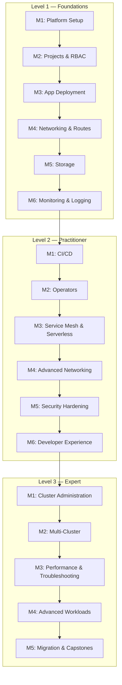

# OpenShift Tutorial

[](LICENSE)
[](https://www.redhat.com/en/technologies/cloud-computing/openshift)
[](https://kubernetes.io/)

> A comprehensive, three-level tutorial for developers and DevOps engineers who already know Kubernetes and want to master OpenShift.

Every lesson starts from a Kubernetes concept you already know, then shows the OpenShift equivalent — what it adds, what it restricts, and why. 68 hands-on lessons, 500+ YAML manifests, structured across three progressive difficulty levels.

## Features

- **K8s-first approach** — each topic bridges from what you know in vanilla Kubernetes to the OpenShift way
- **Three progressive levels** — Foundations, Practitioner, and Expert, from 20-minute intro lessons to 2-hour production capstones
- **Fully hands-on** — every lesson includes manifests, CLI commands, and verification steps you can run on OpenShift Local (CRC)
- **Self-contained lessons** — each lesson has its own README, manifests, scripts, and cleanup instructions
- **Real-world workflows** — CI/CD pipelines with Tekton + ArgoCD, service mesh, operators, multi-cluster management
- **Production patterns** — security hardening, disaster recovery, performance tuning, compliance scanning

## Architecture



## Quick Start

### Prerequisites

- **Hardware**: 4+ CPUs, 16+ GB RAM, 35+ GB free disk space
- **Knowledge**: Solid understanding of Kubernetes (Deployments, Services, Ingress, RBAC, etc.)
- **Tools**: `oc` CLI, [OpenShift Local (CRC)](https://crc.dev/crc/)

### Installation

```bash
# Clone the repository
git clone https://github.com/lukaskellerstein/openshift-tutorial.git
cd openshift-tutorial

# Install and start OpenShift Local
crc setup
crc start

# Configure the CLI
eval $(crc oc-env)

# Log in
oc login -u developer -p developer https://api.crc.testing:6443
```

### Start Learning

Open `tutorial/level_1/M1_platform_setup/1_architecture_overview/README.md` and follow the instructions. Each lesson links to the next.

## Curriculum Overview

### Level 1 — Foundations (~20-30 min per lesson)

| Module | Topics | Lessons |
|--------|--------|:-------:|
| **M1: Platform Setup** | Architecture, CRC install, `oc` vs `kubectl`, Web Console | 4 |
| **M2: Projects & RBAC** | Projects vs Namespaces, OAuth, RBAC, SCCs | 4 |
| **M3: App Deployment** | `oc new-app`, S2I, BuildConfigs, ImageStreams, Templates | 5 |
| **M4: Networking** | Services, Routes vs Ingress, TLS, Network Policies | 4 |
| **M5: Storage** | PVs/PVCs, ODF, ConfigMaps & Secrets | 3 |
| **M6: Monitoring** | Prometheus/Grafana, Alerts, Logging, Debugging | 4 |

### Level 2 — Practitioner (~45-90 min per lesson)

| Module | Topics | Lessons |
|--------|--------|:-------:|
| **M1: CI/CD** | Tekton Pipelines, Build-Test-Deploy, ArgoCD GitOps | 4 |
| **M2: Operators** | OLM, OperatorHub, Database Operators, Building Operators | 4 |
| **M3: Service Mesh & Serverless** | Istio, Canary Deployments, Knative, Event-Driven | 4 |
| **M4: Advanced Networking** | Egress/Ingress Control, Multi-Cluster, Load Balancing | 3 |
| **M5: Security** | Image Security, Pod Security, Secrets, Compliance | 4 |
| **M6: Developer Experience** | Dev Spaces, odo, Helm, Autoscaling | 4 |

### Level 3 — Expert (~30 min - 2 hr per lesson)

| Module | Topics | Lessons |
|--------|--------|:-------:|
| **M1: Cluster Admin** | Installation Methods, Upgrades, Node Management, etcd | 5 |
| **M2: Multi-Cluster** | RHACM, Observability, Multi-Cluster GitOps, Edge | 4 |
| **M3: Performance** | Tuning, Troubleshooting, Disaster Recovery, Cost | 4 |
| **M4: Advanced Workloads** | Virtualization (KubeVirt), AI/ML, Stateful, Batch/HPC | 4 |
| **M5: Migration & Capstones** | K8s Migration, Legacy Apps, Production Capstones | 4 |

See [`tutorial_syllabus.md`](tutorial_syllabus.md) for the complete syllabus with detailed descriptions.

## K8s vs OpenShift at a Glance

| Concept | Kubernetes | OpenShift |
|---------|-----------|-----------|
| Namespace | `Namespace` | `Project` (superset with RBAC defaults) |
| Ingress | `Ingress` + install a controller | `Route` (built-in HAProxy) |
| CI/CD | External (Jenkins, GitHub Actions) | Tekton Pipelines (built-in) |
| GitOps | Install ArgoCD yourself | OpenShift GitOps operator |
| Monitoring | Install Prometheus yourself | Pre-installed Prometheus + Grafana |
| Pod Security | Pod Security Admission | SCCs (more granular) |
| Builds | External (Docker, Kaniko) | BuildConfig + S2I (built-in) |
| CLI | `kubectl` | `oc` (superset of `kubectl`) |
| Web UI | Dashboard (basic) | Full Console (Admin + Dev views) |
| Operators | Install OLM yourself | OLM + OperatorHub pre-installed |

For the full 85+ resource comparison, see [`k8s_vs_openshift.md`](k8s_vs_openshift.md).

## Project Structure

```
tutorial_syllabus.md                  # Master syllabus
k8s_vs_openshift.md                   # Full K8s ↔ OpenShift resource mapping
tutorial/
  level_1/                            # Foundations (~20-30 min lessons)
    M1_platform_setup/
    M2_projects_users_rbac/
    M3_application_deployment/
    M4_networking_routes/
    M5_storage/
    M6_monitoring_logging/
  level_2/                            # Practitioner (~45-90 min lessons)
    M1_cicd/
    M2_operators/
    M3_service_mesh_serverless/
    M4_advanced_networking/
    M5_security_hardening/
    M6_developer_experience/
  level_3/                            # Expert (30 min - 2 hr lessons)
    M1_cluster_administration/
    M2_multi_cluster/
    M3_performance_troubleshooting/
    M4_advanced_workloads/
    M5_migration_capstones/
```

Each lesson directory contains:

```
N_lesson_name/
  README.md             # Lesson guide with explanation, steps, expected output
  manifests/            # YAML manifests (Deployments, Routes, BuildConfigs, etc.)
  scripts/              # Shell scripts for setup, teardown, demos
  app/                  # Application source code (if applicable)
```

## Environment Options

| Environment | Cost | Use Case |
|-------------|------|----------|
| [OpenShift Local (CRC)](https://crc.dev/crc/) | Free | Local development, full cluster |
| [Red Hat Developer Sandbox](https://developers.redhat.com/developer-sandbox) | Free | Cloud-based, no install needed |

### Default Users (CRC)

| User | Password | Role |
|------|----------|------|
| `kubeadmin` | *(shown during `crc start`)* | Cluster admin |
| `developer` | `developer` | Regular user |

### Key URLs (CRC)

| Service | URL |
|---------|-----|
| API Server | `https://api.crc.testing:6443` |
| Web Console | `https://console-openshift-console.apps-crc.testing` |

## Contributing

Contributions are welcome! Please follow these guidelines:

1. Fork the repository
2. Create a feature branch (`git checkout -b feature/new-lesson`)
3. Follow the lesson structure defined in the syllabus
4. Include manifests, verification steps, and cleanup instructions
5. Submit a pull request

## Resources

- [OpenShift Documentation](https://docs.openshift.com/)
- [Red Hat Developer Sandbox](https://developers.redhat.com/developer-sandbox) (free cloud cluster)
- [OpenShift Interactive Learning](https://learn.openshift.com/)
- [Operator SDK](https://sdk.operatorframework.io/)
- [CRC (OpenShift Local)](https://crc.dev/crc/)

## License

This project is licensed under the MIT License — see the [LICENSE](LICENSE) file for details.
