# OpenShift Tutorial

[](LICENSE)
[](https://www.redhat.com/en/technologies/cloud-computing/openshift)
[](https://kubernetes.io/)

> A project-based OpenShift tutorial for developers who already know Kubernetes. One app, ten lessons, ~8 hours.

You know Kubernetes. You use Traefik, Keycloak, and vanilla K8s. Now you want to understand OpenShift — not every feature, but the ones that matter for running real microservices. Each lesson adds an OpenShift capability to the same "ShopInsights" application. By the end, you have a production-ready microservices platform with Routes, Service Mesh, CI/CD, GitOps, monitoring, and serverless.

## Features

- **K8s-first approach** — each topic bridges from what you know in vanilla Kubernetes to the OpenShift way
- **Project-based** — one application (ShopInsights) evolves across all 10 lessons
- **Fully hands-on** — every lesson includes manifests, CLI commands, and verification steps you can run on OpenShift Local (CRC)
- **Self-contained lessons** — each lesson has its own README, manifests, scripts, and cleanup instructions
- **Real-world workflows** — CI/CD pipelines with Tekton, GitOps with ArgoCD, service mesh, monitoring, and serverless

## Architecture

```mermaid
graph LR
    L01[L01: Deploy] --> L02[L02: Routes]
    L02 --> L03[L03: Service Mesh]
    L03 --> L04[L04: Builds & Images]
    L04 --> L05[L05: Projects]
    L05 --> L06[L06: Auth & Identity]
    L06 --> L07[L07: Monitoring]
    L07 --> L08[L08: CI/CD]
    L08 --> L09[L09: GitOps]
    L09 --> L10[L10: Serverless]
```



## Quick Start

### Prerequisites

- **Hardware**: 4+ CPUs, 16+ GB RAM, 35+ GB free disk space
- **Knowledge**: Solid understanding of Kubernetes (Deployments, Services, Ingress, RBAC, etc.)
- **Tools**: `oc` CLI, [OpenShift Local (CRC)](https://crc.dev/crc/)

### Installation

```bash
# Clone the repository
git clone https://github.com/lukaskellerstein/openshift-tutorial.git
cd openshift-tutorial

# Install and start OpenShift Local
crc setup
crc start

# Configure the CLI
eval $(crc oc-env)

# Log in
oc login -u developer -p developer https://api.crc.testing:6443
```

### Start Learning

Open [`tutorial/L01_deploy_microservices/README.md`](tutorial/L01_deploy_microservices/) and follow the instructions. Each lesson links to the next.

## Lessons

| # | Lesson | Duration | What You'll Learn |
|---|--------|----------|-------------------|
| 01 | [Deploy the Microservices Stack](tutorial/L01_deploy_microservices/) | 1 hr | Deploy 3 services + UI with health probes, resource limits, ConfigMaps, Secrets. The SCC "no root" gotcha. |
| 02 | [Expose Services Externally](tutorial/L02_expose_externally/) | 45 min | Routes with TLS. **Is Route a replacement for Traefik? Yes.** |
| 03 | [Service Mesh with Istio](tutorial/L03_service_mesh/) | 1 hr | Envoy sidecars, mTLS, canary deployments, Kiali observability, circuit breakers. |
| 04 | [Build & Image Resources](tutorial/L04_builds_and_images/) | 1 hr | BuildConfig, S2I, ImageStreams — the cluster builds your code. Internal registry. |
| 05 | [Projects](tutorial/L05_projects/) | 20 min | Projects vs Namespaces. Multi-environment setup (dev + staging). |
| 06 | [Authentication & Authorization](tutorial/L06_auth_and_identity/) | 45 min | OAuth, users, RBAC. **Is OAuth a replacement for Keycloak? For cluster auth, yes.** |
| 07 | [Monitoring & Logging](tutorial/L07_monitoring_and_logging/) | 1 hr | Custom Prometheus metrics from Python, ServiceMonitor, alerts, log forwarding. |
| 08 | [CI/CD Pipeline](tutorial/L08_cicd_pipeline/) | 1 hr 15 min | Tekton pipeline: GitHub → test → build → push to GHCR → deploy. |
| 09 | [GitOps with ArgoCD](tutorial/L09_gitops/) | 1 hr | ArgoCD, Kustomize overlays, drift detection, auto-heal. |
| 10 | [Serverless](tutorial/L10_serverless/) | 45 min | Knative, scale-to-zero, cold starts, eventing. |

**Total:** ~8 hours

## K8s vs OpenShift at a Glance

| Concept | Kubernetes | OpenShift |
|---------|-----------|-----------|
| Namespace | `Namespace` | `Project` (superset with RBAC defaults) |
| Ingress | `Ingress` + install a controller | `Route` (built-in HAProxy) |
| CI/CD | External (Jenkins, GitHub Actions) | Tekton Pipelines (built-in) |
| GitOps | Install ArgoCD yourself | OpenShift GitOps operator |
| Monitoring | Install Prometheus yourself | Pre-installed Prometheus + Grafana |
| Pod Security | Pod Security Admission | SCCs (more granular) |
| Builds | External (Docker, Kaniko) | BuildConfig + S2I (built-in) |
| CLI | `kubectl` | `oc` (superset of `kubectl`) |
| Web UI | Dashboard (basic) | Full Console (Admin + Dev views) |
| Operators | Install OLM yourself | OLM + OperatorHub pre-installed |

For the full 85+ resource comparison, see [`k8s_vs_openshift.md`](k8s_vs_openshift.md).

## Project Structure

```
tutorial/
  README.md                        # Tutorial overview
  shared_app/                      # Application source code
    products-service/
    orders-service/
    analytics-service/
    dashboard-ui/
  L01_deploy_microservices/        # Lesson directories
  L02_expose_externally/
  L03_service_mesh/
  L04_builds_and_images/
  L05_projects/
  L06_auth_and_identity/
  L07_monitoring_and_logging/
  L08_cicd_pipeline/
  L09_gitops/
  L10_serverless/
k8s_vs_openshift.md                # Full K8s ↔ OpenShift resource mapping
tutorial_syllabus.md               # Original comprehensive syllabus (reference)
```

Each lesson directory contains:

```
LNN_lesson_name/
  README.md             # Lesson guide with explanation, steps, expected output
  manifests/            # YAML manifests (Deployments, Routes, BuildConfigs, etc.)
  scripts/              # Shell scripts for setup, teardown, demos
```

## Environment Options

| Environment | Cost | Use Case |
|-------------|------|----------|
| [OpenShift Local (CRC)](https://crc.dev/crc/) | Free | Local development, full cluster |
| [Red Hat Developer Sandbox](https://developers.redhat.com/developer-sandbox) | Free | Cloud-based, no install needed |

### Default Users (CRC)

| User | Password | Role |
|------|----------|------|
| `kubeadmin` | *(shown during `crc start`)* | Cluster admin |
| `developer` | `developer` | Regular user |

### Key URLs (CRC)

| Service | URL |
|---------|-----|
| API Server | `https://api.crc.testing:6443` |
| Web Console | `https://console-openshift-console.apps-crc.testing` |

## Contributing

Contributions are welcome! Please follow these guidelines:

1. Fork the repository
2. Create a feature branch (`git checkout -b feature/new-lesson`)
3. Follow the lesson structure defined in the syllabus
4. Include manifests, verification steps, and cleanup instructions
5. Submit a pull request

## Resources

- [OpenShift Documentation](https://docs.openshift.com/)
- [Red Hat Developer Sandbox](https://developers.redhat.com/developer-sandbox) (free cloud cluster)
- [OpenShift Interactive Learning](https://learn.openshift.com/)
- [Operator SDK](https://sdk.operatorframework.io/)
- [CRC (OpenShift Local)](https://crc.dev/crc/)

## License

This project is licensed under the MIT License — see the [LICENSE](LICENSE) file for details.
