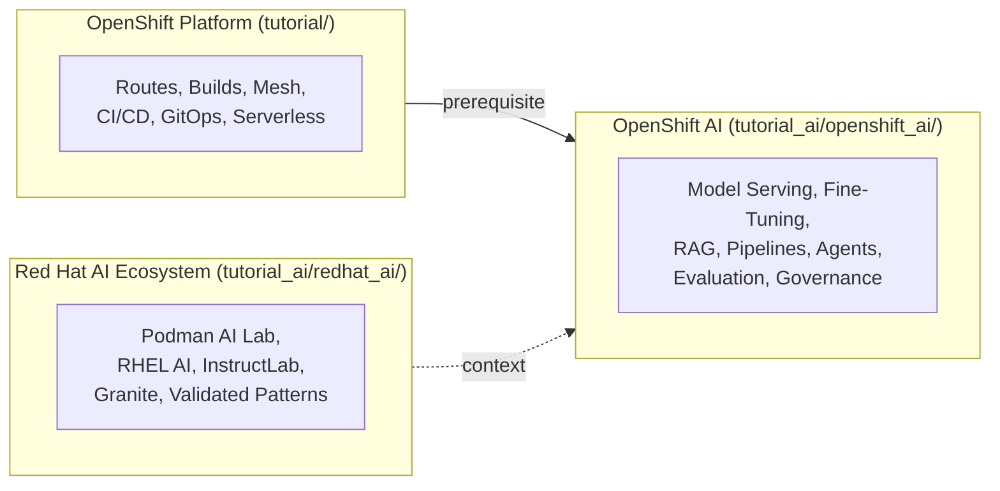
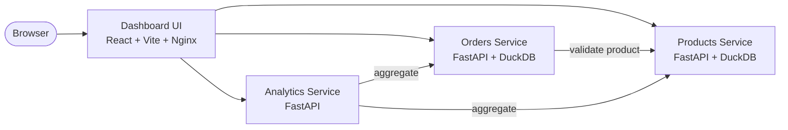
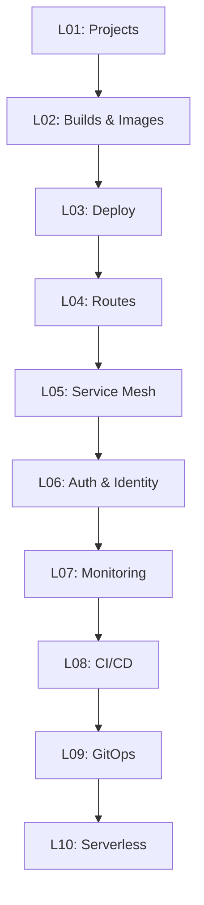

# OpenShift Tutorial

[](LICENSE)
[](https://www.redhat.com/en/technologies/cloud-computing/openshift)
[](https://kubernetes.io/)

> A project-based OpenShift tutorial for developers who already know Kubernetes. Three tracks — platform, AI, and ecosystem — from first `oc login` to production AI serving.

This repo contains three tutorial tracks that build on each other:

| Track | Directory | Lessons | Duration | What It Covers |
|-------|-----------|---------|----------|----------------|
| **OpenShift Platform** | [`tutorial/`](tutorial/) | 10 | ~8 hrs | Routes, Service Mesh, CI/CD, GitOps, monitoring, serverless — one app (ShopInsights) across all lessons |
| **OpenShift AI** | [`tutorial_ai/openshift_ai/`](tutorial_ai/openshift_ai/) | 66 | ~56-67 hrs | Model serving (KServe/vLLM), fine-tuning, RAG, pipelines, agents, evaluation — on the OpenShift AI platform |
| **Red Hat AI Ecosystem** | [`tutorial_ai/redhat_ai/`](tutorial_ai/redhat_ai/) | 15 | ~11-15 hrs | Podman AI Lab, RHEL AI, InstructLab, Granite models, Validated Patterns — the full Red Hat AI stack |

Start with the **Platform** track if you're new to OpenShift. The **AI** tracks assume Platform knowledge and focus on ML/LLM workloads.

## Features

- **K8s-first approach** — every topic bridges from what you know in vanilla Kubernetes to the OpenShift way
- **Project-based** — the Platform track builds one application (ShopInsights) across all 10 lessons; the AI track deploys and serves real models
- **Fully hands-on** — every lesson includes manifests, CLI commands, and verification steps
- **Self-contained lessons** — each lesson has its own README, manifests, scripts, and cleanup instructions
- **Desktop to cluster** — the Red Hat AI track covers the full journey from Podman AI Lab (laptop) through RHEL AI (server) to OpenShift AI (cluster)

## Architecture

### Tutorial Tracks



### ShopInsights Application (Platform Track)

The Platform track builds and deploys **ShopInsights** — a microservices e-commerce analytics stack with Python (FastAPI) backends and a React dashboard.



### Platform Lesson Progression

Each lesson adds an OpenShift capability on top of the same application:



## Quick Start

### Prerequisites

- **Knowledge**: Solid understanding of Kubernetes (Deployments, Services, Ingress, RBAC, etc.)
- **Tools**: `oc` CLI installed ([download](https://mirror.openshift.com/pub/openshift-v4/clients/ocp/latest/))
- **Cluster**: [Red Hat Developer Sandbox](https://sandbox.redhat.com/) (recommended, free, no install) or [OpenShift Local (CRC)](https://crc.dev/crc/)

### Setup

```bash
# Clone the repository
git clone https://github.com/lukaskellerstein/openshift-tutorial.git
cd openshift-tutorial
```

#### Option A: Red Hat Developer Sandbox (recommended)

1. Sign up at [sandbox.redhat.com](https://sandbox.redhat.com/) and launch your sandbox
2. In the web console, click your username (top-right) → **Copy login command** → **Display Token**
3. Run the `oc login` command it gives you:

```bash
oc login --token=sha256~XXXXX --server=https://api.sandbox-xxx.openshiftapps.com:6443
```

> **Important:** Sandbox tokens expire daily. Each day before you start a lesson, repeat step 2-3 to get a fresh token. If `oc` commands fail with `Unauthorized` or `error: You must be logged in to the server`, you need a new token.

#### Option B: OpenShift Local (CRC)

```bash
crc setup
crc start
eval $(crc oc-env)
oc login -u developer -p developer https://api.crc.testing:6443
```

> Some lessons (L05, L08, L09, L10) install operators that require cluster-admin. These work on CRC but not on the Sandbox.

### Start Learning

- **Platform track:** Open [`tutorial/L01_projects/README.md`](tutorial/L01_projects/) and follow the instructions. Each lesson links to the next.
- **OpenShift AI track:** See [`tutorial_ai/openshift_ai/syllabus.md`](tutorial_ai/openshift_ai/syllabus.md) — requires the [Red Hat Demo Platform](https://catalog.demo.redhat.com/) (GPU cluster with admin access).
- **Red Hat AI Ecosystem:** See [`tutorial_ai/redhat_ai/`](tutorial_ai/redhat_ai/) — starts with Podman AI Lab on your laptop.

## Platform Lessons

| # | Lesson | Duration | What You'll Learn |
|---|--------|----------|-------------------|
| 01 | [Projects](tutorial/L01_projects/) | 20 min | Projects vs Namespaces. Create the ShopInsights project, multi-environment setup (dev + staging). |
| 02 | [Build & Image Resources](tutorial/L02_builds_and_images/) | 1 hr | BuildConfig, S2I, ImageStreams — the cluster builds your code. Internal registry. |
| 03 | [Deploy the Microservices Stack](tutorial/L03_deploy_microservices/) | 45 min | Deploy 3 services + UI from ImageStreams with health probes, resource limits, ConfigMaps, Secrets. The SCC "no root" gotcha. |
| 04 | [Expose Services Externally](tutorial/L04_expose_externally/) | 45 min | Routes with TLS. **Is Route a replacement for Traefik? Yes.** |
| 05 | [Service Mesh with Istio](tutorial/L05_service_mesh/) | 1 hr | Istio ambient mode, mTLS, canary deployments, Kiali observability, circuit breakers. |
| 06 | [Authentication & Authorization](tutorial/L06_auth_and_identity/) | 45 min | OAuth, users, RBAC. **Is OAuth a replacement for Keycloak? For cluster auth, yes.** |
| 07 | [Monitoring & Logging](tutorial/L07_monitoring_and_logging/) | 1 hr | Custom Prometheus metrics from Python, ServiceMonitor, alerts, log forwarding. |
| 08 | [CI/CD Pipeline](tutorial/L08_cicd_pipeline/) | 1 hr 15 min | Tekton pipeline: GitHub → test → build → push to GHCR → deploy. |
| 09 | [GitOps with ArgoCD](tutorial/L09_gitops/) | 1 hr | ArgoCD, Kustomize overlays, drift detection, auto-heal. |
| 10 | [Serverless](tutorial/L10_serverless/) | 45 min | Knative, scale-to-zero, cold starts, eventing. |

**Total:** ~8 hours

## K8s vs OpenShift at a Glance

| Concept | Kubernetes | OpenShift |
|---------|-----------|-----------|
| Namespace | `Namespace` | `Project` (superset with RBAC defaults) |
| Ingress | `Ingress` + install a controller | `Route` (built-in HAProxy) |
| CI/CD | External (Jenkins, GitHub Actions) | Tekton Pipelines (built-in) |
| GitOps | Install ArgoCD yourself | OpenShift GitOps operator |
| Monitoring | Install Prometheus yourself | Pre-installed Prometheus + Grafana |
| Pod Security | Pod Security Admission | SCCs (more granular) |
| Builds | External (Docker, Kaniko) | BuildConfig + S2I (built-in) |
| CLI | `kubectl` | `oc` (superset of `kubectl`) |
| Web UI | Dashboard (basic) | Full Console (Admin + Dev views) |
| Operators | Install OLM yourself | OLM + OperatorHub pre-installed |

For the full 85+ resource comparison, see [`k8s_vs_openshift.md`](k8s_vs_openshift.md).

## Project Structure

```
├── tutorial/                              # Platform track (10 lessons, ~8 hrs)
│   ├── shared_app/                        #   ShopInsights application source
│   │   ├── products-service/              #     FastAPI + DuckDB
│   │   ├── orders-service/                #     FastAPI + DuckDB
│   │   ├── analytics-service/             #     FastAPI aggregation layer
│   │   └── dashboard-ui/                  #     React + Vite + Tailwind
│   ├── L01_projects/                      #   Lesson directories (each with
│   ├── L02_builds_and_images/             #     README.md, manifests/, scripts/)
│   ├── ...
│   └── L10_serverless/
├── tutorial_ai/
│   ├── openshift_ai/                      # OpenShift AI track (66 lessons, ~56-67 hrs)
│   │   ├── syllabus.md                    #   3 levels: platform → serving → production
│   │   ├── manifests/                     #   Working manifests (KServe, vLLM, etc.)
│   │   ├── level_1/                       #   Foundations: setup, serving, fine-tuning
│   │   ├── level_2/                       #   Practitioner: RAG, agents, pipelines
│   │   └── level_3/                       #   Expert: governance, evaluation, production
│   ├── redhat_ai/                         # Red Hat AI Ecosystem track (15 lessons, ~11-15 hrs)
│   │   ├── syllabus.md                    #   2 levels: ecosystem → deep dives
│   │   ├── level_1/                       #   Foundations: Podman AI Lab, RHEL AI, Granite
│   │   └── level_2/                       #   Practitioner: InstructLab, cross-tier workflows
│   └── README.md                          # AI tutorial overview and environment setup
└── k8s_vs_openshift.md                    # Full K8s ↔ OpenShift resource mapping (85+ resources)
```

## Environment Options

| Environment | Cost | Tracks | Cluster Admin | GPU |
|-------------|------|--------|:-------------:|:---:|
| [Red Hat Developer Sandbox](https://sandbox.redhat.com/) | Free | Platform | No | No |
| [OpenShift Local (CRC)](https://crc.dev/crc/) | Free | Platform | Yes | No |
| [Red Hat Demo Platform](https://catalog.demo.redhat.com/) | Free | OpenShift AI | Yes | Yes |
| Podman Desktop | Free | Red Hat AI Ecosystem | N/A | Optional |

- **Platform track:** Sandbox is the fastest start (no install). CRC gives cluster-admin for operator lessons.
- **OpenShift AI track:** Requires the Red Hat Demo Platform — a pre-configured cluster with GPUs and full admin access.
- **Red Hat AI Ecosystem:** Starts locally with Podman Desktop and Podman AI Lab.

## Contributing

Contributions are welcome! Please follow these guidelines:

1. Fork the repository
2. Create a feature branch (`git checkout -b feature/new-lesson`)
3. Follow the lesson structure defined in the syllabus
4. Include manifests, verification steps, and cleanup instructions
5. Submit a pull request

## Resources

- [OpenShift Documentation](https://docs.openshift.com/)
- [Red Hat Developer Sandbox](https://sandbox.redhat.com/) (free cloud cluster)
- [OpenShift Interactive Learning](https://learn.openshift.com/)
- [Operator SDK](https://sdk.operatorframework.io/)
- [CRC (OpenShift Local)](https://crc.dev/crc/)

## License

This project is licensed under the MIT License.
