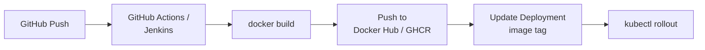

# LP-L02 — Build & Image Resources: BuildConfig, Docker Builds, and ImageStreams

**Level:** Personalized
**Duration:** 1 hr

## Overview

In Kubernetes, you build images externally (GitHub Actions, Jenkins, local `docker build`) and push them to a registry. Kubernetes has no opinion about how images are produced — it only pulls them.

OpenShift can build your code inside the cluster. This lesson teaches BuildConfig (defines how to build), the Docker build strategy (uses your existing Dockerfiles), and ImageStreams (abstract image references that enable automatic redeployment when a new image is built).

You will build all four ShopInsights services from their Dockerfiles directly on the cluster — no external registry needed. The resulting ImageStreams will be used in L03 to deploy the microservices stack.

## Prerequisites

- Completed: [L01 — Projects](../L01_projects/)
- OpenShift cluster running (CRC or Developer Sandbox)
- Logged in via `oc login` (see [login instructions](../README.md#logging-in-to-your-cluster) — Sandbox tokens expire daily!)
- `shopinsights` project exists: `oc project shopinsights`

## Quick Run

Want to skip the step-by-step and run everything at once? First, set up your `.env` file (one-time):

```bash
cp ../env.example ../.env
# Edit ../.env and set GITHUB_USERNAME to your GitHub username
```

Then run:

```bash
./scripts/run.sh
```

The steps below explain what the script does and why.

## K8s Context

In Kubernetes, the build pipeline is external:



Kubernetes itself has no build primitives. You need external CI (GitHub Actions, Jenkins, CircleCI), an external registry (Docker Hub, GHCR, ECR), and a mechanism to update the Deployment image reference (manual `kubectl set image`, Helm upgrade, ArgoCD sync, etc.).

This is flexible but requires assembling multiple tools. OpenShift offers an integrated alternative.

## Concepts

### BuildConfig

A BuildConfig is a Kubernetes-style resource (`build.openshift.io/v1`) that defines HOW to build a container image:

- **Source**: where to get the code (Git repo, local upload, binary)
- **Strategy**: how to build it (Source/S2I, Docker, Pipeline, Custom)
- **Output**: where to push the resulting image (usually an ImageStream in the internal registry)

When you create a BuildConfig and trigger a build, OpenShift spins up a builder pod that executes the build inside the cluster and pushes the result to the internal registry.

### Build Strategies

| Strategy | How it works | Dockerfile needed? |
|----------|-------------|-------------------|
| **Source (S2I)** | Injects your source code into a builder image (e.g., `python:3.11-ubi9`). The builder installs dependencies and produces a runnable image. | No |
| **Docker** | Runs a standard `docker build` using the Dockerfile in your repo. | Yes |
| **Pipeline** | Delegates to a Tekton/Jenkins pipeline. | Depends on pipeline |
| **Custom** | Runs your own builder image with full control. | No (you define the process) |

S2I is the most OpenShift-specific strategy — it builds from source without a Dockerfile. It is useful for quick prototyping but gives you less control. In this lesson we use the **Docker strategy** because you already have Dockerfiles and it is the approach closest to what you already know.

### ImageStreams

An ImageStream is an OpenShift abstraction over container image references. Instead of pointing your Deployment at `ghcr.io/<your-username>/shopinsights-products:latest`, you point it at an ImageStream tag like `products-service:latest`.

Why this matters:

- **Decoupling**: the Deployment references a logical name, not a registry URL. You can change where the image comes from without modifying the Deployment.
- **Triggers**: when a new image is pushed to the ImageStream tag, OpenShift can automatically redeploy. No webhook, no ArgoCD — the platform handles it.
- **Build output**: BuildConfig pushes to an ImageStream by default. The internal registry stores the image, and the ImageStream tracks it.

### Image Change Triggers

You can annotate a Deployment so it watches an ImageStream tag. When a new build pushes a new image, the Deployment automatically rolls out a new version. This is the simplest form of continuous deployment — no pipeline needed.

### Where Do the Images Go?

BuildConfig pushes to OpenShift's built-in container registry by default. The internal registry is available at `image-registry.openshift-image-registry.svc:5000` inside the cluster. You never need to configure registry credentials for in-cluster builds.

In L08 (CI/CD), you will build with Tekton and push to an external registry (GHCR) instead. Both approaches work — internal registry for development, external registry for production artifacts that need to survive cluster rebuilds.

### Relationship to CI/CD

BuildConfig is the **build step**. CI/CD (Tekton, covered in L08) orchestrates the **full workflow** — clone, test, build, push, deploy. A BuildConfig can be one step inside a Tekton pipeline, or it can stand alone for simpler workflows.

Think of it this way:
- **BuildConfig alone**: push code, trigger build, auto-redeploy. Good for dev environments.
- **Tekton + BuildConfig**: push code, run tests, build, scan, deploy to staging, promote to prod. Good for production pipelines.

## Step-by-Step

### Step 1: Create an ImageStream for the Products Service

The ImageStream is the target for the build output. Create it first so the BuildConfig has somewhere to push.

```bash
oc apply -f manifests/products-imagestream.yaml
```

```yaml
# manifests/products-imagestream.yaml
apiVersion: image.openshift.io/v1
kind: ImageStream
metadata:
  name: products-service
  labels:
    app: shopinsights
    component: products-service
    tutorial: personalized
    lesson: "02"
```

Verify it exists (no tags yet — nothing has been built):

```bash
oc get imagestream products-service
```

### Step 2: Create a BuildConfig Using Docker Strategy

This BuildConfig tells OpenShift: "Build the Products Service from the Git repo using its Dockerfile, and push the result to the `products-service:latest` ImageStream tag."

```bash
oc apply -f manifests/products-buildconfig.yaml
```

```yaml
# manifests/products-buildconfig.yaml (key parts)
apiVersion: build.openshift.io/v1
kind: BuildConfig
metadata:
  name: products-service
spec:
  source:
    type: Git
    git:
      uri: https://github.com/<your-username>/openshift-tutorial.git
    contextDir: tutorial/shared_app/products-service
  strategy:
    type: Docker
    dockerStrategy:
      dockerfilePath: Dockerfile
  output:
    to:
      kind: ImageStreamTag
      name: products-service:latest
```

Key points:
- `contextDir`: only the `products-service/` directory is sent to the builder, not the entire repo
- `dockerStrategy.dockerfilePath`: uses the existing Dockerfile in the service directory — same as building locally with `docker build`
- `output.to`: pushes to the `products-service:latest` ImageStream tag in the current project

### Step 3: Start the Build

```bash
oc start-build products-service
```

This creates a Build object (a one-time execution of the BuildConfig) and spins up a builder pod.

### Step 4: Watch the Build Logs

```bash
oc logs -f build/products-service-1
```

You will see:
1. The source code being cloned from GitHub
2. Each Dockerfile step executing (FROM, COPY, RUN pip install, etc.)
3. The final image being pushed to the internal registry

The build takes 2-5 minutes depending on your cluster resources and network speed.

Alternatively, list all builds to check status:

```bash
oc get builds
```

Expected output:

```
NAME                 TYPE     FROM          STATUS     STARTED         DURATION
products-service-1   Docker   Git@main      Complete   2 minutes ago   2m30s
```

### Step 5: Verify the Image Was Pushed

```bash
oc get imagestream products-service
```

Expected output:

```
NAME               IMAGE REPOSITORY                                                              TAGS     UPDATED
products-service   image-registry.openshift-image-registry.svc:5000/shopinsights/products-service latest   30 seconds ago
```

The `TAGS` column now shows `latest` — the build pushed successfully. You can also inspect the image details:

```bash
oc describe imagestream products-service
```

### Step 6: Create ImageStreams and BuildConfigs for the Remaining Services

Now build the other three services. All use the same Docker strategy pattern as Products.

**Orders Service:**

```bash
oc apply -f manifests/orders-imagestream.yaml
oc apply -f manifests/orders-buildconfig.yaml
oc start-build orders-service
```

**Analytics Service:**

```bash
oc apply -f manifests/analytics-imagestream.yaml
oc apply -f manifests/analytics-buildconfig.yaml
oc start-build analytics-service
```

**Dashboard UI:**

```bash
oc apply -f manifests/dashboard-imagestream.yaml
oc apply -f manifests/dashboard-buildconfig.yaml
oc start-build dashboard-ui
```

Watch all builds in parallel:

```bash
oc get builds -w
```

The Python service builds take 2-5 minutes each. The Dashboard UI multi-stage build takes 3-7 minutes because of the npm install step.

### Step 7: About S2I Strategy (Optional Reading)

OpenShift also supports **S2I (Source-to-Image)** — a build strategy that does not require a Dockerfile. You point it at a builder image (e.g., `python:3.11-ubi9`) and your source directory, and the builder handles dependency installation and image assembly automatically.

S2I is useful for quick prototyping but gives you less control over the build process (e.g., it uses `pip` internally, not `uv`, and does not support multi-stage builds). We use the Docker strategy in this tutorial because you already have Dockerfiles and it matches the workflow you know from vanilla Kubernetes.

### Step 8: Set Up an Image Change Trigger on the Deployment

Now the powerful part: make the Deployment automatically redeploy when a new image is built.

Apply the updated Deployment that references the ImageStream instead of GHCR:

```bash
oc apply -f manifests/products-deployment-trigger.yaml
```

```yaml
# manifests/products-deployment-trigger.yaml (key parts)
apiVersion: apps/v1
kind: Deployment
metadata:
  name: products-service
  annotations:
    image.openshift.io/triggers: >-
      [{"from":{"kind":"ImageStreamTag","name":"products-service:latest"},
        "fieldPath":"spec.template.spec.containers[?(@.name==\"products-service\")].image"}]
spec:
  template:
    spec:
      containers:
        - name: products-service
          image: products-service:latest
```

The `image.openshift.io/triggers` annotation tells OpenShift: "When the `products-service:latest` ImageStream tag changes, update the container image in this Deployment and trigger a rollout."

This replaces:
- Webhook-triggered CI that runs `kubectl set image`
- ArgoCD watching a Git repo for image tag changes
- Manual `oc set image` commands

### Step 9: Trigger a Rebuild and Watch Auto-Redeploy

Start a new build:

```bash
oc start-build products-service
```

In a second terminal, watch the Deployment:

```bash
oc rollout status deploy/products-service -w
```

When the build completes and pushes a new image to the ImageStream, the Deployment automatically rolls out a new ReplicaSet. No manual intervention, no webhook, no pipeline — the platform handles it.

### Step 10: View Builds in the Web Console

The Web Console provides a visual interface for builds:

1. Open https://console-openshift-console.apps-crc.testing
2. Switch to the **Developer** perspective (top-left dropdown)
3. Select the `shopinsights` project
4. Click **Builds** in the left navigation

You will see:
- All BuildConfigs listed
- Build history with status (Complete, Running, Failed)
- Build logs accessible with one click
- The ability to start a new build from the UI

Click on a BuildConfig to see its details: source, strategy, output, triggers, and build history.

## Verification

Run these commands to verify everything is working:

```bash
# ImageStreams exist and have tags
oc get imagestreams -l app=shopinsights
# Expected: products-service, orders-service, analytics-service, and dashboard-ui with "latest" tags

# All builds completed successfully
oc get builds
# Expected: STATUS=Complete for all builds

# Image change trigger is configured on Products Service
oc get deploy products-service -o jsonpath='{.metadata.annotations.image\.openshift\.io/triggers}' | python3 -m json.tool
# Expected: JSON showing the trigger configuration
```

## K8s vs OpenShift Comparison

| Aspect | Kubernetes | OpenShift |
|--------|-----------|-----------|
| Image building | External (GitHub Actions, Jenkins, etc.) | In-cluster (BuildConfig) or external |
| Build definition | CI config file (e.g., `.github/workflows/build.yml`) | BuildConfig resource (`build.openshift.io/v1`) |
| Dockerfile builds | `docker build` locally or in CI | Docker strategy (uses `buildah` internally) |
| Build without Dockerfile | Not natively supported | S2I (Source-to-Image) strategy |
| Image registry | External (Docker Hub, GHCR, ECR) | Built-in internal registry + external registries |
| Image reference | Direct registry URL in Deployment | ImageStream (abstract reference) |
| Auto-redeploy on new image | Requires webhook/ArgoCD/manual | Image change trigger annotation |
| Build history | In CI system (GitHub Actions logs) | In the cluster (`oc get builds`, Web Console) |
| Builder images | You choose and configure | Pre-installed S2I builders (Python, Node, Java, etc.) |

## Key Takeaways

- **BuildConfig** is an OpenShift resource that defines how to build a container image inside the cluster — no external CI needed for basic builds
- **Docker strategy** uses your existing Dockerfiles as-is — same `docker build` workflow you know, running inside the cluster via `buildah`
- **S2I** is an alternative strategy that builds without a Dockerfile — useful for quick prototyping but less control
- **ImageStreams** decouple Deployments from specific registry URLs and enable triggers
- **Image change triggers** on Deployments enable automatic redeployment when a new image is built — the simplest form of continuous deployment
- BuildConfig is the **build step**; CI/CD (Tekton, L08) orchestrates the **full workflow** including tests, scans, and multi-environment promotion

## Cleanup

> Or run `./scripts/cleanup.sh` to clean up automatically.

If you are continuing to L03, **do not clean up** — L03 deploys from the ImageStreams you just built.

If you want to start over:

```bash
# Delete builds and build configs
oc delete buildconfig -l app=shopinsights
oc delete builds --all

# Delete image streams
oc delete imagestream -l app=shopinsights

# Delete all lesson-02 resources at once (alternative)
oc delete all -l tutorial=personalized,lesson=02
```

## Next Steps

Your images are built and stored in the internal registry. In [L03: Deploy the Microservices Stack](../L03_deploy_microservices/), you will deploy all four services from the ImageStreams you just created — no external registry needed.
