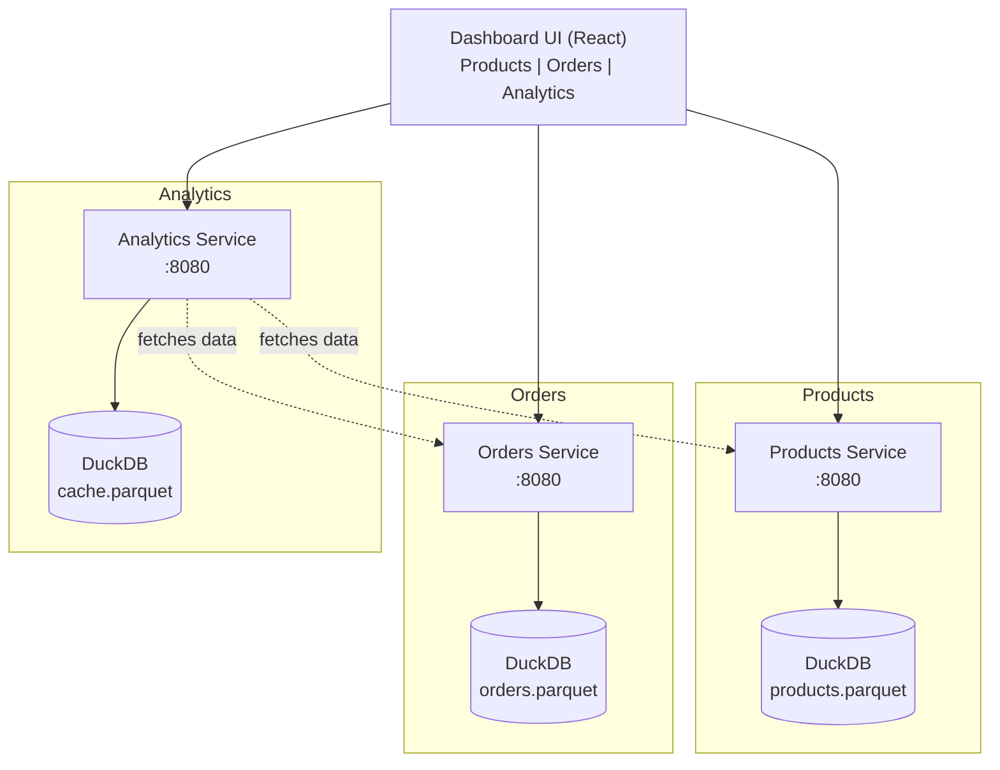

# LP-L03 — Deploy the Microservices Stack

**Level:** Personalized
**Duration:** 45 min

## Overview

You have three Python/FastAPI microservices and a React dashboard, all built as ImageStreams in the previous lesson. In this lesson, you deploy all four components to OpenShift from those in-cluster ImageStreams — with OpenShift's security model enforced from the start.

The key surprise for K8s users: **pods cannot run as root by default**. OpenShift enforces Security Context Constraints (SCCs), and the default `restricted` SCC rejects any container that expects root. Every Dockerfile in this project already runs as non-root on port 8080 — we will explain why.

## Prerequisites

- Completed: [L01 — Projects](../L01_projects/) and [L02 — Build & Image Resources](../L02_builds_and_images/)
- All four ImageStreams built and tagged in the `shopinsights` project (from L02):
  ```bash
  oc get imagestreams -n shopinsights
  ```
- OpenShift cluster running (CRC or Developer Sandbox)
- Logged in via `oc login` (see [login instructions](../README.md#logging-in-to-your-cluster) — Sandbox tokens expire daily!)

## Quick Run

Want to skip the step-by-step and run everything at once?

```bash
./scripts/run.sh
```

The steps below explain what the script does and why.

## K8s Context

In Kubernetes, you write Deployment + Service YAML, apply it, and you are done. Containers can run as root unless you explicitly set a `securityContext` or enable Pod Security Admission. Most Docker Hub images run as root by default and work fine.

In OpenShift, the same Deployment + Service pattern works, but:
1. Pods are restricted to non-root by default (SCC `restricted-v2`)
2. Random UIDs are assigned to containers — your app must not assume UID 0 or any specific UID
3. Containers cannot bind to privileged ports (< 1024)

This is not a bug. It is OpenShift's security-first design: every pod runs with least privilege unless explicitly granted more.

## Concepts

### Security Context Constraints (SCCs)

SCCs are OpenShift's answer to Kubernetes Pod Security Admission — but more granular. The default SCC (`restricted-v2`) enforces:

- Container runs as a random UID from a namespace-specific range
- No root access
- No privileged escalation
- Read-only root filesystem (recommended but not always enforced)
- No host networking, host PID, or host IPC

If your Docker Hub image does `USER root` or binds to port 80, it will fail with a `CrashLoopBackOff` or permission denied errors. Our Dockerfiles avoid this by:
- Creating a non-root user (UID 1001)
- Listening on port 8080
- Writing data only to volumes, not the container filesystem

### ConfigMaps and Secrets

ConfigMaps store non-sensitive configuration (API URLs, feature flags). Secrets store sensitive values (API keys, credentials). Both are mounted into pods as environment variables or files.

In this lesson:
- **ConfigMap**: service URLs (how services find each other), feature flags
- **Secret**: API keys for inter-service authentication (simulated for the tutorial)

### Health Probes

Every Deployment includes:
- **Liveness probe** (`/healthz`): "Is the process alive?" Restart the container if this fails.
- **Readiness probe** (`/ready`): "Can the service handle requests?" Remove from Service endpoints if this fails (e.g., during startup while DuckDB loads data).

These are identical to Kubernetes probes — OpenShift does not change them. But they are critical for later lessons (HPA needs readiness, Knative needs both).

## Architecture



All services listen on port 8080 inside the cluster. The Analytics Service calls Products and Orders via Kubernetes Service DNS (`http://products-service:8080`).

## Step-by-Step

### Step 1: Switch to the ShopInsights Project

Make sure you are in the `shopinsights` project created in L01:

```bash
oc project shopinsights
```

### Step 2: Create ConfigMaps

The services need to know each other's URLs. In Kubernetes, you would hardcode these as environment variables in the Deployment. Here, we use a ConfigMap so the values are managed separately from the workload definition.

```bash
oc apply -f manifests/configmap.yaml
```

```yaml
# manifests/configmap.yaml
apiVersion: v1
kind: ConfigMap
metadata:
  name: shopinsights-config
  labels:
    app: shopinsights
    tutorial: personalized
    lesson: "03"
data:
  PRODUCTS_SERVICE_URL: "http://products-service:8080"
  ORDERS_SERVICE_URL: "http://orders-service:8080"
  ANALYTICS_SERVICE_URL: "http://analytics-service:8080"
```

### Step 3: Create Secrets

For this tutorial, we simulate API keys for inter-service authentication. In production, you would use a secrets management solution (covered in L06).

```bash
oc apply -f manifests/secret.yaml
```

### Step 4: Create PersistentVolumeClaims

Each microservice stores Parquet files in a PVC. This is identical to Kubernetes — OpenShift uses the same PV/PVC/StorageClass model.

```bash
oc apply -f manifests/pvcs.yaml
```

### Step 5: Deploy the Products Service

```bash
oc apply -f manifests/products-deployment.yaml
oc apply -f manifests/products-service.yaml
```

Look at the key parts of the Deployment manifest:

```yaml
# From manifests/products-deployment.yaml
metadata:
  annotations:
    image.openshift.io/triggers: >-
      [{"from":{"kind":"ImageStreamTag","name":"products-service:latest"},
        "fieldPath":"spec.template.spec.containers[?(@.name==\"products-service\")].image"}]
spec:
  containers:
    - name: products-service
      image: products-service:latest      # References the ImageStream, not a registry URL
      ports:
        - containerPort: 8080             # Non-privileged port (SCC compatible)
      resources:
        requests:
          cpu: 100m
          memory: 128Mi
        limits:
          cpu: 500m
          memory: 512Mi
      livenessProbe:
        httpGet:
          path: /healthz
          port: 8080
        initialDelaySeconds: 10
        periodSeconds: 15
      readinessProbe:
        httpGet:
          path: /ready
          port: 8080
        initialDelaySeconds: 5
        periodSeconds: 10
      envFrom:
        - configMapRef:
            name: shopinsights-config
        - secretRef:
            name: shopinsights-secrets
      volumeMounts:
        - name: data
          mountPath: /data
```

Notice:
- **`image.openshift.io/triggers`**: tells OpenShift to resolve the image from the ImageStream built in L02 and auto-redeploy when a new build pushes an update
- **`image: products-service:latest`**: references the ImageStream tag, not a registry URL — OpenShift resolves it to the internal registry automatically
- **Port 8080**: not 80 or 443 — those require root
- **Resource requests/limits**: required for proper scheduling, and HPA/Knative need them later
- **Health probes**: OpenShift uses these to manage pod lifecycle
- **envFrom**: pulls all keys from the ConfigMap and Secret as environment variables
- **Volume mount**: Parquet files are stored on the PVC, not the container filesystem

### Step 6: Deploy the Orders Service

```bash
oc apply -f manifests/orders-deployment.yaml
oc apply -f manifests/orders-service.yaml
```

Same pattern as Products, but the Orders Service also calls Products Service to validate orders (using the `PRODUCTS_SERVICE_URL` from the ConfigMap).

### Step 7: Deploy the Analytics Service

```bash
oc apply -f manifests/analytics-deployment.yaml
oc apply -f manifests/analytics-service.yaml
```

The Analytics Service calls both Products and Orders Services to aggregate data. This is the inter-service communication pattern you will observe in Kiali when we add the Service Mesh in L05.

### Step 8: Deploy the Dashboard UI

```bash
oc apply -f manifests/dashboard-deployment.yaml
oc apply -f manifests/dashboard-service.yaml
```

The React app is served by nginx on port 8080. The nginx configuration is modified to run as non-root — a common pattern for frontend containers on OpenShift.

### Step 9: Verify All Pods Are Running

```bash
oc get pods -w
```

Expected output (wait for all to show `1/1 Running`):

```
NAME                                  READY   STATUS    RESTARTS   AGE
products-service-xxx-yyy              1/1     Running   0          2m
orders-service-xxx-yyy                1/1     Running   0          1m
analytics-service-xxx-yyy             1/1     Running   0          1m
dashboard-ui-xxx-yyy                  1/1     Running   0          30s
```

If a pod shows `CrashLoopBackOff`, check the logs:

```bash
oc logs <pod-name>
```

Common issues:
- **Permission denied**: The image tries to run as root. Check the Dockerfile.
- **Address already in use**: The container tries to bind to a privileged port.
- **File not found**: The data directory is not writable — check the PVC mount.

### Step 10: Test Inter-Service Communication

Port-forward to the Products Service and verify it responds:

```bash
oc port-forward svc/products-service 8080:8080 &
curl http://localhost:8080/products
curl http://localhost:8080/healthz
kill %1
```

Test the Analytics Service (which calls Products and Orders internally):

```bash
oc port-forward svc/analytics-service 8081:8080 &
curl http://localhost:8081/analytics/summary
kill %1
```

If the Analytics Service returns data aggregated from Products and Orders, inter-service communication over Service DNS is working.

### Using the Web Console

You can also verify the deployment in the OpenShift Web Console:

1. Open https://console-openshift-console.apps-crc.testing
2. Switch to the **Developer** perspective (top-left dropdown)
3. Select the `shopinsights` project
4. Click **Topology** — you should see all four components with connecting arrows showing Service relationships

The Topology view is far more capable than the Kubernetes Dashboard — it shows builds, routes, and service connections visually.

## Verification

Run these commands to verify everything is working:

```bash
# All pods running
oc get pods -l app=shopinsights

# All services created
oc get svc -l app=shopinsights

# Health checks passing
oc exec deploy/products-service -- curl -s http://localhost:8080/healthz
oc exec deploy/orders-service -- curl -s http://localhost:8080/healthz
oc exec deploy/analytics-service -- curl -s http://localhost:8080/healthz

# Inter-service communication (analytics calls products + orders)
oc exec deploy/analytics-service -- curl -s http://products-service:8080/products
oc exec deploy/analytics-service -- curl -s http://orders-service:8080/orders
```

## K8s vs OpenShift Comparison

| Aspect | Kubernetes | OpenShift |
|--------|-----------|-----------|
| Namespace creation | `kubectl create namespace` | `oc new-project` (adds RBAC, metadata) — see L01 |
| Pod security | Opt-in (PSA labels) | Enforced by default (SCCs) |
| Root containers | Allowed by default | Blocked by default (`restricted-v2` SCC) |
| Port binding | Any port | Non-privileged only (>= 1024) |
| Container UID | As specified in Dockerfile | Random UID from namespace range |
| Deployments | Standard `apps/v1 Deployment` | Same — Deployments work identically |
| Services | Standard `v1 Service` | Same — Services work identically |
| PVCs | Standard PV/PVC model | Same — storage model is identical |
| Web UI | Dashboard (basic) | Full Web Console with Topology view |

## Key Takeaways

- Deployments, Services, PVCs, ConfigMaps, and Secrets work identically in OpenShift and Kubernetes
- The **SCC security model** is the biggest difference — your containers must run as non-root
- Always use port 8080+ in your Dockerfiles for OpenShift compatibility
- Health probes (`/healthz`, `/ready`) are essential for proper pod lifecycle management
- Inter-service communication uses the same Service DNS pattern as Kubernetes
- The Web Console's Topology view gives you a visual overview that the K8s Dashboard cannot match

## Cleanup

> Or run `./scripts/cleanup.sh` to clean up automatically.

```bash
oc delete all -l tutorial=personalized,lesson=03
oc delete configmap shopinsights-config
oc delete secret shopinsights-secrets
oc delete pvc -l tutorial=personalized,lesson=03
```

Or to delete everything including the project:

```bash
oc delete project shopinsights
```

## Next Steps

Your services are running but only accessible from inside the cluster. In [L04: Expose Services Externally](../L04_expose_externally/), you will create Routes to make the Dashboard and APIs accessible from your browser — and learn how OpenShift Routes replace Traefik.
