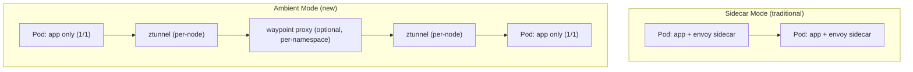
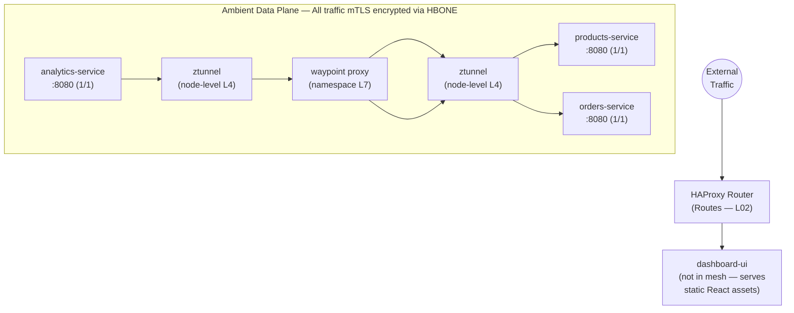

# LP-L05 — Service Mesh with Istio Ambient Mode: mTLS, Canary, and Observability

**Level:** Personalized
**Duration:** 1 hr

## Overview

You have three microservices talking to each other over plain HTTP inside the cluster. The Analytics Service calls Products and Orders via Service DNS — and right now, any pod in the namespace could impersonate those services, sniff traffic, or flood them with requests. There is no encryption, no traffic control, and no visibility into what is calling what.

In this lesson, you add OpenShift Service Mesh 3.x (Istio) in **ambient mode** to the ShopInsights stack. Unlike the traditional sidecar approach — where every pod gets an Envoy proxy container injected alongside the application — ambient mode uses a shared per-node proxy called **ztunnel** for automatic mTLS and L4 security, and optional **waypoint proxies** for L7 traffic management. This gives you the same three capabilities — **security**, **traffic management**, and **observability** — with lower resource overhead and no changes to your pod structure.

## Prerequisites

- Completed: [L03 — Deploy the Microservices Stack](../L03_deploy_microservices/) and [L04 — Expose Services Externally](../L04_expose_externally/)
- OpenShift cluster running (CRC with at least 16 GB RAM, or Developer Sandbox)
- Logged in as `kubeadmin` (operator installation requires cluster-admin)
- `oc` CLI installed and on PATH

**CRC resource note:** Service Mesh installs Istiod, ztunnel, Istio CNI, Kiali, and Tempo into the cluster. If you have not already increased CRC resources:

```bash
crc stop
crc config set memory 20480    # 20 GB
crc config set cpus 6
crc start
```

## Quick Run

Want to skip the step-by-step? This lesson has two scripts — one for infrastructure setup, one for the demo features:

```bash
# 1. Install operators, Istio control plane, enroll namespace, deploy waypoint
./scripts/setup.sh

# 2. Canary deployment, circuit breaker, network policy, observability
./scripts/demo.sh
```

The steps below explain what each script does and why.

## K8s Context

In vanilla Kubernetes, adding Istio ambient mode is a manual process:

1. Download `istioctl` and install with `istioctl install --set profile=ambient`
2. Install the Kubernetes Gateway API CRDs (required for waypoint proxies)
3. Label namespaces with `istio.io/dataplane-mode=ambient`
4. Manually install Kiali, Tempo/Jaeger, and Grafana as separate Helm charts
5. Manage upgrades yourself

On OpenShift, the Service Mesh is an **operator**. You install the Sail Operator from OperatorHub, create three custom resources (Istio, IstioCNI, ZTunnel), and the operator handles the rest. Observability components (Kiali, Tempo) are installed as separate operators. This is your first operator installation in this tutorial, so we will take a moment to understand the pattern.

## Concepts

### Ambient Mode vs. Sidecar Mode

In the traditional sidecar approach, every pod in the mesh gets an additional Envoy proxy container injected alongside the application container. This means every pod shows `2/2 READY` — one container for your app, one for Envoy.

Ambient mode takes a different approach by splitting the data plane into two layers:



- **ztunnel** (Layer 4): A shared, per-node DaemonSet written in Rust. It handles mTLS encryption, identity, and basic TCP-level policies for all pods on the node. Your pods stay at `1/1` — no sidecar injected, no pod restarts needed.
- **Waypoint proxy** (Layer 7): An optional, on-demand Envoy proxy deployed per-namespace or per-service. You only deploy a waypoint when you need L7 features like HTTP routing, canary splits, circuit breakers, or distributed tracing.

This split means you get mTLS for free just by labeling a namespace, and only pay the cost of L7 processing where you actually need it.

### HBONE and Automatic mTLS

All traffic between ztunnels uses **HBONE** (HTTP-Based Overlay Network Encapsulation) — an HTTP/2 tunnel with mandatory mTLS. Every ztunnel gets a certificate from Istiod's certificate authority, and all inter-node traffic is encrypted and authenticated.

This means:
- Traffic between services is encrypted in transit — even within the cluster network
- Services can verify the identity of callers — no more spoofing
- You get this without touching your application code, managing certificates, or even configuring a PeerAuthentication resource (though you can use one for STRICT mode)

### Waypoint Proxies and the Gateway API

Waypoint proxies are created using the **Kubernetes Gateway API** — the same Gateway API used for ingress, but with a special `gatewayClassName: istio-waypoint` that marks it as a mesh-internal L7 proxy.

When you deploy a waypoint for a namespace and label a service to use it, traffic to that service flows through the waypoint, which can then apply:
- **HTTPRoute**: traffic splitting for canary deployments (replaces VirtualService)
- **DestinationRule**: circuit breakers, connection pool limits, outlier detection
- **AuthorizationPolicy**: L7 access control (based on HTTP paths, headers, methods)
- **Distributed tracing**: the waypoint generates HTTP spans for Tempo/Jaeger

### Traffic Management: HTTPRoute and DestinationRule

Ambient mode uses two resources for traffic control:

- **HTTPRoute** (Gateway API): defines routing rules — which backend gets what percentage of traffic, enabling canary deployments. This replaces VirtualService in ambient mode.
- **DestinationRule** (Istio): defines connection policies — circuit breakers, load balancing, outlier detection. Works the same as in sidecar mode.

Together, they let you do a canary deployment: send 90% of traffic to the stable version and 10% to the canary, without modifying Kubernetes Services or Deployments.

### Observability: Kiali and Tempo

- **Kiali** is a service mesh management console. In ambient mode, it shows ztunnel and waypoint proxy status, mesh enrollment state per namespace, and a live topology graph of service-to-service communication.
- **Tempo** provides distributed tracing (replacing Jaeger, which is deprecated). When traffic flows through a waypoint proxy, Tempo captures the complete trace with timing for each hop. Note: ztunnel (L4 only) generates TCP telemetry but not HTTP traces — you need a waypoint for full distributed tracing.

In OSSM 3.x, both are installed as separate operators — they are no longer bundled with the control plane.

### Circuit Breaker

A circuit breaker prevents cascading failures. If the Orders Service starts returning errors, the circuit breaker in the waypoint proxy will stop sending new requests to it — returning errors immediately instead of piling up connections to a failing service. After a cooldown period, it lets a few requests through to test if the service has recovered.

This is configured in the DestinationRule, not in application code. The waypoint proxy enforces it.

## Architecture with Ambient Mesh



Routes (HAProxy) handle external ingress. Ztunnel handles L4 mTLS for all pods on the node. The waypoint proxy handles L7 traffic management (canary splits, circuit breaking) and generates HTTP traces.

---

## What Just Happened? — Your First Operator Install

> **Sidebar: How Operators Work on OpenShift**
>
> This is the first time in the tutorial you are installing an operator. Every operator you install later — Pipelines (L08), GitOps (L09), Serverless (L10) — follows this same pattern. Understanding it once means you understand them all.
>
> In vanilla Kubernetes, you install operators by applying CRDs and a Deployment from a YAML bundle or Helm chart. On OpenShift, operators are managed by the **Operator Lifecycle Manager (OLM)**, which is pre-installed.
>
> The flow:
>
> 1. **OperatorHub** — a catalog of operators available for installation. Think of it as an app store for cluster capabilities. Red Hat curates the `redhat-operators` catalog source; community operators come from `community-operators`.
>
> 2. **Subscription** — when you "install" an operator, you create a Subscription resource. It tells OLM: "I want the `sailoperator` from the `redhat-operators` catalog, on the `stable` channel." This is what the manifests below do.
>
> 3. **InstallPlan** — OLM creates an InstallPlan that lists the CRDs, Deployments, RBAC, and other resources the operator needs. With `installPlanApproval: Automatic`, OLM applies it immediately. With `Manual`, a cluster admin must approve it first (used in production for change control).
>
> 4. **ClusterServiceVersion (CSV)** — the operator's "deployment descriptor." It contains the operator's Deployment, RBAC requirements, owned CRDs, and version info. When the CSV phase is `Succeeded`, the operator is running and ready to use.
>
> You can verify at any point:
> ```bash
> # List all installed operators
> oc get csv -n openshift-operators
>
> # Check a specific operator's status
> oc get csv -n openshift-operators | grep sail
>
> # View install plans
> oc get installplan -n openshift-operators
> ```
>
> **Why does this matter?** Because every advanced OpenShift feature — Pipelines, GitOps, Serverless, Logging, even the internal image registry — is delivered as an operator. The pattern is always: Subscription → InstallPlan → CSV → Custom Resource.

---

## Step-by-Step

### Step 1: Install the Sail Operator

The Sail Operator manages the Istio control plane, CNI, and ztunnel. It replaces the Maistra-based Service Mesh operator from OSSM 2.x.

Log in as cluster admin:

```bash
oc login -u kubeadmin -p <password from crc start> https://api.crc.testing:6443
```

Install the Sail Operator:

```bash
oc apply -f manifests/operator-sail.yaml
```

Wait for the CSV to reach `Succeeded`:

```bash
oc get csv -n openshift-operators -w | grep sail
```

Expected output (it may take 2-3 minutes):

```
NAME                    DISPLAY          PHASE
sailoperator.v0.x.x     Sail Operator    Succeeded
```

### Step 2: Install the Kiali Operator

In OSSM 3.x, Kiali is no longer bundled with the control plane — install it as a separate operator:

```bash
oc apply -f manifests/operator-kiali.yaml
```

Wait for the CSV:

```bash
oc get csv -n openshift-operators -w | grep kiali
```

Expected:

```
kiali-operator.v2.x.x   Kiali Operator   Succeeded
```

### Step 3: Install the Tempo Operator

Tempo replaces Jaeger for distributed tracing. Jaeger is deprecated in OSSM 3.x.

```bash
oc apply -f manifests/operator-tempo.yaml
```

Wait for the CSV:

```bash
oc get csv -n openshift-operators -w | grep tempo
```

Expected:

```
tempo-operator.v0.x.x   Tempo Operator   Succeeded
```

**Web Console alternative:** You can install all three operators from the Web Console:
1. Navigate to **Operators > OperatorHub**
2. Search for "Sail Operator" and install it
3. Repeat for "Kiali Operator" and "Tempo Operator"

### Step 4: Create the Istio Control Plane

The Istio CR tells the Sail Operator to deploy Istiod — the brain of the mesh. The `profile: ambient` setting configures it for ambient mode.

Create the namespace and apply the control plane manifest:

```bash
oc new-project istio-system
oc apply -f manifests/istio.yaml
```

```yaml
# manifests/istio.yaml (key sections)
apiVersion: sailoperator.io/v1
kind: Istio
metadata:
  name: default
spec:
  version: v1.24.2
  namespace: istio-system
  profile: ambient
```

Wait for the control plane to be ready:

```bash
oc get istio default -w
```

Expected:

```
NAME      REVISIONS   READY   IN USE   ACTIVE REVISION   STATUS    AGE
default   1           True    True     default            Healthy   2m
```

Verify Istiod is running:

```bash
oc get pods -n istio-system
```

You should see `istiod-*` pods in `Running` state.

### Step 5: Create the Istio CNI

The CNI agent is a DaemonSet that configures traffic redirection inside pod network namespaces. It is required for ambient mode — without it, ztunnel cannot intercept traffic.

```bash
oc apply -f manifests/istiocni.yaml
```

```yaml
# manifests/istiocni.yaml (key sections)
apiVersion: sailoperator.io/v1
kind: IstioCNI
metadata:
  name: default
spec:
  version: v1.24.2
  namespace: istio-cni
  profile: ambient
```

Wait for the CNI to be ready:

```bash
oc get istiocni default -w
```

Expected:

```
NAME      READY   IN USE   STATUS    AGE
default   True    True     Healthy   1m
```

Verify the CNI agent DaemonSet:

```bash
oc get daemonset -n istio-cni
```

You should see an `istio-cni-node` DaemonSet with one pod per node.

### Step 6: Create the ZTunnel

The ztunnel is the core of ambient mode — a per-node L4 proxy written in Rust that provides automatic mTLS for all mesh-enrolled pods.

```bash
oc apply -f manifests/ztunnel.yaml
```

```yaml
# manifests/ztunnel.yaml (key sections)
apiVersion: sailoperator.io/v1alpha1
kind: ZTunnel
metadata:
  name: default
spec:
  version: v1.24.2
  namespace: ztunnel
  profile: ambient
```

Wait for ztunnel to be ready:

```bash
oc get ztunnel default -w
```

Expected:

```
NAME      READY   IN USE   STATUS    AGE
default   True    True     Healthy   1m
```

Verify the ztunnel DaemonSet:

```bash
oc get daemonset -n ztunnel
```

You should see a `ztunnel` DaemonSet with one pod per node. Each ztunnel pod handles mTLS for all mesh-enrolled pods on that node.

### Step 7: Enroll the ShopInsights Namespace in the Mesh

In the sidecar model, enrollment requires injecting a proxy container into every pod — which means pod restarts. In ambient mode, enrollment is a single namespace label. Existing pods are enrolled **immediately** with no restart:

```bash
oc label namespace shopinsights istio.io/dataplane-mode=ambient
```

That is it. All pods in the `shopinsights` namespace are now part of the mesh. The ztunnel on each node begins intercepting traffic for these pods and encrypting it with mTLS.

Verify enrollment:

```bash
oc get namespace shopinsights --show-labels | grep dataplane
```

Expected:

```
shopinsights   Active   ...   istio.io/dataplane-mode=ambient
```

Check that pods are still running normally — notice they remain `1/1` (no sidecar injected):

```bash
oc get pods -n shopinsights
```

Expected:

```
NAME                                  READY   STATUS    RESTARTS   AGE
products-service-xxx-yyy              1/1     Running   0          30m
orders-service-xxx-yyy                1/1     Running   0          30m
analytics-service-xxx-yyy             1/1     Running   0          30m
dashboard-ui-xxx-yyy                  1/1     Running   0          30m
```

This is the key difference from sidecars — your pods are unchanged, but all traffic between them is now encrypted with mTLS via ztunnel.

### Step 8: Verify Automatic mTLS

With ambient mode, mTLS is automatic — no PeerAuthentication resource needed to enable it. All traffic between mesh-enrolled pods flows through ztunnel, which uses HBONE (mTLS-encrypted HTTP/2 tunnels).

Verify that inter-service communication works (traffic is encrypted transparently):

```bash
oc exec deploy/analytics-service -n shopinsights -- \
  curl -s http://products-service:8080/healthz
```

Expected: `{"status": "healthy"}` or similar.

The application still calls `http://products-service:8080` — but the ztunnel transparently encrypts the connection with mTLS before it leaves the node.

**Optional — enforce STRICT mode:** By default, the mesh uses PERMISSIVE mode — it accepts both mTLS and plaintext connections. If you want to reject all plaintext traffic (ensuring only mesh-enrolled pods can call your services):

```bash
oc apply -f manifests/peer-authentication.yaml -n shopinsights
```

This is defense-in-depth — useful in shared clusters where non-mesh workloads should not be able to reach your services.

### Step 9: Deploy a Waypoint Proxy

So far you have L4 security (mTLS) from ztunnel. To get L7 features — HTTP routing, canary splits, circuit breakers, and distributed tracing — you need a waypoint proxy.

Deploy a waypoint for the shopinsights namespace:

```bash
oc apply -f manifests/waypoint.yaml
```

```yaml
# manifests/waypoint.yaml
apiVersion: gateway.networking.k8s.io/v1
kind: Gateway
metadata:
  name: waypoint
  namespace: shopinsights
  labels:
    istio.io/waypoint-for: service
spec:
  gatewayClassName: istio-waypoint
  listeners:
    - name: mesh
      port: 15008
      protocol: HBONE
```

This creates an Envoy-based waypoint proxy deployment in the `shopinsights` namespace. The `istio.io/waypoint-for: service` label tells the mesh this waypoint handles service-level traffic.

Label the services that should use the waypoint:

```bash
oc label service analytics-service -n shopinsights istio.io/use-waypoint=waypoint
oc label service orders-service -n shopinsights istio.io/use-waypoint=waypoint
oc label service products-service -n shopinsights istio.io/use-waypoint=waypoint
```

Verify the waypoint proxy is running:

```bash
oc get pods -n shopinsights -l gateway.networking.k8s.io/gateway-name=waypoint
```

Expected:

```
NAME                        READY   STATUS    RESTARTS   AGE
waypoint-xxx-yyy            1/1     Running   0          30s
```

Now traffic to these services flows: pod → ztunnel → waypoint → ztunnel → destination pod. The waypoint handles all L7 logic.

### Step 10: Deploy a Canary Version of Analytics Service

Now use the waypoint's traffic management to do a canary deployment. You will deploy a second version of the Analytics Service — built from a **separate source directory** with its own image — and split traffic between them using a Gateway API HTTPRoute.

The v2 analytics service (`shared_app/analytics-service-v2/`) is a genuine code variant:
- It includes all v1 endpoints (`/analytics/revenue`, `/analytics/top-products`, `/analytics/summary`)
- It adds a new endpoint: **`/analytics/trends`** — month-over-month order and revenue growth rates
- Both v1 and v2 return their version in `/healthz` responses (`"version": "1.0.0"` vs `"2.0.0"`), so you can verify the canary split

The v2 image was built in L02 from `shared_app/analytics-service-v2/` and stored in the `analytics-service-v2` ImageStream.

First, add a `version` label to the existing deployment:

```bash
oc patch deployment analytics-service -n shopinsights -p '{"spec":{"template":{"metadata":{"labels":{"version":"v1"}}}}}'
```

Create separate Services for v1 and v2 (the HTTPRoute routes between Services, not subsets):

```bash
oc apply -f manifests/analytics-service-v1.yaml
oc apply -f manifests/analytics-service-v2.yaml
```

Deploy the v2 version (uses the `analytics-service-v2:latest` image):

```bash
oc apply -f manifests/analytics-deployment-v2.yaml
```

Label both version-specific services to use the waypoint:

```bash
oc label service analytics-service-v1 -n shopinsights istio.io/use-waypoint=waypoint
oc label service analytics-service-v2 -n shopinsights istio.io/use-waypoint=waypoint
```

Apply the HTTPRoute for 90/10 canary split:

```bash
oc apply -f manifests/httproute-analytics.yaml -n shopinsights
```

```yaml
# manifests/httproute-analytics.yaml — 90% to v1, 10% to v2
apiVersion: gateway.networking.k8s.io/v1
kind: HTTPRoute
metadata:
  name: analytics-service-canary
  namespace: shopinsights
spec:
  parentRefs:
    - kind: Service
      group: ""
      name: analytics-service
      port: 8080
  rules:
    - backendRefs:
        - kind: Service
          name: analytics-service-v1
          port: 8080
          weight: 90
        - kind: Service
          name: analytics-service-v2
          port: 8080
          weight: 10
```

Test the split by sending multiple requests. Each response includes a `version` field so you can see which version handled the request:

```bash
for i in $(seq 1 20); do
  oc exec deploy/dashboard-ui -n shopinsights -- \
    curl -s http://analytics-service:8080/healthz 2>/dev/null
  echo ""
done
```

You should see roughly 18 responses with `"version": "1.0.0"` and 2 with `"version": "2.0.0"` (90/10 split).

Test the v2-only endpoint directly:

```bash
oc exec deploy/dashboard-ui -n shopinsights -- \
  curl -s http://analytics-service-v2:8080/analytics/trends | python3 -m json.tool
```

This returns month-over-month growth rates — a feature only available in v2. In a real canary, you would monitor error rates and latency in Kiali, then gradually shift more traffic to v2 by updating the HTTPRoute weights.

### Step 11: Add a Circuit Breaker for Orders Service

If the Orders Service becomes overloaded or starts failing, you do not want the Analytics Service to keep hammering it. Apply a DestinationRule with circuit breaker settings — the waypoint proxy enforces them:

```bash
oc apply -f manifests/destination-rule-orders.yaml -n shopinsights
```

```yaml
# manifests/destination-rule-orders.yaml (key sections)
spec:
  host: orders-service
  trafficPolicy:
    connectionPool:
      tcp:
        maxConnections: 50
      http:
        http1MaxPendingRequests: 10
        http2MaxRequests: 50
        maxRequestsPerConnection: 5
    outlierDetection:
      consecutive5xxErrors: 3       # 3 errors and you're out
      interval: 10s                 # Check every 10 seconds
      baseEjectionTime: 30s         # Eject for at least 30 seconds
      maxEjectionPercent: 100       # Can eject all instances
```

How it works:
- **connectionPool**: limits concurrent connections — if the limit is hit, requests fail fast with a 503 instead of queueing indefinitely
- **outlierDetection**: if an Orders pod returns 3 consecutive 5xx errors, it is ejected from the load balancing pool for 30 seconds, giving it time to recover

This is defense without code changes. The Analytics Service still calls `http://orders-service:8080` — the waypoint proxy enforces the limits.

### Step 12: Apply Network Policies (Defense in Depth)

> **Sidebar: Network Policies alongside mTLS**
>
> mTLS encrypts and authenticates traffic between ztunnels, but it only protects services *inside the mesh*. Network Policies operate at the CNI (network) layer and restrict which pods can even establish connections — regardless of whether they are in the mesh.
>
> Think of it as two layers:
> - **NetworkPolicy** (L3/L4): "Only pods with label `app=shopinsights` can talk to each other"
> - **mTLS** (L7): "And that traffic is encrypted and authenticated"
>
> In ambient mode, also allow ztunnel's HBONE traffic on port 15008.
>
> In production, use both. Network Policies stop traffic that should never happen. mTLS secures traffic that should.

Apply a NetworkPolicy that restricts traffic to the ShopInsights services:

```bash
oc apply -f manifests/network-policy.yaml -n shopinsights
```

```yaml
# manifests/network-policy.yaml — allows ShopInsights pods, istio-system,
# ztunnel (port 15008), and the OpenShift ingress controller
spec:
  podSelector:
    matchLabels:
      app: shopinsights
  ingress:
    - from:
        - podSelector:
            matchLabels:
              app: shopinsights
      ports:
        - protocol: TCP
          port: 8080
    - from:
        - namespaceSelector:
            matchLabels:
              kubernetes.io/metadata.name: istio-system
    - from:
        - namespaceSelector:
            matchLabels:
              kubernetes.io/metadata.name: ztunnel
      ports:
        - protocol: TCP
          port: 15008
    - from:
        - namespaceSelector:
            matchLabels:
              network.openshift.io/policy-group: ingress
```

This allows:
- ShopInsights pods to communicate with each other on port 8080
- The Istio control plane (in `istio-system`) to reach pods for configuration
- Ztunnel to reach pods via HBONE on port 15008
- The OpenShift router (HAProxy) to reach pods exposed via Routes
- Denies all other ingress traffic

### Step 13: Explore the Kiali Dashboard

Kiali gives you a live view of the service mesh topology. In ambient mode, Kiali shows dedicated visualizations for ztunnel and waypoint proxy status.

Get the Kiali route:

```bash
oc get route kiali -n istio-system -o jsonpath='{.spec.host}{"\n"}'
```

Open the URL in your browser (prepend `https://`). Log in with your OpenShift credentials.

Navigate to **Graph** and select the `shopinsights` namespace. You should see:

- **Mesh state indicators**: each workload shows whether it is enrolled via ztunnel only, or via ztunnel + waypoint
- **Waypoint proxy**: visible as a separate node in the graph, processing L7 traffic
- **Green edges**: healthy traffic with mTLS active
- **Version badges**: v1 and v2 of analytics-service shown separately with their traffic weights

Generate some traffic so the graph has data:

```bash
for i in $(seq 1 50); do
  oc exec deploy/analytics-service -n shopinsights -- \
    curl -s http://products-service:8080/products > /dev/null
  oc exec deploy/analytics-service -n shopinsights -- \
    curl -s http://orders-service:8080/orders > /dev/null
done
```

### Step 14: View Distributed Traces in Tempo

Tempo collects distributed traces generated by the waypoint proxy. Because ztunnel only handles L4 traffic, HTTP traces are only available for services that route through a waypoint.

Access Tempo through the OpenShift Web Console:
1. Navigate to **Observe > Traces**
2. Select the `shopinsights` namespace
3. Search for traces from `analytics-service`

You should see spans like:

```
analytics-service
  └─ GET /analytics/summary (50ms)
       ├─ GET products-service:8080/products (15ms)
       └─ GET orders-service:8080/orders (20ms)
```

This trace shows that when the Analytics Service handles a `/analytics/summary` request, it makes two downstream calls — and you can see the latency of each.

**Note:** The application code does not need any changes for basic tracing — the waypoint proxy generates spans automatically. For full trace correlation (connecting parent and child spans across services), the application should propagate tracing headers (like `traceparent`). FastAPI/Starlette does this if you add OpenTelemetry middleware, but the out-of-box waypoint traces are useful even without it.

## Verification

Run these commands to verify the full setup:

```bash
# 1. Istio control plane is healthy
oc get istio default
# Expected: READY True, STATUS Healthy

# 2. IstioCNI is healthy
oc get istiocni default
# Expected: READY True, STATUS Healthy

# 3. ZTunnel is healthy
oc get ztunnel default
# Expected: READY True, STATUS Healthy

# 4. Namespace is enrolled in ambient mode
oc get namespace shopinsights --show-labels | grep dataplane
# Expected: istio.io/dataplane-mode=ambient

# 5. Pods are running WITHOUT sidecars (1/1, not 2/2)
oc get pods -n shopinsights
# Expected: all pods show 1/1 READY

# 6. Waypoint proxy is running
oc get pods -n shopinsights -l gateway.networking.k8s.io/gateway-name=waypoint
# Expected: waypoint pod 1/1 Running

# 7. Services are labeled to use the waypoint
oc get service -n shopinsights -L istio.io/use-waypoint
# Expected: analytics, orders, products show "waypoint" in the USE-WAYPOINT column

# 8. HTTPRoute exists for canary split
oc get httproute -n shopinsights
# Expected: analytics-service-canary

# 9. DestinationRule exists for circuit breaker
oc get destinationrule -n shopinsights
# Expected: orders-service

# 10. Inter-service communication works (through ztunnel + waypoint)
oc exec deploy/analytics-service -n shopinsights -- \
  curl -s http://products-service:8080/healthz
# Expected: {"status": "healthy"} or similar

# 11. Kiali is accessible
oc get route kiali -n istio-system
# Open in browser — verify the service graph shows ShopInsights services
```

## K8s vs OpenShift Comparison

| Aspect | Kubernetes | OpenShift |
|--------|-----------|-----------|
| Istio installation | `istioctl install --set profile=ambient` | Sail Operator from OperatorHub (Subscription) |
| Control plane config | `IstioOperator` resource | `Istio` CR (sailoperator.io/v1) |
| CNI setup | `istioctl` installs it automatically | Separate `IstioCNI` CR with independent lifecycle |
| ZTunnel setup | `istioctl` installs it automatically | Separate `ZTunnel` CR with independent lifecycle |
| Namespace enrollment | Label: `istio.io/dataplane-mode=ambient` | Same — standard Istio label |
| Waypoint proxies | Gateway API `Gateway` with `istio-waypoint` class | Same — standard Gateway API |
| Traffic splitting | HTTPRoute (Gateway API) | Same — standard Gateway API |
| Kiali | Separate Helm install | Separate operator from OperatorHub |
| Tracing | Tempo or Jaeger (Helm) | Tempo Operator from OperatorHub |
| Operator upgrades | Manual (re-run istioctl) | OLM handles upgrades via Subscription channel |
| mTLS | Automatic via ztunnel HBONE | Same — identical behavior |
| DestinationRule | Standard Istio API | Same — works identically |
| Gateway API CRDs | Manual install (v1.1+) | Included in OpenShift 4.19+ |

**Key difference:** On OpenShift, the three components — Istio, IstioCNI, and ZTunnel — have independent custom resources and lifecycles. In upstream Istio, `istioctl install` manages all three as one unit. The OpenShift approach gives more control over upgrades (you can upgrade the CNI independently of the control plane) but requires creating three resources instead of one command.

## Key Takeaways

- **Ambient mode** splits the data plane into two layers: ztunnel (L4, per-node) and waypoint proxies (L7, on-demand) — no sidecar injection, pods stay at `1/1`
- **mTLS is automatic** — the moment you label a namespace, all traffic is encrypted via HBONE. No PeerAuthentication needed for basic mTLS.
- **Waypoint proxies** are only deployed where you need L7 features — canary splits, circuit breakers, tracing. This reduces resource overhead compared to a sidecar in every pod.
- **Gateway API HTTPRoute** replaces VirtualService for traffic management in ambient mode — this is the Kubernetes-native standard.
- **DestinationRule** works the same for circuit breakers — the waypoint proxy enforces it instead of a sidecar.
- **Kiali** supports ambient mode natively, showing ztunnel and waypoint status in the service graph.
- **Operators on OpenShift** follow a consistent pattern: Subscription → InstallPlan → CSV → Custom Resource. Every operator you install later works the same way.
- **Network Policies + mTLS** provide defense in depth — restrict connections at the network layer AND encrypt at the application layer. Remember to allow HBONE on port 15008.

## Cleanup

> Or run `./scripts/cleanup.sh` to clean up automatically.

```bash
# Remove canary resources
oc delete httproute analytics-service-canary -n shopinsights
oc delete service analytics-service-v1 analytics-service-v2 -n shopinsights
oc delete deployment analytics-service-v2 -n shopinsights
oc delete destinationrule analytics-service orders-service -n shopinsights
oc delete peerauthentication default -n shopinsights
oc delete networkpolicy shopinsights-mesh-policy -n shopinsights

# Remove the version label from analytics
oc patch deployment analytics-service -n shopinsights --type=json -p '[{"op":"remove","path":"/spec/template/metadata/labels/version"}]'

# Remove waypoint proxy and service labels
oc label service analytics-service orders-service products-service -n shopinsights istio.io/use-waypoint-
oc delete gateway waypoint -n shopinsights

# Remove ambient mesh enrollment
oc label namespace shopinsights istio.io/dataplane-mode-

# Remove Istio components
oc delete ztunnel default
oc delete istiocni default
oc delete istio default
oc delete project istio-system

# Remove operators (optional — you may want them for later lessons)
oc delete subscription sailoperator -n openshift-operators
oc delete subscription kiali-ossm -n openshift-operators
oc delete subscription tempo-product -n openshift-operators

# Clean up CSVs
oc delete csv -n openshift-operators -l operators.coreos.com/sailoperator.openshift-operators
oc delete csv -n openshift-operators -l operators.coreos.com/kiali-ossm.openshift-operators
oc delete csv -n openshift-operators -l operators.coreos.com/tempo-product.openshift-operators
```

## Next Steps

Your services are now secured with automatic mTLS and observable through Kiali and Tempo — all without injecting a single sidecar. In [L06 — Authentication & Authorization](../L06_auth_and_identity/), you will explore OpenShift's built-in OAuth server, configure users and groups, and set up RBAC policies to control who can do what in each project.
