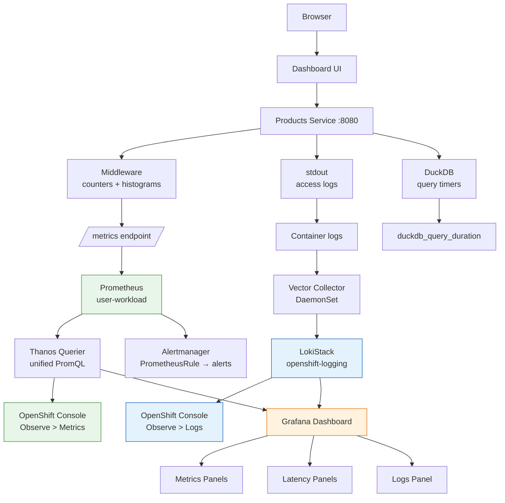

# L07 — Testing & Validation Guide

Test every L07 observability feature: Prometheus metrics, Loki centralized logs, Grafana dashboards, and alerting rules. Generate traffic from the ShopInsights dashboard and observe all three pillars in the OpenShift Console and Grafana.

**Prerequisites:** Run `scripts/setup.sh` or complete all manual steps. The instrumented Products Service, ServiceMonitor, PrometheusRule, LokiStack, ClusterLogForwarder, and Grafana should all be deployed.

---

## Observability Architecture



---

## Get All URLs

Run this to print every URL you need for testing:

```bash
echo ""
echo "=== L07 Observability URLs ==="
echo ""
echo "--- ShopInsights App ---"
echo "  Dashboard UI:       https://$(oc get route dashboard-ui -n shopinsights -o jsonpath='{.spec.host}')"
echo "  Products Service:   https://$(oc get route products-service -n shopinsights -o jsonpath='{.spec.host}')"
echo "  Products /metrics:  https://$(oc get route products-service -n shopinsights -o jsonpath='{.spec.host}')/metrics"
echo ""
echo "--- OpenShift Console (wraps Prometheus + Loki) ---"
CONSOLE=$(oc get route console -n openshift-console -o jsonpath='{.spec.host}')
echo "  Metrics (PromQL):   https://${CONSOLE}/monitoring/query-browser"
echo "  Targets:            https://${CONSOLE}/monitoring/targets"
echo "  Alerts:             https://${CONSOLE}/monitoring/alerts"
echo "  Logs (Loki):        https://${CONSOLE}/monitoring/logs"
echo ""
echo "--- Grafana (custom instance) ---"
echo "  Dashboard:          https://$(oc get route grafana-route -n shopinsights -o jsonpath='{.spec.host}')"
echo "  Login:              admin / admin  (or browse anonymously)"
echo ""
echo "--- Native UIs (API-only routes, use port-forward for full UI) ---"
echo "  Prometheus API:     https://$(oc get route prometheus-k8s -n openshift-monitoring -o jsonpath='{.spec.host}')/api"
echo "  Thanos API:         https://$(oc get route thanos-querier -n openshift-monitoring -o jsonpath='{.spec.host}')/api"
echo "  Alertmanager API:   https://$(oc get route alertmanager-main -n openshift-monitoring -o jsonpath='{.spec.host}')/api"
echo ""
```

Open these URLs in separate browser tabs:

| Tab | URL | Purpose |
|-----|-----|---------|
| **ShopInsights** | Dashboard UI URL | Generate traffic by clicking around |
| **Console Metrics** | `.../monitoring/query-browser` | Run PromQL queries, view Prometheus data |
| **Console Logs** | `.../monitoring/logs` | View centralized Loki logs |
| **Console Targets** | `.../monitoring/targets` | Verify ServiceMonitor scrape target |
| **Console Alerts** | `.../monitoring/alerts` | Check PrometheusRule alert status |
| **Grafana** | Grafana route URL | View unified metrics + logs dashboard |

### Where are the native Prometheus / Alertmanager UIs?

OpenShift exposes Prometheus, Thanos Querier, and Alertmanager routes, but only for their `/api` paths — the web UIs (Prometheus `/graph`, Alertmanager `/#/alerts`) are **not routed**. This is by design: the OpenShift Console is the unified frontend that wraps all of them.

To access the native UIs (useful for debugging or if you're used to the classic Prometheus UI), use `oc port-forward`:

```bash
# Prometheus native UI → http://localhost:9090
oc port-forward -n openshift-monitoring svc/prometheus-k8s 9090:9090 &

# Thanos Querier native UI → http://localhost:9091
oc port-forward -n openshift-monitoring svc/thanos-querier 9091:9091 &

# Alertmanager native UI → http://localhost:9093
oc port-forward -n openshift-monitoring svc/alertmanager-main 9093:9093 &
```

> **Note:** Loki has **no native UI** — it's a pure API backend. You browse Loki logs either through the OpenShift Console (Observe > Logs) or through Grafana's Explore view with the Loki datasource.

| System | Has its own UI? | How to access on OpenShift |
|--------|----------------|--------------------------|
| **Prometheus** | Yes (`:9090/graph`) | `oc port-forward` or Console > Observe > Metrics |
| **Thanos Querier** | Yes (`:9091/graph`) | `oc port-forward` or Console > Observe > Metrics |
| **Alertmanager** | Yes (`:9093`) | `oc port-forward` or Console > Observe > Alerts |
| **Loki** | No (API only) | Console > Observe > Logs, or Grafana Explore |
| **Grafana** | Yes | Exposed via Route (our custom instance) |

---

## Step 1: Verify the stack is healthy

Before generating traffic, confirm all components are running:

```bash
echo "=== Stack Health Check ==="
echo ""
echo "1. User workload Prometheus:"
oc get pods -n openshift-user-workload-monitoring --no-headers | grep prometheus-user-workload
echo ""
echo "2. ServiceMonitor + PrometheusRule:"
oc get servicemonitor,prometheusrule -n shopinsights --no-headers
echo ""
echo "3. LokiStack:"
oc get lokistack -n openshift-logging --no-headers
echo ""
echo "4. Loki pods:"
oc get pods -n openshift-logging -l app.kubernetes.io/instance=logging-loki --no-headers
echo ""
echo "5. Vector collector:"
oc get pods -n openshift-logging -l app.kubernetes.io/component=collector --no-headers
echo ""
echo "6. Grafana:"
oc get pods -n shopinsights -l app=grafana --no-headers
echo ""
echo "7. Products Service:"
oc get pods -n shopinsights -l component=products-service --no-headers
```

**Expected:** All pods show `Running` with `1/1` or `2/2` ready. The LokiStack shows 7 pods (compactor, distributor, gateway, index-gateway, ingester, querier, query-frontend).

---

## Step 2: Verify the scrape target is UP

1. Open **Console Targets** tab (`/monitoring/targets`)
2. Find `products-service-monitor` in the `shopinsights` namespace
3. Confirm:
   - **Status**: Up (green checkmark)
   - **Last Scrape**: a recent timestamp (within 15s)
   - **Scrape Duration**: a few milliseconds (typically 5-10ms)

**This validates:** the ServiceMonitor is correctly configured and Prometheus is scraping `/metrics` from the Products Service.

---

## Step 3: Generate traffic from the ShopInsights Dashboard

Open the **ShopInsights Dashboard UI** and interact with it:

1. Click **Products** tab — this calls `GET /products`
2. Click **Refresh** 10-15 times to generate sustained traffic
3. Click on individual products to trigger `GET /products/{id}` requests
4. If the Dashboard has a "Create Product" form, create 2-3 test products (triggers `POST /products`)

Every request increments the `http_requests_total` counter, records a duration in the `http_request_duration_seconds` histogram, and instruments the underlying DuckDB query.

Alternatively, generate traffic from the CLI:

```bash
PRODUCTS_URL=$(oc get route products-service -n shopinsights -o jsonpath='{.spec.host}')
for i in $(seq 1 50); do curl -sk "https://$PRODUCTS_URL/products" > /dev/null; done
echo "50 requests sent"
```

Or use the demo script which sends ~95 requests across multiple endpoints:

```bash
./scripts/demo.sh
```

---

## Step 4: View metrics in the Prometheus UI (Console)

Open the **Console Metrics** tab (`/monitoring/query-browser`).

### 4a. Request rate by endpoint

Paste this PromQL query and click **Run Queries**, then switch to **Graph** view:

```promql
sum(rate(http_requests_total{namespace="shopinsights"}[5m])) by (exported_endpoint, method)
```

**What to look for:**
- A line chart showing request rates for each endpoint
- `exported_endpoint` values: `/products`, `/products/{id}`, `/healthz`, `/ready`, `/docs`, `/openapi.json`
- `/healthz` and `/ready` have a steady baseline (Kubernetes probes)
- `/products` spikes when you click in the Dashboard

> **Note:** Our app's `endpoint` label gets renamed to `exported_endpoint` by Prometheus because `endpoint` is a reserved ServiceMonitor label. Always use `exported_endpoint` in queries.

### 4b. P95 latency by endpoint

```promql
histogram_quantile(0.95, sum(rate(http_request_duration_seconds_bucket{namespace="shopinsights"}[5m])) by (le, exported_endpoint))
```

**What to look for:**
- `/healthz` is very fast (<5ms)
- `/products` is slower — it queries DuckDB

### 4c. DuckDB query duration

```promql
histogram_quantile(0.95, sum(rate(duckdb_query_duration_seconds_bucket{namespace="shopinsights"}[5m])) by (le, query_type))
```

**What to look for:**
- `query_type` labels: `select_all`, `select_by_id`, `init_read_parquet`
- All should be sub-millisecond

### 4d. Active connections

```promql
active_connections{namespace="shopinsights"}
```

### 4e. Error rate

```promql
sum(rate(http_requests_total{namespace="shopinsights", status=~"5.."}[5m])) / sum(rate(http_requests_total{namespace="shopinsights"}[5m])) * 100
```

**Expected:** 0% or no data (no 5xx errors under normal operation).

---

## Step 5: Check alerting rules

Open the **Console Alerts** tab (`/monitoring/alerts`) and click **Alerting rules**.

1. Filter by **Source: User**
2. You should see two rules:
   - **ProductsHighLatency** — Severity: Warning, State: Inactive
   - **ProductsHighErrorRate** — Severity: Critical, State: Inactive
3. Click either rule to see its PromQL expression, annotations, and labels

**This validates:** alerting rules are loaded and evaluated. Both are inactive because latency is below 500ms and there are no 5xx errors.

---

## Step 6: View the /metrics endpoint directly

See the raw Prometheus text format:

```bash
oc exec deploy/products-service -- python3 -c "
import urllib.request
print(urllib.request.urlopen('http://localhost:8080/metrics').read().decode()[:3000])
"
```

Or open the Products Service `/metrics` URL in a browser (from the URLs printed in Step 0).

**What to look for:**
- `# HELP` and `# TYPE` lines for each metric
- `http_requests_total{endpoint="...",method="...",status="..."}` counter values
- `http_request_duration_seconds_bucket{...}` histogram buckets
- `duckdb_query_duration_seconds_bucket{...}` histogram buckets
- `active_connections` gauge value

---

## Step 7: View centralized logs in Loki (Console)

Open the **Console Logs** tab (`/monitoring/logs`).

### 7a. Browse by namespace

1. In the **Namespace** filter, select `shopinsights`
2. You should see live log entries from all ShopInsights pods
3. Click the **Pod** filter and select the `products-service-*` pod
4. You should see Uvicorn access log lines: `GET /products 200`, `GET /healthz 200`

### 7b. Try a LogQL query

Click **Show LogQL** and paste:

```logql
{kubernetes_namespace_name="shopinsights"} |= "products"
```

This filters for log lines containing "products" from any pod in the namespace.

### 7c. Verify from CLI

```bash
# Query Loki directly for recent products-service logs
TOKEN=$(oc create token grafana-sa -n shopinsights --duration=1h)
oc exec -n openshift-logging deploy/logging-loki-querier -- curl -sk \
  -H "Authorization: Bearer $TOKEN" \
  "https://logging-loki-gateway-http.openshift-logging.svc.cluster.local:8080/api/logs/v1/application/loki/api/v1/query_range" \
  --data-urlencode 'query={kubernetes_namespace_name="shopinsights",kubernetes_container_name="products-service"}' \
  --data-urlencode 'limit=5' | python3 -m json.tool | head -30
```

**What to look for:**
- Logs appear within 10-30 seconds of generating traffic
- `/healthz` and `/ready` probes appear as a steady stream
- `/products` requests appear when you click in the Dashboard

---

## Step 8: View pod logs (CLI and Console)

### 8a. CLI logs

```bash
# Stream live logs (Ctrl+C to stop)
oc logs -f deploy/products-service

# Last 20 lines
oc logs deploy/products-service --tail=20

# Logs from the last 5 minutes
oc logs deploy/products-service --since=5m
```

### 8b. Console pod logs

1. In the **Console**, switch to the **Developer** perspective
2. Select the `shopinsights` project
3. Navigate to **Topology** and click the `products-service` pod
4. Click the **Logs** tab in the side panel
5. Live tail is enabled — new requests appear in real time as you click in the Dashboard

---

## Step 9: Explore the Grafana Dashboard

Open the **Grafana** URL and navigate to **Dashboards > shopinsights > ShopInsights - Products Service**.

### 9a. Metrics panels (top section)

| Panel | Data Source | What to look for |
|-------|-----------|-----------------|
| **Request Rate** | Prometheus | req/s by endpoint — spikes when you click in Dashboard |
| **Error Rate** | Prometheus | 0% under normal operation (shows "No data" if no errors) |
| **P50/P95/P99 Latency** | Prometheus | Three lines showing response time distribution |
| **DuckDB Query Duration** | Prometheus | P95 latency for select_all, select_by_id, init_read_parquet |
| **Active Connections** | Prometheus | Current in-flight request count (near 0 normally) |
| **Total Requests** | Prometheus | Cumulative count — increases with each Dashboard click |
| **Requests by Status Code** | Prometheus | Pie chart — mostly 200s, some 404s |

### 9b. Logs panel (bottom section)

Scroll down to **Recent Logs (Products Service)**:

- Live log stream from the Products Service container via Loki
- Each entry shows a timestamp and the full log JSON
- Click **Enable log details** (expand a log line) to see Kubernetes labels: namespace, pod name, container, node

### 9c. Verify datasource connections

Go to **Connections > Data sources** in the Grafana sidebar:

| Datasource | Type | Test |
|-----------|------|------|
| **Prometheus** | prometheus | Click **Test** — should show "Data source is working" |
| **Loki** | loki | Click **Test** — should show "Data source successfully connected" |

---

## Step 10: Correlate metrics with logs (traffic burst test)

This demonstrates the power of having metrics and logs in the same dashboard.

1. Open **Grafana** with the ShopInsights dashboard visible
2. Set the time range to **Last 15 minutes** and enable **Auto-refresh** (every 10s)
3. Switch to the **ShopInsights Dashboard UI** and rapidly click **Products** tab + **Refresh** 30+ times over ~30 seconds
4. Switch back to **Grafana**

**What to look for:**
- The **Request Rate** panel shows a visible spike at the right edge
- The **Recent Logs** panel shows a burst of log entries at the same timestamp
- The spike in metrics and the burst in logs are correlated — same requests, two views
- This is the core value of unified observability: one dashboard, metrics + logs

---

## Step 11: Developer perspective monitoring

1. In the **Console**, switch to the **Developer** perspective
2. Click **Observe** in the left navigation
3. Select the **Metrics** tab

**What to look for:**
- Pre-built graphs for CPU and Memory usage of your workloads
- Switch to a custom PromQL query and run the same queries from Step 4
- The **Events** tab shows Kubernetes events (pod scheduling, image pulls, probe failures)

---

## Summary

| Feature | Generate by | Observe in |
|---------|------------|------------|
| Custom Prometheus metrics | Any Dashboard click | Console > Observe > Metrics |
| Scrape target health | — | Console > Observe > Targets |
| Alerting rules | — | Console > Observe > Alerting |
| Request rate by endpoint | Dashboard Products tab | PromQL + Grafana Request Rate panel |
| P95 latency | Dashboard Products tab | PromQL + Grafana Latency panel |
| DuckDB query timing | Dashboard Products tab | PromQL + Grafana DuckDB panel |
| Active connections | Dashboard Products tab | Grafana Active Connections stat |
| Error rate | (none under normal use) | Grafana Error Rate panel |
| Centralized logs | Any pod activity | Console > Observe > Logs |
| Filtered logs (LogQL) | Any pod activity | Console > Observe > Logs (LogQL) |
| Grafana metrics panels | Dashboard Products tab | Grafana dashboard (7 panels) |
| Grafana logs panel | Dashboard Products tab | Grafana Recent Logs panel |
| Metrics-logs correlation | Traffic burst | Grafana (spike + log burst at same time) |

---

## Known Limitations

1. **`exported_endpoint` vs `endpoint`** — Prometheus renames our app's `endpoint` label to `exported_endpoint` because `endpoint` is reserved by ServiceMonitors. Use `exported_endpoint` in all PromQL queries.

2. **Rate queries need time** — `rate(...[5m])` needs at least two scrapes within the 5-minute window. After deploying, wait ~30 seconds before running rate queries.

3. **Loki log ingestion delay** — Logs may take 10-30 seconds to appear in Console > Observe > Logs or Grafana after being generated.

4. **Grafana datasource tokens expire** — The `grafana-sa` token created with `--duration=8760h` lasts 1 year. If datasources stop working, regenerate the token and update the datasource CRs.

5. **Container-level log filtering** — The ClusterLogForwarder collects only from `products-service`, `orders-service`, `analytics-service`, and `dashboard-ui` containers in the `shopinsights` namespace. Logs from other containers (build pods, sidecars) are not forwarded to Loki.
