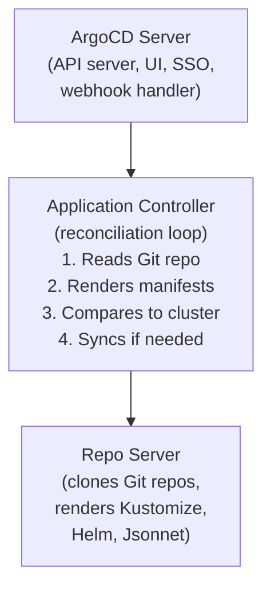
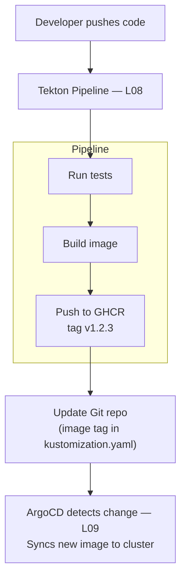

# LP-L09 — GitOps with ArgoCD: Why It Matters and How It Works

**Level:** Personalized
**Duration:** 1 hr

## Overview

GitOps makes Git the single source of truth for your cluster state. Instead of running `oc apply` from your laptop, you commit YAML to a Git repository, and ArgoCD — a controller running inside the cluster — continuously reconciles the cluster to match what is in Git. If someone changes something on the cluster directly, ArgoCD detects the drift and corrects it.

In this lesson, you install the OpenShift GitOps operator (which provides ArgoCD), create a Kustomize-based Git repository structure for the ShopInsights application, deploy to dev and staging environments, and watch ArgoCD detect and revert manual drift.

## Prerequisites

- Completed: [L01](../L01_deploy_microservices/) through [L08](../L08_cicd_pipeline/)
- OpenShift cluster running (CRC or Developer Sandbox)
- Logged in: `oc login -u developer -p developer https://api.crc.testing:6443`
- `kubeadmin` access available (needed to install the GitOps operator)
- A Git repository you can push to (GitHub, GitLab, etc.) — or you can use the local example in this lesson

## K8s Context

In vanilla Kubernetes, you would install ArgoCD yourself: apply the upstream manifests or use a Helm chart, configure the ArgoCD server, set up RBAC, and manage upgrades. You get a powerful GitOps engine, but the installation and lifecycle management is entirely on you.

In OpenShift, the **OpenShift GitOps** operator installs and manages ArgoCD for you. One click in OperatorHub (or one Subscription YAML) and you get a fully configured ArgoCD instance with SSO integration, the ArgoCD dashboard accessible via a Route, and RBAC tied to OpenShift's authentication.

## Why GitOps?

This is the most important section of this lesson. Before learning **how** ArgoCD works, you need to understand **why** it exists.

### The Problem

Picture this scenario:

1. You `oc apply -f deployment.yaml` to update the products-service image tag.
2. Your colleague `oc apply` a different change to the same Deployment — adding an environment variable.
3. A week later, someone `oc delete`s a ConfigMap by accident during debugging.
4. A month later, you need to recreate the staging environment. Nobody remembers the exact state of the cluster. There are no change logs. The YAML files on everyone's laptops are all different versions.

This is **configuration drift** — the cluster state has diverged from any single source of truth. In a team of one, you might get away with it. In a team of five, it is a disaster.

### The Solution

GitOps flips the model:

- **Git is the single source of truth.** The desired state of every resource lives in a Git repository — not on anyone's laptop, not in a shared Wiki, not in someone's head.
- **Every change goes through a pull request.** Want to change the replica count? Open a PR, get it reviewed, merge it. The Git history is your audit trail.
- **A controller enforces the desired state.** ArgoCD runs inside the cluster and continuously compares what is in Git to what is on the cluster. If they differ, ArgoCD either alerts you or automatically corrects the drift.
- **Rollback is `git revert`.** If a change breaks production, revert the commit. ArgoCD syncs the previous state back to the cluster. No `oc rollback`, no digging through revision history.

### What GitOps Is NOT

GitOps is not just "putting YAML in Git." You probably already do that. The critical difference is the **reconciliation loop** — a controller actively and continuously enforcing that the cluster matches Git. Without the controller, YAML in Git is just documentation that may or may not match reality.

### Benefits Summary

| Benefit | How GitOps delivers it |
|---------|----------------------|
| Audit trail | Every change is a Git commit with author, timestamp, and diff |
| Rollback | `git revert` the bad commit, ArgoCD syncs the previous state |
| Reproducible environments | Clone the repo, point ArgoCD at a new cluster, done |
| PR-based change management | Code review for infrastructure, not just application code |
| Drift detection | ArgoCD alerts when cluster state differs from Git |
| Self-healing | ArgoCD auto-corrects unauthorized manual changes |
| Disaster recovery | The entire cluster state is in Git — recreate from scratch |

## Concepts

### ArgoCD Architecture

ArgoCD has three core components:



- **Application Controller**: The brain. Watches ArgoCD `Application` CRDs, polls Git, compares desired state to live state, and performs syncs.
- **Repo Server**: Clones Git repositories and renders manifests (Kustomize overlays, Helm charts, plain YAML). Caches results for performance.
- **ArgoCD Server**: The API and UI. Provides the dashboard, handles webhooks from Git, and exposes the ArgoCD API.

### The Application CRD

The `Application` is ArgoCD's core resource. It tells ArgoCD:
- Where is the Git repo? (`spec.source.repoURL`)
- What path in the repo? (`spec.source.path`)
- Where should it deploy? (`spec.destination.namespace`)
- How should it sync? (`spec.syncPolicy`)

### Sync Policies

| Policy | Behavior |
|--------|----------|
| **Manual** | ArgoCD detects drift but waits for you to click "Sync" |
| **Automatic** | ArgoCD syncs immediately when it detects a difference |
| **Self-heal** | ArgoCD reverts manual changes made directly on the cluster |
| **Prune** | ArgoCD deletes resources that exist on the cluster but not in Git |

For production, you typically use automatic sync with self-heal and prune enabled. This means the cluster always matches Git — no exceptions.

### Kustomize Overlays for Multi-Environment

Instead of duplicating YAML for dev and staging, Kustomize lets you define a **base** set of resources and **overlays** that patch specific values per environment:

```
gitops-repo/
  base/
    kustomization.yaml         # Lists all base resources
    products-deployment.yaml   # 1 replica, default config
    services.yaml
    routes.yaml
    configmap.yaml
  overlays/
    dev/
      kustomization.yaml       # Patches base for dev
      config-patch.yaml        # Dev-specific config
    staging/
      kustomization.yaml       # Patches base for staging
      config-patch.yaml        # Staging-specific config
```

ArgoCD natively supports Kustomize — you point the Application at an overlay path, and ArgoCD renders the final manifests automatically.

### Integration with CI/CD (L08)

In L08, you built a Tekton pipeline that builds images and pushes them to GHCR. GitOps completes the picture:



The pipeline handles **CI** (build and test). ArgoCD handles **CD** (deploy). The Git repository is the handoff point between them. The pipeline never runs `oc apply` — it updates a file in Git, and ArgoCD does the rest.

## Step-by-Step

### Step 1: Install the OpenShift GitOps Operator

Log in as `kubeadmin` to install the operator:

```bash
oc login -u kubeadmin -p $(cat ~/.crc/machines/crc/kubeadmin-password) https://api.crc.testing:6443
```

Apply the operator subscription:

```bash
oc apply -f manifests/gitops-operator-subscription.yaml
```

```yaml
# manifests/gitops-operator-subscription.yaml
apiVersion: operators.coreos.com/v1alpha1
kind: Subscription
metadata:
  name: openshift-gitops-operator
  namespace: openshift-operators
  labels:
    app: shopinsights
    tutorial: personalized
    lesson: "09"
spec:
  channel: latest
  installPlanApproval: Automatic
  name: openshift-gitops-operator
  source: redhat-operators
  sourceNamespace: openshift-marketplace
```

Wait for the operator to install:

```bash
oc get csv -n openshift-operators -w
```

Wait until the `openshift-gitops-operator` CSV shows `Succeeded` in the PHASE column. This may take 2-3 minutes.

The operator automatically creates an ArgoCD instance in the `openshift-gitops` namespace.

### Step 2: Access the ArgoCD Dashboard

The operator provisions an ArgoCD instance with a Route. Find the dashboard URL:

```bash
oc get route openshift-gitops-server -n openshift-gitops -o jsonpath='{.spec.host}'
```

This should return something like:

```
openshift-gitops-server-openshift-gitops.apps-crc.testing
```

Open it in your browser:

```
https://openshift-gitops-server-openshift-gitops.apps-crc.testing
```

Log in with **"Log in via OpenShift"** — this uses the cluster's OAuth. If you are logged in as `kubeadmin`, you have full ArgoCD admin access.

Alternatively, get the `admin` password from the ArgoCD secret:

```bash
oc get secret openshift-gitops-cluster -n openshift-gitops -o jsonpath='{.data.admin\.password}' | base64 -d
```

### Step 3: Prepare the GitOps Repository Structure

In a real project, the GitOps repository would be a separate Git repo from your application code. For this tutorial, we provide the structure in `gitops-repo-example/`.

Examine the layout:

```bash
tree L09_gitops/gitops-repo-example/
```

```
gitops-repo-example/
├── base/
│   ├── kustomization.yaml
│   ├── products-deployment.yaml
│   ├── orders-deployment.yaml
│   ├── analytics-deployment.yaml
│   ├── dashboard-deployment.yaml
│   ├── services.yaml
│   ├── routes.yaml
│   └── configmap.yaml
└── overlays/
    ├── dev/
    │   ├── kustomization.yaml
    │   └── config-patch.yaml
    └── staging/
        ├── kustomization.yaml
        └── config-patch.yaml
```

The **base** contains the complete ShopInsights application manifests — Deployments, Services, Routes, and ConfigMaps. The **overlays** customize the base for each environment:

- **dev**: 1 replica per service, debug logging, relaxed resource limits
- **staging**: 2 replicas per service, info logging, production-like resource limits

To use this with ArgoCD, push the `gitops-repo-example/` contents to a Git repository you control. For example:

```bash
# Create a new repo on GitHub, then:
cd L09_gitops/gitops-repo-example
git init
git add .
git commit -m "Initial ShopInsights GitOps manifests"
git remote add origin https://github.com/<your-username>/shopinsights-gitops.git
git push -u origin main
```

### Step 4: Grant ArgoCD Permissions

ArgoCD needs permission to manage resources in your project namespaces. Create the target namespaces and grant the ArgoCD service account access:

```bash
# Switch back to developer user for project creation
oc login -u developer -p developer https://api.crc.testing:6443

# Create namespaces for dev and staging
oc new-project shopinsights-dev
oc new-project shopinsights-staging

# Switch to kubeadmin to grant ArgoCD permissions
oc login -u kubeadmin -p $(cat ~/.crc/machines/crc/kubeadmin-password) https://api.crc.testing:6443

# Grant ArgoCD service account admin access to both namespaces
oc adm policy add-role-to-user admin system:serviceaccount:openshift-gitops:openshift-gitops-argocd-application-controller -n shopinsights-dev
oc adm policy add-role-to-user admin system:serviceaccount:openshift-gitops:openshift-gitops-argocd-application-controller -n shopinsights-staging
```

### Step 5: Create an ArgoCD AppProject

An AppProject defines what repositories and namespaces an ArgoCD Application can access. This is a security boundary — it prevents one team's ArgoCD Applications from deploying to another team's namespaces.

```bash
oc apply -f manifests/argocd-appproject.yaml
```

```yaml
# manifests/argocd-appproject.yaml
apiVersion: argoproj.io/v1alpha1
kind: AppProject
metadata:
  name: shopinsights
  namespace: openshift-gitops
  labels:
    app: shopinsights
    tutorial: personalized
    lesson: "09"
spec:
  description: ShopInsights application project
  sourceRepos:
    - "https://github.com/<your-username>/shopinsights-gitops.git"
  destinations:
    - namespace: shopinsights-dev
      server: https://kubernetes.default.svc
    - namespace: shopinsights-staging
      server: https://kubernetes.default.svc
  clusterResourceWhitelist:
    - group: ""
      kind: Namespace
  namespaceResourceWhitelist:
    - group: ""
      kind: "*"
    - group: apps
      kind: Deployment
    - group: route.openshift.io
      kind: Route
```

Replace `<your-username>` with your actual GitHub username before applying.

### Step 6: Create the ArgoCD Application for Dev

```bash
oc apply -f manifests/argocd-application-dev.yaml
```

```yaml
# manifests/argocd-application-dev.yaml
apiVersion: argoproj.io/v1alpha1
kind: Application
metadata:
  name: shopinsights-dev
  namespace: openshift-gitops
  labels:
    app: shopinsights
    tutorial: personalized
    lesson: "09"
    environment: dev
spec:
  project: shopinsights
  source:
    repoURL: https://github.com/<your-username>/shopinsights-gitops.git
    targetRevision: main
    path: overlays/dev
  destination:
    server: https://kubernetes.default.svc
    namespace: shopinsights-dev
  syncPolicy:
    automated:
      selfHeal: true
      prune: true
    syncOptions:
      - CreateNamespace=false
```

Key fields:

- **`source.path: overlays/dev`**: ArgoCD renders the Kustomize overlay at this path
- **`destination.namespace: shopinsights-dev`**: Resources deploy to the dev namespace
- **`syncPolicy.automated`**: ArgoCD syncs automatically when Git changes
- **`selfHeal: true`**: ArgoCD reverts manual cluster changes
- **`prune: true`**: ArgoCD deletes resources removed from Git

### Step 7: Create the ArgoCD Application for Staging

```bash
oc apply -f manifests/argocd-application-staging.yaml
```

```yaml
# manifests/argocd-application-staging.yaml
apiVersion: argoproj.io/v1alpha1
kind: Application
metadata:
  name: shopinsights-staging
  namespace: openshift-gitops
  labels:
    app: shopinsights
    tutorial: personalized
    lesson: "09"
    environment: staging
spec:
  project: shopinsights
  source:
    repoURL: https://github.com/<your-username>/shopinsights-gitops.git
    targetRevision: main
    path: overlays/staging
  destination:
    server: https://kubernetes.default.svc
    namespace: shopinsights-staging
  syncPolicy:
    automated:
      selfHeal: true
      prune: true
    syncOptions:
      - CreateNamespace=false
```

Same structure as dev, but pointing at `overlays/staging` — which patches replica counts to 2 and uses staging-specific configuration.

### Step 8: Watch the Initial Sync

ArgoCD will immediately detect that the cluster does not match Git (because the namespaces are empty) and start syncing:

```bash
# Watch ArgoCD Applications
oc get applications -n openshift-gitops -w
```

Expected output (after a minute or two):

```
NAME                   SYNC STATUS   HEALTH STATUS
shopinsights-dev       Synced        Healthy
shopinsights-staging   Synced        Healthy
```

Verify the resources were created:

```bash
# Dev environment — 1 replica per service
oc get pods -n shopinsights-dev
oc get routes -n shopinsights-dev

# Staging environment — 2 replicas per service
oc get pods -n shopinsights-staging
oc get routes -n shopinsights-staging
```

You should see 1 pod per service in dev, 2 pods per service in staging — all from the same Git repo, differentiated only by Kustomize overlays.

### Step 9: Make a Change in Git and Watch ArgoCD Sync

Now update the Git repository and watch ArgoCD detect and apply the change.

In your GitOps repo, update the dev overlay to change the log level:

```bash
cd <your-gitops-repo>

# Edit overlays/dev/config-patch.yaml — change LOG_LEVEL from DEBUG to INFO
# Then commit and push:
git add .
git commit -m "Change dev log level to INFO"
git push
```

Watch ArgoCD detect the change (it polls every 3 minutes by default, or you can configure webhooks):

```bash
oc get applications shopinsights-dev -n openshift-gitops -w
```

The status will briefly show `OutOfSync`, then `Synced` as ArgoCD applies the update. You can also watch this happen in real time in the ArgoCD dashboard.

Verify the ConfigMap was updated:

```bash
oc get configmap shopinsights-config -n shopinsights-dev -o yaml
```

### Step 10: Demonstrate Drift Detection and Self-Healing

This is where GitOps proves its value. Manually change something on the cluster and watch ArgoCD revert it.

Scale the products-service to 3 replicas manually:

```bash
oc scale deployment products-service -n shopinsights-dev --replicas=3
```

Check the current state:

```bash
oc get pods -n shopinsights-dev -l component=products-service
```

You will briefly see 3 pods. But within seconds, ArgoCD detects the drift (the Git repo says 1 replica) and scales it back down:

```bash
# Wait a few seconds, then check again
oc get pods -n shopinsights-dev -l component=products-service
```

Back to 1 pod. Check the ArgoCD Application status to see the self-heal event:

```bash
oc describe application shopinsights-dev -n openshift-gitops | grep -A5 "Sync Status"
```

In the ArgoCD dashboard, you can see the event timeline showing the drift detection and automatic correction.

This is the core promise of GitOps: **the cluster always matches Git.** If someone runs `oc scale`, `oc edit`, or `oc delete` directly, ArgoCD reverts it. The only way to change the cluster state is through a Git commit.

### Step 11: Connect with the CI/CD Pipeline (L08)

In L08, you built a Tekton pipeline that builds images and pushes them to GHCR. The missing piece was deployment — the pipeline built the image but did not deploy it. With GitOps, the deployment step becomes a Git commit.

Here is how the full workflow looks:

```bash
# After the Tekton pipeline builds and pushes a new image (e.g., v1.2.3),
# the final pipeline task would update the image tag in the GitOps repo:

cd <your-gitops-repo>

# Update the image tag in the base deployment
# Using kustomize edit or sed:
cd overlays/dev
kustomize edit set image ghcr.io/<your-username>/shopinsights-products:v1.2.3

git add .
git commit -m "Update products-service to v1.2.3"
git push

# ArgoCD detects the change and deploys the new image
```

In a real pipeline, this Git update would be automated — the final Tekton Task would clone the GitOps repo, update the image tag, commit, and push. The pipeline never touches the cluster directly. It only touches Git. ArgoCD handles the rest.

### Step 12: View the ArgoCD Dashboard

Open the ArgoCD dashboard in your browser:

```bash
# Get the URL
oc get route openshift-gitops-server -n openshift-gitops -o jsonpath='{.spec.host}'
```

In the dashboard, you can see:

- **Application list**: Both `shopinsights-dev` and `shopinsights-staging` with their sync status
- **Application detail view**: Click on an application to see all managed resources in a tree view — Deployments, Services, Routes, ConfigMaps, and their live status
- **Sync history**: When each sync happened, what changed, and whether it was automatic or manual
- **Diff view**: Click "App Diff" to see differences between Git and the cluster (should be empty when synced)
- **Resource tree**: Visual representation of the Kubernetes resource hierarchy

The dashboard is accessible via the Route that the GitOps operator created automatically — no extra setup needed, unlike installing the ArgoCD UI yourself in vanilla K8s.

## Verification

Run these commands to verify everything is working:

```bash
echo "=== ArgoCD Applications ==="
oc get applications -n openshift-gitops -o custom-columns=NAME:.metadata.name,SYNC:.status.sync.status,HEALTH:.status.health.status

echo ""
echo "=== Dev Environment ==="
oc get pods -n shopinsights-dev -o custom-columns=NAME:.metadata.name,READY:.status.containerStatuses[0].ready,STATUS:.status.phase
oc get routes -n shopinsights-dev -o custom-columns=NAME:.metadata.name,HOST:.spec.host

echo ""
echo "=== Staging Environment ==="
oc get pods -n shopinsights-staging -o custom-columns=NAME:.metadata.name,READY:.status.containerStatuses[0].ready,STATUS:.status.phase
oc get routes -n shopinsights-staging -o custom-columns=NAME:.metadata.name,HOST:.spec.host

echo ""
echo "=== Drift Test ==="
echo "Scaling products-service to 3 replicas manually..."
oc scale deployment products-service -n shopinsights-dev --replicas=3
echo "Waiting 30 seconds for ArgoCD to self-heal..."
sleep 30
REPLICAS=$(oc get deployment products-service -n shopinsights-dev -o jsonpath='{.spec.replicas}')
echo "Replicas after self-heal: $REPLICAS (expected: 1)"
```

Expected output:

```
=== ArgoCD Applications ===
NAME                   SYNC     HEALTH
shopinsights-dev       Synced   Healthy
shopinsights-staging   Synced   Healthy

=== Dev Environment ===
NAME                                  READY   STATUS
products-service-xxx-yyy              true    Running
orders-service-xxx-yyy                true    Running
analytics-service-xxx-yyy             true    Running
dashboard-ui-xxx-yyy                  true    Running

=== Staging Environment ===
NAME                                  READY   STATUS
products-service-xxx-yyy              true    Running
products-service-xxx-zzz              true    Running
orders-service-xxx-yyy                true    Running
orders-service-xxx-zzz                true    Running
...

=== Drift Test ===
Replicas after self-heal: 1 (expected: 1)
```

## K8s vs OpenShift Comparison

| Aspect | Kubernetes | OpenShift |
|--------|-----------|-----------|
| ArgoCD installation | Manual: apply upstream manifests or Helm chart | One-click: OpenShift GitOps operator via OperatorHub |
| ArgoCD upgrades | Manual: update manifests, handle CRD migrations | Automatic: operator manages the lifecycle |
| ArgoCD dashboard | Deploy the ArgoCD server, create an Ingress, configure TLS | Auto-provisioned Route with TLS |
| Authentication | Configure ArgoCD's built-in auth or OIDC integration | Integrated with OpenShift OAuth ("Log in via OpenShift") |
| RBAC | ArgoCD's own RBAC system | Maps to OpenShift users and groups |
| Multi-tenancy | Manual configuration of AppProjects and RBAC | Operator supports namespace-scoped ArgoCD instances |
| Git repository | Any Git provider | Same — ArgoCD works with any Git provider |
| Kustomize/Helm | Supported natively | Same — identical manifest rendering |
| Sync policies | Manual, automatic, self-heal, prune | Same — ArgoCD behavior is identical |
| Monitoring | Install ArgoCD metrics exporter separately | Metrics auto-integrated with OpenShift monitoring stack |

## Key Takeaways

- **GitOps is not "YAML in Git"** — it is the reconciliation loop. ArgoCD actively enforces that the cluster matches Git, catching and reverting drift.
- **The OpenShift GitOps operator** eliminates the operational overhead of installing, configuring, and upgrading ArgoCD. It is production-ready in minutes.
- **Kustomize overlays** let you manage multiple environments (dev, staging, production) from a single base, with per-environment patches — no YAML duplication.
- **Self-heal** is the killer feature: manual `oc` commands on the cluster are reverted automatically, enforcing that Git is the only way to change cluster state.
- **CI/CD + GitOps** is a natural split: the pipeline (Tekton, L08) handles build and test, then writes the new image tag to Git. ArgoCD handles deployment. The pipeline never touches the cluster.

## Cleanup

Remove the ArgoCD Applications and projects:

```bash
# Log in as kubeadmin
oc login -u kubeadmin -p $(cat ~/.crc/machines/crc/kubeadmin-password) https://api.crc.testing:6443

# Delete ArgoCD Applications (this also deletes the managed resources because prune is enabled)
oc delete application shopinsights-dev -n openshift-gitops
oc delete application shopinsights-staging -n openshift-gitops

# Delete the AppProject
oc delete appproject shopinsights -n openshift-gitops

# Delete the target namespaces
oc delete project shopinsights-dev
oc delete project shopinsights-staging

# Switch back to developer user
oc login -u developer -p developer https://api.crc.testing:6443
```

To uninstall the GitOps operator entirely (optional — other lessons do not depend on it):

```bash
oc login -u kubeadmin -p $(cat ~/.crc/machines/crc/kubeadmin-password) https://api.crc.testing:6443
oc delete subscription openshift-gitops-operator -n openshift-operators
oc delete csv -l operators.coreos.com/openshift-gitops-operator.openshift-operators -n openshift-operators
```

## Next Steps

Your application now has a complete deployment pipeline: code changes trigger Tekton (L08) to build and test, then ArgoCD (this lesson) deploys the result. But some parts of ShopInsights — like the analytics aggregation — only run periodically. In [L10: Serverless](../L10_serverless/), you will use Knative to run workloads that scale to zero when idle, saving cluster resources and introducing event-driven architectures.
