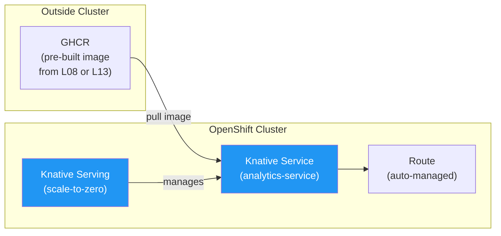
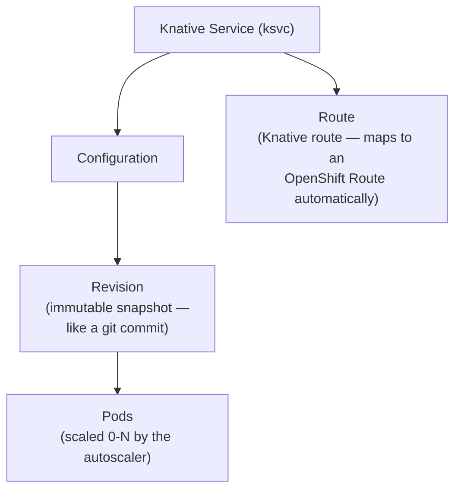

# LP-L10 — Serverless: When Scale-to-Zero Actually Makes Sense

**Level:** Personalized
**Duration:** 45 min

## Overview

The Analytics Service runs 24/7 as a Deployment with a constant pod — but it gets hit sporadically. Maybe a few report requests per hour. The rest of the time, the pod is sitting there idle, consuming CPU and memory. In this lesson, you convert the Analytics Service from a regular Deployment to a Knative Service that scales to zero when idle and spins up on demand.

## Prerequisites

- Completed: [L01](../L01_projects/) through [L09](../L09_gitops/)
- OpenShift cluster running (CRC with at least 16 GB RAM, or Developer Sandbox)
- Logged in as `kubeadmin` (operator installation requires cluster-admin)
- `oc` CLI installed and on PATH

**CRC resource note:** OpenShift Serverless installs Knative Serving (and optionally Eventing) into the cluster. If you have not already increased CRC resources:

```bash
crc stop
crc config set memory 20480    # 20 GB
crc config set cpus 6
crc start
```

## K8s Context

In vanilla Kubernetes, Knative is a manual install:

1. Apply the Knative Serving CRDs and core components from the release YAML
2. Install a networking layer (Kourier, Istio, or Contour)
3. Configure DNS (Magic DNS, real DNS, or a local workaround)
4. Optionally install Knative Eventing for event-driven patterns
5. Manage upgrades yourself

On OpenShift, Knative is delivered as the **OpenShift Serverless** operator. You install it from OperatorHub, create a `KnativeServing` custom resource, and the operator handles networking (using OpenShift Routes), DNS, and upgrades. This follows the same Subscription → InstallPlan → CSV → Custom Resource pattern you have seen with Service Mesh (L03), Pipelines (L08), and GitOps (L09).

---

## Why Serverless?

You said you never fully understood the reason to use serverless. Here is the concrete case.

### The Problem: Paying for Idle

Look at the Analytics Service Deployment from L01:

```yaml
resources:
  requests:
    cpu: 100m
    memory: 128Mi
  limits:
    cpu: 500m
    memory: 512Mi
```

These resources are **reserved 24/7**, even when the pod is doing nothing. The Kubernetes scheduler sets aside 100m CPU and 128Mi memory for this pod around the clock. If the Analytics Service gets a request every 15 minutes on average, that means 95% of the time it is sitting idle, consuming resources that other workloads could use.

On a small CRC cluster, this is an annoyance. In a production cluster running hundreds of microservices — many of them sporadic — it is real money.

### The Solution: Scale to Zero

Serverless (Knative) adds one capability that HPA cannot provide: **scaling to zero**.

```
Traditional Deployment:
  Idle     → 1 pod running  (resources reserved, doing nothing)
  Busy     → 1 pod running  (serving requests)
  Very busy → still 1 pod   (unless you configure HPA)

With HPA:
  Idle     → 1 pod running  (minimum replica = 1, resources still reserved)
  Busy     → 1 pod running  (serving requests)
  Very busy → 1-5 pods      (HPA scales up based on CPU/memory)

With Knative:
  Idle     → 0 pods running (no resources consumed at all)
  Request  → 1 pod spins up (cold start: ~2-5 seconds)
  Busy     → 1+ pods        (Knative autoscaler handles scaling)
  Idle again → 0 pods       (scales back down after idle timeout)
```

**HPA scales 1 to N. Knative scales 0 to N. The difference is that zero.**

For a service like Analytics that is idle 95% of the time, scale-to-zero means you only consume resources during the 5% when requests are actually being served.

### The Tradeoff: Cold Starts

Scale-to-zero is not free. When a request arrives and no pods are running, Knative must:

1. Pull the container image (if not cached on the node)
2. Create a pod
3. Wait for the container to start
4. Wait for the readiness probe to pass
5. Forward the request

This is the **cold start**. For a lightweight Python/FastAPI service like Analytics, expect 2-5 seconds. For a heavy Java application with a large classpath, it could be 10-30 seconds.

### When to Use Serverless

| Use Case | Serverless? | Why |
|----------|-------------|-----|
| Sporadic workloads (analytics, reports, batch) | Yes | Idle most of the time — scale-to-zero saves resources |
| Event-driven processing (webhook handlers) | Yes | Only runs when events arrive |
| Dev/staging environments | Yes | Services are idle when developers are not testing |
| Low-traffic APIs | Yes | If 2-5 second cold start is acceptable |
| **High-traffic APIs (products catalog)** | **No** | Already running at scale — no benefit from scale-to-zero |
| **Latency-sensitive services** | **No** | Cold starts add 2-5 seconds — unacceptable for sub-100ms SLAs |
| **Persistent connections (WebSockets, gRPC streams)** | **No** | Scale-to-zero kills connections — not compatible |
| **Services with large local state** | **No** | State is lost on scale-to-zero — use stateful workloads instead |

The Analytics Service is a textbook serverless candidate: it is stateless (queries Products and Orders on demand), tolerant of a few seconds of latency (reports are not real-time), and idle most of the time.

---

## Build and Deploy Architecture

This lesson replaces the Analytics Service Deployment with a **Knative Service** that scales to zero. The image comes from an external registry, built by CI in a previous lesson:



> **How this lesson fits in the tutorial:**
>
> | Lesson | Build | Registry | Deploy |
> |--------|-------|----------|--------|
> | [L02](../L02_builds_and_images/) | Internal (BuildConfig) | Internal (ImageStream) | Deployment (always-on) |
> | [L08](../L08_cicd_pipeline/) | Internal (Tekton + buildah) | External (GHCR) | Deployment via pipeline |
> | [L13](../L13_cicd_pipeline_github_actions/) | External (GitHub Actions) | External (GHCR) | Deployment via pipeline |
> | **L10 (this)** | **— (uses pre-built image)** | **External (GHCR)** | **Knative Service (scale-to-zero)** |
> | [L09](../L09_gitops/) | — (images pre-built) | External (GHCR) | GitOps (ArgoCD auto-sync) |

## Concepts

### Knative Serving

Knative Serving manages the full lifecycle of a serverless workload. When you create a Knative Service (`ksvc`), it creates four resources under the hood:



- **Service (ksvc)**: the top-level resource you create and manage. Similar in purpose to a Deployment + Service + Route combined.
- **Configuration**: holds the current desired state (container image, env vars, etc.). Every change creates a new Revision.
- **Revision**: an immutable snapshot of a Configuration. Revisions are named automatically (e.g., `analytics-service-00001`, `analytics-service-00002`). They are never modified — only new ones are created.
- **Route**: determines which Revisions receive traffic and in what proportion. This enables canary deployments at the Knative level.

### Scale-to-Zero and Cold Starts

Knative's autoscaler (called the **Knative Pod Autoscaler**, or KPA) watches request concurrency. When no requests arrive for the **stable window** (default 60 seconds), it scales the Revision to zero pods.

When a new request arrives, it hits the **Activator** — a Knative component that buffers the request, triggers a scale-up, and forwards the request once a pod is ready. The time from request arrival to response is the cold start.

Key autoscaling annotations you can tune:

| Annotation | Default | Purpose |
|-----------|---------|---------|
| `autoscaling.knative.dev/window` | `60s` | Stable window — how long to wait before scaling to zero |
| `autoscaling.knative.dev/target` | `100` | Target concurrent requests per pod |
| `autoscaling.knative.dev/minScale` | `0` | Minimum pods (set to 1 to disable scale-to-zero) |
| `autoscaling.knative.dev/maxScale` | `0` (unlimited) | Maximum pods |

### Revision-Based Traffic Splitting

Because every configuration change creates a new Revision, you can split traffic between Revisions — essentially doing canary deployments:

```yaml
traffic:
  - revisionName: analytics-service-00001
    percent: 90
  - revisionName: analytics-service-00002
    percent: 10
```

This is similar to what you did with Istio VirtualService in L03, but built into Knative. For services that are already Knative Services, you do not need Istio for traffic splitting — Knative handles it natively.

### Knative Eventing (Optional)

Knative Eventing provides an event-driven architecture layer:

- **Broker**: an event bus that receives events and distributes them to subscribers
- **Trigger**: a subscription rule — "when an event of type X arrives at the Broker, send it to Service Y"
- **Source**: produces events from external systems (Kafka, GitHub webhooks, cron schedules, etc.)

For ShopInsights, you could set up: "When a new order is created in the Orders Service, emit an event. A Trigger routes that event to the Analytics Service, which recalculates the dashboard." The Analytics Service scales from zero only when an order event arrives.

---

## Step-by-Step

### Step 1: Install the OpenShift Serverless Operator

Log in as cluster admin:

```bash
oc login -u kubeadmin -p <password from crc start> https://api.crc.testing:6443
```

Install the operator:

```bash
oc apply -f manifests/serverless-operator-subscription.yaml
```

```yaml
# manifests/serverless-operator-subscription.yaml
apiVersion: operators.coreos.com/v1alpha1
kind: Subscription
metadata:
  name: serverless-operator
  namespace: openshift-serverless
spec:
  channel: stable
  name: serverless-operator
  source: redhat-operators
  sourceNamespace: openshift-marketplace
  installPlanApproval: Automatic
```

The operator needs its own namespace. Create it first if it does not exist:

```bash
oc create namespace openshift-serverless 2>/dev/null || true
oc apply -f manifests/serverless-operator-subscription.yaml
```

Wait for the operator to install:

```bash
oc get csv -n openshift-serverless -w
```

Expected (takes 2-3 minutes):

```
NAME                          DISPLAY                        PHASE
serverless-operator.v1.x.x   Red Hat OpenShift Serverless   Succeeded
```

### Step 2: Create the KnativeServing Instance

The operator is running, but Knative Serving itself is not deployed yet. You need to create a `KnativeServing` custom resource to tell the operator to set up the serving infrastructure.

```bash
oc apply -f manifests/knative-serving.yaml
```

```yaml
# manifests/knative-serving.yaml
apiVersion: operator.knative.dev/v1beta1
kind: KnativeServing
metadata:
  name: knative-serving
  namespace: knative-serving
spec:
  ingress:
    istio:
      enabled: false
  controller-custom-certs:
    name: ''
    type: ''
```

Create the namespace first:

```bash
oc create namespace knative-serving 2>/dev/null || true
oc apply -f manifests/knative-serving.yaml
```

Wait for KnativeServing to be ready (3-5 minutes on CRC):

```bash
oc get knativeserving knative-serving -n knative-serving -w
```

Expected:

```
NAME              VERSION   READY   REASON
knative-serving   1.x       True
```

Verify the serving components are running:

```bash
oc get pods -n knative-serving
```

You should see pods for `activator`, `autoscaler`, `controller`, `webhook`, and others — all in `Running` state.

### Step 3: Convert Analytics Service to a Knative Service

Here is the key transformation. The Analytics Service currently runs as a Deployment + Service (from L01). You will replace both with a single Knative Service.

First, look at what you are replacing:

```bash
# Current Deployment — always 1 pod running
oc get deployment analytics-service -n shopinsights
oc get pods -n shopinsights -l component=analytics-service
```

Now delete the existing Deployment and Service for Analytics (the Knative Service will take over):

```bash
oc delete deployment analytics-service -n shopinsights
oc delete service analytics-service -n shopinsights
```

Apply the Knative Service:

```bash
oc apply -f manifests/analytics-ksvc.yaml
```

```yaml
# manifests/analytics-ksvc.yaml (key sections)
apiVersion: serving.knative.dev/v1
kind: Service
metadata:
  name: analytics-service
  namespace: shopinsights
spec:
  template:
    metadata:
      annotations:
        autoscaling.knative.dev/window: "60s"
        autoscaling.knative.dev/target: "10"
        autoscaling.knative.dev/minScale: "0"
        autoscaling.knative.dev/maxScale: "5"
    spec:
      containers:
        - image: ghcr.io/<your-username>/shopinsights-analytics:latest
          ports:
            - containerPort: 8080
          resources:
            requests:
              cpu: 100m
              memory: 128Mi
            limits:
              cpu: 500m
              memory: 512Mi
          envFrom:
            - configMapRef:
                name: shopinsights-config
            - secretRef:
                name: shopinsights-secrets
          readinessProbe:
            httpGet:
              path: /ready
              port: 8080
            initialDelaySeconds: 3
            periodSeconds: 5
```

Notice:
- The container spec is almost identical to the Deployment from L01 — same image, same ports, same env vars, same resource limits.
- The `autoscaling.knative.dev/window: "60s"` annotation means the pod will be terminated after 60 seconds of no requests.
- `minScale: "0"` enables scale-to-zero (this is the default, but explicit is better).
- `maxScale: "5"` caps the autoscaler at 5 pods.
- `target: "10"` means Knative will try to maintain 10 concurrent requests per pod before scaling up.
- There is no `livenessProbe` — Knative manages pod lifecycle differently. The readiness probe is used to determine when the pod can receive traffic after a cold start.
- There is no PVC mount — Knative pods are ephemeral. The Analytics Service queries Products and Orders on demand, so it does not need persistent storage.

### Step 4: Verify the Knative Service is Ready

```bash
oc get ksvc analytics-service -n shopinsights
```

Expected:

```
NAME                URL                                                            LATESTCREATED              LATESTREADY                READY   REASON
analytics-service   https://analytics-service-shopinsights.apps-crc.testing        analytics-service-00001    analytics-service-00001    True
```

Key things to note:
- Knative automatically created a Route with a URL. On OpenShift, this is backed by an OpenShift Route (check with `oc get route -n shopinsights`).
- `LATESTCREATED` and `LATESTREADY` show `analytics-service-00001` — this is the first Revision.
- `READY: True` means the service is ready to receive traffic.

Check the Revision:

```bash
oc get revisions -n shopinsights
```

Expected:

```
NAME                        CONFIG NAME         K8S SERVICE NAME   GENERATION   READY   REASON
analytics-service-00001     analytics-service                      1            True
```

### Step 5: Watch Scale-to-Zero

This is the moment of truth. Watch the pods:

```bash
oc get pods -n shopinsights -l serving.knative.dev/service=analytics-service -w
```

Right after deploying the Knative Service, you should see a pod running:

```
NAME                                                  READY   STATUS    RESTARTS   AGE
analytics-service-00001-deployment-xxx-yyy             2/2     Running   0          30s
```

The `2/2` means there are two containers: your application container and the Knative **queue-proxy** sidecar (which handles request buffering, concurrency tracking, and health checks).

Now wait 60 seconds without sending any requests. The pod will terminate:

```
analytics-service-00001-deployment-xxx-yyy   2/2     Running       0     60s
analytics-service-00001-deployment-xxx-yyy   2/2     Terminating   0     90s
analytics-service-00001-deployment-xxx-yyy   0/2     Terminating   0     95s
```

After termination:

```bash
oc get pods -n shopinsights -l serving.knative.dev/service=analytics-service
```

Expected:

```
No resources found in shopinsights namespace.
```

**Zero pods. Zero resources consumed.** The Analytics Service is gone — until someone needs it.

### Step 6: Trigger a Cold Start

Send a request to the Analytics Service and watch the pod come back:

In one terminal, watch pods:

```bash
oc get pods -n shopinsights -l serving.knative.dev/service=analytics-service -w
```

In another terminal, send a request via the Knative route:

```bash
# Get the URL
ANALYTICS_URL=$(oc get ksvc analytics-service -n shopinsights -o jsonpath='{.status.url}')
echo "Analytics URL: $ANALYTICS_URL"

# Send a request (this triggers the cold start)
time curl -s -k "$ANALYTICS_URL/healthz"
```

In the watch terminal, you will see:

```
NAME                                                  READY   STATUS              RESTARTS   AGE
analytics-service-00001-deployment-xxx-yyy             0/2     ContainerCreating   0          0s
analytics-service-00001-deployment-xxx-yyy             1/2     Running             0          2s
analytics-service-00001-deployment-xxx-yyy             2/2     Running             0          3s
```

The `time` command will show the cold start duration:

```
{"status": "healthy"}
real    0m3.456s
```

That 3-4 seconds is the cold start — the time for the pod to be created, the container to start, and the readiness probe to pass. For an analytics report that runs once an hour, this is perfectly acceptable. For a product catalog API serving live user requests, it would not be.

### Step 7: Measure Cold Start Time

Let the service scale to zero again (wait 60 seconds), then measure the cold start precisely:

```bash
# Wait for scale-to-zero
sleep 70

# Measure cold start
echo "--- Cold start timing ---"
time curl -s -k "$ANALYTICS_URL/healthz"

echo ""
echo "--- Warm request timing (pod already running) ---"
time curl -s -k "$ANALYTICS_URL/healthz"
```

Expected output:

```
--- Cold start timing ---
{"status": "healthy"}
real    0m3.2s

--- Warm request timing (pod already running) ---
{"status": "healthy"}
real    0m0.05s
```

The difference is dramatic: ~3 seconds for a cold start vs ~50 milliseconds for a warm request. This is why serverless is not suitable for latency-sensitive workloads — but is excellent for sporadic ones where a few seconds of delay is fine.

### Step 8: Deploy a v2 Revision

Every change to the Knative Service template creates a new immutable Revision. Let us simulate a v2 by adding an environment variable:

```bash
# Add a VERSION env var to simulate a new version
oc patch ksvc analytics-service -n shopinsights --type merge -p '{
  "spec": {
    "template": {
      "metadata": {
        "annotations": {
          "app-version": "v2"
        }
      },
      "spec": {
        "containers": [{
          "image": "ghcr.io/<your-username>/shopinsights-analytics:latest",
          "env": [{
            "name": "APP_VERSION",
            "value": "v2"
          }]
        }]
      }
    }
  }
}'
```

Check the Revisions — you should now see two:

```bash
oc get revisions -n shopinsights
```

Expected:

```
NAME                        CONFIG NAME         GENERATION   READY   REASON
analytics-service-00001     analytics-service   1            True
analytics-service-00002     analytics-service   2            True
```

By default, Knative sends 100% of traffic to the latest Revision (`analytics-service-00002`). The previous Revision (`analytics-service-00001`) still exists but receives no traffic and scales to zero.

### Step 9: Split Traffic Between Revisions (Canary)

Now split traffic 90/10 between v1 and v2:

```bash
oc apply -f manifests/analytics-ksvc-traffic-split.yaml
```

```yaml
# manifests/analytics-ksvc-traffic-split.yaml — traffic split
spec:
  traffic:
    - revisionName: analytics-service-00001
      percent: 90
    - revisionName: analytics-service-00002
      percent: 10
```

Verify the traffic split:

```bash
oc get ksvc analytics-service -n shopinsights -o yaml | grep -A 10 "traffic:"
```

Expected:

```yaml
  traffic:
  - percent: 90
    revisionName: analytics-service-00001
  - percent: 10
    revisionName: analytics-service-00002
```

Test the split by sending multiple requests:

```bash
ANALYTICS_URL=$(oc get ksvc analytics-service -n shopinsights -o jsonpath='{.status.url}')
for i in $(seq 1 20); do
  curl -s -k "$ANALYTICS_URL/healthz"
  echo ""
done
```

You should see roughly 18 responses from v1 and 2 from v2. Both Revisions will scale up to serve their share of traffic, and both will scale back to zero when idle.

This is similar to the Istio-based canary you did in L03, but here it is built into Knative — no VirtualService or DestinationRule needed. For services that are already Knative Services, this is simpler.

### Step 10: (Optional) Set Up Knative Eventing

Knative Eventing enables event-driven architectures. Instead of the Analytics Service being called via HTTP, it can be triggered by events — for example, when a new order is created.

First, install Knative Eventing (if the OpenShift Serverless operator is already installed, you just create the custom resource):

```bash
oc create namespace knative-eventing 2>/dev/null || true
```

Create a Broker in the shopinsights namespace:

```bash
oc apply -f manifests/eventing-broker.yaml
```

```yaml
# manifests/eventing-broker.yaml
apiVersion: eventing.knative.dev/v1
kind: Broker
metadata:
  name: default
  namespace: shopinsights
```

Create a Trigger that routes order events to the Analytics Service:

```bash
oc apply -f manifests/eventing-trigger.yaml
```

```yaml
# manifests/eventing-trigger.yaml
apiVersion: eventing.knative.dev/v1
kind: Trigger
metadata:
  name: analytics-on-new-order
  namespace: shopinsights
spec:
  broker: default
  filter:
    attributes:
      type: com.shopinsights.order.created
  subscriber:
    ref:
      apiVersion: serving.knative.dev/v1
      kind: Service
      name: analytics-service
```

How it works:
1. The Orders Service sends a CloudEvent to the Broker when a new order is created
2. The Trigger matches events with `type: com.shopinsights.order.created`
3. The Trigger forwards the event to the Analytics Service
4. If the Analytics Service is scaled to zero, Knative wakes it up, delivers the event, and the service processes it

This is a fully event-driven pattern: the Analytics Service only runs when there is actual work to do, triggered by real business events.

**Note:** For the Orders Service to send events to the Broker, it would need to POST CloudEvents to `http://broker-ingress.knative-eventing.svc.cluster.local/shopinsights/default`. This requires a small code change in the Orders Service — adding an HTTP POST after order creation. The eventing manifests here set up the infrastructure; the application integration is left as an exercise.

### Step 11: Compare with HPA (Scales 1 to N, Not 0 to N)

To see the difference concretely, let us look at what the equivalent setup would be with a traditional Deployment and HPA:

```bash
oc apply -f manifests/k8s-deployment-hpa.yaml
```

```yaml
# manifests/k8s-deployment-hpa.yaml (key sections)
# Deployment — always at least 1 pod running
spec:
  replicas: 1
  ...
---
# HPA — scales from 1 to 5 based on CPU
spec:
  scaleTargetRef:
    apiVersion: apps/v1
    kind: Deployment
    name: analytics-service-hpa-demo
  minReplicas: 1
  maxReplicas: 5
  metrics:
    - type: Resource
      resource:
        name: cpu
        target:
          type: Utilization
          averageUtilization: 50
```

Compare the two approaches:

```bash
# Knative — after 60 seconds idle, zero pods
oc get pods -n shopinsights -l serving.knative.dev/service=analytics-service
# Expected: No resources found (scaled to zero)

# HPA — always at least 1 pod
oc get pods -n shopinsights -l component=analytics-service-hpa-demo
# Expected: 1 pod running, consuming resources
```

The HPA demo is for comparison only — delete it after observing the difference:

```bash
oc delete -f manifests/k8s-deployment-hpa.yaml
```

---

## Verification

Run these commands to verify the full setup:

```bash
# 1. Serverless operator is installed
oc get csv -n openshift-serverless | grep serverless
# Expected: serverless-operator.v1.x.x   Succeeded

# 2. KnativeServing is ready
oc get knativeserving -n knative-serving
# Expected: READY True

# 3. Knative Service is ready
oc get ksvc analytics-service -n shopinsights
# Expected: READY True, URL assigned

# 4. Revisions exist
oc get revisions -n shopinsights
# Expected: analytics-service-00001 and analytics-service-00002

# 5. Scale-to-zero works (wait 60 seconds with no requests)
oc get pods -n shopinsights -l serving.knative.dev/service=analytics-service
# Expected: No resources found

# 6. Cold start works (send a request)
ANALYTICS_URL=$(oc get ksvc analytics-service -n shopinsights -o jsonpath='{.status.url}')
curl -s -k "$ANALYTICS_URL/healthz"
# Expected: response after ~2-5 seconds, pod appears

# 7. Traffic split is configured
oc get ksvc analytics-service -n shopinsights -o jsonpath='{.spec.traffic}' | python3 -m json.tool
# Expected: 90% to revision 00001, 10% to revision 00002

# 8. (Optional) Eventing is set up
oc get broker -n shopinsights
oc get trigger -n shopinsights
# Expected: broker "default", trigger "analytics-on-new-order"
```

## K8s vs OpenShift Comparison

| Aspect | Kubernetes | OpenShift |
|--------|-----------|-----------|
| Knative installation | Apply YAML manifests from Knative releases | Operator from OperatorHub (Subscription) |
| Networking layer | Choose and install: Kourier, Istio, or Contour | Automatic — uses OpenShift Routes via HAProxy |
| DNS configuration | Manual (Magic DNS, real DNS, or /etc/hosts) | Automatic — Routes get `*.apps-crc.testing` URLs |
| TLS | Manual certificate management | Automatic via OpenShift Route TLS termination |
| Knative Serving API | `serving.knative.dev/v1` | Same API — works identically |
| Knative Eventing API | `eventing.knative.dev/v1` | Same API — works identically |
| Operator upgrades | Manual (re-apply YAML from new release) | OLM handles upgrades via Subscription channel |
| Scale-to-zero | Same behavior | Same behavior |
| Monitoring | Install Prometheus + Grafana separately | Built-in — Knative metrics available in OpenShift monitoring |

**Key difference:** On vanilla Kubernetes, the hardest part of Knative is the networking and DNS setup. On OpenShift, the operator handles this automatically because OpenShift already has a built-in ingress layer (HAProxy + Routes). You create a Knative Service and it gets a working URL immediately.

## Key Takeaways

- **Scale-to-zero** is the defining feature of serverless. HPA scales 1 to N; Knative scales 0 to N. The difference is that zero — no pods, no resources consumed when idle.
- **Cold starts** are the tradeoff. Expect 2-5 seconds for a lightweight service. This makes serverless unsuitable for latency-sensitive workloads, but ideal for sporadic ones like analytics, batch processing, and event handlers.
- **Revisions are immutable snapshots.** Every change creates a new Revision. You can split traffic between Revisions for canary deployments without Istio or any extra tooling.
- **Knative Eventing** enables event-driven architectures where services only run when business events occur — not on a schedule, not on a poll loop.
- **When to use serverless:** sporadic workloads, event-driven handlers, dev/staging environments, any service that is idle more than it is busy.
- **When NOT to use serverless:** latency-sensitive APIs, persistent connections (WebSockets, gRPC streams), services with large local state, high-traffic services that are always busy (scale-to-zero provides no benefit).

## Cleanup

```bash
# Remove the Knative Service (replaces the Deployment + Service)
oc delete ksvc analytics-service -n shopinsights

# Remove eventing resources (if created)
oc delete trigger analytics-on-new-order -n shopinsights 2>/dev/null
oc delete broker default -n shopinsights 2>/dev/null

# Remove the HPA demo (if created)
oc delete -f manifests/k8s-deployment-hpa.yaml 2>/dev/null

# Restore the original Analytics Deployment and Service from L03
oc apply -f ../L03_deploy_microservices/manifests/analytics-deployment.yaml
oc apply -f ../L03_deploy_microservices/manifests/analytics-service.yaml

# Remove KnativeServing and namespace
oc delete knativeserving knative-serving -n knative-serving
oc delete namespace knative-serving
oc delete namespace knative-eventing 2>/dev/null

# Remove the operator (optional — safe to leave installed)
oc delete subscription serverless-operator -n openshift-serverless
oc delete csv -n openshift-serverless -l operators.coreos.com/serverless-operator.openshift-serverless
oc delete namespace openshift-serverless
```

## Next Steps

**Congratulations — you have completed the ShopInsights personalized tutorial.**

Over ten lessons, you built a production-grade microservices platform on OpenShift:

| Lesson | What You Built |
|--------|---------------|
| L01 | Deployed 3 microservices + UI with health probes, resource limits, and the SCC security model |
| L02 | Exposed services externally with Routes and TLS — replacing Traefik |
| L03 | Added Istio Service Mesh for mTLS, canary deployments, circuit breakers, and observability |
| L04 | Built container images on-cluster with BuildConfig, S2I, and ImageStreams |
| L05 | Organized workloads with Projects (namespaces with RBAC and self-service) |
| L06 | Configured OAuth and RBAC — replacing Keycloak for cluster-level authentication |
| L07 | Added custom Prometheus metrics, ServiceMonitor, alerts, and log forwarding |
| L08 | Built a Tekton CI/CD pipeline: source to test to build to deploy |
| L09 | Implemented GitOps with ArgoCD, Kustomize overlays, and drift detection |
| L10 | Converted the Analytics Service to serverless with Knative — scale-to-zero, cold starts, and eventing |

You now understand not just *what* OpenShift adds on top of Kubernetes, but *why* — security defaults, integrated operators, developer experience, and enterprise operations. Every feature you explored is a production-grade replacement for something you would otherwise install and manage yourself.
