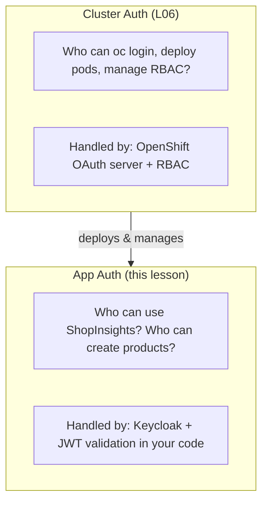
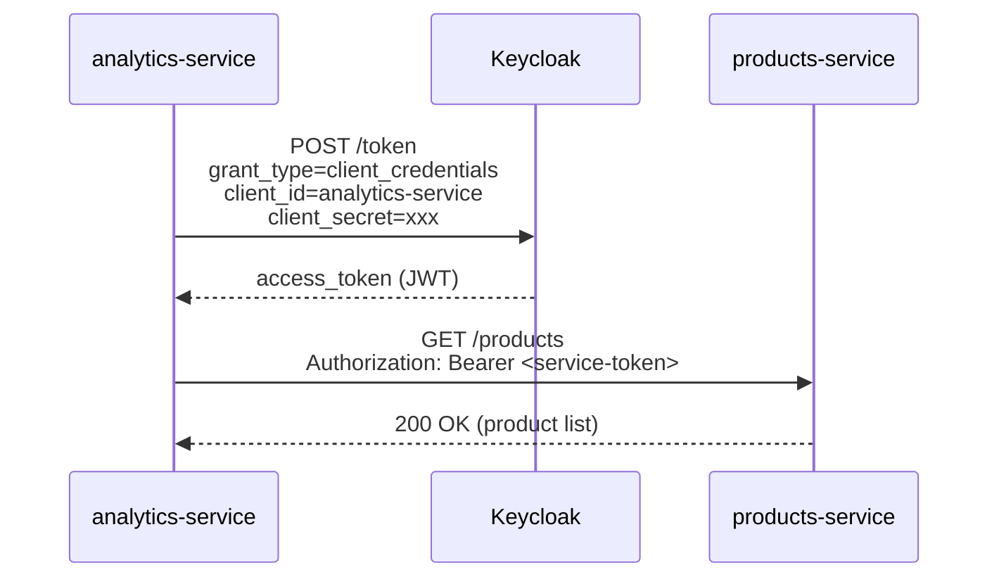

# LP-L11 — Application Authentication: Securing ShopInsights with Keycloak

**Level:** Personalized
**Duration:** 75 min

## Overview

In [L06](../L06_auth_and_identity/) you secured who can use the **cluster** — `oc login`, deploy pods, manage RBAC. Now you secure who can use the **application** — the ShopInsights dashboard and APIs.

This lesson covers three authentication patterns:

1. **User to API** — JWT-protected backend endpoints (bearer tokens via password grant)
2. **User to App** — OIDC login for the React dashboard (authorization code flow)
3. **Service to Service** — analytics-service authenticates to products/orders-service using client credentials (no human user involved)

You deploy Keycloak on OpenShift, create a realm with users and roles, add JWT validation to the backend services, and wire OIDC login into the React dashboard.

> **Why three patterns?** Real applications need all three. A dashboard user logs in via OIDC (pattern 1+2). A batch job or AI agent authenticates as a service, not a user (pattern 3). An API consumer sends a bearer token obtained from a CLI or script (pattern 1). Keycloak handles all of them through the same realm.

## Prerequisites

- Completed: [L06 — Cluster Authentication](../L06_auth_and_identity/) (cluster auth concepts)
- Completed: [L03 — Deploy Microservices](../L03_deploy_microservices/) (ShopInsights services running)
- ShopInsights services deployed in your project
- OpenShift cluster running with admin access (Red Hat Demo Platform or CRC)
- `curl` and `jq` installed (for testing token flows)

## K8s Context

In vanilla Kubernetes, adding application-level authentication means:

1. Deploy Keycloak (or any OIDC provider) as a Deployment + Service
2. Create an Ingress with TLS (you need a cert and an ingress controller)
3. Configure your application to validate JWTs against the OIDC provider's JWKS endpoint
4. Manage TLS certificates yourself (cert-manager, Let's Encrypt, or manual)

In OpenShift, the approach is the same, but:

- **Routes give you TLS for free** — edge termination with auto-generated certs, no cert-manager needed
- **The internal Service DNS** (`keycloak.your-project.svc.cluster.local`) lets pods reach Keycloak without going through the Route
- **Security Context Constraints** ensure Keycloak runs as non-root by default

The JWT validation logic in your application code is identical regardless of whether you run on K8s or OpenShift.

## Concepts

### Cluster Auth vs App Auth

These are two separate layers:



Cluster auth protects the **platform**. App auth protects your **application**. You need both.

### OAuth2 / OIDC Grant Types

Keycloak supports multiple ways for clients to obtain tokens. This lesson uses three:

| Grant Type | Who Authenticates | Use Case | Example |
|------------|------------------|----------|---------|
| **Authorization Code (PKCE)** | Human user via browser redirect | Dashboard login | User clicks "Login", browser redirects to Keycloak, user enters credentials, browser gets a token |
| **Password (direct grant)** | Human user via CLI/curl | Testing, scripts | `curl -d "grant_type=password&username=alice&password=alice123" ...` |
| **Client Credentials** | Service (no user involved) | Service-to-service calls | analytics-service sends its client_id + client_secret to get a token |

### Keycloak Core Concepts

| Concept | What It Is |
|---------|-----------|
| **Realm** | An isolated namespace for users, clients, and roles. Like a tenant. |
| **Client** | An application that can request tokens. Each client has an ID and a type. |
| **Public client** | For SPAs and mobile apps — no client secret (the code runs in the browser, so secrets can't be kept). Uses PKCE for security. |
| **Confidential client** | For backend services — has a client secret. Used for client credentials grant. |
| **Bearer-only client** | Validates incoming tokens but never initiates a login. Used by APIs that only accept JWTs. |
| **Realm role** | A permission that can be assigned to users or service accounts. |

### JWT Validation Flow

When a backend service receives a request with `Authorization: Bearer <token>`:

1. Extract the token from the header
2. Fetch the JWKS (JSON Web Key Set) from Keycloak's well-known endpoint — this contains the public keys
3. Verify the token's signature using the matching public key (RS256)
4. Check expiration (`exp`), issuer (`iss`), and audience (`aud`)
5. Extract user info and roles from the token payload

The JWKS is fetched once and cached. No call to Keycloak on every request — validation is purely cryptographic.

### Why Service-to-Service Auth Matters

In a microservices architecture, not every caller is a human user:

- **analytics-service** calls products-service and orders-service to aggregate data
- **A batch job** might call an API to export data
- **An AI agent** might call an MCP server to execute tools

These callers need an identity and permissions, but there is no user to log in. The **client credentials grant** solves this: the service authenticates as itself using a client ID and secret, and receives a token with its own roles — independent of any user.

This is the same pattern used when an AI agent authenticates to an MCP server: the agent presents its credentials, gets a scoped token, and the server validates it.

## Step-by-Step

### Part 1: Deploy Keycloak

#### Step 1: Deploy Keycloak on OpenShift

Deploy Keycloak with a pre-configured realm:

```bash
oc apply -f manifests/keycloak-realm-configmap.yaml
oc apply -f manifests/keycloak-deployment.yaml
```

Or use the setup script which also configures the auth ConfigMaps with the correct Route URL:

```bash
bash scripts/setup-keycloak.sh
```

If running manually, wait for Keycloak to become ready (this takes 30-60 seconds):

```bash
oc wait --for=condition=ready pod -l component=keycloak --timeout=180s
```

Get the Keycloak Route URL:

```bash
KEYCLOAK_URL="https://$(oc get route keycloak -o jsonpath='{.spec.host}')"
echo "Keycloak admin console: $KEYCLOAK_URL"
```

The Deployment uses Keycloak's `start-dev` mode with an embedded H2 database. This is fine for learning and development. In production, you would use `start` mode with an external PostgreSQL database and the Red Hat Build of Keycloak Operator for lifecycle management.

#### Step 2: Explore the Keycloak Admin Console

Open the Keycloak admin console in your browser:

```bash
echo "Open: $KEYCLOAK_URL"
echo "Username: admin"
echo "Password: admin"
```

After logging in:

1. Click **shopinsights** in the realm dropdown (top-left) — the realm was auto-imported at startup
2. Navigate to **Users** — you should see alice, bob, and admin
3. Navigate to **Clients** — you should see three clients:
   - `shopinsights-dashboard` (Public) — for the React SPA
   - `shopinsights-api` (Bearer-only) — for backend token validation
   - `analytics-service` (Confidential) — for service-to-service auth
4. Navigate to **Realm roles** — you should see `viewer` and `editor`

#### Step 3: Understand the Realm Configuration

The realm is defined in `manifests/keycloak-realm-configmap.yaml`. Here is the structure:

**Three client types serve three authentication patterns:**

| Client | Type | Purpose |
|--------|------|---------|
| `shopinsights-dashboard` | Public | Browser-based login (authorization code + PKCE). No secret — the code runs in the user's browser. |
| `shopinsights-api` | Bearer-only | Never initiates login. Only validates incoming JWTs from the dashboard or curl. |
| `analytics-service` | Confidential | Service-to-service auth. Has a secret (`analytics-service-secret`). Uses client credentials grant. |

**Two roles control what authenticated callers can do:**

| Role | Assigned To | Meaning |
|------|-------------|---------|
| `editor` | alice, admin | Can create products and orders (POST endpoints) |
| `viewer` | bob, admin | Can view data (GET endpoints) |

**Three test users:**

| User | Password | Roles |
|------|----------|-------|
| alice | alice123 | editor |
| bob | bob123 | viewer |
| admin | admin123 | editor, viewer |

---

### Part 2: User to API Authentication

#### Step 4: Test Token Issuance

Use the **password grant** (direct access) to get a token for alice. This grant type is useful for testing and scripts — in production, users authenticate via the browser redirect flow.

```bash
KEYCLOAK_URL="https://$(oc get route keycloak -o jsonpath='{.spec.host}')"

TOKEN_RESPONSE=$(curl -sk -X POST \
  "$KEYCLOAK_URL/realms/shopinsights/protocol/openid-connect/token" \
  -d "grant_type=password" \
  -d "client_id=shopinsights-dashboard" \
  -d "username=alice" \
  -d "password=alice123")

ACCESS_TOKEN=$(echo "$TOKEN_RESPONSE" | jq -r .access_token)
echo "Token (first 50 chars): ${ACCESS_TOKEN:0:50}..."
```

Decode the JWT payload to see what is inside:

```bash
echo "$ACCESS_TOKEN" | cut -d. -f2 | base64 -d 2>/dev/null | jq .
```

You should see a JSON payload like:

```json
{
  "exp": 1234567890,
  "iss": "https://keycloak-your-project.apps.example.com/realms/shopinsights",
  "sub": "alice-uuid-here",
  "aud": "account",
  "realm_access": {
    "roles": ["editor", "default-roles-shopinsights"]
  },
  "preferred_username": "alice",
  "email_verified": true
}
```

Key fields:
- **`iss`** (issuer) — the Keycloak realm URL. The backend verifies this matches.
- **`exp`** (expiration) — token expires after 5 minutes by default.
- **`realm_access.roles`** — alice has the `editor` role.
- **`preferred_username`** — the human-readable username.
- **`aud`** (audience) — who the token is intended for.

#### Step 5: Examine the auth.py Module

The backend services use a shared `auth.py` module that handles JWT validation. It is gated on the `KEYCLOAK_URL` environment variable:

- **When `KEYCLOAK_URL` is not set** (all lessons except L11): `get_current_user()` returns `None` — no authentication, all requests pass through. This is why L01-L10 work unchanged.
- **When `KEYCLOAK_URL` is set** (this lesson): `get_current_user()` validates the JWT from the `Authorization: Bearer <token>` header and returns the decoded payload, or raises 401.

The `auth.py` module:

1. Fetches the JWKS (public keys) from Keycloak's well-known endpoint — cached after first call
2. Extracts the `kid` (key ID) from the token header to find the matching public key
3. Verifies the signature using RS256 (asymmetric — no shared secret needed)
4. Checks `exp`, `iss`, and `aud` claims

In `app.py`, the protected endpoint uses FastAPI's dependency injection:

```python
from auth import get_current_user

@app.post("/products")
def create_product(product: Product, user: dict | None = Depends(get_current_user)):
    # user is None when auth is disabled, or a dict with the JWT payload when enabled
    ...
```

GET endpoints do not use `Depends(get_current_user)` — reads are public.

#### Step 6: Deploy Backend Services with Auth Enabled

First, update the auth ConfigMap with the actual Keycloak Route URL:

```bash
KEYCLOAK_URL="https://$(oc get route keycloak -o jsonpath='{.spec.host}')"

sed "s|__KEYCLOAK_URL__|${KEYCLOAK_URL}|g" \
  manifests/keycloak-auth-configmap.yaml | oc apply -f -
```

Then add the auth config to the products-service and orders-service Deployments:

```bash
oc set env deployment/products-service --from=configmap/keycloak-auth-config
oc set env deployment/orders-service --from=configmap/keycloak-auth-config
```

The pods will restart automatically. Wait for them to be ready:

```bash
oc rollout status deployment/products-service
oc rollout status deployment/orders-service
```

#### Step 7: Test Protected Endpoints

Get the products-service Route URL:

```bash
PRODUCTS_URL="https://$(oc get route dashboard -o jsonpath='{.spec.host}')/api/products"
```

**Test 1: GET without token — should succeed (reads are public):**

```bash
curl -sk "$PRODUCTS_URL" | jq '.[0]'
```

Expected: returns the first product.

**Test 2: POST without token — should fail with 401:**

```bash
curl -sk -X POST "$PRODUCTS_URL" \
  -H "Content-Type: application/json" \
  -d '{"name":"Test","category":"Test","price":9.99,"stock":10}'
```

Expected:

```json
{"detail": "Missing authorization token"}
```

**Test 3: POST with alice's token — should succeed:**

```bash
# Get a fresh token for alice
ACCESS_TOKEN=$(curl -sk -X POST \
  "$KEYCLOAK_URL/realms/shopinsights/protocol/openid-connect/token" \
  -d "grant_type=password&client_id=shopinsights-dashboard&username=alice&password=alice123" \
  | jq -r .access_token)

curl -sk -X POST "$PRODUCTS_URL" \
  -H "Content-Type: application/json" \
  -H "Authorization: Bearer $ACCESS_TOKEN" \
  -d '{"name":"Auth Test Product","category":"Test","price":9.99,"stock":10}'
```

Expected: returns the created product with an `id`.

---

### Part 3: User to App Authentication (OIDC)

#### Step 8: Add Login to the Dashboard UI

The dashboard-ui uses the `keycloak-js` library for browser-based OIDC login. It checks for a `/keycloak-config.json` file at startup:

- **If the config file exists** (mounted via ConfigMap in this lesson): Keycloak is initialized, and users are redirected to the Keycloak login page before they can access the dashboard.
- **If the config file is missing** (all other lessons): the dashboard works without authentication — no change in behavior.

Deploy the Keycloak config for the dashboard:

```bash
KEYCLOAK_URL="https://$(oc get route keycloak -o jsonpath='{.spec.host}')"

sed "s|__KEYCLOAK_URL__|${KEYCLOAK_URL}|g" \
  manifests/dashboard-keycloak-configmap.yaml | oc apply -f -
```

Mount the config file into the dashboard pod:

```bash
oc set volume deployment/dashboard-ui \
  --add --name=keycloak-config \
  --type=configmap \
  --configmap-name=dashboard-keycloak-config \
  --mount-path=/usr/share/nginx/html/keycloak-config.json \
  --sub-path=keycloak-config.json
```

Wait for the dashboard pod to restart:

```bash
oc rollout status deployment/dashboard-ui
```

#### Step 9: Test Dashboard Login

Open the dashboard in your browser:

```bash
DASHBOARD_URL="https://$(oc get route dashboard -o jsonpath='{.spec.host}')"
echo "Open: $DASHBOARD_URL"
```

You should be redirected to the Keycloak login page. Log in as alice (alice123).

After login:
1. You should see the ShopInsights dashboard with alice's username in the top-right header
2. Try creating a product — it should succeed (alice has the `editor` role, and the dashboard sends her token with the request)
3. Click the logout button — you are redirected back to the Keycloak login page

Now log in as bob (bob123):
1. You should see the dashboard with bob's username
2. Try creating a product — it should fail with a 401 (bob has `viewer` role only, but the backend currently checks for any valid token, not specific roles)

Note: In this lesson, the backend checks that a valid token exists but does not check roles on the token. Role-based authorization (checking `realm_access.roles` in the token payload) is an extension you can add by inspecting the `user` dict returned by `get_current_user()`.

---

### Part 4: Service-to-Service Authentication

#### Step 10: Understand the Client Credentials Grant

So far, a human user (alice or bob) logged in and got a token. But what about the analytics-service? It calls products-service and orders-service to aggregate data — there is no human user involved.

The **client credentials grant** solves this:



The service authenticates as **itself**, not as a user. The token payload contains the service's client ID and roles, not a username:

```json
{
  "iss": "https://keycloak.../realms/shopinsights",
  "clientId": "analytics-service",
  "realm_access": { "roles": ["..."] },
  "preferred_username": "service-account-analytics-service"
}
```

**Real-world examples of this pattern:**

- A microservice calling another team's API
- A batch job exporting data from a protected API
- An AI agent authenticating to an MCP server to execute tools
- A CI/CD pipeline pushing to a protected container registry

#### Step 11: Configure analytics-service with Client Credentials

Test the client credentials flow manually first:

```bash
KEYCLOAK_URL="https://$(oc get route keycloak -o jsonpath='{.spec.host}')"

SERVICE_TOKEN=$(curl -sk -X POST \
  "$KEYCLOAK_URL/realms/shopinsights/protocol/openid-connect/token" \
  -d "grant_type=client_credentials" \
  -d "client_id=analytics-service" \
  -d "client_secret=analytics-service-secret" \
  | jq -r .access_token)

echo "Service token (first 50 chars): ${SERVICE_TOKEN:0:50}..."

# Decode to see the service identity
echo "$SERVICE_TOKEN" | cut -d. -f2 | base64 -d 2>/dev/null | jq .preferred_username
```

Expected: `"service-account-analytics-service"`

Now configure the analytics-service to use client credentials automatically. Set the env vars:

```bash
oc set env deployment/analytics-service \
  KEYCLOAK_URL="$KEYCLOAK_URL" \
  KEYCLOAK_REALM="shopinsights" \
  KEYCLOAK_CLIENT_ID="analytics-service" \
  KEYCLOAK_CLIENT_SECRET="analytics-service-secret"
```

Wait for the pod to restart:

```bash
oc rollout status deployment/analytics-service
```

#### Step 12: Test Service-to-Service Auth

Verify the analytics dashboard still works — the analytics-service now obtains its own token and sends it when calling products-service and orders-service:

```bash
DASHBOARD_URL="https://$(oc get route dashboard -o jsonpath='{.spec.host}')"

# Analytics summary endpoint (calls products + orders behind the scenes)
curl -sk "$DASHBOARD_URL/api/analytics/summary" | jq .
```

Expected: returns a summary with `total_products`, `total_orders`, `total_revenue` — the analytics-service successfully fetched data from the other services using its own token.

Check the Keycloak admin console to see the service account session:

1. Open the Keycloak admin console
2. Navigate to **Sessions** in the shopinsights realm
3. You should see a session for `service-account-analytics-service` — this is the analytics-service's service account

To verify the token is actually being sent, check the analytics-service logs:

```bash
oc logs deployment/analytics-service --tail=20
```

---

### Part 5: Verification

#### Step 13: End-to-End Verification

Run the test script to verify all three auth patterns:

```bash
bash scripts/test-auth.sh
```

Or verify manually:

```bash
KEYCLOAK_URL="https://$(oc get route keycloak -o jsonpath='{.spec.host}')"
DASHBOARD_URL="https://$(oc get route dashboard -o jsonpath='{.spec.host}')"

echo "=== Pattern 1: User -> API (password grant) ==="
echo ""

echo -n "GET /products (no token): "
STATUS=$(curl -sk -o /dev/null -w '%{http_code}' "$DASHBOARD_URL/api/products")
echo "$STATUS (expected: 200)"

echo -n "POST /products (no token): "
STATUS=$(curl -sk -o /dev/null -w '%{http_code}' -X POST "$DASHBOARD_URL/api/products" \
  -H "Content-Type: application/json" \
  -d '{"name":"test","category":"test","price":1,"stock":1}')
echo "$STATUS (expected: 401)"

ALICE_TOKEN=$(curl -sk -X POST \
  "$KEYCLOAK_URL/realms/shopinsights/protocol/openid-connect/token" \
  -d "grant_type=password&client_id=shopinsights-dashboard&username=alice&password=alice123" \
  | jq -r .access_token)

echo -n "POST /products (alice's token): "
STATUS=$(curl -sk -o /dev/null -w '%{http_code}' -X POST "$DASHBOARD_URL/api/products" \
  -H "Content-Type: application/json" \
  -H "Authorization: Bearer $ALICE_TOKEN" \
  -d '{"name":"Auth Verified","category":"Test","price":1,"stock":1}')
echo "$STATUS (expected: 200 or 201)"

echo ""
echo "=== Pattern 2: User -> App (browser OIDC) ==="
echo "Open $DASHBOARD_URL in your browser and log in as alice/alice123"

echo ""
echo "=== Pattern 3: Service -> Service (client credentials) ==="
echo ""

SERVICE_TOKEN=$(curl -sk -X POST \
  "$KEYCLOAK_URL/realms/shopinsights/protocol/openid-connect/token" \
  -d "grant_type=client_credentials&client_id=analytics-service&client_secret=analytics-service-secret" \
  | jq -r .access_token)

echo -n "Service token identity: "
echo "$SERVICE_TOKEN" | cut -d. -f2 | base64 -d 2>/dev/null | jq -r .preferred_username

echo -n "Analytics summary (service calls backends): "
STATUS=$(curl -sk -o /dev/null -w '%{http_code}' "$DASHBOARD_URL/api/analytics/summary")
echo "$STATUS (expected: 200)"
```

## K8s vs OpenShift Comparison

| Aspect | Kubernetes | OpenShift |
|--------|-----------|-----------|
| Deploying Keycloak | Deployment + Service + Ingress + TLS cert setup | Deployment + Service + Route (TLS edge auto) |
| TLS for Keycloak | Manual cert-manager or Let's Encrypt | Route with `tls.termination: edge` — one line |
| Keycloak lifecycle | Manual helm/operator install | Same (Keycloak Operator available in OperatorHub) |
| JWT validation in apps | Identical | Identical |
| Service-to-service auth | Identical (client credentials grant) | Identical |
| Internal service DNS | `service.namespace.svc.cluster.local` | Same |
| Running as non-root | Depends on PSA config | Enforced by default (SCC) — Keycloak image already compatible |

The main OpenShift advantage: Routes give you production-grade TLS ingress for Keycloak with zero certificate management. The JWT validation code is identical across platforms.

## Key Takeaways

- **Cluster auth and app auth are separate layers** — L06 (OAuth, RBAC) controls the platform; this lesson (Keycloak, JWT) controls your application. You need both.
- **Keycloak provides a single identity layer** for all three authentication patterns: browser OIDC, API bearer tokens, and service-to-service client credentials.
- **JWT validation is cryptographic, not network** — the backend fetches Keycloak's public keys once (JWKS), then validates tokens locally. No call to Keycloak on every request.
- **The `KEYCLOAK_URL` env var toggle** makes auth opt-in: services work without auth when the variable is not set. This keeps other lessons (L01-L10) unchanged.
- **Client credentials grant** gives services their own identity — the same pattern used when an AI agent authenticates to an MCP server or a microservice calls another team's API.
- **OpenShift Routes** give Keycloak production-grade TLS with zero certificate management — the main platform advantage over vanilla K8s for this use case.

## Cleanup

Remove the resources created in this lesson:

```bash
# Remove Keycloak env vars from services
oc set env deployment/products-service KEYCLOAK_URL- KEYCLOAK_REALM-
oc set env deployment/orders-service KEYCLOAK_URL- KEYCLOAK_REALM-
oc set env deployment/analytics-service KEYCLOAK_URL- KEYCLOAK_REALM- KEYCLOAK_CLIENT_ID- KEYCLOAK_CLIENT_SECRET-

# Remove the Keycloak config volume from the dashboard
oc set volume deployment/dashboard-ui --remove --name=keycloak-config

# Delete Keycloak
oc delete deployment keycloak
oc delete service keycloak
oc delete route keycloak

# Delete ConfigMaps
oc delete configmap keycloak-realm keycloak-auth-config dashboard-keycloak-config
```

After cleanup, the services restart without Keycloak env vars and return to their default no-auth mode.

## Next Steps

You now have a complete authentication stack:

- **L06**: Cluster auth — who can use the platform
- **L11**: App auth — who can use the application (user login, API tokens, service-to-service)

Together with the service mesh mTLS from [L05](../L05_service_mesh/), your ShopInsights deployment has defense in depth: encrypted transport (mesh), platform access control (RBAC), and application-level identity (Keycloak).
