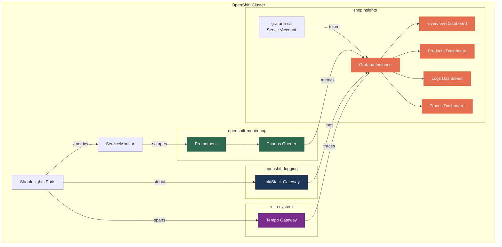

# L12 — Custom Monitoring Dashboards with Grafana

**Level:** Platform
**Duration:** ~45 min

## Overview

L07 set up the observability stack — Prometheus for metrics, Loki for logs, and Tempo for traces — all viewed through the OpenShift Console. That works well for cluster operators, but application teams often need custom dashboards that combine metrics, logs, traces, and alerts in a single pane. This lesson deploys a community Grafana instance on top of the existing observability stack, with four purpose-built dashboards for ShopInsights.

## Prerequisites

- **L01–L07 complete** — user workload monitoring enabled, ServiceMonitor and PrometheusRule deployed, Loki Operator with LokiStack running in `openshift-logging`
- **L05 complete** — Service Mesh with Tempo tracing in `istio-system` (optional — the traces dashboard is skipped if Tempo is not available)
- ShopInsights application deployed in the `shopinsights` project
- `oc` CLI authenticated with cluster-admin privileges

## K8s Context

On vanilla Kubernetes you install Grafana via Helm chart, create datasource ConfigMaps, and provision dashboards as JSON files mounted into the container. Authentication to Prometheus typically uses a kubeconfig or service account token you wire up manually.

On OpenShift, the community **Grafana Operator** manages all of this through Custom Resources — `Grafana`, `GrafanaDatasource`, and `GrafanaDashboard`. The operator handles the deployment, route creation, datasource injection, and dashboard lifecycle. You declare what you want; the operator reconciles it.

## Concepts

### Grafana Operator (Community)

OpenShift ships with a built-in Grafana in the `openshift-monitoring` namespace, but it is read-only and reserved for cluster metrics. You cannot add custom datasources or dashboards to it. To get a fully customizable Grafana, install the **community Grafana Operator** (`grafana-operator` from `community-operators`, channel `v5`, maintained by the Integreatly project).

> **Important:** This is a community operator, not a Red Hat-supported one. For production use, evaluate whether the community support model meets your requirements.

### GrafanaDatasource CR

Instead of editing `datasources.yaml` inside the Grafana container, you create a `GrafanaDatasource` custom resource. The operator watches for these CRs and configures Grafana automatically. Each datasource uses an `instanceSelector` to target which Grafana instance it belongs to.

Authentication to OpenShift's monitoring backends (Thanos Querier, Loki, Tempo) requires a **ServiceAccount token** with the right ClusterRole bindings. The token is injected into the datasource's `secureJsonData` as a Bearer token in the `Authorization` header.

### GrafanaDashboard CR

Dashboards are defined as `GrafanaDashboard` custom resources with the full Grafana JSON embedded in `spec.json`. This is dashboards-as-code — version-controlled, declarative, and reconciled by the operator. Like datasources, each dashboard uses `instanceSelector` to target a specific Grafana instance.

### Three Datasources

| Datasource | Backend | ClusterRole Required | URL (cluster-internal) |
|---|---|---|---|
| **Prometheus** | Thanos Querier | `cluster-monitoring-view` | `https://thanos-querier.openshift-monitoring.svc.cluster.local:9091` |
| **Loki** | LokiStack Gateway | Custom `grafana-loki-logs-reader` | `https://logging-loki-gateway-http.openshift-logging.svc.cluster.local:8080/api/logs/v1/application` |
| **Tempo** | Tempo Gateway | `tempomonolithic-traces-read` | `https://tempo-sample-gateway.istio-system.svc.cluster.local:8080/api/traces/v1/dev` |

All three use TLS with `tlsSkipVerify: true` (internal cluster traffic) and Bearer token authentication via the same ServiceAccount.

## Architecture



## Step-by-Step

### Step 1: Install the Grafana Operator

Apply the OLM Subscription to install the Grafana Operator from the community catalog:

```bash
oc apply -f manifests/operator-grafana.yaml
```

```yaml
# manifests/operator-grafana.yaml
apiVersion: operators.coreos.com/v1alpha1
kind: Subscription
metadata:
  name: grafana-operator
  namespace: openshift-operators
spec:
  channel: v5
  name: grafana-operator
  source: community-operators
  sourceNamespace: openshift-marketplace
  installPlanApproval: Automatic
```

Wait for the operator to install:

```bash
# Watch the CSV until it shows Succeeded
oc get csv -n openshift-operators -l operators.coreos.com/grafana-operator.openshift-operators -w
```

The operator installs cluster-wide in `openshift-operators`, so it can manage Grafana instances in any namespace.

### Step 2: Deploy the Grafana Instance

Create a Grafana instance in the `shopinsights` project:

```bash
oc project shopinsights
oc apply -f manifests/grafana-instance.yaml
```

```yaml
# manifests/grafana-instance.yaml (key fields)
apiVersion: grafana.integreatly.org/v1beta1
kind: Grafana
metadata:
  name: grafana
  namespace: shopinsights
  labels:
    app: grafana
    dashboards: grafana          # Datasources and dashboards match on this label
spec:
  route:
    spec:
      tls:
        termination: edge        # Operator auto-creates an OpenShift Route
  config:
    auth.anonymous:
      enabled: "true"            # Allow anonymous viewing (read-only)
    security:
      admin_user: admin
      admin_password: openshift
```

Key points:
- The `dashboards: grafana` label is the **instance selector** — datasources and dashboards reference this label to bind to this Grafana instance.
- The operator auto-creates a Route with edge TLS termination. No separate Route manifest needed.
- Anonymous access is enabled for convenience so viewers don't need credentials. The admin account (`admin` / `openshift`) is for editing dashboards.

Wait for the pod to start:

```bash
oc wait --for=condition=Ready pod -l app=grafana -n shopinsights --timeout=120s
```

Get the Grafana URL:

```bash
echo "https://$(oc get route grafana-route -n shopinsights -o jsonpath='{.spec.host}')"
```

### Step 3: Configure RBAC

The Grafana Operator auto-creates a ServiceAccount named `grafana-sa` in the `shopinsights` namespace. This SA needs ClusterRole bindings to read metrics, logs, and traces from the platform backends.

**Bind Prometheus access:**

```bash
oc adm policy add-cluster-role-to-user cluster-monitoring-view \
  -z grafana-sa -n shopinsights
```

**Create and bind Loki access:**

The `loki-logs-reader` role doesn't exist by default — create it:

```bash
oc create clusterrole grafana-loki-logs-reader \
  --verb=get \
  --resource=application \
  --resource-name=logs \
  --non-resource-url="/api/logs/v1/application/*"

# The Loki Operator uses a custom API group
oc patch clusterrole grafana-loki-logs-reader --type=json \
  -p='[{"op":"replace","path":"/rules/0/apiGroups","value":["loki.grafana.com"]}]'

oc adm policy add-cluster-role-to-user grafana-loki-logs-reader \
  -z grafana-sa -n shopinsights
```

**Bind Tempo access** (if Tempo is deployed):

```bash
oc adm policy add-cluster-role-to-user tempomonolithic-traces-read \
  -z grafana-sa -n shopinsights
```

**Create a long-lived token:**

```bash
GRAFANA_TOKEN=$(oc create token grafana-sa -n shopinsights --duration=8760h)
echo "Token created (valid for 1 year)"
```

> **Note:** The `setup.sh` script handles all RBAC configuration and token creation automatically.

### Step 4: Create Datasources

Each datasource is a `GrafanaDatasource` CR. The token from Step 3 is injected as a Bearer token in the `httpHeaderValue1` secure field.

```bash
# The setup script injects the token automatically.
# To apply manually, replace ${GRAFANA_TOKEN} with the actual token value.
oc apply -f manifests/grafana-datasource-prometheus.yaml
oc apply -f manifests/grafana-datasource-loki.yaml
oc apply -f manifests/grafana-datasource-tempo.yaml   # Only if Tempo is available
```

```yaml
# manifests/grafana-datasource-prometheus.yaml (key fields)
apiVersion: grafana.integreatly.org/v1beta1
kind: GrafanaDatasource
metadata:
  name: prometheus
  namespace: shopinsights
spec:
  instanceSelector:
    matchLabels:
      dashboards: grafana       # Must match the Grafana instance label
  datasource:
    name: Prometheus
    type: prometheus
    url: https://thanos-querier.openshift-monitoring.svc.cluster.local:9091
    isDefault: true
    jsonData:
      httpHeaderName1: Authorization
      tlsSkipVerify: true
    secureJsonData:
      httpHeaderValue1: "Bearer ${GRAFANA_TOKEN}"
```

The Loki and Tempo datasources follow the same pattern — different `type`, `url`, and `isDefault: false`. The Tempo datasource also enables the node graph visualization (`nodeGraph.enabled: true`).

### Step 5: Deploy Dashboards

Apply the four `GrafanaDashboard` CRs:

```bash
oc apply -f manifests/grafana-dashboard-overview.yaml
oc apply -f manifests/grafana-dashboard-products.yaml
oc apply -f manifests/grafana-dashboard-logs.yaml
oc apply -f manifests/grafana-dashboard-traces.yaml   # Only if Tempo is available
```

Each dashboard CR embeds the full Grafana dashboard JSON in `spec.json` and uses the same `instanceSelector`:

```yaml
apiVersion: grafana.integreatly.org/v1beta1
kind: GrafanaDashboard
metadata:
  name: shopinsights-overview
  namespace: shopinsights
spec:
  instanceSelector:
    matchLabels:
      dashboards: grafana
  json: |
    { "uid": "shopinsights-overview", "title": "ShopInsights - Overview", ... }
```

**The four dashboards:**

| Dashboard | Datasources | Panels | Purpose |
|---|---|---|---|
| **Overview** | Prometheus | 7 | CPU, memory, network, restarts, request rate, P95 latency, alerts |
| **Products Service** | Prometheus + Loki | 9 | Per-endpoint metrics, DuckDB query duration, error rate, status codes, logs, alerts |
| **Logs** | Loki | 5 | Log volume by service, per-service log streams for all 4 ShopInsights services |
| **Traces** | Tempo | 2 | Trace search (TraceQL), service dependency graph |

> Only `products-service` has custom Prometheus metrics (`http_requests_total`, `http_request_duration_seconds`, `duckdb_query_duration_seconds`, `active_connections`). The other services appear in dashboards via standard container metrics and log streams.

### Step 6: Generate Traffic and Explore

Generate traffic so the dashboards have data to display:

```bash
bash scripts/demo.sh
```

This sends ~110 requests across all four services via `oc exec` from the `dashboard-ui` pod.

Open Grafana in your browser:

```bash
echo "https://$(oc get route grafana-route -n shopinsights -o jsonpath='{.spec.host}')"
```

Login: `admin` / `openshift` (or browse anonymously as a Viewer).

**Overview Dashboard** — Start here. See CPU and memory usage per container, container restarts, network I/O, and the custom products-service request rate and P95 latency. The alert panel shows any firing PrometheusRules from L07.

**Products Service Dashboard** — Deep dive into the instrumented service. Request rate by endpoint (`/products`, `/products/{id}`), error rate percentage, latency percentiles (P50/P95/P99), DuckDB query duration, and a live log stream from Loki. The pie chart shows request distribution by HTTP status code.

**Logs Dashboard** — Log volume bar chart across all four services, followed by individual log panels for products-service, orders-service, analytics-service, and dashboard-ui. Filter by time range to investigate incidents.

**Traces Dashboard** — Search traces by service name, duration, or status using TraceQL. The service graph panel visualizes the dependency map between services and Istio waypoint proxies.

## Using the Setup Script

The `setup.sh` script automates Steps 1–5 in a single command:

```bash
bash scripts/setup.sh
```

It includes prerequisite checks, automatic install plan approval, graceful handling of operator installation timing, and conditional Tempo support (skips traces resources if Tempo is not deployed).

## Verification

Confirm the full stack is running:

```bash
# Grafana Operator installed
oc get csv -n openshift-operators | grep grafana

# Grafana pod running
oc get pods -n shopinsights -l app=grafana

# Datasources created
oc get grafanadatasources -n shopinsights

# Dashboards created
oc get grafanadashboards -n shopinsights

# Route accessible
curl -sk -o /dev/null -w "%{http_code}" \
  "https://$(oc get route grafana-route -n shopinsights -o jsonpath='{.spec.host}')/login"
# Expected: 200
```

Verify dashboards are loaded in Grafana:

```bash
GRAFANA_URL="https://$(oc get route grafana-route -n shopinsights -o jsonpath='{.spec.host}')"
echo "$GRAFANA_URL/d/shopinsights-overview"
echo "$GRAFANA_URL/d/shopinsights-products"
echo "$GRAFANA_URL/d/shopinsights-logs"
echo "$GRAFANA_URL/d/shopinsights-traces"
```

## K8s vs OpenShift Comparison

| Aspect | Kubernetes | OpenShift |
|--------|-----------|-----------|
| **Grafana install** | `helm install grafana grafana/grafana` | Grafana Operator via OLM Subscription |
| **Datasource config** | `datasources.yaml` ConfigMap mounted into pod | `GrafanaDatasource` CR, operator reconciles |
| **Dashboard provisioning** | JSON files in ConfigMap or sidecar provisioner | `GrafanaDashboard` CR, operator reconciles |
| **Auth to Prometheus** | kubeconfig or manual SA token setup | ClusterRole binding to `cluster-monitoring-view` + `oc create token` |
| **Auth to Loki** | Direct HTTP (no auth gateway by default) | Custom ClusterRole for `loki.grafana.com` API group + Bearer token |
| **TLS termination** | Ingress with cert-manager or manual certs | Route with `termination: edge` (built-in) |
| **Lifecycle management** | Helm upgrade, manual version tracking | Operator handles upgrades via OLM |

## Key Takeaways

- **OpenShift's built-in Grafana is read-only.** For custom dashboards, deploy the community Grafana Operator — it manages Grafana instances, datasources, and dashboards through CRDs.
- **Authentication uses ServiceAccount tokens.** A single SA (`grafana-sa`) with three ClusterRole bindings provides unified access to Prometheus (via Thanos Querier), Loki, and Tempo.
- **Dashboards-as-code works through CRDs.** `GrafanaDashboard` CRs embed the full JSON definition, making dashboards version-controlled and declarative — no manual UI configuration required.
- **The `instanceSelector` pattern decouples resources.** Datasources and dashboards declare which Grafana instance they belong to via label matching, allowing multiple Grafana instances in the same cluster.
- **Tempo integration is optional but valuable.** The setup gracefully degrades — if Tempo is not deployed, the traces datasource and dashboard are simply skipped.

## Cleanup

Remove all L12 resources (dashboards, datasources, Grafana instance, RBAC, operator):

```bash
bash scripts/cleanup.sh
```

This removes only the L12 Grafana resources. The underlying observability stack (Prometheus, Loki, Tempo, ServiceMonitor, PrometheusRule) from L07 and L05 is left intact.

## Next Steps

This is the final lesson in the **Platform track**. You now have a complete OpenShift environment with builds, deployments, routes, service mesh, CI/CD, GitOps, monitoring, logging, tracing, and custom dashboards.

To continue learning, explore the **AI tracks** in `tutorial_ai/`:

- **[Red Hat AI Ecosystem](../../tutorial_ai/01_redhat_ai/syllabus.md)** — Podman AI Lab, RHEL AI, Granite models, model optimization, and cross-tier workflows (17 lessons).
- **[OpenShift AI](../../tutorial_ai/02_openshift_ai/syllabus.md)** — Model serving with KServe and vLLM, fine-tuning, RAG pipelines, AI agents, evaluation, and governance on the OpenShift AI platform (66 lessons).
