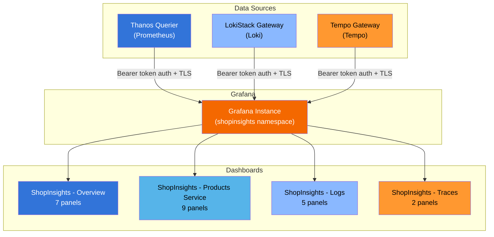

# L12 — Testing & Validation Guide

Test all 4 Grafana dashboards end-to-end with real data from the ShopInsights application. Each step verifies that Prometheus metrics, Loki logs, and Tempo traces flow correctly from their respective backends through Grafana datasources into dashboard panels.

**Prerequisites:**
- L12 `setup.sh` completed successfully (Grafana Operator + instance + datasources + dashboards deployed)
- L07 (Prometheus + Loki) running — user workload monitoring enabled, LokiStack deployed
- L05 (Service Mesh + Tempo) running — Istio ambient mesh with TempoMonolithic in `istio-system`

---

## Architecture



---

## Get All URLs

Run this block to print every URL you need:

```bash
GRAFANA_HOST=$(oc get route grafana-route -n shopinsights -o jsonpath='{.spec.host}')

echo "============================================"
echo "  Grafana URLs"
echo "============================================"
echo ""
echo "  Grafana:          https://${GRAFANA_HOST}"
echo "  Credentials:      admin / openshift"
echo ""
echo "  Dashboards:"
echo "    Overview:       https://${GRAFANA_HOST}/d/shopinsights-overview"
echo "    Products:       https://${GRAFANA_HOST}/d/shopinsights-products"
echo "    Logs:           https://${GRAFANA_HOST}/d/shopinsights-logs"
echo "    Traces:         https://${GRAFANA_HOST}/d/shopinsights-traces"
echo ""
```

---

## Dashboard Reference

| Dashboard | URL Path | Panels | Datasources | Description |
|-----------|----------|--------|-------------|-------------|
| ShopInsights - Overview | `/d/shopinsights-overview` | 7 | Prometheus | Cross-service health: CPU, memory, restarts, network, request rate, latency, alerts |
| ShopInsights - Products Service | `/d/shopinsights-products` | 9 | Prometheus + Loki | Deep-dive into products-service: rate, errors, latency percentiles, DuckDB, logs, alerts |
| ShopInsights - Logs | `/d/shopinsights-logs` | 5 | Loki | Centralized logs from all 4 services with volume bar chart |
| ShopInsights - Traces | `/d/shopinsights-traces` | 2 | Tempo | Distributed traces from Istio mesh: trace search + service graph |

---

## Step 1: Verify Grafana Is Healthy

### 1a. Check pods

```bash
oc get pods -n shopinsights -l app=grafana
```

Expected: one pod in `Running` state with `1/1` ready.

### 1b. Check the route

```bash
oc get route grafana-route -n shopinsights
```

Expected: route exists with a host and `edge` TLS termination.

### 1c. Log in

Open the Grafana URL in a browser. Log in with `admin` / `openshift`. You should land on the Grafana home page with no password-change prompt.

### 1d. Verify datasources

In Grafana, navigate to **Connections > Data sources** (gear icon in the left sidebar). You should see three datasources:

| Datasource | Type | Status |
|------------|------|--------|
| Prometheus | `prometheus` | Connected (green) |
| Loki | `loki` | Connected (green) |
| Tempo | `tempo` | Connected (green) |

Click **Test** on each datasource to confirm connectivity. All three should return a success message.

If a datasource shows an error, the SA token may have expired or RBAC may be misconfigured. Re-run `setup.sh` to regenerate the token and re-create the datasource CRs.

---

## Step 2: Generate Traffic

Run the demo script to send requests through all services:

```bash
cd tutorial/L12_monitoring_and_logging_grafana/scripts
./demo.sh
```

This sends approximately 110 requests: 50 to `/products`, 30 to `/products/{id}`, 20 to `/orders`, and 10 to `/analytics/summary`. All requests are routed through the Istio mesh, generating metrics, logs, and traces simultaneously.

Alternatively, generate traffic manually:

```bash
oc exec deploy/dashboard-ui -n shopinsights -- curl -s http://products-service:8080/products
oc exec deploy/dashboard-ui -n shopinsights -- curl -s http://orders-service:8080/orders
oc exec deploy/dashboard-ui -n shopinsights -- curl -s http://analytics-service:8080/analytics/summary
```

Wait 1-2 minutes after generating traffic for metrics scraping intervals to catch up (Prometheus scrapes every 15 seconds, but rate calculations use 5-minute windows).

---

## Step 3: Test Overview Dashboard

Open: `https://<GRAFANA_HOST>/d/shopinsights-overview`

This dashboard shows cross-service health at a glance. Verify each of the 7 panels:

| Panel | Type | What to Look For |
|-------|------|-----------------|
| **CPU Usage by Container** | timeseries | Lines for `products-service`, `orders-service`, `analytics-service`, `dashboard-ui`. Values should be low (< 0.1 cores) with small spikes after traffic generation. |
| **Memory Usage by Container** | timeseries | Lines for each container. Products-service typically uses the most memory (DuckDB in-memory database). Values in MB range. |
| **Container Restarts** | stat | Green "0" for each container. Yellow (1-4) or red (5+) indicate instability. |
| **Network Receive by Pod** | timeseries | Lines per pod showing bytes/sec. Should show activity after traffic generation. |
| **Products Service -- Request Rate (req/s)** | timeseries | Lines broken down by `exported_endpoint` (`/products`, `/products/{id}`, `/health`). Non-zero values after traffic. |
| **Products Service -- P95 Latency** | timeseries | A single line labeled "p95". Healthy values are typically under 0.5 seconds. |
| **Alert Status** | alertlist | Lists all configured Prometheus alerts. Shows "Normal" state if no alerts are firing. If L07 PrometheusRules are configured, they appear here. |

**Key checks:**
- All 7 panels render without "No data" errors
- The time range selector (top-right) is set to "Last 1 hour"
- Container names in legends match the ShopInsights services

---

## Step 4: Test Products Service Dashboard

Open: `https://<GRAFANA_HOST>/d/shopinsights-products`

This dashboard provides a deep-dive into the products-service with both metrics and logs. Verify all 9 panels:

| Panel | Type | What to Look For |
|-------|------|-----------------|
| **Request Rate (req/s)** | timeseries | Lines per endpoint. After `demo.sh`, expect `/products` to show the highest rate. |
| **Error Rate (%)** | timeseries | Percentage of 5xx responses. Should be 0% or near-zero under normal conditions. Yellow threshold at 1%, red at 5%. |
| **P50 / P95 / P99 Latency** | timeseries | Three lines (p50, p95, p99). p50 should be lowest, p99 highest. All should be under 1 second for healthy operation. |
| **DuckDB Query Duration by Type** | timeseries | Lines per `query_type` (e.g., `select`, `count`). Shows the P95 duration of DuckDB queries inside products-service. |
| **Active Connections** | stat | Current number of active connections to products-service. Will be low (0-2) when idle. |
| **Total Requests (all time)** | stat | Cumulative request count. Should increase after each traffic generation run. |
| **Requests by Status Code** | piechart | Pie chart with slices for `200`, `404`, etc. Expect `200` to dominate. |
| **Recent Logs (Products Service)** | logs | Live log entries from `products-service` container via Loki. Should show HTTP access logs with timestamps, request paths, and status codes. Click any log line to expand and see all Kubernetes labels. |
| **Alert Status** | alertlist | Filtered to alerts matching "Products". Shows alert state (Normal, Pending, Firing). |

**Key checks:**
- The logs panel at the bottom shows actual log lines (not "No data"). If empty, verify the Loki datasource is connected.
- The DuckDB panel shows data only if products-service exposes `duckdb_query_duration_seconds` metrics.
- The pie chart has at least one slice (status code 200).

---

## Step 5: Test Logs Dashboard

Open: `https://<GRAFANA_HOST>/d/shopinsights-logs`

This dashboard consolidates logs from all 4 services via Loki. Verify all 5 panels:

| Panel | Type | What to Look For |
|-------|------|-----------------|
| **Log Volume by Service** | timeseries (bar chart) | Stacked bars colored by `kubernetes_container_name`. Each bar represents the count of log lines per minute. After traffic generation, products-service should have the tallest bars. |
| **Products Service Logs** | logs | Log entries from `products-service`. Should contain HTTP request logs (GET /products, GET /products/{id}). |
| **Orders Service Logs** | logs | Log entries from `orders-service`. Should contain HTTP request logs (GET /orders). |
| **Analytics Service Logs** | logs | Log entries from `analytics-service`. Should contain HTTP request logs (GET /analytics/summary). |
| **Dashboard UI Logs** | logs | Log entries from `dashboard-ui`. May show startup logs and proxy request logs. |

**Key checks:**
- All 4 service log panels show entries (not "No data")
- The **Log Volume by Service** bar chart at the top has colored segments for each service
- Click any log line to expand it and verify Kubernetes labels are present (`kubernetes_namespace_name`, `kubernetes_pod_name`, `kubernetes_container_name`)
- Log timestamps are recent (within the selected time range)

---

## Step 6: Test Traces Dashboard

Open: `https://<GRAFANA_HOST>/d/shopinsights-traces`

This dashboard visualizes distributed traces from the Istio service mesh via Tempo. Verify both panels:

| Panel | Type | What to Look For |
|-------|------|-----------------|
| **Trace Search** | traces | A search interface with a list of recent traces. Each trace shows service name, duration, and span count. Click a trace to see the span waterfall. |
| **Service Graph** | nodeGraph | A visual node graph showing services as nodes and calls between them as edges. Nodes represent services in the mesh. |

### Testing Trace Search

1. The panel pre-filters with `service.name =~ .*` to show all services
2. You should see traces from services like `products-service.shopinsights.svc.cluster.local`, `orders-service.shopinsights.svc.cluster.local`
3. Click any trace to see the span waterfall — it shows HTTP method, path, status code, and duration
4. If no traces appear, verify L05 is running and the Tempo datasource is connected

### Testing Service Graph

1. The Service Graph panel queries Tempo's `serviceMap` endpoint
2. You should see nodes for the ShopInsights services connected by edges representing calls
3. If the graph is empty, generate more traffic and wait 1-2 minutes — the service map needs enough trace data to build the graph

**Important note:** Traces in this dashboard are Istio mesh-level spans generated by the waypoint proxy. They capture service-to-service HTTP calls but not internal application logic. The applications are not instrumented with OpenTelemetry SDKs — all tracing comes from the Istio data plane.

---

## Step 7: Cross-Dashboard Correlation

Demonstrate correlating a metric anomaly with logs and traces using Grafana Explore.

### Scenario: Investigate a latency spike

1. **Start in the Overview dashboard** (`/d/shopinsights-overview`)
   - Look at the **Products Service -- P95 Latency** panel
   - If you see a spike, note the timestamp

2. **Check the Products Service dashboard** (`/d/shopinsights-products`)
   - Set the time range to the same window as the spike
   - Look at the **P50 / P95 / P99 Latency** panel for more detail
   - Check the **Error Rate (%)** panel — did errors increase at the same time?
   - Scroll down to **Recent Logs (Products Service)** — look for error messages or slow-request logs near that timestamp

3. **Check the Logs dashboard** (`/d/shopinsights-logs`)
   - Look at **Log Volume by Service** — did log volume spike for products-service?
   - Read through **Products Service Logs** around the same time window

4. **Check the Traces dashboard** (`/d/shopinsights-traces`)
   - In **Trace Search**, filter by time range matching the spike
   - Look for traces with unusually long durations
   - Click a slow trace to see which span took the most time

5. **Use Grafana Explore** (compass icon in the left sidebar)
   - Select the **Loki** datasource
   - Run: `{kubernetes_namespace_name="shopinsights", kubernetes_container_name="products-service"} |= "error"`
   - Switch to the **Prometheus** datasource
   - Run: `histogram_quantile(0.99, sum(rate(http_request_duration_seconds_bucket{namespace="shopinsights"}[5m])) by (le))`
   - Compare the results side by side

This workflow demonstrates the value of having metrics, logs, and traces unified in a single Grafana instance — you can move between signal types without switching tools.

---

## Summary

| Feature Tested | Expected Result | Where to Verify |
|---------------|-----------------|-----------------|
| Grafana pod running | 1/1 Running | `oc get pods -n shopinsights -l app=grafana` |
| Grafana route accessible | Login page loads, no password-change prompt | Browser: Grafana URL |
| Prometheus datasource | Connected (green) | Grafana > Connections > Data sources |
| Loki datasource | Connected (green) | Grafana > Connections > Data sources |
| Tempo datasource | Connected (green) | Grafana > Connections > Data sources |
| Overview dashboard (7 panels) | CPU, memory, restarts, network, request rate, latency, alerts all render | `/d/shopinsights-overview` |
| Products dashboard (9 panels) | Rate, errors, latency, DuckDB, connections, total requests, pie chart, logs, alerts all render | `/d/shopinsights-products` |
| Logs dashboard (5 panels) | Log volume chart + 4 service log panels show entries | `/d/shopinsights-logs` |
| Traces dashboard (2 panels) | Trace search returns results, service graph shows nodes | `/d/shopinsights-traces` |
| Cross-dashboard correlation | Can follow a metric spike through to logs and traces | Grafana Explore + all dashboards |

---

## Known Limitations

1. **Token expiration** — The `grafana-sa` ServiceAccount token is created with a 1-year duration (`--duration=8760h`). After expiration, all three datasources will fail with authentication errors. Re-run `setup.sh` to regenerate the token and re-create the datasource CRs.

2. **No auto-refresh on datasource changes** — If you re-create a datasource CR (e.g., after token rotation), the Grafana Operator updates the datasource configuration, but Grafana may cache the old connection. Restart the Grafana pod to force a reconnect: `oc delete pod -n shopinsights -l app=grafana`

3. **Traces are mesh-level only** — The Traces dashboard shows Istio waypoint proxy spans, not application-instrumented spans. You will see service-to-service HTTP calls (method, path, status code, duration) but not internal application logic like database queries or business logic steps. Full application-level tracing would require instrumenting the Python services with OpenTelemetry SDKs.

4. **DuckDB metrics availability** — The "DuckDB Query Duration by Type" panel on the Products Service dashboard depends on `duckdb_query_duration_seconds` being exposed by the products-service application. If this custom metric is not implemented, the panel will show "No data" — this is expected and does not indicate a configuration problem.

5. **Log Volume bar chart** — The "Log Volume by Service" panel uses `count_over_time` with a 1-minute interval. If very little traffic has been generated, the bars may be sparse or absent. Run `demo.sh` multiple times to build up visible log volume.

6. **Traces may be empty** — The Traces dashboard depends on the full tracing pipeline: Istio waypoint proxy → OTel Collector → Tempo. If any link in this chain is down (e.g., the OTel Collector lost its connection to the Tempo gateway after a pod restart), the Trace Search panel will show "No data found in response" even though the Tempo datasource tests successfully. Restart the OTel Collector (`oc rollout restart deploy/otel-collector-collector -n istio-system`) and generate fresh traffic to recover.
