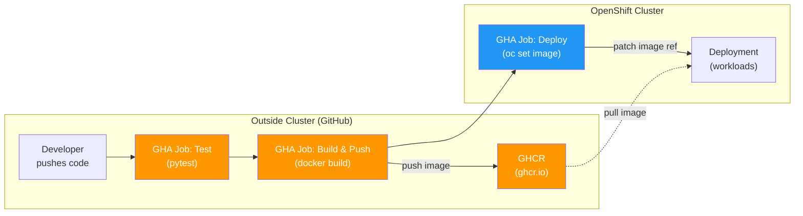
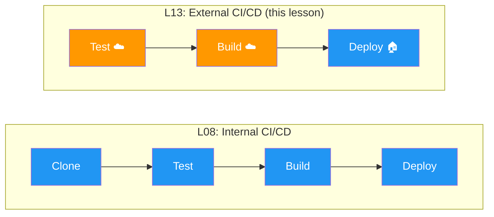

# LP-L13 — External CI/CD: GitHub Actions to OpenShift

**Level:** Personalized
**Duration:** 45 min

## Overview

In [L08](../L08_cicd_pipeline/) you built a complete CI/CD pipeline with Tekton — every stage (clone, test, build, deploy) ran as pods inside the cluster. That approach keeps everything in one place, but it means your CI/CD workload competes for resources with your application workload. A runaway build can slow down production pods.

In this lesson, you move CI (test + build) off the cluster entirely, onto GitHub Actions runners. Only the deploy step reaches into OpenShift — using a tightly scoped ServiceAccount that can patch Deployments and nothing else. This is the production pattern: CI runs externally, CD targets the cluster with minimal privileges.

## Prerequisites

- Completed: [L01](../L01_projects/) through [L08](../L08_cicd_pipeline/)
- All ShopInsights services running in the `shopinsights` project
- GitHub account with a repository containing the ShopInsights application code
- GitHub Personal Access Token (PAT) with `write:packages` scope (same as L08)
- OpenShift cluster running (CRC or Developer Sandbox)

## K8s Context

In vanilla Kubernetes, external CI/CD is the default. There is no built-in pipeline system — you use GitHub Actions, GitLab CI, Jenkins, or another external tool. The CI system builds the image, pushes it to a registry, and runs `kubectl set image` or `kubectl apply` to deploy. The cluster is a deployment target, not a CI runner.

OpenShift gives you the option to bring CI inside the cluster with Tekton (L08), but it works equally well as a deployment target for external CI. The `oc` CLI, ServiceAccount tokens, and the API server are all you need.

## Build and Deploy Architecture

This lesson moves **everything except the deploy step** outside the cluster. Build and test run on GitHub Actions runners. Only the deploy job reaches into OpenShift:



Orange components run on GitHub's infrastructure (zero cluster impact). Only the blue deploy step touches the cluster — with a least-privilege ServiceAccount that can only patch Deployments.

Compare this with [L08](../L08_cicd_pipeline/) where everything (including build and test) runs as pods inside the cluster:



> **How this lesson fits in the tutorial:**
>
> | Lesson | Build | Registry | CI/CD | Deploy |
> |--------|-------|----------|-------|--------|
> | [L02](../L02_builds_and_images/) | Internal (BuildConfig) | Internal (ImageStream) | Manual | Auto (image trigger) |
> | [L08](../L08_cicd_pipeline/) | Internal (Tekton + buildah) | External (GHCR) | Internal (Tekton) | Pipeline (`oc set image`) |
> | **L13 (this)** | **External (GitHub Actions)** | **External (GHCR)** | **External (GitHub Actions)** | **Pipeline (`oc set image`)** |
> | [L09](../L09_gitops/) | — (images pre-built) | External (GHCR) | — | GitOps (ArgoCD auto-sync) |

## Concepts

### Internal vs External CI: When to Use Which

| Factor | Internal (Tekton / L08) | External (GitHub Actions / this lesson) |
|--------|------------------------|-----------------------------------------|
| Resource isolation | Pipeline pods share cluster resources with workloads | CI runs on GitHub's infrastructure, zero cluster impact |
| Blast radius | Bad pipeline can degrade the cluster | Bad workflow only affects the GHA runner |
| Cost | Uses your cluster CPU/memory (free if you have capacity) | GitHub free tier: 2,000 min/month; then paid |
| Network | Full cluster-internal access | Needs external API access to the cluster |
| Secrets | Kubernetes Secrets, never leave the cluster | Stored in GitHub Settings, sent to GHA runners |
| Visibility | OpenShift Web Console Pipelines view | GitHub Actions tab in the repository |
| Portability | Tied to OpenShift/Tekton | Works with any Kubernetes cluster |
| Setup complexity | Install Pipelines operator, write Tekton YAML | Write a workflow file, configure secrets |

**Use internal CI (Tekton) when:**
- You want everything in one place with one set of tooling
- Your cluster has spare capacity and you want to avoid external CI costs
- You need deep integration with cluster-internal systems (internal registry, cluster events)
- Your team already uses OpenShift Pipelines

**Use external CI (GitHub Actions) when:**
- You want CI/CD isolated from production workloads
- You deploy to multiple clusters (staging, production)
- Your team already uses GitHub and wants CI close to the code
- You need to avoid CI impacting cluster performance

### Real-World CI/CD Architecture

This lesson teaches one piece of the production CI/CD puzzle. Here is how the pieces fit together in real companies:

```
Developer pushes code
       │
       ▼
External CI (GitHub Actions / GitLab CI / Jenkins)    ← this lesson
  ├── lint + unit tests
  ├── build image
  ├── push to external registry (Quay, GHCR, ECR)
  └── update image tag in GitOps repo (PR or direct commit)
       │
       ▼
ArgoCD on target cluster (L09)
  ├── detects GitOps repo change
  ├── renders Kustomize/Helm manifests
  ├── diffs against live cluster state
  └── syncs (applies the new image)
       │
       ▼
Workloads updated, rollout monitored
```

Key principles that production teams follow:

1. **CI and CD are separate systems.** CI is compute-heavy (builds, tests) and runs externally. CD is lightweight (apply manifests) and runs on the target cluster via ArgoCD or Flux. They communicate through a Git repo (GitOps) and an image registry — not through direct API calls.

2. **The cluster is a deployment target, not a CI runner.** Nobody runs builds on the same infrastructure that serves production traffic. Even companies using Tekton (L08) run it on a dedicated CI cluster, not the workload cluster.

3. **Images always flow through an external registry.** Quay, GHCR, ECR, or Artifactory. The internal OpenShift registry is useful for development but is never the source of truth for production images — it is tied to one cluster and disappears if the cluster is rebuilt.

4. **Nobody deploys with `oc set image` in production.** This lesson uses it for simplicity. In production, CI updates the image tag in a GitOps repository, and ArgoCD ([L09](../L09_gitops/)) syncs the change. This gives you an audit trail in Git, rollback via `git revert`, and automatic drift detection.

5. **Deploy credentials are always least-privilege.** The SA that external CI uses to reach the cluster can only do what it needs — patch Deployments, nothing else. This lesson demonstrates that principle.

> **Where does Tekton fit?** Tekton's biggest adoption is at companies fully committed to Red Hat/OpenShift — banks, telcos, and government — where compliance requires all infrastructure (including CI/CD) to be auditable through one Kubernetes control plane. For most teams, GitHub Actions or GitLab CI + ArgoCD is simpler and the industry default.

### ServiceAccount Tokens for External Access

When GitHub Actions needs to deploy to OpenShift, it authenticates using a ServiceAccount token. In OpenShift 4.x (Kubernetes 1.24+), ServiceAccounts no longer auto-generate persistent tokens. You create one explicitly as a Secret:

```yaml
apiVersion: v1
kind: Secret
metadata:
  name: github-actions-deployer-token
  annotations:
    kubernetes.io/service-account.name: github-actions-deployer
type: kubernetes.io/service-account-token
```

The cluster's token controller populates the `token` field automatically. This token is long-lived — store it as a GitHub repository secret and use it in the `oc login` step.

### Least-Privilege RBAC

In L08, the pipeline ServiceAccount had the `edit` ClusterRole — it could create, modify, and delete most resources in the namespace. That is too broad for an external system.

Here, the ServiceAccount gets a custom Role with only three permissions:

```yaml
rules:
  - apiGroups: ["apps"]
    resources: ["deployments"]
    verbs: ["get", "list", "patch"]    # Read and update, not create or delete
  - apiGroups: ["apps"]
    resources: ["deployments/status"]
    verbs: ["get"]                     # Check rollout status
  - apiGroups: [""]
    resources: ["pods"]
    verbs: ["get", "list", "watch"]    # Verify pods are running
```

If the token is compromised, the attacker can patch existing Deployments (change the image) but cannot create new ones, delete resources, read Secrets, or escalate privileges. This is the principle of least privilege applied to CI/CD.

### GitHub Actions Workflow Structure

A GitHub Actions workflow file (`.github/workflows/ci-cd.yaml`) defines jobs that run on GitHub's infrastructure:

```
push to main ──> [test] ──> [build-push] ──> [deploy]
                  │              │               │
                  │              │               └─ runs: oc set image
                  │              └─ runs: docker build + push to GHCR
                  └─ runs: pytest
                  
                  ▲ All three jobs run on GitHub runners ▲
                  Only the deploy job talks to your cluster
```

Each job runs in a fresh Ubuntu VM. Jobs are linked with `needs:` — if `test` fails, `build-push` and `deploy` never run. The `deploy` job uses the `redhat-actions/oc-login` GitHub Action to authenticate to OpenShift.

## Step-by-Step

### Step 1: Create the Deploy ServiceAccount

Create a ServiceAccount with minimal permissions — just enough to update Deployments.

```bash
oc apply -f manifests/deploy-sa.yaml
oc apply -f manifests/deploy-role.yaml
oc apply -f manifests/deploy-rolebinding.yaml
```

```yaml
# manifests/deploy-sa.yaml
apiVersion: v1
kind: ServiceAccount
metadata:
  name: github-actions-deployer
  labels:
    app: shopinsights
    tutorial: personalized
    lesson: "13"
```

```yaml
# manifests/deploy-role.yaml
apiVersion: rbac.authorization.k8s.io/v1
kind: Role
metadata:
  name: deployer
  labels:
    app: shopinsights
    tutorial: personalized
    lesson: "13"
rules:
  - apiGroups: ["apps"]
    resources: ["deployments"]
    verbs: ["get", "list", "patch"]
  - apiGroups: ["apps"]
    resources: ["deployments/status"]
    verbs: ["get"]
  - apiGroups: [""]
    resources: ["pods"]
    verbs: ["get", "list", "watch"]
```

```yaml
# manifests/deploy-rolebinding.yaml
apiVersion: rbac.authorization.k8s.io/v1
kind: RoleBinding
metadata:
  name: github-actions-deployer
  labels:
    app: shopinsights
    tutorial: personalized
    lesson: "13"
subjects:
  - kind: ServiceAccount
    name: github-actions-deployer
roleRef:
  kind: Role
  name: deployer
  apiGroup: rbac.authorization.k8s.io
```

Verify the ServiceAccount and Role were created:

```bash
oc get sa github-actions-deployer
oc get role deployer -o yaml
```

### Step 2: Generate a Long-Lived Token

Create a Secret that generates a persistent token for the ServiceAccount:

```bash
oc apply -f manifests/deploy-sa-token.yaml
```

```yaml
# manifests/deploy-sa-token.yaml
apiVersion: v1
kind: Secret
metadata:
  name: github-actions-deployer-token
  labels:
    app: shopinsights
    tutorial: personalized
    lesson: "13"
  annotations:
    kubernetes.io/service-account.name: github-actions-deployer
type: kubernetes.io/service-account-token
```

Wait a moment for the token controller to populate the token, then extract it:

```bash
oc get secret github-actions-deployer-token -o jsonpath='{.data.token}' | base64 -d
```

Get the API server URL:

```bash
oc whoami --show-server
```

You will need both values in the next step.

**Or use the setup script** (does all of the above and prints the values):

```bash
chmod +x scripts/setup-deploy-credentials.sh
./scripts/setup-deploy-credentials.sh
```

### Step 3: Configure GitHub Repository Secrets

Go to your GitHub repository: **Settings > Secrets and variables > Actions > New repository secret**

Create these five secrets:

| Secret Name | Value |
|-------------|-------|
| `OPENSHIFT_SERVER` | The API server URL (e.g., `https://api.sandbox-xxx.openshiftapps.com:6443`) |
| `OPENSHIFT_TOKEN` | The ServiceAccount token from Step 2 |
| `OPENSHIFT_NAMESPACE` | `shopinsights` |
| `GHCR_USERNAME` | Your GitHub username |
| `GHCR_TOKEN` | Your GitHub PAT with `write:packages` scope (same as L08) |

### Step 4: Create the GitHub Actions Workflow

Copy the workflow file to your repository:

```bash
mkdir -p .github/workflows
cp workflows/ci-cd.yaml .github/workflows/ci-cd.yaml
```

The workflow has three jobs:

**Job 1: Test** — installs Python dependencies and runs pytest (same logic as L08's test Task):

```yaml
test:
  runs-on: ubuntu-latest
  steps:
    - uses: actions/checkout@v4
    - uses: actions/setup-python@v5
      with:
        python-version: "3.11"
    - name: Install dependencies and run tests
      working-directory: shared_app/products-service
      run: |
        pip install uv
        uv sync --frozen --no-dev
        uv pip install --system pytest httpx
        if find . -name "test_*.py" -o -name "*_test.py" | grep -q .; then
          uv run pytest -v
        else
          uv run python -c "import app; print('Module import OK')"
        fi
```

**Job 2: Build & Push** — builds the container image and pushes to GHCR:

```yaml
build-push:
  needs: test
  runs-on: ubuntu-latest
  permissions:
    packages: write
  steps:
    - uses: actions/checkout@v4
    - uses: docker/login-action@v3
      with:
        registry: ghcr.io
        username: ${{ secrets.GHCR_USERNAME }}
        password: ${{ secrets.GHCR_TOKEN }}
    - uses: docker/build-push-action@v6
      with:
        context: shared_app/products-service
        push: true
        tags: |
          ghcr.io/${{ github.repository_owner }}/shopinsights-products:${{ github.sha }}
          ghcr.io/${{ github.repository_owner }}/shopinsights-products:latest
```

**Job 3: Deploy** — logs into OpenShift and updates the Deployment image:

```yaml
deploy:
  needs: build-push
  runs-on: ubuntu-latest
  steps:
    - uses: redhat-actions/oc-installer@v1
    - uses: redhat-actions/oc-login@v1
      with:
        openshift_server_url: ${{ secrets.OPENSHIFT_SERVER }}
        openshift_token: ${{ secrets.OPENSHIFT_TOKEN }}
        insecure_skip_tls_verify: true
    - name: Deploy new image
      run: |
        oc set image deployment/products-service \
          products-service=ghcr.io/${{ github.repository_owner }}/shopinsights-products:${{ github.sha }} \
          -n ${{ secrets.OPENSHIFT_NAMESPACE }}
        oc rollout status deployment/products-service \
          -n ${{ secrets.OPENSHIFT_NAMESPACE }} --timeout=120s
```

Notice:
- **`redhat-actions/oc-installer@v1`** — installs the `oc` CLI on the GitHub runner. This is the official Red Hat-maintained action.
- **`redhat-actions/oc-login@v1`** — authenticates to the cluster using the SA token. The `insecure_skip_tls_verify: true` is needed for sandbox clusters with self-signed certificates. In production, provide the CA certificate instead.
- **Image tag uses `github.sha`** — the commit SHA as the image tag. This gives you exact traceability: every Deployment points to the exact commit that built it.

### Step 5: Push a Change and Watch the Workflow

Make a small change to the products-service (e.g., update the version string) and push:

```bash
# Make a change
cd shared_app/products-service
# Edit a file...

# Commit and push
git add .
git commit -m "Update products-service version"
git push origin main
```

Then go to your repository on GitHub and click the **Actions** tab. You should see a new workflow run with three jobs:

```
test ──> build-push ──> deploy
  ✓          ✓            ✓
```

Click into each job to see its logs. The test job takes ~30 seconds, build-push ~2-3 minutes, and deploy ~30 seconds.

### Step 6: Verify the Deployment

Back on your cluster, verify the Deployment was updated:

```bash
# Check the current image
oc get deployment products-service \
  -o jsonpath='{.spec.template.spec.containers[0].image}'
echo ""

# Verify the pods are running with the new image
oc get pods -l component=products-service

# Check the rollout history
oc rollout history deployment/products-service
```

The image tag should match the commit SHA from your push.

## Verification

Run these commands to verify the full setup:

```bash
echo "=== Deploy ServiceAccount ==="
oc get sa github-actions-deployer

echo ""
echo "=== RBAC ==="
oc get role deployer
oc get rolebinding github-actions-deployer

echo ""
echo "=== Token Secret ==="
oc get secret github-actions-deployer-token

echo ""
echo "=== Current Deployment Image ==="
oc get deployment products-service \
  -o jsonpath='{.spec.template.spec.containers[0].image}'
echo ""

echo ""
echo "=== Pods ==="
oc get pods -l component=products-service
```

To verify the RBAC is correctly scoped, test what the ServiceAccount can and cannot do:

```bash
# Should succeed — the SA can get deployments
oc auth can-i get deployments \
  --as=system:serviceaccount:shopinsights:github-actions-deployer

# Should succeed — the SA can patch deployments
oc auth can-i patch deployments \
  --as=system:serviceaccount:shopinsights:github-actions-deployer

# Should FAIL — the SA cannot delete deployments
oc auth can-i delete deployments \
  --as=system:serviceaccount:shopinsights:github-actions-deployer

# Should FAIL — the SA cannot read secrets
oc auth can-i get secrets \
  --as=system:serviceaccount:shopinsights:github-actions-deployer
```

## L08 (Tekton) vs L13 (GitHub Actions) Comparison

| Aspect | L08: Tekton (Internal) | L13: GitHub Actions (External) |
|--------|----------------------|-------------------------------|
| Where CI runs | Pods in the cluster | GitHub-hosted VMs |
| Cluster resource impact | Build pods compete with workloads | Zero — only the deploy step talks to the cluster |
| Blast radius | Bad pipeline can degrade the cluster | Bad workflow only affects the GHA runner |
| Pipeline definition | Tekton Pipeline CRD (cluster YAML) | `.github/workflows/` (repo YAML) |
| Build tool | buildah (unprivileged, VFS storage) | docker (standard, on GHA runner) |
| Webhook setup | EventListener pod + Route + TriggerBinding | Built-in — GitHub triggers its own workflows |
| Deploy permissions | `edit` ClusterRole (broad) | Custom Role: only `get`/`list`/`patch` Deployments |
| Secrets management | Kubernetes Secrets, stay in-cluster | GitHub repository secrets, sent to runners |
| Cost | Cluster CPU/memory | GitHub free: 2,000 min/month, then $0.008/min |
| Visibility | OpenShift Console > Pipelines | GitHub > Actions tab |
| Multi-cluster deploy | Requires Tekton on each cluster | One workflow deploys to any cluster with `oc login` |
| Offline/air-gapped | Works — no external dependency | Does not work — needs GitHub connectivity |

## Key Takeaways

- **External CI separates concerns** — CI runs on GitHub's infrastructure, so builds and tests cannot impact your application workloads. Only the deploy step reaches into the cluster.
- **Least-privilege RBAC** — the deploy ServiceAccount can only `get`, `list`, and `patch` Deployments. No `create`, no `delete`, no access to Secrets. If the token leaks, the blast radius is limited.
- **Commit SHA as image tag** — tagging images with the Git commit SHA gives you exact traceability from Deployment to source code.
- **GitHub Actions workflows are simpler to set up** than Tekton pipelines — no operator installation, no EventListener, no TriggerBinding. GitHub handles webhooks natively.
- **The tradeoff is cost and control** — GHA is free up to 2,000 min/month but you pay after that. Tekton uses cluster resources you already have. Choose based on your team's priorities.
- **Both approaches push to GHCR** — the external registry (introduced in L08) makes images accessible regardless of whether CI runs inside or outside the cluster.

## Cleanup

Remove the deploy resources created in this lesson:

```bash
oc delete secret github-actions-deployer-token
oc delete rolebinding github-actions-deployer
oc delete role deployer
oc delete sa github-actions-deployer
```

Or delete everything with the lesson label:

```bash
oc delete all -l tutorial=personalized,lesson=13
oc delete secret -l tutorial=personalized,lesson=13
oc delete role -l tutorial=personalized,lesson=13
oc delete rolebinding -l tutorial=personalized,lesson=13
```

Also remove the workflow file from your repository if you no longer want automated deployments:

```bash
rm .github/workflows/ci-cd.yaml
git add -A && git commit -m "Remove CI/CD workflow" && git push
```

And delete the GitHub repository secrets (Settings > Secrets and variables > Actions).

## Next Steps

You now have two CI/CD approaches: internal (L08/Tekton) and external (this lesson/GitHub Actions). Both push to the same external registry (GHCR) and deploy to the same cluster.

For the complete picture, combine this with [L09: GitOps with ArgoCD](../L09_gitops/) — instead of the deploy job running `oc set image`, have the build job update the image tag in your GitOps repository. ArgoCD then detects the change and syncs the new image to the cluster. This gives you:

```
GitHub Actions (CI) ──> GHCR (images) ──> GitOps repo (manifests) ──> ArgoCD (CD) ──> OpenShift
```

That is the production-grade CI/CD pattern: CI builds externally, images live in an external registry, and GitOps reconciles the desired state with the cluster.
