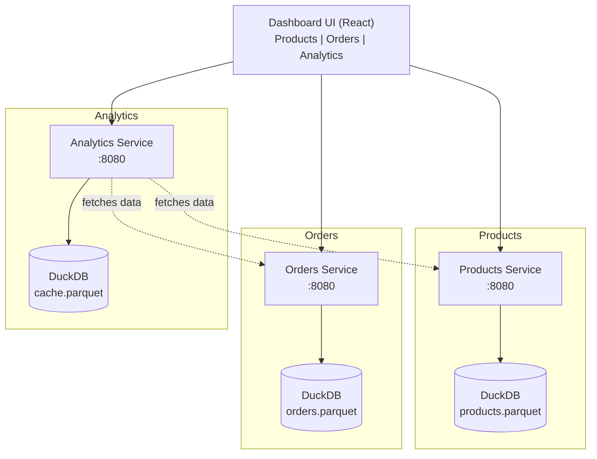

# ShopInsights — Personalized OpenShift Tutorial

**Audience:** You know Kubernetes. You use Traefik, Keycloak, and vanilla K8s. Now you want to understand OpenShift — not every feature, but the ones that matter for running real microservices.

**Approach:** One project, ten lessons. Each lesson adds an OpenShift capability to the same application. By the end, you have a production-ready microservices platform with Routes, Service Mesh, CI/CD, GitOps, monitoring, and serverless.

**Environment:** OpenShift Local (CRC) or Red Hat Developer Sandbox.

---

## The Project

"ShopInsights" is an e-commerce analytics platform with three Python/FastAPI microservices (each with its own DuckDB database storing Parquet files) and a React dashboard.



- **Products Service** — product catalog (CRUD)
- **Orders Service** — order processing and history
- **Analytics Service** — aggregates data from Products + Orders, generates insights
- **Dashboard UI** — React frontend for browsing products, viewing orders, and analytics charts

The source code lives in `shared_app/`. Each lesson's manifests deploy or modify this stack.

---

## Prerequisites

- OpenShift cluster running (CRC or Developer Sandbox — see login instructions below)
- `oc` CLI installed and on PATH
- Basic Kubernetes knowledge (Deployments, Services, PVCs, ConfigMaps)
- Docker/Podman for building images locally (optional — L04 teaches in-cluster builds)

### Logging In to Your Cluster

You need a working `oc login` before any lesson will work. Pick one of the two options below.

#### Option A: OpenShift Local (CRC)

1. **Install CRC** — download from [console.redhat.com/openshift/create/local](https://console.redhat.com/openshift/create/local) and run the initial setup:

   ```bash
   crc setup
   ```

2. **Start the cluster** (takes a few minutes on first run):

   ```bash
   crc start
   ```

   When it finishes, it prints a `kubeadmin` password — save it. You'll also see a line like:
   ```
   Started the OpenShift cluster.
   ...
   To access the cluster, first set up your environment by following the instructions returned by executing 'crc oc-env'.
   ```

3. **Configure your shell** so the `oc` binary shipped with CRC is on your PATH:

   ```bash
   eval $(crc oc-env)
   ```

   > Run this in every new terminal, or add it to your `~/.zshrc` / `~/.bashrc`.

4. **Log in** — use the `developer` user for all lessons (it has regular-user privileges, which is what you'll have in a real cluster):

   ```bash
   oc login -u developer -p developer https://api.crc.testing:6443
   ```

   For lessons that need cluster-admin (installing operators, etc.), switch to kubeadmin:

   ```bash
   oc login -u kubeadmin -p <password-from-crc-start> https://api.crc.testing:6443
   ```

   > Forgot the kubeadmin password? Run `crc console --credentials` to see it again.

5. **Verify** you're connected:

   ```bash
   oc whoami                 # should print: developer
   oc project                # should print: Using project "default" or similar
   oc get nodes              # should list one node (crc-...)
   ```

#### Option B: Red Hat Developer Sandbox (free, no local install)

1. **Sign up** at [developers.redhat.com/developer-sandbox](https://developers.redhat.com/developer-sandbox) and launch your sandbox.

2. **Get the login command** from the web console:
   - Click your username in the top-right corner → **Copy login command**
   - Click **Display Token** on the page that opens
   - Copy the `oc login` command — it looks like:

     ```bash
     oc login --token=sha256~XXXXX --server=https://api.sandbox-m2.ll9k.p1.openshiftapps.com:6443
     ```

   - Paste and run it in your terminal.

   > The token expires periodically. If `oc` commands start failing with `Unauthorized`, repeat this step to get a fresh token.

3. **Verify** you're connected:

   ```bash
   oc whoami                 # should print your username
   oc project                # should print your sandbox project
   ```

   > Sandbox limitations: you get one project (namespace), no cluster-admin access, and the environment is deleted after 30 days of inactivity. Most lessons work fine, but operator installations (L03, L08, L09, L10) require CRC or a full cluster.

### CRC Resource Recommendations

Some lessons install operators (Service Mesh, Pipelines, GitOps, Serverless) that need extra memory:

```bash
crc config set memory 20480    # 20 GB — recommended if running multiple operators
crc config set cpus 6          # 6 CPUs
```

Apply these **before** `crc start` (or run `crc stop` → change config → `crc start`).

---

## Lessons

| # | Lesson | Duration | What You'll Learn |
|---|--------|----------|-------------------|
| 01 | [Deploy the Microservices Stack](L01_deploy_microservices/) | 1 hr | Deploy 3 services + UI with health probes, resource limits, ConfigMaps, Secrets. The SCC "no root" gotcha. |
| 02 | [Expose Services Externally](L02_expose_externally/) | 45 min | Routes with TLS. **Is Route a replacement for Traefik? Yes.** |
| 03 | [Service Mesh with Istio](L03_service_mesh/) | 1 hr | Envoy sidecars, mTLS, canary deployments, Kiali observability, circuit breakers. |
| 04 | [Build & Image Resources](L04_builds_and_images/) | 1 hr | BuildConfig, S2I, ImageStreams — the cluster builds your code. Internal registry. |
| 05 | [Projects](L05_projects/) | 20 min | Projects vs Namespaces. Multi-environment setup (dev + staging). |
| 06 | [Authentication & Authorization](L06_auth_and_identity/) | 45 min | OAuth, users, RBAC. **Is OAuth a replacement for Keycloak? For cluster auth, yes.** |
| 07 | [Monitoring & Logging](L07_monitoring_and_logging/) | 1 hr | Custom Prometheus metrics from Python, ServiceMonitor, alerts, log forwarding. |
| 08 | [CI/CD Pipeline](L08_cicd_pipeline/) | 1 hr 15 min | Tekton pipeline: GitHub → test → build → push to GHCR → deploy. |
| 09 | [GitOps with ArgoCD](L09_gitops/) | 1 hr | **Why GitOps?** ArgoCD, Kustomize overlays, drift detection, auto-heal. |
| 10 | [Serverless](L10_serverless/) | 45 min | **Why serverless?** Knative, scale-to-zero, cold starts, eventing. |

**Total:** ~8 hours

---

## Networking Architecture

OpenShift uses two proxy layers — this replaces the Traefik + manual Istio setup you might use in vanilla K8s:

```mermaid
graph LR
    subgraph Edge Ingress — L02
        EXT((External<br/>Traffic)) --> HAProxy["HAProxy Router<br/>(Routes)"]
    end

    subgraph Service Mesh — L03
        INT((Inter-service<br/>Traffic)) --> Envoy["Envoy Sidecars<br/>(Istio)"]
    end

    HAProxy -->|"replaces Traefik<br/>TLS termination"| Pods[Pods]
    Envoy -->|"mTLS, canary,<br/>circuit breakers"| Pods
```

- **Routes + HAProxy** (pre-installed): external HTTP/HTTPS ingress with TLS termination
- **Istio + Envoy** (operator): inter-service mTLS, traffic splitting, circuit breakers, distributed tracing

---

## Your Questions, Answered

Quick pointers to where each of your original questions is addressed:

| Your Question | Answer | Lesson |
|---|---|---|
| Is Route a replacement for Traefik? | Yes, for HTTP/HTTPS ingress. HAProxy router is pre-installed. | L02 |
| Is OAuth a replacement for Keycloak? | For cluster auth, yes. For app-level SSO, no — you still need Keycloak/RHSSO. | L06 |
| Why should I use serverless? | Scale-to-zero saves resources for sporadic workloads. | L10 |
| Why should I use GitOps? | Git becomes the single source of truth. No more "who changed what on the cluster." | L09 |
| Is BuildConfig related to CI/CD? | BuildConfig is the build step. CI/CD (Tekton) orchestrates the full workflow. | L04, L08 |

---

## Project Structure

```
tutorial/
  README.md                    ← you are here
  shared_app/                  # Application source code
    products-service/
    orders-service/
    analytics-service/
    dashboard-ui/
  L01_deploy_microservices/    # Lesson directories
  L02_expose_externally/
  ...
  L10_serverless/
```
