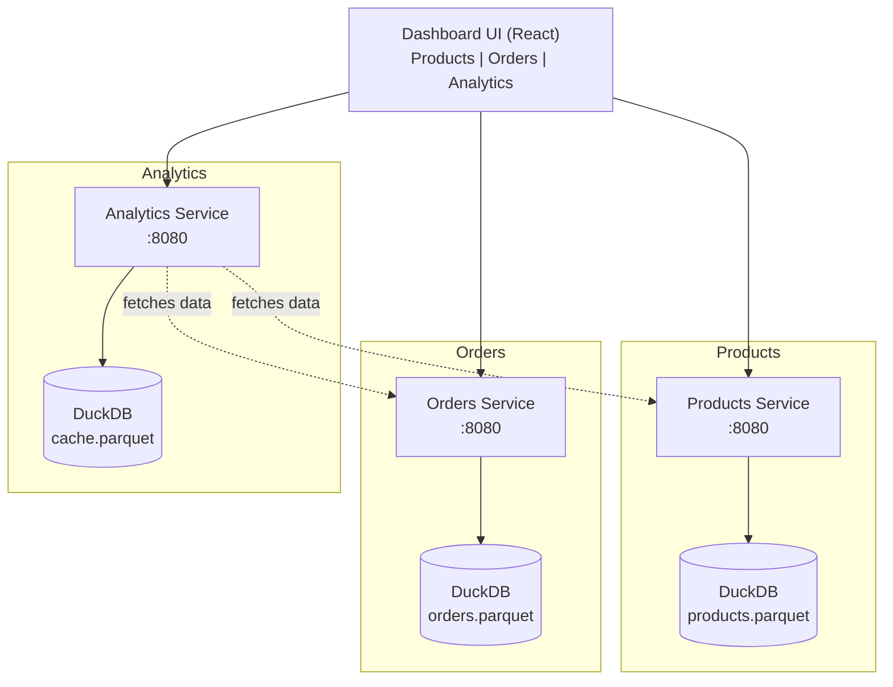

# ShopInsights — Personalized OpenShift Tutorial

**Audience:** You know Kubernetes. You use Traefik, Keycloak, and vanilla K8s. Now you want to understand OpenShift — not every feature, but the ones that matter for running real microservices.

**Approach:** One project, ten lessons. Each lesson adds an OpenShift capability to the same application. By the end, you have a production-ready microservices platform with Routes, Service Mesh, CI/CD, GitOps, monitoring, and serverless.

**Environment:** Red Hat Demo Platform (recommended), Developer Sandbox, or OpenShift Local (CRC).

---

## The Project

"ShopInsights" is an e-commerce analytics platform with three Python/FastAPI microservices (each with its own DuckDB database storing Parquet files) and a React dashboard.



- **Products Service** — product catalog (CRUD)
- **Orders Service** — order processing and history
- **Analytics Service** — aggregates data from Products + Orders, generates insights
- **Dashboard UI** — React frontend for browsing products, viewing orders, and analytics charts

The source code lives in `shared_app/`. Each lesson's manifests deploy or modify this stack.

---

## Prerequisites

- OpenShift cluster running (CRC or Developer Sandbox — see login instructions below)
- `oc` CLI installed and on PATH
- Basic Kubernetes knowledge (Deployments, Services, PVCs, ConfigMaps)
- Docker/Podman for building images locally (optional — L02 teaches in-cluster builds)

### Choosing Your Environment

| Environment | Admin Access | Resources | Best For |
|-------------|-------------|-----------|----------|
| **[Red Hat Demo Platform](https://catalog.demo.redhat.com/catalog/babylon-catalog-prod?item=babylon-catalog-prod/published.openshift-ai-v3.prod&utm_source=webapp&utm_medium=share-link)** (recommended) | Full cluster-admin | Full cluster with GPUs | All lessons, including operators (L05, L08, L09, L10) |
| [Developer Sandbox](https://sandbox.redhat.com/) | No admin | Shared, limited | Basic lessons only (L01-L04, L06-L07) |
| [OpenShift Local (CRC)](https://console.redhat.com/openshift/create/local) | Full cluster-admin | Limited by your machine | All lessons, but slow and resource-heavy |

**We recommend the Red Hat Demo Platform.** The Developer Sandbox lacks admin permissions, so you cannot install operators or manage cluster-wide resources. OpenShift Local (CRC) gives you admin access but requires significant local resources and is often too slow for a comfortable experience.

### Logging In to Your Cluster

You need a working `oc login` before any lesson will work. Pick one of the options below.

#### Option A: Red Hat Demo Platform (recommended)

1. **Request an environment** from the [Red Hat Demo Platform catalog](https://catalog.demo.redhat.com/catalog/babylon-catalog-prod?item=babylon-catalog-prod/published.openshift-ai-v3.prod&utm_source=webapp&utm_medium=share-link) (requires a free Red Hat account).

2. **Get the login command** from the web console:
   - Click your username in the top-right corner → **Copy login command**
   - Click **Display Token** on the page that opens
   - Copy the `oc login` command and run it in your terminal.

3. **Verify** you're connected:

   ```bash
   oc whoami                 # should print your username
   oc project                # should print your project
   ```

#### Option B: Red Hat Developer Sandbox

1. **Sign up** at [sandbox.redhat.com](https://sandbox.redhat.com/) and launch your sandbox.

2. **Get the login command** from the web console:
   - Click your username in the top-right corner → **Copy login command**
   - Click **Display Token** on the page that opens
   - Copy the `oc login` command — it looks like:

     ```bash
     oc login --token=sha256~XXXXX --server=https://api.sandbox-xxx.openshiftapps.com:6443
     ```

   - Paste and run it in your terminal.

3. **Verify** you're connected:

   ```bash
   oc whoami                 # should print your username
   oc project                # should print your sandbox project
   ```

> **⚠ You must log in every day.** Sandbox tokens expire daily. Each time you sit down to work on a lesson, repeat step 2 to get a fresh token. If `oc` commands fail with `Unauthorized` or `error: You must be logged in to the server`, your token has expired — get a new one.

> **Sandbox limitations:** you get one project (namespace), no cluster-admin access, and the environment is deleted after 30 days of inactivity. Most lessons work fine, but operator installations (L03, L08, L09, L10) require CRC or a full cluster.

#### Option C: OpenShift Local (CRC)

> For a detailed macOS setup walkthrough (system requirements, troubleshooting, day-to-day usage), see the **[Setting Up CRC on macOS](#setting-up-crc-on-macos-detailed-guide)** section below.

1. **Install CRC** — download from [console.redhat.com/openshift/create/local](https://console.redhat.com/openshift/create/local) and run the initial setup:

   ```bash
   crc setup
   ```

2. **Start the cluster** (takes a few minutes on first run):

   ```bash
   crc start
   ```

   When it finishes, it prints a `kubeadmin` password — save it.

3. **Configure your shell** so the `oc` binary shipped with CRC is on your PATH:

   ```bash
   eval $(crc oc-env)
   ```

   > Run this in every new terminal, or add it to your `~/.zshrc` / `~/.bashrc`.

4. **Log in** — use the `developer` user for all lessons (it has regular-user privileges, which is what you'll have in a real cluster):

   ```bash
   oc login -u developer -p developer https://api.crc.testing:6443
   ```

   For lessons that need cluster-admin (installing operators, etc.), switch to kubeadmin:

   ```bash
   oc login -u kubeadmin -p <password-from-crc-start> https://api.crc.testing:6443
   ```

   > Forgot the kubeadmin password? Run `crc console --credentials` to see it again.

5. **Verify** you're connected:

   ```bash
   oc whoami                 # should print: developer
   oc project                # should print: Using project "default" or similar
   oc get nodes              # should list one node (crc-...)
   ```

### CRC Resource Recommendations

Some lessons install operators (Service Mesh, Pipelines, GitOps, Serverless) that need extra memory:

```bash
crc config set memory 20480    # 20 GB — recommended if running multiple operators
crc config set cpus 6          # 6 CPUs
```

Apply these **before** `crc start` (or run `crc stop` → change config → `crc start`).

### Setting Up CRC on macOS (Detailed Guide)

Several lessons (L03, L08, L09, L10) install operators that require cluster-admin access — something the Developer Sandbox does not provide. If you hit that wall, CRC on macOS is your path forward.

#### System Requirements

| Requirement | Minimum | Recommended |
|-------------|---------|-------------|
| macOS version | 13 Ventura | 14 Sonoma or newer |
| Architecture | Intel or Apple Silicon (M1/M2/M3/M4) | Apple Silicon |
| RAM | 16 GB total (9 GB for CRC) | 32 GB total (20 GB for CRC) |
| Free disk | 35 GB | 50 GB |
| CPU cores | 4 (2 for CRC) | 8 (6 for CRC) |

CRC runs a single-node OpenShift cluster inside a lightweight VM using Apple's Hypervisor framework (Apple Silicon) or HyperKit (Intel). No VirtualBox or Docker Desktop required.

#### Step 1: Download CRC

1. Go to [console.redhat.com/openshift/create/local](https://console.redhat.com/openshift/create/local) (requires a free Red Hat account).
2. Download the **macOS** installer (it detects your architecture automatically).
3. Download the **pull secret** from the same page — you will need it during `crc start`.

#### Step 2: Install

Double-click the downloaded `crc-macos-installer.pkg` and follow the installer prompts. It places the `crc` binary on your PATH automatically.

Verify the installation:

```bash
crc version
```

Alternatively, install via Homebrew:

```bash
brew install --cask crc
```

#### Step 3: Initial Setup

Run the one-time setup (configures the VM driver, DNS, etc.):

```bash
crc setup
```

This takes a few minutes. It will:
- Set up the VM driver (Hypervisor.framework on Apple Silicon, HyperKit on Intel)
- Configure DNS resolution for `*.crc.testing` and `*.apps-crc.testing` domains
- Create the necessary network configuration

#### Step 4: Configure Resources

Before starting the cluster for the first time, increase the defaults. The out-of-box settings (9 GB RAM, 4 CPUs) are too tight for operator-heavy lessons:

```bash
crc config set memory 20480    # 20 GB
crc config set cpus 6
crc config set disk-size 100    # 100 GB
```

Verify your config:

```bash
crc config view
```

#### Step 5: Start the Cluster

```bash
crc start
```

On first run, CRC will prompt for your pull secret — paste the one you downloaded in Step 1.

First start takes 10-15 minutes (it extracts and boots a full OpenShift node). Subsequent starts take 2-5 minutes.

When it finishes, it prints:

```
Started the OpenShift cluster.

The server is accessible via web console at:
  https://console-openshift-console.apps-crc.testing

Log in as administrator:
  Username: kubeadmin
  Password: XXXXX-XXXXX-XXXXX-XXXXX

Log in as user:
  Username: developer
  Password: developer
```

**Save the kubeadmin password** — you need it for operator installations.

#### Step 6: Configure Your Shell

Add the CRC-bundled `oc` to your PATH:

```bash
eval $(crc oc-env)
```

Add this to your `~/.zshrc` so it persists across terminal sessions:

```bash
echo 'eval $(crc oc-env)' >> ~/.zshrc
```

#### Step 7: Log In and Verify

```bash
# Log in as developer (default user for most lessons)
oc login -u developer -p developer https://api.crc.testing:6443

# Verify
oc whoami                 # developer
oc get nodes              # crc-xxxxx   Ready   ...

# Switch to kubeadmin when a lesson requires cluster-admin
oc login -u kubeadmin -p <password-from-step-5> https://api.crc.testing:6443
```

Open the Web Console at [https://console-openshift-console.apps-crc.testing](https://console-openshift-console.apps-crc.testing) to verify it loads (accept the self-signed certificate warning).

#### Day-to-Day Usage

```bash
crc start                  # Start the cluster (resumes from where you left off)
crc stop                   # Stop the cluster (preserves state, frees RAM)
crc delete                 # Delete the cluster entirely (start fresh)
crc console                # Open the web console in your browser
crc console --credentials  # Show the kubeadmin password again
crc status                 # Check if the cluster is running
```

**Tip:** Stop CRC when you are not using it — it consumes significant RAM even when idle.

#### Troubleshooting

| Problem | Solution |
|---------|----------|
| `crc start` hangs or is very slow | Check available RAM (`sysctl hw.memsize`). Close memory-heavy apps. |
| DNS resolution fails (`*.crc.testing` not resolving) | Run `crc setup` again. On macOS, CRC adds entries to `/etc/resolver/` — verify they exist. |
| `oc login` refused / connection error | Run `crc status` to check if the cluster is running. If it shows `Stopped`, run `crc start`. |
| Web console certificate error | Expected — CRC uses self-signed certs. Click through the browser warning. |
| Pods stuck in `Pending` | Likely resource pressure. Check `oc describe node crc-*` for memory/CPU pressure. Increase resources with `crc stop && crc config set memory 24576 && crc start`. |
| `error: x509: certificate has expired` | Your CRC certificates expired (happens after ~30 days). Run `crc stop && crc start` — CRC auto-renews on start. |
| Apple Silicon: VM fails to start | Update to the latest CRC version. Early M1 support had bugs that are fixed in newer releases. |
| Forgot kubeadmin password | `crc console --credentials` |

---

## Lessons

| # | Lesson | Duration | What You'll Learn |
|---|--------|----------|-------------------|
| 01 | [Projects](L01_projects/) | 20 min | Projects vs Namespaces. Create the ShopInsights project, multi-environment setup (dev + staging). |
| 02 | [Build & Image Resources](L02_builds_and_images/) | 1 hr | BuildConfig, S2I, ImageStreams — the cluster builds your code. Internal registry. |
| 03 | [Deploy the Microservices Stack](L03_deploy_microservices/) | 45 min | Deploy 3 services + UI from ImageStreams with health probes, resource limits, ConfigMaps, Secrets. The SCC "no root" gotcha. |
| 04 | [Expose Services Externally](L04_expose_externally/) | 45 min | Routes with TLS. **Is Route a replacement for Traefik? Yes.** |
| 05 | [Service Mesh with Istio](L05_service_mesh/) | 1 hr | Istio ambient mode (ztunnel + waypoint proxies), automatic mTLS, canary deployments, Kiali, circuit breakers. |
| 06 | [Authentication & Authorization](L06_auth_and_identity/) | 45 min | OAuth, users, RBAC. **Is OAuth a replacement for Keycloak? For cluster auth, yes.** |
| 07 | [Monitoring & Logging](L07_monitoring_and_logging/) | 1 hr | Custom Prometheus metrics from Python, ServiceMonitor, alerts, log forwarding. |
| 08 | [CI/CD Pipeline](L08_cicd_pipeline/) | 1 hr 15 min | Tekton pipeline: GitHub → test → build → push to GHCR → deploy. |
| 09 | [GitOps with ArgoCD](L09_gitops/) | 1 hr | **Why GitOps?** ArgoCD, Kustomize overlays, drift detection, auto-heal. |
| 10 | [Serverless](L10_serverless/) | 45 min | **Why serverless?** Knative, scale-to-zero, cold starts, eventing. |

**Total:** ~8 hours

---

## Running with Scripts

Each lesson includes shell scripts in its `scripts/` directory that run all the commands from the README automatically. If you prefer to execute lessons hands-off:

1. **Set up your `.env`** (one-time):

   ```bash
   cp .env.example .env
   # Edit .env and set GITHUB_USERNAME to your GitHub username
   ```

2. **Run a lesson:**

   ```bash
   cd L01_projects && ./scripts/run.sh
   cd ../L02_builds_and_images && ./scripts/run.sh
   cd ../L03_deploy_microservices && ./scripts/run.sh
   cd ../L04_expose_externally && ./scripts/run.sh
   cd ../L05_service_mesh && ./scripts/setup.sh && ./scripts/demo.sh
   ```

3. **Clean up a lesson:** each lesson has a `./scripts/cleanup.sh`.

The `.env` file is only required by L02 (for the GitHub-based BuildConfig URIs). All other scripts work without it.

> We recommend reading the README first and then running the script — the READMEs explain *why* each step matters.

---

## Networking Architecture

OpenShift uses two proxy layers — this replaces the Traefik + manual Istio setup you might use in vanilla K8s:

```mermaid
graph LR
    subgraph Edge Ingress — L04
        EXT((External<br/>Traffic)) --> HAProxy["HAProxy Router<br/>(Routes)"]
    end

    subgraph Service Mesh — L05
        INT((Inter-service<br/>Traffic)) --> ZT["ztunnel (L4)<br/>+ waypoint (L7)"]
    end

    HAProxy -->|"replaces Traefik<br/>TLS termination"| Pods[Pods]
    ZT -->|"mTLS, canary,<br/>circuit breakers"| Pods
```

- **Routes + HAProxy** (pre-installed): external HTTP/HTTPS ingress with TLS termination
- **Istio ambient mode** (operator): per-node ztunnel for automatic mTLS, on-demand waypoint proxies for traffic splitting, circuit breakers, distributed tracing

---

## Your Questions, Answered

Quick pointers to where each of your original questions is addressed:

| Your Question | Answer | Lesson |
|---|---|---|
| Is Route a replacement for Traefik? | Yes, for HTTP/HTTPS ingress. HAProxy router is pre-installed. | L04 |
| Is OAuth a replacement for Keycloak? | For cluster auth, yes. For app-level SSO, no — you still need Keycloak/RHSSO. | L06 |
| Why should I use serverless? | Scale-to-zero saves resources for sporadic workloads. | L10 |
| Why should I use GitOps? | Git becomes the single source of truth. No more "who changed what on the cluster." | L09 |
| Is BuildConfig related to CI/CD? | BuildConfig is the build step. CI/CD (Tekton) orchestrates the full workflow. | L02, L08 |

---

## Project Structure

```
tutorial/
  README.md                    ← you are here
  shared_app/                  # Application source code
    products-service/
    orders-service/
    analytics-service/
    dashboard-ui/
  L01_projects/                # Lesson directories
  L02_builds_and_images/
  ...
  L10_serverless/
```
