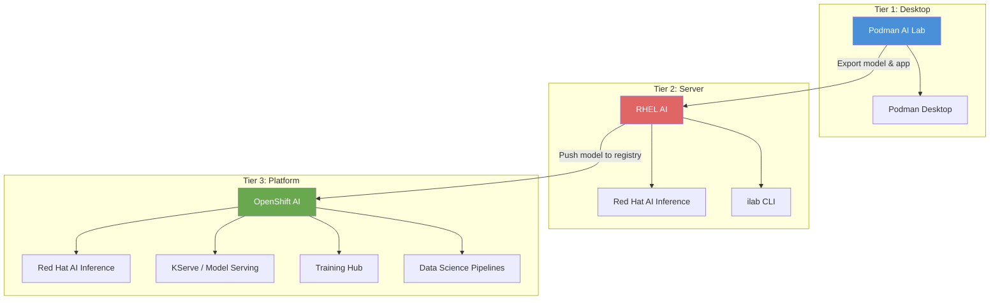
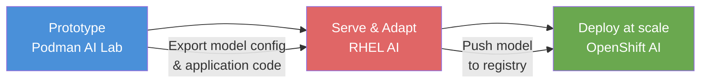

# L1-1.1 — Red Hat AI Vision, Architecture, and Portfolio

**Level:** Foundations
**Duration:** 30 min

## Overview

This lesson introduces Red Hat AI Enterprise — the unified "metal-to-agent" AI platform launched in February 2026 — and its three-tier deployment model. You will learn how four products (Podman AI Lab, Red Hat AI Inference, RHEL AI, and OpenShift AI) form a coherent progression from desktop experimentation to enterprise-scale production, and how Red Hat's upstream-first approach differentiates its platform from proprietary alternatives.

## Prerequisites

- Familiarity with containers and Kubernetes concepts
- Basic understanding of LLM concepts (inference, fine-tuning, serving)
- No cluster or software installation required — this is a conceptual lesson

## Concepts

### Red Hat AI Enterprise

Red Hat AI Enterprise (v3.4) is the umbrella platform that unifies Red Hat's AI products into a single subscription. The strategy rests on three pillars:

1. **Open-source first** — Every component is built on upstream open-source projects. There is no proprietary runtime, no closed model format, and no vendor-specific API that locks you in.
2. **Hybrid cloud** — AI workloads run on laptops, bare-metal servers, private clouds, and public clouds with the same tools. The same model you prototype on your laptop can run on RHEL AI on-prem or OpenShift AI in AWS.
3. **No vendor lock-in** — Models are Apache 2.0 licensed (IBM Granite). Serving uses vLLM (open source). Fine-tuning uses open-source tooling (Docling, SDG Hub, Training Hub). You can leave at any time and take your models, data, and workflows with you.

The platform bundles four products:

| Product | What It Is |
|---------|-----------|
| **Podman AI Lab** | Desktop extension for local model experimentation |
| **Red Hat AI Inference** | Standalone vLLM-based inference server (v3.3.0, formerly "AI Inference Server") |
| **RHEL AI** | Bootable container image with inference + model adaptation |
| **OpenShift AI** | Full Kubernetes-based MLOps platform |

---

### The Three-Tier Deployment Model

Red Hat organizes AI capabilities into three tiers, each designed for a different stage of the AI adoption journey.

#### Tier 1: Desktop — Podman AI Lab

Podman AI Lab is an extension for Podman Desktop that lets you download models, chat with them, and build AI-powered applications entirely on your laptop. No cloud account, no GPU server, no cost.

**What it provides:**
- A curated catalog of models (Granite, Llama, Mistral, others) in GGUF format for CPU inference
- An interactive playground for chatting with models
- Pre-built "recipes" — containerized AI applications (chatbot, RAG, code generation) you can run locally
- Export workflows to push your prototype toward production

**Who uses it:** Developers evaluating whether a model can solve their problem. Data scientists prototyping RAG pipelines. Anyone who wants to experiment before committing infrastructure.

**Time to value:** Minutes. Install the extension, download a model, start chatting.

#### Tier 2: Server — RHEL AI

RHEL AI is a bootable container image that provides an inference and model adaptation platform on a single server. It ships with Red Hat AI Inference (vLLM-based) for serving and the `ilab` CLI for model customization workflows, including synthetic data generation and fine-tuning.

**What it provides:**
- A bootable RHEL image with GPU drivers, Red Hat AI Inference, and the `ilab` CLI pre-configured
- The `ilab` CLI for taxonomy-driven fine-tuning using synthetic data generation (LAB methodology)
- Red Hat AI Inference for high-performance serving with an OpenAI-compatible API
- A single-server deployment model — no cluster required

**Who uses it:** Teams that need to fine-tune a model on proprietary data without sending it to a cloud provider. Organizations running inference on a dedicated GPU server. Anyone who needs more power than a laptop but does not need cluster-scale orchestration.

**Time to value:** Hours. Install RHEL AI on a server with a GPU, download a model, start serving or adapting.

#### Tier 3: Platform — OpenShift AI

OpenShift AI is the full MLOps platform built on OpenShift. It provides everything needed to serve, train, and manage models at enterprise scale: multi-model serving, distributed training, data science pipelines, model monitoring, and governance.

**What it provides:**
- Multi-model serving with KServe and Red Hat AI Inference (the same vLLM-based engine used in Tier 2)
- Model customization via Training Hub (Docling for document processing, SDG Hub for synthetic data, Training Hub for fine-tuning)
- Data Science Pipelines for reproducible ML workflows
- JupyterHub notebooks with pre-configured GPU images
- Model registry for versioning and lifecycle management
- Previews: AI Hub, Gen AI Studio, and Model-as-a-Service (MaaS) for simplified model access
- Integration with OpenShift's RBAC, monitoring, and networking

**Who uses it:** Platform teams building an internal AI platform. Organizations serving models to production applications with SLAs. Teams that need governance, audit trails, and multi-tenancy for AI workloads.

**Time to value:** Days. Install the OpenShift AI operator, configure model serving, set up pipelines and access controls.

---

### When to Use Each Tier

| Tier | Question It Answers | Scale | GPU Required? | Setup Time | Cost |
|------|-------------------|-------|--------------|------------|------|
| **Podman AI Lab** | "Can this model answer my questions?" | Single laptop | No (CPU inference via GGUF) | Minutes | Free |
| **RHEL AI** | "Can I serve and adapt a model on my own hardware?" | Single server | Yes (NVIDIA, AMD, or Intel) | Hours | RHEL subscription |
| **OpenShift AI** | "How do I serve this at scale with governance?" | Cluster (multi-node) | Yes (GPU nodes in cluster) | Days | OpenShift + AI subscription |

Choosing the right tier depends on your phase:

- **Exploration phase** — Use Podman AI Lab. You are evaluating models, testing prompts, and building proof-of-concept applications. The cost of getting started should be zero.
- **Customization phase** — Use RHEL AI. You have identified a model that works and need to fine-tune it on your domain data or serve it on dedicated hardware. The `ilab` CLI's synthetic data generation means you can fine-tune effectively with small amounts of training data.
- **Production phase** — Use OpenShift AI. You have a model that works and need to serve it to applications at scale with monitoring, autoscaling, access controls, and governance.

---

### The Progression Path

The three tiers are designed to work as a pipeline. A model and its application move from left to right as confidence grows:

**Step 1: Prototype on Podman AI Lab.** Download a Granite model, test it against your use case in the playground, and build a containerized application using a recipe. If the base model is good enough, you can skip RHEL AI and deploy directly to OpenShift AI.

**Step 2: Serve and adapt on RHEL AI.** If you need dedicated inference or the base model needs domain-specific knowledge, deploy RHEL AI on a GPU server. Use the `ilab` CLI for taxonomy-driven fine-tuning with synthetic data generation. The result is a model stored in a standard format (safetensors).

**Step 3: Deploy on OpenShift AI.** Push the model to a container registry or S3-compatible storage. Deploy it on OpenShift AI using KServe and Red Hat AI Inference. Set up autoscaling, monitoring, and access controls. Serve the model via an OpenAI-compatible API endpoint.

Not every use case requires all three tiers. Simple inference workloads can go directly from Podman AI Lab to OpenShift AI. The point is that each tier uses the same inference engine (Red Hat AI Inference / vLLM) and compatible model formats, so moving between them is straightforward.

---

### Red Hat and Upstream Projects

Every component in the Red Hat AI stack is built on an upstream open-source project. Red Hat adds testing, certification, support, and integration — but the core technology is community-driven.

| Upstream Project | Red Hat Product | What It Does |
|-----------------|----------------|--------------|
| [vLLM](https://github.com/vllm-project/vllm) | Red Hat AI Inference | High-performance LLM inference engine |
| InstructLab (archived as monolith) &rarr; [Docling](https://github.com/docling-project/docling), [SDG Hub](https://github.com/instructlab/sdg), [Training Hub](https://github.com/instructlab/training) | RHEL AI + OpenShift AI Model Customization | Document processing, synthetic data generation, fine-tuning |
| [Llama Stack](https://github.com/meta-llama/llama-stack) | OGX Operator, llm-d | Agent orchestration, distributed inference |
| [Open Data Hub](https://opendatahub.io/) | OpenShift AI | MLOps platform: notebooks, pipelines, model serving |
| [KServe](https://kserve.github.io/) | OpenShift AI Model Serving | Kubernetes-native model serving with autoscaling |
| [LLM Compressor](https://github.com/vllm-project/llm-compressor) | Red Hat AI Model Optimization Toolkit | Quantization and sparsity for efficient inference |
| [Podman AI Lab](https://github.com/containers/podman-desktop-extension-ai-lab) | Podman AI Lab | Desktop AI experimentation |
| [Speculators](https://github.com/SpeculatorProject/speculators) | Speculative decoding library | 2-2.7x latency reduction via speculative decoding |

This upstream-first approach has practical consequences:

- **No fork risk.** If Red Hat changes direction, the upstream projects continue. Your skills and configurations transfer.
- **Community velocity.** vLLM has hundreds of contributors from many organizations. Red Hat benefits from (and contributes to) this collective development.
- **Transparency.** You can inspect the source code of every component in the stack. There are no black boxes.

---

### Red Hat vs Other Enterprise AI Platforms

How does Red Hat's approach compare to other enterprise AI offerings?

| Aspect | Red Hat AI | AWS (SageMaker/Bedrock) | Azure (Azure AI) | Google (Vertex AI) |
|--------|-----------|------------------------|-------------------|-------------------|
| **Model licensing** | Apache 2.0 (Granite) | Proprietary + open | Proprietary + open | Proprietary + open |
| **Infrastructure lock-in** | Run anywhere (on-prem, any cloud) | AWS only | Azure only | GCP only |
| **Inference engine** | Red Hat AI Inference (vLLM-based, open source) | Proprietary | Proprietary | Proprietary |
| **Fine-tuning** | Docling + SDG Hub + Training Hub (open source) / `ilab` CLI | Proprietary APIs | Proprietary APIs | Proprietary APIs |
| **Platform** | OpenShift (open source, K8s-based) | Proprietary managed service | Proprietary managed service | Proprietary managed service |
| **Data residency** | You control (on-prem or cloud) | Cloud provider controls | Cloud provider controls | Cloud provider controls |
| **Cost model** | Subscription (infrastructure) | Pay-per-use (API calls) | Pay-per-use (API calls) | Pay-per-use (API calls) |

The core differentiator is control. With Red Hat's stack, you own the models, the infrastructure, and the data pipeline. There is no API metering, no per-token pricing, and no risk of a provider deprecating a model you depend on.

This matters most for organizations with:
- **Data sovereignty requirements** — regulated industries that cannot send data to third-party APIs
- **Cost sensitivity at scale** — inference costs on proprietary APIs grow linearly with usage; self-hosted inference has a fixed infrastructure cost
- **Customization needs** — fine-tuning on proprietary data without uploading it to a cloud provider
- **Multi-cloud strategies** — running the same AI stack across multiple environments

---

### Decision Matrix: Choosing Your Tier

| Scenario | Recommended Tier | Reasoning |
|----------|-----------------|-----------|
| "I want to see if an LLM can help with my task" | Podman AI Lab | Zero cost, zero setup, immediate feedback |
| "I need to build a RAG chatbot prototype" | Podman AI Lab | Built-in RAG recipe, local document ingestion |
| "I need to fine-tune on company-specific data" | RHEL AI | `ilab` CLI + GPU server, data stays on-prem |
| "I need to serve a model with an SLA" | OpenShift AI | KServe autoscaling, monitoring, HA |
| "I need multiple teams sharing model infrastructure" | OpenShift AI | Multi-tenancy, RBAC, resource quotas |
| "I need to comply with data residency regulations" | RHEL AI or OpenShift AI (on-prem) | Full control over data location |
| "I want to evaluate multiple models quickly" | Podman AI Lab | Download and compare models in minutes |
| "I need distributed training across multiple GPUs" | OpenShift AI | Training Operator with multi-node GPU support |

## Key Takeaways

- **Red Hat AI Enterprise** (v3.4) unifies four products into a single "metal-to-agent" platform: Podman AI Lab, Red Hat AI Inference, RHEL AI, and OpenShift AI.
- The **three-tier model** (Desktop, Server, Platform) targets different phases of AI adoption. Red Hat AI Inference (vLLM-based) powers both Tier 2 and Tier 3, ensuring model portability.
- Every component is built on upstream open-source projects. The original InstructLab monolith has been decomposed into Docling (document processing), SDG Hub (synthetic data), and Training Hub (fine-tuning). The `ilab` CLI remains the getting-started interface shipped with RHEL AI.
- Red Hat's approach prioritizes control — you own the models (Apache 2.0), the infrastructure (on-prem or any cloud), and the data pipeline. This makes it uniquely suited for regulated industries and multi-cloud strategies.
- Choosing the right tier depends on your phase: exploration (Podman AI Lab), customization and serving (RHEL AI), or production at scale (OpenShift AI).

## Next Steps

Continue to [L1-1.2 — Red Hat AI Model Strategy: Granite and Beyond](../2_model_strategy/) to learn about the IBM Granite model family, Red Hat's validated model collections on HuggingFace, and how to choose the right model for your use case.
