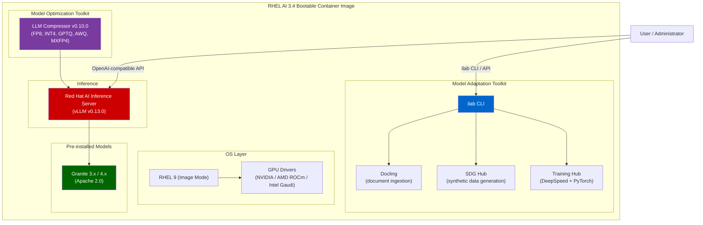

# L1-3.1 — RHEL AI Architecture: Inference and Model Adaptation

**Level:** Foundations
**Duration:** 45 min

## Overview

RHEL AI is Red Hat's inference and model adaptation platform delivered as a bootable container image. Rather than assembling an OS, drivers, frameworks, and a serving stack yourself, RHEL AI ships a single deployable artifact with everything needed to serve and customize LLMs on bare-metal or VM hardware. Its primary use case is running the Red Hat AI Inference Server; its secondary use case is adapting models to your domain with the InstructLab workflow.

This lesson covers RHEL AI 3.4's architecture, bundled components, hardware support, and when to choose RHEL AI versus OpenShift AI.

## Prerequisites

- Familiarity with containers and container images (Docker/Podman)
- Completed: [L1-1.1 — Red Hat AI Vision and Architecture](../../M1_ecosystem/1_vision_and_architecture/) (recommended)
- No RHEL AI instance required — this is a conceptual lesson

## Concepts

### What Is RHEL AI?

RHEL AI is an inference and model adaptation platform that ships as a **bootable container image**. The entire OS — RHEL 9, GPU drivers, the Red Hat AI Inference Server, optimization and adaptation toolkits, and pre-installed Granite models — is a single atomic image you deploy to bare metal or a VM.

The key idea: **manage your AI platform the same way you manage container images.** Version it, test it, roll it back, distribute it through a registry. This is Red Hat's "Image Mode for RHEL" applied to AI workloads.

### Architecture (RHEL AI 3.4)

### Image Mode for RHEL

Traditional RHEL installations are mutable — you SSH in, `yum install` packages, and the system drifts over time. Image Mode for RHEL flips this: the entire OS is an immutable container image built with a Containerfile, stored in a registry, and deployed atomically.

For AI workloads, this means:

- **Reproducibility**: every deployment gets exactly the same drivers, libraries, and frameworks
- **Rollback**: if an upgrade breaks GPU compatibility, roll back to the previous image
- **Distribution**: push the image to a registry, pull it to any server with compatible hardware
- **Testing**: validate the image in a staging environment before deploying to production

### Container Images (3.4)

RHEL AI 3.4 ships two bootable container variants. Note the namespace changed from `rhelai1/` to `rhelai3/` in 3.4:

| Variant | Image |
|---------|-------|
| NVIDIA CUDA | `registry.redhat.io/rhelai3/bootc-cuda-rhel9:3.4.0` |
| AMD ROCm | `registry.redhat.io/rhelai3/bootc-rocm-rhel9:3.4.0` |

The systemd service managing the inference server is named `rhaii` (changed from `rhaiis` in prior releases).

### Red Hat AI Inference Server

The primary component. Based on vLLM v0.13.0, it serves models with an OpenAI-compatible API, PagedAttention for efficient GPU memory use, continuous batching, and support for structured output. You can run it standalone via `systemctl start rhaii` or through the `ilab model serve` command.

### Model Optimization Toolkit

LLM Compressor v0.10.0 provides quantization and sparsity to reduce model memory footprint and improve throughput:

- **Quantization formats**: FP8, INT4, GPTQ, AWQ, MXFP4
- **Sparsity**: structured and unstructured pruning
- **Use case**: compress a 16-bit model to FP8 for 2x memory reduction with minimal quality loss

### Model Adaptation Toolkit (ilab CLI)

The `ilab` command orchestrates the full model adaptation workflow — document ingestion (Docling), synthetic data generation (SDG Hub), and training (Training Hub with DeepSpeed/PyTorch):

| Command | Purpose |
|---------|---------|
| `ilab config init` | Initialize the InstructLab environment |
| `ilab system info` | Display system hardware and configuration |
| `ilab model download` | Download a Granite model |
| `ilab model serve` | Start the inference server |
| `ilab model chat` | Chat interactively with the served model |
| `ilab model upload` | Push models to registries |
| `ilab taxonomy diff` | Validate taxonomy contributions |
| `ilab data generate` | Generate synthetic training data |
| `ilab model train` | Fine-tune the model using the LAB method |
| `ilab model evaluate` | Benchmark the fine-tuned model |
| `ilab process list` | List background processes (Developer Preview) |
| `ilab process attach` | Attach to a background process (Developer Preview) |

The `-dt` flag (Developer Preview) enables detach mode for long-running data generation tasks.

### Hardware Support (3.4)

| Hardware | Status | Notes |
|----------|--------|-------|
| NVIDIA A100 | GA | 40/80 GB |
| NVIDIA H100/H200 | GA | Highest throughput |
| NVIDIA Blackwell (B200/B300/GB200/GB300) | GA | No INT8 in vLLM; use FP8/NVFP4 |
| NVIDIA RTX PRO 4500 Blackwell | GA | |
| AMD MI300X (192GB) | GA | No Model Optimization Toolkit |
| Intel Gaudi 3 (128GB) | Tech Preview | Via vllm-gaudi plugin |
| CPU (Xeon/EPYC) | GA | Small models (<3B), auto-detects AVX2/512 |
| IBM Spyre | Supported | Chunked prefill added in 3.4 |

For inference, GPU requirements depend on model size and quantization level. For fine-tuning with InstructLab, a minimum of one GPU with 40+ GB VRAM is recommended.

### When to Use RHEL AI

**Use RHEL AI when:**

- You have **dedicated GPU servers** and want a turnkey inference platform on bare metal
- You need to **serve models** with an OpenAI-compatible API on a single server
- You need to **adapt models** to your domain using InstructLab on proprietary data
- Your environment is **air-gapped** — the bootable image contains everything needed
- You want a **starting point** before scaling to OpenShift AI
- Your team is small (1-3 data scientists) and doesn't need multi-tenant GPU sharing

**Use OpenShift AI instead when:**

- You need **multi-user access** with RBAC and quotas
- You require **distributed training** across multiple nodes
- You need **MLOps pipelines**, model registry, and governance
- You want **GPU sharing** across teams with scheduling
- You need **auto-scaling** inference endpoints
- You're running **production workloads** at scale

### RHEL AI vs OpenShift AI

| Aspect | RHEL AI | OpenShift AI |
|--------|---------|--------------|
| **Deployment** | Single server, bootable container image | Kubernetes cluster, OpenShift operator |
| **Interface** | `ilab` CLI + OpenAI-compatible API | Web dashboard + `oc` CLI + APIs |
| **Inference** | Red Hat AI Inference Server (vLLM) via `ilab model serve` or systemd | KServe + Red Hat AI Inference Server (auto-scaling, multi-model) |
| **Optimization** | Model Optimization Toolkit (LLM Compressor) | Same toolkit, integrated into serving pipeline |
| **Adaptation** | Model Adaptation Toolkit (`ilab model train`) | Training Hub, Kubeflow Trainer (distributed) |
| **Scale** | Single node, single user | Multi-node, multi-user, multi-team |
| **GPU management** | All GPUs on one machine | Cluster-wide GPU scheduling and sharing |
| **MLOps** | Manual (scripts, CLI) | Pipelines (KFP), Model Registry, monitoring |
| **Model storage** | Local filesystem | S3 / OCI registry |
| **Updates** | Image-based OS upgrades | Operator upgrades via OLM |
| **Best for** | Single-server inference, edge, model adaptation | Platform teams, production serving, governance |

### Architecture Decision Matrix

| Scenario | Recommended Tier | Why |
|----------|-----------------|-----|
| "I want to test if a model works for my use case" | Podman AI Lab | Minutes to start, zero infrastructure |
| "I need to serve a model on a dedicated server" | RHEL AI | Red Hat AI Inference Server, bare metal, single image |
| "I need to adapt a model to my company's data" | RHEL AI | InstructLab workflow, dedicated GPU |
| "I need to serve a model to 100+ users" | OpenShift AI | Auto-scaling, load balancing, multi-replica |
| "I need inference in an air-gapped environment" | RHEL AI | Self-contained bootable image, no external deps |
| "I need GPU sharing across 5 teams" | OpenShift AI | Kubernetes scheduling, quotas, RBAC |
| "I want to train on 8 GPUs across 2 servers" | OpenShift AI | Distributed training with Kubeflow Trainer |
| "I have one server with 4 GPUs and one data scientist" | RHEL AI | Simple, no orchestrator overhead |

## Key Takeaways

- RHEL AI is an **inference and model adaptation platform** delivered as a bootable container image (RHEL 9 + Red Hat AI Inference Server + Model Optimization Toolkit + Model Adaptation Toolkit + Granite models).
- The **Red Hat AI Inference Server** (vLLM v0.13.0) is the primary component, providing OpenAI-compatible model serving out of the box.
- The **Model Optimization Toolkit** (LLM Compressor) handles quantization (FP8, INT4, GPTQ, AWQ, MXFP4) and sparsity to reduce memory and improve throughput.
- The **Model Adaptation Toolkit** (`ilab` CLI) orchestrates Docling, SDG Hub, and Training Hub for taxonomy-based fine-tuning with synthetic data generation.
- **Image Mode for RHEL** means you manage your AI platform like a container image — version, test, roll back, distribute through a registry.
- RHEL AI 3.4 adds **NVIDIA Blackwell GA support**, **Intel Gaudi 3 Tech Preview**, **CPU inference**, and the **`ilab model upload`** command.

## Next Steps

Continue to [L1-3.2 — Serving and Chatting with RHEL AI](../2_serving_and_chatting/) to deploy the Red Hat AI Inference Server and interact with a Granite model.
