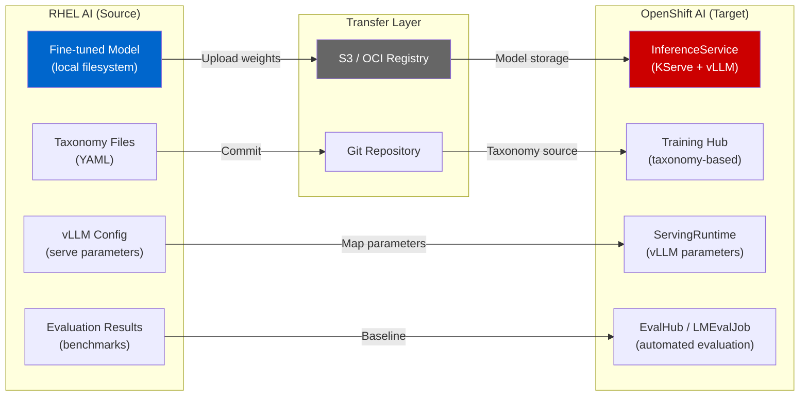

# L1-4.1 — From RHEL AI to OpenShift AI

**Level:** Foundations
**Duration:** 30 min

## Overview

RHEL AI is designed as a natural stepping stone to OpenShift AI. When your single-server setup can no longer keep up — more users need access, you need GPU sharing across teams, or governance and monitoring become requirements — the models, taxonomies, and configurations you built on RHEL AI transfer to OpenShift AI. This lesson maps exactly what transfers, what changes, and previews what OpenShift AI adds beyond RHEL AI's capabilities.

## Prerequisites

- Completed: [L1-3.1 — RHEL AI Architecture](../../M3_rhel_ai/1_architecture_and_concepts/)
- Completed: [L1-3.2 — Serving and Chatting](../../M3_rhel_ai/2_serving_and_chatting/) and [L1-3.3 — Fine-Tuning](../../M3_rhel_ai/3_fine_tuning_with_ilab/)
- No RHEL AI or OpenShift AI instance required — this is a conceptual lesson

## Concepts

### The Scaling Path: When to Move from RHEL AI to OpenShift AI

RHEL AI handles single-server scenarios well, but certain signals indicate it's time to scale to OpenShift AI:

| Signal | What You're Experiencing | What OpenShift AI Provides |
|--------|--------------------------|---------------------------|
| **Capacity exceeded** | GPU utilization at 100%, request queuing, users waiting | Multi-node serving with KServe auto-scaling |
| **Multi-user access** | Multiple data scientists sharing one server via SSH, stepping on each other | Jupyter notebooks per user, RBAC, resource quotas |
| **Governance needed** | No audit trail of model versions, no approval process for deployments | Model Registry, pipeline approvals, deployment history |
| **GPU sharing** | Teams contend for one server, manual scheduling | Kubernetes GPU scheduling, time-slicing, MIG |
| **High availability** | If the server goes down, all inference stops | Multi-replica InferenceService, health checks, auto-restart |
| **Multiple models** | Managing several fine-tuned models on one machine becomes unwieldy | KServe multi-model serving, per-model scaling |

Not every team needs to scale. If one data scientist fine-tunes models on a dedicated GPU server and serves them to a small internal team, RHEL AI may be the right long-term choice.

### Migration Workflow

The following diagram shows the path from RHEL AI to OpenShift AI:



### What Transfers from RHEL AI to OpenShift AI

These artifacts move directly, with minimal or no modification:

#### Models (RHEL AI filesystem to S3/OCI to KServe)

Your fine-tuned model weights are portable. The same PyTorch checkpoint that vLLM loads on RHEL AI can be loaded by vLLM on OpenShift AI.

| On RHEL AI | Transfer Method | On OpenShift AI |
|------------|----------------|-----------------|
| `~/.local/share/instructlab/phased/phase2/model/` | Upload to S3 bucket | `InferenceService` with `storageUri: s3://...` |
| Model checkpoint directory | Package as OCI image | `ServingRuntime` referencing the OCI image |
| Quantized model (FP8/INT8) | Same upload methods | Same quantized model, same vLLM flags |

The model format is identical — vLLM on both platforms reads the same safetensors/PyTorch checkpoint files.

#### Taxonomy Files (local directory to Git to Training Hub)

InstructLab taxonomy files are YAML. They work the same way on RHEL AI (via `ilab` CLI) and on OpenShift AI (via Training Hub).

| On RHEL AI | Transfer Method | On OpenShift AI |
|------------|----------------|-----------------|
| `~/.local/share/instructlab/taxonomy/` | Commit to Git repository | Training Hub reads from the same Git repo |
| `qna.yaml` files (knowledge/skills) | No format changes needed | Same YAML format, same taxonomy structure |

#### vLLM Configuration (ilab config to ServingRuntime)

The vLLM parameters you tuned on RHEL AI — tensor parallelism, max model length, quantization settings — map to ServingRuntime arguments on OpenShift AI.

| RHEL AI (`ilab model serve` flag) | OpenShift AI (ServingRuntime arg) |
|-----------------------------------|----------------------------------|
| `--model-path` | `storageUri` in InferenceService |
| `--tensor-parallel-size 2` | `--tensor-parallel-size 2` in container args |
| `--max-model-len 4096` | `--max-model-len 4096` in container args |
| `--quantization fp8` | `--quantization fp8` in container args |
| `--gpu-memory-utilization 0.9` | `--gpu-memory-utilization 0.9` in container args |

The vLLM flags are the same because OpenShift AI uses the same vLLM server — it's just managed by KServe instead of `ilab`.

### What Changes from RHEL AI to OpenShift AI

These aspects of the workflow change fundamentally when you move to the platform:

#### CLI to Dashboard and API

| Aspect | RHEL AI | OpenShift AI |
|--------|---------|--------------|
| **Interface** | `ilab` CLI over SSH | Web dashboard + `oc` CLI + REST APIs |
| **User management** | Linux users on the server | OpenShift RBAC, OAuth, LDAP integration |
| **Resource allocation** | All GPUs available to `ilab` | Kubernetes resource requests/limits, GPU scheduling |
| **Log access** | `journalctl`, terminal output | OpenShift logging, Kibana/Loki, pod logs |

#### Single Instance to Managed Service

| Aspect | RHEL AI | OpenShift AI |
|--------|---------|--------------|
| **Serving** | One vLLM process, one model | KServe InferenceService: auto-scaling, canary, A/B |
| **Scaling** | Vertical only (bigger GPU) | Horizontal (more replicas) + vertical (bigger GPUs) |
| **Load balancing** | None — single endpoint | OpenShift Routes, ingress-based load balancing |
| **Health monitoring** | Manual (`curl /health`) | Kubernetes liveness/readiness probes, auto-restart |
| **TLS** | Manual certificate configuration | OpenShift Routes with automatic TLS |

#### Local Storage to Object Storage

| Aspect | RHEL AI | OpenShift AI |
|--------|---------|--------------|
| **Model storage** | Local filesystem (`~/.local/share/instructlab/models/`) | S3-compatible storage or OCI registry |
| **Training data** | Local filesystem (`~/.local/share/instructlab/datasets/`) | S3 or PVC-backed storage |
| **Checkpoints** | Local filesystem | S3 with versioning, or PVC snapshots |
| **Backup** | Manual (`tar`, `rsync`) | S3 versioning, Velero backup |

#### Manual Evaluation to Automated Evaluation

| Aspect | RHEL AI | OpenShift AI |
|--------|---------|--------------|
| **Evaluation** | `ilab model evaluate` (manual, CLI) | LMEvalJob CRD (automated, scheduled) |
| **Benchmarks** | Built-in InstructLab benchmarks | LM Evaluation Harness + custom evaluations |
| **Comparison** | Terminal output, manual tracking | EvalHub dashboard, historical tracking |
| **CI/CD integration** | Scripts calling `ilab` | Tekton pipelines triggering LMEvalJob |

### Hybrid Patterns

Not every workload needs to move entirely to OpenShift AI. Several hybrid patterns are common in production:

#### Pattern 1: Fine-Tune on RHEL AI, Serve on OpenShift AI

```
RHEL AI (GPU server)              OpenShift AI (cluster)
┌─────────────────────┐           ┌──────────────────────────┐
│ ilab data generate  │           │ InferenceService         │
│ ilab model train    │──S3──────>│   vLLM + fine-tuned model│
│ ilab model evaluate │           │   auto-scaling replicas  │
└─────────────────────┘           │   OpenShift Route (TLS)  │
                                  └──────────────────────────┘
```

**When to use**: Your data scientist has a dedicated GPU server for fine-tuning, but the model needs to serve production traffic with auto-scaling and high availability.

#### Pattern 2: Develop on RHEL AI, Production on OpenShift AI

```
RHEL AI (dev)                     OpenShift AI (prod)
┌─────────────────────┐           ┌──────────────────────────┐
│ Experiment with      │           │ Model Registry           │
│ taxonomies           │──Git────>│   versioned models       │
│ Iterate quickly      │──S3─────>│   approved deployments   │
│ Test locally         │           │   canary rollouts        │
└─────────────────────┘           └──────────────────────────┘
```

**When to use**: Fast iteration on RHEL AI (no Kubernetes overhead, direct GPU access), with a governed production deployment pipeline on OpenShift AI.

#### Pattern 3: RHEL AI Nodes Feeding an OpenShift AI Cluster

```
┌──────────────┐    ┌──────────────┐
│ RHEL AI      │    │ RHEL AI      │
│ (fine-tuning │    │ (fine-tuning │
│  server 1)   │    │  server 2)   │
└──────┬───────┘    └──────┬───────┘
       │   S3 / OCI        │
       └────────┬──────────┘
                │
       ┌────────▼────────┐
       │  OpenShift AI    │
       │  ┌────────────┐  │
       │  │Model       │  │
       │  │Registry    │  │
       │  └─────┬──────┘  │
       │  ┌─────▼──────┐  │
       │  │KServe      │  │
       │  │(serving)   │  │
       │  └────────────┘  │
       └──────────────────┘
```

**When to use**: Multiple teams fine-tune on their own RHEL AI servers, but all models are served centrally through OpenShift AI with shared governance, monitoring, and scaling.

### Planning the Migration

When you're ready to move from RHEL AI to OpenShift AI, follow this checklist:

**1. Prepare the model**
- [ ] Export the fine-tuned model weights from RHEL AI
- [ ] Upload to S3 or package as OCI image
- [ ] Verify the model loads correctly on vLLM with the same parameters

**2. Prepare the serving configuration**
- [ ] Map `ilab model serve` flags to ServingRuntime arguments
- [ ] Configure GPU resource requests (match what worked on RHEL AI)
- [ ] Set up the InferenceService with appropriate scaling limits

**3. Prepare the taxonomy (if continuing fine-tuning)**
- [ ] Commit taxonomy files to a Git repository
- [ ] Configure Training Hub to read from the taxonomy repo
- [ ] Verify `ilab taxonomy diff` passes on the taxonomy files

**4. Validate**
- [ ] Run the same evaluation benchmarks on OpenShift AI as you ran on RHEL AI
- [ ] Compare inference latency and throughput between the two platforms
- [ ] Test the API endpoint with the same prompts used during RHEL AI development

**5. Cutover**
- [ ] Route production traffic to the OpenShift AI InferenceService
- [ ] Monitor for regression in response quality or latency
- [ ] Keep the RHEL AI instance available for rollback during the transition

### What OpenShift AI Adds (Preview)

Beyond the scaling capabilities above, OpenShift AI 3.x introduces features that have no equivalent on RHEL AI. These are covered in depth in the [OpenShift AI tutorial](../../../../openshift_ai/):

| Feature | What It Does | OpenShift AI Tutorial Coverage |
|---------|-------------|-------------------------------|
| **AI Hub** | Centralized catalog for models, notebooks, and pipelines | L1-M1 |
| **Gen AI Studio** | Visual playground for prompt engineering and model comparison | L1-M2 |
| **Model-as-a-Service (MaaS)** | Managed inference endpoints with API key management | L2-M4 |
| **Agentic AI / MCP** | Agent orchestration with Model Context Protocol | L2-M2, L2-M3 |
| **llm-d** | Distributed inference gateway for multi-node GPU pools | L2-M4 |
| **Governance** | RBAC, Authorino auth, model registry with approval workflows | L3-M1 |
| **Observability** | MLflow tracking, OpenTelemetry, TrustyAI dashboards | L2-M5 |

These features represent the platform-level capabilities that require Kubernetes orchestration. The `redhat_ai` tutorial (this track) teaches everything *below* the OpenShift AI platform; the `openshift_ai` tutorial teaches the platform itself.

## Key Takeaways

- The **RHEL AI to OpenShift AI progression is designed to be smooth** — models, taxonomies, and Red Hat AI Inference Server configurations transfer with minimal modification because both platforms use the same underlying components.
- **Models are fully portable**: the same PyTorch checkpoint served by vLLM on RHEL AI is served by the same vLLM on OpenShift AI, just managed by KServe.
- **What changes is the management layer**, not the AI components: `ilab` CLI becomes a web dashboard, local filesystem becomes S3, manual evaluation becomes LMEvalJob, and single-instance serving becomes auto-scaling KServe.
- **Hybrid patterns are common and supported**: fine-tune on RHEL AI (dedicated GPU, fast iteration) and serve on OpenShift AI (auto-scaling, governance) is a valid production architecture.
- **OpenShift AI adds platform-level features** (AI Hub, Gen AI Studio, MaaS, agents, governance, observability) that have no equivalent on a single server — these are covered in the dedicated OpenShift AI tutorial.
- **Not every workload needs to migrate**: if a single server with one data scientist meets your needs, RHEL AI is a complete platform on its own.

## Next Steps

Continue to [L1-4.2 — Validated Patterns for AI](../2_validated_patterns_for_ai/) to learn about Red Hat's GitOps-ready reference architectures for production AI deployments — pre-built, tested patterns that accelerate the path from prototype to production.
