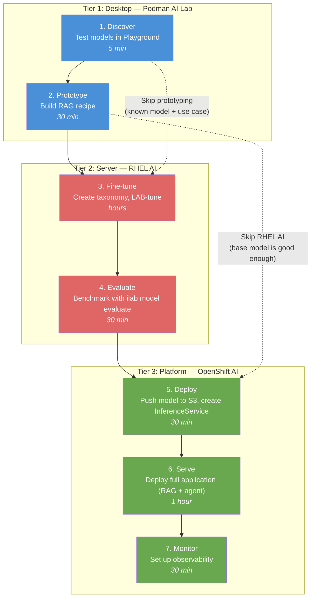
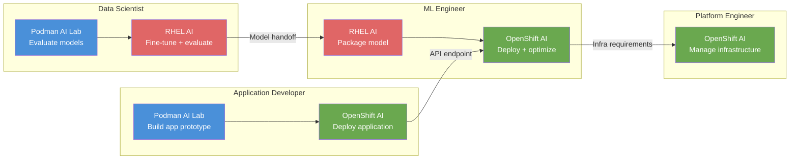

# L2-3.1 — End-to-End: Podman AI Lab → RHEL AI → OpenShift AI

**Level:** Practitioner
**Duration:** 1 hour

## Overview

This lesson walks through the complete Red Hat AI workflow from desktop experimentation to enterprise deployment, crossing all three tiers of the stack. You will trace a single AI use case -- a domain-specific RAG application -- through model discovery in Podman AI Lab, fine-tuning on RHEL AI, and production deployment on OpenShift AI. By the end you will understand how each tier connects, when to skip tiers, and which workflow fits each team role.

## Prerequisites

- Completed: L1-M1 (Ecosystem), L1-M2 (Podman AI Lab), L1-M3 (RHEL AI)
- Completed: L2-M1 (Advanced Podman AI Lab), L2-M2 (Model Customization)
- Familiarity with all three tiers (conceptual understanding is sufficient -- hands-on access to all three is ideal but not required for this walkthrough)
- For hands-on steps: Podman Desktop with AI Lab installed, access to a RHEL AI instance (or conceptual understanding), access to an OpenShift AI cluster (or conceptual understanding)

## Concepts

### The Cross-Tier Promise

Each tier in the Red Hat AI stack was designed to hand off to the next. Models, configurations, and application code move between tiers because the stack shares common formats and APIs:

- **Model formats** -- GGUF for Podman AI Lab, safetensors/native for RHEL AI and OpenShift AI. Conversion tools bridge the gap.
- **Inference API** -- OpenAI-compatible everywhere. The same `POST /v1/chat/completions` request works against Podman AI Lab's llama.cpp, RHEL AI's Red Hat AI Inference Server, and OpenShift AI's KServe-managed inference.
- **Taxonomy format** -- The same InstructLab taxonomy YAML files work on RHEL AI (via `ilab` CLI) and OpenShift AI's Training Hub.
- **Model customization libraries** -- Docling, SDG Hub, and Training Hub run on both RHEL AI and OpenShift AI.

The cross-tier workflow is not just a theoretical architecture diagram -- it is the practical path that organizations follow as their AI adoption matures.

### Seven Steps, Three Tiers

The full end-to-end workflow consists of seven steps that span the three tiers. Not every project needs all seven steps, but understanding the complete pipeline helps you decide which steps to include and which to skip.



---

## Step-by-Step Walkthrough

### Step 1: Discover -- Test Models in Podman AI Lab Playground (5 min)

**Tier:** Desktop (Podman AI Lab)
**Goal:** Quickly evaluate whether a base model can handle your use case before investing in infrastructure.

The first step is always exploration. Open Podman AI Lab's Playground and test candidate models against your actual use case.

**Scenario:** Your team is building a customer support assistant for an internal IT helpdesk. The assistant needs to answer questions about your company's infrastructure, troubleshooting procedures, and ticket workflows.

1. Open the Podman AI Lab Playground.
2. Select `granite-3.1-8b-instruct` (or the latest Granite instruct model).
3. Set the system prompt:

```
You are an IT helpdesk assistant. Answer questions about infrastructure,
troubleshooting, and ticket workflows concisely and accurately.
```

4. Test with domain-specific questions:

```
How do I reset a user's VPN credentials?
What is the escalation path for a P1 incident?
Explain our backup rotation schedule.
```

**What you learn:** The base model handles general IT questions well but knows nothing about _your_ company's specific procedures, tools, or policies. This gap is what fine-tuning (Step 3) or RAG (Step 2) will address.

**Decision point:** If the base model answers your questions well enough (e.g., general coding assistance, summarization), you may skip Steps 3-4 entirely and go straight to deployment.

---

### Step 2: Prototype -- Build a RAG Recipe in Podman AI Lab (30 min)

**Tier:** Desktop (Podman AI Lab)
**Goal:** Build a working RAG application that augments the base model with your domain documents.

Rather than fine-tuning immediately, start with RAG -- it is faster to set up and does not require GPU infrastructure. RAG augments the base model's knowledge by retrieving relevant documents at query time.

1. Navigate to the **Recipes** section in Podman AI Lab.
2. Select the **RAG Chatbot** recipe.
3. Choose the Granite model you tested in Step 1.
4. Add your domain documents:
   - IT runbooks (Markdown or text)
   - Troubleshooting guides
   - Infrastructure documentation

5. Start the recipe.

The RAG recipe launches a containerized stack with:
- A model inference server (llama.cpp)
- A vector database for document embeddings
- A retrieval pipeline that finds relevant documents for each query
- A web UI for interactive testing

6. Test the same questions from Step 1:

```
How do I reset a user's VPN credentials?
```

**What you learn:** With your documents loaded, the RAG application can now answer company-specific questions by retrieving relevant documentation. Evaluate whether RAG alone is sufficient, or whether the model needs fine-tuning to better understand your domain vocabulary and reasoning patterns.

**Decision point:**
- If RAG provides good enough answers, skip Steps 3-4 and proceed to Step 5 (deploy the RAG application on OpenShift AI).
- If the model struggles with domain-specific reasoning, terminology, or style, proceed to Step 3 (fine-tune on RHEL AI).

**Artifacts to carry forward:**
- The application code from the recipe (Python + LangChain)
- The document collection and embedding configuration
- The system prompt that worked best in testing

---

### Step 3: Fine-tune -- Create Taxonomy, Fine-tune on RHEL AI (hours)

**Tier:** Server (RHEL AI)
**Goal:** Customize the base model with domain-specific knowledge and skills using InstructLab.

If RAG alone was not sufficient, fine-tuning injects domain knowledge directly into the model's weights. RHEL AI provides InstructLab for taxonomy-based fine-tuning with synthetic data generation.

1. On the RHEL AI server, initialize InstructLab (if not already configured):

```bash
ilab config init
ilab model download --repository instructlab/granite-7b-lab
```

2. Create a taxonomy for your domain knowledge. Structure it under the `knowledge` tree:

```yaml
# taxonomy/knowledge/it_helpdesk/vpn/qna.yaml
created_by: it-team
version: 3
domain: it_helpdesk
seed_examples:
  - context: |
      VPN credential reset procedure: Navigate to the IAM portal at
      https://iam.internal.example.com, select the user, click
      "Reset VPN", and generate new credentials. Email the temporary
      password to the user via the secure channel.
    questions_and_answers:
      - question: How do I reset a user's VPN credentials?
        answer: |
          Go to the IAM portal at https://iam.internal.example.com,
          select the user account, click "Reset VPN", and generate
          new credentials. Send the temporary password through the
          secure email channel.
      - question: Where do I reset VPN access for an employee?
        answer: |
          Use the IAM portal at https://iam.internal.example.com.
          Find the employee, select "Reset VPN", and issue new credentials.
      - question: What is the process for VPN credential rotation?
        answer: |
          VPN credentials are reset through the IAM portal. Select the
          user, click "Reset VPN", generate new credentials, and deliver
          them via the secure channel.
document:
  repo: https://github.com/your-org/it-runbooks
  commit: abc123
  patterns:
    - vpn_procedures.md
```

3. Validate the taxonomy:

```bash
ilab taxonomy diff
```

4. Generate synthetic training data:

```bash
ilab data generate --num-instructions 100
```

5. Train the model:

```bash
ilab model train
```

This runs multi-phase training (knowledge tuning, skills tuning, alignment). Training time depends on GPU hardware -- expect 1-4 hours on an A100.

**Artifacts to carry forward:**
- The fine-tuned model checkpoint (safetensors format)
- The taxonomy files (for future retraining)
- Training logs and configuration

---

### Step 4: Evaluate -- Benchmark on RHEL AI (30 min)

**Tier:** Server (RHEL AI)
**Goal:** Verify that fine-tuning improved performance without degrading general capabilities.

Before deploying the fine-tuned model, evaluate it against both domain-specific benchmarks and general-purpose benchmarks.

1. Serve the fine-tuned model:

```bash
ilab model serve --model-path ./models/my-finetuned-model
```

2. Run evaluation benchmarks:

```bash
ilab model evaluate \
  --model ./models/my-finetuned-model \
  --benchmark mmlu
```

3. Test domain-specific questions interactively:

```bash
ilab model chat --model ./models/my-finetuned-model
```

Ask the same questions from Step 1 and compare the responses to the base model. The fine-tuned model should:
- Answer domain-specific questions more accurately
- Use your organization's terminology correctly
- Maintain general conversational ability (no catastrophic forgetting)

4. If the results are unsatisfactory, iterate:
   - Revise the taxonomy (add more examples, fix incorrect answers)
   - Re-generate synthetic data
   - Retrain

**Decision point:** When evaluation results are satisfactory, prepare the model for deployment on OpenShift AI.

---

### Step 5: Deploy -- Push Model to S3, Create InferenceService on OpenShift AI (30 min)

**Tier:** Platform (OpenShift AI)
**Goal:** Make the fine-tuned model available as a production-grade inference endpoint.

Transfer the fine-tuned model from RHEL AI to OpenShift AI's model serving infrastructure.

1. Export the model from RHEL AI to S3-compatible storage:

```bash
# Package the model
tar czf my-finetuned-model.tar.gz -C ./models/my-finetuned-model .

# Upload to S3 (MinIO, AWS S3, or any S3-compatible storage)
aws s3 cp my-finetuned-model.tar.gz \
  s3://models/my-finetuned-model/ \
  --endpoint-url https://minio.example.com
```

Alternatively, package as an OCI image:

```bash
# Build an OCI model image
podman build -t quay.io/your-org/my-finetuned-model:v1 \
  -f Containerfile.model .
podman push quay.io/your-org/my-finetuned-model:v1
```

2. On OpenShift AI, create an InferenceService that points to the model:

```yaml
# inference-service.yaml
apiVersion: serving.kserve.io/v1beta1
kind: InferenceService
metadata:
  name: helpdesk-assistant
  namespace: ai-models
  annotations:
    serving.kserve.io/deploymentMode: RawDeployment
spec:
  predictor:
    model:
      modelFormat:
        name: vLLM
      runtime: vllm-runtime
      storageUri: s3://models/my-finetuned-model/
      resources:
        requests:
          nvidia.com/gpu: 1
        limits:
          nvidia.com/gpu: 1
```

```bash
oc apply -f inference-service.yaml
```

3. Verify the model is serving:

```bash
# Check InferenceService status
oc get inferenceservice helpdesk-assistant -n ai-models

# Test the endpoint
curl -k https://helpdesk-assistant-ai-models.apps.cluster.example.com/v1/chat/completions \
  -H "Content-Type: application/json" \
  -d '{
    "model": "helpdesk-assistant",
    "messages": [{"role": "user", "content": "How do I reset VPN credentials?"}]
  }'
```

The same OpenAI-compatible API format you used in Podman AI Lab now works against a production-grade, autoscaled endpoint.

---

### Step 6: Serve -- Deploy the Full Application on OpenShift AI (1 hour)

**Tier:** Platform (OpenShift AI)
**Goal:** Deploy the complete application stack (RAG pipeline, agent logic, UI) alongside the model.

The model alone is not an application. Deploy the RAG application you prototyped in Step 2, now pointing at the production inference endpoint.

1. Containerize the application code from the Podman AI Lab recipe:

```bash
# Use UBI as base (SCC-compatible on OpenShift)
podman build -t quay.io/your-org/helpdesk-app:v1 \
  -f Containerfile .
podman push quay.io/your-org/helpdesk-app:v1
```

2. Deploy the application stack on OpenShift:

```yaml
# deployment.yaml
apiVersion: apps/v1
kind: Deployment
metadata:
  name: helpdesk-app
  namespace: ai-apps
  labels:
    app: helpdesk-app
spec:
  replicas: 2
  selector:
    matchLabels:
      app: helpdesk-app
  template:
    metadata:
      labels:
        app: helpdesk-app
    spec:
      containers:
        - name: helpdesk-app
          image: quay.io/your-org/helpdesk-app:v1
          ports:
            - containerPort: 8080
          env:
            - name: MODEL_ENDPOINT
              value: "http://helpdesk-assistant.ai-models.svc.cluster.local/v1"
            - name: VECTOR_DB_URL
              value: "http://vectordb.ai-apps.svc.cluster.local:6333"
```

3. Deploy a vector database for RAG:

```yaml
# vectordb-deployment.yaml
apiVersion: apps/v1
kind: Deployment
metadata:
  name: vectordb
  namespace: ai-apps
  labels:
    app: vectordb
spec:
  replicas: 1
  selector:
    matchLabels:
      app: vectordb
  template:
    metadata:
      labels:
        app: vectordb
    spec:
      containers:
        - name: qdrant
          image: qdrant/qdrant:latest
          ports:
            - containerPort: 6333
```

4. Expose the application via a Route:

```yaml
# route.yaml
apiVersion: route.openshift.io/v1
kind: Route
metadata:
  name: helpdesk-app
  namespace: ai-apps
spec:
  to:
    kind: Service
    name: helpdesk-app
  port:
    targetPort: 8080
  tls:
    termination: edge
```

```bash
oc apply -f deployment.yaml -f vectordb-deployment.yaml -f route.yaml
```

---

### Step 7: Monitor -- Set Up Observability on OpenShift AI (30 min)

**Tier:** Platform (OpenShift AI)
**Goal:** Ensure the production deployment is healthy, performant, and observable.

1. Verify model serving metrics. vLLM exposes Prometheus metrics natively:

```bash
# Key metrics to monitor
# vllm:num_requests_running    — active requests
# vllm:num_requests_waiting    — queued requests
# vllm:avg_generation_throughput_toks_per_s — tokens per second
# vllm:gpu_cache_usage_perc    — GPU KV cache utilization
```

2. Set up a ServiceMonitor to scrape vLLM metrics:

```yaml
# servicemonitor.yaml
apiVersion: monitoring.coreos.com/v1
kind: ServiceMonitor
metadata:
  name: helpdesk-model-monitor
  namespace: ai-models
spec:
  selector:
    matchLabels:
      app: helpdesk-assistant
  endpoints:
    - port: metrics
      interval: 30s
```

3. Create alerts for key thresholds:

```yaml
# prometheusrule.yaml
apiVersion: monitoring.coreos.com/v1
kind: PrometheusRule
metadata:
  name: helpdesk-model-alerts
  namespace: ai-models
spec:
  groups:
    - name: model-serving
      rules:
        - alert: HighRequestQueueDepth
          expr: vllm:num_requests_waiting > 10
          for: 5m
          labels:
            severity: warning
          annotations:
            summary: "Model serving queue depth is high"
        - alert: LowThroughput
          expr: vllm:avg_generation_throughput_toks_per_s < 50
          for: 10m
          labels:
            severity: warning
          annotations:
            summary: "Model inference throughput has dropped"
```

4. Verify observability in the OpenShift console:
   - Navigate to **Observe > Metrics** and query `vllm:num_requests_running`
   - Check **Observe > Alerting** for the rules you created
   - View application logs under **Workloads > Pods > helpdesk-assistant > Logs**

---

## Automation: Scripting the Cross-Tier Workflow

In production, the cross-tier workflow should be automated. Here are the key integration points.

### Model Export Script (RHEL AI → S3)

```bash
#!/bin/bash
# export-model.sh — run on the RHEL AI server after training
MODEL_PATH="./models/my-finetuned-model"
S3_BUCKET="s3://models"
MODEL_NAME="helpdesk-assistant"
VERSION=$(date +%Y%m%d-%H%M%S)

echo "Packaging model ${MODEL_NAME}:${VERSION}..."
tar czf /tmp/${MODEL_NAME}-${VERSION}.tar.gz -C ${MODEL_PATH} .

echo "Uploading to S3..."
aws s3 cp /tmp/${MODEL_NAME}-${VERSION}.tar.gz \
  ${S3_BUCKET}/${MODEL_NAME}/${VERSION}/ \
  --endpoint-url ${S3_ENDPOINT}

echo "Model uploaded: ${S3_BUCKET}/${MODEL_NAME}/${VERSION}/"
rm /tmp/${MODEL_NAME}-${VERSION}.tar.gz
```

### CI/CD Pipeline: Training → Deployment

A Tekton pipeline (or GitHub Actions / GitLab CI) can automate the RHEL AI training to OpenShift AI deployment flow:

```
1. Trigger: taxonomy change merged to main
2. RHEL AI task: ilab data generate → ilab model train → ilab model evaluate
3. Gate: evaluation score ≥ threshold
4. Upload: push model to S3
5. OpenShift AI task: update InferenceService storageUri to new version
6. Verify: health check on the new endpoint
7. Notify: send results to team channel
```

This pipeline turns model improvement into a continuous process -- update the taxonomy, merge, and the model trains and deploys automatically.

---

## When to Skip Tiers

Not every project needs all three tiers. Here is guidance on when to shortcut the workflow.

### Skip Podman AI Lab

**When:** You already know which model works for your use case.

**Example:** Your team has standardized on Granite 8B and has established prompt templates. Skip discovery and prototyping -- go straight to fine-tuning on RHEL AI or deployment on OpenShift AI.

### Skip RHEL AI

**When:** You have GPU nodes on OpenShift AI for fine-tuning, or the base model is good enough without fine-tuning.

**Example 1:** Your OpenShift AI cluster has dedicated GPU nodes and the Training Hub is configured. Fine-tune directly on the cluster instead of maintaining a separate RHEL AI server.

**Example 2:** Your use case works well with RAG on a base model. Skip fine-tuning entirely -- go from Podman AI Lab prototyping straight to OpenShift AI deployment.

### Use All Three Tiers

**When:** Full evaluation, fine-tuning on dedicated hardware, then enterprise deployment.

**Example:** A regulated financial services company evaluates models locally (Podman AI Lab), fine-tunes on air-gapped GPU servers (RHEL AI) with proprietary data that cannot leave the data center, then deploys to a secured OpenShift AI cluster for production serving.

---

## Role-Based Workflows

Red Hat recommends different workflow paths depending on team role. Each role focuses on the tiers that match their responsibilities.

| Role | Primary Tiers | Workflow | Key Activities |
|------|--------------|----------|----------------|
| **Data Scientist** | Podman AI Lab + RHEL AI | Experiment → Fine-tune | Model evaluation, taxonomy creation, SDG review, training iteration, evaluation benchmarks |
| **ML Engineer** | RHEL AI + OpenShift AI | Fine-tune → Deploy | Model packaging, InferenceService configuration, serving runtime optimization, performance tuning |
| **Platform Engineer** | OpenShift AI | Operate | GPU node management, model serving infrastructure, monitoring, autoscaling policies, RBAC, networking |
| **Application Developer** | Podman AI Lab + OpenShift AI | Prototype → Integrate | RAG pipeline development, API integration, application containerization, frontend development |
| **DevOps / MLOps** | All three | Automate | CI/CD pipelines, model promotion, automated evaluation gates, infrastructure as code |



---

## Workflow Summary

The following table maps each step to its tier, tooling, inputs, and outputs:

| Step | Tier | Tool | Input | Output | Time |
|------|------|------|-------|--------|------|
| 1. Discover | Desktop | Podman AI Lab Playground | Use case questions | Model shortlist, initial prompts | 5 min |
| 2. Prototype | Desktop | Podman AI Lab Recipes | Documents, model choice | Working RAG app, system prompt | 30 min |
| 3. Fine-tune | Server | InstructLab on RHEL AI | Taxonomy YAML, base model | Fine-tuned model checkpoint | Hours |
| 4. Evaluate | Server | `ilab model evaluate` | Fine-tuned model, benchmarks | Evaluation scores, comparison | 30 min |
| 5. Deploy | Platform | OpenShift AI (KServe) | Model in S3/OCI, ServingRuntime | InferenceService endpoint | 30 min |
| 6. Serve | Platform | OpenShift (Deployments, Routes) | Application code, model endpoint | Production application | 1 hour |
| 7. Monitor | Platform | OpenShift monitoring stack | ServiceMonitor, PrometheusRules | Dashboards, alerts | 30 min |

## Key Takeaways

- The Red Hat AI stack is designed for **cross-tier handoff**: model formats, APIs, and configurations move between Podman AI Lab, RHEL AI, and OpenShift AI with minimal friction. The OpenAI-compatible API is the common thread.
- The **full seven-step workflow** covers discovery, prototyping, fine-tuning, evaluation, deployment, serving, and monitoring -- but not every project needs every step. Start with the simplest path that solves your problem.
- **Automation is essential for production**: scripts for model export, CI/CD pipelines for training-to-deployment, and monitoring for ongoing health. Treat model updates like software releases.
- **Role-based workflows** let teams specialize: data scientists focus on models and fine-tuning, ML engineers on deployment and optimization, platform engineers on infrastructure, and application developers on the end-user experience.
- **Skipping tiers is valid** and often recommended. The goal is not to use all three tiers -- it is to use the right tiers for your use case and organizational maturity.

## Next Steps

Continue to [L2-3.2 — Granite Models in Practice](../2_granite_models_in_practice/) to learn how to choose the right Granite model for your task, understand quantization trade-offs, and compare Granite with community models across the Red Hat AI stack.
