# L1-M1.1 -- OpenShift AI Architecture Overview

**Level:** Foundations
**Duration:** 30 min

## Overview

OpenShift AI is Red Hat's managed MLOps, GenAIOps, and AgentOps platform built on top of OpenShift. It packages dozens of open-source ML tools (KServe, Kubeflow Pipelines, Ray, MLflow, and more) behind a single operator and a unified dashboard. If you have deployed Kubeflow or MLflow on vanilla Kubernetes, you already understand the individual pieces -- OpenShift AI wires them together and manages their lifecycle through the Operator pattern you already know.

## Prerequisites

- Familiarity with Kubernetes operators, CRDs, and namespaces
- Basic understanding of ML workflows (training, serving, experiment tracking)
- No cluster required -- this is a conceptual lesson

## K8s Context

On vanilla Kubernetes, building an ML platform means installing and maintaining a constellation of tools independently: KServe for model serving, Kubeflow Pipelines for orchestration, MLflow for experiment tracking, KubeRay for distributed compute, Kueue for GPU scheduling, and so on. Each tool has its own Helm chart, its own upgrade cycle, and its own set of CRDs. You end up managing dozens of Helm releases and hoping they stay compatible with each other.

OpenShift AI replaces that patchwork with a single operator that installs, configures, and upgrades all of these components through one Custom Resource: the `DataScienceCluster`.

## Concepts

### What Is OpenShift AI?

OpenShift AI is a managed platform for the full AI/ML lifecycle:

- **MLOps** -- experiment tracking, pipelines, model registry, feature store
- **GenAIOps** -- model serving (including LLM inference with vLLM), evaluation, guardrails, RAG
- **AgentOps** -- agent orchestration via Llama Stack / OGX integration

It runs on any OpenShift 4.x cluster (bare metal, cloud, or edge) and is delivered as an operator through OperatorHub.

### Three-Tier Component Architecture

OpenShift AI organizes its components into three tiers, from infrastructure-level operators down to user-space Python libraries.

```mermaid
graph TB
    subgraph "Tier 3: Python Libraries (in workbenches/pods)"
        L1[NeMo Guardrails]
        L2[LangChain / LlamaIndex]
        L3[MLflow SDK]
        L4[AutoRAG standalone]
        L5[KFP SDK]
        L6[Ray SDK]
    end

    subgraph "Tier 2: Dashboard Features (built on Tier 1)"
        F1[AutoRAG - TP]
        F2[AutoML - TP]
        F3[GenAI Playground]
    end

    subgraph "Tier 1: DSC Operator Components (14 components)"
        C1[dashboard]
        C2[workbenches]
        C3[kserve]
        C4[modelregistry]
        C5[mlflowoperator]
        C6[trustyai]
        C7[aipipelines]
        C8[ray]
        C9[feastoperator]
        C10[kueue]
        C11[trainer]
        C12[trainingoperator]
        C13[sparkoperator]
        C14[llamastackoperator]
    end

    subgraph "Foundation"
        OP[RHODS Operator]
        DSC[DataScienceCluster CR - API v2]
        DSCI[DSCInitialization CR]
    end

    DSC --> C1 & C2 & C3 & C4 & C5 & C6 & C7 & C8 & C9 & C10 & C11 & C12 & C13 & C14
    OP --> DSC
    OP --> DSCI

    F1 --> C1 & C7 & C3 & C14
    F2 --> C1 & C7 & C2 & C4
    F3 --> C1 & C3

    L3 --> C5
    L5 --> C7
    L6 --> C8
```



#### Tier 1: DSC Operator Components

The `DataScienceCluster` CR exposes 14 components, each with a `managementState` field that can be set to `Managed` (operator installs and maintains it) or `Removed` (operator does not install it, or removes it if already present).

| DSC Field | What It Deploys | Key Sub-Releases (3.4.2) |
|-----------|----------------|--------------------------|
| `dashboard` | OpenShift AI web UI | -- |
| `workbenches` | Jupyter / VS Code notebooks | Kubeflow Notebook Controller v1.10.0 |
| `kserve` | Model serving (single and multi-model) | KServe v0.17.0, vLLM v0.18.0, llm-d scheduler v0.7.1 |
| `modelregistry` | Model Registry for versioned model artifacts | Kubeflow Model Registry |
| `mlflowoperator` | MLflow experiment tracking | MLflow v3.10.1 |
| `trustyai` | Evaluation, safety, and guardrails | TrustyAI operator v1.37.0, LMEval (lm-eval-harness v0.4.8), EvalHub, Guardrails Orchestrator v0.9.4, builtin detectors |
| `aipipelines` | Data Science Pipelines for workflow orchestration | Kubeflow Pipelines v2.16.0 + Argo Workflows |
| `ray` | Distributed compute for training and tuning | KubeRay v1.4.2 |
| `feastoperator` | Feature store for ML feature management | Feast v0.62.0 |
| `kueue` | GPU and resource job scheduling | -- |
| `trainer` | Training Hub for fine-tuning jobs | Requires JobSet operator |
| `trainingoperator` | Kubeflow Training Operator (legacy, being replaced by trainer) | -- |
| `sparkoperator` | Apache Spark for large-scale data processing | -- |
| `llamastackoperator` | OGX / Llama Stack for agent orchestration | -- |

Each component is independently toggleable. You might enable `kserve` and `dashboard` for a serving-only cluster, or enable everything for a full ML platform. The operator handles installation, upgrades, and dependency validation.

#### Tier 2: Dashboard Features

Dashboard features are higher-level capabilities built on top of Tier 1 components. They appear in the OpenShift AI web UI and require specific Tier 1 components to be enabled.

| Feature | Required Tier 1 Components | Where in Dashboard | Status |
|---------|---------------------------|-------------------|--------|
| AutoRAG | dashboard + aipipelines + kserve + llamastackoperator | Gen AI Studio > AutoRAG | Tech Preview |
| AutoML | dashboard + aipipelines + workbenches + modelregistry | Dashboard (leaderboard) | Tech Preview |
| GenAI Playground | dashboard + kserve | Gen AI Studio > Playground | GA |

If a required Tier 1 component is set to `Removed`, the corresponding dashboard feature will not appear in the UI.

#### Tier 3: Python Libraries

These are the libraries you use inside workbenches (Jupyter notebooks, VS Code) and pipeline steps. They are not managed by the operator -- they come from container images and `pip install`:

- **MLflow SDK** -- talks to the MLflow server deployed by `mlflowoperator`
- **KFP SDK** -- builds and submits pipelines to the `aipipelines` component
- **Ray SDK** -- submits distributed jobs to KubeRay clusters from the `ray` component
- **NeMo Guardrails** -- content safety library used alongside `trustyai`
- **LangChain / LlamaIndex** -- LLM application frameworks
- **AutoRAG standalone** -- RAG pipeline evaluation and optimization

### Key CRDs

OpenShift AI introduces several CRDs that extend the Kubernetes API. Here are the most important ones:

| CRD | API Group | Purpose |
|-----|-----------|---------|
| `DSCInitialization` | `dscinitialization.opendatahub.io/v1` | Cluster-wide settings (monitoring, trusted CAs, default namespace) |
| `DataScienceCluster` | `datasciencecluster.opendatahub.io/v2` | Controls which components are enabled and their configuration |
| `InferenceService` | `serving.kserve.io/v1beta1` | Deploys a model for serving (used by the `kserve` component) |
| `ServingRuntime` | `serving.kserve.io/v1alpha1` | Defines a model server runtime (vLLM, TGI, Triton, etc.) |
| `Notebook` | `kubeflow.org/v1` | Defines a workbench (Jupyter/VS Code) instance |
| `PipelineRun` | `tekton.dev/v1` | Executes a data science pipeline |
| `RayCluster` | `ray.io/v1` | Defines a Ray cluster for distributed compute |
| `ModelRegistry` | `modelregistry.opendatahub.io/v1alpha1` | Defines a model registry instance |

The two CRDs you interact with first are `DSCInitialization` (one per cluster, configures global settings) and `DataScienceCluster` (one per cluster, enables components). Everything else follows from those.

### Component-to-CRD Mapping

This reference table shows which CRDs become available when you enable each component:

| DSC Component | CRDs Created | Namespace(s) Used |
|--------------|-------------|-------------------|
| `dashboard` | `OdhDashboardConfig` | `redhat-ods-applications` |
| `workbenches` | `Notebook` | User data science projects |
| `kserve` | `InferenceService`, `ServingRuntime`, `ClusterServingRuntime` | User data science projects |
| `modelregistry` | `ModelRegistry` | `redhat-ods-applications` |
| `mlflowoperator` | `MLflowServer` | User data science projects |
| `trustyai` | `TrustyAIService`, `LMEvalJob`, `GuardrailsOrchestrator` | User data science projects |
| `aipipelines` | `DataSciencePipelinesApplication` | User data science projects |
| `ray` | `RayCluster`, `RayJob`, `RayService` | User data science projects |
| `feastoperator` | `FeatureStore` | User data science projects |
| `kueue` | `ClusterQueue`, `LocalQueue`, `WorkloadPriorityClass` | Cluster-wide |
| `trainer` | `TrainingRuntime`, `TrainJob` | User data science projects |
| `trainingoperator` | `PyTorchJob`, `TFJob`, `XGBoostJob` | User data science projects |
| `sparkoperator` | `SparkApplication` | User data science projects |
| `llamastackoperator` | `LlamaStackApp` | User data science projects |

### Relationship to Open Data Hub

OpenShift AI is the downstream, enterprise-supported distribution of [Open Data Hub](https://opendatahub.io/) (ODH). The relationship mirrors Red Hat's approach to other projects:

- **Open Data Hub** -- upstream community project, faster releases, more experimental features
- **OpenShift AI** -- curated subset, extended QE testing, Red Hat support, certified hardware validation

You will notice the CRD API groups use `opendatahub.io` -- this is the upstream heritage showing through.

### Red Hat AI Ecosystem

OpenShift AI sits in a progression of Red Hat AI products, each targeting a different scale:

| Product | Target | Scale |
|---------|--------|-------|
| **Podman AI Lab** | Developer laptop | Single model, local experimentation |
| **RHEL AI** | Single server | InstructLab-based fine-tuning and serving |
| **OpenShift AI** | Kubernetes cluster | Full MLOps/GenAIOps/AgentOps platform |

A typical workflow moves from local prototyping (Podman AI Lab) through single-server training (RHEL AI) to production deployment (OpenShift AI). Models and artifacts flow between these tiers.

### Version History

OpenShift AI 3.x launched in November 2025 with the new `DataScienceCluster` v2 API, consolidating what was previously split across multiple CRs. This tutorial targets versions 3.4 through 3.5.

## Step-by-Step

This is a conceptual lesson -- no cluster is required. The steps below help you explore the architecture.

### Step 1: Review the DataScienceCluster API

The `DataScienceCluster` CR is the central control plane for OpenShift AI. Here is a minimal example showing three components:

```yaml
apiVersion: datasciencecluster.opendatahub.io/v2
kind: DataScienceCluster
metadata:
  name: default-dsc
  labels:
    app: openshift-ai
spec:
  components:
    dashboard:
      managementState: Managed
    workbenches:
      managementState: Managed
    kserve:
      managementState: Managed
```

Setting a component's `managementState` to `Managed` tells the operator to install and maintain it. Setting it to `Removed` tells the operator to skip it (or uninstall it if it was previously installed).

### Step 2: Understand the Component Dependency Graph

Some components depend on external operators or on each other:

- **kserve** requires `cert-manager` operator to be installed on the cluster
- **trainer** requires the `JobSet` operator to be installed
- **AutoRAG** (Tier 2) requires `dashboard` + `aipipelines` + `kserve` + `llamastackoperator` (all Tier 1)
- **GenAI Playground** (Tier 2) requires `dashboard` + `kserve` (Tier 1)

The RHODS operator validates some of these dependencies and will report errors in the `DataScienceCluster` status conditions if prerequisites are missing.

### Step 3: Map to Your Kubernetes Knowledge

If you have deployed ML tools on Kubernetes before, here is how they map:

| You Installed on K8s | OpenShift AI Equivalent |
|---------------------|------------------------|
| KServe via Helm | `kserve` component |
| Kubeflow Pipelines | `aipipelines` component |
| MLflow server | `mlflowoperator` component |
| KubeRay operator | `ray` component |
| Kueue scheduler | `kueue` component |
| Feast feature store | `feastoperator` component |
| Kubeflow Training Operator | `trainingoperator` component (legacy) or `trainer` (new) |

The difference: on K8s, you manage each of these separately. On OpenShift AI, one operator manages them all through a single CR.

## Verification

Since this is a conceptual lesson, verify your understanding by answering these questions:

1. **How many components does the DataScienceCluster CR expose?** 14 components, each with its own `managementState`.
2. **What are the three tiers?** Tier 1 (operator components), Tier 2 (dashboard features), Tier 3 (Python libraries).
3. **What is the relationship between OpenShift AI and Open Data Hub?** OpenShift AI is the downstream, enterprise-supported distribution of ODH.
4. **What external operators does kserve require?** cert-manager.
5. **What API version does DataScienceCluster use in 3.4.2?** `datasciencecluster.opendatahub.io/v2`.

## K8s vs OpenShift AI Comparison

| Aspect | Kubernetes | OpenShift AI |
|--------|-----------|--------------|
| ML platform install | Helm + manual (Kubeflow, MLflow, KServe, etc.) | One operator, one CR |
| Component lifecycle | Manual upgrades per tool, compatibility testing | Operator manages all upgrades |
| Model serving | Install KServe manually + cert-manager + Istio | Built-in (`kserve` component) |
| Experiment tracking | Deploy MLflow yourself via Helm/manifests | `mlflowoperator` component |
| GPU scheduling | Install Kueue manually | `kueue` component |
| Dashboard | K8s Dashboard (basic, no ML features) | Full AI/ML dashboard with notebook management |
| Fine-tuning | Manual setup (Training Operator + infrastructure) | `trainer` component with Training Hub |
| Feature store | Deploy Feast independently | `feastoperator` component |
| Pipelines | Deploy Kubeflow Pipelines + Argo | `aipipelines` component |
| Guardrails / safety | No built-in solution | `trustyai` component (LMEval, Guardrails Orchestrator) |

## Key Takeaways

- OpenShift AI is a managed MLOps/GenAIOps/AgentOps platform built on the Kubernetes Operator pattern
- Three tiers: operator components controlled via DSC (Tier 1), dashboard features built on those components (Tier 2), Python libraries in user workloads (Tier 3)
- Everything is managed through the DataScienceCluster CR -- one manifest controls the entire platform
- OpenShift AI builds on K8s primitives you already know (operators, CRDs, namespaces, RBAC)
- Upstream is Open Data Hub; Red Hat adds enterprise support, testing, hardware certification, and integration
- The DataScienceCluster API is v2 as of OpenShift AI 3.4.2

## Cleanup

No resources to clean up -- this was a conceptual lesson.

## Next Steps

In the next lesson, [L1-M1.2 -- Installing OpenShift AI](../2_installing_openshift_ai/), you will install the RHODS operator, create the DSCInitialization and DataScienceCluster CRs, and verify that the platform components are running on your cluster.
