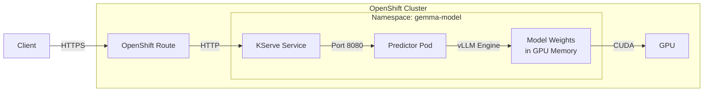

# L1-M2.1 — KServe Fundamentals

**Level:** Foundations
**Duration:** 30 min

## Overview

KServe is the model serving framework that powers inference on OpenShift AI. If you have deployed ML models on Kubernetes using custom Deployments and Services, KServe replaces that manual work with purpose-built CRDs that handle model loading, scaling, and API exposure. This lesson covers the KServe architecture, the two deployment modes, available serving runtimes, and how vLLM fits into the picture as the inference engine for LLMs.

## Prerequisites

- Completed: L1-M1 (Platform Setup) — OpenShift AI installed with `kserve` component `Managed` in the `DataScienceCluster` CR
- OpenShift cluster running with `oc` CLI authenticated
- Familiarity with Kubernetes Deployments, Services, and CRDs

## K8s Context

On vanilla Kubernetes, serving a model means writing a Deployment that runs an inference server container (TorchServe, Triton, vLLM), a Service to expose it, and an Ingress to route external traffic. You manage scaling, health checks, model loading, and API versioning yourself. If you have used the upstream KServe project on Kubernetes, the CRDs are the same here — OpenShift AI adds dashboard integration, pre-built runtimes, monitoring hooks, and authentication (Authorino) on top.

## Concepts

### KServe Architecture

KServe introduces two primary CRDs that separate *how* to run an inference server from *what model* to serve:

- **`ServingRuntime`** — Defines the inference server: which container image to use, what command-line arguments to pass, which ports to expose, and which model formats it supports. Think of it as a *template* for an inference server. You create one `ServingRuntime` per server configuration, and multiple models can reference it.

- **`InferenceService`** — Deploys a specific model using a `ServingRuntime`. It specifies the model location, resource requests (CPU, memory, GPU), replica count, and scaling behavior. When you create an `InferenceService`, KServe creates the underlying Deployment, Service, and (optionally) Route.

An `InferenceService` can include up to three components:

| Component | Purpose | Required? |
|-----------|---------|-----------|
| **Predictor** | Runs the inference server and serves predictions | Yes |
| **Transformer** | Pre/post-processes requests (e.g., tokenization, feature extraction) | No |
| **Explainer** | Provides model explanations (SHAP, LIME) | No |

For LLM serving with vLLM, you typically only use the **predictor** — vLLM handles tokenization internally and explanations are not applicable to generative models.

### Deployment Modes

KServe supports two deployment modes on OpenShift AI:

| Mode | Backend | Status in RHOAI 3.x | How It Works |
|------|---------|---------------------|--------------|
| **Serverless** | Knative Serving | Deprecated | Creates Knative Services with automatic scale-to-zero. Requires the OpenShift Serverless operator. Being phased out. |
| **RawDeployment** | Standard K8s Deployments + Services | Recommended | Creates regular Kubernetes Deployments and Services. No extra operators needed. Use KEDA for scale-to-zero if required. |

**Use RawDeployment.** It is the recommended mode going forward. To select it, annotate the `InferenceService`:

```yaml
metadata:
  annotations:
    serving.kserve.io/deploymentMode: RawDeployment
```

### Request Flow

The following diagram shows how an inference request flows through the OpenShift AI stack when using RawDeployment mode with vLLM:



1. **Client** sends an HTTPS request (e.g., `POST /v1/chat/completions`) to the OpenShift Route.
2. **OpenShift Route** (HAProxy) terminates TLS and forwards to the KServe-managed Service.
3. **KServe Service** routes to the predictor pod.
4. **Predictor Pod** runs the vLLM inference server, which loads model weights into GPU memory at startup.
5. **vLLM** processes the request using PagedAttention for efficient KV-cache management and returns the response.

### Available Serving Runtimes

OpenShift AI bundles several serving runtimes out of the box. You do not install these separately — they are deployed as part of the `kserve` component:

| Runtime | Use Case | Model Formats | Key Feature |
|---------|----------|---------------|-------------|
| **vLLM (Red Hat AI Inference Server)** | LLMs, generative models | Hugging Face Transformers, GPTQ, AWQ, GGUF | PagedAttention, continuous batching, OpenAI-compatible API |
| **OpenVINO Model Server** | Traditional ML models | ONNX, TensorFlow SavedModel, PyTorch, PaddlePaddle | CPU-optimized inference, Intel hardware acceleration |
| **MLServer** | Classical ML models | scikit-learn, XGBoost, LightGBM | Seldon's runtime, V2 inference protocol |

vLLM is available in multiple variants for different hardware:

| Variant | Hardware | Image |
|---------|----------|-------|
| vLLM CUDA | NVIDIA GPUs | `quay.io/modh/vllm:stable` |
| vLLM ROCm | AMD GPUs | `quay.io/modh/vllm:stable-rocm` |
| vLLM Gaudi | Intel Gaudi accelerators | `quay.io/modh/vllm:stable-gaudi` |
| vLLM CPU | CPU only (no GPU) | `quay.io/modh/vllm:stable-cpu` |

> **Important:** vLLM is bundled as a sub-release of the `kserve` component (KServe v0.17.0 includes vLLM v0.18.0). You do not install vLLM separately. Red Hat ships it as the **Red Hat AI Inference Server** — a UBI-based container image with vLLM pre-configured.

### vLLM Fundamentals

vLLM is the default inference engine for LLMs on OpenShift AI. Understanding its core innovations explains why it is the standard choice:

**PagedAttention** — Traditional inference servers allocate a contiguous block of GPU memory for each request's KV cache (the memory that stores attention key-value pairs during generation). This leads to fragmentation — memory is wasted on padding and pre-allocated but unused space. PagedAttention borrows the concept of virtual memory paging from operating systems: it breaks the KV cache into fixed-size blocks (pages) and maps them non-contiguously. Result: near-zero memory waste, more concurrent requests per GPU.

**Continuous Batching** — Traditional batching waits until a fixed batch fills up, then processes all requests together. Continuous batching (also called iteration-level batching) adds new requests to the batch as soon as any in-progress request finishes a generation step. Result: higher GPU utilization and lower latency for individual requests.

**OpenAI-Compatible API** — vLLM exposes endpoints that match the OpenAI API specification (`/v1/chat/completions`, `/v1/completions`, `/v1/models`, `/v1/embeddings`). Any code written for the OpenAI API works with vLLM by changing the base URL. This includes the official `openai` Python SDK, `langchain-openai`, and `curl` commands.

### Model Storage Options

When you create an `InferenceService`, you specify where the model weights are located. KServe and vLLM support several storage backends:

| Storage | How It Works | Startup Speed | Best For |
|---------|-------------|---------------|----------|
| **OCI / ModelCar** | Model weights baked into a container image. Pulled like any container image. | Fastest (no download at runtime) | Production deployments, air-gapped environments |
| **S3** | Model downloaded from S3-compatible object storage at pod startup. | Moderate (download time depends on model size) | Development, shared storage across models |
| **PVC** | Model on a Persistent Volume, mounted into the pod. | Fast (no download, mounted directly) | On-prem, pre-staged models |
| **`hf://` URI** | Model downloaded directly from Hugging Face Hub at startup. | Slowest (depends on network, model size) | Quick experiments, prototyping |

In this tutorial module, the next lesson (L1-M2.2) deploys Gemma4-e4b using `hf://` download for simplicity. Production deployments typically use OCI images or S3.

## Step-by-Step

### Step 1: Verify KServe Is Installed

Confirm that the `kserve` component is active in your `DataScienceCluster`:

```bash
oc get datasciencecluster default-dsc -o jsonpath='{.spec.components.kserve.managementState}'
```

Expected output:

```
Managed
```

Check that the KServe controller pods are running:

```bash
oc get pods -n redhat-ods-applications -l app=kserve-controller-manager
```

Expected output (pod name will differ):

```
NAME                                        READY   STATUS    RESTARTS   AGE
kserve-controller-manager-abc123-xyz        1/1     Running   0          2d
```

### Step 2: Explore the ServingRuntime CRD

List the API resources to see the KServe CRDs available on the cluster:

```bash
oc api-resources | grep -i serving
```

Expected output (partial):

```
inferenceservices        isvc     serving.kserve.io/v1beta1      true    InferenceService
servingruntimes                   serving.kserve.io/v1alpha1     true    ServingRuntime
clusterservingruntimes            serving.kserve.io/v1alpha1     false   ClusterServingRuntime
```

Note the two scopes:
- **`ServingRuntime`** is namespace-scoped — created per project.
- **`ClusterServingRuntime`** is cluster-scoped — available to all projects. OpenShift AI pre-installs several `ClusterServingRuntime` resources as templates.

List the pre-installed cluster-scoped runtimes:

```bash
oc get clusterservingruntimes
```

Expected output (names may vary by OpenShift AI version):

```
NAME                                  AGE
kserve-mlserver                       2d
kserve-openvino                       2d
vllm-cuda-runtime-template            2d
vllm-gaudi-runtime-template           2d
vllm-rocm-runtime-template            2d
```

### Step 3: Inspect a vLLM ClusterServingRuntime

Examine the pre-installed vLLM CUDA runtime template to understand the structure:

```bash
oc get clusterservingruntime vllm-cuda-runtime-template -o yaml
```

Key fields to note:

- `spec.containers[0].image` — The vLLM container image (Red Hat AI Inference Server).
- `spec.containers[0].command` — Runs `python3 -m vllm.entrypoints.openai.api_server`, which starts the OpenAI-compatible API server.
- `spec.containers[0].args` — Default arguments including `--port=8080`, `--model=/mnt/models`, and `--served-model-name={{.Name}}` (the `{{.Name}}` is a Go template variable that KServe replaces with the InferenceService name).
- `spec.multiModel: false` — This runtime serves one model per pod (single-model serving).
- `spec.supportedModelFormats` — Lists which model formats this runtime can handle.
- `spec.annotations` — Prometheus scraping configuration for metrics collection.

See the example manifest at `manifests/servingruntime-example.yaml` for a commented version of this structure.

### Step 4: Understand the InferenceService CRD

Examine the InferenceService CRD structure:

```bash
oc explain inferenceservice.spec.predictor --recursive | head -40
```

The predictor spec includes:

- `model.runtime` — References a `ServingRuntime` by name.
- `model.modelFormat.name` — Must match a `supportedModelFormats` entry in the referenced runtime.
- `model.resources` — CPU, memory, and GPU requests/limits.
- `minReplicas` / `maxReplicas` — Scaling bounds.
- `model.storageUri` — (Optional) Where to download the model from (S3, PVC, `hf://`).

List any existing InferenceServices on the cluster:

```bash
oc get inferenceservices --all-namespaces
```

If this is a fresh install, the output will be empty. The next lesson (L1-M2.2) creates one.

### Step 5: Create the Target Namespace

The remaining lessons in this module deploy models into a dedicated namespace. Create it now:

```bash
oc new-project gemma-model --display-name="Gemma Model Serving"
```

Expected output:

```
Now using project "gemma-model" on server "https://api.<cluster>:6443".
```

Verify the project was created:

```bash
oc project
```

Expected output:

```
Using project "gemma-model" on server "https://api.<cluster>:6443".
```

### Step 6: Review the Example ServingRuntime Manifest

Read through the annotated example in this lesson's manifests directory. It demonstrates a vLLM ServingRuntime with comments explaining every field:

```bash
cat manifests/servingruntime-example.yaml
```

This manifest is a template — do not apply it yet. The next lesson (L1-M2.2) creates a production-ready `ServingRuntime` and `InferenceService` for Gemma4-e4b.

## Verification

Confirm you have completed the following:

1. KServe component is `Managed` and controller pod is running:

```bash
oc get pods -n redhat-ods-applications -l app=kserve-controller-manager --no-headers | wc -l
```

Expected: `1` (or more).

2. KServe CRDs are registered:

```bash
oc get crd | grep -c "serving.kserve.io"
```

Expected: `3` or more (inferenceservices, servingruntimes, clusterservingruntimes, plus others).

3. Pre-installed ClusterServingRuntimes exist:

```bash
oc get clusterservingruntimes --no-headers | wc -l
```

Expected: `3` or more.

4. The `gemma-model` project exists:

```bash
oc get project gemma-model -o jsonpath='{.metadata.name}'
```

Expected: `gemma-model`.

## K8s vs OpenShift AI Comparison

| Aspect | Kubernetes (vanilla KServe) | OpenShift AI |
|--------|---------------------------|--------------|
| **Installation** | Install KServe manually (cert-manager, Knative or RawDeployment, CRDs) | KServe deployed automatically when `kserve` component is `Managed` in DSC |
| **Serving runtimes** | Build and maintain your own runtime images | Pre-built runtimes bundled: vLLM (CUDA/ROCm/Gaudi/CPU), OpenVINO, MLServer |
| **vLLM** | Install separately, build your own image | Shipped as "Red Hat AI Inference Server" (UBI-based vLLM), versioned with KServe |
| **Dashboard** | No built-in UI for model serving | Dashboard shows deployed models, endpoints, metrics, and logs |
| **Authentication** | Configure Istio/Envoy auth manually | Authorino integration with a single annotation (`security.opendatahub.io/enable-auth`) |
| **Monitoring** | Set up Prometheus scraping manually | Pre-configured metrics collection, Grafana dashboards available |
| **Model storage** | Configure storage manually | S3 data connections managed through dashboard, OCI support built-in |
| **Deployment mode** | Choose Serverless or RawDeployment | RawDeployment recommended, Serverless deprecated |

## Key Takeaways

- **Two CRDs, clear separation:** `ServingRuntime` defines the inference server; `InferenceService` deploys a model on that server. This separation lets you reuse one runtime across multiple models.
- **RawDeployment is the path forward.** Serverless mode (Knative) is deprecated in OpenShift AI 3.x. Use RawDeployment with KEDA if you need scale-to-zero.
- **vLLM is not a separate install.** It ships as a sub-release of the `kserve` component. Red Hat maintains UBI-based vLLM images (the "Red Hat AI Inference Server") for CUDA, ROCm, Gaudi, and CPU.
- **Choose your runtime by model type:** vLLM for LLMs and generative models, OpenVINO for traditional ML on CPU, MLServer for classical ML (scikit-learn, XGBoost).
- **Model storage is flexible.** OCI images for production (fastest startup), S3 for shared storage, `hf://` URIs for prototyping. The storage choice affects startup time, not inference performance.

## Cleanup

This lesson is primarily conceptual — the only resource created is the namespace:

```bash
# Keep the gemma-model namespace — it is used in the next lessons
# If you need to start fresh:
# oc delete project gemma-model
```

## Next Steps

In [L1-M2.2 — Deploying Gemma4-e4b](../2_deploying_gemma/), you will create a `ServingRuntime` and `InferenceService` to deploy the Gemma4-e4b model on vLLM, send your first inference request, and verify the deployment through both the CLI and the dashboard.
