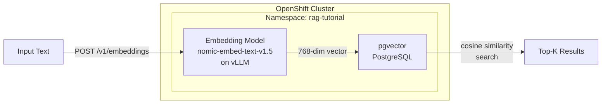

# L2-M1.2 -- Vector Database Setup

**Level:** Practitioner
**Duration:** 45 min

## Overview

RAG systems need two infrastructure components beyond the LLM: a vector database to store and search document embeddings, and an embedding model to convert text into vectors. This lesson deploys both on OpenShift -- pgvector (PostgreSQL with vector extensions) as the vector database and nomic-embed-text-v1.5 on vLLM as the embedding model. By the end, you will have a working vector search pipeline: text goes in, the embedding model generates a vector, pgvector stores it, and similarity search retrieves the closest matches.

## Prerequisites

- Completed: [L2-M1.1 -- RAG Architecture with OGX](../1_rag_architecture_ogx/)
- Completed: [L1-M2.1 -- KServe Fundamentals](../../../level_1/M2_model_serving/1_kserve_fundamentals/) and [L1-M2.2 -- Deploying Gemma4-e4b](../../../level_1/M2_model_serving/2_deploying_gemma/) (you know how `ServingRuntime` and `InferenceService` work)
- OpenShift cluster running with `oc` CLI authenticated
- At least 1 NVIDIA GPU available (for the embedding model)
- `psql` client installed locally (or use `oc exec` into the pgvector pod)

## K8s Context

On vanilla Kubernetes, deploying a PostgreSQL instance with extensions means finding a suitable container image, writing Deployment + Service + PVC manifests, and managing credentials via Secrets. For embedding models, you would deploy a standalone inference server (Triton, TEI, or vLLM) with its own Deployment and Service. None of this changes fundamentally on OpenShift AI -- pgvector is a standard Deployment, and the embedding model uses the same `ServingRuntime` + `InferenceService` CRDs you used for Gemma4-e4b in Level 1. The OpenShift-specific advantages are the dashboard integration for model serving, pre-built vLLM runtimes, and the `anyuid` SCC handling for PostgreSQL images.

## Concepts

### Vector Database Options on OpenShift

There is no single "official" vector database for OpenShift AI. The platform is database-agnostic -- your RAG application connects to whatever vector store you deploy. Here are the practical options:

| Vector DB | Type | Deployment Method | Best For | Drawbacks |
|-----------|------|-------------------|----------|-----------|
| **pgvector** | PostgreSQL extension | Deployment + PVC (or Crunchy PostgreSQL Operator) | Teams already using PostgreSQL, moderate scale, SQL familiarity | Single-node performance ceiling, not purpose-built for vectors |
| **Milvus** | Purpose-built vector DB | Milvus Operator on OperatorHub | High-scale vector search (billions of vectors), advanced indexing (IVF, HNSW, DiskANN) | Heavier infrastructure (etcd, MinIO, Pulsar), steeper learning curve |
| **FAISS + SQLite** | In-memory library + file DB | Python library in a container | Development, prototyping, small datasets (<100K vectors) | No persistence without extra work, no concurrent access, not production-grade |
| **Elasticsearch** | Search engine with vector support | Elastic Cloud on Kubernetes Operator (certified on OpenShift) | Teams already using Elasticsearch, hybrid text + vector search | Vector search is an add-on to a text search engine, not its primary strength |

**This lesson uses pgvector** because it is the most practical choice for most teams:
- Familiar PostgreSQL interface -- SQL, transactions, ACID guarantees
- Single container deployment -- no operator dependencies beyond what you already have
- Production-recommended by Red Hat's RAG validated patterns
- Good performance for datasets up to tens of millions of vectors with HNSW indexing
- The Crunchy PostgreSQL Operator can manage it at scale when needed

---

### pgvector Fundamentals

pgvector adds three capabilities to PostgreSQL:

1. **`vector` data type** -- stores fixed-dimension float arrays (e.g., `vector(768)` for a 768-dimensional embedding)
2. **Distance operators** -- `<->` (L2/Euclidean), `<=>` (cosine distance), `<#>` (inner product)
3. **Index types** -- IVFFlat (inverted file with flat quantization) and HNSW (hierarchical navigable small world graph)

The key indexing decision:

| Index Type | Build Speed | Query Speed | Memory Usage | Best For |
|------------|-------------|-------------|--------------|----------|
| **Exact (no index)** | N/A | Slow (full scan) | Low | Small datasets (<10K vectors), ground-truth validation |
| **IVFFlat** | Fast | Good | Moderate | Large datasets when you can retrain the index periodically |
| **HNSW** | Slow | Fastest | High | Production workloads, real-time search, no retraining needed |

For RAG applications, **HNSW is the standard choice** -- it provides the fastest queries without requiring index retraining when you add new vectors.

---

### Embedding Models on vLLM

vLLM serves embedding models the same way it serves generative models, but exposes the `/v1/embeddings` endpoint instead of `/v1/chat/completions`. The `ServingRuntime` and `InferenceService` CRDs are identical in structure -- the only difference is the model you point to.

This lesson deploys **nomic-embed-text-v1.5**, an open-source embedding model with the following characteristics:

| Property | Value |
|----------|-------|
| Dimensions | 768 |
| Max sequence length | 8192 tokens |
| Model size | ~550 MB |
| License | Apache 2.0 |
| Matryoshka support | Yes (can truncate dimensions: 768, 512, 256, 128, 64) |
| MTEB ranking | Competitive with models 5-10x its size |

Matryoshka embeddings are worth noting: the model is trained so that the first N dimensions of the embedding are themselves a valid, lower-dimensional embedding. You can store 256-dimensional vectors instead of 768 to save storage and speed up search, at a small accuracy cost.

---

### Architecture: Vector Search Pipeline

The following diagram shows how text flows through the embedding and storage pipeline you will build in this lesson:



At query time, the same embedding model converts the user's question into a vector, pgvector finds the closest stored vectors using cosine similarity, and the matching text chunks are returned for injection into the LLM prompt (covered in L2-M1.4).

## Step-by-Step

### Step 1: Create the RAG Tutorial Namespace

Create a dedicated namespace for all RAG components. This namespace will be reused across the remaining M1 lessons:

```bash
oc new-project rag-tutorial --display-name="RAG Tutorial"
```

Expected output:

```
Now using project "rag-tutorial" on server "https://api.<cluster>:6443".
```

The pgvector image (`pgvector/pgvector:pg16`) is based on the official PostgreSQL image which runs as root by default. On OpenShift, the `restricted` SCC blocks this. Grant the `anyuid` SCC to the namespace's default service account:

```bash
oc adm policy add-scc-to-user anyuid -z default -n rag-tutorial
```

Expected output:

```
clusterrole.rbac.authorization.k8s.io/system:openshift:scc:anyuid added: "default"
```

> **Why anyuid?** The official PostgreSQL/pgvector image writes to `/var/lib/postgresql/data` as the `postgres` user (UID 999). OpenShift's `restricted` SCC assigns a random high UID that does not match, causing permission errors. Granting `anyuid` lets the container run as its intended user. In production, you would use an OpenShift-certified PostgreSQL image (e.g., from Crunchy Data) that is designed for `restricted` SCC.

### Step 2: Deploy pgvector

Apply the pgvector manifest, which creates a Secret (credentials), PVC (storage), Deployment (PostgreSQL with pgvector), and Service (port 5432):

```bash
oc apply -f manifests/postgresql-pgvector.yaml -n rag-tutorial
```

Expected output:

```
secret/pgvector-credentials created
persistentvolumeclaim/pgvector-data created
deployment.apps/pgvector created
service/pgvector created
```

Wait for the pod to become ready:

```bash
oc rollout status deployment/pgvector -n rag-tutorial --timeout=120s
```

Expected output:

```
deployment "pgvector" successfully rolled out
```

Verify the pod is running:

```bash
oc get pods -n rag-tutorial -l app=pgvector
```

Expected output:

```
NAME                        READY   STATUS    RESTARTS   AGE
pgvector-5d4f8c7b9-x2k4m   1/1     Running   0          45s
```

### Step 3: Verify the pgvector Extension

Connect to the PostgreSQL instance and confirm the pgvector extension is available:

```bash
oc exec deploy/pgvector -n rag-tutorial -- psql -U vectoruser -d vectordb -c "CREATE EXTENSION IF NOT EXISTS vector; SELECT extversion FROM pg_extension WHERE extname = 'vector';"
```

Expected output:

```
CREATE EXTENSION
 extversion
------------
 0.8.0
(1 row)
```

The version may differ depending on the container image tag. Any version >= 0.5.0 supports HNSW indexes.

### Step 4: Create the Vector Schema

Create a table for storing document embeddings. This schema stores the text chunk, its embedding vector, and metadata for source tracking:

```bash
oc exec deploy/pgvector -n rag-tutorial -- psql -U vectoruser -d vectordb -c "
CREATE TABLE IF NOT EXISTS documents (
    id SERIAL PRIMARY KEY,
    content TEXT NOT NULL,
    embedding vector(768),
    metadata JSONB DEFAULT '{}',
    created_at TIMESTAMP DEFAULT CURRENT_TIMESTAMP
);
"
```

Expected output:

```
CREATE TABLE
```

The `vector(768)` column stores 768-dimensional embeddings matching the output of nomic-embed-text-v1.5. The `metadata` JSONB column stores arbitrary key-value pairs (source document, page number, chunk index).

### Step 5: Create an HNSW Index

Create an HNSW index for fast cosine similarity search:

```bash
oc exec deploy/pgvector -n rag-tutorial -- psql -U vectoruser -d vectordb -c "
CREATE INDEX IF NOT EXISTS documents_embedding_idx
ON documents
USING hnsw (embedding vector_cosine_ops)
WITH (m = 16, ef_construction = 64);
"
```

Expected output:

```
CREATE INDEX
```

The index parameters control the accuracy-speed tradeoff:

| Parameter | Default | This Lesson | Effect |
|-----------|---------|-------------|--------|
| `m` | 16 | 16 | Number of bi-directional links per node. Higher = better recall, more memory. |
| `ef_construction` | 64 | 64 | Size of the dynamic candidate list during index build. Higher = better recall, slower builds. |

These defaults are a good starting point. In L2-M1.5 (RAG Evaluation), you will benchmark different parameter values.

### Step 6: Deploy the Embedding Model

Deploy nomic-embed-text-v1.5 on vLLM using the same `ServingRuntime` + `InferenceService` pattern from Level 1.

Apply the `ServingRuntime`:

```bash
oc apply -f manifests/embedding-servingruntime.yaml -n rag-tutorial
```

Expected output:

```
servingruntime.serving.kserve.io/nomic-embed-text-v1-5 created
```

Apply the `InferenceService`:

```bash
oc apply -f manifests/embedding-inferenceservice.yaml -n rag-tutorial
```

Expected output:

```
inferenceservice.serving.kserve.io/nomic-embed-text-v1-5 created
```

Wait for the model to load. This may take 2-5 minutes depending on download speed (the model is ~550 MB):

```bash
oc wait --for=condition=Ready inferenceservice/nomic-embed-text-v1-5 -n rag-tutorial --timeout=300s
```

Expected output:

```
inferenceservice.serving.kserve.io/nomic-embed-text-v1-5 condition met
```

Verify the predictor pod is running:

```bash
oc get pods -n rag-tutorial -l serving.kserve.io/inferenceservice=nomic-embed-text-v1-5
```

Expected output:

```
NAME                                                    READY   STATUS    RESTARTS   AGE
nomic-embed-text-v1-5-predictor-abcdef-12345            1/1     Running   0          3m
```

### Step 7: Test the Embedding Endpoint

Get the internal service URL for the embedding model:

```bash
EMBED_URL=$(oc get inferenceservice nomic-embed-text-v1-5 -n rag-tutorial -o jsonpath='{.status.url}')
echo "Embedding endpoint: ${EMBED_URL}"
```

Send a test embedding request:

```bash
curl -s "${EMBED_URL}/v1/embeddings" \
  -H "Content-Type: application/json" \
  -d '{
    "model": "nomic-embed-text-v1-5",
    "input": "OpenShift is a Kubernetes distribution by Red Hat."
  }' | python3 -m json.tool | head -20
```

Expected output (truncated):

```json
{
    "object": "list",
    "data": [
        {
            "object": "embedding",
            "embedding": [
                -0.0234375,
                0.0087890625,
                0.041015625,
                ...
            ],
            "index": 0
        }
    ],
    "model": "nomic-embed-text-v1-5",
    "usage": {
        "prompt_tokens": 11,
        "total_tokens": 11
    }
}
```

Verify the embedding has 768 dimensions:

```bash
curl -s "${EMBED_URL}/v1/embeddings" \
  -H "Content-Type: application/json" \
  -d '{
    "model": "nomic-embed-text-v1-5",
    "input": "test"
  }' | python3 -c "import sys,json; print(len(json.load(sys.stdin)['data'][0]['embedding']))"
```

Expected output:

```
768
```

### Step 8: Generate and Store Embeddings

Now connect both components: use the embedding model to generate vectors, then store them in pgvector. This step uses a shell script that calls the embedding API and inserts the results into PostgreSQL.

First, generate an embedding and store it using `oc exec` to run SQL from within the cluster:

```bash
# Generate embedding for a sample text
EMBEDDING=$(curl -s "${EMBED_URL}/v1/embeddings" \
  -H "Content-Type: application/json" \
  -d '{
    "model": "nomic-embed-text-v1-5",
    "input": "OpenShift AI provides model serving with KServe and vLLM."
  }' | python3 -c "import sys,json; print(json.load(sys.stdin)['data'][0]['embedding'])")

# Insert into pgvector
oc exec deploy/pgvector -n rag-tutorial -- psql -U vectoruser -d vectordb -c "
INSERT INTO documents (content, embedding, metadata)
VALUES (
  'OpenShift AI provides model serving with KServe and vLLM.',
  '${EMBEDDING}',
  '{\"source\": \"tutorial\", \"chunk_index\": 0}'
);
"
```

Expected output:

```
INSERT 0 1
```

Insert a few more sample documents to make similarity search meaningful:

```bash
# Helper function to embed and insert
embed_and_store() {
  local text="$1"
  local chunk_idx="$2"
  local embedding=$(curl -s "${EMBED_URL}/v1/embeddings" \
    -H "Content-Type: application/json" \
    -d "{\"model\": \"nomic-embed-text-v1-5\", \"input\": \"${text}\"}" \
    | python3 -c "import sys,json; print(json.load(sys.stdin)['data'][0]['embedding'])")
  oc exec deploy/pgvector -n rag-tutorial -- psql -U vectoruser -d vectordb -c "
    INSERT INTO documents (content, embedding, metadata)
    VALUES ('${text}', '${embedding}', '{\"source\": \"tutorial\", \"chunk_index\": ${chunk_idx}}');
  "
}

embed_and_store "pgvector is a PostgreSQL extension for vector similarity search." 1
embed_and_store "RAG combines retrieval from a knowledge base with LLM generation." 2
embed_and_store "HNSW indexes provide fast approximate nearest neighbor search." 3
embed_and_store "Kubernetes manages containerized applications across clusters." 4
embed_and_store "vLLM uses PagedAttention for efficient GPU memory management." 5
```

Verify all documents are stored:

```bash
oc exec deploy/pgvector -n rag-tutorial -- psql -U vectoruser -d vectordb -c "
SELECT id, LEFT(content, 60) AS content_preview, metadata->>'chunk_index' AS chunk
FROM documents
ORDER BY id;
"
```

Expected output:

```
 id |                       content_preview                        | chunk
----+--------------------------------------------------------------+-------
  1 | OpenShift AI provides model serving with KServe and vLLM.    | 0
  2 | pgvector is a PostgreSQL extension for vector similarity sea  | 1
  3 | RAG combines retrieval from a knowledge base with LLM gener  | 2
  4 | HNSW indexes provide fast approximate nearest neighbor searc  | 3
  5 | Kubernetes manages containerized applications across cluster  | 4
  6 | vLLM uses PagedAttention for efficient GPU memory management  | 5
(6 rows)
```

### Step 9: Test Similarity Search

Run a cosine similarity search to find documents most relevant to a query. This is the core operation that powers RAG retrieval:

```bash
# Generate query embedding
QUERY_EMBEDDING=$(curl -s "${EMBED_URL}/v1/embeddings" \
  -H "Content-Type: application/json" \
  -d '{
    "model": "nomic-embed-text-v1-5",
    "input": "How does vector search work?"
  }' | python3 -c "import sys,json; print(json.load(sys.stdin)['data'][0]['embedding'])")

# Search for top 3 most similar documents
oc exec deploy/pgvector -n rag-tutorial -- psql -U vectoruser -d vectordb -c "
SELECT
  id,
  LEFT(content, 70) AS content,
  1 - (embedding <=> '${QUERY_EMBEDDING}') AS similarity
FROM documents
ORDER BY embedding <=> '${QUERY_EMBEDDING}'
LIMIT 3;
"
```

Expected output (similarity scores will vary):

```
 id |                               content                                | similarity
----+----------------------------------------------------------------------+------------
  2 | pgvector is a PostgreSQL extension for vector similarity search.      |   0.847321
  4 | HNSW indexes provide fast approximate nearest neighbor search.        |   0.793456
  3 | RAG combines retrieval from a knowledge base with LLM generation.     |   0.721890
(3 rows)
```

The `<=>` operator computes cosine distance (0 = identical, 2 = opposite). The query subtracts from 1 to show cosine similarity (1 = identical, -1 = opposite). The results should show that documents about vector search and indexing rank highest for the query "How does vector search work?" -- the Kubernetes and vLLM documents rank lower because they are semantically further from the query.

## Verification

Confirm all components are operational:

1. pgvector pod is running and the extension is loaded:

```bash
oc exec deploy/pgvector -n rag-tutorial -- psql -U vectoruser -d vectordb -c "SELECT extname, extversion FROM pg_extension WHERE extname = 'vector';"
```

Expected: one row showing `vector` with a version.

2. The `documents` table exists with an HNSW index:

```bash
oc exec deploy/pgvector -n rag-tutorial -- psql -U vectoruser -d vectordb -c "\di documents_embedding_idx"
```

Expected: one row showing the index with `hnsw` method.

3. Embedding model InferenceService is ready:

```bash
oc get inferenceservice nomic-embed-text-v1-5 -n rag-tutorial -o jsonpath='{.status.conditions[?(@.type=="Ready")].status}'
```

Expected: `True`.

4. Embedding endpoint returns 768-dimensional vectors:

```bash
EMBED_URL=$(oc get inferenceservice nomic-embed-text-v1-5 -n rag-tutorial -o jsonpath='{.status.url}')
curl -s "${EMBED_URL}/v1/embeddings" \
  -H "Content-Type: application/json" \
  -d '{"model":"nomic-embed-text-v1-5","input":"test"}' \
  | python3 -c "import sys,json; d=json.load(sys.stdin); print(f'Dimensions: {len(d[\"data\"][0][\"embedding\"])}')"
```

Expected: `Dimensions: 768`.

5. Documents are stored and similarity search works:

```bash
oc exec deploy/pgvector -n rag-tutorial -- psql -U vectoruser -d vectordb -c "SELECT COUNT(*) FROM documents;"
```

Expected: `6` (or more if you added extra documents).

## K8s vs OpenShift AI Comparison

| Aspect | Kubernetes | OpenShift AI |
|--------|-----------|--------------|
| **Vector DB deployment** | Standard Deployment + Service + PVC manifests | Same manifests, but must handle SCC (`anyuid` for PostgreSQL images that expect root) |
| **PostgreSQL image** | Any Docker Hub image (runs as root freely) | Need `anyuid` SCC or use OpenShift-certified images (Crunchy PostgreSQL) that work with `restricted` SCC |
| **Embedding model serving** | Deploy vLLM manually (Deployment + Service), manage lifecycle yourself | `ServingRuntime` + `InferenceService` CRDs handle deployment, health checks, scaling, and dashboard integration |
| **Model endpoint discovery** | Service DNS name, manual configuration | `InferenceService` status provides the URL; dashboard shows endpoints |
| **Monitoring** | Set up Prometheus scraping manually | Pre-configured metrics collection for models served via KServe |
| **Credentials management** | Kubernetes Secrets | Same Secrets, plus option to use OpenShift's data connections feature in the dashboard |

## Key Takeaways

- **pgvector is the pragmatic choice** for most RAG workloads on OpenShift. It reuses PostgreSQL (which most teams already operate), supports HNSW indexing for fast similarity search, and deploys as a single container without operator dependencies.
- **HNSW indexes are the default for RAG.** They provide fast approximate nearest neighbor search without retraining when new vectors are added. Tune `m` and `ef_construction` if recall needs to improve.
- **Embedding models deploy like any other model.** The `ServingRuntime` + `InferenceService` pattern from Level 1 applies directly -- the only difference is the model itself and the `/v1/embeddings` endpoint.
- **The vector dimension must match everywhere.** The embedding model's output dimension (768 for nomic-embed-text-v1.5) must match the `vector(N)` column definition in pgvector. A mismatch causes insertion errors.
- **SCC handling is the main OpenShift friction point.** Standard PostgreSQL images require `anyuid` SCC. For production, use an OpenShift-certified PostgreSQL operator (Crunchy Data, EDB) that works with the `restricted` SCC.

## Cleanup

The `rag-tutorial` namespace and its resources will be reused in subsequent M1 lessons (L2-M1.3 through L2-M1.6). Do not delete them.

If you need to start over with just this lesson's resources:

```bash
# Remove the embedding model
oc delete inferenceservice nomic-embed-text-v1-5 -n rag-tutorial
oc delete servingruntime nomic-embed-text-v1-5 -n rag-tutorial

# Remove pgvector (WARNING: deletes all stored embeddings)
oc delete -f manifests/postgresql-pgvector.yaml -n rag-tutorial

# To delete everything and start fresh:
# oc delete project rag-tutorial
```

## Next Steps

In [L2-M1.3 -- Document Ingestion Pipeline](../3_document_ingestion/), you will build a pipeline that parses real documents (PDF, HTML), chunks them using different strategies, generates embeddings via the model deployed in this lesson, and stores the results in pgvector. That lesson also introduces Docling for structure-aware document parsing and Ray Data for scaling ingestion across multiple workers.
