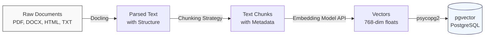

# L2-M1.3 -- Document Ingestion Pipeline

**Level:** Practitioner
**Duration:** 60 min

## Overview

A RAG system is only as good as the data it retrieves. This lesson builds the ingestion pipeline that sits between raw documents and the vector database you set up in L2-M1.2: parse documents into structured text, split that text into chunks, generate vector embeddings, and store everything in pgvector. You will use Docling for document parsing, implement three chunking strategies, call the embedding model deployed in L2-M1.2, and write the results to PostgreSQL with pgvector.

## Prerequisites

- Completed: [L2-M1.1 -- RAG Architecture](../1_rag_architecture_ogx/) and [L2-M1.2 -- Vector Database Setup](../2_vector_database/)
- pgvector database running and accessible (deployed in L2-M1.2)
- Embedding model deployed and serving on vLLM (deployed in L2-M1.2)
- OpenShift cluster running with `oc` CLI authenticated
- Python 3.11+ available (in a workbench or locally)
- Familiarity with Python, REST APIs, and SQL

## Concepts

### Document Parsing with Docling

Raw documents come in many formats -- PDF, DOCX, HTML, Markdown, plain text. Before you can chunk and embed text, you need to extract it reliably. This is harder than it sounds: PDFs mix text runs with layout coordinates, DOCX files embed formatting in XML, and HTML nests content in tags.

[Docling](https://github.com/DS4SD/docling) is IBM's open-source document parsing library. It handles the extraction problem by converting diverse document formats into a unified internal representation that preserves structure:

| Format | What Docling Extracts |
|--------|----------------------|
| PDF | Text, headings, tables, lists, figures (captions), page boundaries |
| DOCX | Text, headings, tables, lists, embedded images (captions) |
| HTML | Text, headings, tables, lists (strips tags, preserves structure) |
| Markdown | Text, headings, code blocks, tables, lists |
| Plain text | Text (treated as a single section) |

The key advantage over simpler approaches (like reading raw text with `open()`) is that Docling preserves **document structure** -- headings, section boundaries, table cell relationships. This structure is critical for document-aware chunking, which we cover next.

---

### Chunking Strategies

Chunking is the process of splitting a parsed document into smaller pieces that fit within the embedding model's context window and are semantically coherent enough for retrieval. The choice of chunking strategy has a direct impact on retrieval quality. There is no universally best strategy -- the right choice depends on your document type and retrieval requirements.

#### Fixed-Size Chunking

Split text into chunks of N tokens (or characters) with an overlap of M tokens between consecutive chunks.

```
Document:  [===========================================]
Chunk 1:   [===========]
Chunk 2:        [===========]      (overlap)
Chunk 3:             [===========]
Chunk 4:                  [===========]
```

- **How it works:** Walk through the text, take `chunk_size` tokens, step forward by `chunk_size - overlap` tokens, repeat.
- **Overlap:** Prevents information loss at chunk boundaries. A sentence split across two chunks will appear in full in at least one of them.
- **Tradeoffs:** Simple and predictable, but blind to semantics. A chunk boundary might land in the middle of a sentence, a paragraph, or even a table row.

#### Semantic Chunking

Split at natural language boundaries (paragraphs, sentences) and optionally use embedding similarity to decide where to place boundaries.

- **How it works:** Split the document into paragraphs (or sentences). Optionally compute embeddings for each unit and merge adjacent units whose embeddings are similar (cosine similarity above a threshold). When similarity drops below the threshold, start a new chunk.
- **Tradeoffs:** Produces more semantically coherent chunks than fixed-size. However, chunk sizes vary (some chunks may be very short or very long), and computing embeddings during chunking adds latency and cost.

#### Document-Aware Chunking

Use document structure (headings, sections, tables) to determine chunk boundaries. This is where Docling's structural parsing pays off.

- **How it works:** Walk the document's structural tree. Each section (defined by a heading) becomes a candidate chunk. If a section is too long, split it at sub-heading boundaries or paragraph boundaries. Tables are kept as complete units (never split a table row across chunks). Metadata (heading hierarchy, section number) is attached to each chunk.
- **Tradeoffs:** Produces the highest-quality chunks for structured documents (technical docs, manuals, reports). Requires a parser that preserves structure (Docling, or HTML with heading tags). Does not help much for unstructured text (chat logs, raw transcripts).

#### Comparison

| Strategy | Chunk Quality | Chunk Size Consistency | Complexity | Best For |
|----------|--------------|----------------------|------------|----------|
| **Fixed-size** | Low -- may split mid-sentence | High -- all chunks ~same size | Low | Homogeneous text, quick prototyping |
| **Semantic** | Medium -- respects paragraph boundaries | Medium -- varies with content | Medium | Blog posts, articles, mixed content |
| **Document-aware** | High -- respects document structure | Medium -- varies with sections | High | Technical docs, manuals, reports |

For this lesson's script, all three strategies are implemented so you can compare their output.

---

### Embedding Generation

Each chunk of text must be converted into a vector embedding before it can be stored in pgvector and retrieved via similarity search. The embedding model deployed in L2-M1.2 exposes an OpenAI-compatible `/v1/embeddings` endpoint.

The API call is straightforward:

```python
import requests

response = requests.post(
    "http://embedding-model:8080/v1/embeddings",
    json={
        "model": "nomic-embed-text-v1.5",
        "input": "Text to embed"
    }
)
embedding = response.json()["data"][0]["embedding"]
# embedding is a list of floats, e.g., [0.012, -0.034, 0.056, ...]
```

Key considerations:

- **Batch requests:** Send multiple texts in a single API call (`"input": ["text1", "text2", ...]`) to reduce HTTP overhead. The model processes them in a batch.
- **Token limits:** The embedding model has a maximum input length (typically 512 or 8192 tokens depending on the model). Chunks that exceed this limit will be truncated, losing information. This is why chunk size matters.
- **Dimensionality:** The embedding dimension (e.g., 768 for nomic-embed-text-v1.5) must match the dimension you configured in the pgvector table schema (L2-M1.2).

---

### The Ingestion Pipeline

The full ingestion pipeline is a four-stage process:



Each stage is a function in the `ingestion_pipeline.py` script:

| Stage | Function | Input | Output |
|-------|----------|-------|--------|
| 1. Parse | `parse_document()` | File path or raw text | Structured text with metadata |
| 2. Chunk | `chunk_text()` | Structured text + strategy | List of `Chunk` objects (text + metadata) |
| 3. Embed | `generate_embeddings()` | List of chunk texts | List of embedding vectors |
| 4. Store | `store_in_pgvector()` | Chunks + embeddings | Rows inserted into pgvector |

The script implements all four stages and can be run as a standalone CLI tool or imported as a library in a larger application.

---

### Metadata Management

Storing just the text and its embedding is not enough for a production RAG system. You also need **metadata** to filter results, track provenance, and debug retrieval issues.

The pgvector table schema stores the following metadata alongside each chunk:

| Column | Type | Purpose |
|--------|------|---------|
| `id` | `SERIAL PRIMARY KEY` | Unique chunk identifier |
| `content` | `TEXT` | The chunk text (returned to the LLM as context) |
| `embedding` | `vector(768)` | The vector embedding for similarity search |
| `source_document` | `TEXT` | Original file path or document name |
| `chunk_index` | `INTEGER` | Position of this chunk within the document (0-based) |
| `section_heading` | `TEXT` | The heading under which this chunk falls (if available) |
| `chunk_strategy` | `TEXT` | Which chunking strategy produced this chunk |
| `created_at` | `TIMESTAMP` | When this chunk was ingested |
| `metadata_json` | `JSONB` | Arbitrary additional metadata (flexible extension point) |

Why metadata matters:

- **Source filtering:** "Only search documents from the operations manual" -- filter by `source_document`.
- **Provenance:** When the LLM cites a chunk, the user can trace it back to the exact document and section.
- **Re-ingestion:** When a source document is updated, delete all chunks with that `source_document` and re-ingest. Without this metadata, you would have to rebuild the entire index.
- **Debugging:** If retrieval quality is poor, inspect `chunk_strategy` and `chunk_index` to understand how the document was split.

---

### Scaling with Ray Data

The ingestion pipeline in this lesson processes documents sequentially. For production workloads with thousands of documents, you need parallelism. Ray Data (available through the `ray` component in OpenShift AI) provides a natural scaling path:

- **Parallel parsing:** Each document is parsed independently -- perfect for `ray.data.map()`.
- **Batched embedding:** Ray Data can batch chunks and send them to the embedding model in parallel.
- **Fault tolerance:** If a document fails to parse, Ray Data retries or skips it without halting the pipeline.
- **GPU scheduling:** When using GPU-accelerated embedding models, Ray Data integrates with Kueue for GPU allocation.

This is covered in detail in [L2-M6 -- Distributed Workloads](../../M6_distributed/). For this lesson, the sequential pipeline is sufficient for learning the concepts.

---

### Building as a KFP Pipeline (Preview)

The ingestion pipeline implemented here as a Python script can be packaged as a **Kubeflow Pipeline (KFP)** for automated, scheduled ingestion. Each stage (parse, chunk, embed, store) becomes a pipeline component, and you can trigger the pipeline on a schedule or when new documents arrive.

This is covered in [L2-M4.4 -- RAG Ingestion Pipeline](../../M4_pipelines/4_rag_ingestion_pipeline/), which wraps this script in KFP components.

## Step-by-Step

### Step 1: Prepare the Working Environment

Ensure you are in the correct project and verify that the prerequisite services are running:

```bash
oc project rag-demo
```

Expected output:

```
Now using project "rag-demo" on server "https://api.<cluster>:6443".
```

Verify the pgvector database is running:

```bash
oc get pods -l app=pgvector
```

Expected output:

```
NAME                       READY   STATUS    RESTARTS   AGE
pgvector-0                 1/1     Running   0          1h
```

Verify the embedding model is serving:

```bash
oc get inferenceservice embedding-model -o jsonpath='{.status.conditions[?(@.type=="Ready")].status}'
```

Expected output:

```
True
```

### Step 2: Get the Embedding Model Endpoint

Retrieve the internal URL for the embedding model service:

```bash
oc get service -l app=embedding-model -o jsonpath='{.items[0].metadata.name}'
```

Note the service name. The embedding endpoint will be:

```
http://<service-name>:8080/v1/embeddings
```

Test the endpoint with a quick curl:

```bash
oc run curl-test --rm -it --restart=Never --image=registry.access.redhat.com/ubi9/ubi-minimal -- \
  curl -s -X POST http://embedding-model:8080/v1/embeddings \
  -H "Content-Type: application/json" \
  -d '{"model": "nomic-embed-text-v1.5", "input": "test"}' | python3 -c "import sys,json; d=json.load(sys.stdin); print(f'Dimension: {len(d[\"data\"][0][\"embedding\"])}')"
```

Expected output:

```
Dimension: 768
```

### Step 3: Get the Database Connection Details

Retrieve the pgvector database credentials:

```bash
oc get secret pgvector-credentials -o jsonpath='{.data.POSTGRES_USER}' | base64 -d && echo
oc get secret pgvector-credentials -o jsonpath='{.data.POSTGRES_PASSWORD}' | base64 -d && echo
oc get secret pgvector-credentials -o jsonpath='{.data.POSTGRES_DB}' | base64 -d && echo
```

Note these values -- you will pass them to the ingestion script.

Get the database service hostname:

```bash
oc get service pgvector -o jsonpath='{.metadata.name}'
```

The database will be accessible at `pgvector:5432` from within the cluster.

### Step 4: Review the Ingestion Pipeline Script

The script at `scripts/ingestion_pipeline.py` implements the full pipeline. Read through it to understand each stage:

```bash
cat scripts/ingestion_pipeline.py
```

Key sections to note:

1. **Sample documents** (lines near the top) -- three inline text documents about OpenShift AI topics, so the script works without external files.
2. **`parse_document()`** -- uses Docling if available, falls back to plain text reading.
3. **`chunk_text()`** -- implements all three chunking strategies (fixed, semantic, document-aware).
4. **`generate_embeddings()`** -- calls the vLLM embedding API with batching.
5. **`store_in_pgvector()`** -- creates the table if it does not exist and inserts chunks with metadata.
6. **`main()`** -- ties everything together with argparse for configuration.

### Step 5: Create the Database Table

The script creates the table automatically on first run, but you can also create it manually to inspect the schema:

```bash
oc exec pgvector-0 -- psql -U vectordb -d vectordb -c "
CREATE EXTENSION IF NOT EXISTS vector;

CREATE TABLE IF NOT EXISTS document_chunks (
    id SERIAL PRIMARY KEY,
    content TEXT NOT NULL,
    embedding vector(768),
    source_document TEXT NOT NULL,
    chunk_index INTEGER NOT NULL,
    section_heading TEXT,
    chunk_strategy TEXT NOT NULL,
    created_at TIMESTAMP DEFAULT CURRENT_TIMESTAMP,
    metadata_json JSONB DEFAULT '{}'::jsonb
);

CREATE INDEX IF NOT EXISTS idx_chunks_embedding
    ON document_chunks USING ivfflat (embedding vector_cosine_ops)
    WITH (lists = 100);

CREATE INDEX IF NOT EXISTS idx_chunks_source
    ON document_chunks (source_document);
"
```

Expected output:

```
CREATE EXTENSION
CREATE TABLE
CREATE INDEX
CREATE INDEX
```

### Step 6: Run the Pipeline with Fixed-Size Chunking

Start a temporary pod with the required Python packages and run the ingestion script using the built-in sample documents:

```bash
oc run ingestion-runner --rm -it --restart=Never \
  --image=registry.access.redhat.com/ubi9/python-311 \
  --env="EMBEDDING_URL=http://embedding-model:8080/v1/embeddings" \
  --env="DB_HOST=pgvector" \
  --env="DB_PORT=5432" \
  --env="DB_NAME=vectordb" \
  --env="DB_USER=vectordb" \
  --env="DB_PASSWORD=vectordb" \
  -- bash -c "
    pip install -q psycopg2-binary requests &&
    python3 /dev/stdin --chunk-strategy fixed --chunk-size 512 --chunk-overlap 50
  " < scripts/ingestion_pipeline.py
```

Expected output (abridged):

```
[INFO] Starting document ingestion pipeline
[INFO] Chunk strategy: fixed, chunk_size=512, overlap=50
[INFO] Processing document: OpenShift AI Architecture (inline)
[INFO]   Parsed: 1847 characters
[INFO]   Chunked: 5 chunks (fixed strategy)
[INFO]   Generated 5 embeddings (768 dimensions)
[INFO]   Stored 5 chunks in pgvector
[INFO] Processing document: KServe Model Serving (inline)
[INFO]   Parsed: 1623 characters
[INFO]   Chunked: 4 chunks (fixed strategy)
[INFO]   Generated 4 embeddings (768 dimensions)
[INFO]   Stored 4 chunks in pgvector
[INFO] Processing document: RAG Pipeline Components (inline)
[INFO]   Parsed: 1934 characters
[INFO]   Chunked: 5 chunks (fixed strategy)
[INFO]   Generated 5 embeddings (768 dimensions)
[INFO]   Stored 5 chunks in pgvector
[INFO] Ingestion complete. Total chunks: 14
```

### Step 7: Run with Semantic Chunking

Run the pipeline again with the semantic chunking strategy to compare:

```bash
oc run ingestion-semantic --rm -it --restart=Never \
  --image=registry.access.redhat.com/ubi9/python-311 \
  --env="EMBEDDING_URL=http://embedding-model:8080/v1/embeddings" \
  --env="DB_HOST=pgvector" \
  --env="DB_PORT=5432" \
  --env="DB_NAME=vectordb" \
  --env="DB_USER=vectordb" \
  --env="DB_PASSWORD=vectordb" \
  -- bash -c "
    pip install -q psycopg2-binary requests &&
    python3 /dev/stdin --chunk-strategy semantic
  " < scripts/ingestion_pipeline.py
```

The semantic strategy will produce different chunk counts because it splits at paragraph boundaries rather than fixed token counts.

### Step 8: Run with Document-Aware Chunking

Run the pipeline one more time with the document-aware strategy:

```bash
oc run ingestion-docaware --rm -it --restart=Never \
  --image=registry.access.redhat.com/ubi9/python-311 \
  --env="EMBEDDING_URL=http://embedding-model:8080/v1/embeddings" \
  --env="DB_HOST=pgvector" \
  --env="DB_PORT=5432" \
  --env="DB_NAME=vectordb" \
  --env="DB_USER=vectordb" \
  --env="DB_PASSWORD=vectordb" \
  -- bash -c "
    pip install -q psycopg2-binary requests &&
    python3 /dev/stdin --chunk-strategy document-aware
  " < scripts/ingestion_pipeline.py
```

The document-aware strategy uses heading markers (`#`, `##`) in the sample documents to determine chunk boundaries.

### Step 9: Compare Chunking Results

Query pgvector to compare the chunks produced by each strategy:

```bash
oc exec pgvector-0 -- psql -U vectordb -d vectordb -c "
SELECT
    chunk_strategy,
    COUNT(*) AS chunk_count,
    ROUND(AVG(LENGTH(content))) AS avg_chars,
    MIN(LENGTH(content)) AS min_chars,
    MAX(LENGTH(content)) AS max_chars
FROM document_chunks
GROUP BY chunk_strategy
ORDER BY chunk_strategy;
"
```

Expected output (values will vary):

```
 chunk_strategy  | chunk_count | avg_chars | min_chars | max_chars
-----------------+-------------+-----------+-----------+-----------
 document-aware  |          12 |       413 |       187 |       724
 fixed           |          14 |       378 |       298 |       512
 semantic        |          11 |       489 |       156 |       891
(3 rows)
```

Observe the differences:
- **Fixed:** Consistent chunk sizes (close to the 512-character target), highest chunk count.
- **Semantic:** Variable sizes, some very short (single paragraph) and some long (merged paragraphs).
- **Document-aware:** Sizes follow document structure, chunks align with section boundaries.

### Step 10: Inspect Individual Chunks

Look at the first chunk from each strategy to see the qualitative differences:

```bash
oc exec pgvector-0 -- psql -U vectordb -d vectordb -c "
SELECT chunk_strategy, chunk_index, section_heading, LEFT(content, 120) AS content_preview
FROM document_chunks
WHERE chunk_index = 0 AND source_document = 'OpenShift AI Architecture (inline)'
ORDER BY chunk_strategy;
"
```

Notice how document-aware chunks include `section_heading` values (extracted from headings), while fixed-size chunks do not.

### Step 11: Test Similarity Search on Ingested Data

Verify that the embeddings work for similarity search by querying for a relevant topic:

```bash
oc run similarity-test --rm -it --restart=Never \
  --image=registry.access.redhat.com/ubi9/ubi-minimal -- \
  bash -c "
    # Get embedding for the query
    QUERY_EMBEDDING=\$(curl -s -X POST http://embedding-model:8080/v1/embeddings \
      -H 'Content-Type: application/json' \
      -d '{\"model\": \"nomic-embed-text-v1.5\", \"input\": \"How does KServe deploy models?\"}' \
      | python3 -c 'import sys,json; print(json.load(sys.stdin)[\"data\"][0][\"embedding\"])')

    # Query pgvector for similar chunks
    psql -h pgvector -U vectordb -d vectordb -c \"
      SELECT source_document, chunk_strategy, chunk_index,
             LEFT(content, 100) AS preview,
             1 - (embedding <=> '\$QUERY_EMBEDDING'::vector) AS similarity
      FROM document_chunks
      ORDER BY embedding <=> '\$QUERY_EMBEDDING'::vector
      LIMIT 5;
    \"
  "
```

The results should show chunks related to KServe and model serving ranked highest by cosine similarity.

## Verification

Confirm the pipeline ran successfully with these checks:

1. Chunks exist in the database:

```bash
oc exec pgvector-0 -- psql -U vectordb -d vectordb -c "SELECT COUNT(*) FROM document_chunks;"
```

Expected: A number greater than 0 (typically 30+ if you ran all three strategies).

2. All three strategies produced chunks:

```bash
oc exec pgvector-0 -- psql -U vectordb -d vectordb -c "SELECT DISTINCT chunk_strategy FROM document_chunks ORDER BY 1;"
```

Expected:

```
 chunk_strategy
-----------------
 document-aware
 fixed
 semantic
(3 rows)
```

3. Embeddings have the correct dimensionality:

```bash
oc exec pgvector-0 -- psql -U vectordb -d vectordb -c "SELECT vector_dims(embedding) FROM document_chunks LIMIT 1;"
```

Expected:

```
 vector_dims
-------------
         768
(1 row)
```

4. Metadata is populated:

```bash
oc exec pgvector-0 -- psql -U vectordb -d vectordb -c "
SELECT source_document, chunk_strategy, chunk_index, section_heading, created_at
FROM document_chunks
LIMIT 5;
"
```

Expected: All columns populated with meaningful values.

## Key Takeaways

- **Document parsing is the foundation.** Docling converts diverse formats (PDF, DOCX, HTML, Markdown) into structured text. Without structure preservation, document-aware chunking is impossible.
- **Chunking strategy directly impacts retrieval quality.** Fixed-size is simple but blunt. Semantic chunking respects language boundaries. Document-aware chunking produces the best results for structured documents but requires a parser that preserves structure.
- **Overlap prevents information loss.** When using fixed-size chunking, overlap ensures that sentences split across chunk boundaries still appear in full in at least one chunk.
- **Metadata is not optional.** Source document, chunk position, section heading, and timestamps enable filtering, provenance tracking, and re-ingestion workflows that production RAG systems require.
- **The pipeline is modular.** Each stage (parse, chunk, embed, store) is independent. You can swap Docling for another parser, change the chunking strategy, or replace pgvector with another vector store without rewriting the entire pipeline.
- **Scaling is a separate concern.** The sequential pipeline in this lesson works for hundreds of documents. For thousands or millions, use Ray Data for parallelism (covered in L2-M6).

## Cleanup

Remove the ingested data if you want to start fresh (the table itself is preserved for L2-M1.4):

```bash
# Delete all chunks from the table
oc exec pgvector-0 -- psql -U vectordb -d vectordb -c "DELETE FROM document_chunks;"

# Or drop the table entirely
oc exec pgvector-0 -- psql -U vectordb -d vectordb -c "DROP TABLE IF EXISTS document_chunks;"
```

The temporary pods (`ingestion-runner`, `ingestion-semantic`, `ingestion-docaware`, `similarity-test`) are auto-deleted because they were run with `--rm`.

## Next Steps

In [L2-M1.4 -- End-to-End RAG Application](../4_end_to_end_rag/), you will build a complete RAG application that queries the chunks stored in this lesson. You will implement the retrieval step (similarity search + re-ranking), the augmented prompt construction, and the generation step using the LLM deployed in Level 1.
