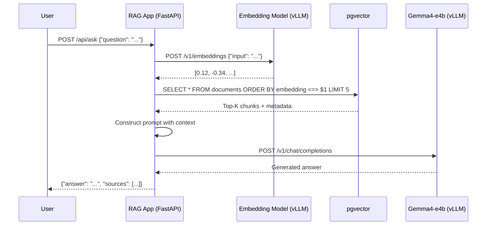

# L2-M1.4 -- End-to-End RAG Application

**Level:** Practitioner
**Duration:** 1 hour

## Overview

In the previous three lessons you deployed the individual pieces of a RAG system: a vector database with pgvector (L2-M1.2), an embedding model and LLM on vLLM (L1-M2), and a document ingestion pipeline that chunks, embeds, and stores documents (L2-M1.3). This lesson connects those pieces into a working application -- a FastAPI service deployed on OpenShift that accepts a user's question, retrieves relevant context from pgvector, augments the LLM prompt with that context, and returns a grounded answer with source citations.

Two approaches exist for building RAG applications on OpenShift AI. This lesson covers both conceptually and builds one hands-on.

## Prerequisites

- Completed: L2-M1.1 (RAG Architecture with OGX)
- Completed: L2-M1.2 (Vector Database Setup) -- pgvector running with embeddings stored, embedding model deployed on vLLM
- Completed: L2-M1.3 (Document Ingestion Pipeline) -- document chunks with embeddings ingested into pgvector
- LLM serving via vLLM (from L1-M2.2) -- Gemma4-e4b deployed with `/v1/chat/completions` endpoint
- OpenShift cluster running with `oc` CLI authenticated
- Python 3.10+

## Concepts

### Two Approaches to RAG on OpenShift AI

There are two distinct paths to building a RAG application on this platform. Which one you choose depends on whether the OGX Operator is available and how much control you need over the retrieval and generation pipeline.

---

#### Option A: OGX RAG API (Native)

OGX (Open GenAI Stack, formerly Llama Stack) provides built-in RAG capabilities through its Memory API and RAG API. If you enabled the `llamastackoperator` component in the `DataScienceCluster` CR (Technology Preview as of 3.5), the OGX distribution manages vector storage, embedding, retrieval, and generation behind a unified API.

The flow with OGX looks like:

1. **Register a memory bank** -- `POST /v1alpha/memory/banks` creates a vector store backed by pgvector or Milvus.
2. **Insert documents** -- `POST /v1alpha/memory/insert` parses, chunks, embeds, and stores documents into the memory bank.
3. **Query with RAG** -- `POST /v1alpha/inference/chat-completion` with `tool_choice: "rag"` automatically retrieves relevant context and augments the prompt.

```python
# OGX RAG in three API calls (conceptual)
import requests

OGX_URL = "http://ogx-server:5000"

# 1. Create a memory bank
requests.post(f"{OGX_URL}/v1alpha/memory/banks", json={
    "bank_id": "product-docs",
    "embedding_model": "nomic-embed-text",
    "chunk_size_in_tokens": 512,
    "provider_config": {"type": "pgvector", "connection_string": "..."}
})

# 2. Insert documents
requests.post(f"{OGX_URL}/v1alpha/memory/insert", json={
    "bank_id": "product-docs",
    "documents": [{"content": "...", "metadata": {"source": "manual.pdf"}}]
})

# 3. RAG query -- retrieval happens automatically
response = requests.post(f"{OGX_URL}/v1alpha/inference/chat-completion", json={
    "model": "gemma-4-e4b",
    "messages": [{"role": "user", "content": "What are the return policies?"}],
    "tool_choice": "rag",
    "tool_config": {"bank_ids": ["product-docs"]}
})
```

OGX abstracts away embedding, retrieval, and prompt construction. The trade-off is less control over the retrieval strategy, prompt template, and re-ranking logic. Because the operator is Technology Preview, this lesson does not build on it hands-on.

---

#### Option B: LangChain + vLLM + pgvector (Framework-Based)

The "manual" approach uses popular open-source libraries to build each stage of the RAG pipeline explicitly. This works on any OpenShift AI installation regardless of whether the OGX Operator is enabled, and gives you full control over every step. This is what we build in this lesson.

The components:

| Component | Role | What We Use |
|-----------|------|-------------|
| Embedding model | Convert queries to vectors | vLLM serving `nomic-embed-text` (deployed in L2-M1.2) |
| Vector database | Store and retrieve document chunks | pgvector (deployed in L2-M1.2) |
| LLM | Generate answers from context | vLLM serving Gemma4-e4b (deployed in L1-M2.2) |
| Application framework | REST API, request handling | FastAPI |
| HTTP client | Call vLLM endpoints | `httpx` |
| Database client | Query pgvector | `psycopg2` |

---

#### Option A vs Option B

| Aspect | OGX RAG API | LangChain + vLLM + pgvector |
|--------|-------------|------------------------------|
| Setup complexity | Lower (one operator manages everything) | Higher (you wire each component) |
| Control over retrieval | Limited (OGX manages internally) | Full (custom SQL, re-ranking, filtering) |
| Prompt engineering | OGX constructs the prompt | You write the prompt template |
| Maturity | Technology Preview (3.5) | GA components, production-proven libraries |
| Portability | Tied to OGX distribution | Works anywhere with Python + PostgreSQL |
| Best for | Rapid prototyping, standard RAG | Custom retrieval logic, production apps |

---

### The RAG Flow

The application we build follows this flow:



Each step in detail:

1. **Embed the query** -- The user's question is sent to the embedding model's `/v1/embeddings` endpoint. The returned vector is the query embedding.
2. **Similarity search** -- The query embedding is compared against all stored document chunk embeddings in pgvector using cosine distance. The top-K most similar chunks are returned.
3. **Construct the prompt** -- The retrieved chunks are injected into a system prompt that instructs the LLM to answer based on the provided context and cite sources.
4. **Generate the answer** -- The augmented prompt is sent to the LLM's `/v1/chat/completions` endpoint.
5. **Return the response** -- The application returns the LLM's answer along with the source documents/chunks used for retrieval.

---

### Retrieval: Similarity Search in pgvector

pgvector supports three distance operators for comparing vectors:

| Operator | Distance Metric | Use Case |
|----------|----------------|----------|
| `<=>` | Cosine distance | Best for normalized embeddings (most common) |
| `<->` | L2 (Euclidean) distance | When magnitude matters |
| `<#>` | Negative inner product | When embeddings are not normalized |

For RAG with embedding models like `nomic-embed-text`, cosine distance (`<=>`) is the standard choice because embedding models typically produce normalized vectors where direction (not magnitude) encodes meaning.

The retrieval query:

```sql
SELECT id, content, source, chunk_index,
       1 - (embedding <=> $1) AS similarity
FROM documents
WHERE 1 - (embedding <=> $1) > $2
ORDER BY embedding <=> $1
LIMIT $3;
```

Parameters:
- `$1` -- The query embedding vector
- `$2` -- Similarity threshold (e.g., 0.7). Chunks below this threshold are discarded even if they are in the top-K. This prevents low-quality context from polluting the prompt.
- `$3` -- Top-K limit (e.g., 5). The maximum number of chunks to retrieve.

**Choosing top-K:** A value of 3-5 works well for most applications. Too few chunks risk missing relevant context; too many chunks waste context window tokens and can confuse the LLM with redundant or loosely relevant information.

**Metadata filtering:** You can add `WHERE` clauses to filter by metadata before vector search. For example, restricting retrieval to a specific document source or date range:

```sql
WHERE source = 'product-manual-v2.pdf'
  AND 1 - (embedding <=> $1) > 0.7
ORDER BY embedding <=> $1
LIMIT 5;
```

---

### Augmented Generation: Constructing the Prompt

The quality of a RAG system depends heavily on how you present the retrieved context to the LLM. A well-structured prompt template has three parts:

1. **System instructions** -- Tell the LLM its role, how to use the context, and how to handle cases where the context does not contain the answer.
2. **Context block** -- The retrieved chunks, clearly delimited, with source metadata.
3. **User question** -- The original question, unchanged.

The prompt template used in `rag_app.py`:

```
You are a helpful assistant. Answer the user's question based ONLY on
the provided context. If the context does not contain enough information
to answer the question, say "I don't have enough information to answer
that question based on the available documents."

When you use information from the context, cite the source using
[Source: filename] format.

Context:
---
[Source: manual.pdf, Chunk 3]
The return policy allows returns within 30 days of purchase...
---
[Source: faq.pdf, Chunk 7]
Refunds are processed within 5-7 business days...
---
```

Key design decisions:

- **"Based ONLY on the provided context"** -- This instruction reduces hallucination by discouraging the LLM from using its parametric knowledge.
- **Explicit "I don't know" instruction** -- Prevents the LLM from fabricating answers when the context is insufficient.
- **Source citation format** -- Enables end users to verify the answer against the original document.
- **Delimited context blocks** -- The `---` separators help the LLM distinguish between different chunks.

**Context window limits:** Gemma4-e4b supports a context window of up to 128K tokens, but in practice you want to keep the context concise. Each chunk from ingestion (L2-M1.3) is typically 500-1000 tokens. With 5 chunks plus the system prompt and question, the total prompt is usually under 6000 tokens -- well within limits.

---

### Building the FastAPI Application

The `scripts/rag_app.py` file implements the complete RAG pipeline as a FastAPI application with three endpoints:

| Endpoint | Method | Purpose |
|----------|--------|---------|
| `/api/ask` | POST | Accepts a question, performs RAG, returns answer + sources |
| `/api/health` | GET | Health check for Kubernetes probes |
| `/` | GET | Simple HTML chat interface for testing |

The application reads all configuration from environment variables:

| Variable | Description | Default |
|----------|-------------|---------|
| `EMBEDDING_URL` | Base URL of the embedding model's vLLM endpoint | `http://embedding-model:8080` |
| `EMBEDDING_MODEL` | Model name for the `/v1/embeddings` call | `nomic-embed-text` |
| `LLM_URL` | Base URL of the LLM's vLLM endpoint | `http://gemma-4-e4b:8080` |
| `LLM_MODEL` | Model name for the `/v1/chat/completions` call | `gemma-4-e4b` |
| `DB_HOST` | pgvector hostname | `pgvector` |
| `DB_PORT` | pgvector port | `5432` |
| `DB_NAME` | Database name | `vectordb` |
| `DB_USER` | Database username | `vectordb` |
| `DB_PASSWORD` | Database password | `vectordb` |
| `TOP_K` | Number of chunks to retrieve | `5` |
| `SIMILARITY_THRESHOLD` | Minimum cosine similarity to include a chunk | `0.7` |

## Step-by-Step

### Step 1: Review the RAG Application Code

Examine the FastAPI application that implements the RAG pipeline:

```bash
cat /path/to/this/lesson/scripts/rag_app.py
```

The application has four key functions:

1. `get_query_embedding(question)` -- Calls the embedding model to convert the question to a vector.
2. `search_similar_chunks(embedding)` -- Queries pgvector for the most similar document chunks.
3. `generate_answer(question, context_chunks)` -- Constructs the augmented prompt and calls the LLM.
4. `ask(request)` -- The `/api/ask` endpoint that orchestrates the full RAG flow.

Read through `scripts/rag_app.py` in this lesson directory. The code is annotated with comments explaining each step.

### Step 2: Build the Container Image

The RAG application needs to be containerized before deploying to OpenShift. Use OpenShift's built-in build system (`oc new-build`) to build from the Python script:

First, create a `requirements.txt` file for the build:

```bash
cat <<'EOF' > /tmp/requirements.txt
fastapi==0.115.0
uvicorn==0.30.0
psycopg2-binary==2.9.9
httpx==0.27.0
EOF
```

Create a minimal `Dockerfile` for the build:

```bash
cat <<'EOF' > /tmp/Dockerfile
FROM registry.access.redhat.com/ubi9/python-311:latest

WORKDIR /opt/app-root/src

COPY requirements.txt .
RUN pip install --no-cache-dir -r requirements.txt

COPY rag_app.py .

EXPOSE 8080

CMD ["uvicorn", "rag_app:app", "--host", "0.0.0.0", "--port", "8080"]
EOF
```

Copy the application script alongside the Dockerfile:

```bash
cp scripts/rag_app.py /tmp/rag_app.py
```

Create a new build in OpenShift using the binary build strategy:

```bash
oc project rag-app
```

If the project does not exist yet:

```bash
oc new-project rag-app --display-name="RAG Application"
```

Create the BuildConfig and start the build:

```bash
oc new-build --name=rag-app --binary --strategy=docker -l app=rag-app
```

Expected output:

```
--> Found Docker image ...
    * A Docker build using binary input will be created
    * The resulting image will be pushed to image stream tag "rag-app:latest"
    ...
--> Creating resources with label app=rag-app ...
    imagestream.image.openshift.io "rag-app" created
    buildconfig.build.openshift.io "rag-app" created
--> Success
```

Start the build, uploading the local files:

```bash
oc start-build rag-app --from-dir=/tmp/ --follow
```

This uploads the `Dockerfile`, `requirements.txt`, and `rag_app.py` to the cluster, builds the image, and pushes it to the internal image registry. Wait for the build to complete:

```
...
Successfully pushed image-registry.openshift-image-registry.svc:5000/rag-app/rag-app:latest
Push successful
```

### Step 3: Create Configuration

Before deploying, create a ConfigMap and Secret with the connection details for the embedding model, LLM, and pgvector.

Create the ConfigMap for non-sensitive configuration:

```bash
oc create configmap rag-app-config \
  --from-literal=EMBEDDING_URL=http://embedding-model.gemma-model.svc.cluster.local:8080 \
  --from-literal=EMBEDDING_MODEL=nomic-embed-text \
  --from-literal=LLM_URL=http://gemma-4-e4b.gemma-model.svc.cluster.local:8080 \
  --from-literal=LLM_MODEL=gemma-4-e4b \
  --from-literal=DB_HOST=pgvector.pgvector.svc.cluster.local \
  --from-literal=DB_PORT=5432 \
  --from-literal=DB_NAME=vectordb \
  --from-literal=DB_USER=vectordb \
  --from-literal=TOP_K=5 \
  --from-literal=SIMILARITY_THRESHOLD=0.7
```

> **Note:** Adjust the service hostnames to match your actual deployment namespaces from L2-M1.2 and L1-M2.2. The format is `<service-name>.<namespace>.svc.cluster.local`.

Create a Secret for the database password:

```bash
oc create secret generic rag-app-db-secret \
  --from-literal=DB_PASSWORD=vectordb
```

### Step 4: Deploy the RAG Application

Apply the deployment manifest:

```bash
oc apply -f manifests/rag-app-deployment.yaml
```

The manifest references the image built in Step 2, the ConfigMap from Step 3, and the Secret for the database password. Review it before applying:

```bash
cat manifests/rag-app-deployment.yaml
```

Key details in the manifest:
- `image` points to the internal registry image stream (`rag-app:latest`).
- Environment variables are loaded from the ConfigMap (`rag-app-config`) and Secret (`rag-app-db-secret`).
- Readiness and liveness probes hit `/api/health` on port 8080.
- Resource requests are modest (256Mi / 100m CPU) since the application itself does not run inference -- it delegates to the vLLM endpoints.

Wait for the pod to become ready:

```bash
oc rollout status deployment/rag-app --timeout=120s
```

Expected output:

```
deployment "rag-app" successfully rolled out
```

### Step 5: Expose the Service and Route

Apply the Service and Route manifests:

```bash
oc apply -f manifests/rag-app-service.yaml
oc apply -f manifests/rag-app-route.yaml
```

Verify the Service:

```bash
oc get svc rag-app
```

Expected output:

```
NAME      TYPE        CLUSTER-IP      EXTERNAL-IP   PORT(S)    AGE
rag-app   ClusterIP   172.30.x.x      <none>        8080/TCP   10s
```

Get the Route URL:

```bash
RAG_URL=$(oc get route rag-app -o jsonpath='{.spec.host}')
echo "RAG App URL: https://${RAG_URL}"
```

### Step 6: Test the RAG Application

Test the health endpoint:

```bash
curl -s https://${RAG_URL}/api/health | python3 -m json.tool
```

Expected output:

```json
{
    "status": "healthy"
}
```

Ask a question using the RAG endpoint:

```bash
curl -s -X POST https://${RAG_URL}/api/ask \
  -H "Content-Type: application/json" \
  -d '{"question": "What are the top-selling products?"}' \
  | python3 -m json.tool
```

Expected output (content depends on your ingested documents):

```json
{
    "answer": "Based on the available documents, the top-selling products include... [Source: sales-report-2024.pdf]",
    "sources": [
        {
            "source": "sales-report-2024.pdf",
            "chunk_index": 3,
            "similarity": 0.89,
            "content_preview": "The top-selling products in Q4 2024 were..."
        },
        {
            "source": "product-catalog.pdf",
            "chunk_index": 12,
            "similarity": 0.82,
            "content_preview": "Product performance metrics show..."
        }
    ],
    "chunks_retrieved": 2
}
```

Try the web chat interface by opening the Route URL in your browser:

```bash
echo "Open in browser: https://${RAG_URL}"
```

The root URL (`/`) serves a simple HTML page with a text input and submit button. Type a question and see the RAG response rendered in the browser.

### Step 7: Test with curl -- Exploring Retrieval Behavior

Test how the system handles questions with no relevant context in the database:

```bash
curl -s -X POST https://${RAG_URL}/api/ask \
  -H "Content-Type: application/json" \
  -d '{"question": "What is the airspeed velocity of an unladen swallow?"}' \
  | python3 -m json.tool
```

Expected output (no relevant chunks found):

```json
{
    "answer": "I don't have enough information to answer that question based on the available documents.",
    "sources": [],
    "chunks_retrieved": 0
}
```

This demonstrates the similarity threshold in action -- when no chunks exceed the configured `SIMILARITY_THRESHOLD` (0.7 by default), the LLM receives no context and follows the system prompt's instruction to decline.

### Step 8: Test in GenAI Playground (Optional)

If you have the GenAI Playground available (requires `dashboard` + `kserve` components, GA in 3.3+), you can test the same LLM interactively:

1. Open the OpenShift AI Dashboard.
2. Navigate to **Gen AI Studio** > **Playground**.
3. Select the Gemma4-e4b model endpoint.
4. Enter a question and compare the response with and without RAG context.

The Playground sends requests directly to the vLLM endpoint without the RAG retrieval layer. This comparison highlights the value of RAG: the Playground response uses only parametric knowledge (what the model learned during training), while the RAG application response is grounded in your specific documents.

## Verification

Confirm the RAG application is fully operational:

1. Deployment is running with all pods ready:

```bash
oc get deployment rag-app -o jsonpath='{.status.readyReplicas}'
```

Expected: `1`.

2. Service is routing traffic:

```bash
oc get endpoints rag-app
```

Expected: One endpoint IP listed.

3. Route is accessible:

```bash
curl -s -o /dev/null -w "%{http_code}" https://${RAG_URL}/api/health
```

Expected: `200`.

4. End-to-end RAG flow works:

```bash
curl -s -X POST https://${RAG_URL}/api/ask \
  -H "Content-Type: application/json" \
  -d '{"question": "Summarize the main topics in the documents."}' \
  | python3 -c "import sys,json; r=json.load(sys.stdin); print(f'Answer length: {len(r[\"answer\"])} chars, Sources: {r[\"chunks_retrieved\"]}')"
```

Expected: A non-zero answer length and at least 1 source retrieved (assuming documents were ingested in L2-M1.3).

## Key Takeaways

- **Two RAG approaches on OpenShift AI:** OGX provides a native RAG API that abstracts away the retrieval pipeline (Technology Preview), while the LangChain/FastAPI approach gives full control over every step and works on any installation.
- **Cosine distance (`<=>`) is the standard retrieval operator** in pgvector for normalized embeddings. A similarity threshold (e.g., 0.7) prevents low-quality context from reaching the LLM.
- **Prompt construction is critical.** Instructing the LLM to answer "based ONLY on the provided context" and to cite sources significantly reduces hallucination and improves answer verifiability.
- **The RAG application is a thin orchestration layer.** It does not run any inference itself -- it calls the embedding model and LLM endpoints deployed on vLLM via their OpenAI-compatible APIs. This separation means the application pod needs minimal resources (256Mi RAM, no GPU).
- **OpenShift's build system simplifies containerization.** Binary builds with `oc new-build` and `oc start-build --from-dir` let you build and push container images without a local Docker/Podman daemon or external registry.

## Cleanup

Remove the RAG application resources:

```bash
# Delete the deployment, service, and route
oc delete -f manifests/rag-app-route.yaml
oc delete -f manifests/rag-app-service.yaml
oc delete -f manifests/rag-app-deployment.yaml

# Delete the configuration
oc delete configmap rag-app-config
oc delete secret rag-app-db-secret

# Delete the build artifacts
oc delete buildconfig rag-app
oc delete imagestream rag-app

# Optionally delete the project entirely
# oc delete project rag-app
```

Keep pgvector, the embedding model, and the LLM running -- they are used in the next lesson.

## Next Steps

In [L2-M1.5 -- RAG Evaluation](../5_rag_evaluation/), you will build an evaluation pipeline that measures retrieval quality (precision@k, recall@k, MRR) and generation quality (faithfulness, relevance) for this RAG application, compare different chunking strategies, and track evaluation results in MLflow.
