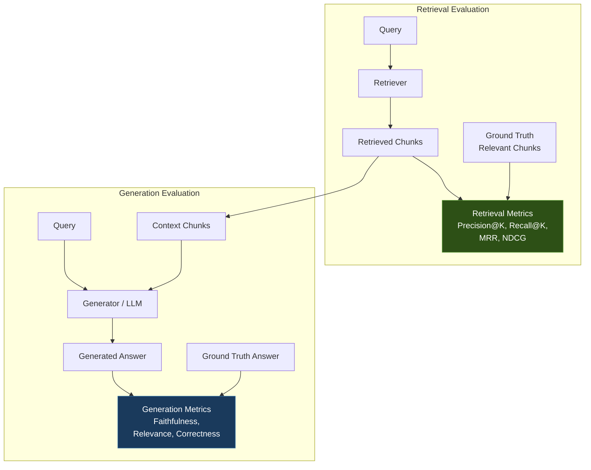

# L2-M1.5 -- RAG Evaluation

**Level:** Practitioner
**Duration:** 45 min

## Overview

You have a working RAG application deployed on OpenShift (L2-M1.4). Users ask questions, documents get retrieved, answers get generated. But how do you know if the answers are good? RAG systems have multiple independent failure modes -- bad retrieval (wrong chunks), bad generation (hallucination despite good context), or both -- and without systematic evaluation you are guessing which component to improve. This lesson builds an evaluation pipeline that measures both retrieval quality and generation quality, compares chunking strategies, and tracks results in MLflow.

## Prerequisites

- Completed: [L2-M1.1 -- RAG Architecture](../1_rag_architecture_ogx/), [L2-M1.2 -- Vector Database Setup](../2_vector_database/), [L2-M1.3 -- Document Ingestion Pipeline](../3_document_ingestion/), [L2-M1.4 -- End-to-End RAG Application](../4_end_to_end_rag/)
- pgvector running with document chunks ingested (from L2-M1.3)
- Embedding model and LLM deployed on vLLM (from L1-M2 and L2-M1.2)
- OpenShift cluster running with `oc` CLI authenticated
- Python 3.11+
- Familiarity with information retrieval metrics and LLM evaluation concepts

## Concepts

### Why Evaluate RAG?

A RAG demo that works on five hand-picked questions is not a production system. In production, users ask ambiguous questions, documents get updated, chunking strategies change, and LLMs get swapped. Without systematic evaluation, you cannot answer basic questions:

- Is our retrieval finding the right documents?
- Is the LLM using the retrieved context or hallucinating?
- Did the new chunking strategy improve or degrade answers?
- Is the 512-chunk-size configuration better than 256?

Evaluation is the difference between "it seems to work" and "we measured a 15% improvement in answer accuracy after switching to document-aware chunking." It makes RAG engineering empirical instead of anecdotal.

---

### Evaluation Dimensions

RAG evaluation has two independent dimensions. This independence is critical -- you can have excellent retrieval with poor generation (the LLM ignores good context), or poor retrieval with seemingly good generation (the LLM answers from training data, not from your documents).



The evaluation dataset provides the bridge between the two dimensions. For each question, you need:
- The expected relevant chunks (for retrieval evaluation)
- The expected answer (for generation evaluation)

---

### Retrieval Metrics

Retrieval metrics measure how well the vector search finds the right documents. All of these come from information retrieval theory and are adapted here for RAG evaluation.

#### Precision@K

Of the K documents retrieved, how many are actually relevant?

```
precision@K = |relevant documents in top K| / K
```

**Intuition:** If you retrieve 5 chunks and 3 of them are relevant, precision@5 = 0.6. High precision means the retriever is not wasting context window tokens on irrelevant chunks.

**Example:**
- Retrieved: [chunk_A, chunk_B, chunk_C, chunk_D, chunk_E]
- Relevant:  {chunk_A, chunk_C, chunk_F}
- precision@5 = 2/5 = 0.4 (chunk_A and chunk_C are relevant, chunk_F was missed)

#### Recall@K

Of all relevant documents in the database, how many did we find in the top K?

```
recall@K = |relevant documents in top K| / |total relevant documents|
```

**Intuition:** If there are 4 relevant chunks in the database and you retrieve 3 of them in top-5, recall@5 = 0.75. High recall means the retriever is not missing important context.

**Example:**
- Retrieved top-5: [chunk_A, chunk_B, chunk_C, chunk_D, chunk_E]
- All relevant: {chunk_A, chunk_C, chunk_F, chunk_G}
- recall@5 = 2/4 = 0.5 (found chunk_A and chunk_C, missed chunk_F and chunk_G)

#### MRR (Mean Reciprocal Rank)

How high is the first relevant document ranked? Averaged across all queries.

```
MRR = mean(1 / rank_of_first_relevant_document)
```

**Intuition:** If the first relevant chunk is ranked #1, the reciprocal rank is 1.0. If it is ranked #3, the reciprocal rank is 0.33. MRR rewards retrievers that put at least one relevant document at the top.

**Example across 3 queries:**
- Query 1: first relevant at position 1 -> 1/1 = 1.0
- Query 2: first relevant at position 3 -> 1/3 = 0.33
- Query 3: first relevant at position 2 -> 1/2 = 0.5
- MRR = (1.0 + 0.33 + 0.5) / 3 = 0.61

#### NDCG@K (Normalized Discounted Cumulative Gain)

Do more relevant documents appear higher in the ranking? NDCG accounts for the position of every relevant document, not just the first one.

```
DCG@K  = sum(relevance_i / log2(i + 1))   for i = 1..K
IDCG@K = DCG@K for the ideal (perfect) ranking
NDCG@K = DCG@K / IDCG@K
```

**Intuition:** A retriever that puts relevant documents at positions 1, 2, 3 gets a higher NDCG than one that puts them at positions 3, 4, 5 -- even though both found the same number of relevant documents. NDCG ranges from 0 to 1, where 1 means the ranking is perfect.

#### Retrieval Metrics Summary

| Metric | What It Measures | Range | Sensitive To |
|--------|-----------------|-------|-------------|
| **Precision@K** | Fraction of retrieved docs that are relevant | 0-1 | Irrelevant chunks in results |
| **Recall@K** | Fraction of relevant docs that were retrieved | 0-1 | Missed relevant chunks |
| **MRR** | Position of first relevant doc | 0-1 | Whether top result is relevant |
| **NDCG@K** | Quality of the full ranking | 0-1 | Position of all relevant docs |

For RAG, **recall is usually more important than precision** -- it is better to retrieve a few irrelevant chunks (which the LLM can ignore) than to miss relevant chunks (which leaves the LLM without necessary context). However, low precision wastes context window tokens and can confuse the LLM with noise.

---

### Generation Metrics

Generation metrics measure the quality of the LLM's output given the retrieved context. Unlike retrieval metrics, these often require an LLM-as-judge approach -- using a separate LLM call to evaluate the answer.

#### Faithfulness

Does the answer use only information from the provided context? An answer is unfaithful if it includes claims not supported by the context (hallucination).

**How to measure:** Extract individual claims from the answer, then check each claim against the context. The faithfulness score is the fraction of claims supported by the context.

```
faithfulness = |claims supported by context| / |total claims in answer|
```

**LLM-as-judge approach:** Send the answer and context to an LLM with a prompt like "For each claim in the answer, determine if it is supported by the context. Return a score from 0 to 1." This is an automated approximation of manual evaluation.

**Why it matters:** High faithfulness means the RAG system is grounding its answers in the documents, not hallucinating. This is the primary metric for trustworthiness.

#### Answer Relevance

Does the answer actually address the question asked? An answer can be faithful to the context but miss the point of the question entirely.

**How to measure:** Ask an LLM judge "On a scale of 0 to 1, how well does this answer address the question?" A more rigorous approach generates multiple questions from the answer and measures their similarity to the original question.

**Why it matters:** A RAG system that retrieves chunks about "OpenShift routes" when the user asked about "OpenShift builds" will produce a faithful but irrelevant answer. Relevance catches this.

#### Correctness

Is the answer factually correct compared to a known ground truth answer?

**How to measure:** Compare the generated answer to a human-written reference answer. This can be done with string-based metrics (BLEU, ROUGE) or with an LLM judge that scores semantic equivalence.

**Why it matters:** Correctness is the ultimate metric, but it requires ground truth answers, which are expensive to produce. Use it when you have a curated evaluation dataset.

#### Generation Metrics Summary

| Metric | What It Measures | Requires | Evaluation Method |
|--------|-----------------|----------|-------------------|
| **Faithfulness** | Grounding in context | Context + answer | LLM-as-judge |
| **Relevance** | Answer addresses the question | Question + answer | LLM-as-judge |
| **Correctness** | Factual accuracy | Ground truth answer | LLM-as-judge or string metrics |

---

### Building an Evaluation Dataset

An evaluation dataset is a set of (question, ground_truth_answer, relevant_chunk_ids) triples. The quality of your evaluation is bounded by the quality of this dataset.

Each entry contains:

| Field | Purpose | Example |
|-------|---------|---------|
| `question` | The test query | "What serving runtimes does OpenShift AI support?" |
| `ground_truth_answer` | Expected correct answer | "OpenShift AI supports vLLM, OpenVINO Model Server, and MLServer." |
| `relevant_chunk_ids` | IDs of chunks that should be retrieved | [12, 15, 23] |

**Methods for creating evaluation datasets:**

1. **Manual curation** -- Domain experts write questions and answers from the source documents. Highest quality but slowest. Start with 20-50 pairs for initial evaluation.

2. **LLM-generated pairs** -- Feed source documents to an LLM with the prompt "Generate 5 question-answer pairs from this text." Faster but noisier -- the LLM may generate trivial questions or incorrect answers. Always review LLM-generated pairs before using them.

3. **Hybrid approach** -- Use an LLM to generate candidate pairs, then have domain experts review and correct them. Best balance of speed and quality.

For this lesson, the evaluation script includes 5-8 inline evaluation pairs about OpenShift AI topics that match the sample documents ingested in L2-M1.3.

---

### Tracking Evaluation with MLflow

MLflow is the standard experiment tracking platform on OpenShift AI. It is available as a Tier 2 dashboard feature (`modelregistry` component) and can also be deployed standalone. MLflow provides:

- **Experiment tracking** -- Log parameters, metrics, and artifacts for each evaluation run.
- **Comparison** -- Compare metrics across runs with different configurations (chunking strategy, chunk size, top-K, model).
- **Reproducibility** -- Every run records the exact configuration used, so you can reproduce results.

The evaluation script logs:

| Category | What is Logged | Example |
|----------|---------------|---------|
| **Parameters** | Configuration for this run | `chunk_strategy=fixed`, `chunk_size=512`, `top_k=5` |
| **Metrics** | Aggregated evaluation scores | `avg_precision=0.72`, `avg_faithfulness=0.85` |
| **Artifacts** | Full evaluation results | `evaluation_results.json` (per-question breakdown) |

By running the evaluation script multiple times with different configurations and viewing results in the MLflow UI, you can make data-driven decisions about which chunking strategy, chunk size, or top-K value produces the best retrieval and generation quality.

---

### Comparing RAG Configurations

The primary use case for RAG evaluation is comparing configurations. A typical comparison evaluates two or three chunking strategies on the same evaluation dataset:

| Configuration | chunk_strategy | chunk_size | overlap | top_k |
|---------------|---------------|------------|---------|-------|
| Run A | fixed | 256 | 50 | 5 |
| Run B | fixed | 512 | 100 | 5 |
| Run C | semantic | -- | -- | 5 |

After running the evaluation script for each configuration, you compare the metrics:

| Metric | Run A (fixed-256) | Run B (fixed-512) | Run C (semantic) |
|--------|-------------------|-------------------|------------------|
| avg_precision@5 | 0.56 | 0.68 | 0.72 |
| avg_recall@5 | 0.80 | 0.70 | 0.75 |
| avg_mrr | 0.73 | 0.82 | 0.85 |
| avg_faithfulness | 0.78 | 0.83 | 0.86 |
| avg_relevance | 0.81 | 0.85 | 0.88 |

From this comparison, you can observe:
- **Smaller chunks (Run A)** have higher recall (more chunks means more chances to match) but lower precision (more noise).
- **Larger chunks (Run B)** improve precision and faithfulness (more context per chunk) but may miss some relevant chunks.
- **Semantic chunks (Run C)** often produce the best balance across metrics because chunk boundaries align with natural language boundaries.

These numbers are illustrative -- your actual results will depend on your documents and queries.

## Step-by-Step

### Step 1: Verify Prerequisites

Confirm the services from previous lessons are running:

```bash
oc project rag-demo
```

Check pgvector:

```bash
oc get pods -l app=pgvector
```

Expected output:

```
NAME                       READY   STATUS    RESTARTS   AGE
pgvector-0                 1/1     Running   0          2h
```

Verify that chunks exist from the ingestion pipeline (L2-M1.3):

```bash
oc exec pgvector-0 -- psql -U vectordb -d vectordb -c "SELECT COUNT(*) AS total_chunks FROM document_chunks;"
```

Expected: A number greater than 0.

Verify the embedding model and LLM are serving:

```bash
oc get inferenceservice embedding-model -o jsonpath='{.status.conditions[?(@.type=="Ready")].status}'
oc get inferenceservice gemma-4-e4b -o jsonpath='{.status.conditions[?(@.type=="Ready")].status}'
```

Expected: `True` for both.

### Step 2: Review the Evaluation Script

Examine the evaluation script in this lesson:

```bash
cat scripts/rag_evaluation.py
```

Key sections:

1. **Evaluation dataset** -- Inline Q&A pairs with ground truth answers and relevant chunk IDs.
2. **Retrieval metric functions** -- `precision_at_k()`, `recall_at_k()`, `mrr()`, `ndcg_at_k()`.
3. **Generation metric functions** -- `faithfulness_score()` and `relevance_score()` using LLM-as-judge.
4. **Evaluation pipeline** -- For each question: embed, retrieve, generate, compute metrics.
5. **MLflow integration** -- Log parameters, metrics, and artifacts.

### Step 3: Get Service Endpoints

Retrieve the internal URLs for the embedding model and LLM:

```bash
EMBEDDING_URL=$(oc get service -l app=embedding-model -o jsonpath='http://{.items[0].metadata.name}:8080')
echo "Embedding URL: ${EMBEDDING_URL}"

LLM_URL=$(oc get service -l app=gemma-4-e4b -o jsonpath='http://{.items[0].metadata.name}:8080')
echo "LLM URL: ${LLM_URL}"
```

If MLflow is deployed, get its URL:

```bash
MLFLOW_URL=$(oc get route mlflow -o jsonpath='http://{.spec.host}' 2>/dev/null || echo "http://mlflow:5000")
echo "MLflow URL: ${MLFLOW_URL}"
```

### Step 4: Run Evaluation for Fixed-Size Chunking (512)

Run the evaluation script against chunks produced by the fixed-size strategy from L2-M1.3:

```bash
oc run eval-fixed-512 --rm -it --restart=Never \
  --image=registry.access.redhat.com/ubi9/python-311 \
  --env="EMBEDDING_URL=http://embedding-model:8080" \
  --env="LLM_URL=http://gemma-4-e4b:8080" \
  --env="DB_HOST=pgvector" \
  --env="DB_PORT=5432" \
  --env="DB_NAME=vectordb" \
  --env="DB_USER=vectordb" \
  --env="DB_PASSWORD=vectordb" \
  -- bash -c "
    pip install -q psycopg2-binary requests numpy mlflow &&
    python3 /dev/stdin \
      --embedding-url http://embedding-model:8080 \
      --llm-url http://gemma-4-e4b:8080 \
      --db-host pgvector \
      --db-name vectordb \
      --db-user vectordb \
      --db-password vectordb \
      --top-k 5 \
      --chunk-strategy fixed-512 \
      --experiment-name rag-evaluation
  " < scripts/rag_evaluation.py
```

Expected output (abridged):

```
[INFO] Starting RAG evaluation pipeline
[INFO] Experiment: rag-evaluation | Run label: fixed-512
[INFO] Evaluating question 1/6: What serving runtimes does OpenShift AI support?
[INFO]   Retrieved 5 chunks (top match similarity: 0.87)
[INFO]   Retrieval: precision@5=0.60 recall@5=0.67 mrr=1.00
[INFO]   Generation: faithfulness=0.85 relevance=0.90
...
[INFO] === Aggregate Results ===
[INFO]   avg_precision@5: 0.63
[INFO]   avg_recall@5:    0.72
[INFO]   avg_mrr:         0.78
[INFO]   avg_ndcg@5:      0.74
[INFO]   avg_faithfulness: 0.82
[INFO]   avg_relevance:    0.86
[INFO] Results logged to MLflow experiment: rag-evaluation
```

### Step 5: Run Evaluation for Semantic Chunking

Run the same evaluation against semantically chunked data:

```bash
oc run eval-semantic --rm -it --restart=Never \
  --image=registry.access.redhat.com/ubi9/python-311 \
  --env="EMBEDDING_URL=http://embedding-model:8080" \
  --env="LLM_URL=http://gemma-4-e4b:8080" \
  --env="DB_HOST=pgvector" \
  --env="DB_PORT=5432" \
  --env="DB_NAME=vectordb" \
  --env="DB_USER=vectordb" \
  --env="DB_PASSWORD=vectordb" \
  -- bash -c "
    pip install -q psycopg2-binary requests numpy mlflow &&
    python3 /dev/stdin \
      --embedding-url http://embedding-model:8080 \
      --llm-url http://gemma-4-e4b:8080 \
      --db-host pgvector \
      --db-name vectordb \
      --db-user vectordb \
      --db-password vectordb \
      --top-k 5 \
      --chunk-strategy semantic \
      --experiment-name rag-evaluation
  " < scripts/rag_evaluation.py
```

### Step 6: Run Evaluation for Document-Aware Chunking

```bash
oc run eval-docaware --rm -it --restart=Never \
  --image=registry.access.redhat.com/ubi9/python-311 \
  --env="EMBEDDING_URL=http://embedding-model:8080" \
  --env="LLM_URL=http://gemma-4-e4b:8080" \
  --env="DB_HOST=pgvector" \
  --env="DB_PORT=5432" \
  --env="DB_NAME=vectordb" \
  --env="DB_USER=vectordb" \
  --env="DB_PASSWORD=vectordb" \
  -- bash -c "
    pip install -q psycopg2-binary requests numpy mlflow &&
    python3 /dev/stdin \
      --embedding-url http://embedding-model:8080 \
      --llm-url http://gemma-4-e4b:8080 \
      --db-host pgvector \
      --db-name vectordb \
      --db-user vectordb \
      --db-password vectordb \
      --top-k 5 \
      --chunk-strategy document-aware \
      --experiment-name rag-evaluation
  " < scripts/rag_evaluation.py
```

### Step 7: Compare Results in MLflow

If MLflow is deployed, open the MLflow UI to compare the three evaluation runs:

```bash
MLFLOW_ROUTE=$(oc get route mlflow -o jsonpath='{.spec.host}' 2>/dev/null)
echo "MLflow UI: https://${MLFLOW_ROUTE}"
```

In the MLflow UI:
1. Navigate to the **rag-evaluation** experiment.
2. Select all three runs (fixed-512, semantic, document-aware).
3. Click **Compare** to see metrics side by side.
4. Look at the bar charts for `avg_precision`, `avg_recall`, `avg_faithfulness`, and `avg_relevance`.

If MLflow is not deployed, the script prints aggregate results to stdout (as shown in Step 4). You can compare by running each evaluation and noting the metrics.

### Step 8: Interpret the Results

Query the evaluation results directly from the script output or MLflow. The key questions to answer:

**Retrieval quality:**
- Which strategy has the highest recall@5? (Are we finding the right chunks?)
- Which strategy has the highest precision@5? (Are we avoiding irrelevant chunks?)
- Which strategy has the highest MRR? (Is the first retrieved chunk relevant?)

**Generation quality:**
- Which strategy produces the highest faithfulness? (Is the LLM grounding answers in context?)
- Which strategy produces the highest relevance? (Are answers addressing the question?)

**Common patterns:**
- If recall is high but faithfulness is low, the retriever is finding the right chunks but the LLM is ignoring them -- investigate the prompt template.
- If recall is low but faithfulness is high, the retriever is missing relevant chunks but the LLM is being careful with what it has -- focus on improving retrieval.
- If precision is low, too many irrelevant chunks are polluting the context -- consider a higher similarity threshold or re-ranking.

## Verification

Confirm the evaluation pipeline ran successfully:

1. The evaluation script completed without errors for at least one chunking strategy:

```bash
echo "If the oc run commands above exited with code 0, evaluation succeeded."
```

2. If MLflow is deployed, verify runs were logged:

```bash
oc run mlflow-check --rm -it --restart=Never \
  --image=registry.access.redhat.com/ubi9/python-311 \
  -- bash -c "
    pip install -q mlflow &&
    python3 -c \"
import mlflow
mlflow.set_tracking_uri('http://mlflow:5000')
experiment = mlflow.get_experiment_by_name('rag-evaluation')
if experiment:
    runs = mlflow.search_runs(experiment_ids=[experiment.experiment_id])
    print(f'Total runs: {len(runs)}')
    print(runs[['params.chunk_strategy', 'metrics.avg_precision_at_k', 'metrics.avg_faithfulness']].to_string())
else:
    print('No experiment found. MLflow may not be deployed.')
\"
  "
```

Expected: At least one run with chunk_strategy and metrics columns populated.

3. Verify the evaluation dataset was logged as an artifact:

```bash
echo "Check the MLflow UI Artifacts tab for evaluation_results.json"
```

## Key Takeaways

- **RAG evaluation has two independent dimensions:** retrieval quality (are we finding the right chunks?) and generation quality (is the LLM producing accurate answers from the context?). Evaluating only one dimension misses half the failure modes.
- **Retrieval metrics come from information retrieval theory.** Precision@K measures noise in results, recall@K measures missed relevant documents, MRR measures first-hit position, and NDCG@K measures overall ranking quality. For RAG, recall is usually more important than precision.
- **Generation metrics require LLM-as-judge.** Faithfulness (grounding in context) and relevance (addressing the question) are evaluated by asking a separate LLM to score the answer. This is an approximation, but it scales better than manual evaluation.
- **Evaluation datasets are the bottleneck.** The quality of your evaluation is bounded by the quality of your Q&A pairs. Start with 20-50 manually curated pairs. LLM-generated pairs are faster but noisier -- always review them.
- **MLflow provides the infrastructure for systematic comparison.** Log parameters, metrics, and artifacts for each run. Compare chunking strategies, chunk sizes, and top-K values using data, not intuition.
- **Evaluation is iterative.** Run the baseline, change one variable (chunk size, strategy, top-K), re-evaluate, compare. This empirical loop is what turns a RAG demo into a production system.

## Cleanup

The evaluation runs used temporary pods that are auto-deleted (`--rm`). No persistent resources were created in this lesson.

If you want to clean up the MLflow experiment:

```bash
# Delete the experiment (if MLflow is deployed)
oc run mlflow-cleanup --rm -it --restart=Never \
  --image=registry.access.redhat.com/ubi9/python-311 \
  -- bash -c "
    pip install -q mlflow &&
    python3 -c \"
import mlflow
mlflow.set_tracking_uri('http://mlflow:5000')
experiment = mlflow.get_experiment_by_name('rag-evaluation')
if experiment:
    mlflow.delete_experiment(experiment.experiment_id)
    print('Experiment deleted.')
else:
    print('No experiment found.')
\"
  "
```

Keep pgvector, the embedding model, and the LLM running -- they are used in the next lesson.

## Next Steps

In [L2-M1.6 -- AutoRAG: Automated RAG Optimization](../6_autorag_dashboard/), you will use OpenShift AI's AutoRAG dashboard feature to automate the evaluation and optimization process covered in this lesson. AutoRAG uses the OGX operator to systematically search the configuration space (chunking strategy, chunk size, embedding model, retrieval parameters) and find the optimal RAG configuration for your dataset.
