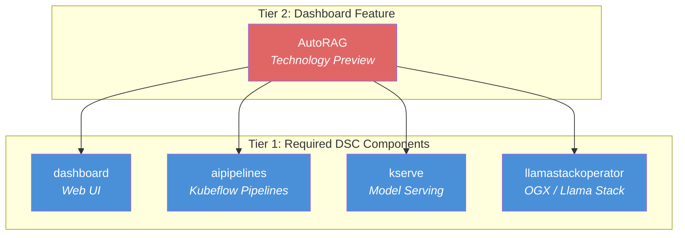
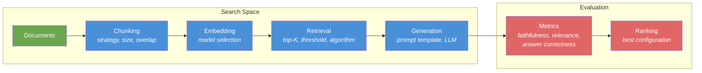
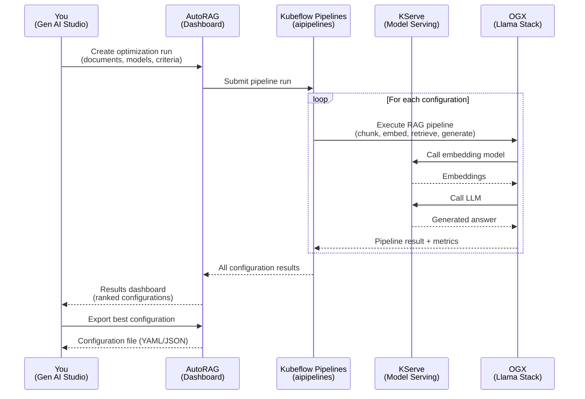

# L2-M1.6 -- AutoRAG: Automated RAG Optimization

**Level:** Practitioner
**Duration:** 45 min

## Overview

In the previous lessons you built a RAG pipeline by hand -- choosing a chunking strategy, selecting an embedding model, tuning retrieval parameters, and evaluating the results. That process works, but it is labor-intensive and explores only a small corner of the configuration space. AutoRAG is an OpenShift AI feature (Technology Preview, available in 3.4+) that automates this search: you provide documents and models, and AutoRAG systematically tests combinations of chunking strategies, embedding models, retrieval parameters, and prompt templates to find the configuration that scores best on your evaluation criteria.

This is a dashboard-driven lesson. You will work entirely through the OpenShift AI web UI (Gen AI Studio) -- no manifests or CLI commands are needed.

## Prerequisites

- Completed: L2-M1.1 through L2-M1.5 (RAG Architecture, Vector Database, Document Ingestion, End-to-End RAG, RAG Evaluation)
- Sub-tutorial: `tutorial_ai/autorag/` (assumes basic AutoRAG familiarity)
- OpenShift AI 3.4+ with the following Tier 1 components enabled: `dashboard`, `aipipelines`, `kserve`, `llamastackoperator`
- At least one model deployed via KServe (from L2-M1.1 or L2-M1.4)
- Documents available for ingestion (from L2-M1.3 or your own dataset)

## Concepts

### What Is AutoRAG?

AutoRAG automates the process of finding the optimal RAG configuration. Rather than manually iterating through configurations as you did in L2-M1.2 through L2-M1.5, AutoRAG systematically tests different combinations of:

- **Chunking strategies and parameters** -- chunk size, overlap, splitting method (sentence, paragraph, recursive character)
- **Embedding models** -- which model produces the best vector representations for your documents
- **Retrieval parameters** -- top-K values, similarity thresholds, retrieval algorithms
- **Prompt templates** -- how retrieved context is injected into the LLM prompt

For each combination, AutoRAG runs the full retrieval-generation pipeline, evaluates the output against a set of metrics (the same kinds of metrics you used in L2-M1.5), and ranks the configurations. The result is a recommended configuration you can export and apply to your RAG application.

Think of it as hyperparameter search, but for your entire RAG pipeline rather than a single model.

---

### AutoRAG as a Tier 2 Dashboard Feature

In [L1-M1.1](../../../level_1/M1_platform_setup/1_architecture_overview/) you learned about the three-tier component architecture. AutoRAG is a **Tier 2 dashboard feature** -- it appears in the OpenShift AI web UI and depends on four Tier 1 DSC components being installed and configured.

#### Component Dependency Tree



**Why these four components?**

| Component | Role in AutoRAG |
|-----------|----------------|
| `dashboard` | Provides the Gen AI Studio UI where you create and monitor AutoRAG runs |
| `aipipelines` | Orchestrates the optimization workflow -- each configuration test is a pipeline step |
| `kserve` | Serves the LLM and embedding models that AutoRAG evaluates |
| `llamastackoperator` | Provides the OGX runtime that AutoRAG uses for RAG pipeline execution |

If any of these four Tier 1 components has `managementState: Removed` in the `DataScienceCluster` CR, the AutoRAG option will not appear in Gen AI Studio.

---

### Standalone vs Dashboard AutoRAG

AutoRAG can run in two modes. This lesson focuses on Dashboard AutoRAG, but the distinction matters for understanding the overall architecture.

| Aspect | Dashboard AutoRAG | Standalone AutoRAG |
|--------|-------------------|--------------------|
| **Interface** | Gen AI Studio web UI | CLI or Python API |
| **Infrastructure** | Requires all four Tier 1 components | Runs independently -- no dashboard, no pipeline controller needed |
| **Orchestration** | Kubeflow Pipelines manages the optimization workflow | You manage execution (local script, custom Job, or notebook) |
| **Model access** | Uses models already deployed via KServe | You configure model endpoints manually |
| **Results** | Visualized in the dashboard with comparison charts | Output as files (JSON/YAML) that you parse yourself |
| **Best for** | Teams using the OpenShift AI dashboard as their primary interface | CI/CD integration, air-gapped environments, custom evaluation logic |
| **Tier** | Tier 2 (dashboard feature) | Tier 3 (Python library) |

**When to choose Dashboard AutoRAG:** You are already using Gen AI Studio, you want visual results, and you have all four Tier 1 components deployed. This is the simpler path.

**When to choose Standalone AutoRAG:** You need to integrate optimization into a CI/CD pipeline, you want to run AutoRAG in an environment without the full dashboard stack, or you need custom evaluation metrics beyond what the dashboard supports.

---

### What AutoRAG Optimizes

AutoRAG explores a multi-dimensional search space. Each dimension corresponds to a stage of the RAG pipeline:



| Dimension | Parameters AutoRAG Varies | What You Tested Manually |
|-----------|--------------------------|--------------------------|
| **Chunking** | Chunk size (256, 512, 1024 tokens), overlap (0, 64, 128 tokens), splitting method | Fixed chunk size and overlap in L2-M1.3 |
| **Embedding** | Model (e.g., `nomic-embed-text`, `bge-large`, `e5-mistral-7b`) | Single embedding model in L2-M1.2 |
| **Retrieval** | Top-K (3, 5, 10), similarity threshold (0.5, 0.7, 0.9), algorithm (cosine, dot product) | Fixed top-K and threshold in L2-M1.4 |
| **Generation** | Prompt template variations, temperature, max tokens | Single prompt template in L2-M1.4 |

A manual search through this space would require testing hundreds of combinations. In L2-M1.2 through L2-M1.5, you tested perhaps 2-3 configurations end to end. AutoRAG can test dozens to hundreds in a single run, with consistent evaluation across all of them.

---

### AutoRAG Workflow

The end-to-end workflow from creating a run to applying the results follows this sequence:



---

## Step-by-Step

### Step 1: Verify Tier 1 Components Are Enabled

Before using AutoRAG, confirm that all four required Tier 1 components are active. Open a terminal and run:

```bash
oc get datasciencecluster default-dsc -o jsonpath='{
  "dashboard": "{.spec.components.dashboard.managementState}",
  "aipipelines": "{.spec.components.aipipelines.managementState}",
  "kserve": "{.spec.components.kserve.managementState}",
  "llamastackoperator": "{.spec.components.llamastackoperator.managementState}"
}'
```

All four must return `Managed`. If any component is `Removed`, AutoRAG will not appear in the Gen AI Studio navigation.

Alternatively, check through the dashboard: navigate to **Settings > Cluster settings** and verify that all four components show as enabled.

### Step 2: Navigate to AutoRAG in Gen AI Studio

1. Open the OpenShift AI dashboard in your browser.
2. In the left navigation, click **Gen AI Studio**.
3. Select **AutoRAG** from the Gen AI Studio sub-navigation.

You should see the AutoRAG landing page with an option to create a new optimization run. If AutoRAG does not appear in the navigation, one or more Tier 1 components are not enabled (return to Step 1).

### Step 3: Create a New Optimization Run

Click **Create optimization run** (or the equivalent button on the AutoRAG landing page). This opens the run configuration wizard.

The wizard walks through several configuration screens:

**3a. Name and description**

Give the run a descriptive name -- for example, `product-docs-optimization-v1`. This helps you identify runs when comparing results later.

**3b. Select documents**

Choose the documents that AutoRAG will use for evaluation. These are the same documents you would ingest manually in a RAG pipeline:

- Upload documents directly, or
- Reference documents already stored in an S3-compatible data connection, or
- Use a dataset from a previous ingestion run

AutoRAG will chunk, embed, and query these documents during the optimization process. Use a representative subset of your actual document corpus -- a few dozen to a few hundred pages is typically sufficient. Using your full corpus is possible but increases run time proportionally.

**3c. Select models to evaluate**

Choose which models AutoRAG should test:

- **Embedding models** -- Select one or more embedding models already deployed via KServe. AutoRAG will test each one as part of the search. If you only have one embedding model deployed, AutoRAG will still vary other parameters (chunking, retrieval) around it.
- **LLMs** -- Select the LLM(s) to use for generation. If you want to compare how different LLMs perform with the same retrieval configuration, select multiple.

All models must already be deployed and accessible via KServe `InferenceService` endpoints. AutoRAG does not deploy models -- it uses what is already running.

**3d. Set evaluation criteria**

Configure which metrics AutoRAG should optimize for. Common metrics include:

| Metric | What It Measures |
|--------|-----------------|
| **Faithfulness** | Does the generated answer stick to the retrieved context? (No hallucination) |
| **Context Relevance** | Are the retrieved chunks relevant to the question? |
| **Answer Relevance** | Does the answer actually address the question? |
| **Answer Correctness** | Is the answer factually correct? (Requires ground-truth references) |

These are the same evaluation dimensions you explored in L2-M1.5, but AutoRAG applies them automatically across all configuration combinations.

You can weight the metrics to prioritize what matters most for your use case. For example, a compliance-heavy application might weight faithfulness highest, while a customer-facing chatbot might weight answer relevance.

**3e. Configure search space (advanced)**

Optionally, narrow or expand the parameters AutoRAG will vary:

- Fix certain parameters if you already know the optimal value (e.g., you know your chunk size should be 512)
- Add custom parameter ranges
- Set the number of configurations to test (more configurations = longer run time but better coverage)

### Step 4: Start the Run and Monitor Progress

Click **Start run** to begin the optimization. AutoRAG submits a pipeline run to Kubeflow Pipelines, which orchestrates the process.

The run status page shows:

- **Overall progress** -- How many configurations have been tested out of the total
- **Current configuration** -- Which parameter combination is being evaluated right now
- **Elapsed time** -- How long the run has been executing
- **Pipeline view** -- A link to the Kubeflow Pipelines UI showing the underlying pipeline DAG

Run times vary depending on the search space size, document corpus, and model inference speed. A typical run with 20-50 configurations, a few dozen documents, and models already loaded takes 30-90 minutes. Larger search spaces or cold model starts can take longer.

You do not need to keep the browser open -- the pipeline continues running on the cluster. Return to the AutoRAG page at any time to check progress.

### Step 5: View and Interpret Results

When the run completes, the results dashboard appears showing:

**5a. Configuration ranking**

A ranked list of all tested configurations, ordered by the evaluation metric you prioritized. The top entry is AutoRAG's recommended configuration. Each row shows:

- Chunking parameters (strategy, size, overlap)
- Embedding model used
- Retrieval parameters (top-K, threshold)
- Prompt template
- Score for each evaluation metric

**5b. Metric comparison charts**

Visual comparisons across configurations:

- Bar charts showing how each configuration scored on each metric
- Scatter plots correlating parameters with metric scores (e.g., "does larger chunk size correlate with higher faithfulness?")
- The best and worst configurations highlighted for easy identification

**5c. Per-configuration breakdown**

Click on any configuration to see detailed results:

- Individual question-answer pairs with scores
- Retrieved chunks and their relevance scores
- Generated answers with faithfulness annotations
- Where the configuration performed well and where it struggled

**5d. Compare against your baseline**

If you have a configuration from your manual work in L2-M1.2 through L2-M1.5, compare it against AutoRAG's recommendations:

- Did AutoRAG find a better chunking strategy than the one you chose?
- Did a different embedding model outperform yours?
- How much did the optimal top-K differ from your manual setting?

This comparison illustrates the value of systematic search over manual experimentation.

### Step 6: Export and Apply the Optimal Configuration

Once you have identified the best configuration (either AutoRAG's top recommendation or a configuration you selected from the results):

**6a. Export the configuration**

Click **Export configuration** on the selected result. AutoRAG produces a configuration file (YAML or JSON) containing all the optimized parameters:

```yaml
# Example AutoRAG exported configuration
chunking:
  strategy: recursive_character
  chunk_size: 512
  chunk_overlap: 64
embedding:
  model: nomic-embed-text-v1.5
retrieval:
  top_k: 5
  similarity_threshold: 0.72
  algorithm: cosine
generation:
  prompt_template: |
    Answer the question based on the following context.
    Context: {context}
    Question: {question}
    Answer:
  temperature: 0.1
  max_tokens: 512
```

**6b. Apply to your RAG application**

Use the exported configuration to update your RAG application:

1. Update your document ingestion pipeline with the optimal chunking parameters
2. Switch to the recommended embedding model (if different from your current one)
3. Update retrieval parameters in your vector database queries
4. Apply the recommended prompt template in your generation step

If you built your RAG pipeline using OGX / Llama Stack (as in L2-M1.4), you can apply the configuration directly to your `LlamaStackApp` CR or OGX configuration file. If you used a custom pipeline, map the parameters to your application's configuration format.

**6c. Re-ingest documents if needed**

If AutoRAG selected a different chunking strategy or embedding model than what you used originally, you will need to re-ingest your documents with the new parameters. The existing vectors in your vector database were created with the old chunking and embedding settings and are not compatible with the new configuration.

### Step 7: Validate the Optimized Configuration

After applying the new configuration, run a validation pass to confirm the improvement:

1. Submit a set of test queries to your updated RAG pipeline
2. Compare the responses against the same queries from your previous configuration
3. Verify that the metrics match or exceed what AutoRAG reported

This step catches integration issues -- AutoRAG tested in a controlled environment, and your production pipeline may have differences (different document set, different model version, network latency) that affect real-world performance.

## Verification

Confirm the following to verify you have completed this lesson:

1. **AutoRAG is accessible** -- The AutoRAG option appears in Gen AI Studio navigation.

2. **An optimization run has completed** -- At least one AutoRAG run shows a "Completed" status in the dashboard.

3. **Results are reviewable** -- You can click into the completed run and see ranked configurations with metric scores.

4. **A configuration has been exported** -- You have downloaded or copied the optimal configuration file.

## Manual vs AutoRAG Comparison

This table summarizes what you did manually across L2-M1.2 through L2-M1.5 versus what AutoRAG automates:

| Aspect | Manual (L2-M1.2 -- L2-M1.5) | AutoRAG (This Lesson) |
|--------|-------------------------------|------------------------|
| **Configurations tested** | 2-3 (limited by time) | 20-100+ (limited by compute) |
| **Time per configuration** | 15-30 min (set up, run, evaluate) | Seconds to minutes (automated) |
| **Total effort** | Hours of hands-on work | Configure once, wait for results |
| **Evaluation consistency** | Manual, potentially inconsistent | Automated, identical evaluation for every configuration |
| **Reproducibility** | Depends on your notes | Fully reproducible -- pipeline run is recorded |
| **Parameter coverage** | Narrow (you chose a few values to test) | Broad (systematic sweep across ranges) |
| **Expertise required** | High (you need to know which parameters to vary) | Lower (AutoRAG defines the search space) |
| **Insight into tradeoffs** | Deep (you understand each choice) | Shallower (results are presented, but you did not build each configuration) |
| **Best for** | Learning, understanding RAG mechanics | Production optimization, finding the best configuration efficiently |

The manual approach from the previous lessons is not wasted work -- it gave you the understanding of what each parameter does and why it matters. AutoRAG builds on that understanding by automating the search at scale.

## Key Takeaways

- AutoRAG is a Tier 2 dashboard feature (Technology Preview in 3.4+) that automates RAG configuration optimization. It depends on four Tier 1 components: `dashboard`, `aipipelines`, `kserve`, and `llamastackoperator`.
- Two deployment modes exist: Dashboard AutoRAG (integrated into Gen AI Studio, requires all Tier 1 components) and Standalone AutoRAG (Tier 3 Python library, runs independently). Choose based on your infrastructure and workflow.
- AutoRAG explores a multi-dimensional search space -- chunking, embedding, retrieval, and generation parameters -- that would take hours to test manually.
- The optimization workflow produces a ranked list of configurations with evaluation metrics, allowing you to compare and select the best configuration for your use case.
- Exported configurations can be applied directly to your RAG application, but may require re-ingesting documents if the chunking strategy or embedding model changed.
- Manual RAG optimization (L2-M1.2 through L2-M1.5) builds understanding; AutoRAG automates the search. Both are valuable -- understanding the mechanics helps you interpret AutoRAG's results and make informed decisions about which configuration to deploy.

## Cleanup

This lesson is dashboard-driven -- no cluster resources were created beyond the AutoRAG optimization run itself.

If you want to clean up the completed AutoRAG runs:

1. Navigate to **Gen AI Studio > AutoRAG** in the dashboard
2. Select the completed run(s)
3. Click **Delete** to remove the run history and associated pipeline artifacts

The underlying Kubeflow Pipeline runs can also be cleaned up through the pipeline UI if needed.

## Next Steps

This concludes the RAG module (L2-M1). You have progressed from understanding RAG architecture and building a pipeline by hand to automating configuration optimization with AutoRAG.

Continue to the next module: [L2-M2.1 -- MCP on OpenShift AI Overview](../../M2_mcp_deployment/1_mcp_overview/) to learn how Red Hat integrates the Model Context Protocol (MCP) into OpenShift AI as managed platform infrastructure for AI agents.

For a deeper exploration of AutoRAG as a standalone tool, see `tutorial_ai/autorag/`.
