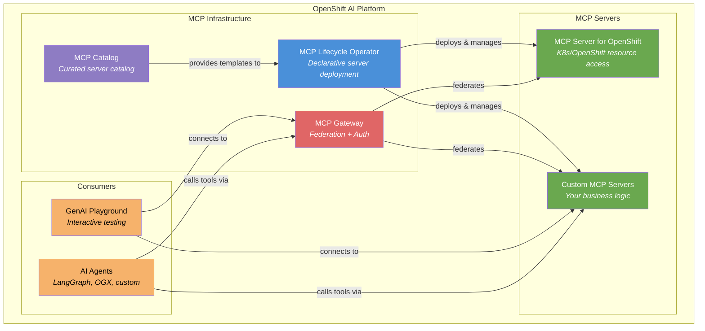
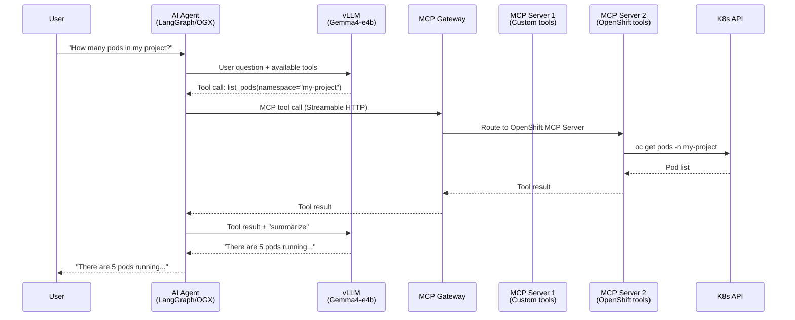

# L2-M2.1 — MCP on OpenShift AI Overview

**Level:** Practitioner
**Duration:** 30 min

## Overview

You already know how to build MCP servers and clients locally (from `ai-agents-course/Version_2/2_MCP`). This lesson shows how Red Hat integrates MCP into OpenShift AI as a first-class platform capability --- turning what was a local development pattern into a managed, secure, enterprise-grade infrastructure for AI agents. You will learn what components exist, how they fit together, and which ones are ready for production use.

## Prerequisites

- Completed: MCP fundamentals (`ai-agents-course/Version_2/2_MCP`) --- you understand MCP protocol, tools, resources, prompts, and transports (STDIO, Streamable HTTP)
- Completed: L2-M1 (RAG on OpenShift AI)
- Familiarity with OpenShift AI platform concepts (L1-M1)
- No cluster access required --- this is a conceptual lesson

## Concepts

### The Problem: MCP in Production

In the ai-agents-course, you ran MCP servers locally --- a Python process on your laptop, connected to a client via STDIO or Streamable HTTP. This works for development but breaks down in production:

- **Lifecycle management** --- Who deploys the MCP server? Who restarts it when it crashes? Who updates it?
- **Discovery** --- How does an agent find available MCP servers? How does it know which tools are available?
- **Security** --- Who can call which tools? How do you authenticate agents? How do you prevent unauthorized cluster access?
- **Federation** --- How do you connect an agent to multiple MCP servers without hardcoding URLs?
- **Observability** --- How do you monitor MCP server health, latency, and error rates?

Red Hat addresses each of these with a set of platform components that bring MCP into the Kubernetes-native management model.

---

### MCP Components on OpenShift AI

OpenShift AI provides five MCP-related components. Each solves a specific problem:

#### 1. MCP Lifecycle Operator (Dev Preview)

The MCP Lifecycle Operator brings Kubernetes-native lifecycle management to MCP servers. Instead of manually creating Deployments, Services, and Routes for each MCP server, you declare what you want and the operator handles the rest.

**What it does:**
- Deploys MCP servers from container images via a custom resource
- Manages the full lifecycle: create, update, scale, delete
- Configures Streamable HTTP endpoints automatically
- Integrates with the MCP Catalog for one-click deployment of curated servers

**Why it matters:** In vanilla Kubernetes, deploying an MCP server means writing a Deployment, Service, and possibly a Route or Ingress --- the same boilerplate you write for any microservice. The operator abstracts this away and adds MCP-specific capabilities like tool discovery and health checking.

#### 2. MCP Server for OpenShift (Technology Preview)

An MCP server that gives AI agents the ability to interact with Kubernetes and OpenShift resources. Think of it as giving your agent `kubectl` access via MCP tools.

**What it provides:**
- Tools to get, list, create, update, and delete any K8s/OpenShift resource
- Pod log retrieval
- Event listing
- RBAC-aware: the server operates with the permissions of the configured ServiceAccount

**Why it matters:** This is what enables "infrastructure agents" --- AI agents that can answer questions like "How many pods are running in my project?" or "What is the status of my deployment?" without you writing custom API integration code.

#### 3. MCP Gateway (Technology Preview)

An Envoy-based gateway that sits in front of multiple MCP servers and provides a single unified endpoint for agents.

**What it provides:**
- **Server federation** --- One URL for agents, routing to multiple MCP servers behind the gateway
- **OAuth2 authentication** --- Token-based auth for agents and users
- **Identity-based tool filtering** --- Users see only the tools they are authorized to use
- **Health checking and failover** --- Automatic detection of unhealthy MCP servers
- **Credential management** --- Securely passes credentials (API keys, tokens) to MCP servers

**Why it matters:** Without a gateway, every agent needs to know the URL of every MCP server it might use. The gateway provides a single point of entry with centralized auth and access control. This is part of Red Hat's Connectivity Link project.

#### 4. MCP Catalog (Dev Preview)

A curated catalog of MCP servers available in the OpenShift AI dashboard. Similar to OperatorHub but for MCP servers.

**What it provides:**
- Browse and deploy pre-built MCP servers from the dashboard
- One-click deployment using the Lifecycle Operator
- Metadata: tool descriptions, required permissions, configuration options

**Why it matters:** Reduces the barrier to adding new capabilities to your agents. Instead of finding, building, and deploying MCP servers manually, you pick from a catalog.

#### 5. GenAI Playground MCP Integration (Technology Preview, 3.0+)

The GenAI Playground --- OpenShift AI's interactive model testing UI --- supports connecting to MCP servers for tool calling.

**What it provides:**
- Add MCP server connections directly in the Playground UI
- Test tool calling interactively with a deployed model
- Iterate on tool descriptions and schemas
- Export working configurations as Python code templates

**Why it matters:** Before deploying an agent in production, you can test whether your MCP tools work correctly with your model in an interactive UI. This shortens the feedback loop from "write code, deploy, test" to "click, test, iterate."

---

### Architecture: How MCP Connects to Agents and LLMs

The following diagram shows the end-to-end flow when an AI agent uses MCP tools on OpenShift AI:

Key points:
1. The **agent** receives a user request and forwards it to the **LLM** along with available tool descriptions.
2. The **LLM** decides which tool to call (tool selection is an LLM capability, not hardcoded logic).
3. The **agent** calls the tool via the **MCP Gateway** using Streamable HTTP.
4. The **gateway** routes the request to the appropriate **MCP server**.
5. The **MCP server** executes the tool (e.g., queries the K8s API) and returns the result.
6. The **agent** sends the result back to the **LLM** for summarization.
7. The **agent** returns the final response to the **user**.

---

### Transport: Streamable HTTP vs STDIO

In the ai-agents-course, you worked with both STDIO (local, subprocess-based) and Streamable HTTP (network-based) transports. On Kubernetes, the choice is straightforward:

| Transport | When to Use | On OpenShift |
|-----------|------------|--------------|
| **STDIO** | Local development, IDE integrations (Claude Desktop, VS Code) | Not used for server-to-server communication |
| **Streamable HTTP** | Server-to-server communication, production deployments | Primary transport on OpenShift AI |

**Streamable HTTP on OpenShift AI:**
- MCP servers expose an HTTP endpoint (typically `/mcp`) inside the cluster
- Agents connect to the MCP server's Service or Route URL
- The MCP Gateway uses Streamable HTTP for both upstream (to MCP servers) and downstream (from agents)
- TLS is handled by OpenShift's router or service mesh --- the MCP server itself does not need to manage certificates

This is the same Streamable HTTP transport you used in `ai-agents-course/Version_2/2_MCP/3_STREAMABLE_HTTP`, but deployed as a Kubernetes Service instead of running on `localhost:8002`.

---

### Red Hat and the Agentic AI Foundation (AAIF)

Red Hat is a founding member of the **Agentic AI Foundation (AAIF)**, a Linux Foundation initiative focused on establishing open standards and interoperability for AI agents. This membership informs Red Hat's MCP strategy:

- **MCP adoption** --- Red Hat adopted MCP as the standard protocol for tool calling in OpenShift AI, rather than building a proprietary alternative.
- **A2A protocol** --- Red Hat is exploring the Agent-to-Agent (A2A) protocol for inter-agent communication (planned for H2 2026 via the Kagenti project).
- **Open standards** --- The MCP Gateway, Lifecycle Operator, and integration points are designed to work with any MCP-compliant server, not just Red Hat-provided ones.

---

### Component Status and Maturity

Not all MCP components are at the same maturity level. This table summarizes the current status as of OpenShift AI 3.4-3.5:

| Component | Status | Version | Available Since | Production Ready? |
|-----------|--------|---------|----------------|-------------------|
| **GenAI Playground MCP** | Technology Preview | --- | 3.0 (enhanced 3.3) | No (TP: not for production) |
| **MCP Server for OpenShift** | Technology Preview | --- | 3.4 | No (TP: not for production) |
| **MCP Gateway** | Technology Preview | --- | 3.4 | No (TP: not for production) |
| **MCP Lifecycle Operator** | Dev Preview | v0.2.0 | 3.4 | No (Dev Preview: API may change) |
| **MCP Catalog** | Dev Preview | --- | 3.4 | No (Dev Preview: API may change) |

**What the status levels mean:**

- **GA (General Availability)** --- Fully supported, covered by Red Hat support SLA. Safe for production.
- **Technology Preview (TP)** --- Feature-complete for evaluation. Covered by limited support. APIs may change between releases. Not recommended for production workloads.
- **Dev Preview** --- Early access for feedback. No support coverage. APIs will change. Use only in development/test environments.

> **Practical implication:** All MCP components are currently Technology Preview or Dev Preview. Use them in development and testing environments. Expect APIs to evolve as these components mature toward GA.

---

### How This Module Is Organized

This module walks through each component in order of typical usage:

| Lesson | Component | What You Will Do |
|--------|-----------|-----------------|
| **L2-2.2** | MCP Lifecycle Operator | Build a custom MCP server, containerize it, deploy via the operator |
| **L2-2.3** | MCP Server for OpenShift | Deploy the OpenShift MCP Server, connect an agent to manage cluster resources |
| **L2-2.4** | MCP Gateway | Deploy a gateway, federate multiple MCP servers, configure auth |
| **L2-2.5** | GenAI Playground | Test MCP tools interactively, export code templates |

Each lesson builds on the previous one. By the end of this module, you will have a complete MCP infrastructure: custom servers deployed via the operator, federated behind a gateway with authentication, and tested in the Playground before production deployment.

## Key Takeaways

- OpenShift AI provides five MCP-related components that transform MCP from a local development pattern into managed platform infrastructure: the Lifecycle Operator (deployment), MCP Server for OpenShift (cluster access), MCP Gateway (federation and auth), MCP Catalog (discovery), and GenAI Playground integration (testing).
- On Kubernetes, MCP servers use **Streamable HTTP** transport exclusively for server-to-server communication. STDIO is for local development only.
- The MCP Gateway is the key architectural component --- it provides a single endpoint for agents, with centralized authentication, authorization, and routing to multiple MCP servers.
- Component maturity varies: the GenAI Playground MCP, MCP Server for OpenShift, and Gateway are Technology Preview; the Lifecycle Operator and Catalog are Dev Preview. All are suitable for development and evaluation but not yet GA.
- Red Hat's membership in the Agentic AI Foundation (AAIF) drives its commitment to MCP as an open standard rather than a proprietary protocol.

## Next Steps

Continue to [L2-M2.2 --- Deploying MCP Servers with the Lifecycle Operator](../2_lifecycle_operator/) to build a custom MCP server, containerize it for OpenShift, and deploy it using the MCP Lifecycle Operator.
