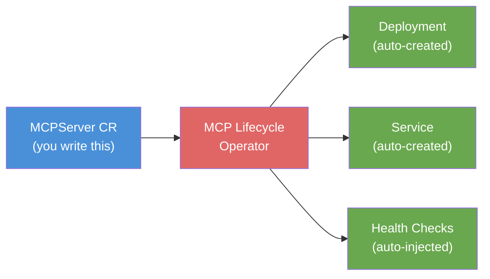

# L2-M2.2 — Deploying MCP Servers with the Lifecycle Operator

**Level:** Practitioner
**Duration:** 45 min

## Overview

In this lesson you will build a custom MCP server, containerize it for OpenShift, and deploy it using the MCP Lifecycle Operator. The operator provides Kubernetes-native lifecycle management for MCP servers --- instead of writing Deployment, Service, and Route manifests yourself, you declare an `MCPServer` custom resource and the operator handles the rest. You will also learn the manual deployment approach for environments where the operator is not yet available.

## Prerequisites

- Completed: L2-M2.1 (MCP on OpenShift AI Overview)
- Completed: MCP fundamentals (`ai-agents-course/Version_2/2_MCP`) --- specifically Streamable HTTP transport
- OpenShift cluster running with OpenShift AI 3.5+ installed
- `oc` CLI authenticated to the cluster
- `podman` installed locally for building container images
- Access to a container registry (Quay.io, OpenShift internal registry, or similar)
- Python 3.11+ installed locally (for local testing before deployment)

## K8s Context

In vanilla Kubernetes, deploying any service follows the same pattern: write a Deployment, a Service, and an Ingress. An MCP server is no different --- it is just another containerized application exposing an HTTP endpoint.

The MCP Lifecycle Operator adds a layer on top of this: a custom resource (`MCPServer`) that abstracts away the boilerplate. This is the same pattern you see with other Kubernetes operators --- KServe abstracts model serving, the Prometheus Operator abstracts monitoring configuration, and the MCP Lifecycle Operator abstracts MCP server deployment.

## Concepts

### MCP Lifecycle Operator

The MCP Lifecycle Operator (Dev Preview v0.1.0) introduces the `MCPServer` CRD (`mcp.x-k8s.io/v1alpha1`). When you create an `MCPServer` resource, the operator automatically:

1. **Creates a Deployment** with security-hardened defaults (non-root, read-only filesystem, dropped capabilities)
2. **Creates a Service** with cluster-internal discovery URL
3. **Validates** referenced ConfigMaps and Secrets before rollout
4. **Injects health probes** (TCP socket + MCP protocol handshakes)
5. **Manages updates** --- changing the image tag triggers a rolling update



### Building MCP Servers for OpenShift

Building an MCP server for OpenShift follows the same pattern as any OpenShift application:

1. **Write the server** using the MCP SDK (Python `mcp` package with FastMCP or low-level API)
2. **Use Streamable HTTP transport** (not STDIO --- STDIO is for local development only)
3. **Build with a UBI base image** (Red Hat Universal Base Image) for OpenShift SCC compatibility
4. **Listen on port 8080** (or another non-privileged port) as a non-root user
5. **Expose the `/mcp` endpoint** for Streamable HTTP connections

The key difference from your local MCP servers in the ai-agents-course: the server runs as a container on the cluster instead of a local process, and agents connect via the cluster network (Service DNS) or external Route.

## Step-by-Step

### Step 1: Write the MCP Server

We will build a ShopInsights MCP server with four tools that provide product and order analytics. This is the same kind of business-logic MCP server you built in the ai-agents-course, but designed for cluster deployment.

Review the server code in `scripts/mcp_server.py`:

```python
# Key structure of the MCP server (see scripts/mcp_server.py for full code)

from mcp.server.lowlevel import Server
from mcp.server.streamable_http_manager import StreamableHTTPSessionManager

def serve():
    server = Server("shopinsights-tools")

    @server.list_tools()
    async def list_tools() -> list[types.Tool]:
        return [
            types.Tool(name="get_product_info", ...),
            types.Tool(name="list_products", ...),
            types.Tool(name="get_order_summary", ...),
            types.Tool(name="get_low_stock_alerts", ...),
        ]

    @server.call_tool()
    async def handle_call_tool(name: str, arguments: dict) -> list[types.TextContent]:
        # Route to the appropriate handler
        ...

    # Streamable HTTP transport (required for K8s deployment)
    session_manager = StreamableHTTPSessionManager(
        app=server,
        json_response=True,
        stateless=True,      # No session state needed for stateless tools
    )

    # Starlette ASGI app mounting the MCP handler at /mcp
    starlette_app = Starlette(
        routes=[Mount("/mcp", app=handle_streamable_http)],
        lifespan=lifespan,
    )

    port = int(os.environ.get("MCP_PORT", "8080"))
    uvicorn.run(starlette_app, host="0.0.0.0", port=port)
```

The four tools:
- `get_product_info` --- Get product details by ID
- `list_products` --- List products, optionally filtered by category
- `get_order_summary` --- Get order statistics for the last N days
- `get_low_stock_alerts` --- Find products with low stock

### Step 2: Test Locally

Before containerizing, verify the server works locally:

```bash
# Install dependencies
cd scripts/
pip install -r requirements.txt

# Start the server
python mcp_server.py
```

Expected output:
```
ShopInsights MCP Server started (Streamable HTTP)
INFO:     Uvicorn running on http://0.0.0.0:8080 (Press CTRL+C to quit)
```

In a second terminal, test with the client script:

```bash
python mcp_client.py http://localhost:8080/mcp
```

Expected output:
```
Connecting to MCP server at: http://localhost:8080/mcp
============================================================

--- Available Tools ---
  - get_product_info: Get detailed information about a product including name, category, pri...
  - list_products: List all products in the catalog. Optionally filter by category (Electro...
  - get_order_summary: Get a summary of orders for the last N days, including total revenue a...
  - get_low_stock_alerts: Get products with stock levels below a specified threshold....

--- Test: get_product_info ---
  Product: Wireless Headphones | Price: $79.99 | Stock: 142

--- Test: list_products (category=Electronics) ---
  PROD-001: Wireless Headphones ($79.99)
  PROD-005: Smart Watch ($199.99)

--- Test: get_order_summary (last 7 days) ---
  Total orders: 7
  Total revenue: $769.93
  Status breakdown: {'delivered': 3, 'shipped': 2, 'processing': 2}

--- Test: get_low_stock_alerts (threshold=50) ---
  WARNING: Smart Watch - stock: 38 (threshold: 50)

============================================================
All tests passed.
```

### Step 3: Containerize with Podman

Build the container image using the UBI-based Containerfile:

```bash
# From the scripts/ directory
cd scripts/

# Build the image
podman build -t shopinsights-mcp:latest -f Containerfile .
```

Expected output:
```
STEP 1/8: FROM registry.access.redhat.com/ubi9/python-311:latest
...
STEP 8/8: CMD ["python", "mcp_server.py"]
COMMIT shopinsights-mcp:latest
Successfully tagged localhost/shopinsights-mcp:latest
```

Test the containerized version:

```bash
# Run the container
podman run -d --name shopinsights-mcp -p 8080:8080 shopinsights-mcp:latest

# Test with the client
python mcp_client.py http://localhost:8080/mcp

# Clean up
podman stop shopinsights-mcp && podman rm shopinsights-mcp
```

The Containerfile uses key OpenShift-compatible patterns:

```dockerfile
# UBI base image — compatible with OpenShift's restricted SCC
FROM registry.access.redhat.com/ubi9/python-311:latest

# Non-privileged port (8080, not 80)
EXPOSE 8080

# Runs as non-root user by default (UID 1001)
CMD ["python", "mcp_server.py"]
```

### Step 4: Push to a Container Registry

Push the image to a registry accessible from your OpenShift cluster:

```bash
# Option A: Push to Quay.io
podman tag shopinsights-mcp:latest quay.io/<your-username>/shopinsights-mcp:latest
podman push quay.io/<your-username>/shopinsights-mcp:latest

# Option B: Push to OpenShift internal registry
# First, get the registry URL
oc get route default-route -n openshift-image-registry -o jsonpath='{.spec.host}'

# Tag and push
REGISTRY=$(oc get route default-route -n openshift-image-registry -o jsonpath='{.spec.host}')
podman tag shopinsights-mcp:latest ${REGISTRY}/$(oc project -q)/shopinsights-mcp:latest
podman login ${REGISTRY} -u $(oc whoami) -p $(oc whoami -t)
podman push ${REGISTRY}/$(oc project -q)/shopinsights-mcp:latest
```

### Step 5: Deploy with the MCP Lifecycle Operator

> **Note:** The MCP Lifecycle Operator is Dev Preview (v0.1.0). If it is not installed on your cluster, skip to Step 6 for the manual deployment approach.

First, verify the operator is installed:

```bash
oc get crd mcpservers.mcp.x-k8s.io
```

Expected output:
```
NAME                       CREATED AT
mcpservers.mcp.x-k8s.io   2026-06-15T10:30:00Z
```

Create a project for your MCP servers:

```bash
oc new-project mcp-servers
```

Update the image reference in `manifests/mcp-server-deployment.yaml`, then apply:

```bash
# Edit the manifest to use your image URL
# Replace quay.io/<your-username>/shopinsights-mcp:latest with your actual image

oc apply -f manifests/mcp-server-deployment.yaml
```

Verify the deployment:

```bash
# Check the MCPServer resource
oc get mcpserver shopinsights-mcp

# Expected output:
# NAME               READY   TRANSPORT         AGE
# shopinsights-mcp   True    StreamableHTTP    30s

# Check the auto-created resources
oc get deployment,service -l app=shopinsights-mcp

# Expected output:
# NAME                               READY   UP-TO-DATE   AVAILABLE   AGE
# deployment.apps/shopinsights-mcp   1/1     1            1           45s
#
# NAME                       TYPE        CLUSTER-IP      PORT(S)    AGE
# service/shopinsights-mcp   ClusterIP   172.30.45.123   8080/TCP   45s

# Check the pod logs
oc logs deployment/shopinsights-mcp

# Expected output:
# ShopInsights MCP Server started (Streamable HTTP)
# INFO:     Uvicorn running on http://0.0.0.0:8080 (Press CTRL+C to quit)
```

### Step 6: Manual Deployment (Without the Operator)

If the MCP Lifecycle Operator is not available, deploy manually using standard Kubernetes resources:

```bash
# Create a project
oc new-project mcp-servers

# Apply the manual deployment (Deployment + Service + Route)
oc apply -f manifests/manual-deployment.yaml
```

Verify the deployment:

```bash
# Check resources
oc get deployment,service,route -l app=shopinsights-mcp

# Expected output:
# NAME                               READY   UP-TO-DATE   AVAILABLE   AGE
# deployment.apps/shopinsights-mcp   1/1     1            1           30s
#
# NAME                       TYPE        CLUSTER-IP      PORT(S)    AGE
# service/shopinsights-mcp   ClusterIP   172.30.45.123   8080/TCP   30s
#
# NAME                                    HOST/PORT                                              PATH   SERVICES           PORT   TERMINATION   WILDCARD
# route.route.openshift.io/shopinsights   shopinsights-mcp-mcp-servers.apps.cluster.example.com          shopinsights-mcp   8080   edge          None
```

### Step 7: Test the Deployed Server

Test from within the cluster (using the Service DNS name):

```bash
# Run the test client as a one-shot pod
oc run mcp-test --rm -it --restart=Never \
  --image=registry.access.redhat.com/ubi9/python-311:latest \
  -- bash -c "
    pip install mcp httpx anyio &&
    python -c \"
import asyncio
from mcp.client.streamable_http import streamablehttp_client
from mcp.client.session import ClientSession

async def test():
    async with streamablehttp_client('http://shopinsights-mcp.mcp-servers.svc.cluster.local:8080/mcp') as (r, w, _):
        async with ClientSession(r, w) as session:
            await session.initialize()
            tools = await session.list_tools()
            print(f'Available tools: {[t.name for t in tools.tools]}')
            result = await session.call_tool('list_products', {})
            print(f'Products: {result.content[0].text[:200]}')

asyncio.run(test())
\"
  "
```

Expected output:
```
Available tools: ['get_product_info', 'list_products', 'get_order_summary', 'get_low_stock_alerts']
Products: [{"product_id": "PROD-001", "name": "Wireless Headphones", ...
```

Or test via the external Route:

```bash
# Get the Route URL
ROUTE_URL=$(oc get route shopinsights-mcp -o jsonpath='{.spec.host}')

# Test with the client script (from your local machine)
python scripts/mcp_client.py https://${ROUTE_URL}/mcp
```

### Step 8: Deploy from the MCP Catalog (Optional)

If the MCP Catalog is enabled on your cluster (Dev Preview, 3.5+), you can browse and deploy pre-built MCP servers from the OpenShift AI dashboard:

1. Navigate to OpenShift AI Dashboard
2. Go to **Gen AI Studio** > **MCP Catalog**
3. Browse available servers (e.g., filesystem, database, web search)
4. Click **Deploy** on a server --- the operator creates the `MCPServer` CR automatically
5. Verify the deployed server appears in your project

## Verification

Confirm your MCP server is fully operational:

```bash
# 1. MCPServer CR is ready (if using the operator)
oc get mcpserver shopinsights-mcp -o jsonpath='{.status.conditions[?(@.type=="Ready")].status}'
# Expected: True

# 2. Pod is running
oc get pods -l app=shopinsights-mcp -o wide
# Expected: 1/1 Running

# 3. Service endpoint is reachable
oc get endpoints shopinsights-mcp
# Expected: shows an IP:port

# 4. Tools are accessible
# (Use the in-cluster test from Step 7 or the external Route test)
```

## Key Takeaways

- The **MCP Lifecycle Operator** provides Kubernetes-native lifecycle management for MCP servers via the `MCPServer` CRD (`mcp.x-k8s.io/v1alpha1`). It automates Deployment, Service, and health check creation.
- Building an MCP server for OpenShift follows the same patterns as any containerized application: **UBI base image**, **non-root user**, **non-privileged port** (8080), **Streamable HTTP** transport.
- The server code is identical to what you wrote in the ai-agents-course --- the only difference is the deployment target (cluster Service vs localhost).
- **Manual deployment** (Deployment + Service + Route) works as a fallback when the operator is not available. The operator simply automates this pattern.
- Within the cluster, agents connect to MCP servers via **Service DNS** (`<name>.<namespace>.svc.cluster.local`). External access goes through an OpenShift **Route**.
- The MCP Catalog (Dev Preview) provides one-click deployment of curated MCP servers from the dashboard.

## Cleanup

```bash
# If using the MCP Lifecycle Operator
oc delete mcpserver shopinsights-mcp

# If using manual deployment
oc delete -f manifests/manual-deployment.yaml

# Delete the project (removes everything)
# oc delete project mcp-servers
```

## Next Steps

Continue to [L2-M2.3 --- MCP Server for OpenShift](../3_openshift_mcp_server/) to deploy the OpenShift MCP Server, which gives AI agents the ability to interact with Kubernetes and OpenShift resources (list pods, read logs, check deployment status).
