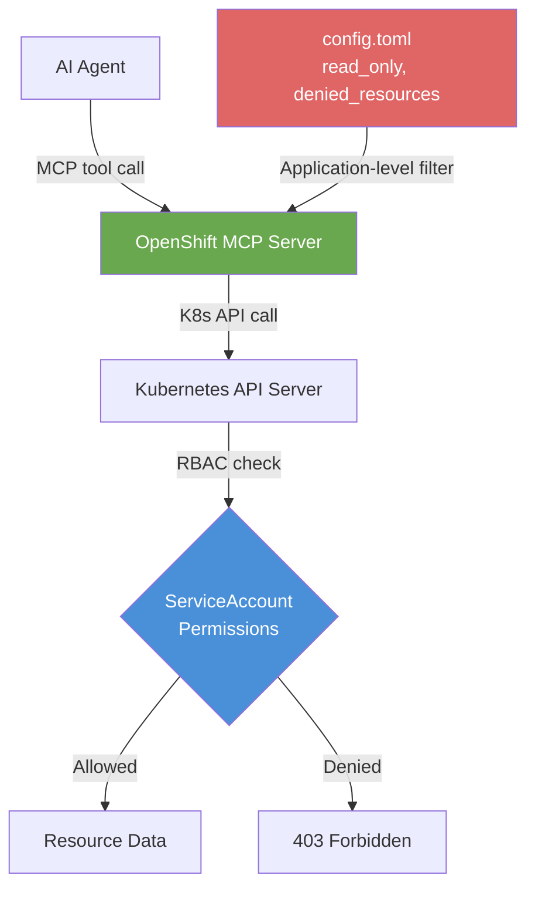

# L2-M2.3 — MCP Server for OpenShift

**Level:** Practitioner
**Duration:** 30 min

## Overview

The OpenShift MCP Server gives AI agents the ability to interact with Kubernetes and OpenShift cluster resources through MCP tools. Instead of writing custom API integration code to list pods, read logs, or check deployment status, your agent calls standardized MCP tools that translate to Kubernetes API operations. In this lesson you will deploy the OpenShift MCP Server, configure RBAC for least-privilege access, and test it by querying cluster resources.

## Prerequisites

- Completed: L2-M2.2 (Deploying MCP Servers with the Lifecycle Operator)
- OpenShift cluster running with OpenShift AI installed
- MCP Lifecycle Operator installed (or willingness to deploy manually)
- `oc` CLI authenticated to the cluster
- The `mcp-servers` project from the previous lesson (or create a new one)

## K8s Context

The OpenShift MCP Server is a fork of the upstream `containers/kubernetes-mcp-server` project. It communicates with the Kubernetes API server natively --- not by wrapping `kubectl` commands, but by making direct API calls. This means it has the same performance and reliability as any Kubernetes controller.

The key Kubernetes concept here is **RBAC**: the MCP server operates with the permissions of its ServiceAccount. If the ServiceAccount has `view` access, the server can only read resources. If it has `edit` access, it can create and modify resources. This is the same security model you use for any service running on the cluster.

## Concepts

### What the OpenShift MCP Server Provides

The server exposes Kubernetes and OpenShift operations as MCP tools, organized into **toolsets** that can be individually enabled or disabled.

**Default toolsets (enabled out of the box):**

| Toolset | Tools | What They Do |
|---------|-------|-------------|
| `core` | `pods_list`, `pods_get`, `pods_log`, `pods_exec`, `pods_top`, `resources_list`, `resources_get`, `resources_create_or_update`, `resources_delete`, `resources_scale`, `events_list`, `namespaces_list`, `projects_list`, `nodes_top` | Core cluster operations --- the tools agents use most often |
| `config` | `configuration_contexts_list`, `targets_list`, `configuration_view` | Kubeconfig and cluster context management |

**Optional toolsets (must be explicitly enabled):**

| Toolset | What It Adds |
|---------|-------------|
| `helm` | Helm chart install, list, uninstall |
| `tekton` | Tekton pipeline/task start, restart, logs |
| `kiali` | Service mesh traffic graphs, Istio config, traces |
| `kubevirt` | Virtual machine lifecycle management |
| `metrics` | Prometheus and Alertmanager querying |
| `traces` | Distributed tracing via Tempo |
| `ossm` | OpenShift Service Mesh management |
| `oadp` | Backup and restore via Velero |
| `cluster-diagnostics` | Node debugging and troubleshooting |

### Safety Controls

The server provides two safety flags that control write operations:

| Flag | Effect |
|------|--------|
| `read_only = true` | Disables ALL write operations (create, update, delete) |
| `disable_destructive = true` | Blocks delete and update operations (allows creates) |

For this tutorial, we use `read_only = true` --- the agent can query resources but cannot modify them. This is the recommended default for initial deployments.

### RBAC: The Security Foundation

The MCP server's capabilities are bounded by two layers of security:



1. **Application-level controls** (`config.toml`) --- The server itself filters operations. `read_only = true` means the server refuses write operations before they even reach the K8s API. `denied_resources` blocks access to specific resource types (e.g., Secrets).

2. **Kubernetes RBAC** --- Even if the server allows an operation, the Kubernetes API server enforces the ServiceAccount's permissions. The built-in `view` ClusterRole grants read-only access to most resources.

Both layers must allow an operation for it to succeed. This defense-in-depth approach means a misconfiguration in one layer is caught by the other.

## Step-by-Step

### Step 1: Create RBAC Resources

Create a ServiceAccount with read-only cluster access:

```bash
# Ensure you are in the mcp-servers project
oc project mcp-servers

# Apply the RBAC configuration
oc apply -f manifests/rbac.yaml
```

This creates:
- A `ServiceAccount` named `openshift-mcp-viewer`
- A `ClusterRoleBinding` that grants the `view` ClusterRole (read-only access to most resources across all namespaces)

Verify:

```bash
oc get serviceaccount openshift-mcp-viewer
oc get clusterrolebinding openshift-mcp-viewer-crb
```

Expected output:
```
NAME                    SECRETS   AGE
openshift-mcp-viewer    0         5s

NAME                          ROLE                AGE
openshift-mcp-viewer-crb      ClusterRole/view    5s
```

> **Security note:** The `view` ClusterRole grants read access across all namespaces. For production, consider using a `RoleBinding` to restrict access to specific namespaces, or create a custom `ClusterRole` that excludes sensitive resources.

### Step 2: Create the Server Configuration

Apply the ConfigMap with the server configuration:

```bash
oc apply -f manifests/openshift-mcp-server-config.yaml
```

The key configuration in `config.toml`:

```toml
# Read-only mode — no write operations allowed
read_only = true

# Enable core and config toolsets
toolsets = ["core", "config"]

# Block access to Secrets (defense-in-depth)
[denied_resources]
resources = ["secrets"]
```

### Step 3: Deploy the OpenShift MCP Server

**Option A: Using the MCP Lifecycle Operator**

```bash
oc apply -f manifests/openshift-mcp-server-deployment.yaml
```

Verify the MCPServer resource:

```bash
oc get mcpserver openshift-mcp-server
```

Expected output:
```
NAME                    READY   AGE
openshift-mcp-server    True    30s
```

Get the cluster-internal URL:

```bash
oc get mcpserver openshift-mcp-server -o jsonpath='{.status.address.url}'
```

Expected output:
```
http://openshift-mcp-server.mcp-servers.svc.cluster.local:8080/mcp
```

**Option B: Manual deployment (without the operator)**

If the operator is not available, deploy using standard Kubernetes resources:

```bash
# Create the Deployment manually
oc create deployment openshift-mcp-server \
  --image=quay.io/redhat-user-workloads/ocp-mcp-server-tenant/openshift-mcp-server-release-03:latest \
  --port=8080

# Mount the ConfigMap
oc set volume deployment/openshift-mcp-server \
  --add --type=configmap \
  --configmap-name=openshift-mcp-server-config \
  --mount-path=/etc/mcp-config

# Set the ServiceAccount
oc set serviceaccount deployment/openshift-mcp-server openshift-mcp-viewer

# Set the command arguments
oc set env deployment/openshift-mcp-server --containers='*' \
  KUBERNETES_MCP_ARGS="--config /etc/mcp-config/config.toml --port 8080 --stateless"

# Expose the Service
oc expose deployment/openshift-mcp-server --port=8080

# Create a Route for external access (optional)
oc create route edge openshift-mcp-server --service=openshift-mcp-server --port=8080
```

### Step 4: Verify the Deployment

Check that the server is running and healthy:

```bash
# Check pod status
oc get pods -l app=openshift-mcp-server

# Expected output:
# NAME                                    READY   STATUS    RESTARTS   AGE
# openshift-mcp-server-7d9f8b6c4d-x2k9p  1/1     Running   0          45s

# Check logs
oc logs deployment/openshift-mcp-server | head -5
```

### Step 5: Test the MCP Server

Test the server by querying cluster resources:

```bash
# Run a test pod that connects to the MCP server
oc run mcp-test --rm -it --restart=Never \
  --image=registry.access.redhat.com/ubi9/python-311:latest \
  -- bash -c "
    pip install -q mcp httpx anyio &&
    python -c \"
import asyncio, json
from mcp.client.streamable_http import streamablehttp_client
from mcp.client.session import ClientSession

async def test():
    url = 'http://openshift-mcp-server.mcp-servers.svc.cluster.local:8080/mcp'
    async with streamablehttp_client(url) as (r, w, _):
        async with ClientSession(r, w) as session:
            await session.initialize()

            # List available tools
            tools = await session.list_tools()
            print(f'Tools available: {len(tools.tools)}')
            for t in tools.tools[:10]:
                print(f'  - {t.name}')

            # List projects
            result = await session.call_tool('projects_list', {})
            print(f'\nProjects: {result.content[0].text[:300]}')

            # List pods in mcp-servers namespace
            result = await session.call_tool('pods_list_in_namespace', {'namespace': 'mcp-servers'})
            print(f'\nPods: {result.content[0].text[:300]}')

asyncio.run(test())
\"
  "
```

Expected output (abbreviated):
```
Tools available: 18
  - pods_list
  - pods_list_in_namespace
  - pods_get
  - pods_log
  - pods_top
  - resources_list
  - resources_get
  - events_list
  - namespaces_list
  - projects_list

Projects: [{"name": "default"}, {"name": "mcp-servers"}, {"name": "openshift"}, ...]

Pods: [{"name": "openshift-mcp-server-7d9f8b6c4d-x2k9p", "namespace": "mcp-servers", ...}]
```

### Step 6: Verify Read-Only Protection

Confirm that write operations are blocked:

```bash
oc run mcp-write-test --rm -it --restart=Never \
  --image=registry.access.redhat.com/ubi9/python-311:latest \
  -- bash -c "
    pip install -q mcp httpx anyio &&
    python -c \"
import asyncio
from mcp.client.streamable_http import streamablehttp_client
from mcp.client.session import ClientSession

async def test():
    url = 'http://openshift-mcp-server.mcp-servers.svc.cluster.local:8080/mcp'
    async with streamablehttp_client(url) as (r, w, _):
        async with ClientSession(r, w) as session:
            await session.initialize()

            # Attempt a write operation (should fail in read-only mode)
            try:
                result = await session.call_tool('resources_create_or_update', {
                    'apiVersion': 'v1',
                    'kind': 'ConfigMap',
                    'name': 'test-write',
                    'namespace': 'mcp-servers',
                    'resource': '{\"data\": {\"key\": \"value\"}}'
                })
                print(f'Result: {result.content[0].text}')
            except Exception as e:
                print(f'Write blocked (expected): {e}')

asyncio.run(test())
\"
  "
```

Expected output:
```
Write blocked (expected): Tool resources_create_or_update is not available in read-only mode
```

## Verification

Confirm the OpenShift MCP Server is fully operational:

```bash
# 1. Server is running
oc get pods -l app=openshift-mcp-server -o jsonpath='{.items[0].status.phase}'
# Expected: Running

# 2. Service is reachable
oc get endpoints openshift-mcp-server
# Expected: shows IP:8080

# 3. Tools are responding (quick check via curl)
# Note: MCP uses a POST-based protocol, so a simple GET will not work.
# Use the Python test above for proper verification.

# 4. Read-only mode is enforced (confirmed in Step 6)
```

## Key Takeaways

- The **OpenShift MCP Server** (`containers/kubernetes-mcp-server`) is a native Go implementation that communicates directly with the Kubernetes API server --- not a wrapper around `kubectl`.
- Tools are organized into **toolsets** (`core`, `config`, `helm`, `tekton`, etc.) that can be individually enabled or disabled. The `core` toolset provides the most commonly needed operations: list pods, get resources, read logs, view events.
- **Safety is enforced at two layers**: application-level controls in `config.toml` (`read_only`, `denied_resources`) and Kubernetes RBAC on the ServiceAccount. Both must allow an operation for it to succeed.
- The recommended starting point is **read-only mode** with the `view` ClusterRole. Expand permissions incrementally based on what your agents actually need.
- The server uses **Streamable HTTP** transport, exposing an `/mcp` endpoint accessible within the cluster via Service DNS or externally via a Route.
- For production deployments, deny access to Secrets and consider namespace-scoped RBAC instead of cluster-wide access.

## Cleanup

```bash
# Delete the MCPServer resource (if using the operator)
oc delete mcpserver openshift-mcp-server

# Delete RBAC resources
oc delete -f manifests/rbac.yaml

# Delete the ConfigMap
oc delete -f manifests/openshift-mcp-server-config.yaml

# Or delete everything with the label selector
oc delete all,configmap,serviceaccount,clusterrolebinding -l app=openshift-mcp-server
```

## Next Steps

Continue to [L2-M2.4 --- MCP Gateway](../4_mcp_gateway/) to deploy the MCP Gateway, which federates multiple MCP servers behind a single endpoint with OAuth2 authentication and identity-based tool filtering.
