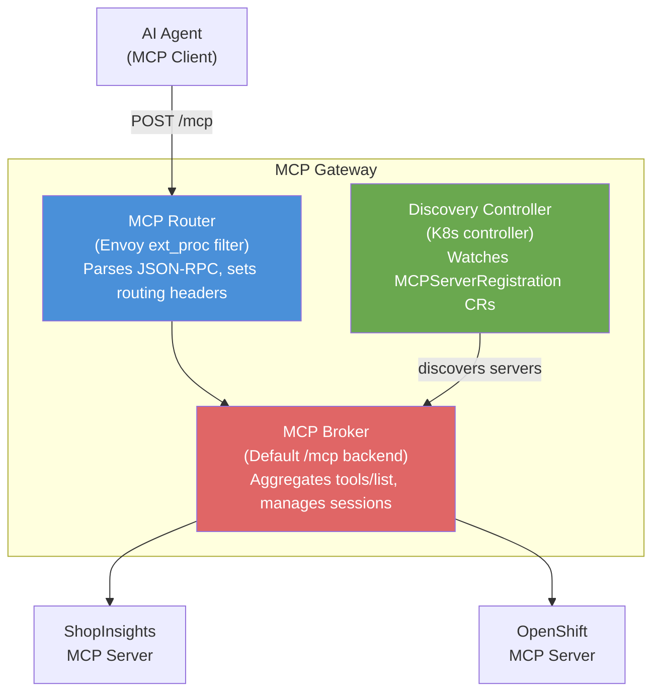

# L2-M2.4 — MCP Gateway

**Level:** Practitioner
**Duration:** 45 min

## Overview

The MCP Gateway is an Envoy-based gateway that federates multiple MCP servers behind a single endpoint. Instead of configuring each agent with the URL of every MCP server it needs, you point the agent at the gateway and it discovers all available tools automatically. The gateway also provides OAuth2 authentication, identity-based tool filtering, and health checking. In this lesson you will deploy the gateway, register the two MCP servers from the previous lessons behind it, configure authentication, and test the federated endpoint.

## Prerequisites

- Completed: L2-M2.2 (ShopInsights MCP server deployed in the `mcp-servers` project)
- Completed: L2-M2.3 (OpenShift MCP Server deployed in the `mcp-servers` project)
- OpenShift cluster with Red Hat Connectivity Link installed (or upstream Kuadrant)
- Gateway API CRDs installed (built-in on OpenShift 4.19+)
- `oc` CLI authenticated to the cluster

## K8s Context

If you have used Kubernetes Gateway API (`Gateway`, `HTTPRoute`), the MCP Gateway will feel familiar. It extends a standard Gateway API `Gateway` resource with MCP protocol awareness --- the `MCPGatewayExtension` CRD tells the gateway "this listener speaks MCP, not just HTTP." The `MCPServerRegistration` CRD is analogous to an `HTTPRoute` but for MCP servers specifically.

If you have used API gateways (Kong, Ambassador, APISIX), the concept is the same: a single entry point that routes traffic to backend services, with auth and policy enforcement in the middle. The MCP Gateway adds MCP-specific capabilities like tool discovery aggregation and protocol-level health checking.

## Concepts

### Architecture

The MCP Gateway consists of three internal components:



**How it works:**

1. **Agent sends a request** to the gateway's `/mcp` endpoint
2. **MCP Router** (Envoy filter) parses the MCP JSON-RPC message, identifies the method and tool name, sets routing headers
3. **MCP Broker** handles `initialize` and `tools/list` requests by aggregating tools from all registered servers into a unified list
4. For `tools/call`, the broker **routes to the correct backend** based on the tool name prefix
5. **Discovery Controller** watches `MCPServerRegistration` resources and dynamically updates the broker's configuration

### CRDs

The MCP Gateway uses three custom resources (API group: `mcp.kuadrant.io/v1alpha1`):

| CRD | Purpose | Short Name |
|-----|---------|------------|
| `MCPGatewayExtension` | Extends a Gateway API Gateway with MCP protocol capabilities | `mcpgwe` |
| `MCPServerRegistration` | Registers a backend MCP server with the gateway | `mcpsr` |
| `MCPVirtualServer` | Creates focused tool groupings for role-specific endpoints | --- |

Authentication uses Kuadrant's existing `AuthPolicy` CRD (`kuadrant.io/v1`).

### Tool Prefixing

When multiple MCP servers expose tools with the same name (e.g., both might have a `list` tool), collisions occur. The gateway solves this with **tool name prefixing**:

- ShopInsights registers with `prefix: "shop_"` --- `list_products` becomes `shop_list_products`
- OpenShift MCP registers with `prefix: "ocp_"` --- `pods_list` becomes `ocp_pods_list`

The broker automatically strips the prefix when forwarding the call to the backend server. Agents see prefixed names; backend servers see original names.

## Step-by-Step

### Step 1: Verify Prerequisites

Confirm both MCP servers from previous lessons are running:

```bash
oc project mcp-servers

# Check ShopInsights MCP server
oc get pods -l app=shopinsights-mcp
# Expected: 1/1 Running

# Check OpenShift MCP server
oc get pods -l app=openshift-mcp-server
# Expected: 1/1 Running

# Verify Connectivity Link / Kuadrant CRDs are available
oc get crd mcpgatewayextensions.mcp.kuadrant.io
oc get crd mcpserverregistrations.mcp.kuadrant.io
```

If the Connectivity Link CRDs are not available, install the operator from OperatorHub:

```bash
# Search for Connectivity Link in OperatorHub
oc get packagemanifests -n openshift-marketplace | grep -i connectivity
# Install via the Web Console: Operators > OperatorHub > "Red Hat Connectivity Link"
```

### Step 2: Create a TLS Certificate

The gateway needs a TLS certificate for the HTTPS listener:

```bash
# For development: create a self-signed certificate
# In production, use cert-manager with a proper CA

openssl req -x509 -newkey rsa:2048 -keyout /tmp/mcp-gw.key -out /tmp/mcp-gw.crt \
  -days 365 -nodes -subj "/CN=mcp-gateway.mcp-servers.svc.cluster.local"

oc create secret tls mcp-gateway-tls \
  --cert=/tmp/mcp-gw.crt \
  --key=/tmp/mcp-gw.key \
  -n mcp-servers
```

### Step 3: Deploy the MCP Gateway

Apply the gateway manifests:

```bash
oc apply -f manifests/mcp-gateway.yaml
```

This creates:
1. A **Gateway** resource with an MCP listener on port 8443
2. An **MCPGatewayExtension** that enables MCP protocol handling on the listener
3. **HTTPRoutes** pointing to each backend MCP server
4. **MCPServerRegistrations** that register each server with the gateway

Verify the gateway is ready:

```bash
# Check the Gateway
oc get gateway mcp-gateway -n mcp-servers

# Expected:
# NAME          CLASS   ADDRESS          PROGRAMMED   AGE
# mcp-gateway   istio   172.30.x.x       True         30s

# Check the MCPGatewayExtension
oc get mcpgwe mcp-extension -n mcp-servers

# Expected:
# NAME            READY   AGE
# mcp-extension   True    30s

# Check the MCPServerRegistrations
oc get mcpsr -n mcp-servers

# Expected:
# NAME                        READY   PREFIX   AGE
# shopinsights-registration   True    shop_    30s
# openshift-registration      True    ocp_     30s
```

### Step 4: Configure OAuth2 Authentication (Optional)

For authenticated access, apply the AuthPolicy:

```bash
# First, update the issuer URL in oauth2-config.yaml to match your cluster
# Replace: https://oauth-openshift.apps.cluster.example.com
# With:    your actual OAuth URL

oc apply -f manifests/oauth2-config.yaml
```

Verify the auth policy is enforced:

```bash
oc get authpolicy mcp-gateway-auth -n mcp-servers

# Expected:
# NAME                READY   AGE
# mcp-gateway-auth    True    15s
```

To get a token for testing:

```bash
# Use your OpenShift token
TOKEN=$(oc whoami -t)
echo "Token: ${TOKEN}"
```

### Step 5: Test the Federated Gateway

Get the gateway endpoint:

```bash
# Get the gateway's external address
GW_URL=$(oc get gateway mcp-gateway -n mcp-servers -o jsonpath='{.status.addresses[0].value}')
echo "Gateway URL: https://${GW_URL}/mcp"

# Or create a Route for easier access
oc expose service mcp-gateway -n mcp-servers --port=8443
ROUTE_URL=$(oc get route mcp-gateway -n mcp-servers -o jsonpath='{.spec.host}')
echo "Route URL: https://${ROUTE_URL}/mcp"
```

Test tool discovery (all registered servers' tools appear in one list):

```bash
# Initialize an MCP session
curl -s -D /tmp/mcp_headers -X POST https://${ROUTE_URL}/mcp \
  -H "Content-Type: application/json" \
  -H "Authorization: Bearer ${TOKEN}" \
  -d '{
    "jsonrpc": "2.0",
    "id": 1,
    "method": "initialize",
    "params": {
      "protocolVersion": "2025-11-25",
      "capabilities": {},
      "clientInfo": {"name": "test-client", "version": "1.0.0"}
    }
  }'

# Extract the session ID
SESSION_ID=$(grep -i "mcp-session-id:" /tmp/mcp_headers | cut -d' ' -f2 | tr -d '\r')
echo "Session ID: ${SESSION_ID}"

# List all federated tools
curl -s -X POST https://${ROUTE_URL}/mcp \
  -H "Content-Type: application/json" \
  -H "Authorization: Bearer ${TOKEN}" \
  -H "mcp-session-id: ${SESSION_ID}" \
  -d '{"jsonrpc": "2.0", "id": 2, "method": "tools/list"}' | python -m json.tool
```

Expected output (abbreviated):
```json
{
  "jsonrpc": "2.0",
  "id": 2,
  "result": {
    "tools": [
      {"name": "shop_get_product_info", "description": "Get detailed information..."},
      {"name": "shop_list_products", "description": "List all products..."},
      {"name": "shop_get_order_summary", "description": "Get a summary of orders..."},
      {"name": "shop_get_low_stock_alerts", "description": "Get products with stock..."},
      {"name": "ocp_pods_list", "description": "List pods..."},
      {"name": "ocp_pods_get", "description": "Get a specific pod..."},
      {"name": "ocp_pods_log", "description": "Retrieve pod logs..."},
      {"name": "ocp_projects_list", "description": "List OpenShift projects..."}
    ]
  }
}
```

Notice: tools from both servers appear in a single list, with prefixes (`shop_`, `ocp_`) to avoid naming collisions.

### Step 6: Call Tools via the Gateway

Call a ShopInsights tool through the gateway:

```bash
curl -s -X POST https://${ROUTE_URL}/mcp \
  -H "Content-Type: application/json" \
  -H "Authorization: Bearer ${TOKEN}" \
  -H "mcp-session-id: ${SESSION_ID}" \
  -d '{
    "jsonrpc": "2.0",
    "id": 3,
    "method": "tools/call",
    "params": {
      "name": "shop_list_products",
      "arguments": {"category": "Electronics"}
    }
  }' | python -m json.tool
```

Call an OpenShift tool through the same gateway:

```bash
curl -s -X POST https://${ROUTE_URL}/mcp \
  -H "Content-Type: application/json" \
  -H "Authorization: Bearer ${TOKEN}" \
  -H "mcp-session-id: ${SESSION_ID}" \
  -d '{
    "jsonrpc": "2.0",
    "id": 4,
    "method": "tools/call",
    "params": {
      "name": "ocp_projects_list",
      "arguments": {}
    }
  }' | python -m json.tool
```

Both calls go to the same gateway URL --- the gateway routes to the correct backend based on the tool prefix.

### Step 7: Test with the Python Client

For a more comprehensive test using the MCP Python SDK:

```bash
# From your local machine (or a workbench)
python scripts/test_gateway.py https://${ROUTE_URL}/mcp --token ${TOKEN}
```

Expected output:
```
Connecting to MCP Gateway at: https://mcp-gateway-mcp-servers.apps.cluster.example.com/mcp
Using OAuth2 token for authentication
============================================================

--- All Available Tools (federated) ---
  - shop_get_product_info: Get detailed information about a product...
  - shop_list_products: List all products in the catalog...
  - shop_get_order_summary: Get a summary of orders for the last N days...
  - shop_get_low_stock_alerts: Get products with stock levels below...
  - ocp_pods_list: List all pods across namespaces...
  - ocp_pods_list_in_namespace: List pods in a specific namespace...
  - ocp_pods_get: Get details of a specific pod...
  - ocp_projects_list: Enumerate OpenShift projects...

  Total tools: 12

--- ShopInsights: list_products ---
  PROD-001: Wireless Headphones ($79.99)
  PROD-005: Smart Watch ($199.99)

--- OpenShift: projects_list ---
  [{"name": "default"}, {"name": "mcp-servers"}, ...]

============================================================
Gateway test complete. Tools from multiple servers are accessible via a single endpoint.
```

### Step 8: Manage Server State

You can temporarily disable or re-enable MCP servers without deleting them:

```bash
# Disable the ShopInsights server (removes its tools from the gateway)
oc patch mcpsr shopinsights-registration -n mcp-servers \
  --type merge -p '{"spec":{"state":"Disabled"}}'

# Verify: only OpenShift tools appear
curl -s -X POST https://${ROUTE_URL}/mcp \
  -H "Content-Type: application/json" \
  -H "mcp-session-id: ${SESSION_ID}" \
  -d '{"jsonrpc": "2.0", "id": 5, "method": "tools/list"}' | python -m json.tool

# Re-enable
oc patch mcpsr shopinsights-registration -n mcp-servers \
  --type merge -p '{"spec":{"state":"Enabled"}}'
```

## Verification

Confirm the full MCP Gateway setup:

```bash
# 1. Gateway is programmed
oc get gateway mcp-gateway -o jsonpath='{.status.conditions[?(@.type=="Programmed")].status}'
# Expected: True

# 2. MCPGatewayExtension is ready
oc get mcpgwe mcp-extension -o jsonpath='{.status.conditions[?(@.type=="Ready")].status}'
# Expected: True

# 3. Both MCPServerRegistrations are ready
oc get mcpsr -o custom-columns=NAME:.metadata.name,READY:.status.conditions[0].status
# Expected:
# NAME                        READY
# shopinsights-registration   True
# openshift-registration      True

# 4. Tools from both servers are discoverable via the gateway
# (Use the curl or Python test from Steps 5-7)
```

## Key Takeaways

- The **MCP Gateway** (`mcp.kuadrant.io/v1alpha1`) is an Envoy-based gateway that **federates multiple MCP servers** behind a single endpoint. Agents connect to one URL and discover tools from all registered servers.
- It uses three CRDs: `MCPGatewayExtension` (extends a Gateway with MCP capabilities), `MCPServerRegistration` (registers a backend MCP server), and `AuthPolicy` (from Kuadrant, configures authentication).
- **Tool name prefixing** prevents collisions when multiple servers expose similarly-named tools. The prefix is automatically stripped when forwarding calls to the backend.
- The gateway is part of **Red Hat Connectivity Link** (upstream: Kuadrant project). It builds on Kubernetes **Gateway API** --- the same standard used for HTTP traffic management.
- **OAuth2 authentication** integrates with any OIDC provider, including OpenShift's built-in OAuth server. Identity-based tool filtering ensures users only see tools they are authorized to use.
- The gateway performs **MCP protocol-level health checking** (not just HTTP pings) --- it calls `list_tools` on each server to verify MCP readiness, removing unhealthy servers from the aggregated tool list.

## Cleanup

```bash
# Delete gateway resources
oc delete -f manifests/oauth2-config.yaml
oc delete -f manifests/mcp-gateway.yaml

# Delete the TLS secret
oc delete secret mcp-gateway-tls -n mcp-servers

# Or delete everything with the label
oc delete all,mcpgwe,mcpsr,authpolicy,secret -l app=mcp-gateway -n mcp-servers
```

## Next Steps

Continue to [L2-M2.5 --- Testing MCP in GenAI Playground](../5_playground_testing/) to test your MCP tools interactively in the OpenShift AI GenAI Playground before deploying agents that use them.
