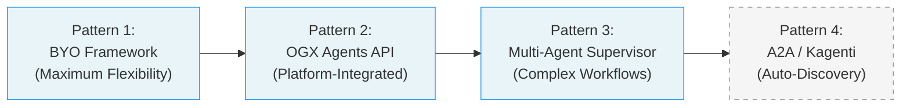
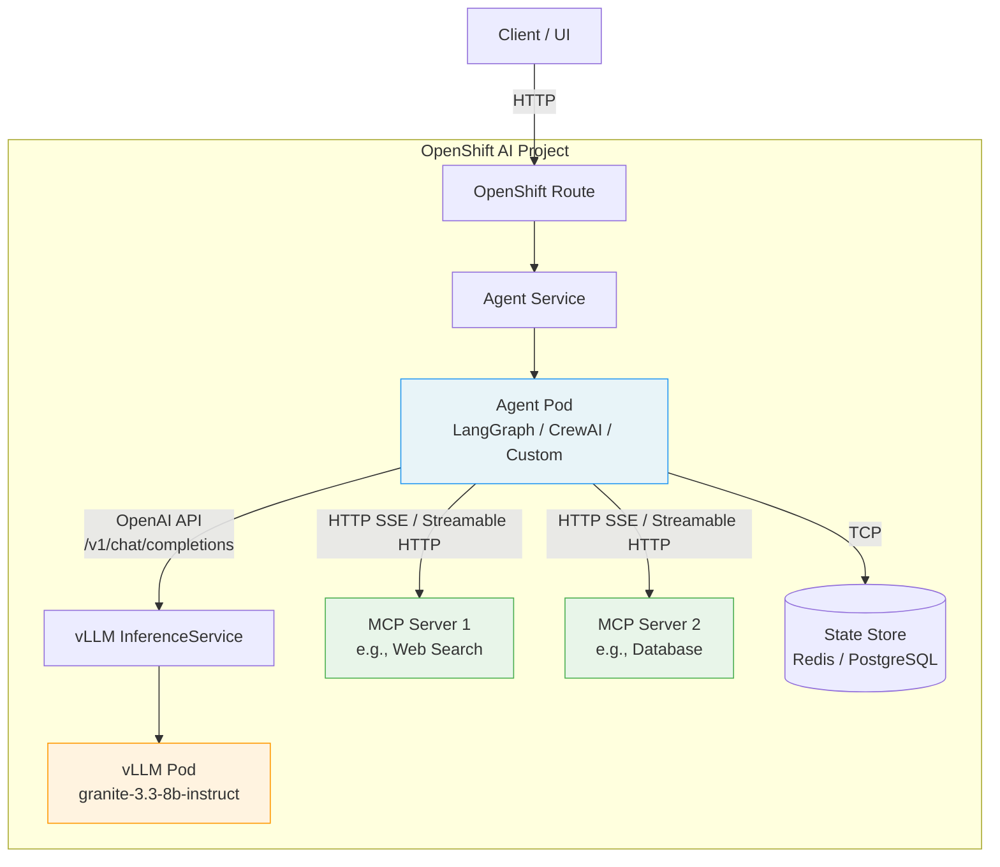
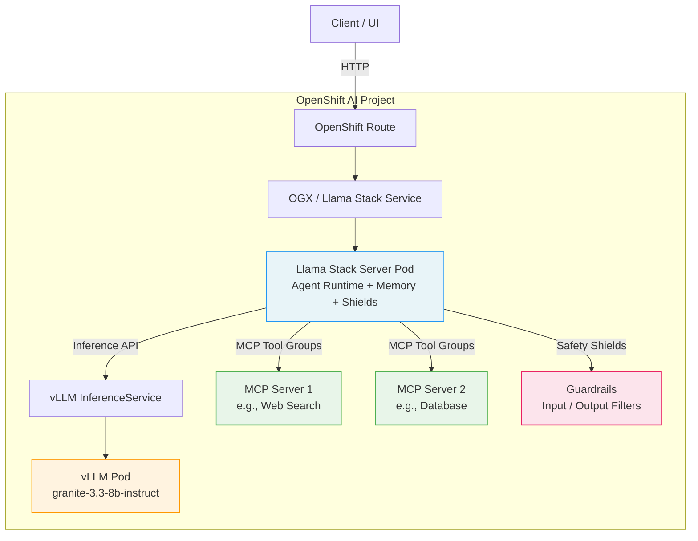
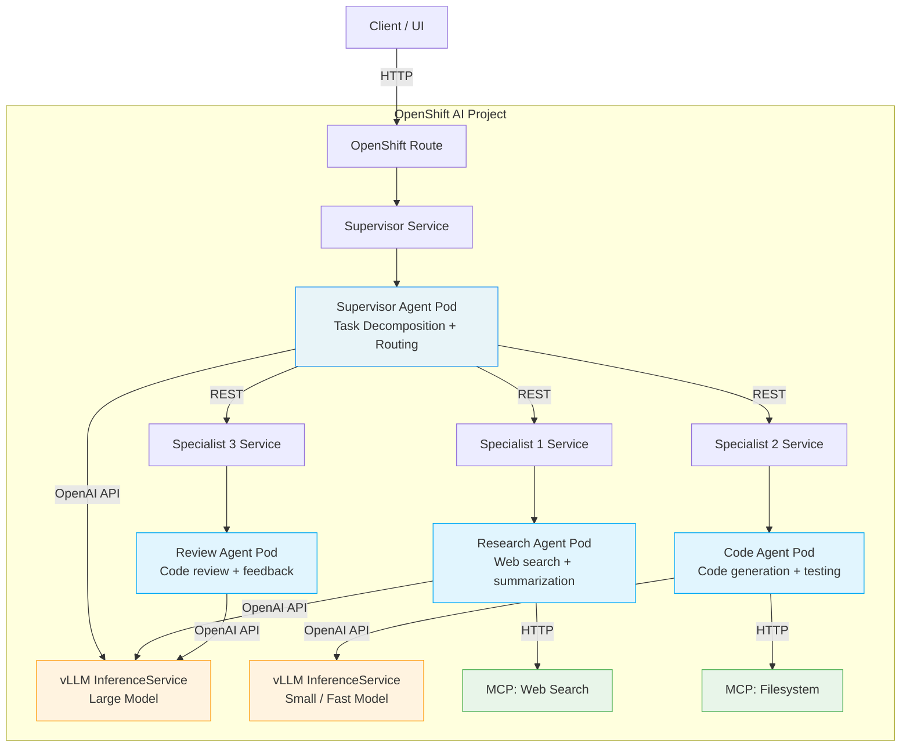
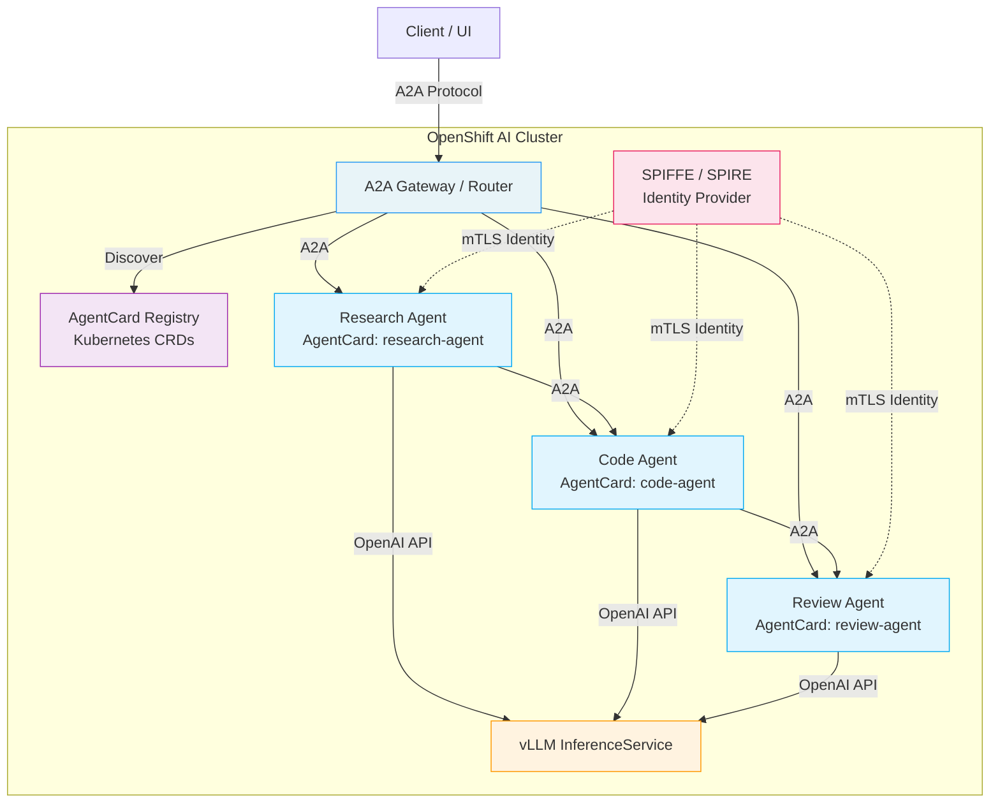

# L2-M3.1 -- Agent Deployment Patterns on OpenShift AI

**Level:** Practitioner
**Duration:** 30 min

## Overview

Deploying AI agents on OpenShift AI is not a one-size-fits-all problem. Depending on your framework choice, orchestration complexity, and integration requirements, you have four distinct deployment patterns available -- from fully custom containerized agents to protocol-based multi-agent discovery. This lesson maps out each pattern's architecture, trade-offs, and ideal use cases so you can choose the right one before writing any manifests.

If you have built agents with LangChain, LangGraph, or CrewAI locally, you already know how to wire an LLM to tools and manage conversation state. The question this lesson answers is: how do you take those agent architectures and deploy them on OpenShift AI in a way that leverages the platform's model serving, scaling, and security capabilities?

## Prerequisites

- Completed: [L2-M2 -- MCP Deployment](../../M2_mcp_deployment/5_playground_testing/) (understanding of MCP server deployment on OpenShift AI)
- Familiarity with at least one agent framework (LangChain, LangGraph, CrewAI, or similar)
- Understanding of OpenShift AI model serving (InferenceService, vLLM)
- No cluster required -- this is a conceptual lesson

## Concepts

### The Agent Deployment Spectrum

OpenShift AI takes a framework-agnostic approach to agent deployment. The platform provides the infrastructure -- model serving via vLLM, MCP tool servers, route-based networking, autoscaling -- but it does not force you into a single agent framework. This is a deliberate design choice: the agent ecosystem is evolving rapidly, and locking into one framework would be premature.

The four patterns form a spectrum from maximum flexibility to maximum platform integration:



Each pattern builds on different OpenShift AI capabilities. Patterns 1 through 3 are production-ready today. Pattern 4 is planned for H2 2026 and included here for architectural awareness.

### Pattern 1: BYO Framework on vLLM

The most straightforward pattern: containerize your agent application and deploy it as a standard Kubernetes workload. Your agent connects to a vLLM InferenceService endpoint for LLM inference via the OpenAI-compatible API.

This is the pattern most Kubernetes practitioners will reach for first, because it maps directly to what you already know -- a Deployment, a Service, a Route. The only OpenShift AI-specific piece is the InferenceService providing the model.

**Key characteristics:**

- Full control over the agent framework, language, and runtime
- You manage the agent lifecycle, health checks, scaling, and state
- Works with any framework: LangChain, LangGraph, CrewAI, Autogen, custom Python, Go, Rust -- anything that can make HTTP calls
- Agent connects to vLLM via the OpenAI-compatible `/v1/chat/completions` endpoint
- MCP tool servers are accessed via HTTP (SSE or Streamable HTTP transport)
- You are responsible for implementing tool calling, memory management, and conversation state

### Pattern 2: OGX Agents API (Llama Stack)

The OGX (formerly Llama Stack) operator provides a native agent API as part of OpenShift AI. Instead of building your own agent loop, you use the Llama Stack `/v1alpha/agents` REST API to create agents, manage sessions, and execute conversational turns. The server handles the agent loop, tool calling, memory, and safety guardrails internally.

**Key characteristics:**

- Less code -- the Llama Stack server implements the agent loop for you
- Built-in tool calling support (including MCP tool groups)
- Built-in memory management (conversation history, vector memory)
- Built-in safety/guardrails integration (input/output shields)
- API-driven lifecycle: create agent, create session, post turns, retrieve results
- Trade-off: you are tied to the Llama Stack API surface and its agent abstractions
- Less suitable for complex state machines or custom orchestration logic that does not fit the turn-based model

This pattern is covered in depth in [L2-M3.3 -- OGX Agents](../3_ogx_agents/).

### Pattern 3: Multi-Agent Supervisor

When a single agent is not enough, the supervisor pattern introduces a central orchestrator that routes tasks to specialist agents. Each specialist is deployed as its own Deployment + Service, and the supervisor calls them via REST. This is the pattern for complex workflows where different sub-tasks require different models, tools, or reasoning strategies.

**Key characteristics:**

- Central supervisor agent decomposes complex tasks and delegates to specialists
- Each specialist agent is an independent Deployment + Service (can use Pattern 1 or Pattern 2 internally)
- Supervisor communicates with specialists via REST over OpenShift Services
- Specialists can use different models (e.g., a small model for classification, a large model for generation)
- Good for workflows like: research + code generation + code review, or data extraction + analysis + report generation
- Can be implemented with LangGraph's supervisor/swarm patterns, CrewAI crews, or custom orchestration
- More complex to deploy and debug -- N+1 deployments, distributed tracing becomes important

### Pattern 4: A2A via Kagenti (Planned -- H2 2026)

The Agent-to-Agent (A2A) protocol, initiated by Google, defines a standard way for agents to discover each other and communicate. Kagenti is a Kubernetes-native operator that implements A2A using Custom Resources (AgentCard CRDs) and SPIFFE-based identity for zero-trust inter-agent communication.

**Key characteristics:**

- Agents register themselves via `AgentCard` CRDs -- a machine-readable description of capabilities
- Other agents discover available agents by querying the AgentCard registry
- Communication follows the A2A protocol -- standardized message format, task lifecycle, streaming support
- SPIFFE-based identity (SPIRE) provides mutual TLS and zero-trust authentication between agents
- Enables a marketplace-style ecosystem where agents from different teams or vendors can interoperate
- **Not yet available** -- this is a preview of planned capabilities for H2 2026
- When it arrives, Kagenti will integrate with the OpenShift AI operator as an additional component

This pattern is fundamentally different from Patterns 1 through 3: instead of you wiring agents together explicitly, agents discover and negotiate with each other dynamically. Think of it as DNS for agents -- you publish an AgentCard, and other agents find you.

## Step-by-Step

This is a conceptual lesson -- no cluster is required. The steps below walk through each pattern's architecture and help you decide which one to use.

### Step 1: Review the Decision Matrix

Before diving into architectures, use this matrix to identify which pattern fits your use case:

| Criteria | BYO on vLLM | OGX Agents API | Multi-Agent Supervisor | A2A / Kagenti |
|----------|-------------|----------------|------------------------|---------------|
| **Framework flexibility** | Any framework, any language | Llama Stack API only | Any framework per agent | Any A2A-compliant agent |
| **Code complexity** | High -- you build the agent loop | Low -- API handles the loop | High -- N+1 services to manage | Medium -- agent registration + A2A client |
| **Tool calling** | You implement it (via MCP or custom) | Built-in (MCP tool groups supported) | Per-agent (each specialist has its own tools) | Per-agent (declared in AgentCard) |
| **Memory management** | You implement it (Redis, DB, in-memory) | Built-in (conversation + vector memory) | Per-agent + supervisor must manage context passing | Protocol-defined artifact exchange |
| **Scaling control** | Full control (HPA, KEDA, custom) | Managed by OGX operator | Per-agent scaling (independent HPAs) | Per-agent scaling + discovery-aware |
| **OpenShift AI integration** | Minimal -- uses vLLM endpoint only | Deep -- native operator component | Moderate -- each agent uses vLLM | Deep -- operator-managed AgentCards |
| **Multi-agent support** | Manual wiring via REST/gRPC | Limited -- single agent per session | Native -- supervisor orchestrates specialists | Native -- protocol-level agent-to-agent |
| **Maturity** | Production-ready | Production-ready (GA in RHOAI 3.4) | Production-ready (framework-dependent) | Planned -- H2 2026 |
| **Best for** | Teams with existing agent code, custom requirements, non-Python stacks | Quick agent deployment, Llama Stack ecosystem, prototyping | Complex multi-step workflows, heterogeneous agent teams | Cross-team/cross-org agent ecosystems, dynamic agent composition |

**Rules of thumb:**

- If you already have a LangChain/LangGraph agent running locally, start with **Pattern 1**.
- If you want the fastest path to a working agent with minimal code, use **Pattern 2**.
- If your task requires multiple specialized agents collaborating, design with **Pattern 3**.
- If you are planning for cross-team agent interoperability in 2027+, keep **Pattern 4** on your radar.

### Step 2: Walk Through Pattern 1 -- BYO Framework on vLLM

In this pattern, your agent is a standard containerized application. It could be a Python FastAPI server running LangGraph, a Node.js application using the Vercel AI SDK, or a Go service with custom LLM orchestration. The only requirement is that it can call the vLLM endpoint over HTTP.



**How it works:**

1. A client sends a request to the agent via an OpenShift Route.
2. The agent pod receives the request and begins its reasoning loop.
3. For each LLM call, the agent sends a request to the vLLM InferenceService using the OpenAI-compatible API (`/v1/chat/completions` with `tools` parameter).
4. When the model returns a tool call, the agent executes it against an MCP server (or a custom tool implementation).
5. The agent loops until the model produces a final response, then returns it to the client.
6. Conversation state is persisted to an external store (Redis, PostgreSQL) if needed.

**Deployment resources:**

- `Deployment` + `Service` + `Route` for the agent application
- `InferenceService` for vLLM (already deployed, shared across agents)
- `Deployment` + `Service` for each MCP server (covered in [L2-M2](../../M2_mcp_deployment/))
- Optional: `Deployment` for state store (Redis, PostgreSQL)

### Step 3: Walk Through Pattern 2 -- OGX Agents API

In this pattern, the Llama Stack server is your agent runtime. You do not deploy your own agent container -- instead, you interact with the Llama Stack API to create agents and execute conversational turns. The Llama Stack server handles the agent loop, tool execution, memory, and guardrails internally.



**How it works:**

1. Your client creates an agent via `POST /v1alpha/agents` with a configuration specifying the model, tools (MCP tool groups), and optional safety shields.
2. Your client creates a session via `POST /v1alpha/agents/{id}/sessions`.
3. Your client posts a turn via `POST /v1alpha/agents/{id}/sessions/{sid}/turns` with the user message.
4. The Llama Stack server internally runs the agent loop: calls the model, executes tool calls, applies guardrails, and returns the final response.
5. Conversation history is managed by the server -- no external state store needed for basic use cases.

**API lifecycle:**

```
POST /v1alpha/agents                    --> Create agent (model, tools, shields)
POST /v1alpha/agents/{id}/sessions      --> Create session
POST /v1alpha/agents/{id}/sessions/{sid}/turns  --> Execute a turn
GET  /v1alpha/agents/{id}/sessions/{sid}/turns  --> Retrieve turn history
DELETE /v1alpha/agents/{id}             --> Delete agent
```

**Deployment resources:**

- `LlamaStackApp` CR (deployed by the OGX operator -- no manual Deployment/Service needed)
- `InferenceService` for vLLM (shared)
- `Deployment` + `Service` for each MCP server
- Your client application is the only custom code you deploy

### Step 4: Walk Through Pattern 3 -- Multi-Agent Supervisor

In this pattern, a supervisor agent coordinates multiple specialist agents. Each specialist is deployed independently and exposes a REST API. The supervisor decomposes incoming tasks, delegates sub-tasks to the appropriate specialist, collects results, and synthesizes a final response.



**How it works:**

1. A client sends a complex task to the supervisor (e.g., "Research the latest security vulnerabilities in our dependencies, generate patches, and review them").
2. The supervisor uses its LLM to decompose the task into sub-tasks and determine which specialist should handle each one.
3. The supervisor calls each specialist's REST API with the sub-task. Specialists can run sequentially (pipeline) or in parallel (fan-out/fan-in), depending on the workflow.
4. Each specialist runs its own agent loop -- calling its own LLM, using its own tools, and returning a structured result.
5. The supervisor collects all specialist results, synthesizes a final response, and returns it to the client.

**Design considerations:**

- **Model heterogeneity:** Different specialists can use different models. A code-generation agent might need a large model, while a classification agent works fine with a smaller, faster one. Deploy multiple InferenceServices with different models.
- **Failure handling:** What happens when a specialist times out or returns an error? The supervisor needs retry logic, fallback strategies, or graceful degradation.
- **Context passing:** The supervisor must decide how much context to pass to each specialist. Passing the full conversation history to every specialist is wasteful; passing too little causes the specialist to miss important context.
- **Observability:** With N+1 services, distributed tracing (OpenTelemetry) becomes essential. Each service should propagate trace headers so you can follow a request through the entire workflow.

**Deployment resources:**

- `Deployment` + `Service` + `Route` for the supervisor
- `Deployment` + `Service` for each specialist (no Route needed -- internal communication only)
- Multiple `InferenceService` CRs if specialists use different models
- `Deployment` + `Service` for MCP servers used by specialists

### Step 5: Walk Through Pattern 4 -- A2A via Kagenti (Planned)

This pattern uses the Agent-to-Agent (A2A) protocol to enable dynamic agent discovery and communication. Instead of hardcoding service URLs, agents register themselves via `AgentCard` CRDs and discover each other through the Kubernetes API or a registry endpoint.



**How it would work (planned):**

1. Each agent registers itself by creating an `AgentCard` CRD that describes its capabilities, input/output schemas, and authentication requirements.
2. The Kagenti operator watches `AgentCard` resources and maintains a registry of available agents.
3. When an agent (or a client) needs to find an agent with specific capabilities, it queries the registry (e.g., "find me an agent that can do code review").
4. Agents communicate using the A2A protocol -- a standardized message format with task lifecycle management (submitted, working, completed, failed), streaming support, and artifact exchange.
5. SPIFFE/SPIRE provides each agent with a cryptographic identity (SVID). Agents authenticate each other via mTLS -- no shared secrets, no API keys, just workload identity.

**AgentCard CRD concept:**

```yaml
apiVersion: kagenti.dev/v1alpha1
kind: AgentCard
metadata:
  name: research-agent
  labels:
    app: research-agent
    kagenti.dev/capability: web-research
spec:
  displayName: "Research Agent"
  description: "Performs web research and summarizes findings"
  capabilities:
    - web-search
    - summarization
    - citation-extraction
  inputSchema:
    type: object
    properties:
      query:
        type: string
  outputSchema:
    type: object
    properties:
      summary:
        type: string
      sources:
        type: array
  endpoint:
    serviceRef:
      name: research-agent
      port: 8080
  authentication:
    type: spiffe
```

**Why this matters even though it is not available yet:**

- The A2A protocol is an open standard with backing from Google, Salesforce, and others. It is likely to become the standard for multi-agent interoperability.
- Kagenti is the Kubernetes-native implementation, built specifically for OpenShift and Kubernetes environments.
- If you are building multi-agent systems today (Pattern 3), designing your specialist agents with clean REST interfaces and well-defined input/output schemas will make the migration to A2A smoother when it arrives.
- SPIFFE-based identity is already used in OpenShift Service Mesh (Istio) -- the same identity infrastructure can be extended to agent-to-agent communication.

## Verification

Since this is a conceptual lesson, verify your understanding by answering these questions:

1. **When should you use Pattern 1 (BYO) vs Pattern 2 (OGX)?** Use BYO when you need full framework flexibility, have existing agent code, or need complex state management. Use OGX when you want minimal code and built-in tool calling, memory, and guardrails.
2. **What is the supervisor's role in Pattern 3?** The supervisor decomposes complex tasks into sub-tasks, routes them to specialist agents, collects results, and synthesizes a final response. It is itself an agent that uses an LLM for task decomposition and routing.
3. **Why would specialists in Pattern 3 use different models?** Different sub-tasks have different compute/quality requirements. A classification agent might use a small, fast model, while a code-generation agent needs a large, capable model. Using smaller models where possible reduces GPU cost and latency.
4. **What problem does A2A (Pattern 4) solve that Pattern 3 does not?** Pattern 3 requires hardcoded service URLs and manual wiring. A2A enables dynamic discovery -- agents register their capabilities, and other agents find them automatically. This scales better across teams and organizations.
5. **What provides identity and authentication in Pattern 4?** SPIFFE/SPIRE -- each agent gets a cryptographic workload identity (SVID) and agents authenticate via mTLS without shared secrets or API keys.

## Key Takeaways

- OpenShift AI is framework-agnostic for agent deployment -- it provides the infrastructure (model serving, networking, scaling) but does not force a specific agent framework
- Four patterns exist on a spectrum from maximum flexibility (BYO) to maximum platform integration (A2A/Kagenti)
- Pattern 1 (BYO on vLLM) is the most flexible -- any framework, any language, standard Kubernetes resources -- and the right starting point for teams with existing agent code
- Pattern 2 (OGX Agents API) trades flexibility for convenience -- less code, built-in tool calling and memory, but tied to the Llama Stack API surface
- Pattern 3 (Multi-Agent Supervisor) is for complex workflows requiring multiple specialized agents -- each specialist can use a different model and tools
- Pattern 4 (A2A/Kagenti) is planned for H2 2026 and introduces protocol-based agent discovery and zero-trust communication -- design your agents with clean interfaces today to ease future migration
- All patterns connect to vLLM InferenceService endpoints for LLM inference via the OpenAI-compatible API

## Cleanup

No resources to clean up -- this was a conceptual lesson.

## Next Steps

In the next lesson, [L2-M3.2 -- Deploying LangChain/LangGraph Agents](../2_langchain_langgraph/), you will implement Pattern 1 hands-on: containerize a LangGraph agent, deploy it on OpenShift AI, connect it to a vLLM InferenceService, and wire it to MCP tool servers deployed in [L2-M2](../../M2_mcp_deployment/).
