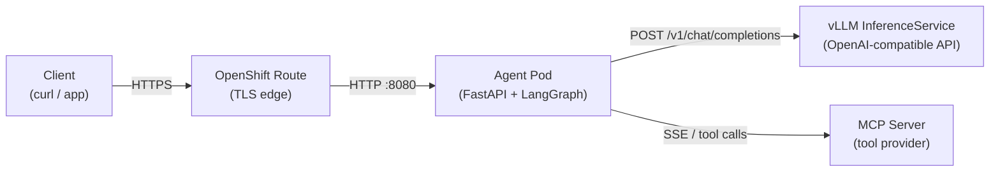

# L2-M3.2 -- Deploying LangChain/LangGraph Agents on OpenShift AI

**Level:** Practitioner
**Duration:** 1.5 hours

## Overview

In the previous lesson you explored agent deployment patterns on OpenShift -- sidecar vs. gateway architectures, scaling strategies, and lifecycle considerations. Now you will put that knowledge into practice by containerizing a LangGraph ReAct agent, deploying it on OpenShift, and wiring it up to a vLLM inference endpoint and MCP tool servers. By the end of this lesson you will have a production-style agent running behind an OpenShift Route, accepting requests from external clients and orchestrating tool calls through the Model Context Protocol.

## Prerequisites

- Completed [L2-M3.1 -- Agent Deployment Patterns](../1_deployment_patterns/)
- vLLM model serving deployed and running (from the L1 model serving lessons in [M2](../../level_1/M2_model_serving/))
- MCP servers deployed and reachable (from [L2-M2 -- MCP Deployment](../../level_2/M2_mcp_deployment/))
- Familiarity with LangChain and LangGraph concepts (ReAct agents, tool calling, graph-based orchestration)
- OpenShift cluster with access to the internal image registry
- `podman` installed locally for building container images
- `oc` CLI authenticated to the cluster

## K8s Context

On vanilla Kubernetes, deploying a Python agent service looks like any other microservice: build a Docker image, push to a registry, write a Deployment + Service + Ingress, and configure environment variables for downstream dependencies. Nothing changes fundamentally on OpenShift -- a Deployment is a Deployment -- but OpenShift adds a few things you should lean on:

- **Routes** replace Ingress and give you TLS termination out of the box.
- **The internal image registry** is pre-provisioned -- no need to set up Harbor or ECR.
- **Security Context Constraints** enforce non-root by default, which means your Containerfile must cooperate with the `restricted` SCC.
- **ConfigMaps and Secrets** work identically to K8s, but the OpenShift web console makes them easier to manage.

The agent application itself is framework-agnostic from OpenShift's perspective. Whether you use LangGraph, LlamaIndex, or raw HTTP calls to an LLM, the deployment mechanics are the same. What matters is that the container image is SCC-compatible, the health probes work, and the environment variables point at the right endpoints.

## Concepts

### LangGraph Agent as a Microservice

A LangGraph agent is a stateful graph that loops between an LLM node (for reasoning) and a tool-execution node (for actions). To deploy it as a microservice you need a thin HTTP wrapper -- in this lesson we use FastAPI -- that:

1. Accepts a user message via a REST endpoint (`/invoke`).
2. Feeds the message into the LangGraph agent graph.
3. Lets the agent loop: the LLM decides which tool to call, the tool node executes it, and the result feeds back to the LLM until it produces a final answer.
4. Returns the final answer (and optionally the tool call log) to the caller.

A streaming endpoint (`/stream`) emits Server-Sent Events so clients can see tokens and tool calls as they happen.

### Connecting to vLLM

The agent does not embed a model -- it calls out to a vLLM inference endpoint over the OpenAI-compatible API. LangChain's `ChatOpenAI` class handles this natively: you point `base_url` at your vLLM Service (e.g. `http://vllm-server:8000/v1`) and set `api_key` to any non-empty string (vLLM does not validate keys by default). From LangGraph's perspective the LLM is just another node in the graph.

This separation of concerns -- agent logic in one pod, model inference in another -- is exactly the pattern discussed in L2-M3.1. It lets you scale the agent and the model server independently, and swap models without redeploying the agent.

### MCP Tool Integration

The Model Context Protocol provides a standardized way for agents to discover and invoke tools. The `langchain-mcp-adapters` library wraps MCP servers as LangChain-compatible tools, so LangGraph can call them like any other tool in its ReAct loop.

At startup the agent connects to the MCP servers listed in the `MCP_SERVERS` environment variable, discovers their available tools, and registers them with the agent graph. When the LLM decides to call a tool, LangGraph routes the call through the MCP client to the appropriate server.

### UBI Base Images and SCC Compatibility

Red Hat's Universal Base Image (UBI) is the standard base for containers on OpenShift. The `ubi9/python-311` image runs as UID 1001 by default, which is compatible with the `restricted` SCC. You do not need to add `USER` directives or adjust file permissions -- the image handles this for you. This is the key difference from building on `python:3.11-slim` from Docker Hub, which runs as root and will be rejected by OpenShift's default security policy.

## Architecture

The following diagram shows the end-to-end request flow from an external client through the agent to the backend services:



The Route terminates TLS at the edge and forwards plain HTTP to the agent pod on port 8080. The agent makes two kinds of outbound calls:

1. **LLM inference** -- OpenAI-compatible chat completions to the vLLM Service.
2. **Tool execution** -- MCP protocol calls (SSE transport) to MCP server pods.

Both vLLM and MCP servers are cluster-internal Services, so traffic stays within the OpenShift SDN.

## Step-by-Step

### Step 1: Examine the Agent Application Code

The agent application lives in `scripts/agent_app.py`. It is a single-file FastAPI application that wraps a LangGraph ReAct agent. Take a moment to read through it and understand the structure.

Key components:

- **Configuration from environment** -- `VLLM_ENDPOINT`, `VLLM_MODEL_NAME`, `MCP_SERVERS`, and `LOG_LEVEL` are read from environment variables, which will come from a ConfigMap.
- **Lifespan handler** -- On startup, the app connects to MCP servers, discovers tools, and builds the LangGraph agent. On shutdown, it disconnects MCP clients.
- **`/invoke` endpoint** -- Accepts a user message, runs the agent synchronously, and returns the final response plus a log of tool calls.
- **`/stream` endpoint** -- Streams agent events (tokens, tool starts/ends) as SSE.
- **`/healthz` and `/readyz`** -- Liveness and readiness probes. The readiness probe returns 503 until the agent graph is fully initialised.

```bash
# View the application code
cat scripts/agent_app.py
```

The agent uses `ChatOpenAI` with `base_url` pointed at the vLLM endpoint -- this is the standard pattern for using any OpenAI-compatible server with LangChain. The `api_key` is set to `"EMPTY"` because vLLM does not require authentication by default.

### Step 2: Review the Containerfile

The Containerfile in `scripts/Containerfile` builds the agent image on a UBI9 Python 3.11 base:

```bash
cat scripts/Containerfile
```

Key points:

- **Base image**: `registry.access.redhat.com/ubi9/python-311:latest` -- runs as UID 1001, compatible with the `restricted` SCC.
- **No `USER` directive needed** -- the UBI image already defaults to a non-root user.
- **Dependencies first** -- `requirements.txt` is copied and installed before the application code, so Docker layer caching works efficiently.
- **Port 8080** -- the standard non-privileged port for OpenShift applications (ports below 1024 require root).

### Step 3: Build the Container Image with Podman

Build the image locally using Podman. You must run this from the `scripts/` directory where the Containerfile and application code live:

```bash
cd scripts/

podman build -t langgraph-agent:latest -f Containerfile .
```

Expected output:

```
STEP 1/7: FROM registry.access.redhat.com/ubi9/python-311:latest
STEP 2/7: LABEL name="langgraph-agent" ...
STEP 3/7: COPY requirements.txt /opt/app-root/src/requirements.txt
STEP 4/7: RUN pip install --no-cache-dir -r /opt/app-root/src/requirements.txt
...
Successfully installed fastapi-0.115.0 langchain-0.3.0 langgraph-0.3.0 ...
STEP 5/7: COPY agent_app.py /opt/app-root/src/agent_app.py
STEP 6/7: EXPOSE 8080
STEP 7/7: CMD ["uvicorn", "agent_app:app", "--host", "0.0.0.0", "--port", "8080"]
COMMIT langgraph-agent:latest
Successfully tagged localhost/langgraph-agent:latest
```

Verify the image was created:

```bash
podman images | grep langgraph-agent
```

### Step 4: Push to the OpenShift Internal Registry

First, determine your project name and log in to the internal registry:

```bash
# Get your current project
oc project
```

```
Using project "my-ai-project" on server "https://api.sandbox.example.com:6443".
```

```bash
# Expose the internal registry (if not already exposed)
# On sandbox environments the registry route is typically pre-configured
oc get route default-route -n openshift-image-registry 2>/dev/null || \
  echo "Registry route not found -- on sandbox, use the internal address directly"
```

Log in to the registry and push the image. Replace `PROJECT` with your actual project name:

```bash
# Get the registry hostname
REGISTRY=$(oc get route default-route -n openshift-image-registry -o jsonpath='{.spec.host}' 2>/dev/null)

# If no external route exists, use the internal registry address
# (requires oc port-forward or building inside the cluster)
if [ -z "$REGISTRY" ]; then
  REGISTRY="default-route-openshift-image-registry.apps-crc.testing"
fi

echo "Registry: $REGISTRY"

# Log in to the registry with your OpenShift token
podman login -u $(oc whoami) -p $(oc whoami -t) "$REGISTRY" --tls-verify=false

# Tag the image for the internal registry
PROJECT=$(oc project -q)
podman tag langgraph-agent:latest "$REGISTRY/$PROJECT/langgraph-agent:latest"

# Push
podman push "$REGISTRY/$PROJECT/langgraph-agent:latest" --tls-verify=false
```

Expected output:

```
Login Succeeded!
Getting image source signatures
Copying blob sha256:...
Writing manifest to image destination
```

Verify the image stream was created in OpenShift:

```bash
oc get imagestream langgraph-agent
```

```
NAME               IMAGE REPOSITORY                                                              TAGS     UPDATED
langgraph-agent    image-registry.openshift-image-registry.svc:5000/my-ai-project/langgraph-agent   latest   5 seconds ago
```

### Step 5: Create the ConfigMap

Review the ConfigMap that supplies configuration to the agent:

```bash
cat manifests/agent-configmap.yaml
```

The ConfigMap contains:

| Variable | Purpose | Default |
|----------|---------|---------|
| `VLLM_ENDPOINT` | vLLM OpenAI-compatible API base URL | `http://vllm-server:8000/v1` |
| `VLLM_MODEL_NAME` | Model name served by vLLM | `granite-3.3-8b-instruct` |
| `MCP_SERVERS` | JSON array of MCP server connection objects | Single SSE server at `mcp-gateway:8080` |
| `LOG_LEVEL` | Python logging level | `INFO` |

Adjust the values to match your environment -- in particular, `VLLM_ENDPOINT` must point at the vLLM Service deployed in your cluster, and `MCP_SERVERS` must list the MCP servers from your L2-M2 deployment.

Apply the ConfigMap:

```bash
oc apply -f manifests/agent-configmap.yaml
```

```
configmap/langgraph-agent-config created
```

Verify:

```bash
oc get configmap langgraph-agent-config -o yaml
```

### Step 6: Deploy the Agent

Before applying the Deployment manifest, update the image reference to match your project:

```bash
# Replace PROJECT with your actual project name
PROJECT=$(oc project -q)
sed "s/PROJECT/$PROJECT/g" manifests/agent-deployment.yaml | oc apply -f -
```

```
deployment.apps/langgraph-agent created
```

Then apply the Service and Route:

```bash
oc apply -f manifests/agent-service.yaml
oc apply -f manifests/agent-route.yaml
```

```
service/langgraph-agent created
route.route.openshift.io/langgraph-agent created
```

Watch the pod come up:

```bash
oc get pods -l app=langgraph-agent -w
```

```
NAME                               READY   STATUS    RESTARTS   AGE
langgraph-agent-5d8f9b7c6d-x2k4m  0/1     Running   0          5s
langgraph-agent-5d8f9b7c6d-x2k4m  1/1     Running   0          12s
```

The pod transitions from `0/1` (not ready) to `1/1` (ready) once the `/readyz` probe succeeds -- meaning the LLM client is configured and MCP tools have been discovered.

If the pod stays at `0/1` or enters `CrashLoopBackOff`, check the logs:

```bash
oc logs deployment/langgraph-agent
```

Common issues:

- **Connection refused to vLLM** -- verify the vLLM Service is running: `oc get svc vllm-server`
- **MCP connection timeout** -- verify MCP server pods are running: `oc get pods -l app=mcp-gateway`
- **Import errors** -- the container image may be missing dependencies; rebuild with updated `requirements.txt`

### Step 7: Test the Agent Endpoint

Get the Route URL:

```bash
AGENT_URL=$(oc get route langgraph-agent -o jsonpath='{.spec.host}')
echo "Agent URL: https://$AGENT_URL"
```

Test the health endpoints:

```bash
# Liveness probe
curl -s "https://$AGENT_URL/healthz" | python3 -m json.tool
```

```json
{
    "status": "ok"
}
```

```bash
# Readiness probe
curl -s "https://$AGENT_URL/readyz" | python3 -m json.tool
```

```json
{
    "status": "ready"
}
```

Send a simple message to the agent (no tool calling required):

```bash
curl -s -X POST "https://$AGENT_URL/invoke" \
  -H "Content-Type: application/json" \
  -d '{"message": "What is the capital of France?"}' | python3 -m json.tool
```

```json
{
    "response": "The capital of France is Paris.",
    "tool_calls": []
}
```

The `tool_calls` array is empty because this question does not require any tools.

### Step 8: Test Tool Calling via MCP

Now test a query that triggers tool usage. The exact query depends on which MCP tools your servers expose. If your MCP gateway provides a weather tool, for example:

```bash
curl -s -X POST "https://$AGENT_URL/invoke" \
  -H "Content-Type: application/json" \
  -d '{"message": "What tools do you have available? List them."}' | python3 -m json.tool
```

The agent should enumerate the tools it discovered from MCP servers at startup.

To trigger an actual tool call:

```bash
curl -s -X POST "https://$AGENT_URL/invoke" \
  -H "Content-Type: application/json" \
  -d '{"message": "Use one of your tools to help me answer a question."}' | python3 -m json.tool
```

```json
{
    "response": "I used the search tool to find ...",
    "tool_calls": [
        {
            "tool": "search",
            "content": "..."
        }
    ]
}
```

The `tool_calls` array now contains entries showing which MCP tools were invoked and what they returned.

Test the streaming endpoint:

```bash
curl -s -N -X POST "https://$AGENT_URL/stream" \
  -H "Content-Type: application/json" \
  -d '{"message": "Explain what tools you have available."}' 
```

You should see SSE events streaming in real time:

```
data: {"type": "token", "content": "I"}
data: {"type": "token", "content": " have"}
data: {"type": "token", "content": " access"}
data: {"type": "token", "content": " to"}
...
data: [DONE]
```

When a tool call occurs during streaming, you will see `tool_start` and `tool_end` events interleaved with token events:

```
data: {"type": "tool_start", "name": "search"}
data: {"type": "tool_end", "name": "search", "output": "..."}
data: {"type": "token", "content": "Based"}
data: {"type": "token", "content": " on"}
...
```

### Step 9: End-to-End Verification

Verify the full request path by checking all components in sequence:

```bash
# 1. Confirm the Route is active
oc get route langgraph-agent
```

```
NAME              HOST/PORT                                          PATH   SERVICES          PORT   TERMINATION   WILDCARD
langgraph-agent   langgraph-agent-my-ai-project.apps.sandbox.example.com          langgraph-agent   8080   edge          None
```

```bash
# 2. Confirm the Service has endpoints
oc get endpoints langgraph-agent
```

```
NAME              ENDPOINTS           AGE
langgraph-agent   10.128.2.45:8080    2m
```

```bash
# 3. Confirm the agent pod is ready
oc get pods -l app=langgraph-agent
```

```
NAME                               READY   STATUS    RESTARTS   AGE
langgraph-agent-5d8f9b7c6d-x2k4m  1/1     Running   0          3m
```

```bash
# 4. Check agent logs for successful startup
oc logs deployment/langgraph-agent | head -20
```

```
INFO:     LLM configured: endpoint=http://vllm-server:8000/v1  model=granite-3.3-8b-instruct
INFO:     MCP tools loaded: ['search', 'calculator']
INFO:     ReAct agent ready
INFO:     Started server process [1]
INFO:     Waiting for application startup.
INFO:     Application startup complete.
INFO:     Uvicorn running on http://0.0.0.0:8080 (Press CTRL+C to quit)
```

```bash
# 5. End-to-end test -- invoke the agent and verify a response is returned
curl -s -X POST "https://$AGENT_URL/invoke" \
  -H "Content-Type: application/json" \
  -d '{"message": "Hello, are you working?"}' | python3 -m json.tool
```

If all five checks pass, the deployment is complete. The agent is accessible externally via HTTPS, connects to vLLM for inference over the cluster network, and can invoke MCP tools for extended capabilities.

## Verification

Use this checklist to confirm a successful deployment:

| Check | Command | Expected Result |
|-------|---------|-----------------|
| Image in registry | `oc get is langgraph-agent` | Image stream exists with `latest` tag |
| ConfigMap applied | `oc get cm langgraph-agent-config` | ConfigMap exists with correct values |
| Pod running | `oc get pods -l app=langgraph-agent` | `1/1 Running` |
| Liveness probe | `curl https://$AGENT_URL/healthz` | `{"status": "ok"}` |
| Readiness probe | `curl https://$AGENT_URL/readyz` | `{"status": "ready"}` |
| Agent responds | `curl -X POST https://$AGENT_URL/invoke -d '{"message":"hi"}'` | JSON response with `response` field |
| Route accessible | `oc get route langgraph-agent` | Route exists with TLS edge termination |
| Logs clean | `oc logs deployment/langgraph-agent` | No errors, "ReAct agent ready" present |

## K8s vs OpenShift Comparison

| Aspect | Kubernetes | OpenShift |
|--------|-----------|-----------|
| Base image | `python:3.11-slim` (Docker Hub, runs as root) | `ubi9/python-311` (Red Hat, non-root by default) |
| Container registry | Self-managed (Harbor, ECR, GCR) | Built-in internal registry |
| External access | Ingress + ingress controller installation | Route with built-in TLS termination |
| Security enforcement | PodSecurityStandards (opt-in) | SCC `restricted` enforced by default |
| Image push | `docker push` to external registry | `podman push` to internal registry, auto-creates ImageStream |
| Config management | ConfigMap + kubectl | ConfigMap + `oc` (identical, plus web console UI) |
| Health probes | Same `httpGet` spec | Same `httpGet` spec |

The deployment mechanics are nearly identical -- the main differences are the non-root requirement (which the UBI base image handles) and the use of Routes instead of Ingress.

## Key Takeaways

- A LangGraph agent deploys on OpenShift like any other microservice -- Deployment + Service + Route -- with FastAPI as the HTTP wrapper
- Use UBI-based images (`ubi9/python-311`) to ensure compatibility with OpenShift's default `restricted` SCC -- no root, no privilege escalation
- The agent connects to vLLM via `ChatOpenAI(base_url=...)` using the standard OpenAI-compatible API, keeping model serving decoupled from agent logic
- MCP tool integration happens at startup via `langchain-mcp-adapters` -- the agent discovers tools dynamically and registers them with the LangGraph ReAct loop
- Health probes (`/healthz` for liveness, `/readyz` for readiness) ensure OpenShift only routes traffic to fully initialised agent pods
- Environment variables in a ConfigMap make the agent portable across clusters -- change the vLLM endpoint or MCP server list without rebuilding the image

## Cleanup

Remove all resources created in this lesson:

```bash
oc delete route langgraph-agent
oc delete service langgraph-agent
oc delete deployment langgraph-agent
oc delete configmap langgraph-agent-config
```

Or delete everything by label:

```bash
oc delete all -l app=langgraph-agent
oc delete configmap -l app=langgraph-agent
```

Optionally remove the image from the internal registry:

```bash
oc delete imagestream langgraph-agent
```

## Next Steps

In the next lesson, [L2-M3.3 -- OGX Agents on OpenShift AI](../3_ogx_agents/), you will deploy agents using Red Hat's OGX (OpenShift GenAI eXtensions) framework and the `llamastackoperator` component -- the OpenShift-native approach to agent orchestration that integrates directly with the OpenShift AI platform.
