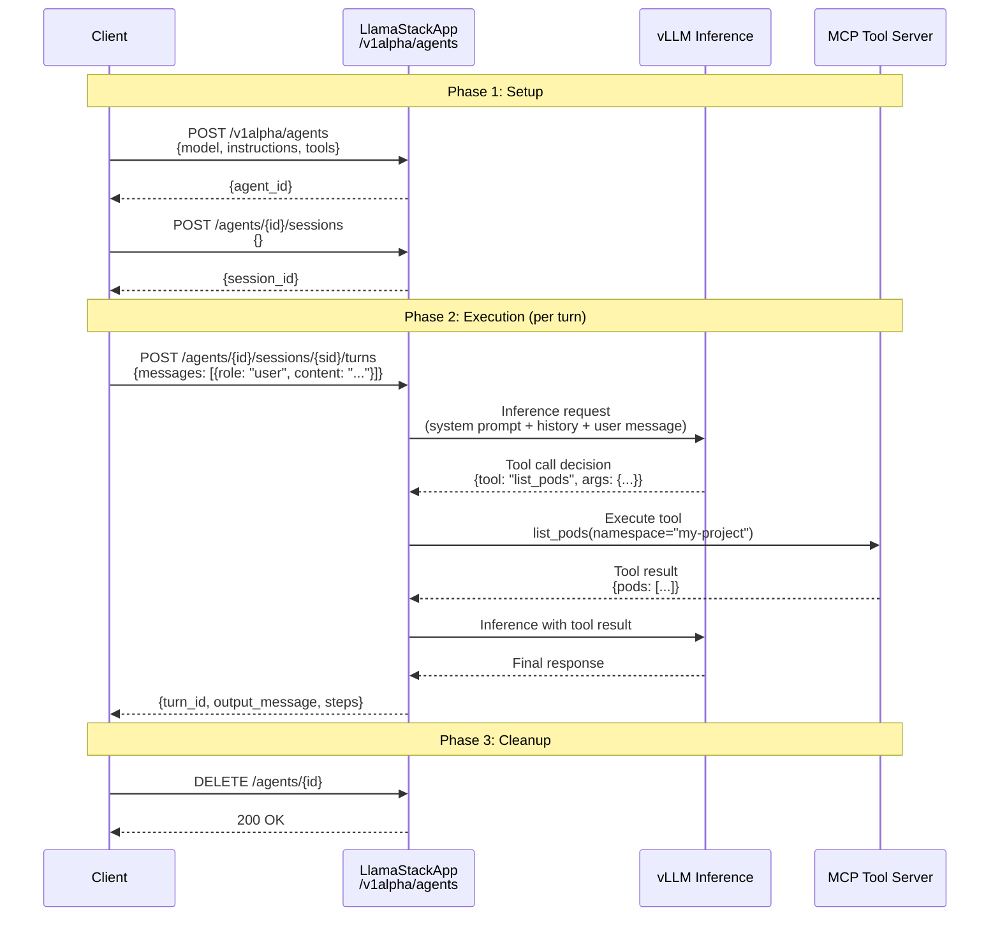
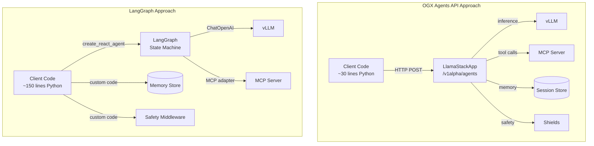

# L2-M3.3 -- OGX Agents API on OpenShift AI

**Level:** Practitioner
**Duration:** 1 hour

## Overview

The OGX / Llama Stack platform provides a dedicated Agents API that handles the full agent lifecycle -- creation, session management, turn execution, tool calling, memory, and safety -- through a single unified endpoint. If you have built agents with LangGraph (as in L2-M3.2), you wrote Python code to wire together the LLM, tools, memory, and control flow yourself. The OGX Agents API shifts that orchestration to the server side: you make HTTP calls, and the LlamaStackApp handles the rest.

This lesson teaches you how to use the OGX Agents API on OpenShift AI, deploy an OGX-native agent using the `LlamaStackApp` CR, and compare the OGX approach with the LangGraph approach you already know.

## Prerequisites

- Completed: [L2-M3.1 -- Agent Deployment Patterns](../1_deployment_patterns/) and [L2-M3.2 -- LangChain and LangGraph on OpenShift AI](../2_langchain_langgraph/)
- Completed: OGX / Llama Stack sub-tutorial (tutorial_ai/ogx/ -- agents section)
- vLLM model serving deployed and running (from L1-M2 or L2-M1)
- MCP servers deployed and accessible (from L2-M2)
- OpenShift cluster with OpenShift AI installed and `llamastackoperator` component enabled
- `LlamaStackApp` CR deployed (from the OGX sub-tutorial)
- Python 3.11+ with `httpx` installed locally (for running the scripts)

## K8s Context

On vanilla Kubernetes, building an AI agent requires you to assemble the entire stack yourself: deploy the inference engine, write the agent loop in Python (using LangGraph, AutoGen, CrewAI, or raw code), manage conversation history in an external store, integrate tool calling through custom adapters, and bolt on safety checks as middleware. The "agent" is your code -- the platform provides nothing above raw container orchestration.

OpenShift AI with the `llamastackoperator` changes this. The `LlamaStackApp` CR deploys a Llama Stack server that exposes a standardized Agents API. Your client code shrinks from hundreds of lines of orchestration logic to a handful of HTTP calls. The server manages the agent lifecycle, tool dispatch, memory, and safety integration.

## Concepts

### The OGX Agents API

OGX (Open Generic AI eXchange) -- the open standard behind Llama Stack -- defines a set of REST endpoints for agent orchestration. The Agents API is the highest-level abstraction in the stack, sitting above the inference, safety, memory, and tool-runtime APIs.

The key endpoints are:

| Endpoint | Method | Purpose |
|----------|--------|---------|
| `/v1alpha/agents` | POST | Create a new agent with model, tools, and instructions |
| `/v1alpha/agents/{agent_id}/sessions` | POST | Create a conversation session for an agent |
| `/v1alpha/agents/{agent_id}/sessions/{session_id}/turns` | POST | Execute a turn (send a message, get a response) |
| `/v1alpha/agents/{agent_id}/turns/{turn_id}` | GET | Retrieve turn results (for async execution) |
| `/v1alpha/agents/{agent_id}` | DELETE | Delete an agent |

### Agent Lifecycle

The OGX agent lifecycle follows a clear three-phase pattern:



**Phase 1 -- Setup:** Create an agent definition (model, system prompt, available tools) and a session (conversation context). The agent definition is reusable across sessions.

**Phase 2 -- Execution:** Send user messages as "turns." The server handles the full reasoning loop internally: it calls the LLM, detects tool-use requests, dispatches tool calls to the configured tool runtime (MCP servers), feeds results back to the LLM, and returns the final response. Multiple tool calls can happen in a single turn -- the client does not need to manage this loop.

**Phase 3 -- Cleanup:** Delete the agent when done. Sessions and their history are cleaned up with the agent.

### What the OGX Agent API Provides

The Agents API is not just a thin wrapper around inference. It bundles several capabilities that you would otherwise build yourself:

1. **Tool calling orchestration** -- The server handles the LLM-decides-to-call-a-tool -> execute-tool -> feed-result-back loop automatically. Multi-step tool chains work without client intervention.

2. **Memory and context management** -- Conversation history is maintained server-side within a session. Each turn automatically includes prior context. You do not need an external memory store.

3. **Safety integration** -- If shields (content safety filters) are configured on the LlamaStackApp, they are applied to every turn automatically -- both on input (user messages) and output (agent responses).

4. **Structured execution steps** -- The API returns not just the final response but also the intermediate steps (inference calls, tool calls, tool results), giving you full observability into the agent's reasoning.

5. **Streaming support** -- Turns can be streamed, delivering intermediate steps and the final response as server-sent events (SSE).

### Agent Configuration

When creating an agent, you provide:

```json
{
  "agent_config": {
    "model": "granite-3.3-8b-instruct",
    "instructions": "You are a helpful OpenShift operations assistant...",
    "tools": [
      {
        "type": "mcp",
        "server_url": "http://mcp-gateway:8080/sse",
        "transport": "sse"
      }
    ],
    "tool_choice": "auto",
    "max_infer_iters": 5,
    "enable_session_persistence": true
  }
}
```

Key configuration fields:

| Field | Purpose |
|-------|---------|
| `model` | Which model to use for inference (must be served by the configured provider) |
| `instructions` | System prompt -- defines agent behavior and capabilities |
| `tools` | Tool definitions -- MCP servers, built-in tools, or custom function tools |
| `tool_choice` | `"auto"` (LLM decides), `"required"` (must use a tool), or `"none"` |
| `max_infer_iters` | Maximum reasoning loops per turn (prevents infinite tool-calling loops) |
| `enable_session_persistence` | Whether to persist session history |

### LlamaStackApp CR on OpenShift AI

The `llamastackoperator` component in OpenShift AI provides the `LlamaStackApp` Custom Resource. When you create a `LlamaStackApp` CR, the operator deploys a Llama Stack server pod with the Agents API (and all other OGX APIs) exposed as an OpenShift Route.

A minimal `LlamaStackApp` CR looks like:

```yaml
apiVersion: llamastack.io/v1alpha1
kind: LlamaStackApp
metadata:
  name: llama-stack-agent
  labels:
    app: llama-stack-agent
    tutorial-level: "2"
    tutorial-module: "M3"
spec:
  image: quay.io/redhat-ai-dev/llama-stack-server:latest
  env:
    - name: INFERENCE_MODEL
      value: "granite-3.3-8b-instruct"
    - name: INFERENCE_URL
      value: "http://vllm-server:8000/v1"
```

The operator creates:
- A Deployment running the Llama Stack server
- A Service exposing port 8321 (default Llama Stack port)
- A Route for external access

You interact with the Agents API through the Route URL. No additional manifests are needed for this lesson -- the `LlamaStackApp` CR from the OGX sub-tutorial provides everything.

## Step-by-Step

### Step 1: Verify the LlamaStackApp Is Running

Confirm that your `LlamaStackApp` from the OGX sub-tutorial is deployed and accessible:

```bash
# Check the LlamaStackApp CR status
oc get llamastackapp -n <your-project>

# Get the route URL
OGX_ENDPOINT=$(oc get route llama-stack-agent -n <your-project> -o jsonpath='{.spec.host}')
echo "OGX endpoint: https://${OGX_ENDPOINT}"

# Verify the server is responding
curl -s "https://${OGX_ENDPOINT}/v1alpha/health" | python3 -m json.tool
```

Expected output:

```json
{
  "status": "ok"
}
```

You can also list the available API providers to confirm inference and tool-runtime are configured:

```bash
curl -s "https://${OGX_ENDPOINT}/v1alpha/providers" | python3 -m json.tool
```

### Step 2: Explore the Agents API Endpoints

Before writing code, walk through the API manually with `curl` to understand the request/response structure.

**Create an agent:**

```bash
curl -s -X POST "https://${OGX_ENDPOINT}/v1alpha/agents" \
  -H "Content-Type: application/json" \
  -d '{
    "agent_config": {
      "model": "granite-3.3-8b-instruct",
      "instructions": "You are a helpful assistant that answers questions about OpenShift clusters. Use the available tools to query the cluster when needed.",
      "tools": [
        {
          "type": "mcp",
          "server_url": "http://mcp-gateway:8080/sse",
          "transport": "sse"
        }
      ],
      "tool_choice": "auto",
      "max_infer_iters": 5,
      "enable_session_persistence": true
    }
  }' | python3 -m json.tool
```

Expected response:

```json
{
  "agent_id": "agent-abc123def456"
}
```

**Create a session:**

```bash
AGENT_ID="agent-abc123def456"  # Use the agent_id from above

curl -s -X POST "https://${OGX_ENDPOINT}/v1alpha/agents/${AGENT_ID}/sessions" \
  -H "Content-Type: application/json" \
  -d '{}' | python3 -m json.tool
```

Expected response:

```json
{
  "session_id": "sess-789xyz"
}
```

**Execute a turn:**

```bash
SESSION_ID="sess-789xyz"  # Use the session_id from above

curl -s -X POST "https://${OGX_ENDPOINT}/v1alpha/agents/${AGENT_ID}/sessions/${SESSION_ID}/turns" \
  -H "Content-Type: application/json" \
  -d '{
    "messages": [
      {
        "role": "user",
        "content": "What pods are running in the current namespace?"
      }
    ]
  }' | python3 -m json.tool
```

Expected response (abbreviated):

```json
{
  "turn_id": "turn-001",
  "output_message": {
    "role": "assistant",
    "content": "Here are the pods running in the current namespace:\n\n1. vllm-server-7b8c9d-x4k2p (Running)\n2. mcp-gateway-5f6a7b-m3n1q (Running)\n3. llama-stack-agent-8d9e0f-r2s5t (Running)"
  },
  "steps": [
    {
      "step_type": "inference",
      "model_response": {
        "role": "assistant",
        "tool_calls": [
          {
            "tool_name": "list_pods",
            "arguments": {"namespace": "my-project"}
          }
        ]
      }
    },
    {
      "step_type": "tool_execution",
      "tool_calls": [
        {
          "tool_name": "list_pods",
          "arguments": {"namespace": "my-project"},
          "result": "{\"pods\": [...]}"
        }
      ]
    },
    {
      "step_type": "inference",
      "model_response": {
        "role": "assistant",
        "content": "Here are the pods running..."
      }
    }
  ]
}
```

Notice the `steps` array -- it shows the full reasoning chain: the LLM first decided to call the `list_pods` tool, the server executed it, then the LLM generated the final response using the tool result. This all happened in a single HTTP request from the client's perspective.

### Step 3: Create an OGX Agent with Python

The `scripts/ogx_agent.py` script demonstrates the full agent lifecycle in Python. Review the code, then run it:

```bash
# Set environment variables
export OGX_ENDPOINT="https://$(oc get route llama-stack-agent -o jsonpath='{.spec.host}')"

# Run the agent script
cd scripts/
pip install httpx
python3 ogx_agent.py
```

The script performs the following sequence:

1. Creates an agent with a system prompt and MCP tool definitions
2. Creates a session (conversation context)
3. Executes a turn with a user query
4. Parses and displays the response, including intermediate tool-calling steps
5. Executes a follow-up turn in the same session (demonstrating memory)
6. Cleans up by deleting the agent

Key points to observe in the output:

- The agent automatically decides whether to call tools based on the user query
- Tool calling happens server-side -- the client only sends messages and receives results
- The second turn has access to the context from the first turn (session memory)
- Each turn response includes the full chain of reasoning steps

### Step 4: Observe Tool Calling in Action

Run the agent script with a query that requires tool use and watch the execution steps:

```bash
# The script prints each step as it happens
python3 ogx_agent.py --query "List all deployments and their replica counts"
```

The output shows the three-phase flow for each turn:

```
=== Creating agent ===
Agent ID: agent-abc123def456

=== Creating session ===
Session ID: sess-789xyz

=== Executing turn 1 ===
User: List all deployments and their replica counts

--- Step 1: inference ---
LLM decided to call tool: list_deployments(namespace="my-project")

--- Step 2: tool_execution ---
Tool result: {"deployments": [{"name": "vllm-server", "replicas": 1}, ...]}

--- Step 3: inference ---
LLM generated final response.
Assistant response:
Here are the deployments in the current namespace:
- vllm-server: 1/1 replicas ready
- mcp-gateway: 1/1 replicas ready
- llama-stack-agent: 1/1 replicas ready

=== Executing turn 2 (follow-up, same session) ===
User: Which of those has the most replicas?

--- Step 1: inference ---
LLM answered from memory (no tool call needed).

Assistant response:
All three deployments currently have the same replica count (1 replica each).
```

The follow-up turn demonstrates session memory -- the agent answered the second question using context from the first turn without making another tool call.

### Step 5: Compare with the LangGraph Approach

The `scripts/ogx_vs_langgraph_comparison.py` script runs the same task using both OGX and LangGraph, so you can compare the two approaches side by side.

```bash
# Set environment variables for both approaches
export OGX_ENDPOINT="https://$(oc get route llama-stack-agent -o jsonpath='{.spec.host}')"
export VLLM_ENDPOINT="http://vllm-server:8000/v1"
export VLLM_MODEL_NAME="granite-3.3-8b-instruct"
export MCP_SERVER_URL="http://mcp-gateway:8080/sse"

# Install dependencies
pip install httpx langchain langchain-openai langgraph langchain-mcp-adapters

# Run the comparison
python3 ogx_vs_langgraph_comparison.py
```

The script output shows the same task completed by both approaches, highlighting the differences in code complexity, execution flow, and response format.

### Step 6: Discuss When to Use Which Approach

After running both approaches, consider the tradeoffs:

**Use OGX Agents API when:**
- You want minimal client-side code -- the server handles orchestration
- Built-in memory and safety integration matter
- You are already running a LlamaStackApp on OpenShift AI
- Your agent follows a standard ReAct-style tool-calling pattern
- You want a standardized, portable API (not tied to a Python framework)

**Use LangGraph when:**
- You need complex, custom control flow (conditional branching, parallel tool calls, human-in-the-loop)
- You are building multi-agent systems with custom state machines
- You need to integrate with the broader LangChain ecosystem (vector stores, document loaders, specialized chains)
- You want fine-grained control over every step of the agent loop
- Your agent logic does not fit the standard create-agent/create-session/execute-turn pattern

**Hybrid approach:** You can use LangGraph for orchestration while using OGX / Llama Stack for inference and tool execution. LangGraph's `ChatOpenAI` adapter can point to the vLLM endpoint (which is also used by the LlamaStackApp), and LangGraph can call MCP tools through `langchain-mcp-adapters`. This gives you LangGraph's flexible control flow with OGX's infrastructure.

### OGX vs LangGraph Architecture Comparison



The key architectural difference: with OGX, the server owns the agent loop. With LangGraph, your code owns it. This is the fundamental tradeoff between simplicity and control.

| Aspect | OGX Agents API | LangGraph |
|--------|---------------|-----------|
| Agent loop | Server-side (LlamaStackApp) | Client-side (Python code) |
| Tool calling | Automatic (server dispatches) | Manual (you wire adapters) |
| Memory | Built-in session persistence | You implement (checkpointer, external store) |
| Safety | Built-in shields | You add middleware |
| Control flow | Linear ReAct loop | Arbitrary state machines |
| Lines of code | ~30 for basic agent | ~150 for equivalent agent |
| Multi-agent | Not built-in (use multiple agents) | Native support (subgraphs, supervisors) |
| Streaming | SSE from turn endpoint | LangGraph stream modes |
| Ecosystem | OGX / Llama Stack | LangChain (vector stores, loaders, chains) |
| Portability | Any OGX-compatible server | Python only |

## Verification

Confirm the lesson objectives by checking:

1. **LlamaStackApp is accessible:**
   ```bash
   curl -s "https://${OGX_ENDPOINT}/v1alpha/health"
   # Should return {"status": "ok"}
   ```

2. **Agent creation works:**
   ```bash
   python3 scripts/ogx_agent.py --dry-run
   # Should print the agent config without executing
   ```

3. **Full agent lifecycle completes:**
   ```bash
   python3 scripts/ogx_agent.py
   # Should create agent, session, execute turns, and clean up
   ```

4. **Comparison script runs both approaches:**
   ```bash
   python3 scripts/ogx_vs_langgraph_comparison.py
   # Should show results from both OGX and LangGraph
   ```

5. **Session memory works:** The second turn in `ogx_agent.py` should reference context from the first turn without making additional tool calls.

## K8s vs OpenShift AI Comparison

| Aspect | Kubernetes (DIY) | OpenShift AI (OGX) |
|--------|------------------|---------------------|
| Agent runtime | Custom Python code in a Pod | LlamaStackApp CR deploys server |
| Agent API | You build it (FastAPI, Flask) | Standardized /v1alpha/agents endpoints |
| Tool integration | Custom adapters per tool | MCP protocol, server handles dispatch |
| Memory | External store (Redis, Postgres) | Built-in session persistence |
| Safety | Custom middleware | Built-in shields on LlamaStackApp |
| Deployment | Dockerfile + Deployment + Service | One `LlamaStackApp` CR |
| Scaling | Manual HPA configuration | Operator-managed |
| Observability | Custom logging/metrics | Structured execution steps in API response |

## Key Takeaways

- The OGX Agents API provides a server-side agent runtime -- create an agent, open a session, execute turns, and the server handles tool calling, memory, and safety automatically
- The agent lifecycle is three phases: setup (create agent + session), execution (turns with automatic tool dispatch), and cleanup (delete agent)
- The API returns structured execution steps, giving full visibility into the LLM's reasoning and tool-calling chain
- Compared to LangGraph, OGX requires far less code but offers less control over the agent loop -- choose based on your complexity needs
- A hybrid approach is possible: LangGraph for orchestration, OGX/Llama Stack for inference and tool execution
- On OpenShift AI, the `LlamaStackApp` CR handles deployment -- no custom Dockerfiles or Deployment manifests needed

## Cleanup

```bash
# The ogx_agent.py script cleans up after itself (deletes the agent).
# If you created agents manually via curl, delete them:
curl -s -X DELETE "https://${OGX_ENDPOINT}/v1alpha/agents/${AGENT_ID}"

# The LlamaStackApp CR stays running for use in subsequent lessons.
# Only delete it if you are done with the OGX sub-tutorial:
# oc delete llamastackapp llama-stack-agent -n <your-project>
```

## Next Steps

In the next lesson, [L2-M3.4 -- Agents with MCP Tools](../4_agents_mcp_tools/), you will connect agents (both OGX and LangGraph) to multiple MCP tool servers and build agents that can perform complex multi-tool operations across your OpenShift cluster -- combining Kubernetes operations, monitoring queries, and log analysis in a single agent.
