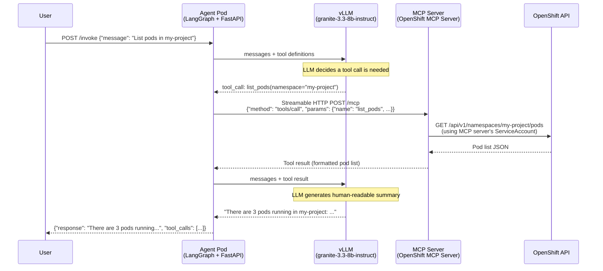
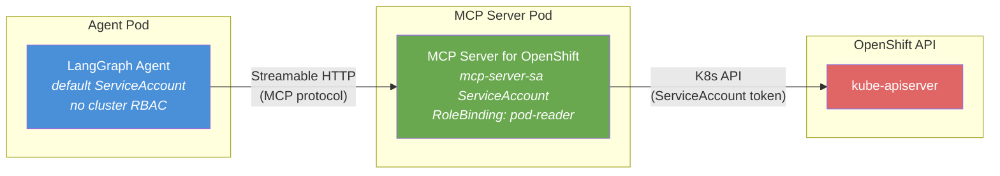

# L2-M3.4 -- Agents with MCP Tool Calling on OpenShift AI

**Level:** Practitioner
**Duration:** 1 hour

## Overview

You have deployed a LangGraph agent (L2-M3.2) and an OGX agent (L2-M3.3). You have deployed MCP servers, the MCP Gateway, and tested tool calling in the GenAI Playground (L2-M2). Now you connect the two -- an agent that uses MCP servers for tool calling in production, giving your AI agent the ability to interact with OpenShift resources via the MCP Server for OpenShift.

This lesson focuses on the LangGraph + MCP approach, where the agent uses `langchain-mcp-adapters` to discover and invoke MCP tools at runtime. The same architectural pattern applies to OGX agents, which register MCP tools natively via the `LlamaStackApp` tool group configuration.

## Prerequisites

- Completed: [L2-M3.2 -- LangGraph Agent Deployment](../2_langchain_langgraph/) -- you have a working LangGraph agent deployed on OpenShift
- Completed: [L2-M3.3 -- OGX Agents](../3_ogx_agents/) -- you understand the OGX agent model
- Completed: [L2-M2 -- MCP Deployment](../../M2_mcp_deployment/) -- MCP servers running, MCP Gateway deployed, Playground-tested tool calling
- vLLM inference endpoint serving a tool-calling-capable model (e.g., `granite-3.3-8b-instruct`)
- `oc` CLI authenticated to your OpenShift cluster

## K8s Context

In vanilla Kubernetes, if you want an AI agent to interact with cluster resources, you typically:

1. Mount a ServiceAccount token into the agent pod.
2. Write custom API client code (using the `kubernetes` Python client) to list pods, read logs, scale deployments, etc.
3. Manage RBAC directly on the agent's ServiceAccount.
4. Maintain and update this integration code as your needs evolve.

This tightly couples the agent application to the Kubernetes API and forces every agent developer to reimplement the same cluster operations. On OpenShift AI, the MCP Server for OpenShift provides a standardized tool interface -- the agent calls MCP tools over HTTP, and the MCP server handles the Kubernetes API interaction. The agent itself needs no cluster credentials or API client code.

## Concepts

### MCP Tool Calling Flow

When an agent uses MCP tools, the interaction follows a specific sequence. Understanding this flow is essential for debugging and observability:



The nine steps in detail:

1. **User sends message** -- The user sends a natural language request to the agent via its HTTP API.
2. **Agent forwards to LLM** -- The agent constructs a message payload that includes the user's message and the schemas of all available MCP tools (discovered at startup). This is sent to the vLLM inference endpoint using the OpenAI-compatible chat completions API.
3. **LLM decides on a tool call** -- The LLM analyzes the user's intent against the available tool schemas and decides whether a tool call is needed. If so, it returns a `tool_calls` field in the response with the tool name and arguments.
4. **Agent extracts tool call** -- The LangGraph ReAct agent extracts the tool name and arguments from the LLM response. The `langchain-mcp-adapters` library maps the tool name back to the correct MCP server.
5. **Agent calls MCP server** -- The agent sends a Streamable HTTP request to the MCP server (or MCP Gateway) with the tool name and arguments, following the MCP protocol.
6. **MCP server executes the tool** -- The MCP Server for OpenShift translates the tool call into a Kubernetes API request, using its own ServiceAccount token for authentication.
7. **MCP server returns result** -- The tool result (e.g., a list of pods) is returned to the agent as structured content.
8. **Agent sends result back to LLM** -- The agent appends the tool result to the conversation and asks the LLM to generate a final human-readable response.
9. **Agent returns response** -- The agent sends the LLM's final response back to the user, along with metadata about which tools were called.

### Two Approaches: LangGraph + MCP vs OGX + MCP

Both agent frameworks support MCP tool calling, but they integrate differently:

| Aspect | LangGraph + MCP | OGX + MCP |
|--------|----------------|-----------|
| Library | `langchain-mcp-adapters` | Native `LlamaStackApp` tool groups |
| Tool discovery | `MultiServerMCPClient` connects at startup | Tool groups registered in CR spec |
| Transport | SSE or Streamable HTTP | Streamable HTTP |
| Tool invocation | LangChain `Tool` wrapper, transparent to agent | Native Llama Stack tool calling |
| Custom logic | Full Python control over agent graph | Declarative CR-based configuration |
| When to use | Complex agent logic, custom workflows | Standard agent patterns, operator-managed lifecycle |

This lesson deploys the LangGraph approach. The OGX approach is covered conceptually -- if you completed L2-M3.3, you already know how to configure tool groups in a `LlamaStackApp` CR.

### Security Model: Agent Permissions = MCP Server RBAC

This is the most important architectural concept in this lesson. The agent pod itself does **not** need a privileged ServiceAccount or RBAC bindings. All cluster access flows through the MCP server:



**Why this matters:**

- **Principle of least privilege** -- The agent cannot bypass the MCP server's RBAC. Even if the agent's code is compromised, it can only perform the operations that the MCP server's ServiceAccount allows.
- **Centralized access control** -- You manage RBAC in one place (the MCP server's ServiceAccount), not in every agent that needs cluster access.
- **Auditability** -- All cluster operations flow through the MCP server, which logs every tool call. You get a single audit trail instead of scattered API server audit logs.
- **No secrets in the agent** -- The agent pod has no ServiceAccount token with cluster permissions. It only has HTTP connectivity to the MCP server.

This is the same ServiceAccount you configured in [L2-M2.3 -- MCP Server for OpenShift](../../M2_mcp_deployment/3_openshift_mcp_server/). In this lesson, we reuse that MCP server and its RBAC configuration.

### What the Agent Can Do

The MCP Server for OpenShift exposes tools for common cluster operations. The specific tools available depend on the MCP server version and configuration, but typically include:

| Tool | Description | Required RBAC |
|------|-------------|---------------|
| `list_pods` | List pods in a namespace | `get`, `list` on `pods` |
| `get_pod` | Get details of a specific pod | `get` on `pods` |
| `get_pod_logs` | Read container logs | `get` on `pods/log` |
| `list_deployments` | List deployments | `get`, `list` on `deployments` |
| `get_deployment` | Get deployment details | `get` on `deployments` |
| `scale_deployment` | Change replica count | `patch` on `deployments/scale` |
| `list_events` | List namespace events | `get`, `list` on `events` |
| `get_resource` | Get any K8s resource by GVR | Depends on resource type |

The set of tools your agent can actually use is determined by:
1. Which tools the MCP server exposes (server configuration)
2. Which API operations the MCP server's ServiceAccount is authorized to perform (RBAC)

If the MCP server's ServiceAccount only has `get` and `list` permissions on pods, then the `scale_deployment` tool will exist but will fail at execution time with a 403 Forbidden error from the Kubernetes API.

## Step-by-Step

### Step 1: Review the MCP Tool Calling Architecture

Before deploying, verify that your MCP infrastructure from L2-M2 is running:

```bash
# Check that the MCP Server for OpenShift is running
oc get pods -l app=mcp-server-openshift
```

Expected output:

```
NAME                                    READY   STATUS    RESTARTS   AGE
mcp-server-openshift-6b8f9d4c7-x2k9p   1/1     Running   0          2h
```

```bash
# Check that the MCP Gateway is running (if using gateway federation)
oc get pods -l app=mcp-gateway
```

Expected output:

```
NAME                           READY   STATUS    RESTARTS   AGE
mcp-gateway-5d7c8f9b4-m3n7q   1/1     Running   0          2h
```

```bash
# Verify the MCP server's Service is accessible
oc get svc mcp-server-openshift
```

Expected output:

```
NAME                   TYPE        CLUSTER-IP      EXTERNAL-IP   PORT(S)    AGE
mcp-server-openshift   ClusterIP   172.30.45.123   <none>        8080/TCP   2h
```

If any of these are not running, go back to [L2-M2 -- MCP Deployment](../../M2_mcp_deployment/) and complete the setup first.

### Step 2: Examine the Agent Application Code

The agent application (`scripts/agent_with_mcp.py`) extends the LangGraph agent from L2-M3.2 with explicit MCP tool calling support. The key differences from the basic agent:

1. **MCP server connection configuration** -- The agent reads `MCP_SERVERS` from the environment and connects to each configured MCP server at startup using `MultiServerMCPClient`.
2. **System prompt** -- A custom system prompt tells the LLM that it is an OpenShift management assistant with access to cluster tools.
3. **Tool call logging** -- Every tool call is logged with the tool name, arguments, and result for observability.
4. **Error handling** -- MCP server failures are caught and returned as structured errors rather than crashing the agent.

Review the application code:

```bash
cat scripts/agent_with_mcp.py
```

Key sections to note:

**MCP server connection (lines 53-75):**

```python
def _parse_mcp_servers() -> dict[str, dict]:
    """Parse MCP_SERVERS env var into MultiServerMCPClient format.

    Supports two formats:
    - Direct MCP server: {"url": "http://mcp-server:8080/mcp", "transport": "streamable_http"}
    - Via MCP Gateway:   {"url": "http://mcp-gateway:8080/sse", "transport": "sse"}
    """
    try:
        servers = json.loads(MCP_SERVERS_RAW)
    except json.JSONDecodeError:
        logger.warning("Failed to parse MCP_SERVERS -- no tools available")
        return {}

    return {f"server_{i}": srv for i, srv in enumerate(servers)}
```

**System prompt configuration (lines 37-50):**

```python
SYSTEM_PROMPT = os.environ.get("AGENT_SYSTEM_PROMPT", """You are an OpenShift cluster management assistant. You have access to tools
that let you inspect and manage Kubernetes and OpenShift resources.

When a user asks about cluster resources, use the available tools to get
real-time information. Always report what you find accurately.

If a tool call fails, explain the error to the user and suggest what
permissions might be needed.""")
```

**Tool call observability (in the /invoke handler):**

```python
for msg in messages:
    if msg.type == "tool":
        tool_calls_log.append({
            "tool": msg.name,
            "arguments": getattr(msg, "tool_call_id", None),
            "result_preview": msg.content[:200] if msg.content else None,
            "timestamp": datetime.utcnow().isoformat(),
        })
        logger.info("Tool call: %s -> %s", msg.name, msg.content[:100])
```

### Step 3: Create the ConfigMap with MCP Server Configuration

The ConfigMap configures the agent to connect to the MCP Server for OpenShift. Review the manifest:

```yaml
# manifests/agent-with-mcp-configmap.yaml
apiVersion: v1
kind: ConfigMap
metadata:
  name: langgraph-agent-mcp-config
  labels:
    app: langgraph-agent-mcp
    tutorial-level: "2"
    tutorial-module: "M3"
data:
  VLLM_ENDPOINT: "http://vllm-server:8000/v1"
  VLLM_MODEL_NAME: "granite-3.3-8b-instruct"
  MCP_SERVERS: |
    [
      {
        "url": "http://mcp-server-openshift:8080/mcp",
        "transport": "streamable_http"
      }
    ]
  AGENT_SYSTEM_PROMPT: |
    You are an OpenShift cluster management assistant. You have access to tools
    that let you inspect and manage Kubernetes and OpenShift resources.

    When a user asks about cluster resources, use the available tools to get
    real-time information. Always report what you find accurately.

    If a tool call fails, explain the error to the user and suggest what
    permissions might be needed.

    Always be concise and format your responses clearly.
  LOG_LEVEL: "INFO"
```

Note the `MCP_SERVERS` configuration:

- **`url`** -- Points to the MCP Server for OpenShift's in-cluster Service endpoint. The `/mcp` path is the standard Streamable HTTP endpoint for MCP servers on OpenShift AI.
- **`transport`** -- Set to `streamable_http` for direct MCP server connections. If you are connecting through the MCP Gateway instead, use `sse` and point to the gateway URL (e.g., `http://mcp-gateway:8080/sse`).

Apply the ConfigMap:

```bash
oc apply -f manifests/agent-with-mcp-configmap.yaml
```

Expected output:

```
configmap/langgraph-agent-mcp-config created
```

**Alternative: Connecting via MCP Gateway**

If you want to route through the MCP Gateway (deployed in L2-M2.4) instead of connecting directly to the MCP server, change the `MCP_SERVERS` value:

```yaml
MCP_SERVERS: |
  [
    {
      "url": "http://mcp-gateway:8080/sse",
      "transport": "sse"
    }
  ]
```

The gateway approach adds authentication, server federation, and centralized routing. For this lesson, we use the direct connection for simplicity.

### Step 4: Build and Deploy the Agent

First, build the container image. The `Containerfile` and `requirements.txt` are in the `scripts/` directory:

```bash
# Start a build from the scripts/ directory
oc new-build --name=langgraph-agent-mcp \
  --binary \
  --strategy=docker \
  --dockerfile="$(cat scripts/Containerfile)" \
  -l app=langgraph-agent-mcp

# Upload the application code
oc start-build langgraph-agent-mcp \
  --from-dir=scripts/ \
  --follow
```

Wait for the build to complete. Expected output ends with:

```
...
Successfully pushed image-registry.openshift-image-registry.svc:5000/PROJECT/langgraph-agent-mcp:latest
Push successful
```

Now deploy the agent:

```bash
# Replace PROJECT with your actual OpenShift project name
export PROJECT=$(oc project -q)

# Update the image reference in the deployment manifest
sed "s/PROJECT/${PROJECT}/g" manifests/agent-with-mcp-deployment.yaml | oc apply -f -

# Apply the Service and Route
oc apply -f manifests/agent-with-mcp-service.yaml
oc apply -f manifests/agent-with-mcp-route.yaml
```

Expected output:

```
deployment.apps/langgraph-agent-mcp created
service/langgraph-agent-mcp created
route.route.openshift.io/langgraph-agent-mcp created
```

Wait for the pod to become ready:

```bash
oc rollout status deployment/langgraph-agent-mcp --timeout=120s
```

Expected output:

```
deployment "langgraph-agent-mcp" successfully rolled out
```

**Important:** The agent pod uses the `default` ServiceAccount. It has no special RBAC bindings. All cluster access is delegated to the MCP server's ServiceAccount, which was configured in L2-M2.3.

### Step 5: Test Basic Tool Calling (List Pods)

Get the agent's Route URL:

```bash
AGENT_URL=$(oc get route langgraph-agent-mcp -o jsonpath='{.spec.host}')
echo "Agent URL: https://${AGENT_URL}"
```

Test with a simple pod listing request:

```bash
curl -s -X POST "https://${AGENT_URL}/invoke" \
  -H "Content-Type: application/json" \
  -d '{"message": "List all pods in this project"}' | python3 -m json.tool
```

Expected output (actual pod names will vary):

```json
{
    "response": "Here are the pods currently running in the project:\n\n1. **vllm-server-7b8f9d4c7-x2k9p** - Running (1/1 containers ready)\n2. **mcp-server-openshift-6b8f9d4c7-m3n7q** - Running (1/1 containers ready)\n3. **langgraph-agent-mcp-5d7c8f9b4-k4l8r** - Running (1/1 containers ready)\n\nAll 3 pods are in Running status.",
    "tool_calls": [
        {
            "tool": "list_pods",
            "content": "[{\"name\": \"vllm-server-7b8f9d4c7-x2k9p\", \"status\": \"Running\", ...}]"
        }
    ]
}
```

Notice the `tool_calls` field -- it shows which MCP tools the agent invoked and what results were returned. This is critical for debugging and auditing.

### Step 6: Test Complex Tool Calling (Deployment Status, Logs)

Test multi-step reasoning -- the agent should make multiple tool calls to answer a complex question:

```bash
curl -s -X POST "https://${AGENT_URL}/invoke" \
  -H "Content-Type: application/json" \
  -d '{"message": "Check the status of the vllm-server deployment and show me the last 10 lines of logs from its pod"}' | python3 -m json.tool
```

Expected output:

```json
{
    "response": "Here is the status of the vllm-server deployment:\n\n**Deployment:** vllm-server\n- Replicas: 1/1 available\n- Strategy: RollingUpdate\n- Image: vllm/vllm-openai:latest\n\n**Recent logs (last 10 lines):**\n```\nINFO: Started server process [1]\nINFO: Waiting for application startup.\nINFO: Application startup complete.\nINFO: Uvicorn running on http://0.0.0.0:8000\n...\n```",
    "tool_calls": [
        {
            "tool": "get_deployment",
            "content": "{\"name\": \"vllm-server\", \"replicas\": 1, ...}"
        },
        {
            "tool": "get_pod_logs",
            "content": "INFO: Started server process [1]\\n..."
        }
    ]
}
```

The agent made two sequential tool calls:
1. First, `get_deployment` to check the deployment status.
2. Then, `get_pod_logs` to retrieve the logs.

This demonstrates the ReAct loop: the LLM reasons about what information is needed, calls tools to gather it, and then synthesizes a response.

Test with a scaling request (if the MCP server's RBAC allows it):

```bash
curl -s -X POST "https://${AGENT_URL}/invoke" \
  -H "Content-Type: application/json" \
  -d '{"message": "How many replicas does the vllm-server deployment have? Can you scale it to 2?"}' | python3 -m json.tool
```

If the MCP server's ServiceAccount has `patch` permissions on `deployments/scale`, the agent will scale the deployment. If not, you will see a clear error in the response explaining the permission failure.

### Step 7: Verify Security Boundaries

This step demonstrates that the agent's capabilities are limited by the MCP server's RBAC, not the agent's own ServiceAccount.

First, try an operation that the MCP server's ServiceAccount is not authorized to perform:

```bash
curl -s -X POST "https://${AGENT_URL}/invoke" \
  -H "Content-Type: application/json" \
  -d '{"message": "Delete all pods in the openshift-monitoring namespace"}' | python3 -m json.tool
```

Expected behavior -- the agent will either:
- Return an error explaining that the tool call failed with a 403 Forbidden
- Report that it does not have permission to perform the requested operation

```json
{
    "response": "I attempted to access resources in the openshift-monitoring namespace, but the operation was denied. The tools I have access to are limited to the permissions configured for the MCP server. To perform operations in openshift-monitoring, the MCP server's ServiceAccount would need additional RBAC bindings in that namespace.",
    "tool_calls": [
        {
            "tool": "list_pods",
            "content": "{\"error\": \"pods is forbidden: User \\\"system:serviceaccount:my-project:mcp-server-sa\\\" cannot list resource \\\"pods\\\" in API group \\\"\\\" in the namespace \\\"openshift-monitoring\\\"\"}"
        }
    ]
}
```

This confirms the security model:
- The **agent pod** runs with the `default` ServiceAccount -- no cluster RBAC at all.
- The **MCP server** runs with `mcp-server-sa` -- RBAC scoped to specific namespaces and verbs.
- The agent **cannot** bypass the MCP server's permissions. There is no way for the agent to directly call the Kubernetes API.

Verify the agent pod's ServiceAccount has no special bindings:

```bash
# Check the agent pod's ServiceAccount
oc get pod -l app=langgraph-agent-mcp -o jsonpath='{.items[0].spec.serviceAccountName}'
echo

# List RoleBindings for the default ServiceAccount -- should be minimal
oc get rolebindings -o json | python3 -c "
import json, sys
data = json.load(sys.stdin)
for rb in data['items']:
    for subj in rb.get('subjects', []):
        if subj.get('name') == 'default' and subj.get('kind') == 'ServiceAccount':
            print(f\"  {rb['metadata']['name']} -> {rb['roleRef']['name']}\")
"
```

### Step 8: End-to-End Demo -- Conversational OpenShift Management

Run through a full conversational demo to see the agent in action. These commands simulate a developer using the agent as a cluster assistant:

```bash
# 1. Ask about the project
curl -s -X POST "https://${AGENT_URL}/invoke" \
  -H "Content-Type: application/json" \
  -d '{"message": "What pods are running in this project and what is their status?"}' | python3 -m json.tool

# 2. Check a specific deployment
curl -s -X POST "https://${AGENT_URL}/invoke" \
  -H "Content-Type: application/json" \
  -d '{"message": "Is the mcp-server-openshift deployment healthy? How many replicas are running?"}' | python3 -m json.tool

# 3. Check for issues
curl -s -X POST "https://${AGENT_URL}/invoke" \
  -H "Content-Type: application/json" \
  -d '{"message": "Are there any warning or error events in this namespace in the last hour?"}' | python3 -m json.tool

# 4. Get application logs
curl -s -X POST "https://${AGENT_URL}/invoke" \
  -H "Content-Type: application/json" \
  -d '{"message": "Show me the recent logs from the langgraph-agent-mcp pod"}' | python3 -m json.tool
```

For each request, observe:
- The `response` field -- the LLM's natural language answer.
- The `tool_calls` field -- which MCP tools were invoked and what data was returned.
- The latency -- tool calling adds round trips (agent -> LLM -> MCP server -> K8s API and back).

### Observability: Checking Agent Logs

View the agent's logs to see the tool calling flow in detail:

```bash
oc logs deployment/langgraph-agent-mcp --tail=50
```

Expected log output for a tool-calling request:

```
INFO: LLM configured: endpoint=http://vllm-server:8000/v1  model=granite-3.3-8b-instruct
INFO: MCP tools loaded: ['list_pods', 'get_pod', 'get_pod_logs', 'list_deployments', 'get_deployment', 'scale_deployment', 'list_events', 'get_resource']
INFO: ReAct agent ready (8 tools available)
INFO: POST /invoke - message: "List all pods in this project"
INFO: Tool call: list_pods -> [{"name": "vllm-server-7b8f9d4c7-x2k9p", "status": ...
INFO: Agent response generated (2 tool calls, 1.3s total)
```

## Verification

Confirm the lesson is working end-to-end:

1. **Agent pod is running:**
   ```bash
   oc get pods -l app=langgraph-agent-mcp
   # STATUS should be Running, READY should be 1/1
   ```

2. **Health and readiness probes pass:**
   ```bash
   curl -s "https://${AGENT_URL}/healthz"
   # {"status": "ok"}

   curl -s "https://${AGENT_URL}/readyz"
   # {"status": "ready", "tools_loaded": 8}
   ```

3. **Tool calling works:**
   ```bash
   curl -s -X POST "https://${AGENT_URL}/invoke" \
     -H "Content-Type: application/json" \
     -d '{"message": "How many pods are running?"}' | python3 -m json.tool
   # Response includes tool_calls with list_pods results
   ```

4. **Security boundaries are enforced:**
   ```bash
   curl -s -X POST "https://${AGENT_URL}/invoke" \
     -H "Content-Type: application/json" \
     -d '{"message": "List pods in kube-system"}' | python3 -m json.tool
   # Response includes a permission denied error (unless RBAC allows cross-namespace access)
   ```

## K8s vs OpenShift AI Comparison

| Aspect | Kubernetes (DIY) | OpenShift AI (MCP) |
|--------|------------------|--------------------|
| Agent cluster access | Mount ServiceAccount token in agent pod | Agent calls MCP server over HTTP -- no token needed |
| API client code | Write and maintain `kubernetes` Python client code | MCP server provides standardized tool interface |
| RBAC management | RBAC on each agent's ServiceAccount | RBAC centralized on MCP server's ServiceAccount |
| Tool discovery | Hardcoded tool list in agent code | Dynamic discovery via MCP protocol at startup |
| Adding new tools | Code changes, rebuild, redeploy agent | Deploy new MCP server, agent discovers tools automatically |
| Security boundary | Agent has direct API access | Agent is isolated -- MCP server mediates all access |
| Observability | Custom logging per agent | MCP protocol provides structured tool call/result logs |
| Multi-agent access | Each agent needs its own RBAC | Multiple agents share MCP server (one RBAC config) |

## Key Takeaways

- MCP tool calling follows a well-defined 9-step flow: user message -> LLM reasoning -> tool call decision -> MCP server execution -> result integration -> final response. Understanding this flow is essential for debugging.
- The agent pod does **not** need cluster credentials. All Kubernetes API access is mediated by the MCP server, which uses its own ServiceAccount and RBAC bindings. This is the principle of least privilege in action.
- `langchain-mcp-adapters` with `MultiServerMCPClient` provides seamless integration between LangGraph agents and MCP servers. Tools are discovered at startup and presented to the LLM as callable functions.
- Security boundaries are enforced at the MCP server level. The agent can only perform operations that the MCP server's ServiceAccount allows. Scope RBAC tightly -- if the agent only needs to read pods and logs, do not grant write permissions.
- The same architecture works with the MCP Gateway for multi-server federation, authentication, and centralized routing (see L2-M2.4).

## Cleanup

```bash
# Delete the agent deployment, service, and route
oc delete deployment langgraph-agent-mcp
oc delete service langgraph-agent-mcp
oc delete route langgraph-agent-mcp

# Delete the ConfigMap
oc delete configmap langgraph-agent-mcp-config

# Delete the build artifacts
oc delete buildconfig langgraph-agent-mcp
oc delete imagestream langgraph-agent-mcp

# Verify cleanup
oc get all -l app=langgraph-agent-mcp
```

Expected output:

```
No resources found in <project> namespace.
```

Note: This does **not** delete the MCP servers or MCP Gateway deployed in L2-M2. Those are shared infrastructure used by multiple lessons.

## Next Steps

In the next lesson, [L2-M3.5 -- Multi-Agent Systems](../5_multi_agent_systems/), you will deploy multiple agents that collaborate to solve complex tasks -- combining the LangGraph agents, OGX agents, and MCP tool calling patterns from this module into coordinated multi-agent workflows.
