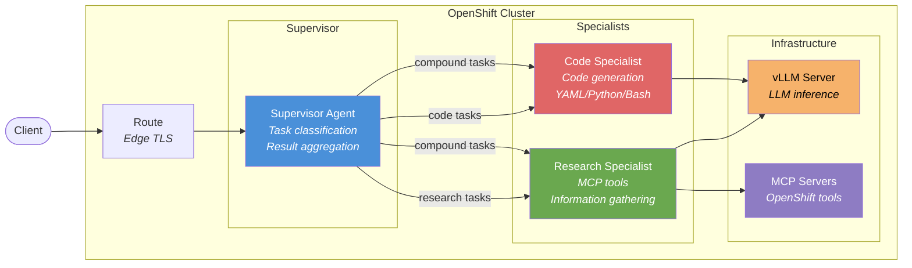
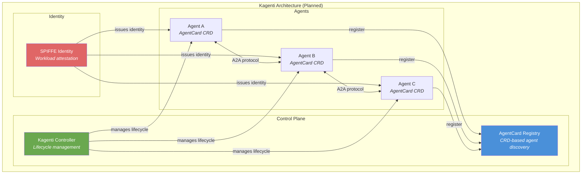
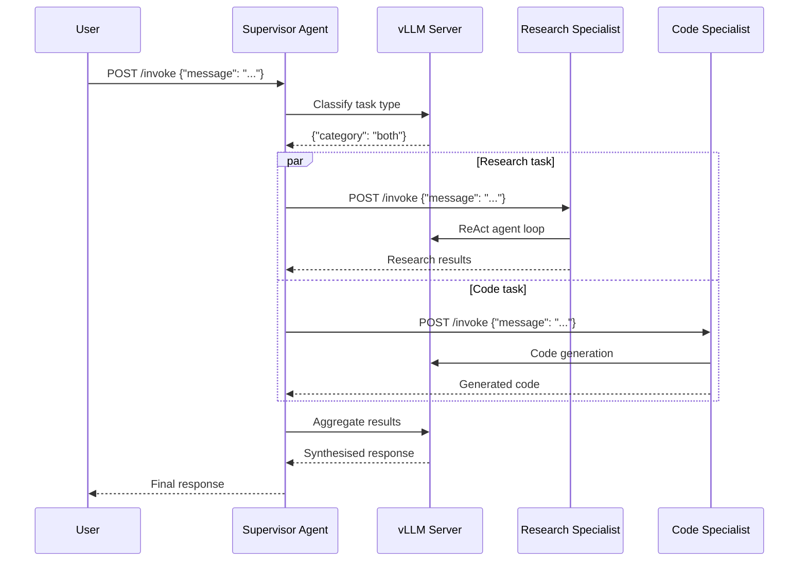

# L2-M3.5 -- Multi-Agent Systems on OpenShift AI

**Level:** Practitioner
**Duration:** 1.5 hours

## Overview

In the previous lessons you deployed a single LangGraph agent with MCP tools. Real-world AI applications often require multiple specialised agents working together -- one agent that researches information, another that generates code, a third that reviews the output. This lesson covers the **multi-agent** patterns used in production, deploys a Supervisor + two Specialist agents as separate OpenShift microservices, and previews the emerging Kagenti project for standardised agent-to-agent communication.

This is the capstone lesson of the Agent Deployment module. It brings together everything from L2-M3.1 through L2-M3.4 -- deployment patterns, LangGraph agents, OGX, and MCP tools -- into a coordinated multi-agent system.

## Prerequisites

- Completed: L2-M3.1 through L2-M3.4 (deployment patterns, LangGraph agents, OGX agents, MCP tools)
- vLLM model serving deployed and accessible (from L1-M2)
- MCP servers deployed (from L2-M2)
- Familiarity with LangGraph ReAct agents and FastAPI service structure
- OpenShift cluster running (Developer Sandbox or self-managed)

## K8s Context

On vanilla Kubernetes, deploying multiple cooperating services is standard microservices architecture -- Deployments, Services, and DNS-based service discovery. There is no built-in concept of "agent-to-agent" communication; you design the inter-service protocol yourself (REST, gRPC, message queues). Service mesh (Istio/Linkerd) adds mTLS, observability, and traffic management but requires separate installation.

OpenShift provides the same microservices primitives with its Route and Service Mesh operators pre-integrated. The emerging **Kagenti** project (planned H2 2026) aims to add a Kubernetes-native agent orchestration layer with standardised discovery, identity, and communication via the A2A protocol.

## Concepts

### Multi-Agent Patterns

There are three fundamental patterns for organising multiple AI agents. Each makes different tradeoffs between simplicity, flexibility, and coordination overhead.

#### 1. Supervisor Pattern

A central orchestrator receives all user requests, classifies the task, routes it to the appropriate specialist agent(s), and aggregates results before responding.

```
User -> Supervisor -> Specialist A (research)
                   -> Specialist B (code)
                   -> Specialist C (review)
```

**Pros:** Clear control flow, easy to debug, centralised error handling.
**Cons:** Single point of failure (the supervisor), potential bottleneck under high load.
**When to use:** Most production systems start here. Good default choice.

#### 2. Collaboration Pattern

Agents share state (e.g. a shared memory store or message queue) and contribute to a shared workspace. No single agent is "in charge" -- each watches for relevant work and contributes.

```
Agent A -> Shared State <- Agent B
              ^
              |
           Agent C
```

**Pros:** More resilient (no single coordinator), naturally parallel.
**Cons:** Harder to debug, requires careful state management, risk of conflicting updates.
**When to use:** When agents have overlapping capabilities and tasks are highly parallel.

#### 3. Handoff Pattern

Agents pass control to each other in a chain. Agent A processes the request, decides it needs Agent B, and transfers the conversation. Agent B may hand off to Agent C, and so on.

```
User -> Agent A -> Agent B -> Agent C -> User
```

**Pros:** Natural for multi-step workflows, each agent focuses on its step.
**Cons:** Long chains increase latency, error propagation can be complex.
**When to use:** Linear workflows like "triage -> research -> implement -> review".

---

### What We Build in This Lesson

We implement the **Supervisor pattern** with three agents deployed as separate OpenShift microservices:



| Agent | Role | Key Capabilities |
|-------|------|-----------------|
| **Supervisor** | Orchestrator | Task classification (research/code/both), routing, result aggregation |
| **Research Specialist** | Information gatherer | MCP tool integration, cluster queries, documentation search |
| **Code Specialist** | Code generator | YAML manifests, Python scripts, shell commands, Dockerfiles |

Each agent is a separate Deployment with its own Service. The supervisor calls specialists via HTTP (Kubernetes service DNS). Only the supervisor has an external Route -- specialists are internal-only.

---

### Inter-Agent Communication Approaches

When deploying agents as separate services, you need a communication mechanism. There are three main approaches:

| Approach | Transport | Coupling | Latency | Complexity |
|----------|-----------|----------|---------|-----------|
| **REST APIs** (this lesson) | HTTP/JSON | Loose | Low-medium | Low |
| **Message queue** | Redis/Kafka | Very loose | Higher | Medium |
| **LangGraph subgraphs** | In-process | Tight | Lowest | Low |

**REST APIs (what we implement):** The supervisor calls specialist `/invoke` endpoints via HTTP. This is the simplest approach and works well for request-response patterns. Kubernetes Service DNS (`specialist-research:8080`) provides discovery.

**Message queue (alternative):** For asynchronous workflows, you can use Redis Streams or Kafka. The supervisor publishes a task message, and specialists consume from the queue. This decouples agents further and handles backpressure, but adds infrastructure complexity.

**LangGraph subgraphs (in-process):** LangGraph supports composing multiple agents as subgraphs within a single graph. All agents run in the same process. This has the lowest latency but means you deploy everything as a single Deployment -- no independent scaling of specialists.

We use REST APIs because they map naturally to the Kubernetes microservices model and give us independent scaling, rolling updates, and fault isolation per agent.

---

### OGX Multi-Agent Support

The OGX (Open GenAI Exchange) platform introduced in L2-M3.3 can also orchestrate multi-agent systems. The OGX agents API supports defining agent groups and routing logic declaratively. If your organisation standardises on OGX, you can implement a similar supervisor pattern using OGX agent definitions rather than custom FastAPI services.

However, OGX multi-agent support is still maturing. The approach in this lesson -- deploying agents as independent FastAPI microservices with HTTP communication -- gives you maximum control and portability.

---

### Service Mesh for Inter-Agent Traffic

When running multiple agents that communicate over HTTP, OpenShift Service Mesh (Istio-based) provides significant benefits:

| Capability | Without Service Mesh | With Service Mesh |
|-----------|---------------------|-------------------|
| **Encryption** | Plaintext HTTP between pods | Automatic mTLS for all inter-agent traffic |
| **Observability** | Manual logging/metrics | Distributed tracing of agent-to-agent call chains |
| **Traffic management** | None | Retry policies, circuit breakers, canary routing |
| **Access control** | None (any pod can call any service) | AuthorizationPolicy restricts which agents can call which |

For a production multi-agent system, service mesh is strongly recommended. The mTLS encryption ensures agent-to-agent conversations are private, and the distributed tracing lets you follow a user request as it flows from the supervisor to specialists and back.

Setting up the full service mesh is beyond the scope of this lesson, but we discuss the architecture in Step 9.

---

### Kagenti Preview -- Kubernetes-Native Agent Orchestration

**Kagenti** is a CNCF project (planned for H2 2026) that aims to bring standardised agent-to-agent communication to Kubernetes. It builds on the **A2A (Agent-to-Agent) protocol** developed by the Agentic AI Foundation.



Key Kagenti concepts:

- **AgentCard CRD** -- A Kubernetes Custom Resource that describes an agent's capabilities, endpoints, and supported protocols. Agents register themselves, and other agents discover them via the Kubernetes API.
- **A2A Protocol** -- A standardised protocol for agent-to-agent communication. Agents negotiate capabilities, exchange messages, and transfer tasks using a common wire format.
- **SPIFFE Identity** -- Each agent gets a cryptographic identity (SPIFFE ID) via workload attestation. Agents authenticate to each other using mutual TLS with SPIFFE certificates -- no shared secrets or API keys.
- **Auto-Discovery** -- Agents find each other by querying AgentCard CRDs. No hardcoded URLs or service registries needed.

**What this means for the future:** Today, we hardcode specialist URLs in the supervisor's environment variables. With Kagenti, the supervisor would discover specialists dynamically via AgentCard CRDs, authenticate using SPIFFE, and communicate using the A2A protocol. The Kubernetes API becomes the agent registry.

Kagenti is not yet available. We include it here because it represents the direction Kubernetes-native agent orchestration is heading, and understanding the architecture helps you design systems that will be easy to migrate when it lands.

## Step-by-Step

### Step 1: Review the Multi-Agent Architecture

Before deploying, review the routing flow that the supervisor follows for each user request:



The flow has four phases:

1. **Classification** -- The supervisor sends the user message to the LLM with a classification prompt. The LLM returns one of `research`, `code`, or `both`.
2. **Routing** -- The supervisor calls the appropriate specialist(s). For `both`, it calls research and code in parallel using `asyncio.gather`.
3. **Aggregation** -- If multiple specialists responded, the supervisor sends their results to the LLM with an aggregation prompt to synthesise a coherent answer.
4. **Response** -- The supervisor returns the aggregated response to the user.

### Step 2: Examine the Supervisor Agent Code

The supervisor agent is in `scripts/supervisor_agent.py`. It is a FastAPI application with three key functions:

**Task classification** -- Uses the LLM to classify incoming messages:

```python
CLASSIFICATION_PROMPT = """\
You are a task classifier for a multi-agent system. Given a user message, \
classify the task into exactly one of these categories:

- "research" -- The user wants information, explanations, summaries, ...
- "code" -- The user wants code generation, YAML manifests, scripts, ...
- "both" -- The user wants a compound task requiring both research AND code.

Respond with ONLY a JSON object: {"category": "<research|code|both>"}
"""

async def classify_task(message: str) -> str:
    prompt = CLASSIFICATION_PROMPT.format(message=message)
    result = await llm.ainvoke(prompt)
    parsed = json.loads(result.content.strip())
    return parsed.get("category", "research")
```

**Specialist routing with retry logic** -- Calls specialists via HTTP with exponential backoff:

```python
async def call_specialist(
    specialist_name: str,
    specialist_url: str,
    message: str,
) -> SpecialistResult:
    for attempt in range(1, MAX_RETRIES + 1):
        try:
            resp = await http_client.post(
                f"{specialist_url}/invoke",
                json={"message": message},
            )
            resp.raise_for_status()
            data = resp.json()
            return SpecialistResult(specialist=specialist_name, response=data["response"], status="ok")
        except httpx.ConnectError:
            # Retry with backoff
            await asyncio.sleep(RETRY_DELAY_SECONDS * attempt)
    return SpecialistResult(specialist=specialist_name, response="unavailable", status="error")
```

**Parallel specialist invocation** -- For compound tasks, calls both specialists concurrently:

```python
if category == "both":
    research_task = call_specialist("research", SPECIALIST_RESEARCH_URL, request.message)
    code_task = call_specialist("code", SPECIALIST_CODE_URL, request.message)
    research_result, code_result = await asyncio.gather(research_task, code_task)
```

The full code is in `scripts/supervisor_agent.py`. It follows the same FastAPI + health probe pattern from [L2-M3.2](../2_langchain_langgraph/).

### Step 3: Examine the Specialist Agent Code

**Research Specialist** (`scripts/specialist_research.py`):

- Uses a LangGraph ReAct agent with MCP tools
- Connected to MCP servers (e.g. the OpenShift MCP Server from L2-M2) for cluster queries
- System prompt instructs it to gather information, cite sources, and structure responses clearly
- Returns tool usage metadata alongside the response

**Code Specialist** (`scripts/specialist_code.py`):

- Uses a LangGraph agent optimised for code generation
- No external tools -- relies on the LLM's built-in code knowledge
- System prompt instructs it to generate well-commented code with language identifiers
- Parses code blocks from the response and returns them as structured data

Both specialists follow the same FastAPI structure: `/invoke` for requests, `/healthz` and `/readyz` for probes. This consistency means the supervisor treats all specialists identically -- it only needs their URL and the `/invoke` contract.

### Step 4: Build and Push Container Images

Build container images for all three agents. Each needs a `Containerfile` (or use `oc new-build` with the Python source).

Create a `Containerfile` for the agents (same base for all three, only the entrypoint script differs):

```dockerfile
FROM registry.access.redhat.com/ubi9/python-311:latest

WORKDIR /opt/app-root/src

COPY requirements.txt .
RUN pip install --no-cache-dir -r requirements.txt

COPY *.py .

USER 1001
EXPOSE 8080

CMD ["uvicorn", "supervisor_agent:app", "--host", "0.0.0.0", "--port", "8080"]
```

Create a `requirements.txt` with the shared dependencies:

```
fastapi>=0.115.0
uvicorn>=0.30.0
httpx>=0.27.0
langchain-openai>=0.3.0
langchain-mcp-adapters>=0.1.0
langgraph>=0.4.0
pydantic>=2.0.0
```

Build and push all three images:

```bash
# Set your project name
PROJECT=$(oc project -q)

# Build the supervisor agent
oc new-build --name=supervisor-agent \
  --binary \
  --strategy=docker \
  --to="supervisor-agent:latest" \
  -l app=supervisor-agent

# Upload the source for supervisor
# (copy supervisor_agent.py and requirements.txt to a temp dir)
mkdir -p /tmp/supervisor-build
cp scripts/supervisor_agent.py /tmp/supervisor-build/
cp requirements.txt /tmp/supervisor-build/
cat > /tmp/supervisor-build/Containerfile <<'EOF'
FROM registry.access.redhat.com/ubi9/python-311:latest
WORKDIR /opt/app-root/src
COPY requirements.txt .
RUN pip install --no-cache-dir -r requirements.txt
COPY *.py .
USER 1001
EXPOSE 8080
CMD ["uvicorn", "supervisor_agent:app", "--host", "0.0.0.0", "--port", "8080"]
EOF

oc start-build supervisor-agent --from-dir=/tmp/supervisor-build --follow
```

Expected output:

```
Uploading directory "/tmp/supervisor-build" ...
build.build.openshift.io/supervisor-agent-1 started
...
Successfully pushed image-registry.openshift-image-registry.svc:5000/PROJECT/supervisor-agent:latest
```

Repeat for the research specialist:

```bash
mkdir -p /tmp/research-build
cp scripts/specialist_research.py /tmp/research-build/
cp requirements.txt /tmp/research-build/
cat > /tmp/research-build/Containerfile <<'EOF'
FROM registry.access.redhat.com/ubi9/python-311:latest
WORKDIR /opt/app-root/src
COPY requirements.txt .
RUN pip install --no-cache-dir -r requirements.txt
COPY *.py .
USER 1001
EXPOSE 8080
CMD ["uvicorn", "specialist_research:app", "--host", "0.0.0.0", "--port", "8080"]
EOF

oc new-build --name=specialist-research \
  --binary \
  --strategy=docker \
  --to="specialist-research:latest" \
  -l app=specialist-research

oc start-build specialist-research --from-dir=/tmp/research-build --follow
```

And the code specialist:

```bash
mkdir -p /tmp/code-build
cp scripts/specialist_code.py /tmp/code-build/
cp requirements.txt /tmp/code-build/
cat > /tmp/code-build/Containerfile <<'EOF'
FROM registry.access.redhat.com/ubi9/python-311:latest
WORKDIR /opt/app-root/src
COPY requirements.txt .
RUN pip install --no-cache-dir -r requirements.txt
COPY *.py .
USER 1001
EXPOSE 8080
CMD ["uvicorn", "specialist_code:app", "--host", "0.0.0.0", "--port", "8080"]
EOF

oc new-build --name=specialist-code \
  --binary \
  --strategy=docker \
  --to="specialist-code:latest" \
  -l app=specialist-code

oc start-build specialist-code --from-dir=/tmp/code-build --follow
```

Verify all three ImageStreams exist:

```bash
oc get imagestreams -l tutorial-module=M3
```

Expected output:

```
NAME                  IMAGE REPOSITORY                                                           TAGS     UPDATED
supervisor-agent      image-registry.openshift-image-registry.svc:5000/PROJECT/supervisor-agent   latest   ...
specialist-research   image-registry.openshift-image-registry.svc:5000/PROJECT/specialist-research latest  ...
specialist-code       image-registry.openshift-image-registry.svc:5000/PROJECT/specialist-code    latest   ...
```

### Step 5: Deploy All Three Agents

Update the manifests with your project name, then deploy specialists first (the supervisor depends on them):

```bash
PROJECT=$(oc project -q)

# Update image references in manifests
sed -i "s/PROJECT/$PROJECT/g" manifests/specialist-a-deployment.yaml
sed -i "s/PROJECT/$PROJECT/g" manifests/specialist-b-deployment.yaml
sed -i "s/PROJECT/$PROJECT/g" manifests/supervisor-deployment.yaml
```

Deploy the specialists:

```bash
# Deploy research specialist
oc apply -f manifests/specialist-a-deployment.yaml
oc apply -f manifests/specialist-a-service.yaml

# Deploy code specialist
oc apply -f manifests/specialist-b-deployment.yaml
oc apply -f manifests/specialist-b-service.yaml
```

Wait for specialists to be ready:

```bash
oc rollout status deployment/specialist-research --timeout=120s
oc rollout status deployment/specialist-code --timeout=120s
```

Expected output:

```
deployment "specialist-research" successfully rolled out
deployment "specialist-code" successfully rolled out
```

Now deploy the supervisor:

```bash
# Deploy supervisor
oc apply -f manifests/supervisor-deployment.yaml
oc apply -f manifests/supervisor-service.yaml
oc apply -f manifests/supervisor-route.yaml

oc rollout status deployment/supervisor-agent --timeout=120s
```

Verify all pods are running:

```bash
oc get pods -l tutorial-module=M3,role
```

Expected output:

```
NAME                                   READY   STATUS    RESTARTS   AGE
supervisor-agent-7d8f9c6b4-x2k1p      1/1     Running   0          45s
specialist-research-5b4c8d7a3-m9n2q    1/1     Running   0          90s
specialist-code-6c5d9e8f2-p3r4s        1/1     Running   0          90s
```

### Step 6: Test Individual Specialists Directly

Before testing the full multi-agent flow, verify each specialist works independently by port-forwarding to its Service.

**Test the research specialist:**

```bash
# Port-forward to the research specialist
oc port-forward svc/specialist-research 8081:8080 &
PF_RES_PID=$!

# Check readiness
curl -s http://localhost:8081/readyz | python3 -m json.tool
```

Expected output:

```json
{
    "status": "ready",
    "specialist": "research"
}
```

```bash
# Send a research task
curl -s -X POST http://localhost:8081/invoke \
  -H "Content-Type: application/json" \
  -d '{"message": "What pods are running in the current namespace?"}' | python3 -m json.tool
```

Expected output (content varies based on your cluster state):

```json
{
    "response": "Here are the pods currently running in the namespace...",
    "tools_used": ["list_pods"]
}
```

```bash
# Stop port-forward
kill $PF_RES_PID
```

**Test the code specialist:**

```bash
# Port-forward to the code specialist
oc port-forward svc/specialist-code 8082:8080 &
PF_CODE_PID=$!

# Send a code generation task
curl -s -X POST http://localhost:8082/invoke \
  -H "Content-Type: application/json" \
  -d '{"message": "Write a Deployment manifest for an nginx pod with 3 replicas"}' | python3 -m json.tool
```

Expected output:

```json
{
    "response": "Here is a Deployment manifest for nginx with 3 replicas:\n\n```yaml\napiVersion: apps/v1\nkind: Deployment\n...",
    "code_blocks": [
        {
            "language": "yaml",
            "code": "apiVersion: apps/v1\nkind: Deployment\n...",
            "filename": ""
        }
    ]
}
```

```bash
# Stop port-forward
kill $PF_CODE_PID
```

### Step 7: Test the Supervisor Routing

Now test the full multi-agent flow through the supervisor's external Route.

```bash
# Get the supervisor Route URL
SUPERVISOR_URL=$(oc get route supervisor-agent -o jsonpath='{.spec.host}')
echo "Supervisor URL: https://$SUPERVISOR_URL"
```

**Test a research-only task:**

```bash
curl -s -X POST "https://$SUPERVISOR_URL/invoke" \
  -H "Content-Type: application/json" \
  -d '{"message": "What is the status of the deployments in this project?"}' | python3 -m json.tool
```

Expected output:

```json
{
    "response": "Here is the status of deployments in the current project...",
    "category": "research",
    "specialist_results": [
        {
            "specialist": "research",
            "response": "...",
            "status": "ok"
        }
    ]
}
```

Note that `category` is `"research"` -- the supervisor classified this as a research task and routed it only to the research specialist.

**Test a code-only task:**

```bash
curl -s -X POST "https://$SUPERVISOR_URL/invoke" \
  -H "Content-Type: application/json" \
  -d '{"message": "Generate a Python FastAPI health check endpoint"}' | python3 -m json.tool
```

Expected output:

```json
{
    "response": "Here is a FastAPI health check endpoint...",
    "category": "code",
    "specialist_results": [
        {
            "specialist": "code",
            "response": "...",
            "status": "ok"
        }
    ]
}
```

**Test a compound task (both specialists):**

```bash
curl -s -X POST "https://$SUPERVISOR_URL/invoke" \
  -H "Content-Type: application/json" \
  -d '{"message": "Explain how OpenShift Routes work and write a Route manifest with edge TLS for my nginx service"}' | python3 -m json.tool
```

Expected output:

```json
{
    "response": "## OpenShift Routes\n\nOpenShift Routes provide external access to services...\n\n## Route Manifest\n\n```yaml\napiVersion: route.openshift.io/v1\n...",
    "category": "both",
    "specialist_results": [
        {
            "specialist": "research",
            "response": "OpenShift Routes are...",
            "status": "ok"
        },
        {
            "specialist": "code",
            "response": "```yaml\napiVersion: route.openshift.io/v1\n...",
            "status": "ok"
        }
    ]
}
```

When the category is `"both"`, the supervisor called both specialists in parallel and aggregated their results using the LLM.

### Step 8: Observe Inter-Agent Communication

Check the supervisor logs to see the classification and routing decisions:

```bash
oc logs deployment/supervisor-agent --tail=50
```

Expected output:

```
INFO:__main__:LLM configured: endpoint=http://vllm-server:8000/v1  model=granite-3.3-8b-instruct
INFO:__main__:Specialist endpoints: research=http://specialist-research:8080  code=http://specialist-code:8080
INFO:__main__:Task classified as: both
INFO:__main__:Task classified as: research
INFO:__main__:Task classified as: code
```

Check the specialist logs to see their individual processing:

```bash
# Research specialist logs
oc logs deployment/specialist-research --tail=30

# Code specialist logs
oc logs deployment/specialist-code --tail=30
```

You can also check the readiness endpoint on the supervisor, which reports the health of both specialists:

```bash
curl -s "https://$SUPERVISOR_URL/readyz" | python3 -m json.tool
```

Expected output:

```json
{
    "status": "ready",
    "specialists": {
        "research": true,
        "code": true
    }
}
```

If a specialist is down, the supervisor's retry logic will attempt to reach it (up to 3 times with exponential backoff), and if it remains unavailable, the response will include an error status for that specialist while still returning results from any healthy specialists.

### Step 9: (Optional) Service Mesh Benefits for Multi-Agent Systems

In a production multi-agent deployment, OpenShift Service Mesh (Istio-based) adds three critical capabilities:

**1. Mutual TLS (mTLS) for agent-to-agent traffic:**

Without service mesh, the supervisor calls specialists over plaintext HTTP inside the cluster. With service mesh, all traffic is automatically encrypted:

```yaml
# PeerAuthentication -- enforce mTLS for all agent traffic
apiVersion: security.istio.io/v1
kind: PeerAuthentication
metadata:
  name: agent-mtls
spec:
  mtls:
    mode: STRICT
```

**2. AuthorizationPolicy -- restrict which agents can talk to which:**

```yaml
# Only the supervisor can call specialist services
apiVersion: security.istio.io/v1
kind: AuthorizationPolicy
metadata:
  name: specialist-access
spec:
  selector:
    matchLabels:
      role: specialist
  rules:
    - from:
        - source:
            principals: ["cluster.local/ns/PROJECT/sa/supervisor-agent"]
```

**3. Distributed tracing -- follow a request across agents:**

With Istio sidecar injection, every HTTP call between agents is traced. You can see the full request flow in Jaeger or Kiali:

```
[User] -> [supervisor-agent] -> [specialist-research] -> [vllm-server]
                              -> [specialist-code]     -> [vllm-server]
```

This is invaluable for debugging latency issues, identifying which specialist is slow, and understanding the overall request path.

To enable service mesh for your agents, you would:
1. Install the OpenShift Service Mesh operator (if not already installed)
2. Create a `ServiceMeshMemberRoll` including your project
3. Add the `sidecar.istio.io/inject: "true"` annotation to your Deployment templates
4. Configure `PeerAuthentication` and `AuthorizationPolicy` as shown above

Full service mesh setup is covered in the main OpenShift tutorial (L1-M5).

### Step 10: (Optional) Preview Kagenti A2A Architecture

Kagenti (planned H2 2026) will bring standardised agent-to-agent orchestration to Kubernetes. Here is what the same multi-agent system would look like with Kagenti:

**Today (this lesson) -- hardcoded URLs:**

```yaml
# Supervisor needs to know specialist URLs at deploy time
env:
  - name: SPECIALIST_RESEARCH_URL
    value: "http://specialist-research:8080"
  - name: SPECIALIST_CODE_URL
    value: "http://specialist-code:8080"
```

**With Kagenti -- dynamic discovery via AgentCard CRDs:**

```yaml
# Each specialist registers itself as an AgentCard
apiVersion: kagenti.dev/v1alpha1
kind: AgentCard
metadata:
  name: specialist-research
spec:
  description: "Research specialist -- information gathering and cluster queries"
  capabilities:
    - research
    - cluster-queries
    - documentation-search
  endpoint:
    url: http://specialist-research:8080
    protocol: a2a
  identity:
    spiffeId: spiffe://cluster.local/ns/PROJECT/sa/specialist-research
```

```yaml
apiVersion: kagenti.dev/v1alpha1
kind: AgentCard
metadata:
  name: specialist-code
spec:
  description: "Code specialist -- generates YAML, Python, Bash, Dockerfiles"
  capabilities:
    - code-generation
    - yaml-manifests
    - python-scripts
  endpoint:
    url: http://specialist-code:8080
    protocol: a2a
  identity:
    spiffeId: spiffe://cluster.local/ns/PROJECT/sa/specialist-code
```

The supervisor would then discover specialists dynamically:

```python
# Conceptual -- Kagenti client (not yet available)
from kagenti import AgentDiscovery

discovery = AgentDiscovery()

# Find all agents with "research" capability
research_agents = await discovery.find(capabilities=["research"])

# Find all agents with "code-generation" capability
code_agents = await discovery.find(capabilities=["code-generation"])

# Call via A2A protocol with SPIFFE identity
result = await research_agents[0].invoke(message="...", protocol="a2a")
```

**Key differences from today's approach:**

| Aspect | Today (REST + hardcoded) | Kagenti (A2A + CRDs) |
|--------|--------------------------|----------------------|
| Discovery | Environment variables with URLs | AgentCard CRD queries |
| Identity | None (any pod can call) | SPIFFE workload identity |
| Protocol | HTTP/JSON (custom schema) | A2A (standardised) |
| Capabilities | Implicit (you know which agent does what) | Declared in AgentCard spec |
| Lifecycle | Manual Deployment management | Kagenti controller manages lifecycle |

This is conceptual -- Kagenti is not yet released. But designing your agents with clean interfaces (like the `/invoke` contract used in this lesson) will make migration straightforward when it arrives.

## Verification

Verify your multi-agent system is working correctly:

1. **All three pods running:**

```bash
oc get pods -l tutorial-module=M3 -l role
```

All three pods should show `1/1 Running`.

2. **Supervisor can reach both specialists:**

```bash
curl -s "https://$SUPERVISOR_URL/readyz" | python3 -m json.tool
```

Both specialists should show `true`.

3. **Research routing works:**

```bash
curl -s -X POST "https://$SUPERVISOR_URL/invoke" \
  -H "Content-Type: application/json" \
  -d '{"message": "List all services in the current project"}' | python3 -m json.tool | grep '"category"'
```

Should show `"category": "research"`.

4. **Code routing works:**

```bash
curl -s -X POST "https://$SUPERVISOR_URL/invoke" \
  -H "Content-Type: application/json" \
  -d '{"message": "Write a ConfigMap manifest with database connection settings"}' | python3 -m json.tool | grep '"category"'
```

Should show `"category": "code"`.

5. **Compound routing works:**

```bash
curl -s -X POST "https://$SUPERVISOR_URL/invoke" \
  -H "Content-Type: application/json" \
  -d '{"message": "Check what image my deployment uses and write an updated manifest with resource limits"}' | python3 -m json.tool | grep '"category"'
```

Should show `"category": "both"`.

## K8s vs OpenShift Comparison

| Aspect | Kubernetes | OpenShift |
|--------|-----------|-----------|
| Multi-agent deployment | Standard Deployments + Services | Same, plus integrated image builds and Routes |
| Inter-agent encryption | Install Istio/Linkerd manually | OpenShift Service Mesh operator (pre-packaged Istio) |
| External access | Ingress + ingress controller | Route with built-in edge TLS |
| Agent discovery | DNS-based service discovery | Same, plus Kagenti AgentCard CRDs (future) |
| Agent identity | Manual certificate management | SPIFFE via service mesh or Kagenti (future) |
| Traffic observability | Install Jaeger/Kiali manually | Integrated with Service Mesh operator |
| Container builds | External CI (GitHub Actions, etc.) | Built-in `oc new-build` for binary and S2I builds |

## Key Takeaways

- The **Supervisor pattern** is the most common multi-agent architecture -- a central orchestrator classifies tasks, routes to specialists, and aggregates results
- Deploy agents as **separate OpenShift microservices** for independent scaling, rolling updates, and fault isolation
- **REST APIs over Kubernetes Service DNS** provide simple, reliable inter-agent communication -- no external message brokers required for request-response patterns
- The supervisor's **retry logic** with exponential backoff handles transient specialist failures gracefully
- **OpenShift Service Mesh** adds mTLS encryption, access control, and distributed tracing for production multi-agent deployments
- **Kagenti** (planned H2 2026) will bring Kubernetes-native agent orchestration with A2A protocol, AgentCard CRDs, and SPIFFE identity -- design clean agent interfaces now to ease future migration
- This completes the Agent Deployment module -- you can now deploy single agents, OGX agents, MCP-connected agents, and multi-agent systems on OpenShift AI

## Cleanup

```bash
# Remove all multi-agent resources
oc delete route supervisor-agent
oc delete service supervisor-agent specialist-research specialist-code
oc delete deployment supervisor-agent specialist-research specialist-code

# Remove build configs and image streams
oc delete buildconfig supervisor-agent specialist-research specialist-code
oc delete imagestream supervisor-agent specialist-research specialist-code

# Or delete everything with the module label
oc delete all -l tutorial-level=2,tutorial-module=M3

# Clean up build directories
rm -rf /tmp/supervisor-build /tmp/research-build /tmp/code-build
```

## Next Steps

This completes Module M3 -- Agent Deployment. You have progressed from deploying a single LangGraph agent to orchestrating a multi-agent system with supervisor routing and specialist agents.

Continue to [L2-M4.1 -- Pipeline Setup](../../M4_pipelines/1_pipeline_setup/) to learn how to build automated Data Science Pipelines on OpenShift AI using Kubeflow Pipelines (KFP), bringing CI/CD practices to your ML and agent workflows.
