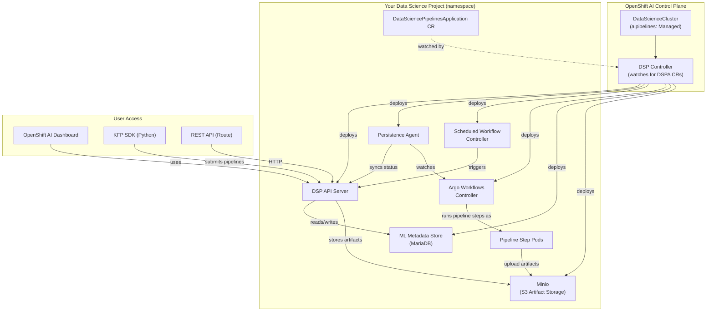

# L2-M4.1 -- Pipeline Setup

**Level:** Practitioner
**Duration:** 30 min

## Overview

Data Science Pipelines (DSP) is OpenShift AI's managed deployment of Kubeflow Pipelines v2, the standard open-source platform for building and running ML workflows as directed acyclic graphs (DAGs). If you have used Kubeflow Pipelines on vanilla Kubernetes -- installing Argo Workflows, setting up a MySQL metadata store, configuring S3 for artifact storage -- you already know the moving parts. OpenShift AI packages all of this behind a single Custom Resource called `DataSciencePipelinesApplication` (DSPA), so you go from zero to a working pipeline server in one `oc apply`.

In this lesson you will deploy a pipeline server with its S3 artifact backend, verify it is healthy, and confirm it is accessible from both the OpenShift AI dashboard and the REST API.

## Prerequisites

- Completed L1-M1 (OpenShift AI installed, `aipipelines` component set to `Managed` in the DataScienceCluster)
- A data science project (OpenShift namespace) to deploy the pipeline server into
- `oc` CLI authenticated to the cluster
- Python 3.9+ with `pip` available (to install the KFP SDK for later lessons)

## K8s Context

On vanilla Kubernetes, setting up Kubeflow Pipelines requires deploying several components independently:

1. **Argo Workflows** -- the execution engine that runs pipeline steps as Kubernetes pods
2. **KFP API Server** -- the REST API that accepts pipeline definitions and triggers runs
3. **ML Metadata Store** -- a MySQL/MariaDB database that tracks pipeline artifacts, executions, and lineage
4. **Persistence Agent** -- a controller that reconciles Argo workflow status back into the KFP API server
5. **Scheduled Workflow Controller** -- handles recurring pipeline runs (cron-like scheduling)
6. **Object Storage** -- S3-compatible storage (usually Minio) for pipeline artifacts and compiled pipeline definitions

You would typically install all of this via a Kubeflow Pipelines Helm chart or kustomize manifests, then manually configure storage credentials, database connections, and network access. Upgrades require coordinating versions across all components.

OpenShift AI replaces that entire process with one CR.

## Concepts

### Data Science Pipelines Architecture

When you create a `DataSciencePipelinesApplication` CR in a namespace, the DSP Controller (deployed by the `aipipelines` component in the DataScienceCluster) watches for it and deploys the full pipeline stack into that namespace.



Here is what each component does:

| Component | Pod Name Pattern | Role |
|-----------|-----------------|------|
| DSP API Server | `ds-pipeline-*` | REST API for pipeline CRUD, run management, and artifact retrieval |
| Persistence Agent | `ds-pipeline-persistenceagent-*` | Watches Argo workflows and syncs their status back to the API server |
| Scheduled Workflow Controller | `ds-pipeline-scheduledworkflow-*` | Creates Argo workflows on a schedule for recurring pipeline runs |
| Argo Workflows Controller | `ds-pipeline-workflow-controller-*` | Executes pipeline DAGs as Kubernetes pods (one pod per step) |
| ML Metadata Store | `mariadb-*` | MariaDB database storing pipeline run metadata, artifact lineage, and execution history |
| Minio (bundled) | `minio-*` | S3-compatible object store for pipeline artifacts (compiled pipelines, step outputs, logs) |

All of these pods run inside your data science project namespace -- not in a shared control plane namespace. Each project that needs pipelines gets its own isolated pipeline server.

### KFP v2 SDK Overview

The Kubeflow Pipelines v2 SDK (`kfp`) is the Python library you use to define and compile pipelines. You will use it extensively in L2-M4.2 -- here is a brief preview of the three core concepts:

**Components** -- individual pipeline steps, defined as Python functions with the `@dsl.component` decorator:

```python
from kfp import dsl

@dsl.component(base_image="python:3.11")
def preprocess_data(input_path: str) -> str:
    # This function runs as its own pod
    ...
    return output_path
```

**Pipelines** -- DAGs that connect components together, defined with `@dsl.pipeline`:

```python
@dsl.pipeline(name="my-training-pipeline")
def training_pipeline(dataset_url: str):
    preprocess_task = preprocess_data(input_path=dataset_url)
    train_task = train_model(data_path=preprocess_task.output)
```

**Compiler** -- converts the Python pipeline definition into an Argo Workflow YAML that the pipeline server can execute:

```python
from kfp import compiler

compiler.Compiler().compile(
    pipeline_func=training_pipeline,
    package_path="pipeline.yaml"
)
```

The compiled YAML is what gets submitted to the DSP API Server. You can submit it via the dashboard UI, the KFP SDK client, or a direct REST API call.

### DSPA vs Standalone Kubeflow Pipelines

If you have deployed Kubeflow Pipelines on vanilla Kubernetes, here is how the DSPA approach compares:

| Aspect | Standalone KFP on K8s | DSPA on OpenShift AI |
|--------|----------------------|---------------------|
| Installation | Helm chart or kustomize (20+ manifests) | One CR (`DataSciencePipelinesApplication`) |
| Execution engine | Argo Workflows (you install separately) | Argo Workflows (auto-deployed by DSPA) |
| Metadata store | MySQL (you deploy and manage) | MariaDB (auto-deployed, or bring your own) |
| Artifact storage | Minio or S3 (you configure) | Bundled Minio or external S3 (configured in CR) |
| Multi-tenancy | Single shared instance (namespace isolation is manual) | One DSPA per namespace (built-in isolation) |
| Dashboard | KFP standalone UI | Integrated into OpenShift AI dashboard |
| Authentication | None by default, manual OAuth proxy setup | OpenShift OAuth built-in |
| Upgrades | Manual Helm upgrades across components | Operator handles upgrades |
| Pipeline format | KFP v2 IR YAML | Same KFP v2 IR YAML (100% compatible) |
| SDK | `kfp` Python package | Same `kfp` Python package |

The key takeaway: pipelines you build with the standard KFP v2 SDK are fully compatible with both standalone KFP and OpenShift AI DSP. The difference is purely operational -- how the server is deployed and managed.

## Step-by-Step

### Step 1: Verify the aipipelines Component Is Enabled

Before creating a DSPA, confirm the `aipipelines` component is set to `Managed` in your DataScienceCluster. If you followed L1-M1, this should already be the case.

```bash
oc get datasciencecluster default-dsc -o jsonpath='{.spec.components.aipipelines.managementState}'
```

Expected output:

```
Managed
```

Also verify the DSP controller is running in the operator namespace:

```bash
oc get pods -n redhat-ods-applications -l app.kubernetes.io/part-of=data-science-pipelines-operator
```

You should see one or more `data-science-pipelines-operator-controller-manager-*` pods in `Running` state.

### Step 2: Create a Data Science Project

Create a namespace for your pipeline server. In OpenShift AI, data science projects are standard OpenShift projects with a label that makes them visible in the dashboard.

**Option A: Via the CLI**

```bash
oc new-project ml-pipelines-tutorial
```

Add the data science project label so it appears in the OpenShift AI dashboard:

```bash
oc label namespace ml-pipelines-tutorial opendatahub.io/dashboard=true
```

**Option B: Via the Dashboard**

1. Open the OpenShift AI dashboard
2. Navigate to **Data Science Projects** in the left sidebar
3. Click **Create data science project**
4. Name it `ml-pipelines-tutorial` and click **Create**

The dashboard method automatically adds the required labels.

### Step 3: Create the DSPA Instance

Now deploy the pipeline server. You can do this through the dashboard UI or by applying the YAML manifest directly.

**Option A: Via the Dashboard**

1. Open the OpenShift AI dashboard
2. Navigate to **Data Science Projects** > **ml-pipelines-tutorial**
3. Scroll to the **Pipelines** section
4. Click **Configure pipeline server**
5. Under Object storage connection, select **Create new storage** -- the dashboard will deploy a bundled Minio instance
6. Click **Configure**

The dashboard creates a `DataSciencePipelinesApplication` CR for you behind the scenes.

**Option B: Via the CLI (recommended for reproducibility)**

Review the manifest first:

```yaml
# manifests/dspa.yaml
apiVersion: datasciencepipelines.opendatahub.io/v1alpha1
kind: DataSciencePipelinesApplication
metadata:
  name: dspa
  namespace: ml-pipelines-tutorial
  labels:
    app: ml-pipelines-tutorial
    tutorial-level: "2"
    tutorial-module: "M4"
spec:
  apiServer:
    deploy: true
    enableSamplePipeline: false
  persistenceAgent:
    deploy: true
  scheduledWorkflow:
    deploy: true
  mlmd:
    deploy: true
  objectStorage:
    disableHealthCheck: false
    enableExternalRoute: false
    minio:
      deploy: true
      image: "quay.io/opendatahub/minio:RELEASE.2019-08-14T20-37-41Z-license-compliance"
      bucket: mlpipeline
      s3CredentialsSecret:
        accessKey: AWS_ACCESS_KEY_ID
        secretKey: AWS_SECRET_ACCESS_KEY
        secretName: dspa-object-storage
```

This manifest deploys the bundled Minio for artifact storage. The DSP controller will auto-create the `dspa-object-storage` Secret with default credentials when Minio is set to `deploy: true`.

Apply it:

```bash
oc apply -f manifests/dspa.yaml
```

### Step 4: Verify Pipeline Server Deployment

Watch the pods come up in your namespace:

```bash
oc get pods -n ml-pipelines-tutorial -w
```

After 1-2 minutes, you should see all pipeline components running:

```
NAME                                                  READY   STATUS    RESTARTS   AGE
ds-pipeline-dspa-xxxxxxxxxx-xxxxx                     1/1     Running   0          90s
ds-pipeline-persistenceagent-dspa-xxxxxxxxxx-xxxxx    1/1     Running   0          90s
ds-pipeline-scheduledworkflow-dspa-xxxxxxxxxx-xxxxx   1/1     Running   0          90s
ds-pipeline-workflow-controller-dspa-xxxxxxxxxx-xxxxx 1/1     Running   0          90s
mariadb-dspa-xxxxxxxxxx-xxxxx                         1/1     Running   0          90s
minio-dspa-xxxxxxxxxx-xxxxx                           1/1     Running   0          90s
```

Check the DSPA status conditions:

```bash
oc get dspa dspa -n ml-pipelines-tutorial -o jsonpath='{range .status.conditions[*]}{.type}{"\t"}{.status}{"\t"}{.reason}{"\n"}{end}'
```

Expected output -- all conditions should show `True`:

```
APIServerReady          True    MinimumReplicasAvailable
PersistenceAgentReady   True    MinimumReplicasAvailable
ScheduledWorkflowReady  True    MinimumReplicasAvailable
CrReady                 True    MinimumReplicasAvailable
```

You can also get the full DSPA resource to inspect its status:

```bash
oc get dspa dspa -n ml-pipelines-tutorial -o yaml
```

### Step 5: Access the Pipeline Server

There are three ways to interact with the pipeline server.

**Via the OpenShift AI Dashboard**

1. Open the OpenShift AI dashboard
2. Navigate to **Data Science Projects** > **ml-pipelines-tutorial**
3. The **Pipelines** section should now show the pipeline server as active
4. Click on **Pipelines** in the left sidebar -- you will see the pipeline management interface where you can import, view, and trigger pipeline runs

**Via the REST API (internal)**

The DSP API Server creates a Service inside the namespace. You can port-forward to it for local testing:

```bash
oc port-forward -n ml-pipelines-tutorial svc/ds-pipeline-dspa 8888:8888
```

Then in another terminal:

```bash
curl http://localhost:8888/apis/v2beta1/healthz
```

Expected response:

```json
{"status":"HEALTHY"}
```

List existing pipelines (will be empty for now):

```bash
curl http://localhost:8888/apis/v2beta1/pipelines | python3 -m json.tool
```

**Via the KFP SDK (Python)**

Once you install the SDK (Step 6), you can connect programmatically. This is a preview -- you will use this extensively in L2-M4.2:

```python
from kfp.client import Client

# When running inside a workbench in the same namespace:
client = Client(host="https://ds-pipeline-dspa.ml-pipelines-tutorial.svc:8443",
                existing_token="<your-openshift-token>",
                ssl_ca_cert="/var/run/secrets/kubernetes.io/serviceaccount/ca.crt")

# Verify connection
print(client.list_pipelines())
```

> **Note:** When connecting from outside the cluster (your local machine), you need a Route or port-forward. Inside a workbench pod running in the same namespace, you can use the internal Service URL directly.

### Step 6: Install the KFP SDK Locally

Install the Kubeflow Pipelines SDK so you are ready for the next lesson:

```bash
pip install kfp
```

Verify the installation:

```bash
python3 -c "import kfp; print(f'KFP SDK version: {kfp.__version__}')"
```

Expected output (version may differ):

```
KFP SDK version: 2.12.1
```

Also verify the `kfp` CLI tool is available:

```bash
kfp --version
```

The SDK includes the `kfp` command-line tool for compiling and managing pipelines.

## Verification

Run through this checklist to confirm everything is working:

| Check | Command | Expected Result |
|-------|---------|-----------------|
| DSPA exists | `oc get dspa -n ml-pipelines-tutorial` | One DSPA named `dspa` |
| All pods running | `oc get pods -n ml-pipelines-tutorial` | 6 pods, all `Running` |
| DSPA conditions healthy | `oc get dspa dspa -n ml-pipelines-tutorial -o jsonpath='{.status.conditions[?(@.type=="CrReady")].status}'` | `True` |
| API server responds | `curl http://localhost:8888/apis/v2beta1/healthz` (with port-forward) | `{"status":"HEALTHY"}` |
| Dashboard shows pipeline server | Open dashboard > Data Science Projects > ml-pipelines-tutorial | Pipeline server listed as active |
| KFP SDK installed | `python3 -c "import kfp; print(kfp.__version__)"` | Version number printed |

## K8s vs OpenShift AI Comparison

| Aspect | Kubeflow Pipelines on K8s | Data Science Pipelines on OpenShift AI |
|--------|--------------------------|---------------------------------------|
| Deployment | Helm chart or kustomize (20+ resources) | One `DataSciencePipelinesApplication` CR |
| Argo Workflows | Separate install and version management | Auto-deployed by DSPA |
| Metadata store | Deploy MySQL yourself | MariaDB auto-deployed (or bring your own) |
| Artifact storage | Configure Minio/S3 manually | Bundled Minio or external S3 in the CR |
| Multi-tenancy | Shared instance, manual namespace isolation | One pipeline server per namespace |
| Authentication | None by default | OpenShift OAuth integrated |
| Upgrades | Manual, per-component | Operator-managed, single version track |
| Dashboard | Standalone KFP UI (separate deployment) | Built into OpenShift AI dashboard |
| Pipeline format | KFP v2 IR YAML | Same format -- fully compatible |
| SDK | `kfp` Python package | Same `kfp` Python package |
| Monitoring | Manual Prometheus integration | Built-in metrics via OpenShift monitoring |

## Key Takeaways

- Data Science Pipelines on OpenShift AI is a managed deployment of Kubeflow Pipelines v2 -- same SDK, same pipeline format, simpler operations
- The `DataSciencePipelinesApplication` (DSPA) CR deploys six components into your namespace: API Server, Persistence Agent, Scheduled Workflow Controller, Argo Workflows Controller, MariaDB metadata store, and S3 storage
- Each namespace gets its own isolated pipeline server -- there is no shared multi-tenant pipeline instance
- The bundled Minio is convenient for development; for production, configure an external S3 endpoint in the DSPA spec
- Pipelines compiled with the standard KFP v2 SDK work identically on standalone KFP and OpenShift AI DSP -- no vendor lock-in at the pipeline definition level

## Cleanup

To remove the pipeline server and all associated resources:

```bash
# Delete the DSPA (this removes all pipeline server pods, MariaDB, and Minio)
oc delete dspa dspa -n ml-pipelines-tutorial

# Delete the project entirely (optional -- you may want to keep it for L2-M4.2)
# oc delete project ml-pipelines-tutorial
```

> **Note:** Keep the project and DSPA running if you plan to continue directly to L2-M4.2.

## Next Steps

In the next lesson, [L2-M4.2 -- Building Pipelines with the KFP SDK](../2_kfp_sdk/), you will use the KFP v2 SDK to define pipeline components, wire them into a DAG, compile the pipeline, and submit it to the pipeline server you just deployed. You will also learn how to pass parameters, handle artifacts, and monitor pipeline runs from both the dashboard and the CLI.
