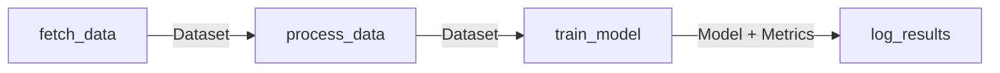

# L2-M4.2 -- Building Pipelines with the KFP SDK

**Level:** Practitioner
**Duration:** 1 hour

## Overview

The Kubeflow Pipelines v2 SDK (`kfp`) is the Python library you use to define ML workflows as code. Each pipeline is a directed acyclic graph (DAG) of components -- self-contained steps that run as individual Kubernetes pods. You compile the Python pipeline definition into an Argo Workflow YAML, then submit it to the pipeline server you deployed in L2-M4.1.

In this lesson you will build a multi-step pipeline from scratch, learn to pass data and artifacts between components, compile and submit it via both the dashboard UI and the Python client, view the results, and set up a recurring schedule.

## Prerequisites

- Completed L2-M4.1 (pipeline server running with S3 backend in the `ml-pipelines-tutorial` namespace)
- Python 3.9+ with `kfp>=2.0` installed (`pip install kfp`)
- `oc` CLI authenticated to the cluster

## Concepts

### KFP v2 Component Model

A **component** is the smallest unit of execution in a pipeline. It maps to a single container (pod) on the cluster. The KFP v2 SDK provides the `@dsl.component` decorator to turn a regular Python function into a pipeline component:

```python
from kfp import dsl

@dsl.component(
    base_image="python:3.11",
    packages_to_install=["pandas==2.2.0"]
)
def preprocess_data(raw_csv: str, sample_size: int) -> str:
    import pandas as pd
    df = pd.read_csv(raw_csv)
    df_sampled = df.sample(n=sample_size)
    output_path = "/tmp/processed.csv"
    df_sampled.to_csv(output_path, index=False)
    return output_path
```

What happens under the hood when the pipeline runs:

1. KFP serializes the function body into a container image based on `base_image`
2. `packages_to_install` are `pip install`-ed at container startup
3. Function arguments are passed as command-line parameters
4. Return values are written to a file and passed to downstream components

Key decorator parameters:

| Parameter | Purpose | Example |
|-----------|---------|---------|
| `base_image` | Container image the function runs in | `"python:3.11"`, `"quay.io/modh/runtime-images:runtime-cuda-tensorflow-ubi9-python-3.11"` |
| `packages_to_install` | Pip packages installed at runtime | `["pandas==2.2.0", "scikit-learn"]` |
| `target_image` | Pre-built container (for containerized components) | `"my-registry/my-component:v1"` |

### Artifact Types

KFP v2 distinguishes between **parameters** (simple types like `str`, `int`, `float`, `bool`, `list`, `dict`) and **artifacts** (files with metadata tracking). Artifacts are stored in S3 and tracked by the ML Metadata store.

| Artifact Type | Import | Use Case |
|--------------|--------|----------|
| `Dataset` | `from kfp.dsl import Dataset` | Tabular data, CSV files, any structured data |
| `Model` | `from kfp.dsl import Model` | Trained model files (pickle, ONNX, SavedModel) |
| `Metrics` | `from kfp.dsl import Metrics` | Key-value metrics (accuracy, loss, F1) |
| `ClassificationMetrics` | `from kfp.dsl import ClassificationMetrics` | Confusion matrix, ROC curve data |
| `Markdown` | `from kfp.dsl import Markdown` | Rendered Markdown reports |
| `HTML` | `from kfp.dsl import HTML` | Rendered HTML reports |

To use artifacts, declare them as `Input[T]` (consumed) or `Output[T]` (produced) in the function signature:

```python
from kfp.dsl import Dataset, Input, Output

@dsl.component(base_image="python:3.11")
def produce_data(output_dataset: Output[Dataset]):
    # Write data to the artifact's local path
    with open(output_dataset.path, "w") as f:
        f.write("col1,col2\n1,2\n3,4\n")
    # Set metadata on the artifact
    output_dataset.metadata["num_rows"] = 2

@dsl.component(base_image="python:3.11")
def consume_data(input_dataset: Input[Dataset]):
    # Read data from the artifact's local path
    with open(input_dataset.path, "r") as f:
        content = f.read()
    print(f"Read {len(content)} bytes from {input_dataset.uri}")
```

The key difference: `Output[T]` parameters are **not** passed by the caller -- KFP allocates them automatically and provides the `.path` and `.uri` attributes. `Input[T]` parameters receive the artifact produced by an upstream component.

### Pipeline Composition

The `@dsl.pipeline` decorator composes components into a DAG. Component outputs connect to downstream component inputs, forming the dependency graph:



```python
@dsl.pipeline(name="example-pipeline", description="A simple 4-step pipeline")
def my_pipeline(dataset_size: int = 100, learning_rate: float = 0.01):
    fetch_task = fetch_data(num_samples=dataset_size)
    process_task = process_data(raw_data=fetch_task.outputs["output_dataset"])
    train_task = train_model(
        training_data=process_task.outputs["processed_data"],
        lr=learning_rate
    )
    log_task = log_results(
        model=train_task.outputs["trained_model"],
        metrics=train_task.outputs["eval_metrics"]
    )
```

Pipeline parameters (like `dataset_size` and `learning_rate`) become configurable inputs that you can change each time you trigger a run -- without recompiling the pipeline.

### Lightweight vs Containerized Components

| Aspect | Lightweight (`@dsl.component`) | Containerized (`@dsl.container_component`) |
|--------|-------------------------------|-------------------------------------------|
| Definition | Python function | Python function that returns `dsl.ContainerSpec` |
| Image | Base image + pip install at runtime | Pre-built image with everything baked in |
| Build step | None -- function is serialized | Requires building and pushing a container image |
| Startup time | Slower (pip install on each run) | Faster (no runtime installs) |
| Best for | Prototyping, small dependencies | Production, large dependencies, non-Python code |
| Reproducibility | Depends on pip resolution | Fully locked via image tag |

For this tutorial, we use lightweight components. Production pipelines typically evolve toward containerized components for faster execution and better reproducibility.

## Step-by-Step

### Step 1: Write Your First Component

Create a file `scripts/simple_pipeline.py`. Start with a single component that generates synthetic data:

```python
from kfp import dsl
from kfp.dsl import Dataset, Output

@dsl.component(
    base_image="python:3.11",
    packages_to_install=["scikit-learn==1.5.0", "pandas==2.2.0"]
)
def fetch_data(num_samples: int, num_features: int, output_dataset: Output[Dataset]):
    """Generate synthetic classification data and save as CSV."""
    from sklearn.datasets import make_classification
    import pandas as pd

    X, y = make_classification(
        n_samples=num_samples,
        n_features=num_features,
        n_informative=num_features // 2,
        random_state=42
    )

    # Create a DataFrame with feature columns and a target column
    feature_cols = [f"feature_{i}" for i in range(num_features)]
    df = pd.DataFrame(X, columns=feature_cols)
    df["target"] = y

    # Write to the artifact path
    df.to_csv(output_dataset.path, index=False)

    # Attach metadata for tracking
    output_dataset.metadata["num_samples"] = num_samples
    output_dataset.metadata["num_features"] = num_features
    print(f"Generated {num_samples} samples with {num_features} features")
```

Key points:
- Imports used **inside** the function body go inside the function -- the decorator serializes only the function, not the module scope
- `Output[Dataset]` is not passed by the caller; KFP provides it automatically with a `.path` pointing to a temporary file backed by S3
- Metadata attached to artifacts is tracked in the ML Metadata store

### Step 2: Add Data Processing and Training Components

Add three more components to the same file:

```python
from kfp.dsl import Dataset, Input, Output, Model, Metrics

@dsl.component(
    base_image="python:3.11",
    packages_to_install=["pandas==2.2.0", "scikit-learn==1.5.0"]
)
def process_data(
    raw_data: Input[Dataset],
    test_split: float,
    train_dataset: Output[Dataset],
    test_dataset: Output[Dataset]
):
    """Split raw data into train and test sets."""
    import pandas as pd
    from sklearn.model_selection import train_test_split

    df = pd.read_csv(raw_data.path)

    # Split into train and test
    train_df, test_df = train_test_split(df, test_size=test_split, random_state=42)

    train_df.to_csv(train_dataset.path, index=False)
    test_df.to_csv(test_dataset.path, index=False)

    train_dataset.metadata["num_rows"] = len(train_df)
    test_dataset.metadata["num_rows"] = len(test_df)
    print(f"Split data: {len(train_df)} train, {len(test_df)} test")


@dsl.component(
    base_image="python:3.11",
    packages_to_install=["pandas==2.2.0", "scikit-learn==1.5.0"]
)
def train_model(
    train_data: Input[Dataset],
    test_data: Input[Dataset],
    learning_rate: float,
    trained_model: Output[Model],
    eval_metrics: Output[Metrics]
):
    """Train a RandomForest classifier and evaluate it."""
    import pandas as pd
    import pickle
    from sklearn.ensemble import RandomForestClassifier
    from sklearn.metrics import accuracy_score, f1_score

    # Load data
    train_df = pd.read_csv(train_data.path)
    test_df = pd.read_csv(test_data.path)

    X_train = train_df.drop("target", axis=1)
    y_train = train_df["target"]
    X_test = test_df.drop("target", axis=1)
    y_test = test_df["target"]

    # Train -- using n_estimators scaled by learning_rate as a simple knob
    n_trees = max(10, int(100 * learning_rate))
    model = RandomForestClassifier(n_estimators=n_trees, random_state=42)
    model.fit(X_train, y_train)

    # Evaluate
    y_pred = model.predict(X_test)
    accuracy = accuracy_score(y_test, y_pred)
    f1 = f1_score(y_test, y_pred, average="weighted")

    # Save model
    with open(trained_model.path, "wb") as f:
        pickle.dump(model, f)

    trained_model.metadata["framework"] = "scikit-learn"
    trained_model.metadata["algorithm"] = "RandomForestClassifier"
    trained_model.metadata["n_estimators"] = n_trees

    # Log metrics
    eval_metrics.log_metric("accuracy", accuracy)
    eval_metrics.log_metric("f1_score", f1)
    eval_metrics.log_metric("n_estimators", n_trees)

    print(f"Model trained: accuracy={accuracy:.4f}, f1={f1:.4f}")


@dsl.component(base_image="python:3.11")
def log_results(
    model: Input[Model],
    metrics: Input[Metrics]
):
    """Log final results -- model metadata and evaluation metrics."""
    print("=" * 60)
    print("PIPELINE RESULTS")
    print("=" * 60)
    print(f"Model URI: {model.uri}")
    print(f"Model metadata: {model.metadata}")
    print(f"Metrics: {metrics.metadata}")
    print("=" * 60)
```

### Step 3: Compose the Pipeline

Wire the components together using the `@dsl.pipeline` decorator:

```python
@dsl.pipeline(
    name="simple-ml-pipeline",
    description="Fetch data, process, train a model, and log results"
)
def simple_ml_pipeline(
    num_samples: int = 500,
    num_features: int = 10,
    test_split: float = 0.2,
    learning_rate: float = 1.0
):
    # Step 1: Generate synthetic data
    fetch_task = fetch_data(
        num_samples=num_samples,
        num_features=num_features
    )

    # Step 2: Split into train/test
    process_task = process_data(
        raw_data=fetch_task.outputs["output_dataset"],
        test_split=test_split
    )

    # Step 3: Train and evaluate
    train_task = train_model(
        train_data=process_task.outputs["train_dataset"],
        test_data=process_task.outputs["test_dataset"],
        learning_rate=learning_rate
    )

    # Step 4: Log results
    log_results(
        model=train_task.outputs["trained_model"],
        metrics=train_task.outputs["eval_metrics"]
    )
```

Notice how outputs from one component become inputs to the next. KFP infers the DAG structure from these data dependencies -- you never have to specify execution order explicitly.

### Step 4: Compile the Pipeline to YAML

Add the compilation step at the bottom of the file:

```python
from kfp import compiler

if __name__ == "__main__":
    compiler.Compiler().compile(
        pipeline_func=simple_ml_pipeline,
        package_path="simple_ml_pipeline.yaml"
    )
    print("Pipeline compiled to simple_ml_pipeline.yaml")
```

Run it:

```bash
cd /path/to/2_kfp_sdk/scripts
python simple_pipeline.py
```

Expected output:

```
Pipeline compiled to simple_ml_pipeline.yaml
```

This generates an Argo Workflow YAML file. You can inspect it to see how KFP translates your Python code:

```bash
head -40 simple_ml_pipeline.yaml
```

The compiled YAML contains the container specifications, input/output mappings, and DAG structure. You never need to edit this file directly -- it is a build artifact.

### Step 5: Upload and Run via the Dashboard

1. Open the OpenShift AI dashboard
2. Navigate to **Data Science Projects** > **ml-pipelines-tutorial**
3. Click **Pipelines** in the left sidebar
4. Click **Import pipeline**
5. Upload the `simple_ml_pipeline.yaml` file
6. Give it a name (e.g., "Simple ML Pipeline") and click **Import**

Now create a run:

1. Click on the imported pipeline
2. Click **Create run**
3. Configure the parameters:
   - `num_samples`: 500 (or try different values)
   - `num_features`: 10
   - `test_split`: 0.2
   - `learning_rate`: 1.0
4. Click **Create**

The dashboard will show the pipeline DAG with each step's status updating in real time. Click on any step to see its logs, inputs, outputs, and artifacts.

### Step 6: Upload and Run via the Python Client

For programmatic access, use the `kfp.Client`. First, get the API server route and your authentication token:

```bash
# Get the DSP API route (if exposed) or use port-forward
oc port-forward -n ml-pipelines-tutorial svc/ds-pipeline-dspa 8888:8888 &

# Get your OpenShift token
TOKEN=$(oc whoami -t)
echo $TOKEN
```

Then submit the pipeline from Python:

```python
from kfp.client import Client

# Connect to the pipeline server
# Option 1: via port-forward (from your local machine)
client = Client(host="http://localhost:8888")

# Option 2: from inside a workbench in the same namespace
# client = Client(
#     host="https://ds-pipeline-dspa.ml-pipelines-tutorial.svc:8443",
#     existing_token="<your-token>",
#     ssl_ca_cert="/var/run/secrets/kubernetes.io/serviceaccount/ca.crt"
# )

# Upload the pipeline
pipeline = client.upload_pipeline(
    pipeline_package_path="simple_ml_pipeline.yaml",
    pipeline_name="Simple ML Pipeline (SDK upload)"
)
print(f"Pipeline ID: {pipeline.pipeline_id}")

# Create a run with custom parameters
run = client.create_run_from_pipeline_package(
    pipeline_file="simple_ml_pipeline.yaml",
    arguments={
        "num_samples": 1000,
        "num_features": 20,
        "test_split": 0.3,
        "learning_rate": 0.5
    },
    run_name="SDK test run",
    experiment_name="tutorial-experiments"
)
print(f"Run ID: {run.run_id}")

# Wait for the run to complete (blocking)
completed_run = client.wait_for_run_completion(
    run_id=run.run_id,
    timeout=600
)
print(f"Run status: {completed_run.state}")
```

Expected output:

```
Pipeline ID: a1b2c3d4-...
Run ID: e5f6g7h8-...
Run status: SUCCEEDED
```

### Step 7: View Run Results and Artifacts

**In the Dashboard:**

1. Navigate to **Pipelines** > **Runs**
2. Click on your completed run
3. The DAG view shows each step with a green checkmark
4. Click on the `train-model` step:
   - **Logs** tab -- shows the `print()` output from the component
   - **Input/Output** tab -- shows parameters and artifact URIs
   - **Metrics** tab -- shows the logged metrics (accuracy, f1_score)
5. Click on the `log-results` step to see the final summary

**Via the Python Client:**

```python
# List runs in an experiment
runs = client.list_runs(experiment_id=run.experiment_id)
for r in runs.runs:
    print(f"  {r.display_name}: {r.state}")

# Get run details
run_detail = client.get_run(run_id=run.run_id)
print(f"Run state: {run_detail.state}")
print(f"Created at: {run_detail.created_at}")
print(f"Finished at: {run_detail.finished_at}")
```

### Step 8: Schedule a Recurring Run

Recurring runs execute a pipeline on a cron schedule -- useful for regular data processing, model retraining, or data ingestion.

**Via the Dashboard:**

1. Navigate to **Pipelines** > select your pipeline
2. Click **Create run**
3. Under **Run type**, select **Recurring**
4. Set the schedule:
   - **Trigger**: Periodic or Cron
   - **Interval**: e.g., every 24 hours, or a cron expression like `0 2 * * *` (daily at 2 AM)
   - **Max concurrent runs**: 1 (prevents overlapping runs)
   - **Start/End date**: optional bounds
5. Configure parameters and click **Create**

**Via the Python Client:**

```python
# Create a recurring run with a cron schedule
recurring_run = client.create_recurring_run(
    experiment_id=run.experiment_id,
    job_name="nightly-training",
    pipeline_package_path="simple_ml_pipeline.yaml",
    params={
        "num_samples": 1000,
        "num_features": 10,
        "test_split": 0.2,
        "learning_rate": 1.0
    },
    cron_expression="0 2 * * *",  # Daily at 2 AM UTC
    max_concurrency=1,
    enabled=True
)
print(f"Recurring run ID: {recurring_run.recurring_run_id}")

# List recurring runs
jobs = client.list_recurring_runs()
for job in jobs.recurring_runs:
    print(f"  {job.display_name}: enabled={job.status}")

# Disable a recurring run
# client.disable_recurring_run(recurring_run_id=recurring_run.recurring_run_id)
```

The Scheduled Workflow Controller (deployed as part of the DSPA) handles the cron scheduling. It creates a new Argo Workflow at each trigger time.

## Verification

Run through this checklist to confirm everything works:

| Check | How | Expected Result |
|-------|-----|-----------------|
| Pipeline compiles | `python scripts/simple_pipeline.py` | `simple_ml_pipeline.yaml` generated |
| Pipeline uploads | Dashboard > Import pipeline | Pipeline appears in the list |
| Run completes | Trigger a run, wait 2-3 minutes | All 4 steps show green checkmarks |
| Metrics logged | Click `train-model` step > Metrics | accuracy and f1_score values shown |
| Artifacts stored | Click any step > Input/Output | Artifact URIs point to S3 |
| SDK client works | Run the Python client code | Run ID returned, status SUCCEEDED |
| Recurring run created | Dashboard > Runs > Scheduled | Recurring run listed and enabled |

## Key Takeaways

- KFP v2 components are Python functions decorated with `@dsl.component` -- each runs as an isolated container pod
- Artifacts (`Dataset`, `Model`, `Metrics`) are stored in S3 and tracked in the ML Metadata store, giving you lineage and reproducibility
- Pipelines are compiled to Argo Workflow YAML -- the same format works on any KFP-compatible server including vanilla Kubeflow
- The `kfp.Client` provides full programmatic access: upload pipelines, trigger runs, wait for completion, schedule recurring runs
- Pipeline parameters let you reuse the same pipeline definition with different configurations without recompiling
- Lightweight components (`@dsl.component` with `packages_to_install`) are fast to develop; containerized components are better for production (faster startup, locked dependencies)

## Cleanup

```bash
# Delete runs and pipelines via the dashboard, or via the CLI:
# (The pipeline server must be running for these to work)

# If you are done with this lesson and want to clean up completely:
# oc delete dspa dspa -n ml-pipelines-tutorial
# oc delete project ml-pipelines-tutorial

# If continuing to L2-M4.3, keep everything running.
```

> **Note:** Keep the pipeline server running if you plan to continue to L2-M4.3.

## Next Steps

In the next lesson, [L2-M4.3 -- Training Pipeline: Data Prep, Train, Evaluate, Register](../3_training_pipeline/), you will build a production-style ML pipeline with conditional logic, model evaluation gating, and automatic model registration. You will also learn how to request GPU resources for training components and integrate with the Model Registry.
