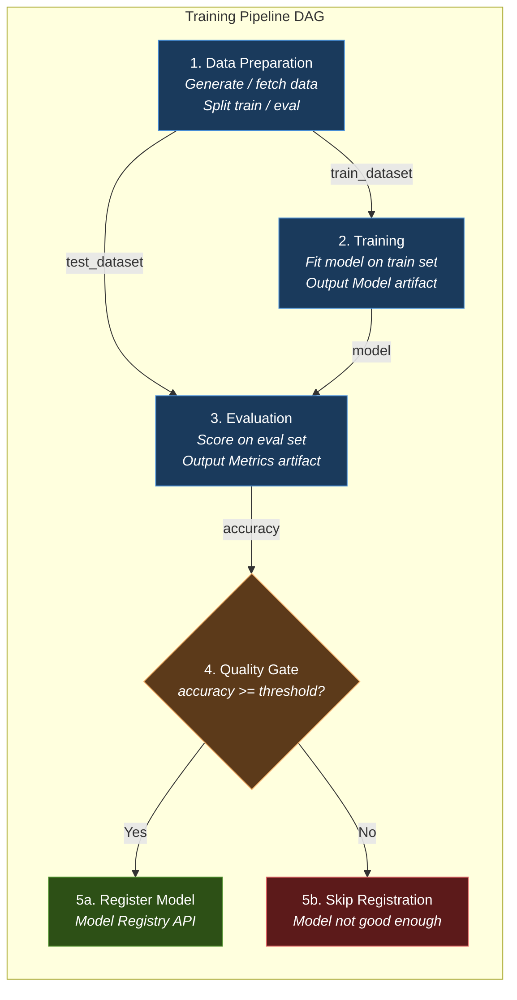
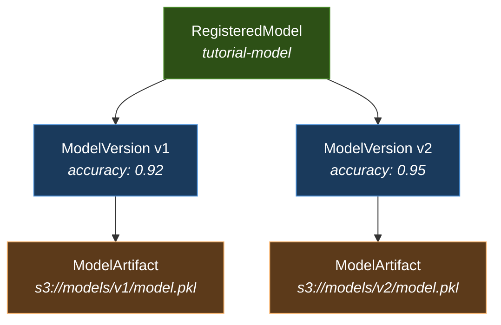

# L2-M4.3 -- Training Pipeline: Data Prep -> Train -> Evaluate -> Register

**Level:** Practitioner
**Duration:** 1.5 hours

## Overview

In L2-M4.2 you learned how to define KFP components, wire them into a DAG, and submit a simple pipeline. Now you will build a pipeline that looks like a real ML workflow: it generates a dataset, trains a model, evaluates quality against a threshold, and conditionally registers the model in the OpenShift AI Model Registry. This five-stage pattern -- data preparation, training, evaluation, registration, deployment -- is the backbone of reproducible ML in production. By the end of this lesson you will have a working pipeline that makes an autonomous quality-gate decision: if the model is good enough, it gets registered; if not, the pipeline stops and no bad model reaches serving.

## Prerequisites

- Completed: [L2-M4.2 -- Building Pipelines with KFP SDK](../2_kfp_sdk/) (understands components, artifacts, parameters)
- Pipeline server running in the `ml-pipelines-tutorial` namespace (from [L2-M4.1](../1_pipeline_setup/))
- Model Registry available (from L1 model registry setup, or deploy one in this lesson)
- `oc` CLI authenticated to the cluster
- Python 3.9+ with `kfp>=2.0` and `scikit-learn` installed locally

```bash
pip install kfp scikit-learn
```

## K8s Context

On vanilla Kubernetes, building a multi-stage ML pipeline typically means chaining Argo Workflows steps manually -- writing YAML templates for each stage, configuring artifact passing between steps through S3 paths, and handling conditional logic through Argo's `when` expressions. Quality gating requires custom exit handlers, and model registration means writing a separate script that calls whatever registry API you have deployed.

On OpenShift AI, the KFP v2 SDK provides a Pythonic abstraction over all of this. You define each stage as a `@dsl.component` function, connect them by passing outputs to inputs, and use `dsl.If` for conditional execution. The pipeline server handles artifact storage, metadata tracking, and execution -- you write Python, not YAML.

## Concepts

### The ML Pipeline Pattern

Production ML workflows follow a repeatable pattern. Each stage has a single responsibility, takes typed inputs, and produces typed outputs. This modularity makes the pipeline auditable (you can inspect what happened at each stage), reproducible (same inputs produce the same outputs), and reusable (swap out the training component without changing evaluation or registration).



Here is what each stage does and why it exists:

| Stage | Purpose | KFP Artifact Type | Why It Matters |
|-------|---------|-------------------|----------------|
| Data Preparation | Fetch or generate data, validate it, split into train/eval sets | `Output[Dataset]` | Ensures training and evaluation use consistent, versioned data |
| Training | Fit the model on the training set | `Output[Model]` | Produces a serialized model artifact that is tracked by the pipeline |
| Evaluation | Score the model on the held-out eval set | `Output[Metrics]` | Provides objective quality measurement, logged for comparison across runs |
| Quality Gate | Compare metrics against a threshold | `dsl.If` conditional | Prevents bad models from reaching production -- the pipeline decides, not a human |
| Registration | Store the model in Model Registry with metadata | Model Registry API | Makes the model discoverable, versioned, and ready for serving |

---

### Training Options on OpenShift AI

The training component in this lesson uses scikit-learn inside a pipeline step -- the simplest approach. OpenShift AI offers more powerful options for large-scale and LLM training:

| Approach | Best For | How It Works | Lesson Coverage |
|----------|----------|--------------|-----------------|
| **In-pipeline training** (this lesson) | Small models (sklearn, XGBoost, small PyTorch) | Model trains inside the pipeline step pod | Full hands-on |
| **Training Hub** (`trainer` component) | LoRA/QLoRA fine-tuning of LLMs | Python library wrapping Unsloth/PEFT; runs in a workbench or pipeline step | [L1-M3.2](../../../level_1/M3_fine_tuning/2_training_hub_lora/) |
| **Kubeflow Training Operator** (`trainingoperator` component) | Distributed training (multi-GPU, multi-node) | CRDs like `PyTorchJob`, `TFJob` that orchestrate distributed training across pods | L3 (advanced) |
| **Pre-built fine-tuning pipelines** | SFT/OSFT of supported LLMs | `sft_pipeline`, `osft_pipeline` -- ready-made pipelines you import and run | Pipeline catalog in dashboard |

> **Practical implication:** For this lesson, in-pipeline training is appropriate because we are training a small classifier. If you were fine-tuning an LLM, you would replace the `train_model` component with a call to Training Hub (`lora_sft()`) or submit a `PyTorchJob` from within the pipeline component.

---

### Conditional Pipeline Logic

KFP v2 provides `dsl.If` (also aliased as `dsl.Condition`) for branching logic within a pipeline. The condition evaluates at runtime based on the output of a previous component:

```python
eval_task = evaluate_model(...)

with dsl.If(eval_task.output >= quality_threshold, name="quality-gate"):
    register_model(...)  # Only runs if condition is True
```

Key points:

- The condition must compare a component's output (a primitive type like `float`, `int`, `str`, or `bool`) against a value or another output.
- Components inside the `dsl.If` block only execute if the condition is met. If the condition is false, those steps are skipped entirely -- no pod is created.
- You can nest `dsl.If` blocks or use `dsl.Elif` and `dsl.Else` for multi-branch logic.
- The condition is evaluated by the pipeline server (Argo Workflows), not by your Python code. The Python `with` block is a DSL construct that compiles into an Argo `when` expression.

---

### GPU Resources in Pipelines

When your training component needs GPU access (deep learning, LLM fine-tuning), you configure it after the task call in the pipeline definition:

```python
train_task = train_model(...)

# Request one GPU
train_task.set_gpu_limit("1")

# Target a specific GPU type
train_task.add_node_selector_constraint(
    "nvidia.com/gpu.product", "NVIDIA-A10G"
)

# Set accelerator type (required for some schedulers)
train_task.set_accelerator_type("nvidia.com/gpu")

# Add tolerations for GPU-tainted nodes
train_task.add_toleration(
    key="nvidia.com/gpu",
    operator="Exists",
    effect="NoSchedule",
)
```

These translate directly to Kubernetes `resources.limits`, `nodeSelector`, and `tolerations` fields on the pod spec. The pipeline server creates the pod with these constraints, and the Kubernetes scheduler places it on a GPU node.

| Method | What It Sets | Example |
|--------|-------------|---------|
| `set_gpu_limit("1")` | `resources.limits["nvidia.com/gpu"]` | Request 1 NVIDIA GPU |
| `add_node_selector_constraint(key, value)` | `nodeSelector` | Target specific GPU model |
| `set_accelerator_type(type)` | Accelerator annotation | Hint for Kueue or other schedulers |
| `add_toleration(...)` | `tolerations` | Allow scheduling on tainted GPU nodes |
| `set_memory_limit("16Gi")` | `resources.limits.memory` | GPU workloads often need more RAM |

---

### Model Registry

The Model Registry is a Tier 1 component (`modelregistry` in the DataScienceCluster) that provides a central catalog of trained models. It stores metadata -- not the model weights themselves. Each entry has three levels:



- **RegisteredModel** -- a named model entry (e.g., `tutorial-model`). Created once.
- **ModelVersion** -- a specific version of that model (e.g., `v1`, `v2`). Created on each successful pipeline run. Stores custom properties like accuracy, framework, and training parameters.
- **ModelArtifact** -- points to the actual model file (S3 path, PVC path, or container image). Links the metadata to the binary artifact.

The Model Registry exposes a REST API that pipeline components can call directly. In this lesson, the `register_model` component uses `requests` to create these three resources when the quality gate passes.

## Step-by-Step

### Step 1: Review the Pipeline Design

Before writing code, understand the full pipeline DAG. The training pipeline has four components connected as follows:

```
prepare_data ──┬── train_model ──┬── evaluate_model ── [quality gate] ── register_model
               │                 │
               └─ (test_dataset) ┘
```

The `prepare_data` component produces two Dataset artifacts: `train_dataset` and `test_dataset`. The training component consumes only the train split, while the evaluation component consumes the test split and the trained model. This ensures the model is always evaluated on data it has never seen.

The quality gate is a `dsl.If` block that checks the accuracy returned by `evaluate_model`. If accuracy meets the threshold, `register_model` runs. If not, the pipeline ends without registration.

Review the complete pipeline script:

```bash
cat scripts/training_pipeline.py
```

The script is roughly 300 lines. The rest of this lesson walks through each component in detail.

### Step 2: Build the Data Preparation Component

The first component generates synthetic data and splits it into train and eval sets. In a production pipeline, this would fetch data from a database, S3, or a feature store.

```python
@dsl.component(
    base_image="python:3.11",
    packages_to_install=["scikit-learn==1.5.0", "pandas==2.2.0"],
)
def prepare_data(
    dataset_size: int,
    num_features: int,
    test_split: float,
    train_dataset: Output[Dataset],
    test_dataset: Output[Dataset],
):
    """Generate synthetic classification data and split into train/test sets."""
    from sklearn.datasets import make_classification
    from sklearn.model_selection import train_test_split
    import pandas as pd

    X, y = make_classification(
        n_samples=dataset_size,
        n_features=num_features,
        n_informative=num_features // 2,
        n_redundant=2,
        random_state=42,
    )

    feature_cols = [f"feature_{i}" for i in range(num_features)]
    df = pd.DataFrame(X, columns=feature_cols)
    df["target"] = y

    # Stratified split to maintain class balance
    train_df, test_df = train_test_split(
        df, test_size=test_split, random_state=42, stratify=y
    )

    train_df.to_csv(train_dataset.path, index=False)
    test_df.to_csv(test_dataset.path, index=False)

    train_dataset.metadata["num_rows"] = len(train_df)
    train_dataset.metadata["num_features"] = num_features
    test_dataset.metadata["num_rows"] = len(test_df)

    print(f"Data prepared: {len(train_df)} train, {len(test_df)} test samples")
```

**Key design decisions:**

- **Two output artifacts** (`train_dataset` and `test_dataset`): Using separate `Output[Dataset]` parameters ensures the pipeline server tracks both artifacts independently. The train and test sets get separate entries in the artifact store.
- **`packages_to_install`**: Each component declares its own dependencies. The pipeline server installs them at runtime inside the component's pod. This keeps components self-contained.
- **`stratify=y`**: Preserves the class distribution in both splits, which is important for balanced evaluation.
- **CSV format via pandas**: Simple and portable. For large datasets in production, you would use Parquet or store data in a feature store.

### Step 3: Build the Training Component

The training component reads the training split, fits a model, and saves it as a KFP Model artifact.

```python
@dsl.component(
    base_image="python:3.11",
    packages_to_install=["scikit-learn==1.5.0", "pandas==2.2.0"],
)
def train_model(
    train_data: Input[Dataset],
    model_name: str,
    n_estimators: int,
    max_depth: int,
    trained_model: Output[Model],
):
    """Train a RandomForest classifier and save as a pickle artifact."""
    import pandas as pd
    import pickle
    from sklearn.ensemble import RandomForestClassifier

    train_df = pd.read_csv(train_data.path)
    X_train = train_df.drop("target", axis=1)
    y_train = train_df["target"]

    # max_depth=0 means no limit (None)
    effective_depth = max_depth if max_depth > 0 else None

    model = RandomForestClassifier(
        n_estimators=n_estimators,
        max_depth=effective_depth,
        random_state=42,
    )
    model.fit(X_train, y_train)

    # Save model as pickle
    with open(trained_model.path, "wb") as f:
        pickle.dump(model, f)

    trained_model.metadata["model_name"] = model_name
    trained_model.metadata["framework"] = "scikit-learn"
    trained_model.metadata["algorithm"] = "RandomForestClassifier"
    trained_model.metadata["n_estimators"] = n_estimators
    trained_model.metadata["max_depth"] = max_depth
```

**Key points:**

- **`Output[Model]`**: The KFP Model artifact type signals to the pipeline UI that this output is a trained model. The dashboard renders it differently from a generic Dataset.
- **`trained_model.metadata`**: Metadata attached to the artifact is stored in the ML Metadata database and displayed in the dashboard. This is how you track which hyperparameters produced which model.
- **`pickle.dump`**: Standard Python serialization. For deep learning models you would use `torch.save()` or `model.save_pretrained()`. scikit-learn also supports `joblib` for models with large NumPy arrays.
- **`max_depth=0` convention**: The pipeline uses `max_depth=0` to mean "no limit" (`None`), since KFP pipeline parameters do not support `None` values. This is a common workaround.

**GPU resources (for deep learning components):**

If this were a PyTorch or TensorFlow training component, you would add GPU requests after the task call in the pipeline definition. The training component itself does not know about GPUs -- the resource requests are set on the pod spec:

```python
# In the pipeline definition (not inside the component):
train_task = train_model(...)
train_task.set_gpu_limit("1")
train_task.add_node_selector_constraint("nvidia.com/gpu.product", "NVIDIA-A10G")
```

### Step 4: Build the Evaluation Component

The evaluation component scores the model on data it has never seen and returns the accuracy as a float for the quality gate.

```python
@dsl.component(
    base_image="python:3.11",
    packages_to_install=["scikit-learn==1.5.0", "pandas==2.2.0"],
)
def evaluate_model(
    test_data: Input[Dataset],
    trained_model: Input[Model],
    eval_metrics: Output[Metrics],
) -> float:
    """Evaluate the model on test data and return the accuracy score."""
    import pandas as pd
    import pickle
    from sklearn.metrics import accuracy_score, f1_score, precision_score, recall_score

    # Load model
    with open(trained_model.path, "rb") as f:
        model = pickle.load(f)

    # Load test data
    test_df = pd.read_csv(test_data.path)
    X_test = test_df.drop("target", axis=1)
    y_test = test_df["target"]

    # Predict and compute metrics
    y_pred = model.predict(X_test)
    accuracy = float(accuracy_score(y_test, y_pred))
    f1 = float(f1_score(y_test, y_pred, average="weighted"))
    precision = float(precision_score(y_test, y_pred, average="weighted"))
    recall = float(recall_score(y_test, y_pred, average="weighted"))

    # Log all metrics (visible in the dashboard Metrics tab)
    eval_metrics.log_metric("accuracy", accuracy)
    eval_metrics.log_metric("f1_score", f1)
    eval_metrics.log_metric("precision", precision)
    eval_metrics.log_metric("recall", recall)
    eval_metrics.log_metric("test_samples", len(y_test))

    # Return accuracy for the quality gate
    return accuracy
```

**Key points:**

- **Return type `-> float`**: This is critical. The return value becomes the component's `.output` in the pipeline DAG, which the quality gate uses for its condition. Without the return type annotation, KFP cannot pass the value downstream.
- **`Output[Metrics]`**: The Metrics artifact type has a special `log_metric()` method. Logged metrics appear in the dashboard under the run's **Metrics** tab and can be compared across runs.
- **Multiple metrics, one return**: The component logs five metrics (accuracy, F1, precision, recall, sample count) for visibility, but returns only accuracy for the quality gate. In a more complex pipeline you could return a NamedTuple with multiple values.

> **Practical implication:** For LLM evaluation, you would replace this component with one that submits an `LMEvalJob` CR (see [L1-M5.1](../../../level_1/M5_evaluation/1_lmevaljob/)) and waits for the job to complete. The pattern is the same -- compute metrics, return a quality score -- but the evaluation mechanism is different.

### Step 5: Build the Registration Component

The registration component calls the Model Registry REST API to create a versioned entry for the model. It only runs if the quality gate passes.

```python
@dsl.component(
    base_image="python:3.11",
    packages_to_install=["requests==2.32.0"],
)
def register_model(
    model_name: str,
    model_version: str,
    accuracy: float,
    model: Input[Model],
    registry_url: str,
):
    """Register the model in the Model Registry via REST API."""
    import requests

    # Step 1: Create or find the RegisteredModel
    registered_model_payload = {
        "name": model_name,
        "description": "Tutorial model trained via pipeline",
    }

    try:
        resp = requests.post(
            f"{registry_url}/api/model_registry/v1alpha3/registered_models",
            json=registered_model_payload,
            timeout=30,
        )
        if resp.status_code == 409:
            # Model already exists -- look it up
            resp = requests.get(
                f"{registry_url}/api/model_registry/v1alpha3/registered_models",
                params={"name": model_name},
                timeout=30,
            )
            resp.raise_for_status()
            registered_model = resp.json()["items"][0]
        else:
            resp.raise_for_status()
            registered_model = resp.json()
        registered_model_id = registered_model["id"]
    except requests.exceptions.ConnectionError:
        print(f"WARNING: Could not connect to Model Registry at {registry_url}")
        return

    # Step 2: Create a ModelVersion
    version_payload = {
        "name": model_version,
        "registeredModelId": registered_model_id,
        "description": f"accuracy={accuracy:.4f}",
    }
    resp = requests.post(
        f"{registry_url}/api/model_registry/v1alpha3/model_versions",
        json=version_payload,
        timeout=30,
    )
    resp.raise_for_status()
    model_version_id = resp.json()["id"]

    # Step 3: Create a ModelArtifact pointing to the model's S3 URI
    artifact_payload = {
        "name": f"{model_name}-{model_version}-artifact",
        "modelFormatName": "sklearn",
        "modelFormatVersion": "1.5.0",
        "uri": model.uri,
        "artifactType": "model-artifact",
    }
    resp = requests.post(
        f"{registry_url}/api/model_registry/v1alpha3/model_versions/{model_version_id}/artifacts",
        json=artifact_payload,
        timeout=30,
    )
    resp.raise_for_status()
```

**Key points:**

- **Three API calls**: The Model Registry uses a three-level hierarchy (RegisteredModel -> ModelVersion -> ModelArtifact). The component creates all three if needed.
- **Idempotent model creation**: The component first tries to create a RegisteredModel. If it already exists (HTTP 409), it looks up the existing one. This means you can run the pipeline multiple times without creating duplicate entries.
- **`model.uri`**: The KFP Model artifact's URI points to the S3 location where the pipeline server stored the serialized model. This URI is recorded in the ModelArtifact so the serving layer knows where to find the weights.
- **Connection error handling**: If the Model Registry is not reachable, the component prints a warning and returns gracefully instead of failing the pipeline. In production, you would want this to fail explicitly.

### Step 6: Compose the Full Pipeline

Now wire the components together with conditional logic:

```python
import datetime

@dsl.pipeline(
    name="training-pipeline",
    description="End-to-end: data prep, train, evaluate, conditionally register.",
)
def training_pipeline(
    model_name: str = "tutorial-classifier",
    dataset_size: int = 1000,
    num_features: int = 15,
    test_split: float = 0.2,
    n_estimators: int = 100,
    max_depth: int = 10,
    quality_threshold: float = 0.8,
    registry_url: str = "http://model-registry-service:8080",
):
    # Version string for this run
    model_version = datetime.datetime.now().strftime("v%Y%m%d-%H%M%S")

    # Step 1: Prepare data
    data_task = prepare_data(
        dataset_size=dataset_size,
        num_features=num_features,
        test_split=test_split,
    )

    # Step 2: Train model
    train_task = train_model(
        train_data=data_task.outputs["train_dataset"],
        model_name=model_name,
        n_estimators=n_estimators,
        max_depth=max_depth,
    )

    # Optional: request GPU resources for training
    # train_task.set_gpu_limit(1)
    # train_task.set_memory_limit("16Gi")
    # train_task.set_cpu_limit("4")

    # Step 3: Evaluate
    evaluate_task = evaluate_model(
        test_data=data_task.outputs["test_dataset"],
        trained_model=train_task.outputs["trained_model"],
    )

    # Step 4: Quality gate -- register only if accuracy exceeds threshold
    with dsl.If(evaluate_task.output > quality_threshold):
        register_model(
            model_name=model_name,
            model_version=model_version,
            accuracy=evaluate_task.output,
            model=train_task.outputs["trained_model"],
            registry_url=registry_url,
        )
```

**How the DAG executes:**

1. `prepare_data` runs first (no dependencies).
2. `train_model` starts after `prepare_data` completes (depends on `train_dataset`).
3. `evaluate_model` starts after both `prepare_data` and `train_model` complete (depends on `test_dataset` from step 1 and `trained_model` from step 2).
4. The `dsl.If` block evaluates the accuracy. If `accuracy > quality_threshold`, `register_model` runs. Otherwise, the pipeline ends.

**Pipeline parameters** are defined as function arguments with defaults. When you submit a run, you can override any of them. This makes the pipeline reusable across different experiments without changing code.

### Step 7: Compile and Submit the Pipeline

Compile the pipeline to a YAML file:

```bash
cd scripts/
python training_pipeline.py
```

Expected output:

```
Pipeline compiled to training_pipeline.yaml
```

Examine the compiled YAML to understand what KFP generates:

```bash
head -20 training_pipeline.yaml
```

Expected output:

```yaml
# PIPELINE DEFINITION
# Name: training-pipeline
# Description: End-to-end: data prep, train, evaluate, conditionally register.
# Inputs:
#    dataset_size: int [Default: 1000]
#    max_depth: int [Default: 10]
#    model_name: str [Default: 'tutorial-classifier']
#    n_estimators: int [Default: 100]
#    num_features: int [Default: 15]
#    quality_threshold: float [Default: 0.8]
#    registry_url: str [Default: 'http://model-registry-service:8080']
#    test_split: float [Default: 0.2]
...
```

Now submit the pipeline. You have two options.

**Option A: Submit programmatically**

```bash
# In one terminal, port-forward to the pipeline server:
oc port-forward -n ml-pipelines-tutorial svc/ds-pipeline-dspa 8888:8888 &

# Then submit via Python:
python3 -c "
from kfp.client import Client

client = Client(host='http://localhost:8888')
run = client.create_run_from_pipeline_package(
    pipeline_file='training_pipeline.yaml',
    arguments={
        'model_name': 'tutorial-classifier',
        'dataset_size': 1000,
        'num_features': 15,
        'quality_threshold': 0.8,
    },
    run_name='training-pipeline-run',
    experiment_name='tutorial-experiments',
)
print(f'Run ID: {run.run_id}')
"
```

**Option B: Upload via the Dashboard**

1. Open the OpenShift AI dashboard
2. Navigate to **Data Science Projects** > **ml-pipelines-tutorial**
3. Click **Pipelines** in the left sidebar
4. Click **Import pipeline** and upload `training_pipeline.yaml`
5. Give it a name (e.g., `training-pipeline`) and click **Create**
6. Click the pipeline name, then **Create run**
7. Review the default parameters and click **Create**

> **Tip:** When submitting via the dashboard, you can modify any pipeline parameter before creating the run. Try setting `quality_threshold` to `0.99` to see the quality gate reject the model.

### Step 8: Monitor Pipeline Execution

Once the run starts, monitor its progress in the dashboard.

**In the Dashboard:**

1. Navigate to **Data Science Projects** > **ml-pipelines-tutorial** > **Runs**
2. Click the running pipeline run
3. You will see the DAG visualization showing each component as a node with real-time status:
   - **Blue** -- running
   - **Green** -- completed successfully
   - **Red** -- failed
   - **Gray** -- skipped (condition not met)
4. Click any node to see its details:
   - **Input/Output** tab -- shows artifact references and parameter values
   - **Logs** tab -- shows the component's stdout/stderr (the `print()` statements from your code)
   - **Metrics** tab -- shows logged metrics for evaluation components

**Via the CLI:**

List runs:

```bash
# Port-forward to the pipeline server
oc port-forward -n ml-pipelines-tutorial svc/ds-pipeline-dspa 8888:8888 &

# List recent runs
curl -s http://localhost:8888/apis/v2beta1/runs | python3 -m json.tool | head -40
```

Check individual step logs by finding the pod:

```bash
# List pods for the current pipeline run
oc get pods -n ml-pipelines-tutorial -l pipeline/runid --sort-by=.metadata.creationTimestamp

# View logs for a specific step
oc logs -n ml-pipelines-tutorial <step-pod-name> -c main
```

Expected log output from the `evaluate_model` step:

```
Evaluation results:
  Accuracy:  0.9200
  F1 Score:  0.9180
  Precision: 0.9208
  Recall:    0.9184
  Samples:   200
```

### Step 9: Verify Model Registration

If the accuracy exceeded the quality threshold (default 0.80), the `register_model` step should have run. Verify by checking the Model Registry.

**Via the CLI:**

```bash
# Port-forward to the Model Registry service
oc port-forward -n ml-pipelines-tutorial svc/model-registry-service 8080:8080 &
MR_URL="http://localhost:8080"

# List registered models
curl -s "$MR_URL/api/model_registry/v1alpha3/registered_models" | python3 -m json.tool
```

Expected output:

```json
{
    "items": [
        {
            "id": "1",
            "name": "tutorial-classifier",
            "description": "Tutorial model trained via pipeline",
            "createTimeSinceEpoch": "1719936000000",
            "lastUpdateTimeSinceEpoch": "1719936000000"
        }
    ],
    "size": 1
}
```

List model versions:

```bash
curl -s "$MR_URL/api/model_registry/v1alpha3/model_versions?registeredModelId=1" | python3 -m json.tool
```

Expected output:

```json
{
    "items": [
        {
            "id": "1",
            "name": "v20260704-143022",
            "registeredModelId": "1",
            "description": "accuracy=0.9200"
        }
    ],
    "size": 1
}
```

**Via the Dashboard:**

1. Navigate to **Model Registry** in the OpenShift AI dashboard sidebar
2. You should see `tutorial-classifier` listed
3. Click it to see the timestamped version with its accuracy metadata

### Step 10: Test the Quality Gate

Run the pipeline again with a high quality threshold to see the gate reject the model:

**Via the CLI (submit with custom parameters):**

```bash
oc port-forward -n ml-pipelines-tutorial svc/ds-pipeline-dspa 8888:8888 &

python3 -c "
from kfp.client import Client

client = Client(host='http://localhost:8888')
run = client.create_run_from_pipeline_package(
    pipeline_file='training_pipeline.yaml',
    arguments={'quality_threshold': 0.99},
    run_name='high-threshold-test',
    experiment_name='tutorial-experiments',
)
print(f'Run ID: {run.run_id}')
"
```

**Via the Dashboard:**

1. Navigate to the `training-pipeline` pipeline
2. Click **Create run**
3. Set `quality_threshold` to `0.99`
4. Click **Create**

When the run completes, check the DAG visualization. The `register_model` node should appear **gray** (skipped) because the accuracy did not reach 99%.

In the `evaluate_model` step logs, you will see the accuracy (e.g., 0.92), and the pipeline dashboard will show the quality-gate condition as not met.

This confirms the pipeline makes the decision autonomously. No manual intervention needed.

### Step 11: Run with Different Parameters

Demonstrate the pipeline's parameterized nature by experimenting with different hyperparameters:

| Parameter | Default | Experiment Value | Effect |
|-----------|---------|-----------------|--------|
| `dataset_size` | 1000 | 200 | Less training data, likely lower accuracy |
| `n_estimators` | 100 | 10 | Fewer trees, faster but less accurate |
| `max_depth` | 10 | 3 | Shallower trees, may underfit |
| `quality_threshold` | 0.80 | 0.70 | Lower bar for registration |

Submit multiple runs with different parameter combinations:

```python
from kfp.client import Client

client = Client(host="http://localhost:8888")

experiments = [
    {"dataset_size": 200, "n_estimators": 10, "max_depth": 3, "num_features": 10},
    {"dataset_size": 1000, "n_estimators": 50, "max_depth": 5, "num_features": 15},
    {"dataset_size": 2000, "n_estimators": 200, "max_depth": 20, "num_features": 15},
]

for i, params in enumerate(experiments):
    run = client.create_run_from_pipeline_package(
        pipeline_file="training_pipeline.yaml",
        arguments={
            **params,
            "model_name": f"experiment-{i+1}",
            "quality_threshold": 0.80,
        },
        run_name=f"experiment-{i+1}",
        experiment_name="hyperparameter-search",
    )
    print(f"Started run {i+1}: {run.run_id}")
```

Compare the metrics across runs in the dashboard by navigating to **Runs** and clicking **Compare** to see a side-by-side view of metrics from different runs.

### Optional: Auto-Deployment Component

A complete pipeline could include a deployment step that creates or updates an `InferenceService` for the registered model. This component is included in `scripts/training_pipeline.py` as a commented-out reference:

```python
# @dsl.component(
#     base_image="python:3.11",
#     packages_to_install=["kubernetes==29.0.0"],
# )
# def deploy_model(
#     model_name: str,
#     model_version: str,
#     serving_namespace: str,
# ):
#     """Create or update an InferenceService for the registered model."""
#     from kubernetes import client, config
#
#     config.load_incluster_config()
#     custom_api = client.CustomObjectsApi()
#
#     isvc_body = {
#         "apiVersion": "serving.kserve.io/v1beta1",
#         "kind": "InferenceService",
#         "metadata": {
#             "name": model_name,
#             "namespace": serving_namespace,
#         },
#         "spec": {
#             "predictor": {
#                 "model": {
#                     "modelFormat": {"name": "sklearn"},
#                     "storageUri": f"s3://models/{model_name}/{model_version}/",
#                 },
#             },
#         },
#     }
#
#     try:
#         custom_api.create_namespaced_custom_object(
#             group="serving.kserve.io", version="v1beta1",
#             namespace=serving_namespace, plural="inferenceservices",
#             body=isvc_body,
#         )
#     except client.exceptions.ApiException as e:
#         if e.status == 409:  # Already exists -- patch it
#             custom_api.patch_namespaced_custom_object(...)
#         else:
#             raise
```

In production, model deployment is typically handled through GitOps (ArgoCD) rather than directly from the pipeline. The pipeline registers the model, and a GitOps controller detects the new version and updates the InferenceService. This separation keeps the pipeline focused on training and the deployment process auditable through Git history.

### Elyra: Visual Pipeline Design

OpenShift AI workbenches with JupyterLab include the **Elyra** extension, which provides a visual drag-and-drop pipeline editor. Instead of writing Python pipeline definitions, you can:

1. Create individual `.py` or `.ipynb` files for each component
2. Open the Elyra pipeline editor in JupyterLab
3. Drag components onto a canvas and connect them visually
4. Configure parameters and dependencies through the UI
5. Submit the pipeline directly from JupyterLab

Elyra is particularly useful for data scientists who prefer a visual workflow. It generates KFP-compatible pipeline definitions behind the scenes. This lesson uses the Python SDK directly because it provides more control and is easier to version in Git -- but Elyra is worth exploring for rapid prototyping.

## Verification

Run through this checklist to confirm the lesson succeeded:

| Check | Command | Expected Result |
|-------|---------|-----------------|
| Pipeline compiled | `ls scripts/training_pipeline.yaml` | File exists |
| Pipeline visible in dashboard | Dashboard > Pipelines | `training-pipeline` listed |
| Run completed | Dashboard > Runs | At least one run with all green nodes |
| Metrics logged | Click `evaluate_model` step > Metrics tab | `accuracy`, `f1_score`, `precision`, `recall` visible |
| Quality gate passed | DAG visualization | `register_model` node is green (not gray) |
| Model registered | `curl $MR_URL/api/model_registry/v1alpha3/registered_models` | `tutorial-classifier` in response |
| Version created | `curl $MR_URL/api/model_registry/v1alpha3/registered_models/1/versions` | Version with accuracy metadata |
| Quality gate rejection tested | Run with `quality_threshold=0.99` | `register_model` node is gray (skipped) |

## K8s vs OpenShift AI Comparison

| Aspect | Kubernetes | OpenShift AI |
|--------|-----------|--------------|
| Pipeline definition | Argo Workflow YAML templates | KFP v2 Python SDK (`@dsl.component`, `@dsl.pipeline`) |
| Conditional logic | Argo `when` expressions in YAML | `dsl.If` / `dsl.Condition` in Python |
| Artifact tracking | Manual S3 path management | Built-in ML Metadata store, typed artifacts (`Dataset`, `Model`, `Metrics`) |
| Model registry | External tool (MLflow, custom) | Built-in Model Registry (Tier 1 component) |
| GPU requests | Pod spec `resources.limits` in YAML | `task.set_gpu_limit()` in Python |
| Metrics visualization | Custom Grafana dashboards | Built into the pipeline dashboard |
| Quality gating | Custom exit handler scripts | `dsl.If(eval_task.output >= threshold)` |
| Pipeline submission | `argo submit` CLI | Dashboard UI or KFP Python client |
| Run comparison | Not built in | Dashboard side-by-side run comparison |
| Execution engine | Argo Workflows (you install) | Argo Workflows (auto-deployed by DSPA) |

## Key Takeaways

- The five-stage ML pipeline pattern (data prep, train, evaluate, gate, register) is the foundation of reproducible ML. Each stage has a single responsibility and produces typed, tracked artifacts.
- `dsl.If` provides quality gating at the pipeline level -- the pipeline server evaluates the condition and skips downstream components if the model does not meet the threshold. No bad models reach the registry automatically.
- The `Output[Metrics]` artifact type with `log_metric()` provides built-in metric tracking and visualization in the dashboard. Metrics from different runs can be compared side by side.
- GPU resources are configured on the task (not inside the component) using `set_gpu_limit()`, `add_node_selector_constraint()`, and `add_toleration()`. The component code itself is hardware-agnostic.
- The Model Registry REST API can be called directly from pipeline components using `requests`. The three-level hierarchy (RegisteredModel -> ModelVersion -> ModelArtifact) supports multiple versions of the same model with custom metadata.
- Pipeline parameters make the same pipeline reusable across experiments. Change `learning_rate`, `n_estimators`, or `quality_threshold` without modifying code.

## Cleanup

Remove pipeline artifacts and runs:

```bash
# Delete pipeline runs (via the dashboard: Runs > select all > Delete)
# Or via the API:
oc port-forward -n ml-pipelines-tutorial svc/ds-pipeline-dspa 8888:8888 &

# List runs
curl -s http://localhost:8888/apis/v2beta1/runs | python3 -c "
import json, sys
runs = json.load(sys.stdin).get('runs', [])
for r in runs:
    print(f\"Run: {r['run_id']} -- {r.get('display_name', 'unnamed')}\")
"

# Delete a specific run
# curl -X DELETE http://localhost:8888/apis/v2beta1/runs/<run-id>
```

Remove the compiled pipeline YAML:

```bash
rm -f scripts/training_pipeline.yaml
```

If you want to remove the registered model from the Model Registry:

```bash
# curl -X DELETE "$MR_URL/api/model_registry/v1alpha3/registered_models/1"
```

> **Note:** Keep the pipeline server running if you plan to continue to L2-M4.4.

## Next Steps

In the next lesson, [L2-M4.4 -- RAG Ingestion Pipeline](../4_rag_ingestion/), you will build a pipeline specialized for Retrieval-Augmented Generation (RAG) -- ingesting documents, chunking them, generating embeddings, and storing them in a vector database. That pipeline uses a different set of components but follows the same KFP v2 patterns you learned here: typed artifacts, parameterized runs, and conditional logic.
