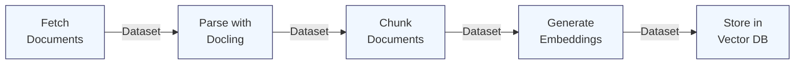

# L2-M4.4 -- RAG Ingestion Pipeline

**Level:** Practitioner
**Duration:** 45 min

## Overview

In [L2-M1.3](../../M1_rag/3_document_ingestion/) you built a document ingestion pipeline as a standalone Python script -- parse documents with Docling, chunk text, generate embeddings, store in pgvector. It worked, but running it required SSHing into a pod, setting environment variables, and manually invoking the script. There was no scheduling, no run history, no artifact tracking, and no way to compare results across different parameter configurations.

This lesson wraps the same ingestion logic in a KFP v2 pipeline. Each stage -- fetch, parse, chunk, embed, store -- becomes a pipeline component with typed inputs and outputs. The pipeline server handles execution, tracks artifacts, records metrics, and lets you schedule recurring runs. You go from "I ran the script at 2 AM and forgot to log the results" to a fully auditable, parameterized, schedulable ingestion workflow.

## Prerequisites

- Completed: [L2-M4.2 -- KFP SDK Fundamentals](../2_kfp_sdk/) (component authoring, artifact types, pipeline parameters)
- Completed: [L2-M1 -- RAG Module](../../M1_rag/) (RAG architecture, vector databases, document ingestion concepts)
- Pipeline server running in `ml-pipelines-tutorial` namespace (from [L2-M4.1](../1_pipeline_setup/))
- `oc` CLI authenticated to the cluster
- Python 3.9+ with `kfp>=2.0` installed

## K8s Context

On vanilla Kubernetes with Kubeflow Pipelines, building a RAG ingestion pipeline requires the same KFP SDK and component model -- the pipeline code itself is portable. The differences are operational: you must manage the Kubeflow Pipelines installation yourself (Argo Workflows, metadata store, artifact storage), configure S3 credentials manually, and handle scheduling through Kubernetes CronJobs or the KFP recurring run API.

On OpenShift AI, the pipeline server is already running (deployed via the DSPA CR in L2-M4.1), artifact storage is pre-configured, and scheduling is built into both the dashboard and the `kfp.Client` API. The pipeline code you write here would run identically on vanilla Kubeflow -- only the submission and scheduling steps are OpenShift AI-specific.

## Concepts

### Why Pipeline-Based Ingestion?

In L2-M1.3, you ran ingestion as a script. That approach works for a one-time load, but production RAG systems need ongoing ingestion -- new documents arrive daily, knowledge bases are updated, and the vector database must stay current. A pipeline brings four capabilities that a standalone script does not:

| Capability | Standalone Script | KFP Pipeline |
|------------|------------------|--------------|
| **Scheduling** | Manual cron job or ad-hoc execution | Built-in recurring runs with cron syntax |
| **Reproducibility** | Depends on environment state | Every run is parameterized and versioned |
| **Monitoring** | Check logs manually | Dashboard shows run status, duration, metrics |
| **Metadata tracking** | None unless you build it | Automatic artifact lineage and metric recording |
| **Parameterization** | CLI args, easy to forget | Parameters are part of the pipeline definition |
| **Error isolation** | One failure kills the script | Each component fails independently; partial results are preserved |

The pipeline also makes it easy to compare runs. Ingest with `chunk_size=256` on Monday, `chunk_size=512` on Tuesday, then compare the chunk counts and downstream retrieval quality in the dashboard.

---

### The RAG Ingestion Pattern

The ingestion pipeline follows a five-stage linear pattern. Each stage maps to one KFP component:



| Stage | Component | Input | Output | Key Dependency |
|-------|-----------|-------|--------|----------------|
| 1. Fetch | `fetch_documents` | S3 bucket + prefix | Dataset (JSON Lines of raw docs) | boto3 (or sample data) |
| 2. Parse | `parse_documents` | Raw documents | Dataset (parsed text with structure) | Docling |
| 3. Chunk | `chunk_documents` | Parsed text + strategy params | Dataset (chunks with metadata) | None (pure Python) |
| 4. Embed | `generate_embeddings` | Chunks + model endpoint | Dataset (chunks with embeddings) | Embedding API |
| 5. Store | `store_in_vector_db` | Chunks with embeddings | Metrics (ingestion stats) | Milvus or pgvector |

Data flows between components as `Dataset` artifacts -- JSON Lines files stored in the pipeline's S3 artifact backend. Each component reads the previous component's output, processes it, and writes a new artifact. KFP handles the file transfer automatically.

---

### Docling for Document Parsing

[Docling](https://github.com/DS4SD/docling) is IBM's open-source document parsing library. OpenShift AI's AutoRAG feature uses Docling under the hood for document conversion. It converts diverse formats into a unified structured representation:

| Format | What Docling Extracts |
|--------|----------------------|
| PDF | Text, headings, tables, lists, figures (with OCR) |
| DOCX | Text, headings, tables, lists, embedded images |
| PPTX | Slide text, titles, speaker notes, tables |
| HTML | Text, headings, tables, lists (strips tags) |
| Markdown | Text, headings, code blocks, tables |

In the pipeline, the `parse_documents` component installs Docling via `packages_to_install` and uses it to convert each fetched document. For simple text and Markdown files, parsing is fast. For PDFs with complex layouts, Docling applies layout analysis that may take a few seconds per page.

The component includes a fallback: if Docling fails for a particular document (e.g., a corrupted PDF), it falls back to plain text extraction and logs the error. This prevents a single bad document from halting the entire pipeline.

---

### Chunking Strategies

The `chunk_documents` component supports three strategies, configurable via the `chunking_strategy` pipeline parameter:

| Strategy | How It Works | Best For |
|----------|-------------|----------|
| **Fixed-size** | Split by character count with overlap between chunks | Quick prototyping, homogeneous text |
| **Semantic** | Split at paragraph boundaries, merge short paragraphs | Blog posts, articles, mixed content |
| **Document-aware** | Split at heading boundaries, keep sections intact | Technical docs, manuals, structured reports |

You covered these strategies in detail in [L2-M1.3](../../M1_rag/3_document_ingestion/). The difference here is that the strategy is a pipeline parameter -- you can submit runs with different strategies and compare the results without modifying code.

---

### Metadata and Metrics Tracking

KFP tracks two kinds of information automatically:

1. **Artifact metadata:** Each `Dataset` artifact can carry key-value metadata via `artifact.metadata["key"] = "value"`. The pipeline uses this to record document counts, character totals, chunk counts, and embedding dimensions at each stage. This metadata is visible in the dashboard's Artifacts tab.

2. **Metrics:** The `store_in_vector_db` component uses a `Metrics` output artifact to log numerical metrics (`num_source_documents`, `num_chunks_inserted`, `embedding_dimension`, `collection_total_entities`). These metrics appear in the pipeline run's Metrics tab and can be compared across runs.

Together, these give you a complete audit trail: which documents were ingested, how many chunks were produced, what embedding model was used, and how large the collection is after each run.

## Step-by-Step

### Step 1: Review the Pipeline Design

The pipeline script is at `scripts/rag_ingestion_pipeline.py`. Before running it, review the overall structure:

```bash
cat scripts/rag_ingestion_pipeline.py | head -30
```

Expected output:

```
"""
L2-M4.4 -- RAG Ingestion Pipeline

KFP v2 pipeline that automates the RAG document ingestion workflow:
  1. fetch_documents      -- Pull documents from an S3 bucket (simulated with sample data)
  2. parse_documents      -- Parse raw documents into structured text using Docling
  3. chunk_documents      -- Split parsed text into chunks with configurable strategy
  4. generate_embeddings  -- Generate vector embeddings for each chunk
  5. store_in_vector_db   -- Write embeddings and metadata to a vector database
...
```

The script defines five components and one pipeline function. Each component uses `@dsl.component` with its own `base_image` and `packages_to_install`, so dependencies are isolated per stage.

The pipeline accepts 10 parameters:

| Parameter | Type | Default | Purpose |
|-----------|------|---------|---------|
| `source_bucket` | str | `"documents"` | S3 bucket containing raw documents |
| `source_prefix` | str | `"raw/"` | Key prefix to filter documents |
| `chunk_size` | int | `512` | Maximum chunk size in characters |
| `chunk_overlap` | int | `50` | Overlap between consecutive chunks |
| `chunking_strategy` | str | `"fixed"` | One of `fixed`, `semantic`, `document-aware` |
| `embedding_model` | str | `"nomic-embed-text-v1.5"` | Model name for the embedding API |
| `embedding_endpoint` | str | `"http://embedding-model:8080/v1/embeddings"` | URL of the embedding service |
| `vector_db_host` | str | `"milvus-service"` | Hostname of the vector database |
| `vector_db_port` | int | `19530` | Port of the vector database |
| `collection_name` | str | `"documents"` | Target collection name |

### Step 2: Understand the Fetch Component

The `fetch_documents` component is the pipeline's data source. In production, it pulls documents from an S3 bucket using boto3. For this tutorial, it generates three sample Markdown documents about OpenShift AI topics:

```python
@dsl.component(
    base_image="python:3.11",
    packages_to_install=["boto3==1.34.0"],
)
def fetch_documents(
    source_bucket: str,
    source_prefix: str,
    documents_out: Output[Dataset],
):
```

Key points:

- The component produces a `Dataset` artifact (`documents_out`) containing JSON Lines -- one JSON object per document.
- Each document object includes `name`, `source` (the S3 URI for provenance), `format`, and `content`.
- The commented-out boto3 code shows exactly how to connect to a real S3 bucket. To switch to real data, uncomment that section and remove the sample documents.

### Step 3: Understand the Parse Component

The `parse_documents` component uses Docling to convert raw documents into structured text:

```python
@dsl.component(
    base_image="python:3.11",
    packages_to_install=["docling==2.31.0"],
)
def parse_documents(
    raw_documents: Input[Dataset],
    parsed_out: Output[Dataset],
):
```

Key points:

- Docling is installed via `packages_to_install`. This means every time the component runs, pip installs Docling into the container. For faster execution, you could build a custom container image with Docling pre-installed and use that as `base_image`.
- The component tries Docling first and falls back to plain text if Docling is not available or fails for a particular document.
- Output is another JSON Lines `Dataset` with the parsed text and character counts.

### Step 4: Understand the Chunking Component

The `chunk_documents` component splits parsed text into retrieval-ready chunks:

```python
@dsl.component(
    base_image="python:3.11",
    packages_to_install=["numpy==1.26.4"],
)
def chunk_documents(
    parsed_documents: Input[Dataset],
    chunk_size: int,
    chunk_overlap: int,
    chunking_strategy: str,
    chunks_out: Output[Dataset],
):
```

This component implements all three chunking strategies in pure Python (no external NLP libraries). The strategy is selected by the `chunking_strategy` parameter, so you can submit pipeline runs with different strategies without modifying any code.

Each output chunk includes metadata: the source document name, chunk index, section heading (for document-aware chunks), and the strategy used.

### Step 5: Understand the Embedding Component

The `generate_embeddings` component calls an OpenAI-compatible embedding API:

```python
@dsl.component(
    base_image="python:3.11",
    packages_to_install=["requests==2.31.0", "numpy==1.26.4"],
)
def generate_embeddings(
    chunks_in: Input[Dataset],
    embedding_model: str,
    embedding_endpoint: str,
    embeddings_out: Output[Dataset],
):
```

Key points:

- Chunks are processed in batches of 16 to reduce HTTP overhead.
- If the embedding endpoint is not reachable, the component falls back to random vectors. This lets you test the pipeline end-to-end without deploying an embedding model, but the resulting vectors will not produce meaningful similarity search results.
- The output `Dataset` contains the original chunk data plus the embedding vector for each chunk.

### Step 6: Understand the Vector Store Component

The `store_in_vector_db` component writes embeddings to Milvus:

```python
@dsl.component(
    base_image="python:3.11",
    packages_to_install=["pymilvus==2.4.0"],
)
def store_in_vector_db(
    embeddings_in: Input[Dataset],
    vector_db_host: str,
    vector_db_port: int,
    collection_name: str,
    ingestion_metrics: Output[Metrics],
):
```

Key points:

- Creates the Milvus collection if it does not exist, including a `COSINE` similarity index.
- Inserts records in batches of 100.
- Uses a `Metrics` output artifact to report ingestion statistics. These metrics appear in the pipeline dashboard.
- If Milvus is not reachable, it simulates the write and still reports metrics. This is the only component that produces a `Metrics` artifact (the final step in the pipeline), giving you a summary of the entire ingestion run.

### Step 7: Compile and Submit the Pipeline

Compile the pipeline to YAML:

```bash
cd scripts/
python rag_ingestion_pipeline.py --compile-only
```

Expected output:

```
Pipeline compiled to rag_ingestion_pipeline.yaml
Compile-only mode -- skipping submission.
```

Submit the pipeline to the server:

```bash
python rag_ingestion_pipeline.py
```

Expected output:

```
Pipeline compiled to rag_ingestion_pipeline.yaml
Connecting to pipeline server at https://ds-pipeline-dspa-ml-pipelines-tutorial.apps.<cluster>
Run submitted: <run-id>
View in dashboard: Data Science Projects > ml-pipelines-tutorial > Runs
```

Alternatively, upload via the dashboard:

1. Open the OpenShift AI dashboard.
2. Navigate to **Data Science Pipelines** > **Pipelines**.
3. Click **Import pipeline** and upload `rag_ingestion_pipeline.yaml`.
4. Click **Create run**, adjust parameters if desired, and click **Start**.

### Step 8: Monitor the Pipeline Run

Open the pipeline run in the dashboard to watch it progress through the five stages.

Check run status via the CLI:

```bash
ROUTE=$(oc get route ds-pipeline-dspa -n ml-pipelines-tutorial -o jsonpath='{.spec.host}')
TOKEN=$(oc whoami -t)

curl -s -k "https://${ROUTE}/apis/v2beta1/runs?page_size=1&sort_by=created_at%20desc" \
  -H "Authorization: Bearer ${TOKEN}" | python3 -m json.tool | head -20
```

When the run completes, each component's logs are accessible from the dashboard. Click on a component node in the DAG view to see its logs, inputs, outputs, and metadata.

### Step 9: Review Ingestion Metrics

After the run completes, check the metrics recorded by the `store_in_vector_db` component:

1. In the dashboard, click on the completed run.
2. Click on the **store-in-vector-db** node.
3. Open the **Metrics** tab.

You should see:

| Metric | Expected Value |
|--------|---------------|
| `num_source_documents` | 3 |
| `num_chunks_inserted` | Varies by strategy (typically 8--15) |
| `embedding_dimension` | 768 |
| `collection_total_entities` | Same as chunks inserted |
| `used_real_milvus` | 1.0 (if Milvus is running) or 0.0 (simulated) |

You can also inspect the `Dataset` artifacts at each stage. Click on the **fetch-documents** node and open the **Output artifacts** tab to see the raw document data. Follow the chain through parse, chunk, and embed to see how data transforms at each stage.

### Step 10: Run with Different Parameters

Submit a second run with a different chunking strategy and chunk size to compare results:

```python
from kfp.client import Client
import subprocess

route = subprocess.check_output(
    ["oc", "get", "route", "ds-pipeline-dspa", "-n", "ml-pipelines-tutorial",
     "-o", "jsonpath={.spec.host}"],
).decode().strip()

token = subprocess.check_output(["oc", "whoami", "-t"]).decode().strip()

client = Client(host=f"https://{route}", existing_token=token)

# Run with semantic chunking and larger chunks
run = client.create_run_from_pipeline_package(
    pipeline_file="rag_ingestion_pipeline.yaml",
    arguments={
        "chunking_strategy": "semantic",
        "chunk_size": 1024,
        "collection_name": "documents_semantic",
    },
    run_name="rag-ingestion-semantic",
    experiment_name="tutorial-experiments",
)
print(f"Run submitted: {run.run_id}")
```

After both runs complete, compare the metrics in the dashboard. The semantic strategy will typically produce fewer, longer chunks than fixed-size chunking.

### Step 11: Schedule Recurring Ingestion

For production RAG systems, ingestion should run on a schedule -- nightly, weekly, or whenever new documents arrive. KFP supports recurring runs with cron syntax.

**Option A: Schedule via the dashboard**

1. Navigate to **Data Science Pipelines** > **Pipelines**.
2. Find the `rag-ingestion-pipeline` and click **Create recurring run**.
3. Set the schedule:
   - **Trigger type:** Periodic
   - **Run every:** 24 hours (or use cron: `0 2 * * *` for 2 AM daily)
4. Set parameters (e.g., `chunking_strategy=document-aware`).
5. Click **Start**.

**Option B: Schedule via the KFP client**

```python
from kfp.client import Client
import subprocess

route = subprocess.check_output(
    ["oc", "get", "route", "ds-pipeline-dspa", "-n", "ml-pipelines-tutorial",
     "-o", "jsonpath={.spec.host}"],
).decode().strip()

token = subprocess.check_output(["oc", "whoami", "-t"]).decode().strip()

client = Client(host=f"https://{route}", existing_token=token)

# Create a recurring run -- every night at 2 AM UTC
recurring_run = client.create_recurring_run(
    experiment_id=client.get_experiment(
        experiment_name="tutorial-experiments"
    ).experiment_id,
    job_name="nightly-rag-ingestion",
    pipeline_package_path="rag_ingestion_pipeline.yaml",
    params={
        "source_bucket": "documents",
        "source_prefix": "raw/",
        "chunking_strategy": "document-aware",
        "chunk_size": 512,
    },
    cron_expression="0 2 * * *",
    description="Nightly document ingestion with document-aware chunking",
    max_concurrency=1,
    enabled=True,
)

print(f"Recurring run created: {recurring_run.recurring_run_id}")
print(f"Schedule: every night at 2 AM UTC")
```

The `max_concurrency=1` setting ensures that only one ingestion run executes at a time -- if a run is still in progress when the next trigger fires, the new run is skipped. This prevents duplicate ingestion when processing large document sets.

### Step 12: Triggering Re-Ingestion on Changes

Beyond scheduled runs, you may want to trigger ingestion when new documents arrive in S3. There are several approaches:

**S3 event notifications (conceptual):**

Most S3-compatible storage systems (AWS S3, MinIO, OpenShift Data Foundation) support event notifications. You can configure a notification that fires when objects are created in your bucket, which triggers a webhook that calls the KFP API to start a pipeline run.

```
S3 Bucket --> Event Notification --> Webhook --> KFP API --> Pipeline Run
```

This is beyond the scope of hands-on work here, but the KFP API endpoint for creating runs is:

```bash
curl -X POST "https://${ROUTE}/apis/v2beta1/runs" \
  -H "Authorization: Bearer ${TOKEN}" \
  -H "Content-Type: application/json" \
  -d '{
    "display_name": "triggered-ingestion",
    "pipeline_version_reference": {
      "pipeline_id": "<pipeline-id>"
    },
    "runtime_config": {
      "parameters": {
        "source_bucket": "documents",
        "source_prefix": "new-uploads/"
      }
    }
  }'
```

**Manual triggering via the CLI:**

For simpler workflows, trigger a run manually after uploading new documents:

```python
# After uploading new documents to S3...
run = client.create_run_from_pipeline_package(
    pipeline_file="rag_ingestion_pipeline.yaml",
    arguments={
        "source_prefix": "new-uploads/2024-01/",
        "collection_name": "documents",
    },
    run_name="manual-ingestion-jan-2024",
    experiment_name="tutorial-experiments",
)
```

## Verification

Confirm the pipeline ran successfully:

1. **Pipeline compiled without errors:**

```bash
ls -la scripts/rag_ingestion_pipeline.yaml
```

Expected: The file exists and is non-empty.

2. **Run completed in the dashboard:**

Navigate to **Data Science Pipelines** > **Runs** in the OpenShift AI dashboard. The run should show all five components with green checkmarks.

3. **Metrics recorded:**

Click on the **store-in-vector-db** node in the completed run. The Metrics tab should show `num_chunks_inserted > 0`.

4. **Artifacts tracked:**

Click on the **chunk-documents** node. The Output artifacts tab should show a `Dataset` artifact with metadata including `total_chunks` and `chunking_strategy`.

5. **Recurring run created (if you completed Step 11):**

```bash
ROUTE=$(oc get route ds-pipeline-dspa -n ml-pipelines-tutorial -o jsonpath='{.spec.host}')
TOKEN=$(oc whoami -t)

curl -s -k "https://${ROUTE}/apis/v2beta1/recurringruns" \
  -H "Authorization: Bearer ${TOKEN}" | python3 -c "
import sys, json
data = json.load(sys.stdin)
for rr in data.get('recurringRuns', []):
    print(f\"{rr['display_name']}: {rr.get('status', 'unknown')}\")
"
```

Expected output:

```
nightly-rag-ingestion: ENABLED
```

## K8s vs OpenShift AI Comparison

| Aspect | Kubernetes + Kubeflow Pipelines | OpenShift AI Data Science Pipelines |
|--------|-------------------------------|-------------------------------------|
| Pipeline code | Same KFP SDK, same components | Same KFP SDK, same components |
| Pipeline server | Manual Kubeflow install | DSPA CR deploys everything |
| Artifact storage | Configure S3/MinIO manually | Pre-configured via DSPA |
| Scheduling | KFP recurring runs or K8s CronJobs | Built-in dashboard UI + KFP API |
| Monitoring | KFP UI (separate deployment) | Integrated in OpenShift AI dashboard |
| Authentication | Manual token management | Automatic via OpenShift OAuth |
| Vector DB access | Pod networking, manual service config | Same (no special integration) |
| Docling/parsing | Same library, same code | Same library, same code |

The pipeline code is 100% portable -- you can compile the same `rag_ingestion_pipeline.py` and run it on vanilla Kubeflow or Google Vertex AI Pipelines. The OpenShift AI advantage is operational: the pipeline server, artifact storage, scheduling, and monitoring are pre-configured and integrated into the platform dashboard.

## Key Takeaways

- **Ingestion belongs in a pipeline.** Wrapping fetch-parse-chunk-embed-store in KFP components gives you scheduling, monitoring, artifact tracking, and parameterized runs for free.
- **Each stage is a separate component.** This isolation means you can swap the parser (Docling to another library), change the embedding model, or switch the vector database without rewriting the entire pipeline.
- **Pipeline parameters enable experimentation.** Submit runs with different chunking strategies, chunk sizes, or embedding models and compare the results in the dashboard -- no code changes needed.
- **Metrics artifacts create an audit trail.** The `Metrics` output from the store component records exactly how many documents and chunks were ingested in each run, visible in the dashboard.
- **Recurring runs automate freshness.** A cron-scheduled pipeline keeps the vector database current as new documents arrive, without manual intervention.
- **The KFP code is portable.** The same pipeline script runs on OpenShift AI, vanilla Kubeflow, or Vertex AI Pipelines. Only the submission and authentication code is platform-specific.

## Cleanup

Delete the pipeline runs and recurring runs:

```bash
# Disable and delete recurring runs (via dashboard, or API)
ROUTE=$(oc get route ds-pipeline-dspa -n ml-pipelines-tutorial -o jsonpath='{.spec.host}')
TOKEN=$(oc whoami -t)

# List recurring runs
curl -s -k "https://${ROUTE}/apis/v2beta1/recurringruns" \
  -H "Authorization: Bearer ${TOKEN}" | python3 -c "
import sys, json
data = json.load(sys.stdin)
for rr in data.get('recurringRuns', []):
    print(f\"ID: {rr['recurring_run_id']}  Name: {rr['display_name']}\")
"

# Delete a recurring run (replace <id> with the actual ID)
# curl -s -k -X DELETE "https://${ROUTE}/apis/v2beta1/recurringruns/<id>" \
#   -H "Authorization: Bearer ${TOKEN}"
```

Delete the compiled pipeline YAML:

```bash
rm -f scripts/rag_ingestion_pipeline.yaml
```

Keep the pipeline server running if you plan to continue with the next module. The vector database data (if using a real Milvus or pgvector instance) can be cleaned up by dropping the collection.

## Next Steps

In [L2-M5.1 -- MLflow on OpenShift AI](../../M5_observability/1_mlflow_openshift_ai/), you will set up MLflow for experiment tracking and model registry. MLflow complements Data Science Pipelines by providing a centralized place to log parameters, metrics, and model artifacts across both pipeline runs and interactive notebook experiments.
