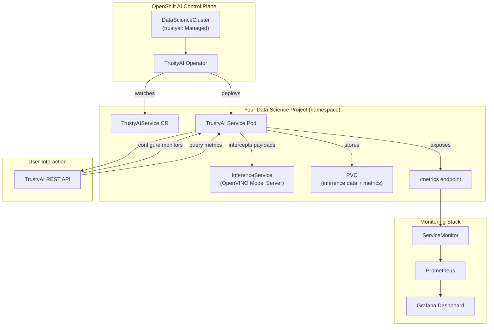
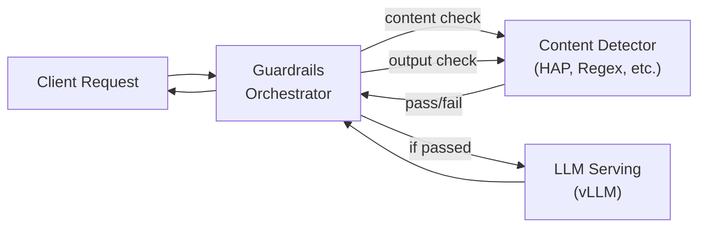

# L2-M5.4 -- TrustyAI Model Monitoring

**Level:** Practitioner
**Duration:** 45 min

## Overview

TrustyAI is OpenShift AI's built-in component for model monitoring -- it provides bias detection, data drift analysis, and explainability for deployed models. If you have worked with fairness toolkits like IBM AI Fairness 360 or drift-detection libraries on vanilla Kubernetes, TrustyAI packages those capabilities as a managed service that integrates directly with the OpenShift AI model serving stack and Prometheus metrics.

In this lesson you will deploy the TrustyAI service, set up a tabular model on OpenVINO Model Server for monitoring, configure bias and drift monitors via the TrustyAI REST API, and view the resulting metrics in Grafana. You will also learn what TrustyAI can and cannot do for LLMs -- an important distinction since bias/drift monitoring requires tabular inference data.

## Prerequisites

- Completed [L2-M5.3 -- OpenTelemetry for Inference](../3_opentelemetry/)
- OpenShift AI cluster with the `trustyai` component enabled in the DataScienceCluster (`managementState: Managed`)
- OpenVINO Model Server runtime available (installed with OpenShift AI by default)
- `oc` CLI authenticated to the cluster
- Python 3.9+ with `requests` library installed (`pip install requests`)
- Basic understanding of model fairness concepts (protected attributes, disparate impact)

## K8s Context

On vanilla Kubernetes, model monitoring for fairness and drift requires assembling multiple pieces yourself:

1. **Fairness libraries** -- AI Fairness 360, Fairlearn, or custom code running in a sidecar or batch job
2. **Drift detection** -- Evidently, NannyML, or custom statistical tests comparing inference data to training baselines
3. **Metrics export** -- custom Prometheus exporters to surface fairness/drift metrics
4. **Alerting** -- manual ServiceMonitor and PrometheusRule configuration

You would typically build a custom monitoring pipeline: capture inference payloads, run them through fairness checks, export metrics, and wire up Grafana dashboards. There is no standard, integrated solution.

OpenShift AI replaces this patchwork with TrustyAI -- a single service that intercepts inference data, computes fairness and drift metrics on a schedule, and exports them as Prometheus metrics automatically.

## Concepts

### TrustyAI Architecture

TrustyAI runs as a service within your data science project namespace. The TrustyAI Operator (part of the `trustyai` component in the DataScienceCluster) watches for `TrustyAIService` CRs and deploys the monitoring service.



TrustyAI works by intercepting inference request/response payloads from models served via KServe (specifically OpenVINO Model Server). It stores this data and computes configured metrics on a schedule, exporting the results as Prometheus metrics.

---

### Bias Detection Metrics

TrustyAI provides two primary bias detection metrics, both computed over a sliding window of inference data:

**Statistical Parity Difference (SPD)** measures the difference in positive outcome rates between a privileged group and an unprivileged group:

```
SPD = P(outcome = favorable | unprivileged) - P(outcome = favorable | privileged)
```

- **SPD = 0** means both groups receive favorable outcomes at exactly the same rate (perfect fairness)
- **SPD < 0** means the unprivileged group receives fewer favorable outcomes (potential bias against them)
- **SPD > 0** means the unprivileged group receives more favorable outcomes
- **Acceptable range:** -0.1 to 0.1 (commonly used threshold)

**Disparate Impact Ratio (DIR)** is the ratio of favorable outcome rates:

```
DIR = P(outcome = favorable | unprivileged) / P(outcome = favorable | privileged)
```

- **DIR = 1.0** means both groups receive favorable outcomes at the same rate
- **DIR < 0.8** is typically considered evidence of disparate impact (the "80% rule")
- **DIR > 1.2** means the unprivileged group is favored
- **Acceptable range:** 0.8 to 1.2

Both metrics require tabular data with clearly defined features, outcomes, and protected attributes. This is why they work for credit scoring, loan approval, hiring, and similar structured prediction models -- but not for LLMs, which produce free-text output without a binary favorable/unfavorable outcome.

---

### Data Drift Detection

TrustyAI detects when the distribution of incoming inference data shifts away from the training data distribution. Three algorithms are available:

| Algorithm | What It Detects | Best For |
|-----------|----------------|----------|
| **MeanShift** | Changes in the mean of feature distributions | Simple, fast detection of gradual drift |
| **FourierMMD** | Distribution differences using Maximum Mean Discrepancy in Fourier space | Complex distribution changes that mean-based methods miss |
| **KSTest** (Kolmogorov-Smirnov) | Any distributional difference via the KS statistic | General-purpose, non-parametric drift detection |

When drift is detected, the metric value exceeds a threshold, triggering alerts via Prometheus alerting rules.

---

### Explainability

TrustyAI supports three explainability methods (accessible via the REST API, not as continuous monitors):

- **LIME** (Local Interpretable Model-agnostic Explanations) -- approximates the model locally with a simple linear model to explain individual predictions
- **SHAP** (SHapley Additive exPlanations) -- uses game-theoretic Shapley values to attribute each feature's contribution to a prediction
- **Counterfactual** -- finds the smallest change to input features that would flip the prediction outcome

These are on-demand explanations, not continuous metrics. You call the TrustyAI API with a specific inference payload and get back an explanation.

---

### What TrustyAI Can and Cannot Do for LLMs

This is a critical distinction. TrustyAI's monitoring capabilities are split across two very different use cases:

| Capability | Tabular Models (OpenVINO) | LLMs (vLLM/other) |
|------------|--------------------------|-------------------|
| Bias detection (SPD, DIR) | Yes -- continuous monitoring | No -- requires structured outcomes |
| Data drift (MeanShift, FourierMMD, KSTest) | Yes -- continuous monitoring | No -- requires fixed-dimension feature vectors |
| Explainability (LIME, SHAP, Counterfactual) | Yes -- on-demand | No -- requires tabular input/output |
| Model quality evaluation | Not applicable | Yes -- via **LMEvalJob** |
| Content safety / guardrails | Not applicable | Yes -- via **Guardrails Orchestrator** |

**For LLMs, TrustyAI provides two separate tools:**

1. **LMEvalJob** (covered in L1-M5.1) -- runs evaluation benchmarks (MMLU, HellaSwag, ARC, etc.) against a served LLM using the EleutherAI `lm-eval-harness` (v0.4.8). This is for periodic quality assessment, not continuous monitoring. You schedule LMEvalJobs to track model quality over time -- for example, re-running benchmarks after each fine-tuning iteration.

2. **Guardrails Orchestrator** -- integrates with NeMo Guardrails to intercept LLM inference requests and apply content safety policies (topic filtering, jailbreak detection, toxicity checks). This runs as a proxy in front of the LLM serving endpoint.

The key takeaway: for LLM observability, use MLflow tracing (L2-M5.2) + LMEvalJob for quality + Guardrails for safety. For tabular model monitoring, use TrustyAI's bias and drift features. This lesson focuses on the tabular model monitoring path.

---

### Prometheus Integration

TrustyAI exposes metrics on a `/metrics` endpoint in Prometheus format. The TrustyAI Operator automatically creates a `ServiceMonitor` so Prometheus scrapes these metrics. Key metric names:

| Metric | Description |
|--------|-------------|
| `trustyai_spd` | Statistical Parity Difference value for each configured monitor |
| `trustyai_dir` | Disparate Impact Ratio value for each configured monitor |
| `trustyai_meanshift` | MeanShift drift statistic |
| `trustyai_fouriermmd` | FourierMMD drift statistic |
| `trustyai_kstest` | Kolmogorov-Smirnov test statistic |

Each metric includes labels for the model name, protected attribute, and outcome variable, so you can build targeted Grafana dashboards and alert rules.

## Step-by-Step

### Step 1: Verify the TrustyAI Component Is Enabled

Confirm the `trustyai` component is set to `Managed` in your DataScienceCluster:

```bash
oc get datasciencecluster default-dsc -o jsonpath='{.spec.components.trustyai.managementState}'
```

Expected output:

```
Managed
```

Also verify the TrustyAI Operator pods are running:

```bash
oc get pods -n redhat-ods-applications -l app.kubernetes.io/name=trustyai-service-operator
```

You should see one or more operator pods in `Running` state.

### Step 2: Create a Data Science Project

Create a dedicated namespace for this lesson:

**Option A: Via the CLI**

```bash
oc new-project trustyai-tutorial
oc label namespace trustyai-tutorial opendatahub.io/dashboard=true
```

**Option B: Via the Dashboard**

1. Open the OpenShift AI dashboard
2. Navigate to **Data Science Projects** in the left sidebar
3. Click **Create data science project**
4. Name it `trustyai-tutorial` and click **Create**

### Step 3: Deploy the TrustyAI Service

The `TrustyAIService` CR tells the TrustyAI Operator to deploy the monitoring service in your namespace. Review the manifest:

```yaml
# manifests/trustyai-service.yaml
apiVersion: trustyai.opendatahub.io/v1alpha1
kind: TrustyAIService
metadata:
  name: trustyai-service
  namespace: trustyai-tutorial
  labels:
    app: trustyai
    tutorial-level: "2"
    tutorial-module: "M5"
spec:
  storage:
    format: PVC
    folder: /data
    size: 1Gi
  data:
    filename: data.csv
    format: CSV
  metrics:
    schedule: 5s
```

This configures:

- **Storage** -- a 1Gi PVC where TrustyAI stores captured inference data
- **Data format** -- CSV storage for inference payloads (the data TrustyAI intercepts from model predictions)
- **Metrics schedule** -- how frequently TrustyAI recomputes bias/drift metrics (every 5 seconds for this tutorial; use a longer interval in production)

Apply the manifest:

```bash
oc apply -f manifests/trustyai-service.yaml
```

Wait for the TrustyAI service pod to become ready:

```bash
oc get pods -n trustyai-tutorial -l app.kubernetes.io/name=trustyai-service -w
```

Expected output after ~30 seconds:

```
NAME                                READY   STATUS    RESTARTS   AGE
trustyai-service-xxxxxxxxxx-xxxxx   1/1     Running   0          30s
```

Verify the TrustyAI service is responding:

```bash
TRUSTYAI_ROUTE=$(oc get route trustyai-service -n trustyai-tutorial -o jsonpath='{.spec.host}')
curl -sk "https://${TRUSTYAI_ROUTE}/info" | python3 -m json.tool
```

The `/info` endpoint returns metadata about what TrustyAI is currently tracking. It will be empty until a model starts serving inferences.

### Step 4: Deploy a Tabular Model on OpenVINO

TrustyAI's bias and drift monitoring requires a tabular model served via OpenVINO Model Server. For this lesson, we deploy a model that predicts income level (>50K or <=50K) based on demographic features -- a classic fairness-sensitive model.

Review the InferenceService manifest:

```yaml
# manifests/openvino-model.yaml
apiVersion: serving.kserve.io/v1beta1
kind: InferenceService
metadata:
  name: income-predictor
  namespace: trustyai-tutorial
  labels:
    app: income-predictor
    tutorial-level: "2"
    tutorial-module: "M5"
  annotations:
    serving.kserve.io/deploymentMode: ModelMesh
spec:
  predictor:
    model:
      modelFormat:
        name: sklearn
      runtime: ovms
      storage:
        key: aws-connection-minio
        path: models/income-predictor/
```

> **Note:** This manifest assumes you have an S3-compatible storage backend configured with a model artifact. If you do not have a pre-trained model available, you can use the setup script (Step 6) which trains a simple scikit-learn model, exports it, and uploads it. Alternatively, you can follow along conceptually and use TrustyAI's data upload API to simulate inference data for monitoring.

Apply the manifest:

```bash
oc apply -f manifests/openvino-model.yaml
```

Wait for the model to become ready:

```bash
oc get inferenceservice income-predictor -n trustyai-tutorial -w
```

Expected output when ready:

```
NAME               URL                                                    READY   AGE
income-predictor   grpc://modelmesh-serving.trustyai-tutorial.svc:8033     True    60s
```

### Step 5: Verify TrustyAI Is Tracking the Model

Once the model has served some inferences, TrustyAI automatically detects it and begins tracking inference data. Check what models TrustyAI sees:

```bash
curl -sk "https://${TRUSTYAI_ROUTE}/info" | python3 -m json.tool
```

Expected output (after at least one inference has been served):

```json
{
  "income-predictor": {
    "data": {
      "inputSchema": {
        "items": {
          "age": "INT32",
          "workclass": "INT32",
          "education-num": "INT32",
          "marital-status": "INT32",
          "occupation": "INT32",
          "relationship": "INT32",
          "race": "INT32",
          "gender": "INT32",
          "capital-gain": "INT32",
          "capital-loss": "INT32",
          "hours-per-week": "INT32"
        }
      },
      "outputSchema": {
        "items": {
          "predict": "INT32"
        }
      },
      "observations": 0
    }
  }
}
```

The schema shows the model's input features (including the `gender` feature we will use as a protected attribute) and the output (`predict` -- 0 for <=50K, 1 for >50K income).

### Step 6: Configure Bias and Drift Monitors

Use the TrustyAI REST API to configure monitoring. The `setup_monitoring.py` script automates this process. Here is what each API call does:

**Configure an SPD monitor** for the `gender` feature:

```bash
curl -sk -X POST "https://${TRUSTYAI_ROUTE}/metrics/spd/request" \
  -H "Content-Type: application/json" \
  -d '{
    "modelId": "income-predictor",
    "protectedAttribute": "gender",
    "favorableOutcome": 1,
    "outcomeName": "predict",
    "privilegedAttribute": 1,
    "unprivilegedAttribute": 0,
    "batchSize": 5000
  }'
```

This tells TrustyAI to compute SPD using:
- `protectedAttribute: gender` -- the feature to check for bias
- `privilegedAttribute: 1` (male), `unprivilegedAttribute: 0` (female)
- `favorableOutcome: 1` -- the "positive" prediction (income >50K)
- `batchSize: 5000` -- compute over the last 5000 inferences

**Configure a DIR monitor** for the same attribute:

```bash
curl -sk -X POST "https://${TRUSTYAI_ROUTE}/metrics/dir/request" \
  -H "Content-Type: application/json" \
  -d '{
    "modelId": "income-predictor",
    "protectedAttribute": "gender",
    "favorableOutcome": 1,
    "outcomeName": "predict",
    "privilegedAttribute": 1,
    "unprivilegedAttribute": 0,
    "batchSize": 5000
  }'
```

**Configure a MeanShift drift monitor:**

```bash
curl -sk -X POST "https://${TRUSTYAI_ROUTE}/metrics/drift/meanshift/request" \
  -H "Content-Type: application/json" \
  -d '{
    "modelId": "income-predictor",
    "referenceTag": "TRAINING"
  }'
```

The `referenceTag: TRAINING` tells TrustyAI to use the initial batch of inference data as the baseline distribution. Subsequent inferences are compared against this baseline.

Now run the full setup script, which configures all monitors and sends sample data:

```bash
export TRUSTYAI_ROUTE=$(oc get route trustyai-service -n trustyai-tutorial -o jsonpath='{.spec.host}')
export MODEL_NAME="income-predictor"

python3 scripts/setup_monitoring.py
```

The script will:
1. Connect to the TrustyAI service
2. Register SPD, DIR, and MeanShift monitors
3. Upload sample inference data (simulating real predictions)
4. Query the current metric values
5. Print the results with explanations

### Step 7: Query Monitoring Results

After the setup script has sent data and configured monitors, query the current metric values:

**Get SPD value:**

```bash
curl -sk "https://${TRUSTYAI_ROUTE}/metrics/spd" | python3 -m json.tool
```

Example response:

```json
{
  "type": "SPD",
  "value": -0.0542,
  "specificDefinition": "The SPD of -0.0542 indicates that the unprivileged group (gender=0) receives the favorable outcome at a rate 5.42% lower than the privileged group (gender=1).",
  "thresholds": {
    "lowerThreshold": -0.1,
    "upperThreshold": 0.1
  },
  "status": "WITHIN_THRESHOLD"
}
```

An SPD of -0.0542 is within the acceptable range (-0.1 to 0.1), meaning the model does not show statistically significant bias for this attribute.

**Get DIR value:**

```bash
curl -sk "https://${TRUSTYAI_ROUTE}/metrics/dir" | python3 -m json.tool
```

Example response:

```json
{
  "type": "DIR",
  "value": 0.8731,
  "specificDefinition": "The DIR of 0.8731 indicates that the unprivileged group (gender=0) receives the favorable outcome at 87.31% of the rate of the privileged group (gender=1).",
  "thresholds": {
    "lowerThreshold": 0.8,
    "upperThreshold": 1.2
  },
  "status": "WITHIN_THRESHOLD"
}
```

A DIR of 0.8731 is above the 0.8 threshold (the "80% rule"), so no disparate impact is detected.

### Step 8: View Metrics in Prometheus and Grafana

TrustyAI exports metrics to Prometheus automatically via a ServiceMonitor. Verify the ServiceMonitor exists:

```bash
oc get servicemonitor -n trustyai-tutorial -l app.kubernetes.io/name=trustyai-service
```

Query TrustyAI metrics directly in Prometheus. Open a port-forward to the Thanos Querier:

```bash
oc port-forward -n openshift-monitoring svc/thanos-querier 9090:9090
```

Then query the metrics:

```promql
trustyai_spd{namespace="trustyai-tutorial"}
trustyai_dir{namespace="trustyai-tutorial"}
trustyai_meanshift{namespace="trustyai-tutorial"}
```

**Viewing in Grafana:**

1. Open the OpenShift web console
2. Navigate to **Observe** > **Dashboards**
3. If you have a Grafana instance deployed, create a new dashboard panel with these queries
4. Alternatively, use the **Observe** > **Metrics** page in the OpenShift console to query TrustyAI metrics directly

A sample PromQL query for a Grafana alert rule:

```promql
# Alert when SPD goes outside acceptable range
abs(trustyai_spd{namespace="trustyai-tutorial"}) > 0.1
```

```promql
# Alert when DIR falls below the 80% rule
trustyai_dir{namespace="trustyai-tutorial"} < 0.8
```

### Step 9: Understanding the LLM Monitoring Landscape

While TrustyAI's bias and drift monitors do not apply to LLMs, the TrustyAI component provides two LLM-relevant tools:

**LMEvalJob** (covered in L1-M5.1) -- schedule periodic evaluations of your served LLMs:

```yaml
apiVersion: trustyai.opendatahub.io/v1alpha1
kind: LMEvalJob
metadata:
  name: quality-check
spec:
  model: local-completions
  taskList:
    taskNames:
      - mmlu
      - hellaswag
  pod:
    container:
      env:
        - name: OPENAI_API_KEY
          value: "not-needed"
```

Use this to track model quality over time -- run benchmarks after each fine-tuning iteration, after model updates, or on a schedule (e.g., weekly).

**Guardrails Orchestrator** -- deploy a proxy in front of your LLM serving endpoint that enforces content safety policies:



The Guardrails Orchestrator intercepts requests before they reach the LLM and responses before they reach the client, applying detectors for harmful content, topic restrictions, and jailbreak attempts. This is distinct from TrustyAI's tabular monitoring but falls under the same "responsible AI" umbrella.

The full monitoring picture for AI workloads on OpenShift AI:

| Concern | Tool | Coverage |
|---------|------|----------|
| Tabular model fairness | TrustyAI bias monitors (SPD, DIR) | Continuous |
| Tabular data drift | TrustyAI drift monitors (MeanShift, FourierMMD, KSTest) | Continuous |
| Tabular explainability | TrustyAI API (LIME, SHAP, Counterfactual) | On-demand |
| LLM quality | LMEvalJob (lm-eval-harness v0.4.8) | Periodic |
| LLM safety | Guardrails Orchestrator (NeMo Guardrails) | Real-time |
| Inference tracing | OpenTelemetry (L2-M5.3) | Continuous |
| Agent tracing | MLflow (L2-M5.2) | Continuous |
| Serving metrics | Prometheus + Grafana (L2-M5.5) | Continuous |

## Verification

Run through this checklist to confirm everything is working:

| Check | Command | Expected Result |
|-------|---------|-----------------|
| TrustyAI pod running | `oc get pods -n trustyai-tutorial -l app.kubernetes.io/name=trustyai-service` | One pod, `Running` |
| TrustyAI route accessible | `curl -sk "https://${TRUSTYAI_ROUTE}/info"` | JSON response with model info |
| Model deployed | `oc get inferenceservice -n trustyai-tutorial` | `income-predictor` with `READY=True` |
| SPD monitor configured | `curl -sk "https://${TRUSTYAI_ROUTE}/metrics/spd"` | JSON with SPD value |
| DIR monitor configured | `curl -sk "https://${TRUSTYAI_ROUTE}/metrics/dir"` | JSON with DIR value |
| ServiceMonitor exists | `oc get servicemonitor -n trustyai-tutorial -l app.kubernetes.io/name=trustyai-service` | One ServiceMonitor |
| Prometheus has metrics | Query `trustyai_spd` in Prometheus UI | Time series data present |

## K8s vs OpenShift AI Comparison

| Aspect | Kubernetes | OpenShift AI |
|--------|-----------|--------------|
| Bias detection | Build custom pipeline with AI Fairness 360 or Fairlearn | TrustyAI provides SPD and DIR as managed metrics |
| Drift detection | Deploy Evidently, NannyML, or custom code | TrustyAI provides MeanShift, FourierMMD, KSTest |
| Explainability | Run LIME/SHAP in custom jobs | TrustyAI REST API provides on-demand explanations |
| Metrics export | Write custom Prometheus exporters | TrustyAI auto-exports to Prometheus via ServiceMonitor |
| Deployment | Deploy and manage monitoring services yourself | One `TrustyAIService` CR deploys everything |
| LLM evaluation | Run lm-eval-harness manually | LMEvalJob CRD with operator management |
| Content safety | Integrate guardrails frameworks manually | Guardrails Orchestrator as managed proxy |
| Integration | Wire together monitoring, serving, and alerting manually | All components share Prometheus, Grafana, and the OpenShift AI dashboard |

## Key Takeaways

- **TrustyAI** is OpenShift AI's responsible AI component -- it provides bias detection, drift monitoring, and explainability as a managed service
- **Bias metrics (SPD, DIR) and drift detection require tabular models** served on OpenVINO Model Server -- they do not work with LLMs, which produce unstructured text output
- **SPD** measures the difference in favorable outcome rates between groups (acceptable range: -0.1 to 0.1); **DIR** measures the ratio (acceptable range: 0.8 to 1.2)
- **For LLMs**, use **LMEvalJob** for periodic quality benchmarking and **Guardrails Orchestrator** for real-time content safety -- these are separate TrustyAI features
- **Prometheus integration** is automatic -- TrustyAI exports `trustyai_spd`, `trustyai_dir`, and drift metrics via a ServiceMonitor, making them available in Grafana dashboards and alerting rules
- **The full responsible AI picture** combines TrustyAI (tabular monitoring) + LMEvalJob (LLM quality) + Guardrails (LLM safety) + MLflow (tracing) + OpenTelemetry (inference tracing)

## Cleanup

```bash
# Delete the TrustyAI service
oc delete trustyaiservice trustyai-service -n trustyai-tutorial

# Delete the model
oc delete inferenceservice income-predictor -n trustyai-tutorial

# Delete all tutorial resources by label
oc delete all -l tutorial-level=2,tutorial-module=M5 -n trustyai-tutorial

# Delete the project entirely (optional -- you may want to keep it for L2-M5.5)
# oc delete project trustyai-tutorial
```

> **Note:** Keep the project if you plan to continue directly to L2-M5.5.

## Next Steps

In the next lesson, [L2-M5.5 -- Production Dashboards](../5_production_dashboards/), you will build a unified Grafana dashboard that combines vLLM serving metrics, GPU utilization, TrustyAI fairness metrics, pipeline execution status, and agent performance data into a single pane of glass for production AI workload monitoring. You will also configure alert rules for key SLOs.
