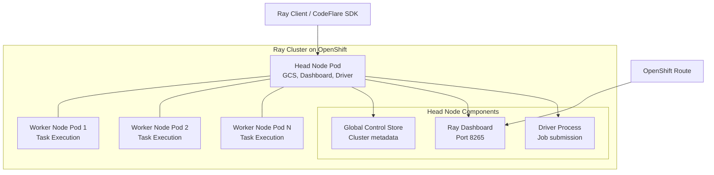
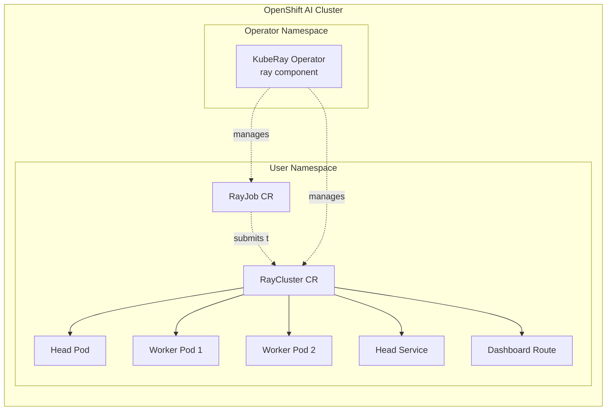

# L2-M6.1 -- KubeRay and Ray Clusters

**Level:** Practitioner
**Duration:** 45 min

## Overview

Ray is the leading distributed computing framework for ML workloads -- parallel data processing, hyperparameter tuning, distributed training, and scalable inference. KubeRay is the Kubernetes operator that manages Ray clusters as native custom resources. On OpenShift AI, KubeRay is deployed as a Tier 1 DSC component (`ray`), giving you operator-managed Ray clusters with auto-scaling, GPU allocation, and dashboard access out of the box.

This lesson deploys a Ray cluster on OpenShift AI, submits a distributed document processing job using Ray Data, and explores the Ray dashboard. You will work with the RayCluster and RayJob CRDs directly, and see how the CodeFlare SDK provides a Python interface for managing Ray clusters from Jupyter workbenches.

## Prerequisites

- Completed: Level 1 of this OpenShift AI tutorial (all modules)
- OpenShift cluster running with `oc` CLI authenticated
- The `ray` component set to `Managed` in the `DataScienceCluster` CR
- Familiarity with Python and basic distributed computing concepts

## K8s Context

On vanilla Kubernetes, deploying Ray requires installing the KubeRay operator manually via Helm charts, writing your own `RayCluster` YAML from scratch, and configuring Ingress or port-forwarding to reach the Ray dashboard. There is no operator integration with a broader ML platform -- you manage Ray clusters as standalone infrastructure. GPU allocation relies on the standard Kubernetes device plugin mechanism, but there is no unified resource quota system that spans both Ray clusters and other ML workloads.

OpenShift AI integrates KubeRay as a platform component: the operator is deployed via the `DataScienceCluster` CR, the Ray dashboard is automatically exposed via an OpenShift Route, and the CodeFlare SDK provides a Python interface for managing Ray clusters from within Jupyter workbenches -- the same environment where data scientists already work.

## Concepts

### Ray Architecture

Ray is a general-purpose distributed computing framework built around three core ideas: tasks (remote function execution), actors (stateful remote objects), and objects (shared distributed memory). These primitives power the higher-level libraries that data scientists actually use:

| Library | Purpose | Example Use Case |
|---------|---------|------------------|
| **Ray Data** | Distributed data processing and loading | Parallel document processing, ETL pipelines, data preprocessing for training |
| **Ray Tune** | Hyperparameter optimization | Distributed grid search, Bayesian optimization, population-based training |
| **Ray Train** | Distributed model training | Multi-GPU training with PyTorch, TensorFlow, or Hugging Face |
| **Ray Serve** | Scalable model serving | Online inference with auto-scaling, model composition, A/B testing |

A Ray cluster consists of two node types:



- **Head node** -- runs the Global Control Store (GCS) for cluster metadata, the Ray dashboard for monitoring, and the driver process for job submission. There is exactly one head node per cluster.
- **Worker nodes** -- execute tasks and actors. You can define multiple worker groups with different resource profiles (e.g., one CPU-only group and one GPU group). Worker nodes register with the head node at startup.

---

### KubeRay Operator and CRDs

The KubeRay operator (version 1.4.2 on OpenShift AI) manages Ray clusters through three custom resource definitions:

| CRD | Purpose | Lifecycle |
|-----|---------|-----------|
| **RayCluster** | Deploys and manages a long-running Ray cluster (head + worker nodes) | Persistent -- cluster stays running until you delete the CR |
| **RayJob** | Submits a job to a Ray cluster (existing or auto-created) | Ephemeral -- cluster can be auto-deleted after job completion |
| **RayService** | Deploys a Ray Serve application for inference | Persistent -- manages rolling updates of Serve deployments |

The operator watches for these CRDs and creates the underlying Kubernetes resources (Pods, Services, head-node Service for GCS, etc.) automatically. On OpenShift AI, it also creates a Route to expose the Ray dashboard.



---

### CodeFlare SDK

The CodeFlare SDK is a Python library (`codeflare-sdk`) that provides a higher-level interface for creating and managing Ray clusters from within Jupyter workbenches. Instead of writing YAML manifests, you define a `ClusterConfiguration` in Python:

```python
from codeflare_sdk import ClusterConfiguration, Cluster

cluster = Cluster(ClusterConfiguration(
    name="my-ray-cluster",
    namespace="my-project",
    num_workers=2,
    worker_cpu_requests=1,
    worker_cpu_limits=2,
    worker_memory_requests="4Gi",
    worker_memory_limits="8Gi",
    # GPU allocation for workers
    # worker_extended_resource_requests={"nvidia.com/gpu": 1},
))

cluster.up()        # Creates the RayCluster CR
cluster.wait_ready()  # Blocks until all workers are running
cluster.details()   # Shows cluster connection info
```

The SDK is pre-installed in OpenShift AI workbench images. It creates the same `RayCluster` CR that you would write in YAML -- the SDK is a convenience layer, not a separate system. Everything you can do with the SDK, you can also do with `oc apply -f raycluster.yaml`.

---

### Auto-Scaling Ray Clusters

Ray clusters on OpenShift AI support auto-scaling through the KubeRay operator. You configure scaling bounds on each worker group:

```yaml
workerGroupSpecs:
  - groupName: default-worker
    replicas: 1          # Initial number of workers
    minReplicas: 1       # Minimum workers (scale-in floor)
    maxReplicas: 5       # Maximum workers (scale-out ceiling)
```

The Ray autoscaler (running on the head node) monitors resource demand -- when tasks queue up because all workers are busy, it requests additional workers from the KubeRay operator. When workers are idle, it scales them down. The operator creates or deletes worker pods accordingly.

Key auto-scaling behaviors:

| Behavior | Description |
|----------|-------------|
| **Scale-out trigger** | Pending tasks or actors that cannot be scheduled on existing workers |
| **Scale-in trigger** | Workers idle for a configurable period (default: 60 seconds) |
| **Scale-to-zero** | Set `minReplicas: 0` on worker groups (head node always runs) |
| **GPU-aware scaling** | Workers requesting GPUs only scale up when GPU nodes are available |

---

### GPU Allocation

To allocate GPUs to Ray worker nodes, request them in the worker group's resource specification:

```yaml
workerGroupSpecs:
  - groupName: gpu-workers
    replicas: 1
    minReplicas: 0
    maxReplicas: 4
    template:
      spec:
        containers:
          - name: ray-worker
            resources:
              requests:
                cpu: "2"
                memory: "8Gi"
                nvidia.com/gpu: "1"    # Request one NVIDIA GPU per worker
              limits:
                cpu: "4"
                memory: "16Gi"
                nvidia.com/gpu: "1"
```

On OpenShift AI, GPU allocation integrates with the NVIDIA GPU Operator and the Node Feature Discovery (NFD) operator, which are typically pre-configured on clusters with GPU nodes. The KubeRay operator does not manage GPU drivers -- it relies on the Kubernetes device plugin mechanism.

## Step-by-Step

### Step 1: Verify the KubeRay Operator

Confirm that the `ray` component is active in the `DataScienceCluster`:

```bash
oc get datasciencecluster default-dsc -o jsonpath='{.spec.components.ray.managementState}'
```

Expected output:

```
Managed
```

Check that the KubeRay operator pod is running:

```bash
oc get pods -n redhat-ods-applications -l app.kubernetes.io/name=kuberay-operator
```

Expected output (pod name will differ):

```
NAME                                READY   STATUS    RESTARTS   AGE
kuberay-operator-abc123-xyz         1/1     Running   0          3d
```

Verify the KubeRay CRDs are registered:

```bash
oc api-resources | grep ray
```

Expected output:

```
rayclusters         rcl     ray.io/v1    true    RayCluster
rayjobs             rjob    ray.io/v1    true    RayJob
rayservices         rsvc    ray.io/v1    true    RayService
```

### Step 2: Create the Project Namespace

Create a dedicated namespace for Ray workloads:

```bash
oc new-project ray-demo --display-name="Ray Distributed Computing"
```

Expected output:

```
Now using project "ray-demo" on server "https://api.<cluster>:6443".
```

### Step 3: Deploy a RayCluster

Apply the RayCluster manifest from this lesson's `manifests/` directory:

```bash
oc apply -f manifests/raycluster.yaml
```

Expected output:

```
raycluster.ray.io/ray-demo-cluster created
```

Watch the pods come up -- the head node starts first, then the workers:

```bash
oc get pods -w -l ray.io/cluster=ray-demo-cluster
```

Expected output (wait until all pods show `Running`):

```
NAME                                         READY   STATUS    RESTARTS   AGE
ray-demo-cluster-head-xxxxx                  1/1     Running   0          45s
ray-demo-cluster-worker-default-xxxxx        1/1     Running   0          30s
ray-demo-cluster-worker-default-yyyyy        1/1     Running   0          30s
```

Press `Ctrl+C` to stop watching once all pods are running.

Verify the RayCluster status:

```bash
oc get raycluster ray-demo-cluster -o jsonpath='{.status.state}'
```

Expected output:

```
ready
```

### Step 4: Access the Ray Dashboard

The KubeRay operator creates a Service for the head node. On OpenShift AI, a Route is typically auto-created for dashboard access. Check for it:

```bash
oc get route -l ray.io/cluster=ray-demo-cluster
```

If a Route exists, get its URL:

```bash
oc get route ray-demo-cluster-head-svc -o jsonpath='{.spec.host}'
```

If no Route was auto-created, create one manually:

```bash
oc create route edge ray-dashboard \
  --service=ray-demo-cluster-head-svc \
  --port=dashboard
```

Then retrieve the dashboard URL:

```bash
echo "https://$(oc get route ray-dashboard -o jsonpath='{.spec.host}')"
```

Open the URL in your browser. The Ray dashboard shows:

- **Cluster overview** -- node count, resource usage (CPU, memory, GPU)
- **Jobs** -- submitted jobs and their status
- **Actors** -- running actors across the cluster
- **Logs** -- aggregated logs from all nodes

### Step 5: Submit a Distributed Job via RayJob

The `RayJob` CRD submits a job to an existing Ray cluster. Apply the RayJob manifest:

```bash
oc apply -f manifests/rayjob.yaml
```

Expected output:

```
rayjob.ray.io/doc-processing-job created
```

Monitor the job status:

```bash
oc get rayjob doc-processing-job -o jsonpath='{.status.jobStatus}'
```

Expected output (progresses through states):

```
RUNNING
```

Wait for the job to complete:

```bash
oc wait --for=jsonpath='{.status.jobStatus}'=SUCCEEDED rayjob/doc-processing-job --timeout=300s
```

Expected output:

```
rayjob.ray.io/doc-processing-job condition met
```

View the job logs from the head node:

```bash
oc logs -l ray.io/cluster=ray-demo-cluster,ray.io/node-type=head --tail=50
```

The logs will show the distributed document processing output -- word counts, processing times, and the number of documents processed across workers.

### Step 6: Run the Python Script Directly

For more interactive work, you can run the Ray Data processing script by connecting to the head node:

```bash
oc cp scripts/ray_processing.py ray-demo-cluster-head-xxxxx:/tmp/ray_processing.py
```

Replace `ray-demo-cluster-head-xxxxx` with your actual head pod name. Find it with:

```bash
HEAD_POD=$(oc get pods -l ray.io/cluster=ray-demo-cluster,ray.io/node-type=head -o jsonpath='{.items[0].metadata.name}')
oc cp scripts/ray_processing.py ${HEAD_POD}:/tmp/ray_processing.py
```

Execute the script on the head node:

```bash
oc exec ${HEAD_POD} -- python /tmp/ray_processing.py
```

Expected output:

```
============================================================
Ray Data -- Distributed Document Processing
============================================================

Ray cluster resources: {'CPU': 6.0, 'memory': ...}
Available nodes: 3

--- Generating 200 sample documents ---
Generated 200 documents across 5 topics

--- Creating Ray Dataset ---
Dataset count: 200

--- Processing documents (distributed across workers) ---

Processing completed in 4.32 seconds

--- Processing Summary ---
  Total documents processed: 200
  Total chunks created:      400
  Average chunks per doc:    2.0
  Total words processed:     120,000
  Total unique words:        8,400
  Throughput:                46.3 docs/sec

--- Per-Topic Breakdown ---
  machine learning model training and optimization   docs= 40  words=24,000  chunks= 80
  distributed computing architectures and fault to   docs= 40  words=24,000  chunks= 80
  ...

--- Sample Result (doc_id=doc-0000) ---
  Topic:           machine learning model training and optimization techniques
  Original length: 5,890 chars
  Cleaned length:  5,200 chars
  ...

============================================================
Done. Ray cluster connection closed.
============================================================
```

### Step 7: Observe Cluster Activity in the Dashboard

While the job runs (or after it completes), return to the Ray dashboard:

1. Click the **Jobs** tab -- you should see the `doc-processing-job` with its status, duration, and logs.
2. Click the **Cluster** tab -- observe CPU and memory utilization across head and worker nodes.
3. Click the **Logs** tab -- view aggregated logs from all nodes in the cluster.

The dashboard confirms that work was distributed across the worker nodes, not executed on the head node alone.

### Step 8: Explore Auto-Scaling (Optional)

To observe auto-scaling, modify the RayCluster to allow scale-out:

```bash
oc patch raycluster ray-demo-cluster --type=merge -p '{
  "spec": {
    "workerGroupSpecs": [{
      "groupName": "default-worker",
      "replicas": 1,
      "minReplicas": 1,
      "maxReplicas": 4
    }]
  }
}'
```

Then submit a resource-intensive job that demands more workers. The Ray autoscaler on the head node will detect pending tasks and request additional worker pods from the KubeRay operator. Watch the pods:

```bash
oc get pods -w -l ray.io/cluster=ray-demo-cluster
```

You should see new worker pods created (up to the `maxReplicas` limit) and then removed after the workload completes and workers become idle.

## Verification

Confirm you have completed the following:

1. KubeRay operator is running:

```bash
oc get pods -n redhat-ods-applications -l app.kubernetes.io/name=kuberay-operator --no-headers | wc -l
```

Expected: `1` (or more).

2. KubeRay CRDs are registered:

```bash
oc get crd | grep -c "ray.io"
```

Expected: `3` (rayclusters, rayjobs, rayservices).

3. RayCluster is in `ready` state:

```bash
oc get raycluster ray-demo-cluster -o jsonpath='{.status.state}'
```

Expected: `ready`.

4. All Ray pods are running:

```bash
oc get pods -l ray.io/cluster=ray-demo-cluster --no-headers | grep -c "Running"
```

Expected: `3` (1 head + 2 workers).

5. RayJob completed successfully:

```bash
oc get rayjob doc-processing-job -o jsonpath='{.status.jobStatus}'
```

Expected: `SUCCEEDED`.

6. Ray dashboard is accessible:

```bash
oc get route -l ray.io/cluster=ray-demo-cluster --no-headers | wc -l
```

Expected: `1` (or check the manually created route).

## K8s vs OpenShift AI Comparison

| Aspect | Kubernetes (KubeRay standalone) | OpenShift AI |
|--------|--------------------------------|--------------|
| **Operator installation** | Install KubeRay via Helm chart, manage upgrades yourself | Enable `ray: Managed` in the DSC -- operator deployed and upgraded by the platform |
| **Dashboard access** | Manual Ingress or port-forwarding (`kubectl port-forward`) | Route auto-created or easily created with `oc create route edge` |
| **Resource quotas** | Standard K8s ResourceQuotas only | Integrates with Kueue for ML-aware job queuing and fair-sharing (L2-M6.2) |
| **GPU handling** | Install NVIDIA device plugin and GPU operator manually | NVIDIA GPU Operator and NFD typically pre-configured on OpenShift AI clusters |
| **SDK integration** | No built-in SDK -- use `ray` CLI or raw YAML | CodeFlare SDK pre-installed in workbench images -- create clusters from Python |
| **Monitoring** | Set up Prometheus scraping and Grafana dashboards manually | Platform monitoring stack auto-discovers Ray metrics via ServiceMonitor |
| **Authentication** | No built-in auth for the dashboard | OpenShift OAuth proxy can be added to the dashboard Route |
| **Multi-tenancy** | Manual RBAC configuration | Projects (namespaces) with default RBAC, Kueue quotas for resource isolation |

## Key Takeaways

- **KubeRay is a DSC component.** Enable the `ray` component in the `DataScienceCluster` CR to deploy the KubeRay operator (v1.4.2). No Helm charts or manual installation required.
- **Three CRDs cover all Ray use cases.** `RayCluster` for long-running clusters, `RayJob` for batch jobs (with optional auto-created clusters), and `RayService` for scalable inference with Ray Serve.
- **CodeFlare SDK bridges workbenches and Ray.** Data scientists can create and manage Ray clusters from Jupyter notebooks using Python -- no YAML authoring needed for interactive workflows.
- **Auto-scaling is built in.** Configure `minReplicas` and `maxReplicas` on worker groups. The Ray autoscaler monitors task demand and the KubeRay operator creates or removes worker pods automatically.
- **Ray Data distributes processing across workers.** The `ray_processing.py` script demonstrates parallel document processing -- the same pattern applies to any embarrassingly parallel workload (ETL, feature engineering, batch inference).
- **GPU allocation uses standard Kubernetes device plugins.** Request `nvidia.com/gpu` in worker node resources. The KubeRay operator schedules workers on GPU nodes automatically.

## Cleanup

Remove all resources created in this lesson:

```bash
# Delete the RayJob (if not already completed and cleaned up)
oc delete rayjob doc-processing-job --ignore-not-found

# Delete the RayCluster (also removes head and worker pods)
oc delete raycluster ray-demo-cluster

# Delete the manually created Route (if applicable)
oc delete route ray-dashboard --ignore-not-found

# Delete the project
oc delete project ray-demo
```

Verify cleanup:

```bash
oc get rayclusters --all-namespaces --no-headers 2>/dev/null | wc -l
```

Expected: `0` (no Ray clusters remaining).

## Next Steps

In [L2-M6.2 -- Kueue: Job Queuing and Quota Management](../2_kueue/), you will learn how Kueue provides cluster-level job queuing, resource quotas, and fair-sharing for distributed workloads -- including Ray jobs. Kueue ensures that multiple teams can share GPU resources without one team monopolizing the cluster.
