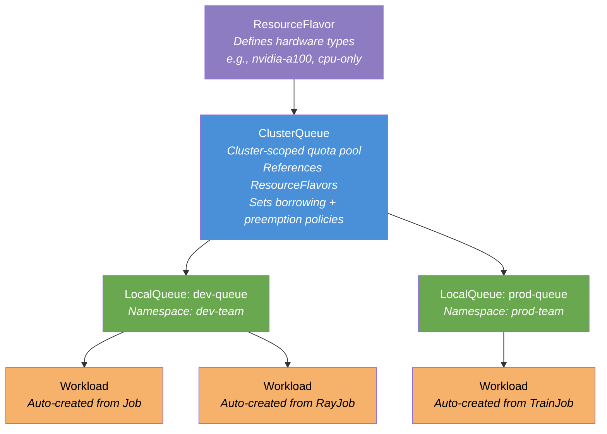
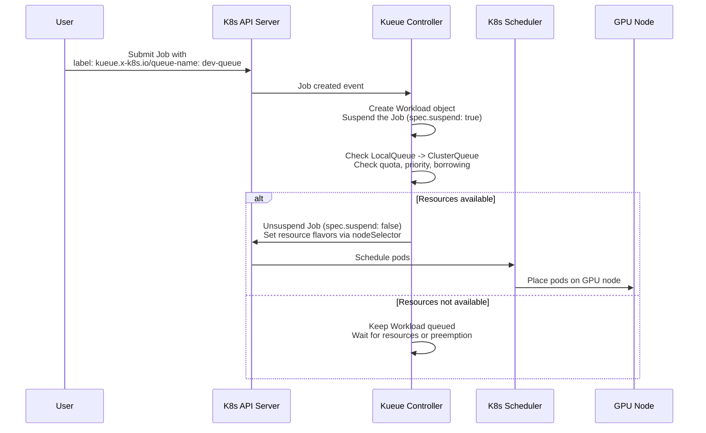

# L2-M6.2 --- Kueue: Job Queuing and Quota Management

**Level:** Practitioner
**Duration:** 30 min

## Overview

When multiple teams share a GPU cluster, first-come-first-served scheduling wastes expensive hardware. One team can monopolize all GPUs while another waits indefinitely. Kueue solves this by adding fair-sharing, quotas, priorities, and borrowing to the Kubernetes job scheduling model. In this lesson you will configure Kueue on OpenShift AI with two queues (dev and prod), set GPU quotas per team, and observe priority-based scheduling in action.

## Prerequisites

- Completed: L2-M6.1 (KubeRay and Ray Clusters)
- OpenShift AI cluster with `kueue` component set to `Managed` in the DataScienceCluster CR
- Cluster-admin access (Kueue CRDs are cluster-scoped)
- Familiarity with Kubernetes Jobs and resource quotas

## K8s Context

On vanilla Kubernetes, GPU scheduling is first-come-first-served. If a team submits a training job requesting 4 GPUs and the cluster has 4 GPUs free, that job gets them all --- even if another team has been waiting longer. Kubernetes `ResourceQuota` can cap usage per namespace, but it rejects jobs that exceed the quota rather than queuing them. There is no built-in concept of fair sharing, borrowing idle capacity, or priority-based preemption.

Kueue is an upstream Kubernetes SIG-Scheduling project that adds these capabilities. On vanilla K8s, you install Kueue manually via Helm or kubectl. On OpenShift AI, Kueue is a managed DSC component --- you enable it by setting `kueue: Managed` in the DataScienceCluster CR, and the operator handles deployment and lifecycle.

## Concepts

### The Kueue Resource Hierarchy

Kueue introduces four custom resources that form a hierarchy from hardware definition down to individual workloads:



| Resource | Scope | Purpose |
|----------|-------|---------|
| **ResourceFlavor** | Cluster | Defines a type of hardware (e.g., `nvidia-a100`, `nvidia-t4`, `cpu-only`). Maps to node labels so Kueue knows what physical resources are available. |
| **ClusterQueue** | Cluster | A quota pool that references one or more ResourceFlavors and defines total resource limits. Configures borrowing limits, lending limits, and preemption policies. |
| **LocalQueue** | Namespace | Connects a namespace to a ClusterQueue. Users submit workloads to LocalQueues --- they never interact with ClusterQueues directly. |
| **Workload** | Namespace | Created automatically when a job (K8s Job, RayJob, TrainJob) is submitted with the `kueue.x-k8s.io/queue-name` label. Represents a single unit of work in the queue. |

### How Jobs Enter the Queue

Users do not create Workload objects directly. Instead, they add the label `kueue.x-k8s.io/queue-name: <localqueue-name>` to their Job, RayJob, or TrainJob. Kueue's admission controller intercepts the job, creates a Workload object, and suspends the job until resources are available:



### Priority Classes

Kueue uses `WorkloadPriorityClass` to determine scheduling order. Higher-priority workloads are admitted before lower-priority ones, and can preempt them if preemption is enabled:

| Priority Class | Value | Use Case |
|---------------|-------|----------|
| `production-critical` | 1000 | Production inference, customer-facing jobs |
| `training-high` | 500 | Scheduled training runs, deadline-driven experiments |
| `training-default` | 100 | Regular training and experimentation |
| `development` | 10 | Interactive development, notebook jobs |

### Borrowing and Lending

When a team's ClusterQueue has idle capacity, other teams can borrow it:

- **borrowingLimit** --- Maximum resources a ClusterQueue can borrow from the cohort (group of ClusterQueues that share resources).
- **lendingLimit** --- Maximum resources a ClusterQueue will lend to other queues in the cohort. If not set, all unused resources are available for borrowing.

A **cohort** is a named group of ClusterQueues. ClusterQueues in the same cohort can borrow and lend resources among themselves.

### Preemption Policies

When a high-priority workload arrives and no resources are free, Kueue can preempt lower-priority workloads. The ClusterQueue's `preemption` field controls this:

| Policy | Behavior |
|--------|----------|
| `withinClusterQueue: LowerPriority` | Preempt lower-priority workloads in the same ClusterQueue |
| `withinClusterQueue: Never` | Never preempt within the same queue |
| `reclaimWithinCohort: Any` | Reclaim resources lent to other queues, preempting any workload |
| `reclaimWithinCohort: LowerPriority` | Reclaim only if the borrowing workload has lower priority |
| `reclaimWithinCohort: Never` | Never reclaim lent resources |
| `borrowWithinCohort.policy: LowerPriority` | Borrow from other queues only if the workload to preempt has lower priority |
| `borrowWithinCohort.policy: Never` | Never borrow by preempting |

### Integration with Distributed Training Frameworks

Kueue integrates with the workload types you use in this module:

| Framework | Job Type | How Kueue Integrates |
|-----------|----------|---------------------|
| Kubernetes | `batch/v1 Job` | Native support --- add `kueue.x-k8s.io/queue-name` label |
| KubeRay (L2-M6.1) | `RayJob`, `RayCluster` | Kueue manages the RayJob lifecycle --- suspends/unsuspends the RayCluster |
| Kubeflow Trainer (L2-M6.3) | `TrainJob` | Kueue manages TrainJob admission --- the entire distributed training job is queued as a single unit |

## Step-by-Step

### Step 1: Verify the Kueue Component

Confirm that the `kueue` component is set to `Managed` in the DataScienceCluster CR:

```bash
oc get datasciencecluster default-dsc -o jsonpath='{.spec.components.kueue.managementState}'
```

Expected output:

```
Managed
```

Verify that the Kueue controller pods are running:

```bash
oc get pods -n redhat-ods-applications -l app.kubernetes.io/name=kueue
```

Expected output:

```
NAME                                        READY   STATUS    RESTARTS   AGE
kueue-controller-manager-6b8d9f7c4d-xxxxx   1/1     Running   0          5m
```

Check available Kueue CRDs:

```bash
oc get crd | grep kueue
```

Expected output:

```
clusterqueues.kueue.x-k8s.io                   2025-01-15T10:00:00Z
localqueues.kueue.x-k8s.io                     2025-01-15T10:00:00Z
resourceflavors.kueue.x-k8s.io                 2025-01-15T10:00:00Z
workloads.kueue.x-k8s.io                       2025-01-15T10:00:00Z
workloadpriorityclass.kueue.x-k8s.io           2025-01-15T10:00:00Z
```

### Step 2: Create a ResourceFlavor

A ResourceFlavor defines a type of hardware available in the cluster. Create a flavor for GPU nodes and one for CPU-only nodes:

```yaml
# manifests/resourceflavor.yaml
apiVersion: kueue.x-k8s.io/v1beta1
kind: ResourceFlavor
metadata:
  name: gpu-nvidia
  labels:
    tutorial-level: "2"
    tutorial-module: "M6"
spec:
  # nodeLabels maps this flavor to nodes with specific hardware.
  # Kueue uses these labels to set nodeSelector on admitted workloads.
  nodeLabels:
    nvidia.com/gpu.present: "true"
---
apiVersion: kueue.x-k8s.io/v1beta1
kind: ResourceFlavor
metadata:
  name: cpu-only
  labels:
    tutorial-level: "2"
    tutorial-module: "M6"
spec:
  # No nodeLabels --- matches any node without GPU requirements.
  nodeLabels: {}
```

Apply the ResourceFlavors:

```bash
oc apply -f manifests/resourceflavor.yaml
```

Expected output:

```
resourceflavor.kueue.x-k8s.io/gpu-nvidia created
resourceflavor.kueue.x-k8s.io/cpu-only created
```

Verify:

```bash
oc get resourceflavors
```

Expected output:

```
NAME         AGE
gpu-nvidia   5s
cpu-only     5s
```

### Step 3: Create WorkloadPriorityClasses

Define priority levels for workloads. Higher values mean higher priority:

```bash
oc apply -f - <<'EOF'
apiVersion: kueue.x-k8s.io/v1beta1
kind: WorkloadPriorityClass
metadata:
  name: production-critical
value: 1000
description: "Production inference and customer-facing jobs"
---
apiVersion: kueue.x-k8s.io/v1beta1
kind: WorkloadPriorityClass
metadata:
  name: training-high
value: 500
description: "Scheduled training runs with deadlines"
---
apiVersion: kueue.x-k8s.io/v1beta1
kind: WorkloadPriorityClass
metadata:
  name: training-default
value: 100
description: "Regular training and experimentation"
---
apiVersion: kueue.x-k8s.io/v1beta1
kind: WorkloadPriorityClass
metadata:
  name: development
value: 10
description: "Interactive development and notebook jobs"
EOF
```

Expected output:

```
workloadpriorityclass.kueue.x-k8s.io/production-critical created
workloadpriorityclass.kueue.x-k8s.io/training-high created
workloadpriorityclass.kueue.x-k8s.io/training-default created
workloadpriorityclass.kueue.x-k8s.io/development created
```

### Step 4: Create the ClusterQueue

The ClusterQueue defines the total resource pool, borrowing/lending limits, and preemption policies. This queue allocates GPU and CPU resources across the `gpu-sharing` cohort:

```yaml
# manifests/clusterqueue.yaml
apiVersion: kueue.x-k8s.io/v1beta1
kind: ClusterQueue
metadata:
  name: gpu-cluster-queue
  labels:
    tutorial-level: "2"
    tutorial-module: "M6"
spec:
  # Cohort groups ClusterQueues that can borrow/lend resources.
  # All ClusterQueues in the same cohort share a resource pool.
  cohort: gpu-sharing

  # queueingStrategy determines the order workloads are admitted.
  # BestEffortFIFO admits workloads in FIFO order but allows
  # later workloads to be admitted if earlier ones cannot fit.
  queueingStrategy: BestEffortFIFO

  # resourceGroups define quotas per ResourceFlavor.
  resourceGroups:
    - coveredResources: ["cpu", "memory", "nvidia.com/gpu"]
      flavors:
        - name: gpu-nvidia
          resources:
            - name: "cpu"
              nominalQuota: 16        # 16 CPU cores total
              borrowingLimit: 8       # Can borrow up to 8 more from cohort
              lendingLimit: 8         # Will lend up to 8 idle cores
            - name: "memory"
              nominalQuota: 64Gi      # 64 GiB total
              borrowingLimit: 32Gi
              lendingLimit: 32Gi
            - name: "nvidia.com/gpu"
              nominalQuota: 4         # 4 GPUs total
              borrowingLimit: 2       # Can borrow up to 2 GPUs from cohort
              lendingLimit: 2         # Will lend up to 2 idle GPUs
        - name: cpu-only
          resources:
            - name: "cpu"
              nominalQuota: 32
            - name: "memory"
              nominalQuota: 128Gi

  # preemption controls how high-priority workloads can evict lower-priority ones.
  preemption:
    withinClusterQueue: LowerPriority        # Can preempt lower-priority jobs in this queue
    reclaimWithinCohort: LowerPriority       # Can reclaim lent resources if borrower has lower priority
    borrowWithinCohort:
      policy: LowerPriority                  # Can borrow by preempting lower-priority jobs in cohort
      maxPriorityThreshold: 100              # Only preempt workloads at or below priority 100
```

Apply the ClusterQueue:

```bash
oc apply -f manifests/clusterqueue.yaml
```

Expected output:

```
clusterqueue.kueue.x-k8s.io/gpu-cluster-queue created
```

Verify the ClusterQueue status:

```bash
oc get clusterqueue gpu-cluster-queue -o wide
```

Expected output:

```
NAME                COHORT        PENDING WORKLOADS   ADMITTED WORKLOADS   AGE
gpu-cluster-queue   gpu-sharing   0                   0                    5s
```

### Step 5: Create Team Namespaces and LocalQueues

Create separate namespaces for the dev and prod teams, then create LocalQueues that connect each namespace to the ClusterQueue.

Create the namespaces:

```bash
oc new-project dev-team --display-name="Dev Team GPU Workloads"
oc new-project prod-team --display-name="Prod Team GPU Workloads"
```

Create the dev team LocalQueue:

```yaml
# manifests/localqueue-dev.yaml
apiVersion: kueue.x-k8s.io/v1beta1
kind: LocalQueue
metadata:
  name: dev-queue
  namespace: dev-team
  labels:
    tutorial-level: "2"
    tutorial-module: "M6"
spec:
  # clusterQueue links this LocalQueue to the cluster-scoped quota pool.
  # All workloads submitted to dev-queue consume quota from gpu-cluster-queue.
  clusterQueue: gpu-cluster-queue
```

Create the prod team LocalQueue:

```yaml
# manifests/localqueue-prod.yaml
apiVersion: kueue.x-k8s.io/v1beta1
kind: LocalQueue
metadata:
  name: prod-queue
  namespace: prod-team
  labels:
    tutorial-level: "2"
    tutorial-module: "M6"
spec:
  clusterQueue: gpu-cluster-queue
```

Apply both LocalQueues:

```bash
oc apply -f manifests/localqueue-dev.yaml
oc apply -f manifests/localqueue-prod.yaml
```

Expected output:

```
localqueue.kueue.x-k8s.io/dev-queue created
localqueue.kueue.x-k8s.io/prod-queue created
```

Verify the LocalQueues:

```bash
oc get localqueues -A
```

Expected output:

```
NAMESPACE   NAME         CLUSTERQUEUE        PENDING WORKLOADS   ADMITTED WORKLOADS
dev-team    dev-queue    gpu-cluster-queue    0                   0
prod-team   prod-queue   gpu-cluster-queue    0                   0
```

### Step 6: Submit Test Jobs with Different Priorities

Submit a low-priority development job to the dev queue:

```bash
oc apply -n dev-team -f - <<'EOF'
apiVersion: batch/v1
kind: Job
metadata:
  name: dev-experiment-01
  labels:
    kueue.x-k8s.io/queue-name: dev-queue
    tutorial-level: "2"
    tutorial-module: "M6"
spec:
  template:
    metadata:
      labels:
        kueue.x-k8s.io/priority-class: development
    spec:
      priorityClassName: ""
      containers:
        - name: training
          image: registry.access.redhat.com/ubi9/ubi-minimal:latest
          command: ["sh", "-c", "echo 'Running dev experiment...'; sleep 120; echo 'Done'"]
          resources:
            requests:
              cpu: "2"
              memory: "4Gi"
      restartPolicy: Never
  backoffLimit: 0
EOF
```

Submit a high-priority production job to the prod queue:

```bash
oc apply -n prod-team -f - <<'EOF'
apiVersion: batch/v1
kind: Job
metadata:
  name: prod-training-01
  labels:
    kueue.x-k8s.io/queue-name: prod-queue
    tutorial-level: "2"
    tutorial-module: "M6"
spec:
  template:
    metadata:
      labels:
        kueue.x-k8s.io/priority-class: production-critical
    spec:
      priorityClassName: ""
      containers:
        - name: training
          image: registry.access.redhat.com/ubi9/ubi-minimal:latest
          command: ["sh", "-c", "echo 'Running production training...'; sleep 60; echo 'Done'"]
          resources:
            requests:
              cpu: "4"
              memory: "8Gi"
      restartPolicy: Never
  backoffLimit: 0
EOF
```

### Step 7: Observe Scheduling Behavior

Watch how Kueue creates Workload objects and manages admission:

```bash
oc get workloads -A
```

Expected output:

```
NAMESPACE   NAME                          QUEUE        ADMITTED BY         AGE
dev-team    job-dev-experiment-01-xxxxx   dev-queue    gpu-cluster-queue   30s
prod-team   job-prod-training-01-xxxxx   prod-queue   gpu-cluster-queue   15s
```

Check the ClusterQueue to see resource consumption:

```bash
oc get clusterqueue gpu-cluster-queue -o jsonpath='{.status}' | python3 -m json.tool
```

Expected output (abbreviated):

```json
{
  "admittedWorkloads": 2,
  "pendingWorkloads": 0,
  "flavorsReservation": [
    {
      "name": "gpu-nvidia",
      "resources": [
        {"name": "cpu", "total": "6", "borrowed": "0"},
        {"name": "memory", "total": "12Gi", "borrowed": "0"}
      ]
    }
  ]
}
```

Inspect a specific Workload to see its admission status and priority:

```bash
oc get workload -n prod-team -o yaml | grep -A 5 "priority\|admission"
```

Monitor the job execution:

```bash
oc get jobs -A -l tutorial-module=M6 --watch
```

When the cluster is at capacity, the higher-priority prod job will be admitted first. Lower-priority dev jobs will wait in the queue until resources free up.

## Verification

1. Confirm ResourceFlavors exist:

```bash
oc get resourceflavors
```

Expected: `gpu-nvidia` and `cpu-only` listed.

2. Confirm the ClusterQueue is active:

```bash
oc get clusterqueue gpu-cluster-queue
```

Expected: `PENDING WORKLOADS` and `ADMITTED WORKLOADS` columns show counts.

3. Confirm LocalQueues are connected:

```bash
oc get localqueues -A
```

Expected: `dev-queue` in `dev-team` and `prod-queue` in `prod-team`, both referencing `gpu-cluster-queue`.

4. Confirm Workloads were created automatically from Jobs:

```bash
oc get workloads -A
```

Expected: one Workload per submitted Job, with queue and admission information.

5. Confirm priority ordering works by submitting jobs that exceed available quota and observing which ones are admitted first:

```bash
oc get workloads -A -o custom-columns=\
NAME:.metadata.name,\
NAMESPACE:.metadata.namespace,\
QUEUE:.spec.queueName,\
PRIORITY:.spec.priority,\
ADMITTED:.status.conditions[0].status
```

## K8s vs OpenShift AI Comparison

| Aspect | Kubernetes | OpenShift AI |
|--------|-----------|--------------|
| **GPU quota management** | `ResourceQuota` rejects jobs that exceed limits --- no queuing | Kueue queues jobs and admits them when resources are available |
| **Scheduling order** | First-come-first-served | Priority-based with `WorkloadPriorityClass` |
| **Fair sharing** | Not available | Cohort-based borrowing and lending between ClusterQueues |
| **Preemption** | Pod-level `PriorityClass` only (blunt, disrupts all pods) | Workload-level preemption with fine-grained policies (within queue, within cohort) |
| **Multi-team GPU sharing** | Manual coordination or custom tooling | Declarative: ClusterQueue per team with borrowing limits |
| **Kueue installation** | Manual: Helm chart or `kubectl apply` from upstream releases | Managed: `kueue` component in DataScienceCluster CR --- operator handles deployment and upgrades |
| **Integration with training frameworks** | Manual configuration per framework | Native integration with RayJob, TrainJob, and K8s Job |
| **Monitoring** | Custom metrics and dashboards | Built-in metrics exposed to OpenShift monitoring stack |

## Key Takeaways

- Kueue adds job queuing, fair sharing, and priority-based scheduling to Kubernetes --- capabilities that are absent from the default scheduler and `ResourceQuota`
- The resource hierarchy flows from ResourceFlavor (hardware types) to ClusterQueue (quota pool) to LocalQueue (namespace binding) to Workload (individual job)
- Jobs enter Kueue by adding the label `kueue.x-k8s.io/queue-name` --- Kueue automatically creates a Workload, suspends the job, and admits it when quota is available
- Borrowing and lending allow teams to use idle GPU capacity from other teams' queues, maximizing cluster utilization without manual coordination
- Preemption policies control when high-priority workloads can evict lower-priority ones, with separate controls for within-queue and cross-queue preemption
- Kueue integrates with RayJob (from L2-M6.1) and TrainJob (from L2-M6.3) --- distributed training jobs are queued and scheduled as single units

## Cleanup

```bash
# Delete jobs
oc delete job -n dev-team dev-experiment-01
oc delete job -n prod-team prod-training-01

# Delete LocalQueues
oc delete -f manifests/localqueue-dev.yaml
oc delete -f manifests/localqueue-prod.yaml

# Delete ClusterQueue
oc delete -f manifests/clusterqueue.yaml

# Delete WorkloadPriorityClasses
oc delete workloadpriorityclass production-critical training-high training-default development

# Delete ResourceFlavors
oc delete -f manifests/resourceflavor.yaml

# Delete team namespaces
oc delete project dev-team
oc delete project prod-team
```

## Next Steps

Continue to [L2-M6.3 --- Distributed Fine-Tuning with Kubeflow Trainer](../3_distributed_training/) to use Kueue with TrainJob for distributed model fine-tuning. You will submit multi-node training jobs to the queues configured in this lesson and observe how Kueue manages GPU allocation across distributed training workers.
