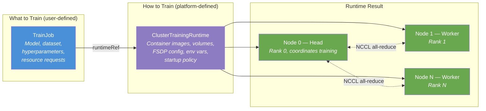
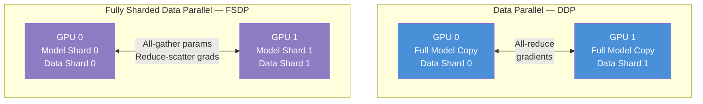

# L2-M6.3 -- Distributed Fine-Tuning with Kubeflow Trainer

**Level:** Practitioner
**Duration:** 1 hour

## Overview

In Level 1 you fine-tuned models interactively from a single workbench using one GPU. That approach hits a wall when models grow larger than a single GPU's memory or when fine-tuning takes hours instead of minutes. Kubeflow Trainer v2, shipped as a managed component in OpenShift AI (RHOAI 3.4+), provides a unified `TrainJob` API for distributed multi-node, multi-GPU fine-tuning -- including PyTorch FSDP, LoRA, JIT checkpointing, and Kueue integration out of the box.

In this lesson you will deploy a distributed LoRA fine-tuning job across two nodes using the `TrainJob` and `ClusterTrainingRuntime` CRDs, configure fault-tolerant checkpointing, and compare the distributed approach with the single-GPU workbench workflow from Level 1.

## Prerequisites

- Completed: [L2-M6.2 -- Kueue: Job Queuing and Quota Management](../2_kueue/)
- OpenShift AI cluster with the `trainingoperator` component set to `Managed` in the DataScienceCluster CR
- At least 2 GPU nodes available in the cluster (or a sandbox environment with GPU quota)
- Familiarity with PyTorch training loops and Hugging Face Transformers
- Familiarity with LoRA fine-tuning concepts (covered in Level 1)

## K8s Context

On vanilla Kubernetes, distributed training requires the upstream Kubeflow Training Operator, which exposes a separate CRD for each framework: `PyTorchJob`, `TFJob`, `MPIJob`, `XGBoostJob`, and so on. Each CRD has its own spec shape, its own set of fields for configuring workers, and its own way of handling multi-node communication. There is no unified API -- switching frameworks means rewriting your job manifest from scratch. There are no pre-built training runtimes; you must build and maintain your own container images with the correct PyTorch, NCCL, and CUDA versions. Checkpointing, fault tolerance, and Kueue integration are manual configurations.

Kubeflow Trainer v2 (GA in RHOAI 3.4) replaces all per-framework CRDs with a single `TrainJob` CRD that works with any framework. Training infrastructure is defined separately in `ClusterTrainingRuntime` resources -- OpenShift AI ships pre-built runtimes so you can submit fine-tuning jobs without building custom images. The operator handles rendezvous, environment variable injection, and Kueue gang scheduling automatically.

## Concepts

### Kubeflow Trainer v2: The Unified Training API

Trainer v2 introduces a clean separation of concerns between **what to train** and **how to train**:



| CRD | Scope | Purpose |
|-----|-------|---------|
| **TrainJob** | Namespace | Submitted by the user. Specifies the model source, dataset, training arguments, node count, and GPU requests. References a runtime. |
| **ClusterTrainingRuntime** | Cluster | Defined by platform admins. Contains the container image, volume mounts, environment variables, ML framework policy, and startup order. Reusable across many TrainJobs. |
| **TrainingRuntime** | Namespace | Same as ClusterTrainingRuntime but namespace-scoped. Use when teams need custom runtimes without cluster-admin access. |

The `TrainJob` spec has three main sections:

```yaml
spec:
  runtimeRef:           # Which ClusterTrainingRuntime to use
    name: torch-distributed
  modelConfig:          # Model source (HF hub or PVC) and output location
    input:
      storageUri: "hf://google/gemma-3-4b-it"
    output:
      storageUri: "pvc://training-output/adapter"
  datasetConfig:        # Dataset source
    storageUri: "hf://tatsu-lab/alpaca"
  trainer:              # Training command, arguments, node count, resources
    numNodes: 2
    resourcesPerNode:
      requests:
        nvidia.com/gpu: "1"
```

This replaces the old approach of writing a full `PyTorchJob` manifest with explicit pod templates, environment variables for `MASTER_ADDR`, `MASTER_PORT`, `WORLD_SIZE`, and `RANK` -- the Trainer operator injects all of these automatically.

---

### Parallelism Strategies for Distributed Training

Distributed training splits work across multiple GPUs. The strategy you choose depends on whether the model fits in a single GPU's memory and where the bottleneck lies:



| Strategy | Memory per GPU | Communication | Best For |
|----------|---------------|---------------|----------|
| **DDP** (Distributed Data Parallel) | Full model copy on each GPU | All-reduce gradients after each step | Models that fit in a single GPU; maximize throughput |
| **FSDP** (Fully Sharded Data Parallel) | Model sharded across GPUs | All-gather parameters before forward; reduce-scatter gradients after backward | Models too large for a single GPU; memory-efficient |
| **Tensor Parallel** | Single layer split across GPUs | Point-to-point within each layer | Very large layers (e.g., attention heads in 70B+ models) |
| **Pipeline Parallel** | Sequential layer groups on different GPUs | Forward/backward activations between stages | Very deep models; works well with micro-batching |

For the fine-tuning scenario in this lesson, **FSDP** is the right choice: it allows the base model (which may not fit in one GPU) to be sharded across GPUs while LoRA adapters are trained on top.

---

### LoRA + FSDP: Efficient Distributed Fine-Tuning

LoRA (Low-Rank Adaptation) and FSDP complement each other:

- **LoRA** reduces the number of trainable parameters from billions to millions by injecting small low-rank adapter matrices into attention layers. The base model weights are frozen.
- **FSDP** shards even the frozen base model parameters across GPUs, so no single GPU needs to hold the full model in memory.

Together, they enable fine-tuning of large models (7B, 13B, or larger) on modest GPU hardware. In a 2-node, 1-GPU-per-node setup:

| Component | GPU 0 | GPU 1 |
|-----------|-------|-------|
| Base model weights (frozen) | Shard 0 (~50%) | Shard 1 (~50%) |
| LoRA adapter weights (trainable) | Full copy | Full copy |
| Optimizer state | For LoRA params only | For LoRA params only |
| Gradients | Reduce-scattered | Reduce-scattered |

The key training arguments for LoRA + FSDP:

```bash
--use_peft=true                        # Enable PEFT/LoRA
--lora_r=16                            # LoRA rank (higher = more capacity, more memory)
--lora_alpha=32                        # LoRA scaling factor
--lora_target_modules=q_proj,v_proj    # Which layers to adapt
--fsdp="full_shard auto_wrap"          # Enable FSDP with auto wrapping
--fsdp_config=fsdp_config.json         # FSDP configuration file
```

---

### Pre-Built ClusterTrainingRuntimes

OpenShift AI ships pre-built `ClusterTrainingRuntime` resources that you can use immediately without building custom images:

| Runtime | Description | Included Libraries |
|---------|-------------|-------------------|
| **`torch-distributed`** | Basic PyTorch distributed training | PyTorch, torchrun, NCCL |
| **`training-hub`** | Full fine-tuning stack | PyTorch, Hugging Face Transformers, Accelerate, PEFT, Datasets, TRL |

You can also create custom `ClusterTrainingRuntime` resources (as we do in this lesson) to define specific FSDP configurations, volume mounts for checkpoints, and environment variables. Custom runtimes extend the pre-built ones by specifying exactly how the training pods should be configured.

---

### JIT Checkpointing for Fault Tolerance

Distributed training jobs can run for hours or days. Hardware failures, preemptions (via Kueue), or OOM errors can kill a training run. Without checkpointing, all progress is lost and training must restart from epoch 0.

JIT (Just-In-Time) checkpointing saves the full training state periodically:

| What is saved | Purpose |
|--------------|---------|
| Model parameters (or LoRA adapter weights) | Resume from the same model state |
| Optimizer state (momentum, learning rate schedule) | Maintain training dynamics |
| Training step counter and epoch | Know where to resume |
| Random number generator states | Ensure reproducibility |

Checkpoints can be stored on a PVC (for fast local access) or in S3-compatible storage (for durability). The training arguments control checkpoint behavior:

```bash
--save_strategy=steps       # Save at regular step intervals (vs. per-epoch)
--save_steps=100            # Save every 100 steps
--save_total_limit=3        # Keep only the 3 most recent checkpoints (save disk space)
--resume_from_checkpoint=true  # Auto-resume from the latest checkpoint on restart
```

When a job is restarted (manually or by Kubernetes), the training script detects existing checkpoints and resumes from the last one. Combined with Kueue preemption (L2-M6.2), this means a low-priority training job can be preempted, its resources given to a high-priority job, and then the training resumes from its last checkpoint when resources become available again.

---

### Python SDK for Job Submission

For interactive workflows, you can submit `TrainJob` resources from a Jupyter workbench using the Kubeflow Trainer Python SDK:

```python
from kubeflow.trainer import TrainerClient, constants

# Create a client connected to the current cluster
client = TrainerClient()

# Submit a TrainJob programmatically
client.train(
    name="gemma-lora-distributed",
    namespace="distributed-training",
    runtime_ref=constants.TORCH_DISTRIBUTED_RUNTIME,
    trainer=constants.Trainer(
        num_nodes=2,
        resources_per_node={
            "gpu": 1,
            "cpu": 4,
            "memory": "32Gi",
        },
        command=["torchrun"],
        args=[
            "train.py",
            "--model_name_or_path=google/gemma-3-4b-it",
            "--use_peft=true",
            "--lora_r=16",
        ],
    ),
)

# Monitor progress
client.get_job_status("gemma-lora-distributed", namespace="distributed-training")
```

The SDK creates the same `TrainJob` CR that you would write in YAML -- it is a convenience layer for data scientists who prefer Python over `oc apply`.

---

### Workbench vs Distributed Training

This table compares the single-GPU workbench approach from Level 1 with the distributed `TrainJob` approach in this lesson:

| Aspect | L1: Workbench Fine-Tuning | L2: Distributed TrainJob |
|--------|--------------------------|--------------------------|
| **Execution model** | Interactive notebook, single process | Batch job, multi-node distributed |
| **GPU count** | 1 GPU | 2+ GPUs across multiple nodes |
| **Max model size** | Limited by single GPU memory (~24 GB on A10G) | Sharded across GPUs via FSDP (scales linearly) |
| **Fault tolerance** | Manual save/load in notebook cells | Automatic JIT checkpointing with resume |
| **Resource scheduling** | Workbench pod runs until stopped | Kueue queues, priorities, and preemption |
| **Reproducibility** | Depends on notebook discipline | Declarative YAML, version-controlled |
| **Monitoring** | Notebook output and TensorBoard | Ray dashboard, Prometheus metrics, pod logs |
| **Use case** | Quick experiments, small models, prototyping | Production fine-tuning, large models, scheduled runs |

Both approaches have their place. Use workbenches for exploration and small-scale experiments. Use `TrainJob` when you need to scale beyond a single GPU, require fault tolerance, or want to run training as a scheduled, reproducible batch job.

## Step-by-Step

### Step 1: Verify the Kubeflow Trainer Operator

Confirm that the `trainingoperator` component is set to `Managed` in the DataScienceCluster CR:

```bash
oc get datasciencecluster default-dsc -o jsonpath='{.spec.components.trainingoperator.managementState}'
```

Expected output:

```
Managed
```

Verify that the Trainer operator pods are running:

```bash
oc get pods -n redhat-ods-applications -l app.kubernetes.io/name=training-operator
```

Expected output (pod name will differ):

```
NAME                                         READY   STATUS    RESTARTS   AGE
training-operator-controller-xxxxxxxxxx-xxxxx  1/1   Running   0          3d
```

Check that the Trainer v2 CRDs are registered:

```bash
oc api-resources | grep trainer.kubeflow.org
```

Expected output:

```
clustertrainingruntimes   ctr    trainer.kubeflow.org/v1alpha1   false   ClusterTrainingRuntime
trainingruntimes          tr     trainer.kubeflow.org/v1alpha1   true    TrainingRuntime
trainjobs                 tj     trainer.kubeflow.org/v1alpha1   true    TrainJob
```

### Step 2: Inspect Pre-Built ClusterTrainingRuntimes

List the ClusterTrainingRuntimes that ship with OpenShift AI:

```bash
oc get clustertrainingruntimes
```

Expected output:

```
NAME                 AGE
torch-distributed    3d
training-hub         3d
```

Inspect the `torch-distributed` runtime to see what it provides:

```bash
oc get clustertrainingruntime torch-distributed -o yaml
```

Key fields to note in the output:

- `mlPolicy.torch.numProcPerNode` -- number of training processes per node (typically matches GPU count)
- `template.spec.replicatedJobs` -- the pod template used for each training node
- `startupPolicy` -- controls whether all pods must be ready before training begins

Inspect the `training-hub` runtime:

```bash
oc get clustertrainingruntime training-hub -o yaml
```

The `training-hub` runtime extends `torch-distributed` with Hugging Face libraries (Transformers, Accelerate, PEFT, Datasets) pre-installed in the container image.

### Step 3: Create the Project Namespace

Create a dedicated namespace for distributed training:

```bash
oc new-project distributed-training --display-name="Distributed Training with Kubeflow Trainer"
```

Expected output:

```
Now using project "distributed-training" on server "https://api.<cluster>:6443".
```

### Step 4: Create Storage for Checkpoints and Output

Create PVCs for checkpoint storage and fine-tuned model output:

```bash
oc apply -f - <<'EOF'
apiVersion: v1
kind: PersistentVolumeClaim
metadata:
  name: training-checkpoints
  namespace: distributed-training
  labels:
    app: gemma-lora-distributed
    tutorial-level: "2"
    tutorial-module: "M6"
spec:
  accessModes:
    - ReadWriteMany
  resources:
    requests:
      storage: 50Gi
---
apiVersion: v1
kind: PersistentVolumeClaim
metadata:
  name: training-output
  namespace: distributed-training
  labels:
    app: gemma-lora-distributed
    tutorial-level: "2"
    tutorial-module: "M6"
spec:
  accessModes:
    - ReadWriteMany
  resources:
    requests:
      storage: 20Gi
EOF
```

Expected output:

```
persistentvolumeclaim/training-checkpoints created
persistentvolumeclaim/training-output created
```

> **Note:** `ReadWriteMany` (RWX) access mode is required because multiple training pods (across nodes) need to read and write checkpoints concurrently. Ensure your storage class supports RWX -- on OpenShift, `ocs-storagecluster-cephfs` or NFS-based storage classes typically do.

Verify the PVCs are bound:

```bash
oc get pvc -n distributed-training
```

Expected output:

```
NAME                     STATUS   VOLUME           CAPACITY   ACCESS MODES   STORAGECLASS   AGE
training-checkpoints     Bound    pv-xxxxxxxxxx    50Gi       RWX            gp3-csi        5s
training-output          Bound    pv-xxxxxxxxxx    20Gi       RWX            gp3-csi        5s
```

### Step 5: Apply the Custom ClusterTrainingRuntime

The pre-built `torch-distributed` runtime provides basic PyTorch training infrastructure. For this lesson, we create a custom runtime that adds FSDP configuration, checkpoint volumes, and shared memory:

```yaml
# manifests/clustertrainingruntime.yaml
apiVersion: trainer.kubeflow.org/v1alpha1
kind: ClusterTrainingRuntime
metadata:
  name: torch-lora-finetuning
  labels:
    tutorial-level: "2"
    tutorial-module: "M6"
spec:
  numNodes: 2
  startupPolicy:
    startupPolicyOrder: InOrder
  mlPolicy:
    torch:
      numProcPerNode: "1"
  podGroupPolicy:
    podGroupPolicySource: Kueue
  template:
    spec:
      numNodes: 2
      replicatedJobs:
        - name: node
          template:
            spec:
              template:
                spec:
                  containers:
                    - name: trainer
                      image: quay.io/modh/training:py311-cu124-torch241
                      env:
                        - name: FSDP_SHARDING_STRATEGY
                          value: "FULL_SHARD"
                        - name: FSDP_AUTO_WRAP_POLICY
                          value: "TRANSFORMER_BASED_WRAP"
                        - name: FSDP_BACKWARD_PREFETCH
                          value: "BACKWARD_PRE"
                        - name: FSDP_STATE_DICT_TYPE
                          value: "SHARDED_STATE_DICT"
                        - name: CHECKPOINT_DIR
                          value: "/checkpoints"
                      resources:
                        requests:
                          cpu: "4"
                          memory: 32Gi
                          nvidia.com/gpu: "1"
                        limits:
                          cpu: "8"
                          memory: 64Gi
                          nvidia.com/gpu: "1"
                      volumeMounts:
                        - name: checkpoints
                          mountPath: /checkpoints
                        - name: shm
                          mountPath: /dev/shm
                  volumes:
                    - name: checkpoints
                      persistentVolumeClaim:
                        claimName: training-checkpoints
                    - name: shm
                      emptyDir:
                        medium: Memory
                        sizeLimit: 8Gi
```

Key differences from the pre-built `torch-distributed` runtime:

| Field | Purpose |
|-------|---------|
| `FSDP_SHARDING_STRATEGY: FULL_SHARD` | Shard parameters, gradients, and optimizer state across all GPUs |
| `FSDP_AUTO_WRAP_POLICY: TRANSFORMER_BASED_WRAP` | Automatically wrap transformer layers for FSDP |
| `FSDP_BACKWARD_PREFETCH: BACKWARD_PRE` | Prefetch parameters for the next layer during backward pass |
| `FSDP_STATE_DICT_TYPE: SHARDED_STATE_DICT` | Save checkpoints in sharded format (faster, less memory) |
| `/checkpoints` volume | PVC-backed checkpoint storage for fault tolerance |
| `/dev/shm` volume | Shared memory for PyTorch DataLoader multi-processing and NCCL |

Apply the custom runtime:

```bash
oc apply -f manifests/clustertrainingruntime.yaml
```

Expected output:

```
clustertrainingruntime.trainer.kubeflow.org/torch-lora-finetuning created
```

Verify it appears alongside the pre-built runtimes:

```bash
oc get clustertrainingruntimes
```

Expected output:

```
NAME                    AGE
torch-distributed       3d
torch-lora-finetuning   5s
training-hub            3d
```

### Step 6: Submit the Distributed LoRA Fine-Tuning TrainJob

Now submit the `TrainJob` that references the custom runtime. This job fine-tunes the Gemma 3 4B model using LoRA adapters distributed across 2 nodes with FSDP:

```yaml
# manifests/trainjob.yaml
apiVersion: trainer.kubeflow.org/v1alpha1
kind: TrainJob
metadata:
  name: gemma-lora-distributed
  labels:
    app: gemma-lora-distributed
    tutorial-level: "2"
    tutorial-module: "M6"
    kueue.x-k8s.io/queue-name: prod-queue
spec:
  runtimeRef:
    name: torch-lora-finetuning
    kind: ClusterTrainingRuntime
    apiGroup: trainer.kubeflow.org
  modelConfig:
    input:
      storageUri: "hf://google/gemma-3-4b-it"
    output:
      storageUri: "pvc://training-output/gemma-lora-adapter"
  datasetConfig:
    storageUri: "hf://tatsu-lab/alpaca"
  trainer:
    command:
      - torchrun
    args:
      - "--nproc_per_node=1"
      - "train.py"
      - "--model_name_or_path=google/gemma-3-4b-it"
      - "--dataset_name=tatsu-lab/alpaca"
      - "--output_dir=/output"
      - "--per_device_train_batch_size=4"
      - "--gradient_accumulation_steps=4"
      - "--num_train_epochs=3"
      - "--learning_rate=2e-4"
      - "--warmup_ratio=0.03"
      - "--lr_scheduler_type=cosine"
      - "--bf16=true"
      - "--logging_steps=10"
      - "--save_strategy=steps"
      - "--save_steps=100"
      - "--use_peft=true"
      - "--lora_r=16"
      - "--lora_alpha=32"
      - "--lora_dropout=0.05"
      - "--lora_target_modules=q_proj,v_proj,k_proj,o_proj"
      - "--fsdp=full_shard auto_wrap"
      - "--fsdp_config=fsdp_config.json"
    numNodes: 2
    resourcesPerNode:
      requests:
        cpu: "4"
        memory: 32Gi
        nvidia.com/gpu: "1"
      limits:
        cpu: "8"
        memory: 64Gi
        nvidia.com/gpu: "1"
```

Apply the TrainJob:

```bash
oc apply -f manifests/trainjob.yaml
```

Expected output:

```
trainjob.trainer.kubeflow.org/gemma-lora-distributed created
```

The Trainer operator will now:
1. Create the training pods (one per node) using the `torch-lora-finetuning` runtime template
2. Inject environment variables for distributed communication (`MASTER_ADDR`, `MASTER_PORT`, `WORLD_SIZE`, `RANK`)
3. If Kueue is configured, the job is suspended until `prod-queue` has sufficient quota (see L2-M6.2)
4. Start training once all pods are ready (enforced by `startupPolicyOrder: InOrder`)

### Step 7: Monitor Training Progress

Watch the training pods come up:

```bash
oc get pods -l app=gemma-lora-distributed -w
```

Expected output (wait until all pods show `Running`):

```
NAME                                          READY   STATUS    RESTARTS   AGE
gemma-lora-distributed-node-0-0-xxxxx         1/1     Running   0          30s
gemma-lora-distributed-node-1-0-xxxxx         1/1     Running   0          25s
```

Press `Ctrl+C` to stop watching.

Check the TrainJob status:

```bash
oc get trainjob gemma-lora-distributed -o jsonpath='{.status.conditions}' | python3 -m json.tool
```

Expected output:

```json
[
  {
    "type": "Created",
    "status": "True",
    "reason": "TrainJobCreated",
    "message": "TrainJob is created"
  },
  {
    "type": "Training",
    "status": "True",
    "reason": "TrainingRunning",
    "message": "Training is running"
  }
]
```

Follow the training logs from the head node (node 0):

```bash
oc logs -f -l app=gemma-lora-distributed,job-name=gemma-lora-distributed-node-0
```

Expected output (training logs will stream):

```
[2025-01-20 14:30:00] Initializing distributed training...
[2025-01-20 14:30:01] World size: 2, Rank: 0, Local rank: 0
[2025-01-20 14:30:05] Loading model: google/gemma-3-4b-it
[2025-01-20 14:30:15] Enabling FSDP with FULL_SHARD strategy
[2025-01-20 14:30:16] LoRA config: r=16, alpha=32, target_modules=['q_proj', 'v_proj', 'k_proj', 'o_proj']
[2025-01-20 14:30:20] Trainable parameters: 13,631,488 / 4,000,000,000 (0.34%)
[2025-01-20 14:30:25] Starting training: 3 epochs, batch_size=4, grad_accum=4
{'loss': 1.8234, 'learning_rate': 5e-05, 'epoch': 0.01, 'step': 10}
{'loss': 1.6512, 'learning_rate': 1.2e-04, 'epoch': 0.02, 'step': 20}
{'loss': 1.5103, 'learning_rate': 1.8e-04, 'epoch': 0.03, 'step': 30}
...
```

If Kueue is configured (from L2-M6.2), check the Workload status:

```bash
oc get workloads -n distributed-training
```

Expected output:

```
NAME                                    QUEUE        ADMITTED BY         AGE
trainjob-gemma-lora-distributed-xxxxx   prod-queue   gpu-cluster-queue   2m
```

### Step 8: Verify Checkpoints and Fault Tolerance

After training has run for at least 100 steps (the `--save_steps` interval), verify that checkpoints are being saved:

```bash
HEAD_POD=$(oc get pods -l app=gemma-lora-distributed,job-name=gemma-lora-distributed-node-0 -o jsonpath='{.items[0].metadata.name}')
oc exec ${HEAD_POD} -- ls -la /checkpoints/
```

Expected output:

```
drwxr-xr-x  3 root root 4096 Jan 20 14:35 checkpoint-100
drwxr-xr-x  3 root root 4096 Jan 20 14:40 checkpoint-200
drwxr-xr-x  3 root root 4096 Jan 20 14:45 checkpoint-300
```

Inspect a checkpoint directory to see what is saved:

```bash
oc exec ${HEAD_POD} -- ls -la /checkpoints/checkpoint-100/
```

Expected output:

```
-rw-r--r-- 1 root root  1024 Jan 20 14:35 adapter_config.json
-rw-r--r-- 1 root root 54M   Jan 20 14:35 adapter_model.safetensors
-rw-r--r-- 1 root root  512  Jan 20 14:35 optimizer.pt
-rw-r--r-- 1 root root  256  Jan 20 14:35 rng_state.pth
-rw-r--r-- 1 root root  128  Jan 20 14:35 trainer_state.json
-rw-r--r-- 1 root root  256  Jan 20 14:35 training_args.bin
```

To demonstrate fault recovery, delete one of the training pods and observe the job restart from the last checkpoint:

```bash
# Delete a worker pod to simulate a node failure
WORKER_POD=$(oc get pods -l app=gemma-lora-distributed,job-name=gemma-lora-distributed-node-1 -o jsonpath='{.items[0].metadata.name}')
oc delete pod ${WORKER_POD}
```

The Trainer operator will recreate the pod. When training resumes, check the logs for checkpoint recovery:

```bash
oc logs -f -l app=gemma-lora-distributed,job-name=gemma-lora-distributed-node-0 --tail=20
```

Expected output (after pod recreation):

```
[2025-01-20 14:50:00] Resuming training from checkpoint: /checkpoints/checkpoint-300
[2025-01-20 14:50:05] Loaded model state from checkpoint-300
[2025-01-20 14:50:06] Loaded optimizer state from checkpoint-300
[2025-01-20 14:50:06] Resuming from step 300, epoch 0.09
{'loss': 1.2845, 'learning_rate': 1.95e-04, 'epoch': 0.10, 'step': 310}
...
```

Training continues from step 300 rather than restarting from step 0. This is the value of JIT checkpointing -- hours of training are preserved even through node failures.

After training completes, verify the final adapter was saved to the output PVC:

```bash
oc exec ${HEAD_POD} -- ls -la /output/
```

Expected output:

```
-rw-r--r-- 1 root root  1024 Jan 20 15:30 adapter_config.json
-rw-r--r-- 1 root root 54M   Jan 20 15:30 adapter_model.safetensors
-rw-r--r-- 1 root root  256  Jan 20 15:30 tokenizer_config.json
-rw-r--r-- 1 root root  4.0M Jan 20 15:30 tokenizer.model
```

## Verification

1. Trainer operator is running:

```bash
oc get pods -n redhat-ods-applications -l app.kubernetes.io/name=training-operator --no-headers | wc -l
```

Expected: `1` (or more).

2. Trainer v2 CRDs are registered:

```bash
oc get crd | grep -c "trainer.kubeflow.org"
```

Expected: `3` (clustertrainingruntimes, trainingruntimes, trainjobs).

3. Custom ClusterTrainingRuntime exists:

```bash
oc get clustertrainingruntime torch-lora-finetuning -o jsonpath='{.metadata.name}'
```

Expected: `torch-lora-finetuning`.

4. TrainJob created successfully:

```bash
oc get trainjob gemma-lora-distributed -n distributed-training -o jsonpath='{.status.conditions[?(@.type=="Created")].status}'
```

Expected: `True`.

5. Training pods are running (or completed):

```bash
oc get pods -n distributed-training -l app=gemma-lora-distributed --no-headers | wc -l
```

Expected: `2` (one per node).

6. Checkpoints are being written:

```bash
HEAD_POD=$(oc get pods -n distributed-training -l app=gemma-lora-distributed,job-name=gemma-lora-distributed-node-0 -o jsonpath='{.items[0].metadata.name}')
oc exec -n distributed-training ${HEAD_POD} -- ls /checkpoints/ | wc -l
```

Expected: `1` or more checkpoint directories.

## K8s vs OpenShift AI Comparison

| Aspect | Kubernetes (upstream Kubeflow) | OpenShift AI |
|--------|-------------------------------|--------------|
| **Training CRDs** | Separate CRD per framework: PyTorchJob, TFJob, MPIJob, XGBoostJob | Unified `TrainJob` CRD for all frameworks (Trainer v2) |
| **Operator installation** | Install Kubeflow Training Operator via Helm or kustomize | Enable `trainingoperator: Managed` in the DSC -- operator deployed and upgraded by the platform |
| **Pre-built runtimes** | None -- you build and maintain your own training images | `torch-distributed` and `training-hub` shipped out of the box |
| **Distributed rendezvous** | Manually configure `MASTER_ADDR`, `MASTER_PORT`, `WORLD_SIZE`, `RANK` | Trainer operator injects all environment variables automatically |
| **GPU scheduling** | First-come-first-served with standard K8s scheduler | Kueue integration via `podGroupPolicy` for gang scheduling and quota management |
| **Checkpointing** | Manual volume configuration in job manifests | Volume mounts defined in ClusterTrainingRuntime, reusable across jobs |
| **SDK** | `kubeflow-training` Python SDK (same upstream SDK) | Same SDK, pre-installed in OpenShift AI workbench images |
| **Dashboard visibility** | No integrated training dashboard | TrainJobs visible in OpenShift AI dashboard; Prometheus metrics auto-collected |
| **Gang scheduling** | Requires separate installation of a gang scheduler (e.g., Volcano, Coscheduling) | Kueue provides gang scheduling out of the box via `podGroupPolicy: Kueue` |

## Key Takeaways

- **Trainer v2 replaces per-framework CRDs.** Instead of writing `PyTorchJob`, `TFJob`, or `MPIJob` manifests, you write a single `TrainJob` that works with any ML framework. The training infrastructure is defined separately in a `ClusterTrainingRuntime`.
- **Separation of concerns drives reusability.** Platform admins define `ClusterTrainingRuntime` resources (images, volumes, FSDP settings). Data scientists submit `TrainJob` resources (model, dataset, hyperparameters). Neither needs to understand the other's domain in detail.
- **FSDP enables training models larger than a single GPU.** By sharding parameters, gradients, and optimizer state across GPUs, FSDP allows fine-tuning of 4B+ parameter models on hardware that could not hold the full model in memory.
- **LoRA + FSDP is the efficient combination.** LoRA reduces trainable parameters to a fraction of the total; FSDP handles the memory footprint of the frozen base model. Together they make distributed fine-tuning practical on modest GPU clusters.
- **JIT checkpointing makes long training jobs resilient.** Periodic checkpoints to PVC or S3 mean that node failures, preemptions, and restarts only lose the work since the last checkpoint -- not the entire training run.
- **Kueue integration is declarative.** Add the `kueue.x-k8s.io/queue-name` label to a TrainJob and set `podGroupPolicy: Kueue` in the runtime. Kueue gang-schedules all training pods as a single unit and manages quota from L2-M6.2.

## Cleanup

```bash
# Delete the TrainJob (also removes training pods)
oc delete trainjob gemma-lora-distributed -n distributed-training

# Delete the custom ClusterTrainingRuntime
oc delete clustertrainingruntime torch-lora-finetuning

# Delete the PVCs
oc delete pvc training-checkpoints training-output -n distributed-training

# Delete the project
oc delete project distributed-training
```

Verify cleanup:

```bash
oc get trainjobs --all-namespaces --no-headers 2>/dev/null | wc -l
```

Expected: `0` (no TrainJobs remaining).

## Next Steps

Continue to [L2-M6.4 -- Apache Spark on OpenShift AI](../4_spark/) to run distributed data processing with Apache Spark. You will deploy a SparkApplication for large-scale feature engineering and ETL pipelines -- the data preparation step that feeds into the distributed training workflows covered in this lesson.
