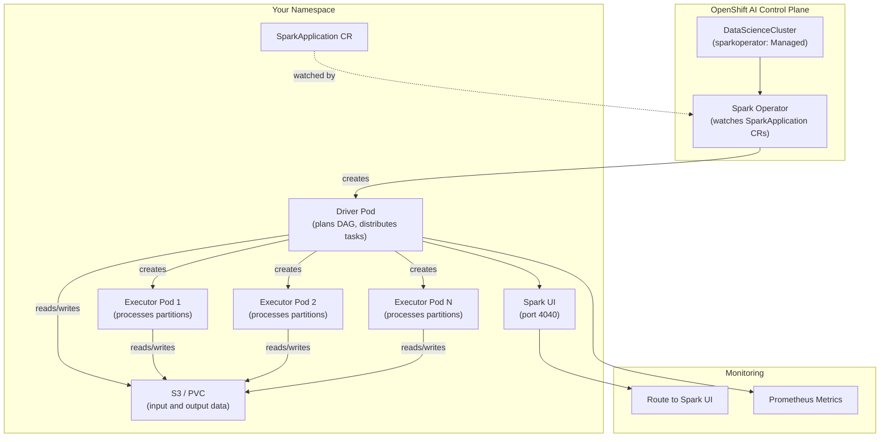

# L2-M6.4 -- Apache Spark on OpenShift AI

**Level:** Practitioner
**Duration:** 45 min

## Overview

Apache Spark is the dominant engine for large-scale structured data processing -- ETL, feature engineering, data validation, and batch analytics. If you have used Spark on vanilla Kubernetes via the `spark-on-k8s-operator` or raw `spark-submit`, you know how to get Spark running in a cluster. OpenShift AI integrates Spark through the `sparkoperator` component in the DataScienceCluster, giving you a managed Spark Operator that handles CRD installation, RBAC, and lifecycle management without manual Helm chart administration.

In this lesson you will deploy a PySpark data processing application using the `SparkApplication` CRD, monitor it through the Spark UI, and understand when to reach for Spark versus Ray or Kubeflow Pipelines for AI workloads.

## Prerequisites

- Completed L2-M6.1 (KubeRay on OpenShift AI) and L2-M6.3 (Distributed Fine-Tuning with Kubeflow Trainer)
- `sparkoperator` component set to `Managed` in the DataScienceCluster CR
- `oc` CLI authenticated to the cluster
- Familiarity with Spark concepts (driver, executors, RDDs/DataFrames)

## K8s Context

On vanilla Kubernetes, running Spark requires one of two approaches:

1. **spark-submit with K8s master** -- you run `spark-submit --master k8s://https://<api-server>` from a client machine. Spark creates driver and executor pods directly via the Kubernetes API. You manage RBAC, service accounts, and container images yourself.
2. **spark-on-k8s-operator** -- the upstream Google Cloud operator (`github.com/kubeflow/spark-operator`) installs CRDs (`SparkApplication`, `ScheduledSparkApplication`) and a controller that watches for them. You install it via Helm, manage upgrades, and configure RBAC manually.

In both cases, there is no integrated lifecycle management -- you are responsible for operator versions, CRD compatibility, monitoring integration, and cleanup of completed job pods.

OpenShift AI replaces this with a single `sparkoperator` component toggle in the DataScienceCluster CR.

## Concepts

### Spark Architecture on Kubernetes

Spark on Kubernetes follows the driver-executor model. The driver pod orchestrates the computation -- it plans the execution DAG, distributes tasks, and collects results. Executor pods do the actual data processing -- each executor runs a partition of the work in parallel.



When you submit a `SparkApplication` CR, the Spark Operator:

1. Creates the driver pod with the specified image, resources, and application file
2. The driver pod requests executor pods from the Kubernetes API
3. Executors register with the driver and begin processing tasks
4. On completion, executor pods terminate and the driver reports the final status
5. The operator updates the `SparkApplication` status with the outcome

### SparkApplication CRD

The `SparkApplication` CRD is the primary interface for submitting Spark jobs. Key fields:

| Field | Description | Example Values |
|-------|-------------|----------------|
| `spec.type` | Application language | `Python`, `Scala`, `Java`, `R` |
| `spec.mode` | Deployment mode | `cluster` (driver in pod) or `client` |
| `spec.sparkVersion` | Spark version | `3.5.3` |
| `spec.mainApplicationFile` | Path to app JAR or Python file | `local:///opt/spark/work-dir/app.py` |
| `spec.driver` | Driver pod configuration | CPU, memory, service account |
| `spec.executor` | Executor pod configuration | Instances, CPU, memory, GPU |
| `spec.deps` | Dependencies (JARs, files, packages) | PyPI packages, Maven coordinates |
| `spec.sparkConf` | Spark configuration properties | `spark.sql.shuffle.partitions: "20"` |

For recurring jobs, use the `ScheduledSparkApplication` CRD, which wraps a `SparkApplication` template with a cron schedule:

```yaml
apiVersion: sparkoperator.k8s.io/v1beta2
kind: ScheduledSparkApplication
metadata:
  name: nightly-feature-engineering
spec:
  schedule: "0 2 * * *"          # Run at 2 AM daily
  concurrencyPolicy: Forbid       # Don't overlap runs
  template:
    # Same spec as SparkApplication
    type: Python
    mode: cluster
    mainApplicationFile: local:///opt/spark/work-dir/features.py
    ...
```

### When to Use Spark vs Ray vs Kubeflow Pipelines

This module has introduced three distributed computing technologies. Each solves a different problem:

| Aspect | Apache Spark | Ray | Kubeflow Pipelines |
|--------|-------------|-----|-------------------|
| **Primary use case** | Large-scale structured data processing (ETL, feature engineering, batch analytics) | Distributed ML workloads (training, inference, online serving) | Pipeline orchestration (sequencing and connecting tasks) |
| **Data model** | DataFrames, SQL, structured/semi-structured data | Arbitrary Python objects, tensors, actors | DAG of containerized steps |
| **Scaling model** | Data parallelism (partition data across executors) | Task and actor parallelism (distribute functions and stateful actors) | Step-level parallelism (run independent steps concurrently) |
| **GPU support** | Limited (not Spark's strength) | First-class (distributed training, inference) | Via step containers (delegates to underlying framework) |
| **Fault tolerance** | RDD lineage-based recomputation | Task-level retry, actor checkpointing | Step-level retry, caching |
| **State management** | Stateless batch processing | Stateful actors for online serving | Stateless steps, artifacts for data passing |
| **Ecosystem** | Spark SQL, MLlib, Structured Streaming | Ray Train, Ray Serve, Ray Data | KFP SDK, Tekton/Argo execution |
| **Best for AI** | Feature engineering, data preprocessing, data validation | Model training, hyperparameter tuning, model serving | Orchestrating end-to-end ML workflows |

**Decision framework:**

- **"I need to process terabytes of structured data for feature engineering"** -- use Spark
- **"I need to fine-tune a model across multiple GPUs"** -- use Ray (with Kubeflow Trainer, as in L2-M6.3)
- **"I need to preprocess a large document corpus before RAG ingestion"** -- use Spark for the data pipeline, Ray for the embedding generation
- **"I need to sequence data preprocessing, training, and deployment"** -- use Kubeflow Pipelines to orchestrate Spark and Ray steps
- **"I need to run a recurring ETL job on a schedule"** -- use ScheduledSparkApplication

These tools are complementary, not competing. A typical production AI workflow uses all three: Spark for data processing, Ray for training and inference, and KFP for orchestrating the end-to-end pipeline.

### AI-Specific Use Cases for Spark

Spark's strengths map well to specific AI workflow stages:

| Use Case | What Spark Does | Why Not Ray/KFP |
|----------|----------------|-----------------|
| Large-scale feature engineering | Process raw data into ML features across terabytes of structured data using Spark SQL and DataFrame operations | Ray Data works for smaller datasets, but Spark's SQL optimizer and shuffle engine handle massive structured data more efficiently |
| Data preprocessing for RAG | Read, chunk, clean, and deduplicate large document corpora before embedding generation | Spark handles the I/O-heavy structured processing; Ray handles the GPU-heavy embedding step |
| Distributed data validation | Run data quality checks (schema validation, null rates, distribution drift) across partitioned datasets | Spark's SQL engine makes declarative validation rules natural; this is purely a data problem |
| Batch inference at scale | Apply a trained model to millions of records using Spark's `mapPartitions` | Appropriate when the model fits in executor memory and you are processing structured tabular data |

## Step-by-Step

### Step 1: Verify the Spark Operator Is Enabled

Confirm the `sparkoperator` component is set to `Managed` in your DataScienceCluster:

```bash
oc get datasciencecluster default-dsc -o jsonpath='{.spec.components.sparkoperator.managementState}'
```

Expected output:

```
Managed
```

If the output is `Removed`, enable it by patching the DSC:

```bash
oc patch datasciencecluster default-dsc --type merge -p '{"spec":{"components":{"sparkoperator":{"managementState":"Managed"}}}}'
```

Verify the Spark Operator pods are running:

```bash
oc get pods -n redhat-ods-applications -l app.kubernetes.io/name=spark-operator
```

Expected output:

```
NAME                                    READY   STATUS    RESTARTS   AGE
spark-operator-controller-xxxxx-xxxxx   1/1     Running   0          5m
```

### Step 2: Verify the SparkApplication CRD Is Installed

The Spark Operator registers the CRDs when it starts. Confirm they are available:

```bash
oc get crd sparkapplications.sparkoperator.k8s.io
```

Expected output:

```
NAME                                        CREATED AT
sparkapplications.sparkoperator.k8s.io      2025-xx-xxTxx:xx:xxZ
```

Also check the scheduled variant:

```bash
oc get crd scheduledsparkapplications.sparkoperator.k8s.io
```

Expected output:

```
NAME                                                 CREATED AT
scheduledsparkapplications.sparkoperator.k8s.io      2025-xx-xxTxx:xx:xxZ
```

### Step 3: Create a Namespace for the Spark Job

Create a dedicated namespace for the Spark application:

```bash
oc new-project spark-tutorial
```

Add the data science project label so it appears in the OpenShift AI dashboard:

```bash
oc label namespace spark-tutorial opendatahub.io/dashboard=true
```

The Spark Operator needs a service account with permissions to create executor pods. Create one:

```bash
oc create serviceaccount spark -n spark-tutorial
```

Grant the service account permission to create and manage pods (executors):

```bash
oc create rolebinding spark-role --clusterrole=edit --serviceaccount=spark-tutorial:spark -n spark-tutorial
```

### Step 4: Deploy a SparkApplication

Review the manifest that defines a PySpark data processing job. This example demonstrates a text data preprocessing pipeline -- the kind of workload you would run before ingesting documents into a RAG system.

```yaml
# manifests/sparkapplication.yaml
apiVersion: sparkoperator.k8s.io/v1beta2
kind: SparkApplication
metadata:
  name: text-data-preprocessing
  namespace: spark-tutorial
  labels:
    app: text-data-preprocessing
    tutorial-level: "2"
    tutorial-module: "M6"
spec:
  type: Python
  mode: cluster
  image: quay.io/opendatahub/spark:3.5.3
  imagePullPolicy: IfNotPresent
  sparkVersion: "3.5.3"
  mainApplicationFile: "local:///opt/spark/examples/src/main/python/wordcount.py"
  arguments:
    - "/opt/spark/README.md"
  sparkConf:
    spark.ui.port: "4040"
    spark.eventLog.enabled: "false"
    spark.sql.shuffle.partitions: "4"
  driver:
    cores: 1
    memory: "1g"
    serviceAccount: spark
    labels:
      app: text-data-preprocessing
      role: driver
  executor:
    cores: 1
    instances: 2
    memory: "1g"
    labels:
      app: text-data-preprocessing
      role: executor
  restartPolicy:
    type: Never
```

> **Note:** This example uses the bundled `wordcount.py` from the Spark distribution as a lightweight demonstration. In production, you would mount your own Python scripts via a ConfigMap or bake them into a custom image. The architecture -- driver, executors, SparkApplication CR -- is identical regardless of the application logic.

Apply the manifest:

```bash
oc apply -f manifests/sparkapplication.yaml
```

### Step 5: Monitor the Spark Application

Watch the SparkApplication status:

```bash
oc get sparkapplication text-data-preprocessing -n spark-tutorial -w
```

Expected output progression:

```
NAME                       STATUS      ATTEMPTS   START                  FINISH
text-data-preprocessing    SUBMITTED   1
text-data-preprocessing    RUNNING     1          2025-xx-xxTxx:xx:xxZ
text-data-preprocessing    COMPLETED   1          2025-xx-xxTxx:xx:xxZ   2025-xx-xxTxx:xx:xxZ
```

Watch the pods to see the driver and executors come up:

```bash
oc get pods -n spark-tutorial -l app=text-data-preprocessing -w
```

Expected output:

```
NAME                                               READY   STATUS    RESTARTS   AGE
text-data-preprocessing-driver                     1/1     Running   0          15s
text-data-preprocessing-xxxxxxxxxx-exec-1          1/1     Running   0          20s
text-data-preprocessing-xxxxxxxxxx-exec-2          1/1     Running   0          20s
```

After the job completes, the executor pods terminate and the driver pod enters `Completed` state:

```
text-data-preprocessing-driver                     0/1     Completed   0          45s
```

### Step 6: Access the Spark UI

While the application is running, you can access the Spark UI to monitor job progress, stages, and executor metrics.

Create a Route to the driver pod's Spark UI (port 4040):

```bash
oc expose service text-data-preprocessing-ui-svc -n spark-tutorial --name=spark-ui 2>/dev/null || \
  oc port-forward -n spark-tutorial text-data-preprocessing-driver 4040:4040
```

> **Note:** The Spark Operator may or may not create a Service for the Spark UI automatically depending on the version. If `oc expose` fails, use `port-forward` to the driver pod directly. The Spark UI is only available while the driver pod is running.

With port-forward active, open http://localhost:4040 in your browser. The Spark UI shows:

| Tab | What It Shows |
|-----|---------------|
| Jobs | Active and completed Spark jobs with stage breakdown |
| Stages | Individual stages within each job, task distribution across executors |
| Storage | Cached RDDs/DataFrames and memory usage per executor |
| Environment | Spark configuration, system properties, classpath |
| Executors | CPU, memory, and shuffle metrics per executor pod |
| SQL | Query plans and execution details for Spark SQL operations |

### Step 7: Review the Application Output and Logs

Check the driver logs to see the application output:

```bash
oc logs text-data-preprocessing-driver -n spark-tutorial
```

The word count output will appear in the driver logs. Look for lines showing word frequencies.

Get detailed status from the SparkApplication resource:

```bash
oc get sparkapplication text-data-preprocessing -n spark-tutorial -o yaml
```

Key status fields to examine:

```bash
oc get sparkapplication text-data-preprocessing -n spark-tutorial \
  -o jsonpath='{.status.applicationState.state}'
```

Expected output:

```
COMPLETED
```

Check the executor state summary:

```bash
oc get sparkapplication text-data-preprocessing -n spark-tutorial \
  -o jsonpath='{.status.executorState}' | python3 -m json.tool
```

Expected output:

```json
{
  "text-data-preprocessing-xxxxxxxxxx-exec-1": "COMPLETED",
  "text-data-preprocessing-xxxxxxxxxx-exec-2": "COMPLETED"
}
```

## Verification

Run through this checklist to confirm everything is working:

| Check | Command | Expected Result |
|-------|---------|-----------------|
| Spark Operator running | `oc get pods -n redhat-ods-applications -l app.kubernetes.io/name=spark-operator` | Operator pod in `Running` state |
| SparkApplication CRD exists | `oc get crd sparkapplications.sparkoperator.k8s.io` | CRD listed |
| SparkApplication submitted | `oc get sparkapplication -n spark-tutorial` | `text-data-preprocessing` listed |
| Application completed | `oc get sparkapplication text-data-preprocessing -n spark-tutorial -o jsonpath='{.status.applicationState.state}'` | `COMPLETED` |
| Driver pod completed | `oc get pod text-data-preprocessing-driver -n spark-tutorial -o jsonpath='{.status.phase}'` | `Succeeded` |
| Driver logs have output | `oc logs text-data-preprocessing-driver -n spark-tutorial \| head -20` | Word count output visible |

## K8s vs OpenShift AI Comparison

| Aspect | Spark on Kubernetes | Spark on OpenShift AI |
|--------|--------------------|-----------------------|
| Operator deployment | Helm install of `spark-on-k8s-operator`, manual version management | `sparkoperator: Managed` in DataScienceCluster CR |
| CRD management | Installed by Helm, manual upgrades | Operator manages CRDs automatically |
| RBAC setup | Create service accounts, roles, and bindings manually | Standard OpenShift RBAC, operator pre-configures permissions |
| Container images | Build and host your own Spark images | Red Hat-provided Spark images via `quay.io/opendatahub` |
| Monitoring | Manual Prometheus scrape config, separate Grafana setup | Integrated with OpenShift monitoring stack |
| Spark UI access | Manual Service/Ingress creation | Route or port-forward, same Kubernetes patterns |
| Resource quotas | Manual ResourceQuota configuration | Integrates with Kueue (L2-M6.2) for queue-based scheduling |
| Upgrades | Helm upgrade, CRD compatibility checks | Operator handles upgrades as part of OpenShift AI lifecycle |
| Multi-tenancy | Manual namespace isolation | Project-based isolation with OpenShift RBAC |
| Integration | Standalone, no connection to ML platform | Part of the OpenShift AI platform alongside Ray, KFP, model serving |

## Key Takeaways

- The `sparkoperator` component in the DataScienceCluster deploys and manages the Spark Operator -- no manual Helm installation or CRD management required
- `SparkApplication` is the primary CRD for submitting Spark jobs; `ScheduledSparkApplication` adds cron-like scheduling for recurring jobs
- Spark excels at large-scale structured data processing (ETL, feature engineering, data validation) -- use Ray for GPU-heavy ML workloads and Kubeflow Pipelines for orchestrating multi-step workflows
- The driver-executor model maps directly to Kubernetes pods: one driver pod plans the work, multiple executor pods process data partitions in parallel
- Spark, Ray, and Kubeflow Pipelines are complementary tools in the AI platform -- a production workflow typically uses Spark for data processing, Ray for training and inference, and KFP for orchestrating the end-to-end pipeline

## Cleanup

```bash
# Delete the SparkApplication (this removes the driver and executor pods)
oc delete sparkapplication text-data-preprocessing -n spark-tutorial

# Delete the service account and role binding
oc delete rolebinding spark-role -n spark-tutorial
oc delete serviceaccount spark -n spark-tutorial

# Delete the project
oc delete project spark-tutorial
```

## Next Steps

**You have completed Level 2 of the OpenShift AI tutorial.**

Level 2 covered six modules spanning the practitioner skills needed to build, deploy, and operate AI workloads on OpenShift AI:

| Module | Lessons | Focus |
|--------|---------|-------|
| M1: RAG on OpenShift AI | 6 lessons | Retrieval-augmented generation |
| M2: MCP Server Deployment | 5 lessons | Model Context Protocol |
| M3: AI Agent Deployment | 5 lessons | Agent patterns and deployment |
| M4: Data Science Pipelines | 4 lessons | Pipeline orchestration |
| M5: AI Agent Observability | 5 lessons | Monitoring and tracing |
| M6: Distributed Workloads | 4 lessons | Ray, Kueue, Trainer, Spark |

You now know how to:

- Build RAG applications with vector databases and retrieval chains on OpenShift AI
- Deploy MCP servers and AI agents with production-grade patterns
- Orchestrate ML workflows with Data Science Pipelines (Kubeflow Pipelines v2)
- Monitor AI workloads with OpenTelemetry, Prometheus, and distributed tracing
- Run distributed workloads with Ray, manage GPU quotas with Kueue, fine-tune models with Kubeflow Trainer, and process large datasets with Spark

**Level 3 begins with [L3-M1.1 -- RBAC and Network Policies for AI Workloads](../../../level_3/M1_governance/1_rbac/)**, which covers governance, security, advanced serving, and production operations. You will learn to lock down AI workloads with fine-grained access control, secure model endpoints, implement guardrails, and operate AI infrastructure at production scale.
