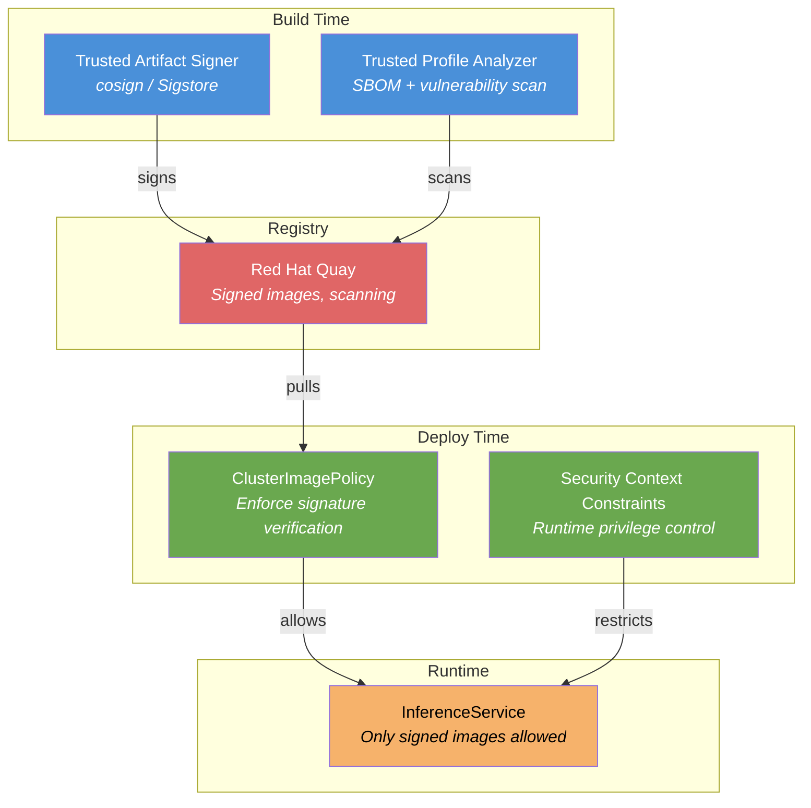

# L3-M1.5 -- Software Supply Chain Security for AI

**Level:** Expert
**Duration:** 30 min

## Overview

Every model you deploy is a software artifact -- a container image carrying executable code, model weights, and dependencies. If any of those components is tampered with, poisoned, or sourced from an unverified origin, your inference pipeline becomes an attack surface. This lesson covers the AI-specific dimensions of supply chain security that go beyond traditional container image hardening: model poisoning, data poisoning, dependency attacks in ML frameworks, and the risks of pulling unverified models from public hubs. You will learn how OpenShift's security tooling -- Trusted Artifact Signer, Trusted Profile Analyzer, Quay, Security Context Constraints, and image policies -- combine to create a defense-in-depth strategy for AI workloads.

## Prerequisites

- Completed: L3-M1.1 through L3-M1.4 (Governance and Security module)
- Completed: L1-M2 (Model Serving) and L2-M1 (RAG) -- familiarity with InferenceService and model container images
- OpenShift AI 3.4+ with a model serving project configured
- `oc` CLI authenticated with cluster-admin privileges (required for ClusterImagePolicy and SCC operations)
- `cosign` CLI installed locally (`brew install cosign` or `go install github.com/sigstore/cosign/v2/cmd/cosign@latest`)
- Access to a container registry where you can push images (Quay.io recommended)

## Concepts

### AI-Specific Supply Chain Risks

Traditional software supply chain security focuses on source code, build systems, and container images. AI workloads introduce four additional attack surfaces that are unique to machine learning:

```
Traditional Software Supply Chain:
  Source Code --> Build System --> Container Image --> Registry --> Deployment

AI Supply Chain (additional attack surfaces):
  Training Data --> Model Training --> Model Weights --> Model Registry --> Model Image --> Serving
       |                |                  |                 |                |
  Data Poisoning   Training Env       Weight Tampering   Metadata Forgery  Image Tampering
                   Compromise
```

**Model Poisoning** -- An attacker manipulates training data or the training process itself to embed backdoors in the model. The model behaves normally on standard inputs but produces attacker-controlled outputs on specific trigger inputs. This is extremely difficult to detect because the model passes standard benchmarks. Example: a code-generation model that produces subtly vulnerable code when the prompt contains a specific keyword.

**Data Poisoning** -- Corrupted or biased training datasets lead to models that produce incorrect, biased, or harmful outputs. Unlike model poisoning, data poisoning may not be intentional -- it can result from careless data collection, mislabeled examples, or adversarial contributions to open datasets.

**Dependency Attacks** -- ML frameworks have deep dependency trees. A malicious package published to PyPI or Conda can compromise any model training or serving environment that installs it. The `torch`, `transformers`, and `vllm` packages each pull in hundreds of transitive dependencies. A single compromised dependency can exfiltrate model weights, training data, or API keys.

**Model Theft and Exfiltration** -- Proprietary models represent significant investment. Without proper access controls and image signing, an attacker (or careless insider) can copy model weights from the registry and deploy them elsewhere. Signed images with provenance attestations create an audit trail that makes unauthorized copying detectable.

**Hugging Face Supply Chain Risks** -- The Hugging Face Hub is the npm/Docker Hub of the ML world. Models are uploaded by anyone, often without verification. Risks include:
- Pickle deserialization attacks (Python pickle files can execute arbitrary code when loaded)
- Backdoored models that pass standard benchmarks but contain hidden behaviors
- Typosquatting on popular model names
- Models trained on copyrighted or problematic data without disclosure

---

### OpenShift Security Tools for AI Supply Chains

OpenShift provides a layered defense against supply chain attacks. Each tool addresses a different part of the chain:



**Trusted Artifact Signer (Sigstore/cosign)** -- Provides keyless or key-based cryptographic signing of container images. Every image pushed to the registry gets a digital signature that proves who built it and that it has not been tampered with. For AI workloads, this means you can verify that a model container image was built by your CI/CD pipeline and not modified after the fact.

**Trusted Profile Analyzer (SBOM + Vulnerability Scanning)** -- Generates Software Bills of Materials (SBOMs) for container images and scans for known vulnerabilities. For AI model images, this captures the full dependency tree: Python version, PyTorch version, CUDA libraries, and every transitive dependency. This is critical because ML dependency trees are unusually deep and change frequently.

**Red Hat Quay** -- Enterprise container registry with built-in security scanning (Clair), image signing support, and repository-level access controls. Quay stores the signed images and their provenance attestations, providing a single source of truth for which images are trusted.

**ClusterImagePolicy** -- An OpenShift policy resource that enforces signature verification at deploy time. When configured, the cluster refuses to pull any image that does not have a valid cosign signature from a trusted key. This is the enforcement point -- without it, signing is advisory only.

---

### Security Context Constraints for AI Workloads

SCCs control what a container is allowed to do at runtime. AI workloads span a wide range of privilege requirements:

| SCC | When to Use for AI | Examples |
|-----|-------------------|----------|
| `restricted-v2` | Default for all application pods. Most model serving images from Red Hat (vLLM, TGI on UBI) work here. | InferenceService pods, data science notebooks (OpenShift AI managed) |
| `anyuid` | Some third-party ML images from Docker Hub or Hugging Face expect to run as root. Required when you cannot rebuild the image. | Legacy TensorFlow Serving images, some Hugging Face Spaces containers |
| `privileged` | GPU device plugins and drivers only. Never for application-level pods. | NVIDIA GPU Operator DaemonSet, Node Feature Discovery |

**Best practice:** Always try `restricted-v2` first. If a pod fails with permission errors, investigate whether you can fix the image (change the user, fix file permissions) rather than granting `anyuid`. Granting `anyuid` to a model serving pod means a container escape gives the attacker root on the node.

Check which SCC a running pod is using:

```bash
oc get pod <pod-name> -o jsonpath='{.metadata.annotations.openshift\.io/scc}'
```

---

### Secure Model Ingestion Workflow

The following workflow ensures that every model deployed in your cluster has been scanned, signed, and verified:

```
Step 1: Download        Step 2: Scan         Step 3: Sign        Step 4: Store        Step 5: Deploy
+-----------------+   +----------------+   +---------------+   +---------------+   +------------------+
| Hugging Face    |-->| Vulnerability  |-->| cosign sign   |-->| Push to Quay  |-->| InferenceService |
| or internal     |   | scan (Trivy,   |   | with org key  |   | with signature|   | with policy      |
| model registry  |   | Clair, TPA)    |   |               |   | attestation   |   | enforcement      |
+-----------------+   +----------------+   +---------------+   +---------------+   +------------------+
```

Each step is a gate. If the vulnerability scan finds critical CVEs, the pipeline stops. If the image is not signed, the ClusterImagePolicy blocks deployment. This creates an auditable chain of custody from model origin to production serving.

## Step-by-Step

### Step 1: Understand Your Current Security Posture

Before adding supply chain controls, audit what is currently deployed and how it got there.

List all container images used by model serving pods in your project:

```bash
oc get pods -n your-model-project -o jsonpath='{range .items[*]}{.metadata.name}{"\t"}{range .spec.containers[*]}{.image}{"\n"}{end}{end}'
```

Expected output:

```
granite-3b-predictor-0    quay.io/modh/vllm@sha256:abc123...
granite-3b-transformer-0  quay.io/modh/openvino@sha256:def456...
```

Check which SCCs these pods are running under:

```bash
for pod in $(oc get pods -n your-model-project -o name); do
  name=$(echo $pod | cut -d/ -f2)
  scc=$(oc get $pod -n your-model-project -o jsonpath='{.metadata.annotations.openshift\.io/scc}')
  echo "$name: $scc"
done
```

Expected output:

```
granite-3b-predictor-0: restricted-v2
granite-3b-transformer-0: restricted-v2
```

If any pod is running with `anyuid` or `privileged`, investigate why and whether it can be moved to `restricted-v2`.

---

### Step 2: Generate a Cosign Key Pair

Cosign uses a public/private key pair for signing. The private key signs images during your build pipeline; the public key is referenced in the ClusterImagePolicy to verify signatures at deploy time.

```bash
# Generate a key pair (you will be prompted for a password)
cosign generate-key-pair

# This creates two files:
#   cosign.key  -- private key (KEEP SECRET, store in a vault)
#   cosign.pub  -- public key (distribute to clusters)
```

Expected output:

```
Enter password for private key:
Enter password for private key again:
Private key written to cosign.key
Public key written to cosign.pub
```

Store the private key in an OpenShift Secret for use in CI/CD pipelines:

```bash
oc create secret generic cosign-signing-key \
  --from-file=cosign.key=cosign.key \
  -n your-pipeline-project
```

Store the public key in a ConfigMap for cluster-wide verification:

```bash
oc create configmap cosign-public-key \
  --from-file=cosign.pub=cosign.pub \
  -n openshift-config
```

---

### Step 3: Sign a Model Container Image

After building your model container image (or pulling a verified base image and adding your model weights), sign it with cosign:

```bash
# Sign the image in your Quay registry
cosign sign --key cosign.key quay.io/my-org/granite-3b-serving:v1.0

# Verify the signature
cosign verify --key cosign.pub quay.io/my-org/granite-3b-serving:v1.0
```

Expected output from `cosign verify`:

```
Verification for quay.io/my-org/granite-3b-serving:v1.0 --
The following checks were performed on each of these signatures:
  - The cosign claims were validated
  - The signatures were verified against the specified public key

[{"critical":{"identity":{"docker-reference":"quay.io/my-org/granite-3b-serving"},"image":{"docker-manifest-digest":"sha256:9a8b7c6d..."},"type":"cosign container image signature"},"optional":{"timestamp":"1719532800"}}]
```

For production pipelines, consider keyless signing with Sigstore's Fulcio CA, which ties signatures to OIDC identities (e.g., your CI/CD service account) rather than a static key:

```bash
# Keyless signing (requires OIDC authentication)
COSIGN_EXPERIMENTAL=1 cosign sign quay.io/my-org/granite-3b-serving:v1.0
```

---

### Step 4: Enforce Signature Verification with ClusterImagePolicy

Apply the ClusterImagePolicy that requires cosign signatures for all images in your model serving namespace:

```bash
oc apply -f manifests/cosign-policy.yaml
```

The policy (see `manifests/cosign-policy.yaml` for the full manifest) enforces that any image matching `quay.io/my-org/*` must have a valid cosign signature before it can be pulled. Without a valid signature, the kubelet will refuse to start the container.

Verify the policy is active:

```bash
oc get clusterimagepolicy cosign-model-verification -o yaml
```

Test the enforcement by attempting to deploy an unsigned image:

```bash
# This should fail if the image is not signed
oc run test-unsigned --image=quay.io/my-org/unsigned-model:latest -n your-model-project
```

Expected output:

```
Error from server: admission webhook "validate.clusterimagepolicy.sigstore.dev" denied the request:
validation failed: failed policy: cosign-model-verification: spec.containers[0].image
quay.io/my-org/unsigned-model:latest signature verification failed: no matching signatures
```

---

### Step 5: Apply Registry Restrictions and SCC Policies

Apply the image policy and SCC resources:

```bash
oc apply -f manifests/image-policy.yaml
```

This manifest (see `manifests/image-policy.yaml`) creates:

1. An **ImagePolicy** that restricts which registries can supply model serving images. Only `quay.io/modh/*` (Red Hat AI images) and `quay.io/my-org/*` (your organization's images) are permitted. Docker Hub images (`docker.io/*`) are blocked in production.

2. A **RoleBinding** that grants the `anyuid` SCC to a specific ServiceAccount. This is provided as an example for the rare case where a third-party ML image cannot be rebuilt to run as non-root. The manifest includes detailed comments explaining the security implications.

Verify the image policy:

```bash
oc get imagepolicy allowed-model-registries -n your-model-project -o yaml
```

Check SCC assignments in the project:

```bash
oc get rolebindings -n your-model-project | grep scc
```

Expected output:

```
anyuid-legacy-ml-sa   ClusterRole/system:openshift:scc:anyuid   12s
```

---

### Step 6: Generate and Review an SBOM

Use Trusted Profile Analyzer (or an equivalent SBOM tool) to generate a Software Bill of Materials for your model container image. The SBOM captures every component inside the image -- OS packages, Python packages, shared libraries, and model framework versions.

> **Note:** Trusted Profile Analyzer requires Red Hat Advanced Cluster Security (ACS) or a RHEL subscription. If you do not have access, you can use `syft` (open source) to generate an equivalent SBOM.

```bash
# Using syft (open source alternative)
# Install: curl -sSfL https://raw.githubusercontent.com/anchore/syft/main/install.sh | sh -s
syft quay.io/my-org/granite-3b-serving:v1.0 -o spdx-json > sbom.json

# Scan the SBOM for vulnerabilities
# Using grype (open source alternative)
grype sbom:sbom.json
```

Expected output (abbreviated):

```
NAME                 INSTALLED   FIXED-IN    TYPE    VULNERABILITY   SEVERITY
torch                2.2.1       2.2.2       python  CVE-2024-XXXXX  High
numpy                1.26.3      1.26.4      python  CVE-2024-YYYYY  Medium
pillow               10.2.0      10.3.0      python  CVE-2024-ZZZZZ  Medium
openssl              3.0.9       3.0.13      rpm     CVE-2024-WWWWW  Critical
```

For AI workloads, pay special attention to:
- **PyTorch/TensorFlow versions** -- these have a large attack surface and frequent CVEs
- **CUDA and cuDNN libraries** -- GPU driver vulnerabilities can enable privilege escalation
- **Pickle-related libraries** -- any library that deserializes pickle files is a code execution risk
- **Protobuf** -- model serialization format used by TensorFlow and ONNX, historically vulnerable

---

### Step 7: Model Provenance with the Model Registry

The OpenShift AI Model Registry tracks model versions, their origins, and associated metadata. When combined with signed container images, it creates a complete provenance chain:

```
Model Registry Entry:
  Name:           granite-3b-code
  Version:        1.0.0
  Source:         Hugging Face (ibm-granite/granite-3b-code-base-2k)
  Download Date:  2024-12-15
  Scanned:        Yes (0 critical, 2 high, 5 medium CVEs)
  Image:          quay.io/my-org/granite-3b-serving:v1.0
  Signed:         Yes (cosign, key ID: abc123)
  SCC:            restricted-v2
  Approved By:    ml-security-team
```

Query model registry entries for provenance information:

```bash
# List registered models with their metadata
oc get registeredmodels -n your-model-project

# Check a specific model version's custom properties
oc get modelversions granite-3b-v1 -n your-model-project \
  -o jsonpath='{.spec.customProperties}' | python3 -m json.tool
```

Expected output:

```json
{
  "source_registry": {
    "string_value": "huggingface"
  },
  "source_model_id": {
    "string_value": "ibm-granite/granite-3b-code-base-2k"
  },
  "image_signed": {
    "bool_value": true
  },
  "scc_requirement": {
    "string_value": "restricted-v2"
  }
}
```

The Model Registry does not enforce signing -- that is the ClusterImagePolicy's job. But it provides the organizational metadata that connects a model's identity to its signed container image, enabling audit and compliance reporting.

## Verification

Confirm the supply chain security controls are in place:

```bash
# 1. ClusterImagePolicy is active
oc get clusterimagepolicy cosign-model-verification
# Expected: resource exists, no errors

# 2. Cosign public key is stored
oc get configmap cosign-public-key -n openshift-config
# Expected: configmap exists with cosign.pub data

# 3. Image policy restricts registries
oc get imagepolicy allowed-model-registries -n your-model-project
# Expected: resource exists with allowed registries listed

# 4. Model serving pods run under restricted-v2
for pod in $(oc get pods -n your-model-project -o name); do
  scc=$(oc get $pod -n your-model-project -o jsonpath='{.metadata.annotations.openshift\.io/scc}')
  echo "$(echo $pod | cut -d/ -f2): $scc"
done
# Expected: all pods show restricted-v2

# 5. Unsigned images are blocked (test and clean up)
oc run test-block --image=docker.io/library/nginx:latest -n your-model-project 2>&1 || true
oc delete pod test-block -n your-model-project --ignore-not-found
# Expected: admission denied or image pull blocked
```

## Key Takeaways

- AI supply chains have attack surfaces that traditional software does not -- model poisoning, data poisoning, pickle deserialization, and unverified model downloads from public hubs like Hugging Face require defenses beyond standard container image scanning.
- OpenShift's Trusted Artifact Signer (cosign) and ClusterImagePolicy work together to create a cryptographic trust chain: sign images in the pipeline, verify signatures at deploy time, and block anything unsigned from running.
- The `restricted-v2` SCC should be the default for all model serving workloads. Granting `anyuid` to a model serving pod gives a container escape attacker root on the node -- fix the image instead whenever possible.
- SBOMs generated by Trusted Profile Analyzer (or open-source tools like syft) capture the deep dependency trees of ML frameworks, making it possible to detect and respond to vulnerabilities in PyTorch, CUDA, and other AI-specific components.
- Model provenance tracking through the Model Registry connects organizational metadata (who approved this model, where did it come from, when was it scanned) to the cryptographic guarantees of signed container images, enabling end-to-end audit trails.

## Cleanup

```bash
# Remove the ClusterImagePolicy
oc delete clusterimagepolicy cosign-model-verification

# Remove the image policy and SCC role binding
oc delete -f manifests/image-policy.yaml

# Remove the cosign public key ConfigMap
oc delete configmap cosign-public-key -n openshift-config

# Remove the signing key Secret (if created)
oc delete secret cosign-signing-key -n your-pipeline-project --ignore-not-found

# Remove local cosign key files
rm -f cosign.key cosign.pub

# Remove local SBOM files
rm -f sbom.json
```

## Next Steps

With supply chain security in place, the governance module is complete. You have built RBAC policies, API authentication with Authorino, model-as-a-service access controls, content guardrails with NeMo, and now a signed, verified, and auditable model delivery pipeline.

In **L3-M2.1 -- EvalHub: Centralized Evaluation Platform**, you will shift from securing models to evaluating them. You will use OpenShift AI's EvalHub to run standardized benchmarks (MMLU, GSM8K, HumanEval) and adversarial scans (Garak) against your served models, establishing the quantitative baselines that governance policies reference.
