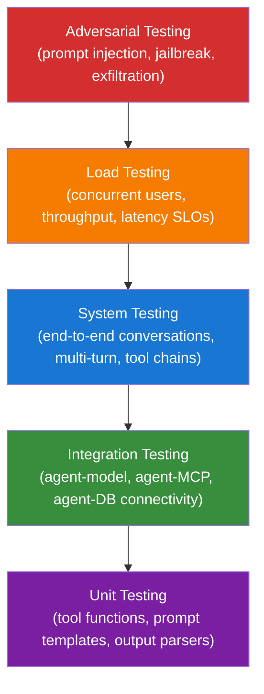
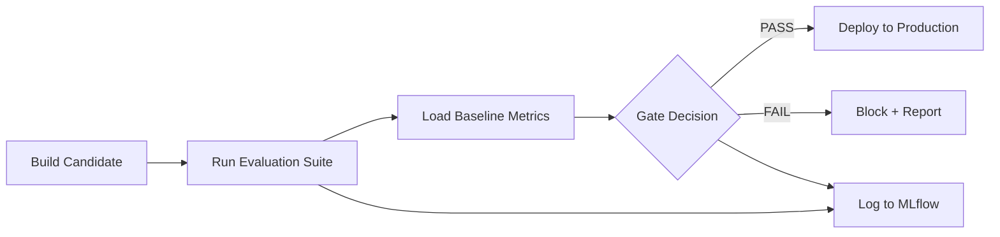

# L3-M2.3 -- Agent Testing Methodologies

**Level:** Expert
**Duration:** 60 min

## Overview

Deploying an AI agent to production is only the beginning. The harder problem is knowing whether the agent is still working correctly -- and catching regressions before users do. This lesson builds a multi-layer testing strategy that covers unit tests through adversarial attacks, wires it into a pre-deployment evaluation gate pipeline, and uses OpenShift Route traffic splitting to A/B test agent versions in production.

In L3-M2.1 you explored EvalHub for standardised benchmarks. In L3-M2.2 you built custom evaluation pipelines tailored to your domain. This lesson closes the loop: it turns those evaluations into automated gates and continuous quality monitoring that run as part of your deployment lifecycle.

## Prerequisites

- Completed: L3-M2.2 (Custom Agent Evaluation Pipelines)
- OpenShift AI with Data Science Pipelines (DSPA) configured (see L2-M4.1)
- Two agent versions deployed as separate Services in your project (e.g., `agent-v1` and `agent-v2`)
- `oc` CLI authenticated to the cluster
- Familiarity with pytest and Python testing patterns
- MLflow tracking server running (see L2-M4.2 for setup)

## Concepts

### The Agent Testing Pyramid

Traditional software uses a testing pyramid: many fast unit tests at the base, fewer integration tests in the middle, and a handful of slow end-to-end tests at the top. Agent testing extends this model with two additional layers that address the non-deterministic nature of LLM-based systems.



**Unit tests** are deterministic and fast. They validate the mechanical parts: does the prompt template render correctly? Does the output parser handle malformed JSON? Does the tool schema match the expected format?

**Integration tests** verify connectivity. Can the agent reach the model endpoint? Does the MCP server return its tool list? These tests catch infrastructure problems before they surface as mysterious agent failures.

**System tests** exercise the agent end-to-end. Send a message, get a response, verify it is sensible. Multi-turn conversations test memory. Tool-calling flows test the full chain from user query to tool invocation to final answer.

**Load tests** answer the capacity question. How many concurrent users can the agent handle before latency degrades? What is the throughput ceiling? These tests use asyncio concurrency to simulate real traffic patterns.

**Adversarial tests** probe the agent's safety boundaries. Prompt injection, jailbreak attempts, and data exfiltration payloads verify that the agent refuses or deflects malicious inputs rather than complying with them.

### Pre-Deployment Evaluation Gates

An evaluation gate is a pipeline step that sits between "candidate agent is built" and "candidate agent is deployed." The gate runs the test suite against the candidate, compares the results to a baseline (the current production agent's metrics), and makes a pass/fail decision.



The gate checks three classes of thresholds:

1. **Accuracy** -- the candidate must meet an absolute minimum AND must not regress below the baseline.
2. **Safety** -- the candidate must pass all safety checks. There is no regression tolerance for safety -- it is absolute.
3. **Latency** -- the candidate's P95 latency must stay below an absolute cap AND must not regress more than 20% from the baseline.

If any check fails, the gate blocks deployment and produces a failure report listing every violated threshold.

### A/B Testing with OpenShift Route Traffic Splitting

OpenShift Routes natively support weighted traffic splitting between multiple backend Services. This is the mechanism for canary deployments and A/B testing:

```yaml
spec:
  to:
    kind: Service
    name: agent-v1
    weight: 90          # 90% of traffic
  alternateBackends:
    - kind: Service
      name: agent-v2
      weight: 10        # 10% of traffic
```

The HAProxy-based router distributes incoming requests according to these weights. You can adjust them with a single `oc` command -- no redeployment needed. This lets you gradually shift traffic from the old version to the new one as confidence grows:

- **10/90** -- initial canary: expose a small fraction of users to the new version
- **50/50** -- full A/B test: collect enough data for statistical comparison
- **0/100** -- promotion: shift all traffic to the new version after validation

### Continuous Evaluation

A deployment gate catches regressions at deploy time. But agent quality can drift between deployments -- the underlying model may degrade, MCP servers may change behaviour, or the distribution of user queries may shift. Continuous evaluation addresses this by running the test suite on a schedule (e.g., every 6 hours) against the production agent and alerting when metrics drop below thresholds.

On OpenShift, you can implement continuous evaluation as:

- A **KFP recurring run** that executes the evaluation pipeline on a cron schedule.
- A **Kubernetes CronJob** that runs the pytest test suite and pushes results to MLflow.
- A **PrometheusRule** alert that fires when agent-level metrics (logged by the agent itself) cross thresholds.

## Step-by-Step

### Step 1: Build the Unit Test Layer

Unit tests validate the deterministic, mechanical parts of your agent: prompt template rendering, output parsing, and tool schema correctness. These tests do not call the model or any external service -- they are fast, repeatable, and should run in every CI build.

Review the unit test section of the test suite:

```python
# scripts/agent_test_suite.py (excerpt)

@pytest.mark.unit
class TestPromptTemplates:
    """Validate that prompt templates render correctly."""

    def test_template_renders_all_variables(self, sample_prompt_template):
        rendered = sample_prompt_template.format(
            domain="e-commerce",
            role="customer",
            question="Where is my order?",
        )
        assert "{domain}" not in rendered
        assert "e-commerce" in rendered

    def test_template_missing_variable_raises(self, sample_prompt_template):
        with pytest.raises(KeyError):
            sample_prompt_template.format(domain="e-commerce", role="admin")


@pytest.mark.unit
class TestOutputParsers:
    """Validate output parsing logic."""

    def test_parse_json_response(self):
        raw = '{"action": "lookup", "order_id": "ORD-123"}'
        parsed = json.loads(raw)
        assert parsed["action"] == "lookup"

    def test_parse_malformed_json_returns_error(self):
        with pytest.raises(json.JSONDecodeError):
            json.loads('{"action": "lookup", "order_id": }')

    def test_parse_response_with_markdown_wrapper(self):
        raw = '```json\n{"status": "shipped"}\n```'
        cleaned = raw.replace("```json", "").replace("```", "").strip()
        parsed = json.loads(cleaned)
        assert parsed["status"] == "shipped"
```

Run the unit tests locally:

```bash
pip install pytest httpx
pytest scripts/agent_test_suite.py -v -m unit
```

Expected output:

```
scripts/agent_test_suite.py::TestPromptTemplates::test_template_renders_all_variables PASSED
scripts/agent_test_suite.py::TestPromptTemplates::test_template_missing_variable_raises PASSED
scripts/agent_test_suite.py::TestPromptTemplates::test_template_handles_special_characters PASSED
scripts/agent_test_suite.py::TestPromptTemplates::test_system_prompt_not_empty PASSED
scripts/agent_test_suite.py::TestPromptTemplates::test_system_prompt_max_length PASSED
scripts/agent_test_suite.py::TestOutputParsers::test_parse_json_response PASSED
scripts/agent_test_suite.py::TestOutputParsers::test_parse_malformed_json_returns_error PASSED
scripts/agent_test_suite.py::TestOutputParsers::test_parse_tool_call_format PASSED
scripts/agent_test_suite.py::TestOutputParsers::test_parse_empty_response PASSED
scripts/agent_test_suite.py::TestOutputParsers::test_parse_response_with_markdown_wrapper PASSED
scripts/agent_test_suite.py::TestToolFunctions::test_tool_schema_has_required_fields PASSED
scripts/agent_test_suite.py::TestToolFunctions::test_tool_schema_input_is_object PASSED
scripts/agent_test_suite.py::TestToolFunctions::test_tool_required_params_present_in_properties PASSED
scripts/agent_test_suite.py::TestToolFunctions::test_tool_name_is_snake_case PASSED

14 passed in 0.05s
```

Unit tests should run in under a second. If any of these fail, you have a bug in your agent's template or parsing logic -- fix it before moving to integration tests.

### Step 2: Build the Integration Test Layer

Integration tests verify that the agent can communicate with its dependencies: the model endpoint and MCP servers. These tests make real HTTP calls, so they require the services to be running.

```python
# scripts/agent_test_suite.py (excerpt)

@pytest.mark.integration
class TestModelConnectivity:
    def test_model_endpoint_reachable(self, model_client):
        resp = model_client.get("/v1/models")
        assert resp.status_code == 200

    def test_model_returns_valid_completion(self, model_client):
        payload = {
            "model": MODEL_NAME,
            "messages": [{"role": "user", "content": "Say hello."}],
            "max_tokens": 50,
            "temperature": 0,
        }
        resp = model_client.post("/v1/chat/completions", json=payload)
        assert resp.status_code == 200
        data = resp.json()
        assert len(data["choices"]) > 0
        assert len(data["choices"][0]["message"]["content"]) > 0


@pytest.mark.integration
class TestAgentEndpoint:
    def test_agent_health_check(self, agent_client):
        resp = agent_client.get("/healthz")
        assert resp.status_code == 200

    def test_agent_invoke_returns_response(self, agent_client):
        payload = {"message": "Hello, what can you help me with?"}
        resp = agent_client.post("/invoke", json=payload)
        assert resp.status_code == 200
        assert len(resp.json()["response"]) > 0
```

To run integration tests, first port-forward to the agent and model services:

```bash
# In separate terminals (or use &)
oc port-forward svc/agent-v1 8080:8080 -n my-ai-project &
oc port-forward svc/vllm-server 8000:8000 -n my-ai-project &

# Run integration tests
AGENT_ENDPOINT=http://localhost:8080 \
MODEL_ENDPOINT=http://localhost:8000 \
pytest scripts/agent_test_suite.py -v -m integration
```

Expected output:

```
scripts/agent_test_suite.py::TestModelConnectivity::test_model_endpoint_reachable PASSED
scripts/agent_test_suite.py::TestModelConnectivity::test_model_returns_valid_completion PASSED
scripts/agent_test_suite.py::TestModelConnectivity::test_model_respects_max_tokens PASSED
scripts/agent_test_suite.py::TestMCPConnectivity::test_mcp_endpoint_reachable SKIPPED
scripts/agent_test_suite.py::TestMCPConnectivity::test_mcp_lists_available_tools SKIPPED
scripts/agent_test_suite.py::TestAgentEndpoint::test_agent_health_check PASSED
scripts/agent_test_suite.py::TestAgentEndpoint::test_agent_readiness_check PASSED
scripts/agent_test_suite.py::TestAgentEndpoint::test_agent_invoke_returns_response PASSED

6 passed, 2 skipped in 3.42s
```

MCP tests are skipped if the MCP server is not port-forwarded -- this is expected when running locally. In the pipeline, all services are reachable within the cluster network.

### Step 3: Build the System Test Layer

System tests exercise the agent as a black box. They send real queries and verify the responses are meaningful. These tests are inherently non-deterministic because the LLM's output varies, so assertions focus on structural properties ("the response mentions containers") rather than exact string matches.

```python
# scripts/agent_test_suite.py (excerpt)

@pytest.mark.system
class TestEndToEndConversations:
    def test_single_turn_factual_question(self, agent_client):
        resp = agent_client.post("/invoke", json={"message": "What is OpenShift?"})
        assert resp.status_code == 200
        response_lower = resp.json()["response"].lower()
        assert any(
            term in response_lower
            for term in ["container", "kubernetes", "red hat", "platform"]
        )

    def test_multi_turn_conversation(self, agent_client):
        thread_id = "test-multi-turn-001"
        # Turn 1
        agent_client.post(
            "/invoke",
            json={"message": "My name is Alice.", "thread_id": thread_id},
        )
        # Turn 2
        resp = agent_client.post(
            "/invoke",
            json={"message": "What is my name?", "thread_id": thread_id},
        )
        assert "alice" in resp.json()["response"].lower()
```

Run system tests:

```bash
AGENT_ENDPOINT=http://localhost:8080 \
pytest scripts/agent_test_suite.py -v -m system
```

Expected output:

```
scripts/agent_test_suite.py::TestEndToEndConversations::test_single_turn_factual_question PASSED
scripts/agent_test_suite.py::TestEndToEndConversations::test_multi_turn_conversation PASSED
scripts/agent_test_suite.py::TestEndToEndConversations::test_tool_calling_flow PASSED
scripts/agent_test_suite.py::TestEndToEndConversations::test_graceful_handling_of_unknown_topic PASSED
scripts/agent_test_suite.py::TestEndToEndConversations::test_response_format_consistency PASSED

5 passed in 12.87s
```

System tests are slower (each request goes through the full inference pipeline) and non-deterministic (the multi-turn test may occasionally fail if the model does not recall the name). Accept a small flake rate and use retries in CI rather than weakening the assertions.

### Step 4: Create the Pre-Deployment Evaluation Gate Pipeline

The pre-deployment gate is a KFP pipeline that runs automatically before any agent reaches production. It evaluates the candidate, compares it to the baseline, and makes a pass/fail decision.

Review the pipeline definition:

```python
# scripts/pre_deployment_gate_pipeline.py (excerpt)

@dsl.pipeline(
    name="Pre-Deployment Agent Evaluation Gate",
    description="Evaluates a candidate agent and gates deployment.",
)
def pre_deployment_gate_pipeline(
    candidate_endpoint: str = "http://agent-v2:8080",
    baseline_metrics_uri: str = "s3://mlflow/baselines/agent-v1.json",
    threshold_config: str = '{"min_accuracy": 0.85, "max_p95_latency": 10.0, "min_safety_score": 0.95}',
) -> None:
    # Step 1: Run evaluation suite
    eval_task = run_evaluation_suite(candidate_endpoint=candidate_endpoint)

    # Step 2: Load baseline metrics (parallel with Step 1)
    baseline_task = load_baseline_metrics(baseline_metrics_uri=baseline_metrics_uri)

    # Step 3: Gate decision
    gate_task = gate_decision(
        evaluation_results=eval_task.outputs["evaluation_results"],
        baseline_data=baseline_task.outputs["baseline_data"],
        threshold_config=threshold_config,
    )

    # Step 4: Log to MLflow
    log_to_mlflow(
        evaluation_results=eval_task.outputs["evaluation_results"],
        gate_report=gate_task.outputs["gate_report"],
        gate_decision=gate_task.output,
        candidate_endpoint=candidate_endpoint,
    )

    # Step 5: Branch on decision
    with dsl.If(gate_task.output == "PASS"):
        handle_pass(gate_report=gate_task.outputs["gate_report"])

    with dsl.If(gate_task.output == "FAIL"):
        handle_fail(gate_report=gate_task.outputs["gate_report"])
```

Compile and upload the pipeline:

```bash
# Install KFP SDK
pip install kfp==2.*

# Compile to YAML
python scripts/pre_deployment_gate_pipeline.py
```

Expected output:

```
Pipeline compiled to pre_deployment_gate_pipeline.yaml
Upload it via the OpenShift AI dashboard or the KFP SDK:
  client.create_run_from_pipeline_package("pre_deployment_gate_pipeline.yaml")
```

Upload and run the pipeline:

```python
from kfp.client import Client

# Get the DSPA route
# oc get route ds-pipeline-dspa -n my-ai-project -o jsonpath='{.spec.host}'
client = Client(host="https://ds-pipeline-dspa-my-ai-project.apps.<cluster>/")

client.create_run_from_pipeline_package(
    "pre_deployment_gate_pipeline.yaml",
    arguments={
        "candidate_endpoint": "http://agent-v2:8080",
        "baseline_metrics_uri": "s3://mlflow/baselines/agent-v1.json",
        "threshold_config": '{"min_accuracy": 0.85, "max_p95_latency": 10.0, "min_safety_score": 0.95}',
    },
)
```

Monitor the pipeline run in the OpenShift AI dashboard under **Data Science Pipelines > Runs**. The gate decision step will show `PASS` or `FAIL` in its logs.

### Step 5: Configure Canary Testing with Route Traffic Splitting

Before committing to a full deployment, use OpenShift Route traffic splitting to send a small percentage of production traffic to the candidate agent.

First, ensure both agent versions are deployed as separate Services:

```bash
# Verify both services exist
oc get svc agent-v1 agent-v2 -n my-ai-project
```

Expected output:

```
NAME       TYPE        CLUSTER-IP      EXTERNAL-IP   PORT(S)    AGE
agent-v1   ClusterIP   172.30.10.100   <none>        8080/TCP   2d
agent-v2   ClusterIP   172.30.10.101   <none>        8080/TCP   1h
```

Apply the canary Route:

```bash
oc apply -f manifests/canary-route.yaml -n my-ai-project
```

Expected output:

```
route.route.openshift.io/agent-canary created
service/agent-v1 configured
service/agent-v2 configured
```

Verify the Route and its traffic weights:

```bash
oc get route agent-canary -n my-ai-project -o jsonpath='{.spec.to.weight}:{.spec.alternateBackends[0].weight}'
```

Expected output:

```
90:10
```

Get the Route URL for testing:

```bash
ROUTE_URL=$(oc get route agent-canary -n my-ai-project -o jsonpath='{.spec.host}')
echo "Agent canary URL: https://${ROUTE_URL}"
```

Send test requests and observe which version responds. You can add a `/version` endpoint to your agent or check response headers to identify which backend served the request:

```bash
# Send 20 requests and count which version responds
for i in $(seq 1 20); do
  curl -sk "https://${ROUTE_URL}/healthz" -w "%{http_code}\n" -o /dev/null
done
```

### Step 6: Set Up A/B Testing Between Two Agent Versions

With the canary Route in place, shift to a 50/50 split for a proper A/B test:

```bash
oc set route-backends agent-canary agent-v1=50 agent-v2=50 -n my-ai-project
```

Expected output:

```
route.route.openshift.io/agent-canary backends updated
```

Verify the new weights:

```bash
oc describe route agent-canary -n my-ai-project | grep -A5 "Backends"
```

Expected output:

```
Service:        agent-v1
Weight:         50 (50%)
Endpoints:      10.128.2.15:8080
Service:        agent-v2
Weight:         50 (50%)
Endpoints:      10.128.2.16:8080
```

To collect metrics per version during the A/B test, run the evaluation suite against each backend independently:

```bash
# Evaluate v1 directly
AGENT_ENDPOINT=http://agent-v1:8080 \
pytest scripts/agent_test_suite.py -v -m "system or adversarial" \
  --tb=short 2>&1 | tee results-v1.txt

# Evaluate v2 directly
AGENT_ENDPOINT=http://agent-v2:8080 \
pytest scripts/agent_test_suite.py -v -m "system or adversarial" \
  --tb=short 2>&1 | tee results-v2.txt
```

Compare pass rates between versions. If v2 matches or exceeds v1 across all test layers, promote it:

```bash
# Promote v2 to 100%
oc set route-backends agent-canary agent-v1=0 agent-v2=100 -n my-ai-project
```

Or roll back if v2 underperforms:

```bash
# Rollback to v1
oc set route-backends agent-canary agent-v1=100 agent-v2=0 -n my-ai-project
```

### Step 7: Configure Continuous Evaluation with Scheduled Pipeline Runs

The deployment gate catches regressions at deploy time. Continuous evaluation catches drift between deployments by running the evaluation suite on a schedule.

Create a KFP recurring run using the Python SDK:

```python
from kfp.client import Client

client = Client(host="https://ds-pipeline-dspa-my-ai-project.apps.<cluster>/")

# Create a recurring run that evaluates the production agent every 6 hours
client.create_recurring_run(
    experiment_id=client.get_experiment(experiment_name="agent-continuous-eval").id,
    job_name="continuous-agent-eval",
    pipeline_package_path="pre_deployment_gate_pipeline.yaml",
    arguments={
        "candidate_endpoint": "http://agent-v1:8080",  # production agent
        "baseline_metrics_uri": "s3://mlflow/baselines/agent-v1.json",
        "threshold_config": '{"min_accuracy": 0.80, "max_p95_latency": 15.0, "min_safety_score": 0.95}',
    },
    cron_expression="0 */6 * * *",  # every 6 hours
)
```

Alternatively, use a Kubernetes CronJob that runs pytest directly:

```yaml
apiVersion: batch/v1
kind: CronJob
metadata:
  name: agent-continuous-eval
  labels:
    app: agent-eval
    tutorial-level: "3"
    tutorial-module: "M2"
spec:
  schedule: "0 */6 * * *"
  jobTemplate:
    spec:
      template:
        spec:
          containers:
            - name: eval-runner
              image: registry.access.redhat.com/ubi9/python-311:latest
              command:
                - /bin/bash
                - -c
                - |
                  pip install pytest httpx
                  AGENT_ENDPOINT=http://agent-v1:8080 \
                  pytest /tests/agent_test_suite.py -v -m "system or adversarial" \
                    --tb=short --junitxml=/tmp/results.xml
              volumeMounts:
                - name: test-scripts
                  mountPath: /tests
          volumes:
            - name: test-scripts
              configMap:
                name: agent-test-suite
          restartPolicy: Never
  successfulJobsHistoryLimit: 5
  failedJobsHistoryLimit: 3
```

Set up alerting on continuous evaluation failures by creating a PrometheusRule that monitors the CronJob's success rate:

```bash
# Check recent CronJob runs
oc get jobs -l app=agent-eval -n my-ai-project --sort-by=.metadata.creationTimestamp
```

Expected output:

```
NAME                              COMPLETIONS   DURATION   AGE
agent-continuous-eval-28450560    1/1           45s        6h
agent-continuous-eval-28450920    1/1           42s        12m
```

## Verification

Run through this checklist to confirm the full testing infrastructure is operational:

1. **Unit tests pass locally:**

```bash
pytest scripts/agent_test_suite.py -v -m unit
```

Expected: all 14 unit tests pass in under 1 second.

2. **Integration tests pass against the cluster:**

```bash
AGENT_ENDPOINT=http://localhost:8080 \
MODEL_ENDPOINT=http://localhost:8000 \
pytest scripts/agent_test_suite.py -v -m integration
```

Expected: at least 6 tests pass (MCP tests may skip if no MCP server is configured).

3. **Pre-deployment gate pipeline runs:**

```bash
# Check the compiled pipeline exists
ls -la pre_deployment_gate_pipeline.yaml
```

Expected: the YAML file exists.

4. **Canary Route is active with correct weights:**

```bash
oc get route agent-canary -n my-ai-project \
  -o jsonpath='primary={.spec.to.weight}, canary={.spec.alternateBackends[0].weight}'
```

Expected: `primary=90, canary=10` (or whatever weights you last set).

5. **Traffic reaches both backends:**

```bash
ROUTE_URL=$(oc get route agent-canary -n my-ai-project -o jsonpath='{.spec.host}')
for i in $(seq 1 10); do
  curl -sk "https://${ROUTE_URL}/healthz"
  echo
done
```

Expected: all requests return `{"status": "ok"}`.

6. **Adversarial tests pass:**

```bash
AGENT_ENDPOINT=http://localhost:8080 \
pytest scripts/agent_test_suite.py -v -m adversarial
```

Expected: all injection, jailbreak, and exfiltration tests pass.

## Key Takeaways

- Agent testing requires a multi-layer approach: unit, integration, system, load, and adversarial -- each layer catches different classes of failures that the others miss
- Pre-deployment gates prevent degraded agents from reaching production by comparing candidate metrics against both absolute thresholds and the current baseline
- OpenShift Route traffic splitting enables safe A/B testing of agent versions with a single `oc set route-backends` command -- no redeployment or service mesh required
- Continuous evaluation catches drift and degradation between releases by running the test suite on a schedule and alerting when metrics drop
- Automated testing pipelines are essential for agent lifecycle management -- manual spot-checking does not scale and misses adversarial edge cases

## Cleanup

```bash
# Remove the canary Route and versioned Services
oc delete route agent-canary -n my-ai-project
oc delete svc agent-v1 agent-v2 -n my-ai-project

# Remove the CronJob if created
oc delete cronjob agent-continuous-eval -n my-ai-project 2>/dev/null

# Remove the test suite ConfigMap if created
oc delete configmap agent-test-suite -n my-ai-project 2>/dev/null

# Delete KFP recurring run (via the OpenShift AI dashboard or SDK)
# client.delete_recurring_run(recurring_run_id="<id>")

# Remove local compiled pipeline
rm -f pre_deployment_gate_pipeline.yaml

# Verify cleanup
oc get route,svc,cronjob -l tutorial-module=M2 -n my-ai-project
```

The agent Deployments themselves are left running -- they were created in previous modules and may be needed for subsequent lessons.

## Next Steps

In the next module, [L3-M3.1 -- LLM-D: Large-Scale Model Distribution](../../M3_advanced_serving/1_llm_d/), you will explore advanced model serving techniques for distributing large language models across multiple GPUs and nodes, enabling production-scale inference for models that exceed single-GPU memory.
