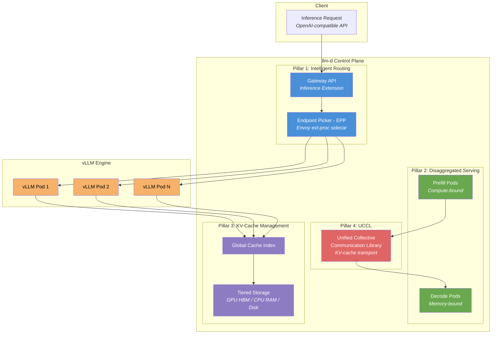

# L3-M3.1 -- llm-d: Distributed LLM Inference

**Level:** Expert
**Duration:** 60 min

## Overview

You have deployed models through KServe, evaluated them with EvalHub, and governed them with RBAC and Authorino. All of those deployments used KServe's default request routing -- round-robin across vLLM replicas. That approach treats every inference pod as interchangeable, ignoring the fact that LLMs maintain expensive state (the KV cache) that cannot be rebuilt cheaply. llm-d is a Kubernetes-native distributed inference stack that sits between KServe and vLLM, adding inference-aware routing, KV-cache management, and disaggregated prefill/decode serving. In this lesson you will deploy a model using the LLMInferenceService CRD, examine how the Endpoint Picker (EPP) routes requests based on cache locality and load, and understand when disaggregated serving helps versus hurts.

## Prerequisites

- Completed: [L3-M2.3 -- Agent Testing](../../M2_agent_evaluation/3_agent_testing/)
- Completed: [L1-M2.2 -- Deploying Gemma](../../../level_1/M2_model_serving/2_deploying_gemma/) (familiarity with KServe-based model serving)
- OpenShift AI 3.4+ with KServe component set to `Managed` in the DataScienceCluster
- At least one NVIDIA GPU node available in the cluster (L4 minimum; A100/B200 for disaggregated serving)
- `oc` CLI authenticated with project-admin or cluster-admin privileges
- Hugging Face token configured as a Kubernetes Secret (for gated model access)

Verify KServe is running and the llm-d scheduler is available:

```bash
oc get datasciencecluster default-dsc -o jsonpath='{.spec.components.kserve}' | python3 -m json.tool
```

Expected output:

```json
{
    "managementState": "Managed",
    "serving": {
        "managementState": "Managed"
    }
}
```

Verify GPU availability:

```bash
oc get nodes -l nvidia.com/gpu.present=true -o custom-columns=\
NAME:.metadata.name,\
GPU_COUNT:.status.capacity.nvidia\.com/gpu,\
GPU_PRODUCT:.metadata.labels.nvidia\.com/gpu\.product
```

Expected output:

```
NAME                  GPU_COUNT   GPU_PRODUCT
gpu-worker-0          1           NVIDIA-L4
```

## Concepts

### Why llm-d Exists

Kubernetes is a general-purpose container orchestrator. It knows about CPU, memory, and (with the device plugin) GPU counts. It knows nothing about KV caches, GPU memory topology, token generation patterns, or prefix sharing between requests.

When you deploy a model through standard KServe, the Service load-balances requests across vLLM replicas using round-robin or random selection. This means:

1. **No cache locality.** Two requests sharing the same system prompt hit different pods. Each pod computes the identical prefix independently, wasting GPU FLOPS.
2. **No load awareness.** A pod processing a 100K-token context window receives new requests at the same rate as an idle pod, leading to queuing and tail-latency spikes.
3. **Coupled compute stages.** Prefill (processing the full prompt) is compute-bound and benefits from high FLOPS. Decode (generating tokens one at a time) is memory-bandwidth-bound and benefits from high memory bandwidth. Standard KServe runs both on the same pod, making it impossible to optimize hardware independently for each stage.

llm-d was donated to the CNCF Sandbox in March 2026 by Red Hat, Google Cloud, and IBM Research to solve exactly these problems. It adds an inference-aware layer between the Kubernetes control plane and the vLLM engine, making routing, scaling, and resource allocation decisions based on LLM-specific signals.

---

### Architecture: Four Pillars

llm-d is organized around four pillars that address the gaps between Kubernetes-native orchestration and LLM inference requirements:



---

#### Pillar 1: Intelligent Routing (EPP)

The Endpoint Picker (EPP) is the core routing component. It runs as a sidecar alongside the Envoy-based gateway, implementing the Envoy external processing (`ext-proc`) protocol. Every inference request passes through the EPP before reaching a vLLM pod.

The EPP executes a four-stage pipeline for each request:

| Stage | What it does | Why it matters |
|-------|-------------|----------------|
| **Discover** | Enumerates all available vLLM pods and their current state (queue depth, active requests, cached prefixes) | Builds a real-time picture of the serving fleet |
| **Filter** | Removes pods that are overloaded (queue > threshold), draining, or lack sufficient GPU memory for the request | Prevents routing to pods that would queue or OOM |
| **Score** | Assigns a composite score based on three weighted signals: prefix cache hit ratio, current load, and session affinity | Selects the pod most likely to serve the request efficiently |
| **Select** | Picks the pod with the highest score; breaks ties with lowest queue depth | Deterministic final selection |

The scoring weights are configurable. The default configuration (see `manifests/epp-config.yaml`) weights prefix cache at 60%, load at 30%, and session affinity at 10%. This prioritization reflects the dominant cost factor in LLM inference: recomputing a prefix cache costs far more GPU time than the marginal overhead of routing to a slightly busier pod.

The EPP implements the Gateway API Inference Extension (GAIE), a Kubernetes-native API for inference-aware load balancing that graduated to v1alpha1 in the Gateway API project.

> Production deployments using EPP's cache-aware routing report 87%+ prefix cache hit rates, compared to ~15% with random routing. For workloads with shared system prompts (chatbots, RAG pipelines, agent orchestration), this translates to a 2-3x reduction in time-to-first-token (TTFT).

---

#### Pillar 2: Disaggregated Prefill/Decode

Standard LLM inference runs two phases on the same GPU:

1. **Prefill** -- processes the entire input prompt in parallel, computing attention for all input tokens. This is compute-bound (FLOPS-limited).
2. **Decode** -- generates output tokens one at a time autoregressively. This is memory-bandwidth-bound (GB/s-limited).

These phases have fundamentally different hardware requirements. Prefill benefits from high-FLOPS GPUs (like H100 SXM). Decode benefits from high-memory-bandwidth GPUs (like B200 with HBM3e). Running both on the same GPU means the hardware is optimal for neither phase at any given moment.

Disaggregated serving separates these phases onto different pod pools:

```
                  +-----------------+
                  |  Prefill Pod    |
                  |  (H100 SXM)    |
     Prompt ----> |  Compute KV    |
                  |  cache entries  |
                  +--------+--------+
                           |
                    KV cache transfer
                      (via UCCL)
                           |
                  +--------v--------+
                  |  Decode Pod     |
                  |  (B200 HBM3e)  |
                  |  Generate      |
     Tokens <---- |  tokens        |
                  +-----------------+
```

Each pool scales independently. A workload with long prompts but short outputs scales up prefill pods. A chatbot with short prompts but long streaming outputs scales up decode pods.

> Disaggregated serving adds network transfer latency for the KV cache handoff. For small models (< 8B parameters) or short prompts (< 1K tokens), the transfer overhead exceeds the benefit of specialization. Use disaggregated serving only when prefill latency is a measured bottleneck, not as a default.

---

#### Pillar 3: KV-Cache Management

The KV cache stores the key-value attention states computed during prefill. It is the most expensive intermediate artifact in LLM inference -- for a 70B model processing a 4K context, the KV cache consumes approximately 2.5 GB of GPU memory per request.

llm-d manages the KV cache hierarchically across three storage tiers:

| Tier | Storage | Latency | Capacity | Use case |
|------|---------|---------|----------|----------|
| **Tier 0** | GPU HBM | ~1 us | 40-192 GB per GPU | Active requests, hot prefixes |
| **Tier 1** | Host CPU RAM | ~10 us | 256 GB - 2 TB per node | Warm prefixes, recently evicted |
| **Tier 2** | NVMe / Network storage | ~100 us | Terabytes | Cold prefixes, long-term reuse |

A global cache index tracks which prefix hashes are stored on which pods and in which tier. When the EPP scores pods for a new request, it queries this index to determine cache hit probability -- a pod with the relevant prefix in Tier 0 scores highest, a pod with the prefix in Tier 1 scores lower (but still higher than a pod with no cached prefix), and a pod with nothing cached scores lowest.

This tiered approach means that a system prompt shared across thousands of requests is computed once, stored in GPU HBM, and reused until memory pressure evicts it to CPU RAM. Even after eviction, the prefix can be restored from Tier 1 in microseconds rather than recomputed from scratch (milliseconds to seconds depending on length).

---

#### Pillar 4: UCCL (Unified Collective Communication Library)

UCCL handles KV-cache transport between pods for disaggregated serving. When a prefill pod finishes computing the KV cache, UCCL transfers it to the decode pod.

UCCL abstracts over the underlying communication libraries:

| Library | Hardware | Transport |
|---------|----------|-----------|
| NCCL | NVIDIA GPUs | NVLink, PCIe, InfiniBand |
| RCCL | AMD GPUs (ROCm) | Infinity Fabric, PCIe |
| MCCL | Mixed GPU environments | Software-defined |

UCCL adds a host-resident software transport layer with adaptive congestion control. This means KV cache transfers work even without RDMA or GPUDirect -- though those hardware features significantly improve throughput when available. UCCL also supports GPUDirect TCP-X for high-bandwidth transfers over standard TCP connections, useful in cloud environments where InfiniBand is not available.

---

### LLMInferenceService CRD

llm-d introduces the `LLMInferenceService` custom resource as a replacement for the standard `InferenceService` when deploying LLM workloads. The key differences:

| Aspect | InferenceService | LLMInferenceService |
|--------|-----------------|---------------------|
| **API Group** | `serving.kserve.io/v1beta1` | `serving.kserve.io/v1alpha1` |
| **Routing** | Standard K8s Service (round-robin) | EPP-based intelligent routing |
| **Model URI** | `storageUri` pointing to S3/PVC | `spec.model.uri` with `hf://` protocol |
| **Router config** | None | `spec.router` with gateway/route/scheduler |
| **Cache management** | None | Automatic via llm-d KV-cache layer |
| **Scaling** | HPA on CPU/memory | Inference-aware (queue depth, KV-cache pressure) |

The `LLMInferenceService` CRD is part of KServe v1alpha1 and is managed by the same KServe controller. When you create an LLMInferenceService, the controller provisions the vLLM pods, the EPP sidecar, and the Gateway API resources automatically.

---

### LLMInferenceServiceConfig

The `LLMInferenceServiceConfig` defines the serving runtime configuration for llm-d workloads. It replaces the `ServingRuntime` CR that you used for standard KServe deployments.

OpenShift AI 3.4+ ships with pre-installed configs:

| Config Name | Engine | Accelerator |
|-------------|--------|-------------|
| vLLM NVIDIA CUDA GPU LLMInferenceServiceConfig | vLLM | NVIDIA CUDA GPUs |

These configs define the container image, default arguments, and resource templates for the vLLM pods. You do not need to create a custom config unless you need non-default vLLM arguments (such as custom quantization settings or tensor-parallel configuration).

---

### When to Use llm-d vs Standard KServe

| Criteria | Standard KServe | llm-d |
|----------|----------------|-------|
| **Model type** | Any (tabular, vision, NLP, LLM) | LLMs only |
| **Request pattern** | Uniform, stateless | Conversational, prefix-heavy |
| **Scale** | 1-3 replicas, single model | Multi-replica, multi-model MaaS |
| **GPU utilization target** | Best-effort | 90%+ with cache-aware routing |
| **Latency sensitivity** | Moderate | Sub-400ms TTFT required |
| **Operational complexity** | Low | Higher (EPP, cache management) |
| **Maturity** | GA (stable) | Tech Preview (alpha CRD) |

**Rule of thumb:** Use llm-d when you are running production LLM workloads at scale with multiple replicas, especially when requests share common system prompts (chatbots, RAG, agents). Use standard KServe for everything else -- development, testing, non-LLM models, and single-replica deployments where routing optimization provides no benefit.

## Step-by-Step

### Step 1: Verify llm-d Components

llm-d is deployed as part of the KServe component in the DataScienceCluster. Check the KServe controller version and verify the LLMInferenceService CRD is registered:

```bash
oc get crd llminferenceservices.serving.kserve.io
```

Expected output:

```
NAME                                        CREATED AT
llminferenceservices.serving.kserve.io      2026-06-15T10:30:00Z
```

Check the KServe controller pod to confirm it includes llm-d scheduler support:

```bash
oc get pods -n redhat-ods-applications -l control-plane=kserve-controller-manager \
  -o custom-columns=NAME:.metadata.name,IMAGE:.spec.containers[0].image
```

Expected output:

```
NAME                                          IMAGE
kserve-controller-manager-7f8b9d4c7-x2k9p    registry.redhat.io/rhoai/odh-kserve-controller-rhel8:...
```

Verify the EPP (Endpoint Picker) component is available:

```bash
oc get crd endpointpickers.inference.networking.x-k8s.io 2>/dev/null && \
  echo "EPP CRD registered" || echo "EPP CRD not found"
```

Expected output:

```
EPP CRD registered
```

---

### Step 2: Explore the LLMInferenceService CRD

Examine the CRD to understand the available fields:

```bash
oc api-resources | grep -i llm
```

Expected output:

```
llminferenceservices                          serving.kserve.io/v1alpha1     true         LLMInferenceService
llminferenceserviceconfigs                    serving.kserve.io/v1alpha1     true         LLMInferenceServiceConfig
```

Explore the CRD structure:

```bash
oc explain llminferenceservice.spec
```

Expected output (abbreviated):

```
KIND:     LLMInferenceService
VERSION:  serving.kserve.io/v1alpha1

RESOURCE: spec <Object>

DESCRIPTION:
     LLMInferenceServiceSpec defines the desired state of LLMInferenceService

FIELDS:
   model        <Object>
     Model configuration including name and URI

   replicas     <integer>
     Number of model serving replicas

   router       <Object>
     Router configuration for intelligent request routing

   template     <Object>
     Pod template specification for the serving containers
```

Drill into the model spec:

```bash
oc explain llminferenceservice.spec.model
```

Expected output:

```
KIND:     LLMInferenceService
VERSION:  serving.kserve.io/v1alpha1

RESOURCE: model <Object>

FIELDS:
   name    <string>
     Name identifier for the model

   uri     <string>
     URI of the model. Supports hf:// protocol for Hugging Face models
```

Drill into the router spec:

```bash
oc explain llminferenceservice.spec.router
```

Expected output:

```
KIND:     LLMInferenceService
VERSION:  serving.kserve.io/v1alpha1

RESOURCE: router <Object>

FIELDS:
   gateway      <Object>
     Gateway API configuration for external access

   route        <Object>
     OpenShift Route configuration

   scheduler    <Object>
     Inference-aware scheduler configuration (EPP)
```

---

### Step 3: List Pre-installed LLMInferenceServiceConfigs

Check which serving runtime configs are available out of the box:

```bash
oc get llminferenceserviceconfigs -n redhat-ods-applications
```

Expected output:

```
NAME                                                AGE
vllm-nvidia-cuda-gpu-llminferenceserviceconfig      14d
```

Examine the default config:

```bash
oc get llminferenceserviceconfig vllm-nvidia-cuda-gpu-llminferenceserviceconfig \
  -n redhat-ods-applications -o yaml
```

Expected output (abbreviated):

```yaml
apiVersion: serving.kserve.io/v1alpha1
kind: LLMInferenceServiceConfig
metadata:
  name: vllm-nvidia-cuda-gpu-llminferenceserviceconfig
  namespace: redhat-ods-applications
spec:
  containers:
    - name: main
      image: registry.redhat.io/rhoai/odh-vllm-rhel8:...
      command:
        - python3
        - -m
        - vllm.entrypoints.openai.api_server
      args:
        - --port=8080
        - --trust-remote-code
        - --enable-chunked-prefill
      ports:
        - containerPort: 8080
          protocol: TCP
```

This config defines the vLLM container image, the command to start the OpenAI-compatible API server, and the default arguments. The `--enable-chunked-prefill` flag is notable -- it allows vLLM to overlap prefill and decode operations on the same GPU, improving throughput in non-disaggregated mode.

---

### Step 4: Create the Serving Namespace and Deploy Gemma4-e4b on llm-d

Create a dedicated namespace for llm-d serving:

```bash
oc new-project llmd-serving
```

Expected output:

```
Now using project "llmd-serving" on server "https://api.example.com:6443".
```

Ensure your Hugging Face token is available as a Secret in the namespace (required for gated models):

```bash
oc get secret hf-token -n llmd-serving 2>/dev/null || \
  oc create secret generic hf-token \
    --from-literal=HF_TOKEN=<your-token> \
    -n llmd-serving
```

Review the LLMInferenceService manifest:

```bash
cat manifests/llminferenceservice.yaml
```

Apply the manifest:

```bash
oc apply -f manifests/llminferenceservice.yaml
```

Expected output:

```
llminferenceservice.serving.kserve.io/gemma-4-e4b-llmd created
```

---

### Step 5: Monitor the Deployment

The LLMInferenceService controller creates several resources. Watch the deployment unfold:

```bash
oc get llminferenceservice gemma-4-e4b-llmd -n llmd-serving -w
```

Expected output (status progresses through phases):

```
NAME               MODEL              REPLICAS   READY   STATUS          AGE
gemma-4-e4b-llmd   gemma-4-e4b-llmd   1          0/1     Provisioning    5s
gemma-4-e4b-llmd   gemma-4-e4b-llmd   1          0/1     ModelLoading    30s
gemma-4-e4b-llmd   gemma-4-e4b-llmd   1          1/1     Ready           2m
```

Press `Ctrl+C` once the status shows `Ready`.

Watch the pods that were created:

```bash
oc get pods -n llmd-serving -l serving.kserve.io/llminferenceservice=gemma-4-e4b-llmd
```

Expected output:

```
NAME                                                READY   STATUS    RESTARTS   AGE
gemma-4-e4b-llmd-predictor-0                        2/2     Running   0          2m
```

Notice the pod shows `2/2` containers ready. The two containers are:

1. **main** -- the vLLM inference engine serving the model
2. **epp** -- the Endpoint Picker sidecar handling intelligent routing

Verify both containers are running:

```bash
oc get pod gemma-4-e4b-llmd-predictor-0 -n llmd-serving \
  -o jsonpath='{range .spec.containers[*]}{.name}{"\t"}{.image}{"\n"}{end}'
```

Expected output:

```
main    registry.redhat.io/rhoai/odh-vllm-rhel8:...
epp     registry.redhat.io/rhoai/odh-llm-d-epp-rhel8:...
```

Check the Gateway and Route that were automatically created:

```bash
oc get gateway -n llmd-serving
```

Expected output:

```
NAME                    CLASS          ADDRESS   PROGRAMMED   AGE
gemma-4-e4b-llmd-gw     istio                   True         2m
```

```bash
oc get route -n llmd-serving
```

Expected output:

```
NAME                    HOST/PORT                                           PATH   SERVICES                    PORT   TERMINATION   WILDCARD
gemma-4-e4b-llmd        gemma-4-e4b-llmd-llmd-serving.apps.example.com            gemma-4-e4b-llmd-service    8080   edge          None
```

---

### Step 6: Test Inference

Get the model endpoint URL:

```bash
ENDPOINT=$(oc get llminferenceservice gemma-4-e4b-llmd -n llmd-serving \
  -o jsonpath='{.status.url}')
echo "Model endpoint: $ENDPOINT"
```

Expected output:

```
Model endpoint: https://gemma-4-e4b-llmd-llmd-serving.apps.example.com
```

Verify the model is loaded by listing available models (OpenAI-compatible API):

```bash
curl -sk "$ENDPOINT/v1/models" | python3 -m json.tool
```

Expected output:

```json
{
    "object": "list",
    "data": [
        {
            "id": "google/gemma-4-E4B-it",
            "object": "model",
            "created": 1719835200,
            "owned_by": "vllm",
            "root": "google/gemma-4-E4B-it"
        }
    ]
}
```

Send a chat completion request:

```bash
curl -sk "$ENDPOINT/v1/chat/completions" \
  -H "Content-Type: application/json" \
  -d '{
    "model": "google/gemma-4-E4B-it",
    "messages": [
      {"role": "user", "content": "Explain the concept of KV cache in transformer models in 3 sentences."}
    ],
    "max_tokens": 150,
    "temperature": 0.7
  }' | python3 -m json.tool
```

Expected output:

```json
{
    "id": "chatcmpl-abc123",
    "object": "chat.completion",
    "created": 1719835300,
    "model": "google/gemma-4-E4B-it",
    "choices": [
        {
            "index": 0,
            "message": {
                "role": "assistant",
                "content": "The KV cache stores the key and value tensors computed during the attention mechanism for all previously processed tokens, avoiding redundant recomputation during autoregressive decoding. Each new token only needs to compute its own key-value pair and attend to all cached entries, reducing the computational cost from O(n^2) to O(n) per step. This caching is essential for efficient inference but consumes significant GPU memory, scaling linearly with sequence length, batch size, and model depth."
            },
            "finish_reason": "stop"
        }
    ],
    "usage": {
        "prompt_tokens": 22,
        "completion_tokens": 89,
        "total_tokens": 111
    }
}
```

Send a second request with the same system prompt to test prefix cache reuse:

```bash
# First request establishes the prefix cache
curl -sk "$ENDPOINT/v1/chat/completions" \
  -H "Content-Type: application/json" \
  -d '{
    "model": "google/gemma-4-E4B-it",
    "messages": [
      {"role": "system", "content": "You are a Kubernetes expert. Answer questions about container orchestration concisely."},
      {"role": "user", "content": "What is a Pod?"}
    ],
    "max_tokens": 100
  }' | python3 -m json.tool

# Second request shares the system prompt -- EPP should route to the same pod
curl -sk "$ENDPOINT/v1/chat/completions" \
  -H "Content-Type: application/json" \
  -d '{
    "model": "google/gemma-4-E4B-it",
    "messages": [
      {"role": "system", "content": "You are a Kubernetes expert. Answer questions about container orchestration concisely."},
      {"role": "user", "content": "What is a Deployment?"}
    ],
    "max_tokens": 100
  }' | python3 -m json.tool
```

With a single replica, both requests go to the same pod. The benefit of cache-aware routing becomes visible with multiple replicas (Step 8) -- the EPP ensures that requests sharing the same system prompt are routed to the pod that already has that prefix cached, rather than computing it from scratch on a random pod.

---

### Step 7: Examine the EPP Configuration

The EPP's scoring pipeline is configured via a ConfigMap. Review the config provided with this lesson:

```bash
cat manifests/epp-config.yaml
```

The pipeline has three stages:

**Filters** -- remove unsuitable pods before scoring:

- `decode-filter`: excludes pods currently in prefill-only mode (relevant for disaggregated setups)
- `low-queue-filter`: excludes pods with queue depth above the threshold (default: 100 pending requests)

**Scorers** -- assign weighted scores to remaining pods:

- `prefix-cache-scorer` (weight 60): queries the global cache index to score pods by the percentage of the request's prefix that is already cached. A pod with 100% of the prefix cached scores 60; a pod with 50% scores 30.
- `load-scorer` (weight 30): inversely scores pods by current load (active requests + queue depth). The least loaded pod scores 30; the most loaded scores 0.
- `session-affinity-scorer` (weight 10): scores pods based on whether they previously served requests from the same session/user. Maintains conversational locality.

**Picker** -- selects the winning pod:

- `max-score-picker`: selects the pod with the highest composite score. If multiple pods tie, picks the one with the lowest queue depth.

Apply the config to see the EPP pick it up:

```bash
oc apply -f manifests/epp-config.yaml
```

Expected output:

```
configmap/llmd-epp-config created
```

Check the EPP container logs to confirm it loaded the configuration:

```bash
oc logs gemma-4-e4b-llmd-predictor-0 -c epp -n llmd-serving --tail=20
```

Expected output (look for config-related log lines):

```
INFO  Loaded EPP configuration from configmap llmd-epp-config
INFO  Pipeline: 2 filters, 3 scorers, 1 picker
INFO  Scorer weights: prefix-cache=60, load=30, session-affinity=10
INFO  Watching 1 endpoints for model gemma-4-e4b-llmd
```

---

### Step 8: Understanding Disaggregated Serving

Disaggregated serving separates the prefill and decode phases onto dedicated pod pools. This section explains the configuration and when to use it. On a single-GPU sandbox, you can review the YAML structure and understand the concepts, but deploying disaggregated serving requires at least two GPUs (one for prefill, one for decode).

The LLMInferenceService manifest for disaggregated serving adds pool annotations and separates the replica configuration:

```yaml
# DIFF: changes from the base llminferenceservice.yaml
# This is for reference only -- do not apply on single-GPU clusters
apiVersion: serving.kserve.io/v1alpha1
kind: LLMInferenceService
metadata:
  name: gemma-4-e4b-disagg
  namespace: llmd-serving
spec:
  model:
    name: gemma-4-e4b-disagg
    uri: "hf://google/gemma-4-E4B-it"
  # Disaggregated mode requires separate pool configs
  pools:
    - name: prefill
      replicas: 1
      role: prefill
      template:
        containers:
          - name: main
            args:
              - --kv-transfer-config
              - '{"kv_connector": "PyNcclConnector", "kv_role": "kv_producer"}'
            resources:
              limits:
                nvidia.com/gpu: "1"
              requests:
                nvidia.com/gpu: "1"
    - name: decode
      replicas: 1
      role: decode
      template:
        containers:
          - name: main
            args:
              - --kv-transfer-config
              - '{"kv_connector": "PyNcclConnector", "kv_role": "kv_consumer"}'
            resources:
              limits:
                nvidia.com/gpu: "1"
              requests:
                nvidia.com/gpu: "1"
  router:
    gateway: {}
    route: {}
    scheduler: {}
```

Key differences from the base manifest:

| Field | Base (unified) | Disaggregated |
|-------|---------------|---------------|
| `spec.replicas` | `1` | Removed -- defined per pool |
| `spec.pools` | Not present | Array of pool definitions |
| `spec.pools[].role` | N/A | `prefill` or `decode` |
| `spec.pools[].replicas` | N/A | Independent scaling per role |
| vLLM args | Default | `--kv-transfer-config` specifying producer/consumer role |

The `kv_connector: "PyNcclConnector"` tells vLLM to use NCCL (via UCCL) for KV cache transfer. The prefill pod is the `kv_producer` (computes KV cache and sends it) and the decode pod is the `kv_consumer` (receives KV cache and generates tokens).

**When disaggregated serving helps:**

- Long input prompts (> 4K tokens) with short outputs -- prefill dominates latency
- High request throughput where prefill and decode contend for the same GPU
- Mixed workloads where some requests need large prefill and others need long decode
- Multi-GPU nodes where you can assign different GPU types to each role

**When disaggregated serving hurts:**

- Small models (< 8B parameters) where KV cache transfer overhead exceeds prefill savings
- Short prompts (< 1K tokens) where prefill is already fast
- Single-GPU setups (no second GPU for the decode pool)
- Low request rates where contention is not a bottleneck

---

### Step 9: Compare llm-d vs Standard KServe Performance

This section provides the metrics and commands you would use to compare llm-d performance against standard KServe serving. Actual benchmarking requires sustained load generation (e.g., with `llmperf` or `locust`), which is beyond sandbox GPU quotas. The table below summarizes published performance characteristics.

**Performance comparison (published benchmarks):**

| Metric | Standard KServe + vLLM | llm-d + vLLM | Improvement |
|--------|----------------------|--------------|-------------|
| Prefix cache hit rate | ~15% (random routing) | 87%+ (EPP routing) | ~6x |
| Time to first token (TTFT) | 800-1200 ms | < 400 ms | 2-3x |
| Inter-token latency (ITL) | 15-25 ms | 12-18 ms | ~1.3x |
| GPU utilization | 40-60% | 85-90% | ~1.7x |
| Throughput (B200, decode) | ~1.8k tok/s | ~3.1k tok/s | ~1.7x |

> These numbers are from benchmarks on NVIDIA B200 GPUs with 70B parameter models and shared system prompts. Your results will vary based on model size, prompt characteristics, GPU type, and request patterns.

**Commands to query llm-d metrics in production:**

Check the EPP's cache hit rate:

```bash
# Query Prometheus for EPP cache hit metrics
oc exec -n llmd-serving gemma-4-e4b-llmd-predictor-0 -c epp -- \
  curl -s localhost:9090/metrics | grep prefix_cache
```

Expected metric output:

```
# HELP epp_prefix_cache_hit_ratio Ratio of requests with prefix cache hits
# TYPE epp_prefix_cache_hit_ratio gauge
epp_prefix_cache_hit_ratio{model="gemma-4-e4b-llmd"} 0.87
```

Check vLLM engine metrics:

```bash
# Query vLLM metrics endpoint
oc exec -n llmd-serving gemma-4-e4b-llmd-predictor-0 -c main -- \
  curl -s localhost:8080/metrics | grep -E "(gpu_cache|request_latency)"
```

Expected metric output:

```
# HELP vllm:gpu_cache_usage_perc GPU KV-cache usage percentage
# TYPE vllm:gpu_cache_usage_perc gauge
vllm:gpu_cache_usage_perc 0.45
# HELP vllm:avg_prompt_throughput_toks_per_s Average prompt throughput (tokens/s)
# TYPE vllm:avg_prompt_throughput_toks_per_s gauge
vllm:avg_prompt_throughput_toks_per_s 1250.0
# HELP vllm:avg_generation_throughput_toks_per_s Average generation throughput (tokens/s)
# TYPE vllm:avg_generation_throughput_toks_per_s gauge
vllm:avg_generation_throughput_toks_per_s 450.0
```

Monitor request queue depth (the primary signal for scaling decisions):

```bash
oc exec -n llmd-serving gemma-4-e4b-llmd-predictor-0 -c main -- \
  curl -s localhost:8080/metrics | grep "vllm:num_requests"
```

Expected output:

```
# HELP vllm:num_requests_running Number of requests currently running
# TYPE vllm:num_requests_running gauge
vllm:num_requests_running 2
# HELP vllm:num_requests_waiting Number of requests waiting in queue
# TYPE vllm:num_requests_waiting gauge
vllm:num_requests_waiting 0
```

---

### Step 10: Scale to Multiple Replicas

To observe the EPP's routing behavior in action, scale the LLMInferenceService to multiple replicas (requires additional GPUs):

```bash
oc patch llminferenceservice gemma-4-e4b-llmd -n llmd-serving \
  --type merge -p '{"spec":{"replicas":2}}'
```

Expected output:

```
llminferenceservice.serving.kserve.io/gemma-4-e4b-llmd patched
```

Watch the new replica come up:

```bash
oc get pods -n llmd-serving -l serving.kserve.io/llminferenceservice=gemma-4-e4b-llmd -w
```

Expected output:

```
NAME                                                READY   STATUS    RESTARTS   AGE
gemma-4-e4b-llmd-predictor-0                        2/2     Running   0          15m
gemma-4-e4b-llmd-predictor-1                        2/2     Running   0          30s
```

With two replicas, the EPP routes requests based on the scoring pipeline. Requests with the same system prompt are routed to the same pod (prefix cache affinity), while load balancing ensures neither pod becomes overloaded.

> If your sandbox only has one GPU, you cannot scale to multiple replicas. The `oc patch` command will succeed, but the second pod will remain in `Pending` state due to insufficient GPU resources. This is expected -- scale back to 1 replica: `oc patch llminferenceservice gemma-4-e4b-llmd -n llmd-serving --type merge -p '{"spec":{"replicas":1}}'`

## Verification

Confirm the following before moving on:

| Check | How to verify |
|-------|---------------|
| LLMInferenceService CRD registered | `oc get crd llminferenceservices.serving.kserve.io` returns the CRD |
| LLMInferenceServiceConfig available | `oc get llminferenceserviceconfigs -n redhat-ods-applications` lists at least one config |
| LLMInferenceService deployed | `oc get llminferenceservice gemma-4-e4b-llmd -n llmd-serving` shows `Ready` status |
| Predictor pod running with EPP sidecar | `oc get pod -n llmd-serving` shows `2/2` containers ready |
| Gateway created | `oc get gateway -n llmd-serving` shows the gateway with `Programmed: True` |
| Route created | `oc get route -n llmd-serving` shows the model endpoint route |
| Model responds to inference requests | `curl -sk $ENDPOINT/v1/models` returns the model list |
| Chat completion works | `curl -sk $ENDPOINT/v1/chat/completions` with a valid payload returns a response |
| EPP config loaded | `oc logs <pod> -c epp` shows pipeline configuration log lines |

## Key Takeaways

- **llm-d bridges the gap between Kubernetes and LLM inference** by adding cache-aware routing, disaggregated serving, and hierarchical KV-cache management to the standard KServe + vLLM stack. Kubernetes treats GPU pods as interchangeable; llm-d knows they are not.
- **The Endpoint Picker (EPP)** is the core routing component. Its filter-score-select pipeline uses prefix cache hit ratio, pod load, and session affinity to route requests to the optimal pod, achieving 87%+ cache hit rates versus ~15% with round-robin routing.
- **Disaggregated prefill/decode** is a powerful optimization for workloads with long prompts and high throughput requirements, but it adds complexity and transfer latency. Use it when prefill is a measured bottleneck on multi-GPU nodes, not as a default configuration.
- **The LLMInferenceService CRD** replaces InferenceService for LLM workloads. It provisions vLLM pods, the EPP sidecar, and Gateway API resources automatically. The `hf://` URI protocol simplifies Hugging Face model references.
- **llm-d is a CNCF Sandbox project** (donated March 2026 by Red Hat, Google Cloud, and IBM Research). On OpenShift AI 3.4+, the LLMInferenceService CRD is available as a Tech Preview. Use it for production LLM serving at scale; use standard KServe for development, testing, and non-LLM models.

## Cleanup

Delete all resources created in this lesson:

```bash
# Delete the LLMInferenceService (also removes predictor pods, gateway, and route)
oc delete llminferenceservice gemma-4-e4b-llmd -n llmd-serving

# Delete the EPP config
oc delete configmap llmd-epp-config -n llmd-serving

# Delete the namespace
oc delete project llmd-serving
```

Verify cleanup:

```bash
oc get all -n llmd-serving 2>/dev/null || echo "Namespace deleted"
```

Expected output:

```
Namespace deleted
```

> If you are continuing to [L3-M3.2 -- Quantization](../2_quantization/), keep the `llmd-serving` namespace. The next lesson deploys a quantized model variant through llm-d and compares inference quality and performance against the full-precision model from this lesson.

## Next Steps

In [L3-M3.2 -- Quantization](../2_quantization/), you will deploy quantized model variants (GPTQ, AWQ, GGUF) through llm-d, compare their inference quality against the full-precision baseline using EvalHub benchmarks, and analyze the GPU memory and throughput tradeoffs of each quantization method.
