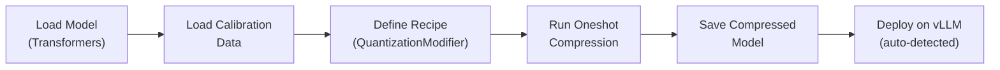
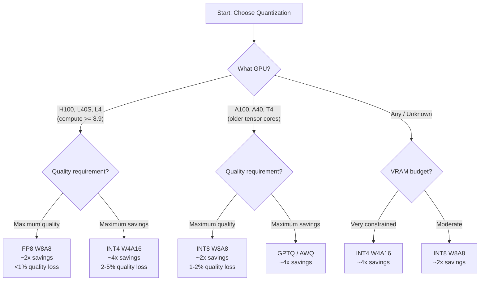

# L3-M3.2 -- Model Quantization and Optimization

**Level:** Expert
**Duration:** 45 min

## Overview

In [L1-M2.2](../../../level_1/M2_model_serving/2_deploying_gemma/) you deployed Gemma in full precision -- every weight stored as a 16-bit floating point number. That works, but it wastes GPU memory. A 7B-parameter model in FP16 consumes roughly 14 GB of VRAM just for the weights. Quantization reduces the numerical precision of those weights (and optionally activations) from 16 bits down to 8 or 4 bits, cutting VRAM usage by 2-4x with minimal impact on output quality. This lets you serve larger models on the same hardware, increase throughput by fitting more concurrent requests into memory, or reduce cost by using smaller GPUs.

This lesson covers the LLM Compressor library (`llmcompressor`) for quantizing models yourself, the RedHatAI pre-quantized model catalog on Hugging Face for skipping the quantization step entirely, and benchmarking to measure the actual trade-off between precision and performance.

## Prerequisites

- Completed: [L3-M3.1 -- LLM Deployment Strategies](../1_llm_d/)
- OpenShift AI cluster with at least one NVIDIA GPU (L4, A10G, A100, or H100)
- The Gemma4-e4b model deployed from [L1-M2.2](../../../level_1/M2_model_serving/2_deploying_gemma/) (used as the full-precision baseline for benchmarking)
- `oc` CLI authenticated to the cluster
- Familiarity with vLLM ServingRuntime and InferenceService concepts (covered in Level 1)

Verify GPU availability:

```bash
oc get nodes -l nvidia.com/gpu.present=true -o jsonpath='{range .items[*]}{.metadata.name}{"\t"}{.status.allocatable.nvidia\.com/gpu}{"\n"}{end}'
```

Expected output (example):

```
gpu-node-1    1
```

## Concepts

### Why Quantize?

Model weights are stored as floating-point numbers. The default precision is FP16 (16 bits per weight) or BF16 (bfloat16). Quantization reduces this precision to 8 bits (FP8, INT8) or 4 bits (INT4, GPTQ, AWQ). The arithmetic is straightforward:

- A 7B-parameter model in FP16: 7 billion * 2 bytes = **14 GB** of VRAM for weights alone
- The same model in FP8: 7 billion * 1 byte = **7 GB**
- The same model in INT4: 7 billion * 0.5 bytes = **3.5 GB**

The VRAM saved by quantization can be used for larger KV caches, which means more concurrent requests (higher throughput) or longer context lengths.

The trade-off is quality. Reducing precision introduces quantization error -- small differences in weight values that propagate through the model. For 8-bit quantization, the error is typically negligible (less than 1% accuracy degradation on standard benchmarks). For 4-bit, the error is more noticeable but often acceptable for interactive applications.

---

### Quantization Format Comparison

| Format | Bits | VRAM Savings | Quality Impact | GPU Requirement | Best For |
|--------|------|-------------|----------------|-----------------|----------|
| FP8 (W8A8) | 8 | ~2x | Minimal (<1% accuracy loss) | H100, L40S, L4 (compute capability >= 8.9) | Production inference |
| INT8 (W8A8) | 8 | ~2x | Low (1-2%) | A100, A40, T4 (older tensor cores) | Older GPU deployments |
| INT4 (W4A16) | 4 | ~4x | Moderate (2-5%) | Any NVIDIA GPU | VRAM-constrained environments |
| GPTQ | 4 | ~4x | Low-Moderate | Any NVIDIA GPU | Community standard, widely available |
| AWQ | 4 | ~4x | Low-Moderate | Any NVIDIA GPU | Activation-aware, better quality for chat |
| NVFP4 / MXFP4 | 4 | ~4x | Moderate | Blackwell (B100/B200) | Next-gen hardware |

> **FP8 requires Ada Lovelace or newer GPUs** (compute capability >= 8.9). This includes H100, L40S, and L4. Older GPUs like A100 and T4 do not support FP8 natively -- use INT8 instead. INT4/GPTQ/AWQ work on any NVIDIA GPU.

The naming convention for quantization formats:

- **W8A8** -- weights quantized to 8 bits, activations quantized to 8 bits
- **W4A16** -- weights quantized to 4 bits, activations kept at 16-bit precision
- **FP8_DYNAMIC** -- FP8 with dynamically computed scale factors (no calibration data needed at inference time)

---

### LLM Compressor

[LLM Compressor](https://github.com/vllm-project/llm-compressor) (`llmcompressor`, PyPI package) is the official vLLM/Red Hat AI quantization library. It is a Transformers-compatible library for applying compression algorithms to LLMs, optimized for deployment with vLLM. Key characteristics:

- **GA since RHOAI 2.25+** -- production-supported by Red Hat
- **Transformers-compatible** -- loads models with `AutoModelForCausalLM`, applies compression, saves in a format vLLM auto-detects
- **Oneshot quantization** -- no retraining required. Uses a small calibration dataset (typically 512 samples) to determine scale factors, then quantizes the weights in a single pass
- **Multiple schemes** -- supports FP8, INT8, INT4, GPTQ, AWQ, and sparse quantization

The workflow is:



The calibration data matters. Oneshot quantization uses a representative sample of text (typically 512 sequences from a dataset like FineWeb-Edu) to compute the scale factors that map FP16 values to lower-precision values. The calibration data should be representative of your deployment domain -- if you serve a coding assistant, calibrate on code samples rather than general text.

---

### RedHatAI Pre-Quantized Models

The `RedHatAI` organization on Hugging Face publishes pre-quantized models that are validated for vLLM deployment. These models have already been quantized and tested by Red Hat's AI team, so you can skip the quantization step entirely and go straight to deployment.

Examples:

| Model | Format | Original |
|-------|--------|----------|
| `RedHatAI/Qwen3-8B-FP8-dynamic` | FP8 W8A8 | Qwen/Qwen3-8B |
| `RedHatAI/granite-3.3-8b-instruct-FP8-dynamic` | FP8 W8A8 | ibm-granite/granite-3.3-8b-instruct |
| `RedHatAI/Llama-4-Scout-17B-16E-Instruct-FP8-dynamic` | FP8 W8A8 | meta-llama/Llama-4-Scout-17B-16E-Instruct |
| `RedHatAI/granite-3.3-2b-instruct-GPTQ-INT4` | GPTQ INT4 | ibm-granite/granite-3.3-2b-instruct |

Naming convention: `{model}-{format}-{method}`. For example, `granite-3.3-8b-instruct-FP8-dynamic` means the Granite 3.3 8B Instruct model, quantized to FP8 using the dynamic quantization method.

Using pre-quantized models is the recommended production path. Quantize yourself only when:

- No pre-quantized version exists for your model
- You need a specific quantization format not available in the catalog
- You want to fine-tune the calibration data for your domain

---

### Decision Matrix: When to Use Which Format



## Step-by-Step

### Step 1: Create a Workbench for Quantization

Quantization requires GPU access and a Python environment with `llmcompressor` installed. Launch a JupyterLab workbench in the OpenShift AI dashboard.

Open the OpenShift AI dashboard:

```bash
oc get route rhods-dashboard -n redhat-ods-applications -o jsonpath='{.spec.host}'
```

In the dashboard:

1. Navigate to **Data Science Projects** and open your project (or create a new one named `quantization-workspace`).
2. Click **Create workbench**.
3. Configure:
   - **Name:** `quantization-workbench`
   - **Image:** Standard Data Science (or PyTorch if available)
   - **Container size:** Large (4 CPU, 16 Gi memory)
   - **Accelerator:** NVIDIA GPU, count: 1
4. Click **Create workbench** and wait for it to start.

Alternatively, create the project via CLI:

```bash
oc new-project quantization-workspace \
  --display-name="Quantization Workspace" \
  --description="Workspace for model quantization with LLM Compressor"
```

Expected output:

```
Now using project "quantization-workspace" on server "https://api.example.com:6443".
```

### Step 2: Install LLM Compressor

Open a terminal in the workbench (or use `oc exec` to reach the workbench pod) and install the required packages:

```bash
pip install llmcompressor==0.5.1 datasets
```

Expected output (abbreviated):

```
Successfully installed llmcompressor-0.5.1 compressed-tensors-0.9.1 ...
```

Verify the installation:

```bash
python3 -c "import llmcompressor; print(f'llmcompressor version: {llmcompressor.__version__}')"
```

Expected output:

```
llmcompressor version: 0.5.1
```

### Step 3: Quantize a Model to FP8

This step uses the `quantize_model.py` script from the `scripts/` directory. The script loads a model from Hugging Face, applies FP8 quantization using a calibration dataset, and saves the compressed model.

Review the script:

```bash
cat scripts/quantize_model.py
```

The key components:

1. **Model loading** -- uses `AutoModelForCausalLM.from_pretrained()` with `device_map="auto"` to distribute across available GPUs
2. **Calibration data** -- loads 512 samples from `HuggingFaceFW/fineweb-edu` and tokenizes them
3. **Quantization recipe** -- defines a `QuantizationModifier` with `scheme="FP8_DYNAMIC"` targeting all `Linear` layers except `lm_head` (the output projection, which is kept at full precision to preserve quality)
4. **Oneshot compression** -- runs the quantization in a single pass over the calibration data
5. **Save** -- writes the compressed model with `save_compressed=True`

Run the quantization. This example uses `google/gemma-4-E4B-it` but you can substitute any model:

```bash
python3 scripts/quantize_model.py \
    --model google/gemma-4-E4B-it \
    --output ./gemma-4-e4b-fp8 \
    --num-samples 512 \
    --max-seq-len 2048
```

Expected output:

```
Loading model: google/gemma-4-E4B-it
Loading calibration data (512 samples)...
Running FP8 quantization...
Saving quantized model to: ./gemma-4-e4b-fp8
Done! Model is ready for vLLM deployment.
```

> **This step takes 10-30 minutes** depending on the model size and GPU type. For a 4B-parameter model on an L4 GPU, expect approximately 15 minutes. If you want to skip this step and use a pre-quantized model instead, proceed directly to Step 4.

Verify the output directory:

```bash
ls -lh ./gemma-4-e4b-fp8/
```

Expected output (key files):

```
total 4.5G
-rw-r--r-- 1 user user  1.2K config.json
-rw-r--r-- 1 user user  4.5G model.safetensors
-rw-r--r-- 1 user user  4.2M tokenizer.json
-rw-r--r-- 1 user user   800 quantization_config.json
...
```

The `quantization_config.json` file tells vLLM how to load the compressed weights. Inspect it:

```bash
cat ./gemma-4-e4b-fp8/quantization_config.json
```

You will see the `compressed-tensors` format descriptor that vLLM auto-detects at load time.

### Step 4: Deploy a Pre-Quantized Model from RedHatAI

For production deployments, use a pre-quantized model from the `RedHatAI` Hugging Face organization. This skips the quantization step entirely and gives you a model that Red Hat has already validated with vLLM.

In this step, you deploy `RedHatAI/granite-3.3-8b-instruct-FP8-dynamic` -- an FP8-quantized version of IBM's Granite 3.3 8B Instruct model.

Create the namespace:

```bash
oc new-project quantized-models \
  --display-name="Quantized Models" \
  --description="FP8-quantized model deployments"
```

Expected output:

```
Now using project "quantized-models" on server "https://api.example.com:6443".
```

Review and apply the ServingRuntime:

```bash
cat manifests/quantized-servingruntime.yaml
```

Key differences from the standard (full-precision) ServingRuntime in [L1-M2.2](../../../level_1/M2_model_serving/2_deploying_gemma/):

| Setting | Full Precision | FP8 Quantized |
|---------|---------------|---------------|
| `--model` | `google/gemma-4-E4B-it` | `RedHatAI/granite-3.3-8b-instruct-FP8-dynamic` |
| `--dtype` | `half` | `auto` (vLLM infers from quantized weights) |
| `--quantization` | Not set | `fp8` (tells vLLM to expect FP8 weights) |
| Image | `docker.io/vllm/vllm-openai:gemma4` | `quay.io/modh/vllm:stable` (Red Hat's validated image) |

Apply the ServingRuntime:

```bash
oc apply -f manifests/quantized-servingruntime.yaml
```

Expected output:

```
servingruntime.serving.kserve.io/granite-3-3-8b-fp8 created
```

Apply the InferenceService:

```bash
oc apply -f manifests/quantized-inferenceservice.yaml
```

Expected output:

```
inferenceservice.serving.kserve.io/granite-3-3-8b-fp8 created
```

Wait for the model to load. FP8 models load faster than their full-precision equivalents because there is less data to transfer from storage to GPU memory:

```bash
oc get inferenceservice granite-3-3-8b-fp8 -n quantized-models -w
```

Expected output progression:

```
NAME                  URL   READY   PREV   LATEST   AGE
granite-3-3-8b-fp8          False                    10s
granite-3-3-8b-fp8          False                    30s
granite-3-3-8b-fp8    ...   True                     2m
```

Once `READY` is `True`, verify the model responds:

```bash
QUANTIZED_URL=$(oc get inferenceservice granite-3-3-8b-fp8 -n quantized-models -o jsonpath='{.status.url}')

curl -sk "${QUANTIZED_URL}/v1/models" | python3 -m json.tool
```

Expected output:

```json
{
    "object": "list",
    "data": [
        {
            "id": "granite-3-3-8b-fp8",
            "object": "model",
            "created": 1700000000,
            "owned_by": "vllm"
        }
    ]
}
```

Send a test prompt:

```bash
curl -sk "${QUANTIZED_URL}/v1/chat/completions" \
  -H "Content-Type: application/json" \
  -d '{
    "model": "granite-3-3-8b-fp8",
    "messages": [{"role": "user", "content": "What is model quantization?"}],
    "max_tokens": 150,
    "temperature": 0.1
  }' | python3 -m json.tool
```

Expected output (abbreviated):

```json
{
    "choices": [
        {
            "message": {
                "role": "assistant",
                "content": "Model quantization is a technique used to reduce the computational and memory requirements of machine learning models..."
            }
        }
    ],
    "usage": {
        "prompt_tokens": 12,
        "completion_tokens": 150,
        "total_tokens": 162
    }
}
```

### Step 5: Deploy the Full-Precision Baseline

If you do not already have the original Gemma model deployed from [L1-M2.2](../../../level_1/M2_model_serving/2_deploying_gemma/), verify it is running:

```bash
oc get inferenceservice gemma-4-e4b -n gemma-model
```

Expected output:

```
NAME          URL                                                  READY   PREV   LATEST   AGE
gemma-4-e4b   https://gemma-4-e4b-gemma-model.apps.example.com     True                    5d
```

If it is not deployed, redeploy it by following the steps in [L1-M2.2](../../../level_1/M2_model_serving/2_deploying_gemma/). You need both endpoints running simultaneously to compare performance.

Get both endpoint URLs:

```bash
ORIGINAL_URL=$(oc get inferenceservice gemma-4-e4b -n gemma-model -o jsonpath='{.status.url}')
QUANTIZED_URL=$(oc get inferenceservice granite-3-3-8b-fp8 -n quantized-models -o jsonpath='{.status.url}')

echo "Original:  ${ORIGINAL_URL}"
echo "Quantized: ${QUANTIZED_URL}"
```

Expected output:

```
Original:  https://gemma-4-e4b-gemma-model.apps.example.com
Quantized: https://granite-3-3-8b-fp8-quantized-models.apps.example.com
```

### Step 6: Benchmark Original vs Quantized

Run the benchmark script to compare latency, throughput, and response quality between the two deployments:

```bash
python3 scripts/benchmark_quantized.py \
    --original-url "${ORIGINAL_URL}" \
    --quantized-url "${QUANTIZED_URL}" \
    --original-model gemma-4-e4b \
    --quantized-model granite-3-3-8b-fp8 \
    --num-requests 20
```

The script sends 20 requests to each endpoint using five standardized prompts, measuring:

- **Latency (mean, p50, p95)** -- total time from request to complete response
- **Throughput (tokens/second)** -- completion tokens generated per second
- **Quality** -- side-by-side response comparison for visual inspection

Expected output:

```
============================================================
Model Quantization Benchmark
============================================================

--- Original Model (gemma-4-e4b) ---
  Request 1/20... 3.45s, 43.5 tok/s
  Request 2/20... 3.12s, 48.1 tok/s
  ...

--- Quantized Model (granite-3-3-8b-fp8) ---
  Request 1/20... 2.31s, 64.9 tok/s
  Request 2/20... 2.18s, 68.8 tok/s
  ...

============================================================
RESULTS COMPARISON
============================================================
Metric                       Original    Quantized     Change
------------------------------------------------------------
Latency (mean)                 3.28s        2.24s     -31.7%
Latency (p50)                  3.15s        2.20s     -30.2%
Latency (p95)                  4.02s        2.65s     -34.1%
Throughput (mean)            45.8 t/s     66.2 t/s     +44.5%
Total tokens                    3000         3000

============================================================
QUALITY COMPARISON (first prompt)
============================================================
Prompt: Explain the concept of containerization in three sentences.

Original:
Containerization is a lightweight form of virtualization...

Quantized:
Containerization packages an application and its dependencies...
```

> **Note:** The exact numbers will vary based on your GPU hardware, model sizes, and cluster load. The relative improvement is what matters -- FP8 models typically show 20-40% latency reduction and 30-50% throughput increase compared to FP16, with negligible quality differences.

### Step 7: Analyze Results

Interpret the benchmark output across three dimensions:

**Latency** -- FP8 reduces latency because the GPU can process 8-bit operations faster than 16-bit operations on supported hardware. The improvement is more pronounced on H100 (which has dedicated FP8 tensor cores) than on L4.

**Throughput** -- The VRAM savings from FP8 allow vLLM to allocate a larger KV cache, which means more requests can be processed concurrently. If your deployment is throughput-bound (many concurrent users), quantization provides more benefit than the raw latency numbers suggest.

**Quality** -- Compare the responses side by side. For FP8, you should see no meaningful quality difference -- the responses may use slightly different wording but convey the same information with the same level of accuracy. If you notice significant quality degradation, it may indicate:

- The calibration data was not representative of the deployment domain
- The model architecture is particularly sensitive to quantization (rare for modern LLMs)
- The GPU does not natively support FP8 and is falling back to emulation

For production deployment, also consider:

| Metric | What to watch |
|--------|--------------|
| Memory usage | `oc exec <pod> -- nvidia-smi` -- VRAM consumption should be roughly half |
| Cold start time | Model loading is faster with FP8 (less data to transfer) |
| Cost | Same GPU serves more requests, reducing per-request cost |

Check GPU memory usage on the quantized model:

```bash
QUANTIZED_POD=$(oc get pods -n quantized-models -l serving.kserve.io/inferenceservice=granite-3-3-8b-fp8 -o jsonpath='{.items[0].metadata.name}')

oc exec -n quantized-models ${QUANTIZED_POD} -- nvidia-smi --query-gpu=memory.used,memory.total --format=csv,noheader
```

Expected output (example on L4 24GB):

```
12345 MiB, 23034 MiB
```

Compare with the full-precision model:

```bash
ORIGINAL_POD=$(oc get pods -n gemma-model -l serving.kserve.io/inferenceservice=gemma-4-e4b -o jsonpath='{.items[0].metadata.name}')

oc exec -n gemma-model ${ORIGINAL_POD} -- nvidia-smi --query-gpu=memory.used,memory.total --format=csv,noheader
```

The quantized model should use roughly half the VRAM of the full-precision model for weights, with additional savings in KV cache memory.

## Verification

Confirm the following before moving on:

| Check | How to verify |
|-------|---------------|
| LLM Compressor installed | `python3 -c "import llmcompressor"` succeeds in the workbench |
| Quantized model saved | `ls ./gemma-4-e4b-fp8/quantization_config.json` exists |
| FP8 ServingRuntime created | `oc get servingruntime granite-3-3-8b-fp8 -n quantized-models` returns the runtime |
| FP8 InferenceService ready | `oc get inferenceservice granite-3-3-8b-fp8 -n quantized-models` shows `READY=True` |
| Model responds to prompts | `curl` to the quantized endpoint returns a valid chat completion |
| Benchmark completed | `benchmark_quantized.py` output shows latency and throughput for both models |
| VRAM reduction confirmed | `nvidia-smi` on quantized pod shows lower memory usage than full-precision pod |

## Key Takeaways

- **FP8 quantization is the production default for modern GPUs.** On H100, L40S, and L4 hardware (compute capability >= 8.9), FP8 provides roughly 2x VRAM savings with less than 1% accuracy loss. For older GPUs (A100, T4), use INT8 instead.
- **LLM Compressor (`llmcompressor`) is the official vLLM/Red Hat AI quantization library.** It uses oneshot compression with calibration data -- no retraining required. The output format (`compressed-tensors`) is auto-detected by vLLM at load time.
- **RedHatAI pre-quantized models are the fastest path to production.** The `RedHatAI` Hugging Face organization publishes models that are already quantized and validated for vLLM. Use these unless you need a custom model or specific format.
- **Calibration data quality matters.** The 512 samples used for oneshot quantization should be representative of your deployment domain. Mismatched calibration data can increase quantization error.
- **Benchmark before deploying.** Always measure latency, throughput, and response quality on your specific hardware. The theoretical savings (2x for FP8, 4x for INT4) are upper bounds -- actual results depend on model architecture, GPU type, and workload pattern.

## Cleanup

```bash
# Delete the quantized model deployment
oc delete inferenceservice granite-3-3-8b-fp8 -n quantized-models
oc delete servingruntime granite-3-3-8b-fp8 -n quantized-models

# Delete the quantization workspace (if created)
oc delete project quantization-workspace

# Delete the quantized-models namespace
oc delete project quantized-models

# Remove local quantized model files (if created in Step 3)
rm -rf ./gemma-4-e4b-fp8
```

> **Note:** Keep the original Gemma model deployed in `gemma-model` if you are continuing to the next lesson.

## Next Steps

In [L3-M3.3 -- Multi-Model Serving](../3_multi_model/), you will deploy multiple models behind a single inference endpoint using vLLM's multi-model capabilities. Quantization becomes even more valuable in multi-model scenarios -- FP8 models consume less VRAM per model, allowing you to pack more models onto the same GPU.
