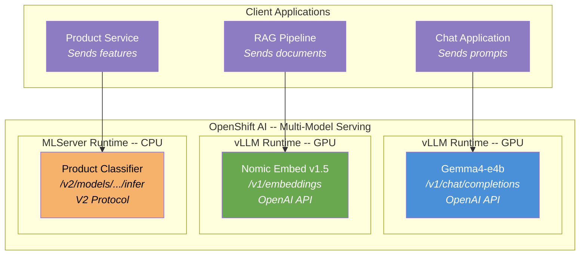
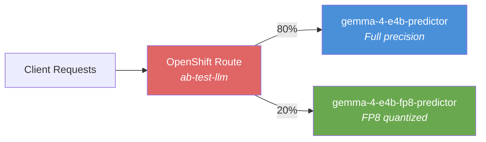

# L3-M3.3 -- Multi-Model Serving Patterns

**Level:** Expert
**Duration:** 45 min

## Overview

Production AI platforms rarely serve a single model. A typical deployment includes an LLM for text generation, an embedding model for RAG retrieval, and classical ML models for structured predictions -- each with different runtime requirements, API protocols, and resource profiles. In this lesson you deploy three models on the same OpenShift AI cluster using different runtimes, verify their distinct API endpoints, set up A/B testing between two LLM variants using OpenShift Route traffic splitting, and learn the resource planning strategies that keep GPU costs under control.

## Prerequisites

- Completed: [L3-M3.2 -- Model Quantization](../2_quantization/) (for the FP8 quantized model used in A/B testing)
- Completed: [L1-M2.2 -- Deploying Gemma4-e4b](../../../level_1/M2_model_serving/2_deploying_gemma/) (understanding of ServingRuntime and InferenceService)
- OpenShift AI 3.4+ cluster with at least two GPU nodes (one for the LLM, one for the embedding model)
- `oc` CLI authenticated with project-admin or cluster-admin privileges
- S3-compatible object storage configured as a data connection (for the sklearn model artifact)

Verify GPU availability:

```bash
oc get nodes -l nvidia.com/gpu.present=true -o custom-columns=\
NAME:.metadata.name,\
GPU:.status.capacity.nvidia\.com/gpu,\
ALLOCATABLE:.status.allocatable.nvidia\.com/gpu
```

Expected output (at least two GPUs total):

```
NAME                    GPU   ALLOCATABLE
gpu-worker-1            1     1
gpu-worker-2            1     1
```

## Concepts

### Multi-Model Architecture

A production AI platform serves multiple models, each optimized for a specific task. Rather than forcing everything through a single runtime, you match each model type to the runtime best suited for it:



Each model gets its own InferenceService and (optionally) its own ServingRuntime. This is the standard pattern -- models can scale, update, and fail independently. The alternative is multi-model serving behind a single endpoint, which llm-d supports for LLMs via model-aware routing (covered in [L3-M3.1](../1_llm_d/)).

---

### Three Serving Patterns

| Pattern | Runtime | API Protocol | GPU Required | Use Case |
|---------|---------|-------------|--------------|----------|
| **LLM (generative)** | vLLM | OpenAI `/v1/chat/completions` | Yes | Chat, summarization, code generation |
| **Embedding model** | vLLM with `--task embedding` | OpenAI `/v1/embeddings` | Yes | RAG retrieval, semantic search, similarity |
| **Classical ML** | MLServer | V2 `/v2/models/{name}/infer` | No (CPU only) | Classification, regression, anomaly detection |

The key insight: vLLM serves both generative and embedding models via the same OpenAI-compatible API, but on different endpoints. MLServer uses an entirely different protocol (V2 Inference Protocol) designed for structured tensor inputs.

---

### MLServer for Classical ML

MLServer is Seldon's inference runtime for traditional machine learning models. It is GA in OpenShift AI 3.4+ and ships as the `kserve-mlserver` ClusterServingRuntime.

**Why MLServer instead of a custom container?** In Kubernetes, deploying a scikit-learn model typically means writing a Flask/FastAPI wrapper, building a container image, and managing the server yourself. MLServer eliminates this -- you provide the serialized model artifact (pickle, joblib), point the InferenceService at it, and MLServer loads and serves it with a standards-compliant API.

Supported model formats:

| Format | Version | File Types |
|--------|---------|-----------|
| `sklearn` | v0, v1 | `.pkl`, `.joblib`, `.pickle` |
| `xgboost` | v1 | `.json`, `.ubj`, `.bst` |

MLServer exposes two ports:
- **8080** -- HTTP REST (V2 Inference Protocol)
- **9000** -- gRPC (V2 Inference Protocol)

The V2 Inference Protocol (also called KFServing V2 Dataplane) defines a standard request/response format:

```json
{
  "inputs": [
    {
      "name": "predict",
      "shape": [1, 4],
      "datatype": "FP64",
      "data": [[5.1, 3.5, 1.4, 0.2]]
    }
  ]
}
```

---

### Embedding Models on vLLM

vLLM supports embedding models via the same OpenAI-compatible API used for LLMs, but on the `/v1/embeddings` endpoint. The critical difference in the ServingRuntime is the `--task=embedding` flag, which tells vLLM to load the model for encoding rather than generation.

Good embedding model choices for OpenShift AI deployments:

| Model | Dimensions | Max Tokens | Size |
|-------|-----------|-----------|------|
| `nomic-ai/nomic-embed-text-v1.5` | 768 | 8192 | ~550 MB |
| `BAAI/bge-base-en-v1.5` | 768 | 512 | ~440 MB |
| `BAAI/bge-large-en-v1.5` | 1024 | 512 | ~1.3 GB |

Embedding models are smaller than generative LLMs and consume less GPU memory, but they still benefit from GPU acceleration for throughput. A single GPU can typically serve an embedding model alongside other workloads using `--gpu-memory-utilization` to cap memory usage.

---

### A/B Testing via Route Traffic Splitting

OpenShift Routes support weighted traffic splitting through `alternateBackends`. This is the same HAProxy-based routing you know from the main OpenShift tutorial, applied to model serving endpoints.



Key details:
- **Weights** are integers from 0 to 256 (default: 100)
- HAProxy distributes traffic proportionally based on weight ratios
- Use `oc set route-backends` to adjust weights without redeploying
- The `haproxy.router.openshift.io/balance: roundrobin` annotation ensures even distribution within each weight class
- Setting a backend weight to 0 sends no traffic to it (useful for instant rollback)

This is not canary deployment (which gradually shifts traffic based on error rates). A/B testing with Routes is static weight distribution -- you set the percentages and observe the results manually or with metrics.

---

### Model Fallback Chains

A fallback chain routes requests to a secondary model when the primary is overloaded or unavailable:

1. **Primary model** -- larger, higher quality (e.g., Gemma4-e4b full precision)
2. **Fallback model** -- smaller, faster (e.g., Gemma4-e4b FP8 quantized)

Implementation options:
- **llm-d EPP routing** -- llm-d's Endpoint Picker can route based on queue depth. When the primary model's queue exceeds a threshold, new requests go to the fallback. This is covered in [L3-M3.1](../1_llm_d/).
- **Custom middleware** -- a lightweight proxy (Envoy, nginx, or application code) that checks `/health` or `/metrics` on the primary and falls back when latency or queue depth exceeds limits.
- **Route weight adjustment** -- manually or via a script that monitors metrics and calls `oc set route-backends` to shift traffic.

---

### GenAI Playground

The OpenShift AI Dashboard includes a GenAI Playground feature (Technology Preview in 3.4+) for interactive model comparison. You select two deployed models and send the same prompt to both simultaneously. The playground displays responses side-by-side with latency and token count metrics, making it useful for quick qualitative comparisons before committing to a quantitative A/B test.

> The GenAI Playground is a Technology Preview feature. Its availability depends on your OpenShift AI version and configuration. See [L1-M1.6](../../../level_1/M1_platform_setup/6_genai_playground/) for setup details.

---

### GPU Sharing Strategies

Not every model needs a dedicated GPU. Planning resource allocation across multiple models is critical for cost control:

| Model Type | Typical Resources | GPU Required | Notes |
|-----------|-------------------|-------------|-------|
| LLM (4B params, FP16) | 1 GPU, 16 GB VRAM, 4 CPU, 16 Gi RAM | Yes | Dominates GPU memory |
| LLM (4B params, FP8) | 1 GPU, 8 GB VRAM, 4 CPU, 16 Gi RAM | Yes | ~50% VRAM savings from quantization |
| Embedding model (~500M params) | 1 GPU, 2 GB VRAM, 2 CPU, 8 Gi RAM | Yes (or CPU) | Small enough to share a GPU |
| Classical ML (sklearn) | 0 GPU, 1-2 CPU, 2-4 Gi RAM | No | CPU-only, lightweight |

GPU sharing approaches:
- **`--gpu-memory-utilization`** -- vLLM flag that caps the fraction of GPU memory a model can use. Set to `0.5` to leave room for another model on the same GPU.
- **NVIDIA MIG** -- Multi-Instance GPU partitions a single A100/H100 into isolated GPU instances. Each instance has dedicated memory and compute.
- **NVIDIA MPS** -- Multi-Process Service allows time-sharing a GPU across multiple processes. Less isolation than MIG but works on all NVIDIA GPUs.
- **Separate GPUs** -- the simplest approach. Each model gets its own GPU. No contention, no configuration, but higher cost.

For this lesson, we use the simplest approach: each GPU-based model gets its own GPU, and the classical ML model runs on CPU only.

## Step-by-Step

### Step 1: Create the Project

Create a dedicated namespace for multi-model serving:

```bash
oc new-project multi-model-serving
```

Expected output:

```
Now using project "multi-model-serving" on server "https://api.example.com:6443".
```

### Step 2: Deploy the LLM (vLLM)

If you already have Gemma4-e4b deployed from [L1-M2.2](../../../level_1/M2_model_serving/2_deploying_gemma/), you can reuse that deployment. Otherwise, deploy it in this namespace using the same ServingRuntime and InferenceService pattern from L1-M2.2.

Verify the LLM is running:

```bash
oc get inferenceservice gemma-4-e4b -n multi-model-serving
```

Expected output:

```
NAME          URL                                                           READY   AGE
gemma-4-e4b   https://gemma-4-e4b-multi-model-serving.apps.example.com      True    5m
```

If using an existing deployment in another namespace, note the service URL for later:

```bash
LLM_URL=$(oc get inferenceservice gemma-4-e4b -n multi-model-serving \
  -o jsonpath='{.status.url}')
echo $LLM_URL
```

### Step 3: Deploy the Embedding Model (vLLM)

The embedding model uses a separate ServingRuntime with the `--task=embedding` flag. Review the manifest:

```bash
cat manifests/embedding-inferenceservice.yaml
```

The ServingRuntime defines vLLM with embedding-specific configuration:

```yaml
args:
  - --port=8080
  - --model=nomic-ai/nomic-embed-text-v1.5
  - --served-model-name={{.Name}}
  - --task=embedding          # <-- This flag switches vLLM to embedding mode
  - --dtype=half
  - --max-model-len=8192      # Nomic supports up to 8192 tokens
  - --enforce-eager            # Disable CUDA graphs for smaller models
```

Apply the manifest (this creates both the ServingRuntime and InferenceService):

```bash
oc apply -f manifests/embedding-inferenceservice.yaml
```

Expected output:

```
servingruntime.serving.kserve.io/nomic-embed created
inferenceservice.serving.kserve.io/nomic-embed created
```

Wait for the model to become ready (the first startup downloads the model from Hugging Face):

```bash
oc get inferenceservice nomic-embed -n multi-model-serving -w
```

Expected output (after 2--5 minutes):

```
NAME          URL                                                           READY   AGE
nomic-embed   https://nomic-embed-multi-model-serving.apps.example.com      True    3m
```

Check the pod is running:

```bash
oc get pods -l serving.kserve.io/inferenceservice=nomic-embed -n multi-model-serving
```

Expected output:

```
NAME                                         READY   STATUS    RESTARTS   AGE
nomic-embed-predictor-abcde-12345            1/1     Running   0          3m
```

### Step 4: Deploy the Classical ML Model (MLServer)

First, apply the MLServer ServingRuntime:

```bash
oc apply -f manifests/mlserver-servingruntime.yaml
```

Expected output:

```
servingruntime.serving.kserve.io/mlserver-sklearn created
```

> If your cluster already has the `kserve-mlserver` ClusterServingRuntime (check with `oc get clusterservingruntime kserve-mlserver`), you can skip creating the namespace-scoped ServingRuntime and reference the cluster-scoped one in the InferenceService instead. The custom ServingRuntime in this lesson gives you explicit control over the configuration.

Before deploying the InferenceService, you need a model artifact in S3. If you do not have a pre-trained scikit-learn model, create a minimal one for testing:

```bash
# Create a simple sklearn model artifact (run in a workbench or local Python)
python3 -c "
from sklearn.datasets import load_iris
from sklearn.ensemble import RandomForestClassifier
import joblib

X, y = load_iris(return_X_y=True)
model = RandomForestClassifier(n_estimators=10, random_state=42)
model.fit(X, y)
joblib.dump(model, 'model.joblib')
print('Model saved to model.joblib')
"
```

Upload the model to your S3 bucket:

```bash
# Upload to S3 (adjust bucket name and endpoint for your data connection)
aws s3 cp model.joblib s3://models/product-classifier/model.joblib \
  --endpoint-url $S3_ENDPOINT
```

Now deploy the InferenceService:

```bash
oc apply -f manifests/mlserver-inferenceservice.yaml
```

Expected output:

```
inferenceservice.serving.kserve.io/product-classifier created
```

Wait for the model to load:

```bash
oc get inferenceservice product-classifier -n multi-model-serving -w
```

Expected output:

```
NAME                 URL                                                                  READY   AGE
product-classifier   https://product-classifier-multi-model-serving.apps.example.com      True    2m
```

### Step 5: Verify All Three Models

List all InferenceServices in the namespace to confirm all three models are running:

```bash
oc get inferenceservice -n multi-model-serving
```

Expected output:

```
NAME                 URL                                                                  READY   AGE
gemma-4-e4b          https://gemma-4-e4b-multi-model-serving.apps.example.com              True    15m
nomic-embed          https://nomic-embed-multi-model-serving.apps.example.com              True    10m
product-classifier   https://product-classifier-multi-model-serving.apps.example.com       True    5m
```

**Test the LLM (OpenAI Chat Completions API):**

```bash
LLM_URL=$(oc get inferenceservice gemma-4-e4b -n multi-model-serving \
  -o jsonpath='{.status.url}')

curl -s "$LLM_URL/v1/chat/completions" \
  -H "Content-Type: application/json" \
  -d '{
    "model": "gemma-4-e4b",
    "messages": [{"role": "user", "content": "What is OpenShift?"}],
    "max_tokens": 50
  }' | python3 -m json.tool
```

Expected output (abbreviated):

```json
{
    "id": "chatcmpl-abc123",
    "object": "chat.completion",
    "choices": [
        {
            "index": 0,
            "message": {
                "role": "assistant",
                "content": "OpenShift is Red Hat's enterprise Kubernetes platform..."
            },
            "finish_reason": "length"
        }
    ],
    "usage": {
        "prompt_tokens": 12,
        "completion_tokens": 50,
        "total_tokens": 62
    }
}
```

**Test the embedding model (OpenAI Embeddings API):**

```bash
EMBED_URL=$(oc get inferenceservice nomic-embed -n multi-model-serving \
  -o jsonpath='{.status.url}')

curl -s "$EMBED_URL/v1/embeddings" \
  -H "Content-Type: application/json" \
  -d '{
    "model": "nomic-embed",
    "input": "OpenShift AI provides a platform for machine learning."
  }' | python3 -m json.tool
```

Expected output (abbreviated):

```json
{
    "object": "list",
    "data": [
        {
            "object": "embedding",
            "index": 0,
            "embedding": [0.0234, -0.0567, 0.1234, ...]
        }
    ],
    "model": "nomic-embed",
    "usage": {
        "prompt_tokens": 10,
        "total_tokens": 10
    }
}
```

The `embedding` array contains 768 floating-point values (Nomic Embed v1.5's output dimension).

**Test the classical ML model (V2 Inference Protocol):**

```bash
ML_URL=$(oc get inferenceservice product-classifier -n multi-model-serving \
  -o jsonpath='{.status.url}')

curl -s "$ML_URL/v2/models/product-classifier/infer" \
  -H "Content-Type: application/json" \
  -d '{
    "inputs": [
      {
        "name": "predict",
        "shape": [1, 4],
        "datatype": "FP64",
        "data": [[5.1, 3.5, 1.4, 0.2]]
      }
    ]
  }' | python3 -m json.tool
```

Expected output:

```json
{
    "model_name": "product-classifier",
    "model_version": "1",
    "id": "request-abc123",
    "outputs": [
        {
            "name": "predict",
            "shape": [1, 1],
            "datatype": "INT64",
            "data": [0]
        }
    ]
}
```

Notice the three different API protocols:

| Model | Endpoint | Protocol |
|-------|----------|----------|
| Gemma4-e4b | `/v1/chat/completions` | OpenAI Chat API |
| Nomic Embed | `/v1/embeddings` | OpenAI Embeddings API |
| Product Classifier | `/v2/models/{name}/infer` | V2 Inference Protocol |

### Step 6: Set Up A/B Testing Between LLM Variants

To A/B test, you need two LLM variants. Deploy the FP8 quantized version from [L3-M3.2](../2_quantization/) into this namespace (if not already deployed). Both InferenceServices must be running and `READY: True`.

Verify both variants are available:

```bash
oc get inferenceservice -n multi-model-serving | grep gemma
```

Expected output:

```
gemma-4-e4b       https://gemma-4-e4b-multi-model-serving.apps.example.com        True    20m
gemma-4-e4b-fp8   https://gemma-4-e4b-fp8-multi-model-serving.apps.example.com    True    5m
```

Apply the A/B test Route:

```bash
oc apply -f manifests/ab-test-route.yaml
```

Expected output:

```
route.route.openshift.io/ab-test-llm created
```

Verify the Route and its backends:

```bash
oc get route ab-test-llm -n multi-model-serving
```

Expected output:

```
NAME          HOST/PORT                                                SERVICES                    PORT   TERMINATION   WILDCARD
ab-test-llm   ab-test-llm-multi-model-serving.apps.example.com        gemma-4-e4b-predictor(80%)   8080   edge          None
```

Check the detailed backend weights:

```bash
oc set route-backends ab-test-llm -n multi-model-serving
```

Expected output:

```
NAME                         KIND      TO      WEIGHT
routes/ab-test-llm           Service
  gemma-4-e4b-predictor                        80
  gemma-4-e4b-fp8-predictor                    20
```

Test the A/B route with multiple requests to observe traffic distribution:

```bash
AB_URL=$(oc get route ab-test-llm -n multi-model-serving \
  -o jsonpath='{.spec.host}')

# Send 10 requests and track which model responds
for i in $(seq 1 10); do
  MODEL=$(curl -sk "https://$AB_URL/v1/models" | \
    python3 -c "import sys,json; print(json.load(sys.stdin)['data'][0]['id'])")
  echo "Request $i: $MODEL"
done
```

Expected output (approximate 80/20 distribution):

```
Request 1: gemma-4-e4b
Request 2: gemma-4-e4b
Request 3: gemma-4-e4b
Request 4: gemma-4-e4b-fp8
Request 5: gemma-4-e4b
Request 6: gemma-4-e4b
Request 7: gemma-4-e4b
Request 8: gemma-4-e4b-fp8
Request 9: gemma-4-e4b
Request 10: gemma-4-e4b
```

> The distribution is probabilistic, not deterministic. With only 10 requests the split may not be exactly 80/20. With 100+ requests the ratio converges.

### Step 7: Adjust Traffic Weights

Shift to 50/50 for equal comparison:

```bash
oc set route-backends ab-test-llm -n multi-model-serving \
  --adjust gemma-4-e4b-predictor=50 gemma-4-e4b-fp8-predictor=50
```

Expected output:

```
route.route.openshift.io/ab-test-llm backends updated
```

Verify the new weights:

```bash
oc set route-backends ab-test-llm -n multi-model-serving
```

Expected output:

```
NAME                         KIND      TO      WEIGHT
routes/ab-test-llm           Service
  gemma-4-e4b-predictor                        50
  gemma-4-e4b-fp8-predictor                    50
```

To do a full cutover to the quantized model (e.g., after confirming quality is acceptable):

```bash
oc set route-backends ab-test-llm -n multi-model-serving \
  --adjust gemma-4-e4b-predictor=0 gemma-4-e4b-fp8-predictor=100
```

To roll back instantly:

```bash
oc set route-backends ab-test-llm -n multi-model-serving \
  --adjust gemma-4-e4b-predictor=100 gemma-4-e4b-fp8-predictor=0
```

This zero-downtime traffic management is one of the key advantages of OpenShift Routes over manually managing multiple endpoints.

### Step 8: Compare Models in GenAI Playground

If your OpenShift AI Dashboard has the GenAI Playground feature enabled (Technology Preview in 3.4+):

1. Open the OpenShift AI Dashboard.
2. Navigate to **GenAI Playground** in the left sidebar.
3. Select **Compare** mode.
4. Choose `gemma-4-e4b` as Model A and `gemma-4-e4b-fp8` as Model B.
5. Enter a test prompt, for example: "Explain the difference between supervised and unsupervised learning in three sentences."
6. Click **Submit** to send the same prompt to both models simultaneously.

The playground displays both responses side-by-side with:
- **Response text** -- qualitative comparison of output quality
- **Latency** -- time to first token and total generation time
- **Token count** -- prompt tokens and completion tokens for each model

This is useful for quick qualitative assessment before committing to a quantitative A/B test in production.

> If GenAI Playground is not available in your dashboard, you can achieve the same comparison manually by sending the same `curl` request to both model endpoints and comparing the outputs.

## Verification

Confirm the following before moving on:

```bash
# 1. All three InferenceServices are ready
oc get inferenceservice -n multi-model-serving
# Expected: gemma-4-e4b, nomic-embed, product-classifier all show READY=True

# 2. LLM responds on OpenAI Chat API
LLM_URL=$(oc get inferenceservice gemma-4-e4b -n multi-model-serving \
  -o jsonpath='{.status.url}')
curl -s "$LLM_URL/v1/models" | python3 -c "import sys,json; print(json.load(sys.stdin)['data'][0]['id'])"
# Expected: gemma-4-e4b

# 3. Embedding model responds on OpenAI Embeddings API
EMBED_URL=$(oc get inferenceservice nomic-embed -n multi-model-serving \
  -o jsonpath='{.status.url}')
curl -s "$EMBED_URL/v1/models" | python3 -c "import sys,json; print(json.load(sys.stdin)['data'][0]['id'])"
# Expected: nomic-embed

# 4. Classical ML model responds on V2 Protocol
ML_URL=$(oc get inferenceservice product-classifier -n multi-model-serving \
  -o jsonpath='{.status.url}')
curl -s "$ML_URL/v2/models/product-classifier" | python3 -c "import sys,json; print(json.load(sys.stdin)['name'])"
# Expected: product-classifier

# 5. A/B test Route exists with correct backends
oc set route-backends ab-test-llm -n multi-model-serving
# Expected: two backends with configured weights
```

## Key Takeaways

- Production AI platforms serve **multiple models with different runtimes**: vLLM for generative LLMs, vLLM with `--task embedding` for embedding models, and MLServer for classical ML models (scikit-learn, XGBoost). Each model gets its own InferenceService.
- **Three different API protocols** coexist on the same cluster: OpenAI Chat Completions (`/v1/chat/completions`), OpenAI Embeddings (`/v1/embeddings`), and V2 Inference Protocol (`/v2/models/{name}/infer`). Client applications must use the correct protocol for each model type.
- **MLServer eliminates custom container builds** for classical ML models. You provide a serialized model artifact (pickle, joblib) in S3, and MLServer loads and serves it with the V2 protocol. No Flask wrapper, no Dockerfile.
- **OpenShift Route traffic splitting** enables zero-downtime A/B testing between model variants. Use `oc set route-backends` to adjust weights dynamically -- shift from 80/20 to 50/50 to 0/100 without redeploying anything.
- **GPU resource planning** is critical when serving multiple models. Classical ML models run on CPU only, embedding models use modest GPU memory, and LLMs dominate GPU resources. Quantization (L3-M3.2) and GPU sharing strategies reduce cost per model.

## Cleanup

```bash
# Delete the A/B test Route
oc delete route ab-test-llm -n multi-model-serving

# Delete InferenceServices
oc delete inferenceservice product-classifier -n multi-model-serving
oc delete inferenceservice nomic-embed -n multi-model-serving
oc delete inferenceservice gemma-4-e4b -n multi-model-serving
oc delete inferenceservice gemma-4-e4b-fp8 -n multi-model-serving

# Delete ServingRuntimes
oc delete servingruntime mlserver-sklearn -n multi-model-serving
oc delete servingruntime nomic-embed -n multi-model-serving

# Delete the project
oc delete project multi-model-serving
```

## Next Steps

In [L3-M4.1 -- InstructLab: Synthetic Data Generation and Alignment](../../M4_advanced_fine_tuning/1_instructlab/), you move from serving models to improving them. InstructLab is Red Hat's open-source framework for generating synthetic training data and aligning models to specific domains using a taxonomy-driven approach. You will create a knowledge taxonomy, generate synthetic question-answer pairs, and fine-tune a model using the LAB (Large-scale Alignment for chatBots) methodology -- all orchestrated on OpenShift AI.
