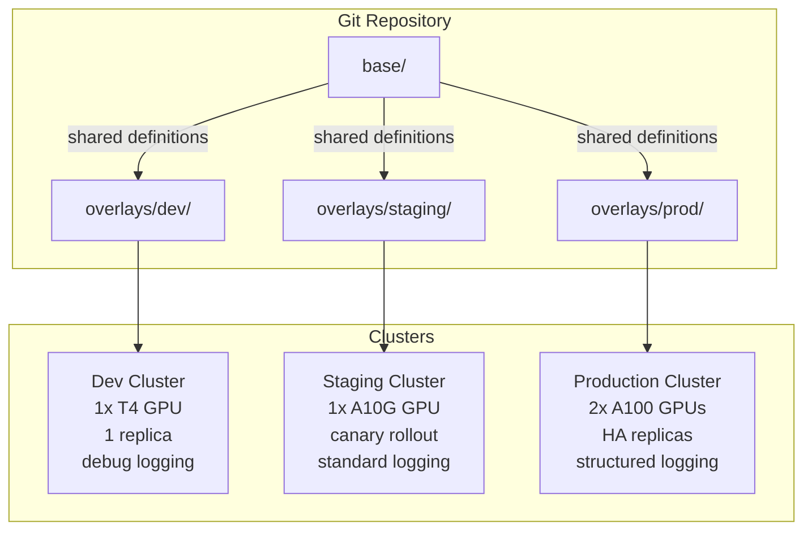
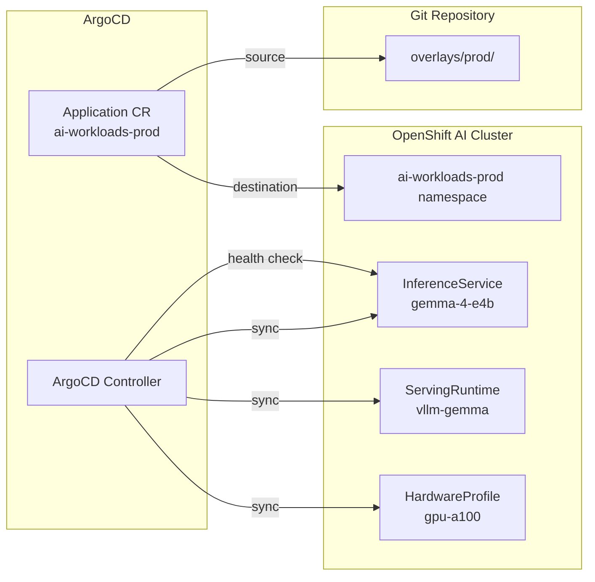
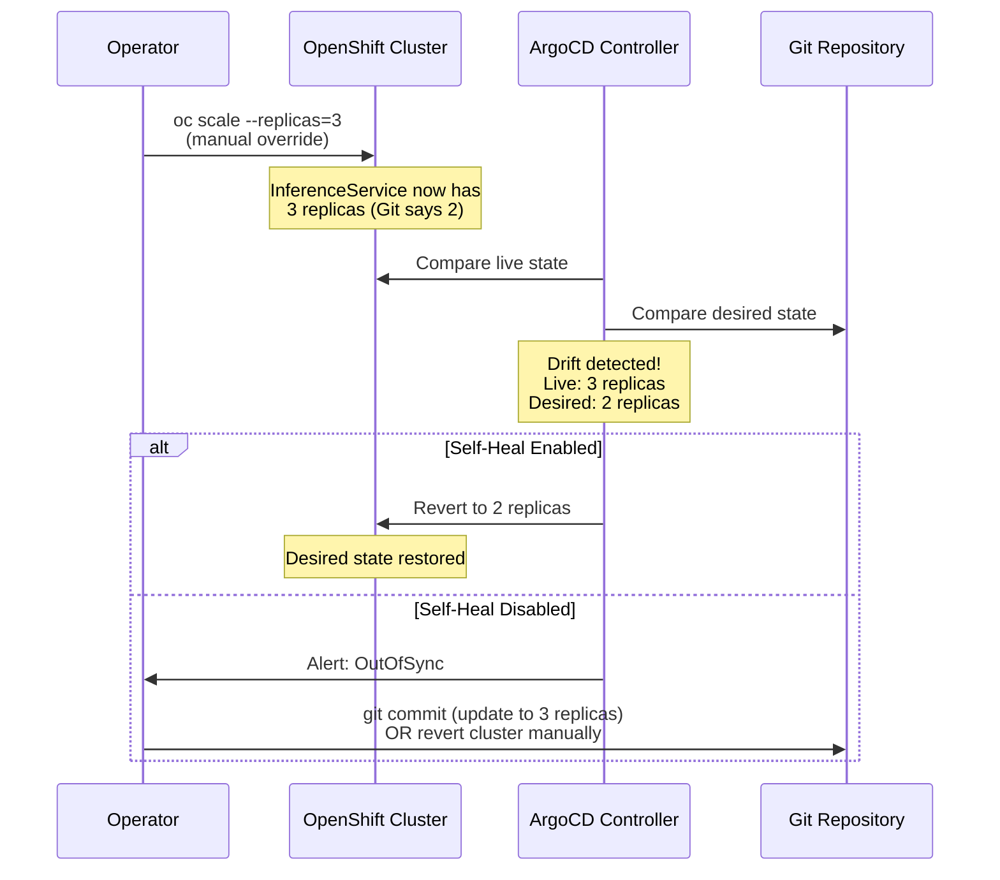

# L3-M5.1 -- GitOps for AI Workloads

**Level:** Expert
**Duration:** 1 hour

## Overview

GitOps -- the practice of declaring your desired infrastructure state in Git and letting a reconciliation agent (ArgoCD) enforce it -- is well established for traditional workloads. If you completed the main tutorial's [L09 -- GitOps](../../../../tutorial/L09_gitops/), you already know how to manage Deployments, Services, and Routes through ArgoCD.

AI workloads introduce unique GitOps challenges that vanilla Kubernetes workloads do not have:

1. **Model artifacts cannot live in Git.** A 4 GB model checkpoint does not belong in a Git repository. Instead, you store S3/OCI references in Git and the actual weights in object storage or a model registry.
2. **Inference configurations require environment-specific tuning.** A dev environment might use a single GPU with a small `--max-model-len`, while production needs multiple GPUs, higher memory utilization, and HA replicas.
3. **GPU resource allocations differ between environments.** Dev clusters may have T4s; production may have A100s. Hardware Profiles, node selectors, and tolerations vary accordingly.
4. **Custom resource types need ArgoCD health checks.** ArgoCD does not natively understand KServe `InferenceService` health -- you must configure custom resource health checks so ArgoCD can report accurate sync status.

This lesson applies GitOps principles to the OpenShift AI resources you have been building throughout this tutorial. You will create a Kustomize-based Git repository structure, configure ArgoCD to manage InferenceService deployments across environments, and demonstrate drift detection and self-healing for AI infrastructure.

## Prerequisites

- Completed: All Level 1 and Level 2 modules of this OpenShift AI tutorial
- Completed: L3-M1 through L3-M4 (governance, evaluation, advanced serving, fine-tuning)
- Familiarity with ArgoCD concepts (reference: main tutorial [L09 -- GitOps](../../../../tutorial/L09_gitops/))
- OpenShift GitOps operator installed on the cluster
- Cluster with GPU access (at least one NVIDIA GPU node)
- `oc` and `kubectl` CLI tools configured
- A Git repository you can push to (GitHub, GitLab, or Gitea)

## Concepts

### What to Store in Git for AI Workloads

The fundamental GitOps principle is that Git is the single source of truth for your desired state. For AI workloads, this means some resources belong in Git and others explicitly do not.

#### Resources that belong in Git

| Resource | API Group | Why |
|----------|-----------|-----|
| `DataScienceCluster` | `datasciencecluster.opendatahub.io/v2` | Tier 1 operator configuration -- which components are enabled |
| `InferenceService` | `serving.kserve.io/v1beta1` | Model deployment specification -- runtime, resources, scaling |
| `ServingRuntime` | `serving.kserve.io/v1alpha1` | Container configuration for the inference engine |
| `HardwareProfile` | `infrastructure.opendatahub.io/v1` | GPU allocation presets -- node selectors, tolerations, resource identifiers |
| Pipeline definitions | KFP YAML exports | Reproducible ML pipeline definitions |
| Model Registry configs | `modelregistry.opendatahub.io/v1alpha1` | Model catalog and versioning configuration |
| RBAC policies | `rbac.authorization.k8s.io/v1` | Roles, RoleBindings, ClusterRoles from L3-M1.1 |
| Kueue `ClusterQueue` / `LocalQueue` | `kueue.x-k8s.io/v1beta1` | GPU quota and scheduling policies |
| `Namespace` / `Project` | `v1` / `project.openshift.io/v1` | Environment namespaces |
| `NetworkPolicy` | `networking.k8s.io/v1` | Inference endpoint access control |

#### What NOT to store in Git

| Artifact | Why | Where it lives instead |
|----------|-----|----------------------|
| Model weights / checkpoints | Too large (GBs to TBs), binary files | S3 bucket, OCI registry, Hugging Face Hub |
| Secrets (API keys, credentials) | Security risk | OpenShift Secrets (sealed or external-secrets) |
| PVC data (training data, datasets) | Too large, changes frequently | Object storage (S3/MinIO) |
| TensorBoard logs | Ephemeral, high-volume | PVC or object storage |
| Inference response caches | Runtime state, not desired state | In-memory or Redis |

The key insight: Git stores the **declarative configuration** that tells OpenShift AI *how* to serve a model, not the model itself. The `InferenceService` manifest references a model by its S3 URI or OCI image -- ArgoCD deploys the configuration, and KServe pulls the model at runtime.

---

### Kustomize Overlays for AI Environments

AI workloads benefit heavily from Kustomize overlays because the differences between environments are significant and structured. A dev environment does not need (and often cannot get) the same GPU resources as production.



The overlay strategy for AI workloads:

| Layer | Contains | AI-Specific Concern |
|-------|----------|-------------------|
| **Base** | `InferenceService`, `ServingRuntime`, `HardwareProfile` with placeholders | Shared model format, container image, vLLM args |
| **Dev overlay** | Patches for 1 replica, small GPU, reduced `--max-model-len`, debug logging | Fast iteration, minimal GPU cost |
| **Staging overlay** | Patches for production-class GPU, canary rollout config, standard logging | Validate with real hardware before promoting |
| **Prod overlay** | Patches for HA replicas, full GPU allocation, resource limits, anti-affinity, tolerations | Reliability, performance, cost control |

This pattern avoids the common mistake of maintaining completely separate manifests per environment, which leads to configuration drift and forgotten patches.

---

### ArgoCD Application for AI Infrastructure

An ArgoCD `Application` CR defines what Git path to sync to which cluster and namespace. For AI workloads, the Application needs additional configuration that vanilla workloads do not require.



#### Custom Health Checks for KServe CRDs

ArgoCD does not natively understand OpenShift AI custom resources. Without custom health checks, ArgoCD will report an `InferenceService` as "Healthy" the moment the CR is created, even though the model is still loading (which can take minutes for large models).

You must configure ArgoCD with a Lua-based health check that inspects the `InferenceService` status conditions:

```lua
-- Custom health check for InferenceService
-- ArgoCD evaluates this Lua script to determine resource health
local health_status = {}
if obj.status ~= nil then
  if obj.status.conditions ~= nil then
    for _, condition in ipairs(obj.status.conditions) do
      if condition.type == "Ready" then
        if condition.status == "True" then
          health_status.status = "Healthy"
          health_status.message = "InferenceService is ready"
        else
          health_status.status = "Progressing"
          health_status.message = condition.message or "InferenceService is not ready"
        end
        return health_status
      end
    end
  end
end
health_status.status = "Progressing"
health_status.message = "Waiting for InferenceService status"
return health_status
```

This health check means ArgoCD will show "Progressing" while the model loads and "Healthy" only when the `InferenceService` is actually serving traffic.

#### Sync Waves

AI infrastructure has ordering dependencies. You cannot deploy an `InferenceService` before its `ServingRuntime` exists, and you cannot deploy either before the namespace and RBAC are in place.

ArgoCD sync waves handle this:

| Wave | Resources | Why |
|------|-----------|-----|
| 0 (default) | `Namespace`, `NetworkPolicy`, RBAC | Infrastructure must exist first |
| 1 | `HardwareProfile`, `ServingRuntime` | Runtime and hardware config before model deployment |
| 2 | `InferenceService` | Depends on ServingRuntime and HardwareProfile |
| 3 | Smoke test `Job` (optional) | Validate the model is serving correctly after deployment |

You set sync waves with an annotation:

```yaml
metadata:
  annotations:
    argocd.argoproj.io/sync-wave: "1"
```

#### Sync Policy: Auto vs Manual

For AI workloads, the sync policy decision is nuanced:

| Policy | When to use | AI-specific consideration |
|--------|-------------|--------------------------|
| **Automated + self-heal** | Production infrastructure (ServingRuntime, HardwareProfile) | Prevents manual drift, ensures consistency |
| **Automated + no self-heal** | Staging with canary configs | Allows temporary overrides for testing |
| **Manual** | Model version promotions | A human should approve deploying a new model version to production |

A common production pattern: use automated sync for the infrastructure (wave 0-1) but require manual approval for the `InferenceService` itself (wave 2), since deploying a new model version can affect inference quality.

---

### Drift Detection and Self-Healing

Drift is the divergence between the desired state (Git) and the actual state (cluster). In AI workloads, drift happens when:

1. **Someone manually scales an InferenceService** -- increases replicas to handle a traffic spike, then forgets to revert.
2. **A team member changes vLLM arguments** -- tweaks `--max-model-len` directly on the cluster for debugging.
3. **GPU resources are adjusted** -- reduces GPU requests to free up resources for another workload.

Without GitOps, these manual changes persist silently and cause problems later when someone deploys from Git and wonders why behavior changed.

ArgoCD detects drift by periodically comparing the live cluster state to the Git-declared state. When drift is detected:

- **Self-heal enabled:** ArgoCD automatically reverts the change to match Git. The cluster returns to the desired state within the sync interval (default: 3 minutes).
- **Self-heal disabled:** ArgoCD marks the Application as "OutOfSync" in the UI and sends alerts, but does not revert. A human investigates and decides whether to update Git or revert the cluster.



#### Handling Model Version Updates

Model version updates should flow through Git, not through direct cluster changes:

1. Data scientist validates a new model version in staging
2. Update the `InferenceService` manifest in Git (change the model URI or image tag)
3. Open a pull request for review
4. ArgoCD syncs the change to production after merge

This creates an auditable trail: every model version deployed to production has a corresponding Git commit, PR review, and approval.

---

### Validated Pattern Reference

Red Hat's [AI Generation with LLM and RAG](https://validatedpatterns.io/patterns/rag-llm-gitops/) Validated Pattern demonstrates a production GitOps setup for AI workloads. It uses:

- ArgoCD for continuous deployment
- Helm + Kustomize for environment configuration
- OpenShift AI components (KServe, vLLM)
- A vector database (pgvector/Milvus) managed through GitOps

The pattern is a useful reference architecture. This lesson teaches the same principles from scratch so you understand what the Validated Pattern does under the hood.

## Step-by-Step

### Step 1: Set Up the Git Repository Structure

Create the directory layout for a GitOps-managed AI workload. This structure separates shared configuration (base) from environment-specific patches (overlays).

```bash
# Create the directory structure
# In a real scenario, this would be a dedicated Git repository.
# For this tutorial, we create it locally.

mkdir -p ai-gitops-repo/{base,overlays/dev,overlays/prod}

# Verify the structure
find ai-gitops-repo -type d
```

Expected output:

```
ai-gitops-repo
ai-gitops-repo/base
ai-gitops-repo/overlays
ai-gitops-repo/overlays/dev
ai-gitops-repo/overlays/prod
```

Each directory serves a specific purpose:

| Directory | Purpose |
|-----------|---------|
| `base/` | Shared `InferenceService`, `ServingRuntime`, and `HardwareProfile` definitions |
| `overlays/dev/` | Dev patches: 1 replica, small GPU, debug logging |
| `overlays/prod/` | Prod patches: HA replicas, full GPU, resource limits, anti-affinity |

---

### Step 2: Create the Base Kustomize Manifests

The base directory contains the canonical definitions shared across all environments. Overlay-specific values (replicas, GPU type, memory) are intentionally set to reasonable defaults that overlays will patch.

Copy the manifests from this lesson's `manifests/base/` directory into your repo:

```bash
# Copy base manifests
cp manifests/base/*.yaml ai-gitops-repo/base/
```

Examine each base manifest:

**base/kustomization.yaml** -- references all resources:

```yaml
apiVersion: kustomize.config.k8s.io/v1beta1
kind: Kustomization

resources:
  - servingruntime.yaml
  - inferenceservice.yaml
  - hardware-profile.yaml

commonLabels:
  app.kubernetes.io/managed-by: argocd
  tutorial-level: "3"
  tutorial-module: "M5"
```

**base/inferenceservice.yaml** -- the InferenceService for Gemma:

```yaml
apiVersion: serving.kserve.io/v1beta1
kind: InferenceService
metadata:
  annotations:
    openshift.io/display-name: gemma-4-e4b
    serving.kserve.io/deploymentMode: RawDeployment
    security.opendatahub.io/enable-auth: "false"
    argocd.argoproj.io/sync-wave: "2"
  labels:
    opendatahub.io/dashboard: "true"
  name: gemma-4-e4b
spec:
  predictor:
    maxReplicas: 1
    minReplicas: 1
    model:
      modelFormat:
        name: vLLM
      resources:
        limits:
          cpu: "4"
          memory: 24Gi
          nvidia.com/gpu: "1"
        requests:
          cpu: "1"
          memory: 8Gi
          nvidia.com/gpu: "1"
      runtime: gemma-4-e4b
```

Notice the `sync-wave: "2"` annotation -- this ensures the InferenceService deploys after the ServingRuntime (wave 1).

**base/servingruntime.yaml** -- the vLLM runtime configuration:

```yaml
apiVersion: serving.kserve.io/v1alpha1
kind: ServingRuntime
metadata:
  annotations:
    opendatahub.io/apiProtocol: REST
    opendatahub.io/template-name: vllm-cuda-runtime-template
    argocd.argoproj.io/sync-wave: "1"
  labels:
    opendatahub.io/dashboard: "true"
  name: gemma-4-e4b
spec:
  containers:
    - args:
        - --port=8080
        - --model=google/gemma-4-E4B-it
        - --served-model-name={{.Name}}
        - --dtype=half
        - --max-model-len=8192
        - --gpu-memory-utilization=0.95
        - --enforce-eager
      command:
        - python3
        - -m
        - vllm.entrypoints.openai.api_server
      image: docker.io/vllm/vllm-openai:gemma4
      name: kserve-container
      ports:
        - containerPort: 8080
          protocol: TCP
  multiModel: false
  supportedModelFormats:
    - autoSelect: true
      name: vLLM
```

**base/hardware-profile.yaml** -- the GPU hardware profile:

```yaml
apiVersion: infrastructure.opendatahub.io/v1
kind: HardwareProfile
metadata:
  annotations:
    argocd.argoproj.io/sync-wave: "1"
  name: gpu-inference
spec:
  displayName: "GPU Inference Profile"
  description: "GPU profile for model inference workloads"
  enabled: true
  identifiers:
    - displayName: "NVIDIA GPU"
      identifier: "nvidia.com/gpu"
      defaultCount: 1
      minCount: 1
      maxCount: 1
  nodeSelectors:
    - key: "nvidia.com/gpu.product"
      value: "Tesla-T4"
  tolerations:
    - key: "nvidia.com/gpu"
      operator: "Exists"
      effect: "NoSchedule"
```

Verify the base renders correctly:

```bash
# Render the base Kustomize output (dry run)
oc kustomize ai-gitops-repo/base/
```

---

### Step 3: Create Environment Overlays

Overlays patch the base manifests with environment-specific values. This is where the AI-specific differences between dev and prod are expressed.

Copy the overlay manifests:

```bash
# Copy overlay manifests
cp manifests/overlays/dev/* ai-gitops-repo/overlays/dev/
cp manifests/overlays/prod/* ai-gitops-repo/overlays/prod/
```

**Dev overlay** (`overlays/dev/kustomization.yaml`):

```yaml
apiVersion: kustomize.config.k8s.io/v1beta1
kind: Kustomization

namespace: ai-workloads-dev

resources:
  - ../../base

patches:
  # Dev: single replica, smaller GPU footprint, shorter context, debug logging
  - target:
      kind: InferenceService
      name: gemma-4-e4b
    patch: |-
      - op: replace
        path: /spec/predictor/minReplicas
        value: 1
      - op: replace
        path: /spec/predictor/maxReplicas
        value: 1
      - op: replace
        path: /spec/predictor/model/resources/limits/memory
        value: "16Gi"
      - op: replace
        path: /spec/predictor/model/resources/requests/memory
        value: "4Gi"

  # Dev: reduce max-model-len and enable debug logging
  - target:
      kind: ServingRuntime
      name: gemma-4-e4b
    patch: |-
      - op: replace
        path: /spec/containers/0/args
        value:
          - --port=8080
          - --model=google/gemma-4-E4B-it
          - --served-model-name={{.Name}}
          - --dtype=half
          - --max-model-len=4096
          - --gpu-memory-utilization=0.90
          - --enforce-eager

  # Dev: use T4 GPU with dev-specific selector
  - target:
      kind: HardwareProfile
      name: gpu-inference
    patch: |-
      - op: replace
        path: /spec/displayName
        value: "GPU Inference Profile (Dev)"
      - op: replace
        path: /spec/description
        value: "Dev GPU profile -- single T4, reduced resources"
      - op: replace
        path: /spec/nodeSelectors
        value:
          - key: "nvidia.com/gpu.product"
            value: "Tesla-T4"
```

**Prod overlay** (`overlays/prod/kustomization.yaml`):

```yaml
apiVersion: kustomize.config.k8s.io/v1beta1
kind: Kustomization

namespace: ai-workloads-prod

resources:
  - ../../base

patches:
  # Prod: HA replicas, full GPU allocation, strict resource limits
  - target:
      kind: InferenceService
      name: gemma-4-e4b
    patch: |-
      - op: replace
        path: /spec/predictor/minReplicas
        value: 2
      - op: replace
        path: /spec/predictor/maxReplicas
        value: 4
      - op: replace
        path: /spec/predictor/model/resources/limits/cpu
        value: "8"
      - op: replace
        path: /spec/predictor/model/resources/limits/memory
        value: "48Gi"
      - op: replace
        path: /spec/predictor/model/resources/limits/nvidia.com~1gpu
        value: "1"
      - op: replace
        path: /spec/predictor/model/resources/requests/cpu
        value: "4"
      - op: replace
        path: /spec/predictor/model/resources/requests/memory
        value: "24Gi"
      - op: replace
        path: /spec/predictor/model/resources/requests/nvidia.com~1gpu
        value: "1"

  # Prod: full context length, optimized GPU utilization
  - target:
      kind: ServingRuntime
      name: gemma-4-e4b
    patch: |-
      - op: replace
        path: /spec/containers/0/args
        value:
          - --port=8080
          - --model=google/gemma-4-E4B-it
          - --served-model-name={{.Name}}
          - --dtype=half
          - --max-model-len=8192
          - --gpu-memory-utilization=0.95
          - --enforce-eager
          - --disable-log-requests

  # Prod: target A100 GPUs with production tolerations
  - target:
      kind: HardwareProfile
      name: gpu-inference
    patch: |-
      - op: replace
        path: /spec/displayName
        value: "GPU Inference Profile (Production)"
      - op: replace
        path: /spec/description
        value: "Production GPU profile -- A100 with HA configuration"
      - op: replace
        path: /spec/identifiers/0/displayName
        value: "NVIDIA A100"
      - op: replace
        path: /spec/nodeSelectors
        value:
          - key: "nvidia.com/gpu.product"
            value: "NVIDIA-A100-SXM4-40GB"
      - op: replace
        path: /spec/tolerations
        value:
          - key: "nvidia.com/gpu"
            operator: "Exists"
            effect: "NoSchedule"
          - key: "ai-workload"
            operator: "Equal"
            value: "production"
            effect: "NoSchedule"
```

Compare the dev and prod outputs:

```bash
# Render dev overlay
echo "=== Dev Environment ==="
oc kustomize ai-gitops-repo/overlays/dev/ | grep -A5 "replicas\|memory\|gpu\|max-model-len"

# Render prod overlay
echo "=== Prod Environment ==="
oc kustomize ai-gitops-repo/overlays/prod/ | grep -A5 "replicas\|memory\|gpu\|max-model-len"
```

You should see the key differences: dev has 1 replica with 16Gi memory and 4096 context length, while prod has 2 minimum replicas with 48Gi memory and 8192 context length.

---

### Step 4: Create the ArgoCD Application

The ArgoCD Application CR ties the Git repository to the target cluster and namespace. For AI workloads, it includes additional configuration for health checks and ignored fields.

First, create the target namespace:

```bash
# Create the production namespace for AI workloads
oc new-project ai-workloads-prod \
  --display-name="AI Workloads (Production)" \
  --description="GitOps-managed AI inference workloads"
```

Apply the ArgoCD Application manifest:

```bash
# Review the ArgoCD Application manifest
cat manifests/argocd-application.yaml

# Apply the ArgoCD Application
oc apply -f manifests/argocd-application.yaml -n openshift-gitops
```

Examine the key sections of the Application CR:

```yaml
apiVersion: argoproj.io/v1alpha1
kind: Application
metadata:
  name: ai-workloads-prod
  namespace: openshift-gitops
spec:
  source:
    repoURL: https://github.com/<your-org>/ai-gitops-repo.git
    targetRevision: main
    path: overlays/prod
  destination:
    server: https://kubernetes.default.svc
    namespace: ai-workloads-prod
  syncPolicy:
    automated:
      prune: true       # Remove resources deleted from Git
      selfHeal: true     # Revert manual changes on the cluster
    syncOptions:
      - CreateNamespace=true
      - RespectIgnoreDifferences=true
```

The `ignoreDifferences` section is critical for AI workloads. KServe controllers update `.status` and certain `.spec` fields on InferenceService resources. Without `ignoreDifferences`, ArgoCD would constantly detect these controller-managed fields as drift:

```yaml
  ignoreDifferences:
    - group: serving.kserve.io
      kind: InferenceService
      jsonPointers:
        - /status
        - /metadata/annotations/serving.kserve.io~1lastRolledoutRevision
```

---

### Step 5: Deploy and Observe Sync

Watch ArgoCD sync the AI workload resources to the cluster.

```bash
# Check the ArgoCD Application status
oc get application ai-workloads-prod -n openshift-gitops

# Watch the sync progress
oc get application ai-workloads-prod -n openshift-gitops -w
```

Expected output progression:

```
NAME                 SYNC STATUS   HEALTH STATUS
ai-workloads-prod    Synced        Progressing
```

The Application moves through these phases:

1. **OutOfSync** -- ArgoCD has read the Git repo but not yet applied resources.
2. **Synced / Progressing** -- Resources are applied. The InferenceService is created but the model is loading. ArgoCD reports "Progressing" because of the custom health check.
3. **Synced / Healthy** -- The InferenceService is ready and serving traffic. The custom health check confirms `status.conditions[Ready] == True`.

Verify the deployed resources:

```bash
# Check the namespace for synced resources
oc get all -n ai-workloads-prod

# Check InferenceService status
oc get inferenceservice gemma-4-e4b -n ai-workloads-prod -o jsonpath='{.status.conditions}' | jq .

# Check the ServingRuntime
oc get servingruntime -n ai-workloads-prod

# Check the HardwareProfile
oc get hardwareprofile -n ai-workloads-prod
```

You can also verify through the ArgoCD UI:

```bash
# Get the ArgoCD route
oc get route openshift-gitops-server -n openshift-gitops -o jsonpath='{.spec.host}'
```

Navigate to the ArgoCD UI in your browser. The `ai-workloads-prod` application should show a tree of synced resources with green health indicators.

---

### Step 6: Demonstrate Drift Detection and Self-Healing

This is where GitOps proves its value for AI workloads. Simulate a common scenario: someone manually scales the InferenceService to handle a traffic spike.

```bash
# Manually scale the InferenceService (bypassing Git)
oc patch inferenceservice gemma-4-e4b -n ai-workloads-prod \
  --type merge \
  -p '{"spec":{"predictor":{"minReplicas":5}}}'

# Verify the manual change took effect
oc get inferenceservice gemma-4-e4b -n ai-workloads-prod \
  -o jsonpath='{.spec.predictor.minReplicas}'
echo  # newline
# Should show: 5
```

Now watch ArgoCD detect and revert the drift:

```bash
# Check the Application sync status -- it should show OutOfSync
oc get application ai-workloads-prod -n openshift-gitops \
  -o jsonpath='{.status.sync.status}'
echo
# Should show: OutOfSync

# Wait for self-heal (default interval is 5 seconds for self-heal checks)
sleep 10

# Verify ArgoCD reverted the change
oc get inferenceservice gemma-4-e4b -n ai-workloads-prod \
  -o jsonpath='{.spec.predictor.minReplicas}'
echo
# Should show: 2 (the value from Git overlays/prod)
```

Check the ArgoCD events to see the self-heal in action:

```bash
# View ArgoCD Application events
oc describe application ai-workloads-prod -n openshift-gitops | grep -A 20 "Events:"
```

You should see events like:

```
Events:
  Type    Reason              Age   Message
  ----    ------              ----  -------
  Normal  OperationStarted    60s   Sync operation to ... started
  Normal  ResourceUpdated     58s   Updated InferenceService ai-workloads-prod/gemma-4-e4b
  Normal  OperationCompleted  57s   Sync operation completed successfully
```

This demonstrates the self-healing loop:

1. A manual change created drift (5 replicas instead of 2).
2. ArgoCD detected the drift within its sync interval.
3. ArgoCD automatically applied the Git-declared state (2 replicas).
4. The cluster returned to the desired state without human intervention.

**The correct way to scale:** If production genuinely needs 5 replicas, update the `overlays/prod/kustomization.yaml` in Git, open a pull request, get it reviewed, and merge. ArgoCD will then sync the approved change. This creates an audit trail and ensures the scaling decision is documented and reproducible.

## Verification

Run these checks to confirm the lesson succeeded:

```bash
# 1. ArgoCD Application is Synced and Healthy
oc get application ai-workloads-prod -n openshift-gitops \
  -o jsonpath='Sync: {.status.sync.status}, Health: {.status.health.status}'
echo
# Expected: Sync: Synced, Health: Healthy

# 2. InferenceService is running with the correct config from the prod overlay
oc get inferenceservice gemma-4-e4b -n ai-workloads-prod \
  -o jsonpath='Replicas: {.spec.predictor.minReplicas}-{.spec.predictor.maxReplicas}'
echo
# Expected: Replicas: 2-4

# 3. ServingRuntime exists and matches the prod overlay
oc get servingruntime gemma-4-e4b -n ai-workloads-prod \
  -o jsonpath='{.spec.containers[0].args}' | grep -o 'max-model-len=[0-9]*'
# Expected: max-model-len=8192

# 4. Manual changes are reverted by self-heal
oc patch inferenceservice gemma-4-e4b -n ai-workloads-prod \
  --type merge -p '{"spec":{"predictor":{"minReplicas":10}}}'
sleep 15
REPLICAS=$(oc get inferenceservice gemma-4-e4b -n ai-workloads-prod \
  -o jsonpath='{.spec.predictor.minReplicas}')
echo "Replicas after self-heal: $REPLICAS"
# Expected: 2 (reverted to Git state)
```

If all checks pass, GitOps is managing your AI workloads correctly.

## Key Takeaways

- Git is the single source of truth for AI infrastructure configuration -- but model weights, secrets, and data stay out of Git. Use S3/OCI references in your manifests instead.
- Kustomize overlays are the natural fit for AI environment differences: GPU types, replica counts, memory limits, and vLLM arguments all vary between dev and prod.
- ArgoCD requires custom Lua health checks for KServe CRDs. Without them, ArgoCD cannot accurately report whether an InferenceService is actually serving traffic.
- Sync waves enforce deployment ordering: infrastructure (wave 0) before runtimes (wave 1) before InferenceServices (wave 2).
- Drift detection and self-healing prevent the "someone manually changed production" class of problems that are especially dangerous for AI workloads, where misconfigured GPU resources or model parameters can cause silent quality degradation.
- Model version promotions should flow through Git PRs, creating an auditable trail of what model version was deployed, when, by whom, and why.

## Cleanup

```bash
# Delete the ArgoCD Application (this also deletes the synced resources
# because the Application has prune enabled)
oc delete application ai-workloads-prod -n openshift-gitops

# Verify resources were pruned
oc get inferenceservice -n ai-workloads-prod
# Expected: No resources found

# Delete the project
oc delete project ai-workloads-prod

# Remove the local repo directory
rm -rf ai-gitops-repo
```

## Next Steps

In the next lesson, [L3-M5.2 -- CI/CD for AI Applications](../2_cicd/), you will build a Tekton pipeline that automates the AI workload lifecycle: run model evaluation (LM Eval from L1-M5.1), update the model URI in Git, and trigger ArgoCD sync -- creating a complete continuous delivery pipeline for AI workloads on OpenShift.
